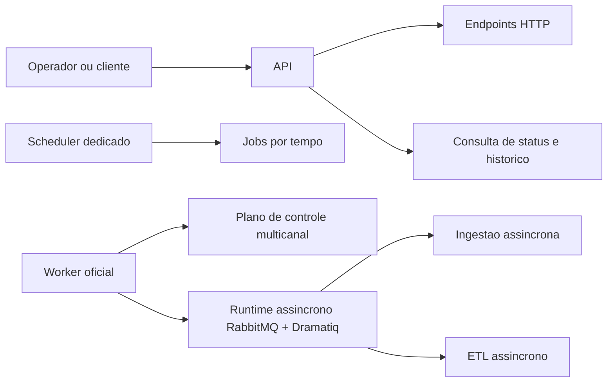

**Produto:** Plataforma de Agentes de IA

# Guia Didatico: Scheduler, Worker Oficial e Filas Operacionais

## Para quem e este guia

Este guia foi escrito para quem precisa operar a plataforma sem carregar a arquitetura antiga na cabeca.

Objetivo: explicar, em linguagem simples, quem recebe requisicoes, quem agenda rotinas, quem consome filas e como ler o estado real do dominio operacional ligado a canais, ingestao e ETL.

## Resumo em uma frase

Hoje a topologia operacional correta e esta: a API atende HTTP, o scheduler roda em processo proprio para jobs temporais e o worker oficial roda em processo proprio para o plano de controle multicanal e para o consumo assincrono de ingestao e ETL.

## Visao rapida

Em termos praticos:

1. API nao deve ser tratada como o lugar onde scheduler e worker vivem por efeito colateral.
2. Scheduler e worker nao sao a mesma coisa.
3. Ingestao e ETL assincronos dependem do worker oficial estar realmente pronto.

## O papel de cada processo

| Processo | O que faz de verdade | O que nao deve fazer |
|---|---|---|
| API | Recebe chamadas HTTP, valida contexto, agenda execucoes assincronas e expoe consultas de status e historico. | Nao deve ser tratada como host do scheduler e do worker por conveniencia. |
| Scheduler | Roda jobs por tempo, como restauracao de agendamentos e manutencao operacional. | Nao deve consumir a fila assincrona de ingestao e ETL. |
| Worker oficial | Sobe o plano de controle multicanal, inicializa o runtime assincrono e executa o shutdown coordenado. | Nao deve ser confundido com um segundo worker transitorio ou com consumidor espalhado pela API. |

## Como canais entram nessa historia

O worker oficial tambem e responsavel por subir o plano de controle multicanal. Em linguagem simples, isso quer dizer que o processo de worker concentra o que precisa ficar vivo para filas e supervisao operacional de canais.

O sinal minimo de saude aqui e o marker:

- MULTICHANNEL_SUPERVISOR_READY

Se esse marker nao apareceu, o worker ainda nao provou que o plano de controle multicanal ficou pronto.

## Como ingestao e ETL assincronos funcionam

Para ingestao e ETL assincronos, o contrato operacional atual usa RabbitMQ como backend de fila e Dramatiq como runtime de consumo. O worker unico sobe esse runtime e passa a consumir os dois fluxos no mesmo processo dedicado.

Os markers operacionais minimos sao:

1. INGESTION_READY
2. ETL_READY
3. WORKER_READY

Interpretacao pratica:

1. INGESTION_READY prova que o consumo assincrono de ingestao esta pronto.
2. ETL_READY prova que o consumo assincrono de ETL esta pronto.
3. WORKER_READY prova que o processo inteiro terminou o bootstrap e esta apto para operar.

Se a operacao enxergar somente a API viva, mas nao enxergar esses markers no worker, a leitura correta e: a superficie HTTP pode estar de pe, mas o dominio assincrono ainda nao provou saude completa.

## Onde Redis entra e onde RabbitMQ entra

Os dois recursos existem, mas com papeis diferentes.

| Recurso | Papel operacional atual |
|---|---|
| Redis | Lideranca, estados efemeros, progresso, coordenacao e filas de canal quando o contrato daquele canal exigir esse tipo de transporte. |
| RabbitMQ | Backend obrigatorio do fluxo assincrono de ingestao e ETL no worker unico. |

Isso evita uma confusao comum: Redis nao substitui o contrato assincrono de ingestao e ETL, e RabbitMQ nao substitui os estados operacionais que continuam centralizados em Redis.

## Como ler prontidao do worker sem adivinhacao

O worker oficial precisa contar a historia completa do bootstrap. A leitura minima esperada e esta:

1. MULTICHANNEL_SUPERVISOR_READY
2. INGESTION_READY
3. ETL_READY
4. WORKER_READY

No encerramento coordenado, a trilha minima esperada e esta:

1. WORKER_SHUTDOWN_START
2. ASYNC_RUNTIME_SHUTDOWN_COMPLETE
3. RUNTIME_BOOTSTRAP_SHUTDOWN_START
4. RUNTIME_BOOTSTRAP_SHUTDOWN_COMPLETE
5. WORKER_SHUTDOWN_COMPLETE

Em linguagem simples: o worker nao esta saudavel so porque o processo abriu. Ele fica operacional quando prova, por markers estruturados, que supervisor multicanal, ingestao e ETL chegaram ao estado de prontidao.

## Rotas que o operador precisa conhecer

| Necessidade | Superficie correta |
|---|---|
| Disparar ingestao | /rag/ingest |
| Disparar ETL | /rag/etl |
| Consultar historico duravel de ingestao | /ingestion-runs/query |
| Abrir detalhe operacional da ingestao | /ingestion-runs/detail |
| Acompanhar status por task_id | /status/{task_id} e stream correspondente |

## O que nao faz mais parte do desenho final

As instrucoes abaixo pertencem a caminhos antigos e nao devem voltar para a operacao:

1. tratar scheduler e worker como componentes hospedados no mesmo processo web por padrao;
2. orientar a operacao a depender de modos transitorios de decisao global para filas;
3. ensinar que a recuperacao operacional depende de um segundo worker paralelo para ingestao ou ETL;
4. misturar a leitura do dominio de canais com o contrato assincrono de ingestao e ETL como se fosse a mesma fila.

## Diagnostico rapido

| Sintoma | Leitura correta |
|---|---|
| API responde, mas o dominio assincrono nao anda | Verificar worker oficial e os markers de prontidao. |
| ETL aceitou 202, mas nao termina | Verificar se ETL_READY apareceu no worker e se o backend RabbitMQ esta configurado. |
| Ingestao foi aceita, mas a operacao nao sabe o estado final | Consultar /ingestion-runs/query e /ingestion-runs/detail; nao depender so da aceitacao inicial. |
| Scheduler parece parado | Validar o processo dedicado de scheduler, nao o lifecycle HTTP. |

## Resumo final

Se voce quiser guardar so a mensagem principal, guarde esta:

1. API atende HTTP.
2. Scheduler cuida de jobs por tempo em processo proprio.
3. Worker oficial cuida do plano de controle multicanal e do runtime assincrono de ingestao e ETL.
4. O worker unico precisa provar prontidao com markers estruturados, nao com suposicao.

## Evidencia no codigo

1. app/runners/worker_runner.py
2. src/api/services/async_job_dramatiq.py
3. src/api/startup/runtime_bootstrap.py
4. app/runners/scheduler_runner.py
5. docs/README-SCHEDULER.md
