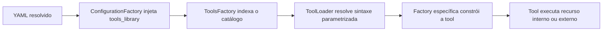

# Guia de Uso das Tools

Este guia explica como as tools entram no runtime agentic e como usar
as famílias avançadas sem confundir catálogo builtin com registro por
tenant.

## O que é tool neste projeto

Aqui, tool significa ferramenta usada por supervisor, deepagent ou
workflow.

O YAML escolhe a tool.
O runtime resolve a implementação real depois.

## Leitura relacionada

- Catálogo alfabético completo: [tools/alfabetica.md](./tools/alfabetica.md)
- Catálogo por problema de negócio: [tools/por_finalidade.md](./tools/por_finalidade.md)
- SQL dinâmico e procedures: [README-DYNAMIC-SQL-TOOLS.md](./README-DYNAMIC-SQL-TOOLS.md)
- APIs dinâmicas governadas: [README-DYNAMIC-API-TOOLS.md](./README-DYNAMIC-API-TOOLS.md)
- Catálogo governado por tenant: [README-INTEGRACOES-GOVERNADAS.md](./README-INTEGRACOES-GOVERNADAS.md)

## Fonte de verdade do catálogo

O catálogo builtin nasce no código.
ToolsLibraryBuilder varre decorators @tool e @tool_factory e sincroniza
o catálogo persistido.

ConfigurationFactory só injeta esse catálogo quando o YAML chega com a
chave tools_library presente e vazia.

Uso prático:

- tools_library ausente é erro;
- tools_library preenchida no YAML recebido também é erro;
- o catálogo builtin não deve ser editado manualmente no YAML.

## Como uma tool chega ao runtime

## Duas camadas diferentes de cadastro

### Catálogo builtin

Define a família técnica disponível para o runtime.

Exemplos:

- dyn_sql;
- dyn_api;
- proc_sql;
- schema_rag_sql.

### Registro governado por tenant

Define quais queries e operações publicadas podem ser usadas por uma
família dinâmica.

Tabelas observadas no código:

- integrations.sql_query_registry;
- integrations.api_operation_registry.

Em linguagem simples: o catálogo builtin diz que a família existe.
O registro por tenant diz qual item concreto dessa família pode rodar.

## Sintaxe parametrizada real

As famílias dinâmicas usam sintaxe curta no YAML.

- dyn_sql<query_id>
- proc_sql<procedure_id>
- dyn_api<endpoint_id>

ToolLoader extrai base e parâmetro e entrega o payload para a factory
certa.

## Famílias mais importantes

### dyn_sql

Use quando a query já existe e o agente só precisa preencher
parâmetros.

Ordem de resolução:

1. tools_config.sql_dynamic no próprio YAML.
2. integrations.sql_query_registry por query_code.

### proc_sql

Use quando a operação precisa passar por stored procedure aprovada.

### dyn_api

Use quando o endpoint HTTP já foi aprovado e descrito por contrato.

Ordem de resolução:

1. tools_config.api_dynamic no próprio YAML.
2. integrations.api_operation_registry por operation_code.

No registro persistido, dyn_api aceita apenas protocol_type igual a
rest_json.

### schema_rag_sql

Use quando a entrada é linguagem natural e a geração de SQL depende de
metadados de schema.

Esse caminho não substitui dyn_sql.
Ele resolve outro problema: gerar SQL a partir de contexto estrutural.

## Superfícies assistidas de produto

As rotas abaixo ajudam a escolher ou montar tools, mas não são tools em
si.

- GET /config/assembly/catalog
- GET /config/assembly/schema
- POST /config/assembly/recommend-tools
- POST /config/assembly/objective-to-yaml

Na prática, elas servem para autoria assistida e revisão governada.

## Guardrails comprovados no código

- referência local para tool inexistente gera diagnóstico semântico;
- dyn_sql e dyn_api exigem identificador técnico;
- consulta em registro persistido exige user_session.tenant_id;
- item em tabela precisa estar ativo e com publish_to_agents igual a
    true;
- dyn_api usa autenticação gerenciada e cache de token quando houver
    perfil de auth;
- dyn_sql usa retry para erro transitório de banco;
- schema_rag_sql depende de schema metadata habilitado.

## Como escolher a família certa

- Use dyn_sql para query já homologada.
- Use proc_sql para procedure homologada.
- Use dyn_api para endpoint HTTP homologado.
- Use schema_rag_sql para NL2SQL baseado em metadados.
- Use recommend-tools quando a dúvida for composição.
- Use objective-to-yaml quando a dúvida for autoria governada do YAML.

<!-- TOP20_REFERENCE_START -->

## Referência Definitiva Top 20 (Canônico + Alias)

Esta seção usa o ID canônico que o runtime deve resolver. Alias
documental é apenas uma forma antiga ou abreviada de falar da mesma
capacidade; na configuração nova, prefira sempre o ID canônico.

### Tool `dyn_api<endpoint_id>`

- ID canônico: `dyn_api<endpoint_id>`.
- Alias documental: `dyn_api<endpoint>`.
- Assinatura: chama endpoint HTTP governado por identificador publicado.
- Configuração YAML (autoria): declare a tool no agente usando o ID do endpoint aprovado.
- Payload técnico de factory (integração/testes): precisa de `endpoint_id` resolvido pela factory dinâmica.
- Credenciais obrigatórias: dependem do perfil de autenticação do endpoint registrado.
- Formato de retorno: resposta HTTP normalizada com status, corpo e metadados.
- Erros comuns: endpoint inexistente, não publicado para agentes ou sem tenant válido.
- Exemplo mínimo: usar uma operação HTTP já cadastrada para consultar um pedido.
- Exemplo completo: combinar endpoint aprovado, tenant, autenticação gerenciada e validação pelo assembly.

### Tool `dyn_sql<query_id>`

- ID canônico: `dyn_sql<query_id>`.
- Alias documental: `dyn_sql<query>`.
- Assinatura: executa query SQL governada por identificador publicado.
- Configuração YAML (autoria): declare a tool no agente usando o ID da query aprovada.
- Payload técnico de factory (integração/testes): precisa de `query_id` e parâmetros permitidos pela query.
- Credenciais obrigatórias: conexão SQL configurada para o tenant.
- Formato de retorno: linhas tabulares ou payload estruturado conforme a query.
- Erros comuns: query ausente, parâmetro obrigatório faltando ou query não publicada para agentes.
- Exemplo mínimo: consultar status de pedido por código.
- Exemplo completo: usar query governada com parâmetros validados e retorno limitado para o agente.

### Tool `proc_sql<procedure_id>`

- ID canônico: `proc_sql<procedure_id>`.
- Alias documental: `proc_sql<procedure>`.
- Assinatura: executa stored procedure homologada por identificador.
- Configuração YAML (autoria): declare a procedure aprovada como tool do agente.
- Payload técnico de factory (integração/testes): precisa de `procedure_id` e parâmetros aceitos pela procedure.
- Credenciais obrigatórias: conexão SQL com permissão para executar a procedure.
- Formato de retorno: payload definido pela procedure.
- Erros comuns: procedure não publicada, assinatura divergente ou permissão insuficiente.
- Exemplo mínimo: acionar procedure de consulta operacional.
- Exemplo completo: chamar procedure governada com validação de tenant e auditoria de execução.

### Tool `api_http_get`

- ID canônico: `api_http_get`.
- Alias documental: nenhum.
- Assinatura: faz chamada HTTP GET direta quando a configuração permitir.
- Configuração YAML (autoria): use apenas quando a URL e os limites estiverem governados.
- Payload técnico de factory (integração/testes): precisa de URL, headers permitidos e timeout.
- Credenciais obrigatórias: variam conforme o endpoint externo.
- Formato de retorno: status HTTP, headers relevantes e corpo.
- Erros comuns: URL não permitida, timeout ou resposta externa inválida.
- Exemplo mínimo: consultar um endpoint público controlado.
- Exemplo completo: chamada GET com timeout, autenticação configurada e tratamento de erro transitório.

### Tool `api_http_post_json`

- ID canônico: `api_http_post_json`.
- Alias documental: nenhum.
- Assinatura: faz chamada HTTP POST com corpo JSON.
- Configuração YAML (autoria): use apenas com contrato de payload e destino aprovado.
- Payload técnico de factory (integração/testes): precisa de URL, corpo JSON, headers e timeout.
- Credenciais obrigatórias: variam conforme o endpoint externo.
- Formato de retorno: status HTTP e corpo da resposta.
- Erros comuns: payload fora do schema, credencial ausente ou erro 4xx não recuperável.
- Exemplo mínimo: enviar uma solicitação JSON para API governada.
- Exemplo completo: POST autenticado com payload validado, retry para falha transitória e auditoria.

### Tool `http_get`

- ID canônico: `http_get`.
- Alias documental: nenhum.
- Assinatura: chamada HTTP GET genérica.
- Configuração YAML (autoria): restrinja uso a fluxos com destino controlado.
- Payload técnico de factory (integração/testes): precisa de URL e opções de requisição.
- Credenciais obrigatórias: dependem do serviço chamado.
- Formato de retorno: resposta HTTP normalizada.
- Erros comuns: chamada externa sem timeout, domínio não autorizado ou resposta não JSON quando o fluxo espera JSON.
- Exemplo mínimo: ler um recurso HTTP simples.
- Exemplo completo: consulta externa com headers, timeout e log de tentativa.

### Tool `http_post`

- ID canônico: `http_post`.
- Alias documental: nenhum.
- Assinatura: chamada HTTP POST genérica.
- Configuração YAML (autoria): use somente com destino e payload controlados.
- Payload técnico de factory (integração/testes): precisa de URL, corpo e opções de requisição.
- Credenciais obrigatórias: dependem do serviço chamado.
- Formato de retorno: resposta HTTP normalizada.
- Erros comuns: payload inválido, domínio não autorizado ou ausência de timeout.
- Exemplo mínimo: enviar payload simples para serviço aprovado.
- Exemplo completo: POST com autenticação, timeout, retry e validação do corpo de resposta.

### Tool `duckduckgo_search_wrapper`

- ID canônico: `duckduckgo_search_wrapper`.
- Alias documental: `duckduckgo_search`.
- Assinatura: executa busca web via DuckDuckGo.
- Configuração YAML (autoria): habilite quando o agente puder consultar web.
- Payload técnico de factory (integração/testes): precisa de consulta textual e limites de resultado.
- Credenciais obrigatórias: normalmente não exige chave dedicada.
- Formato de retorno: lista de resultados com título, URL e resumo.
- Erros comuns: consulta ampla demais ou uso sem política de fontes.
- Exemplo mínimo: pesquisar um termo público.
- Exemplo completo: busca com limite de resultados e posterior validação de fontes.

### Tool `google_serper_wrapper`

- ID canônico: `google_serper_wrapper`.
- Alias documental: `google_serper`.
- Assinatura: executa busca Google via Serper.
- Configuração YAML (autoria): habilite quando houver chave Serper configurada.
- Payload técnico de factory (integração/testes): precisa de consulta e parâmetros de busca.
- Credenciais obrigatórias: chave Serper no ambiente ou segredo do tenant.
- Formato de retorno: resultados de busca estruturados.
- Erros comuns: chave ausente, cota excedida ou consulta sem escopo.
- Exemplo mínimo: pesquisar notícia ou página pública.
- Exemplo completo: busca com credencial, limite e registro de fonte usada.

### Tool `tavily_search_wrapper`

- ID canônico: `tavily_search_wrapper`.
- Alias documental: `tavily_search`.
- Assinatura: executa busca web via Tavily.
- Configuração YAML (autoria): habilite quando a chave Tavily estiver configurada.
- Payload técnico de factory (integração/testes): precisa de consulta e limites.
- Credenciais obrigatórias: chave Tavily.
- Formato de retorno: resultados web com conteúdo resumido.
- Erros comuns: chave ausente, limite alto demais ou fonte sem validação.
- Exemplo mínimo: buscar contexto público recente.
- Exemplo completo: busca com recorte de domínio, limite e uso de fontes no raciocínio.

### Tool `brave_search_wrapper`

- ID canônico: `brave_search_wrapper`.
- Alias documental: `brave_search`.
- Assinatura: executa busca web via Brave Search.
- Configuração YAML (autoria): habilite quando houver chave Brave configurada.
- Payload técnico de factory (integração/testes): precisa de consulta e opções de busca.
- Credenciais obrigatórias: chave Brave Search.
- Formato de retorno: lista estruturada de resultados.
- Erros comuns: chave inválida, cota excedida ou consulta vaga.
- Exemplo mínimo: pesquisar página institucional.
- Exemplo completo: busca com filtros, limite e checagem de fonte antes de responder.

### Tool `json_parse`

- ID canônico: `json_parse`.
- Alias documental: nenhum.
- Assinatura: transforma texto JSON em estrutura manipulável.
- Configuração YAML (autoria): habilite para agentes que recebem JSON textual.
- Payload técnico de factory (integração/testes): precisa de string JSON.
- Credenciais obrigatórias: nenhuma.
- Formato de retorno: objeto ou lista parseada.
- Erros comuns: JSON inválido ou encoding inesperado.
- Exemplo mínimo: converter texto JSON em objeto.
- Exemplo completo: parsear JSON recebido de API antes de extrair campos relevantes.

### Tool `json_validate`

- ID canônico: `json_validate`.
- Alias documental: nenhum.
- Assinatura: valida se um texto ou objeto respeita formato JSON.
- Configuração YAML (autoria): habilite para fluxos que precisam checar payload.
- Payload técnico de factory (integração/testes): precisa de JSON e, quando aplicável, schema.
- Credenciais obrigatórias: nenhuma.
- Formato de retorno: resultado de validação com erro quando houver.
- Erros comuns: aceitar JSON inválido como texto comum.
- Exemplo mínimo: validar payload antes de enviar para API.
- Exemplo completo: validar JSON gerado pelo agente antes de persistir ou chamar integração.

### Tool `json_format`

- ID canônico: `json_format`.
- Alias documental: nenhum.
- Assinatura: formata JSON para leitura humana.
- Configuração YAML (autoria): habilite para fluxos de revisão ou diagnóstico.
- Payload técnico de factory (integração/testes): precisa de JSON válido.
- Credenciais obrigatórias: nenhuma.
- Formato de retorno: JSON indentado.
- Erros comuns: tentar formatar texto que não é JSON válido.
- Exemplo mínimo: deixar uma resposta JSON legível.
- Exemplo completo: formatar payload antes de apresentar para revisão humana.

### Tool `json_minify`

- ID canônico: `json_minify`.
- Alias documental: nenhum.
- Assinatura: remove espaços desnecessários de JSON válido.
- Configuração YAML (autoria): habilite quando tamanho do payload importar.
- Payload técnico de factory (integração/testes): precisa de JSON válido.
- Credenciais obrigatórias: nenhuma.
- Formato de retorno: JSON compacto.
- Erros comuns: minificar payload inválido ou perder legibilidade em etapa de auditoria.
- Exemplo mínimo: compactar JSON antes de envio.
- Exemplo completo: validar, compactar e enviar payload JSON para integração controlada.

### Tool `pandas_dataframe_wrapper`

- ID canônico: `pandas_dataframe_wrapper`.
- Alias documental: `pandas_dataframe_agent`.
- Assinatura: executa operações assistidas sobre dataframe.
- Configuração YAML (autoria): habilite em fluxos analíticos com dados tabulares.
- Payload técnico de factory (integração/testes): precisa de dataframe ou fonte tabular preparada.
- Credenciais obrigatórias: nenhuma por padrão; dependem da origem dos dados.
- Formato de retorno: resposta analítica ou dados derivados.
- Erros comuns: enviar arquivo sem leitura prévia ou permitir operação ampla demais.
- Exemplo mínimo: resumir colunas de uma planilha carregada.
- Exemplo completo: ler dados tabulares, filtrar, agregar e explicar o resultado ao usuário.

### Tool `pd_ler_planilha`

- ID canônico: `pd_ler_planilha`.
- Alias documental: nenhum.
- Assinatura: lê planilha para estrutura tabular.
- Configuração YAML (autoria): habilite quando o agente precisa abrir planilhas.
- Payload técnico de factory (integração/testes): precisa de caminho ou referência da planilha.
- Credenciais obrigatórias: dependem do storage de origem.
- Formato de retorno: dataframe ou representação tabular.
- Erros comuns: arquivo ausente, formato não suportado ou planilha grande sem limite.
- Exemplo mínimo: carregar uma planilha simples.
- Exemplo completo: ler planilha, validar colunas esperadas e preparar análise.

### Tool `pd_filtrar_planilha`

- ID canônico: `pd_filtrar_planilha`.
- Alias documental: nenhum.
- Assinatura: filtra linhas de uma planilha carregada.
- Configuração YAML (autoria): habilite em fluxos que precisam recortar dados tabulares.
- Payload técnico de factory (integração/testes): precisa de dataframe e condição de filtro.
- Credenciais obrigatórias: nenhuma depois da planilha carregada.
- Formato de retorno: subconjunto tabular.
- Erros comuns: coluna inexistente ou filtro ambíguo.
- Exemplo mínimo: filtrar pedidos por status.
- Exemplo completo: ler planilha, filtrar período e devolver subconjunto auditável.

### Tool `pd_agrupar_somar`

- ID canônico: `pd_agrupar_somar`.
- Alias documental: nenhum.
- Assinatura: agrupa dados e soma métricas.
- Configuração YAML (autoria): habilite em análises tabulares simples.
- Payload técnico de factory (integração/testes): precisa de dataframe, coluna de grupo e coluna numérica.
- Credenciais obrigatórias: nenhuma depois da planilha carregada.
- Formato de retorno: tabela agregada.
- Erros comuns: coluna numérica com texto ou grupo inexistente.
- Exemplo mínimo: somar vendas por loja.
- Exemplo completo: ler planilha, filtrar período e agrupar receita por categoria.

### Tool `pd_estatisticas_basicas`

- ID canônico: `pd_estatisticas_basicas`.
- Alias documental: nenhum.
- Assinatura: calcula estatísticas simples de dados tabulares.
- Configuração YAML (autoria): habilite para diagnóstico rápido de planilhas.
- Payload técnico de factory (integração/testes): precisa de dataframe e colunas alvo.
- Credenciais obrigatórias: nenhuma depois da planilha carregada.
- Formato de retorno: contagens, médias, mínimos, máximos e medidas básicas.
- Erros comuns: coluna ausente ou tipo incompatível.
- Exemplo mínimo: calcular média de uma coluna.
- Exemplo completo: ler planilha, validar tipos e gerar resumo estatístico por coluna.

<!-- TOP20_REFERENCE_END -->

## Como validar

1. Confirme que tools_library existe e chega vazia no YAML recebido.
2. Confirme que a família tem configuração pronta.
3. Se usar registro por tenant, confirme tenant_id e publish_to_agents.
4. Valide o YAML pelo fluxo agentic quando houver supervisor ou
     workflow.
5. Em execução, siga o correlation_id para separar erro de catálogo,
     erro de config e erro do recurso externo.

## Evidência no código

- src/agentic_layer/tools/tools_library_builder.py
- src/config/config_cli/configuration_factory.py
- src/agentic_layer/supervisor/tool_loader.py
- src/agentic_layer/supervisor/tools_factory.py
- src/agentic_layer/tools/domain_tools/dynamic_sql_tools/dynamic_sql_factory.py
- src/agentic_layer/tools/domain_tools/dynamic_api_tools/dynamic_api_factory.py
- src/agentic_layer/tools/domain_tools/dynamic_tool_registry_resolver.py
- src/agentic_layer/tools/domain_tools/schema_rag_tools/sql_schema_rag_factory.py
- src/api/routers/config_assembly_router.py

## Lacunas no código

Não encontrado no código.

Onde deveria estar:

- um inventário automático ligando cada item do catálogo builtin ao seu
    documento dono em docs;
- uma exportação administrativa pronta que una catálogo builtin e
    registros governados por tenant no mesmo relatório.
