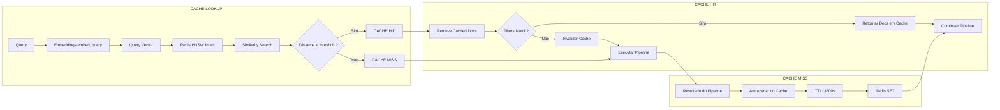

**Produto:** Plataforma de Agentes de IA

# Pipeline de Ingestão e RAG — compêndio definitivo

## Visão geral

Este documento consolida, em um único lugar, o pipeline de ingestão e o
pipeline de RAG da Plataforma de Agentes de IA. Ele descreve a ordem real de execução,
as técnicas implementadas, os componentes responsáveis e os fluxogramas
operacionais. O conteúdo foi construído a partir de leitura direta do
codebase e de documentação interna existente.

### Explicação conceitual

A ingestão transforma fontes diversas em chunks normalizados e indexados.
O RAG, por sua vez, recupera esses chunks com estratégias múltiplas e
monta uma resposta com evidências rastreáveis. Os dois pipelines são
complementares: sem ingestão consistente não há recuperação confiável,
e sem recuperação inteligente o conteúdo ingerido não gera respostas
precisas.

### Explicação for dummies

Pense em uma linha de montagem. A ingestão pega documentos e organiza em
"cartões" menores. O RAG é a parte que procura os cartões certos e monta
uma resposta com base neles. Se a linha de montagem estiver ruim, o RAG
não encontra nada bom. Se o RAG estiver ruim, mesmo cartões bons não
viram respostas úteis.

---

## Escopo, método e fonte de verdade

A fonte de verdade é o código. Os módulos auditados que embasam o
conteúdo estão listados abaixo. Se um módulo não aparece nesta lista,
ele não está descrito aqui e precisa de auditoria adicional para uma
cobertura total.

### Módulos auditados na ingestão

- src/ingestion_layer/main_orchestrator.py
- src/ingestion_layer/core/factories.py
- src/ingestion_layer/processors/base.py
- src/ingestion_layer/processors/pdf_processor.py
- src/ingestion_layer/processors/pdf_pipeline/pipeline_contracts.py
- src/ingestion_layer/processors/pdf_pipeline/pdf_extraction_stages.py
- src/ingestion_layer/processors/pdf_pipeline/pdf_text_processing_stages.py
- src/ingestion_layer/processors/pdf_ocr_service.py
- src/ingestion_layer/processors/pdf_table_service.py
- src/ingestion_layer/processors/pdf_pages_info_builder.py
- src/ingestion_layer/processors/pdf_reference_detector.py
- src/ingestion_layer/processors/pdf_metadata_builder.py
- src/ingestion_layer/pdf_tools/pdf_parsing_engine_contract.py
- src/ingestion_layer/pdf_tools/docling_pdf_parsing_engine.py
- src/ingestion_layer/pdf_tools/table_extractors/gmft_extractor.py
- src/ingestion_layer/processors/html_processor.py
- src/ingestion_layer/processors/web_processor.py
- src/ingestion_layer/processors/json_processor.py
- src/ingestion_layer/processors/excel_processor.py
- src/ingestion_layer/processors/docx_processor.py
- src/ingestion_layer/processors/ppt_processor.py
- src/ingestion_layer/processors/txt_processor.py
- src/ingestion_layer/processors/image_processor.py
- src/ingestion_layer/clients/web_scraping_client.py
- src/ingestion_layer/vector_stores/base.py
- src/ingestion_layer/core/metadata_reducer.py
- src/ingestion_layer/core/chunk_normalizer.py

### Módulos auditados no RAG

- src/qa_layer/content_qa_system.py
- src/qa_layer/rag_engine/intelligent_orchestrator.py
- src/qa_layer/rag_engine/processor.py
- src/qa_layer/rag_engine/query_analyzer.py
- src/qa_layer/rag_engine/query_rewriter.py
- src/qa_layer/rag_engine/adaptive_router.py
- src/qa_layer/rag_engine/retrievers.py
- src/qa_layer/rag_engine/fusion_algorithms.py
- src/qa_layer/rag_engine/reranker.py
- src/qa_layer/rag_engine/fts_postgres_retriever.py
- src/qa_layer/rag_engine/semantic_cache.py
- src/qa_layer/domain_specific_rag/domain_specific_rag.py
- src/qa_layer/json_rag/query_detector.py
- src/qa_layer/json_rag/specialized_rag.py
- src/qa_layer/json_rag/specialized_rag_excel.py

---

## Cobertura atual e pontos de atenção

- Conteúdos cobertos: PDFs técnicos com OCR e tabelas, sites técnicos/HTML,
  JSON estruturado e planilhas Excel.
- Recuperação: busca híbrida, BM25, FTS PostgreSQL, reranking neural e
  self-query por domínio.
- Limitações atuais: parsing layout-aware profundo, chunking hierárquico e
  tabelas estruturadas consolidadas.

## Regra de integridade do dataset vivo

- Para a ingestão, BM25, PostgreSQL e banco vetorial representam o mesmo acervo operacional.
- `vector_store.if_exists` deve reger esse conjunto inteiro, e não apenas o adapter do provider vetorial.
- `vector_store.if_exists` é obrigatório quando existe `vector_store`; ausência, tipo inválido ou valor fora de `overwrite`, `skip` e `update` deve falhar fechado.
- O runtime não deve aplicar `update` por default silencioso, porque isso pode alterar o dataset vivo sem decisão explícita no YAML.
- `overwrite` significa reconstruir o dataset vivo de forma coerente, sem deixar manifesto antigo, BM25 antigo ou pontos vetoriais antigos visíveis para o mesmo acervo lógico.
- `update` significa trocar a versão ativa do documento como unidade, sem expor metade do documento novo em um store e metade do documento antigo em outro.
- `skip` significa não avançar no dataset vivo quando a política do acervo mandar preservar o conjunto atual.
- `vector_store.incremental_indexing.respect_last_modified` é alias legado e não faz parte do contrato atual; use `vector_store.incremental_indexing.enabled`.
- Histórico operacional, auditoria e evidências de run não entram nessa limpeza destrutiva e devem ser tratados separadamente.

## Componentes canônicos do lifecycle do dataset

- Orquestrador de política do dataset: é o ponto único que decide o efeito operacional de `overwrite`, `update` e `skip` durante o preparo da ingestão. O objetivo prático é impedir que Qdrant e Azure Search mantenham regras próprias e divergentes para o mesmo YAML.
- Repositório canônico de dataset e gerações: é o componente que registra o dataset lógico por `tenant_code + vectorstore_id`, calcula a próxima geração, guarda os alvos físicos preparados e aponta qual geração está ativa para leitura.
- BM25 obrigatório no acervo: quando o acervo estiver configurado para usar BM25, a ingestão não pode prosseguir como se estivesse saudável se o índice textual falhar para iniciar, atualizar ou remover. Isso evita que PostgreSQL e banco vetorial avancem enquanto o BM25 fica antigo.
- Leitura e admin alinhados à geração ativa: busca híbrida, reidratação, drop e reindex do BM25 precisam resolver o `physical_bm25_target` da geração ativa antes de carregar ou alterar o índice. Se o target ativo não existir, o comportamento correto é falhar com erro explícito, não seguir com warning ou consulta vetorial silenciosa.

Leitura 101: pense nesses três componentes como o gerente, o livro-caixa e o índice da biblioteca. O gerente decide a política do acervo, o livro-caixa registra qual coleção está valendo agora, e o índice textual precisa acompanhar essa mesma coleção. Se um desses três ficar para trás, o dataset vivo deixa de ser íntegro.

---

## Fluxograma principal

```mermaid
flowchart TB
  Start([Inicio: Requisicao do Usuario]) --> Mode{Modo?}

  Mode -->|Ingestao| IngestionStart[ContentIngestionOrchestrator]
  IngestionStart --> DataSource[DataSource Factory]
  DataSource --> |Confluence/Web/TXT/DOCX/PDF/JSON/Excel/YouTube| Content[Conteudo Bruto]
  Content --> Processor[ContentProcessor]

  Processor --> ChunkStrategy{Estrategia de Chunking}
  ChunkStrategy -->|Adaptativo| AdaptiveChunk[Chunking Adaptativo]
  ChunkStrategy -->|Semantico| SemanticChunk[Chunking Semantico]
  ChunkStrategy -->|Estrutural| StructuralChunk[Chunking Estrutural]

  AdaptiveChunk --> Metadata[Metadados Enriquecidos]
  SemanticChunk --> Metadata
  StructuralChunk --> Metadata

  Metadata --> Embedding[Embedding Generation]
  Embedding --> VectorStore[Vector Store]
  VectorStore -->|Qdrant/Azure Search| BM25Index[BM25 Index]
  BM25Index --> IngestionEnd([Ingestao Completa])

  Mode -->|Consulta| QAStart[ContentQASystem]
  QAStart --> IntelligentOrch[IntelligentRAGOrchestrator]

  IntelligentOrch --> Rewrite{Reescrita habilitada?}
  Rewrite -->|Sim| QueryRewrite[QueryRewriter]
  Rewrite -->|Nao| Pipeline[Pipeline Inteligente]
  QueryRewrite --> Pipeline

  Pipeline --> Step1[1. Query Analysis]
  Step1 --> Analyzer[QueryAnalyzer]
  Analyzer -->|Features| Features[QueryFeatures: tipo, dominio, complexidade]

  Features --> Step2[2. Adaptive Routing]
  Step2 --> Router[AdaptiveQueryRouter]
  Router -->|RoutingDecision| Decision{Decisao de Roteamento}

  Decision -->|JSON_TOOLKIT| JSONProc[JSON Processor]
  Decision -->|HYBRID_SEARCH| HybridProc[Hybrid Processor]
  Decision -->|SELF_QUERY| SelfQueryProc[Self-Query Processor]
  Decision -->|MULTI_QUERY| MultiQueryProc[Multi-Query Processor]
  Decision -->|TRADITIONAL_RAG| TraditionalProc[Traditional Processor]

  JSONProc --> Step3[3. Query Expansion]
  HybridProc --> Step3
  SelfQueryProc --> Step3
  MultiQueryProc --> Step3
  TraditionalProc --> Step3

  Step3 -->|Sim| Expansion[DNIT Query Expansion]
  Step3 -->|Nao| Step4[4. Retrieval Execution]
  Expansion --> Step4

  Step4 --> CacheLookup{Cache Semantico por retriever?}
  CacheLookup -->|HIT| CachedDocs[Documentos em cache]
  CacheLookup -->|MISS| RetrievalType{Tipo de Retrieval}

  RetrievalType -->|Vector (texto/visao)| VectorRet[VectorStoreRetriever]
  RetrievalType -->|BM25| BM25Ret[BM25Retriever]
  RetrievalType -->|Hybrid| HybridRet[HybridRetriever]
  RetrievalType -->|FTS| FTSRet[FTSPostgresRetriever]

  VectorRet --> Docs[Documentos Recuperados]
  BM25Ret --> Docs
  HybridRet --> FusionStep[Fusion Processing]
  FTSRet --> Docs
  CachedDocs --> Docs

  FusionStep --> FusionAlgo{Algoritmo de Fusao}
  FusionAlgo -->|RRF| RRF[Reciprocal Rank Fusion]
  FusionAlgo -->|Weighted RRF| WRRF[Weighted RRF]
  FusionAlgo -->|Linear| Linear[Linear Combination]
  FusionAlgo -->|Interleaved| Interleaved[Interleaving]

  RRF --> Docs
  WRRF --> Docs
  Linear --> Docs
  Interleaved --> Docs

  Docs --> Step5[5. Access Control]
  Step5 --> ACL[AccessControlEvaluator]
  ACL --> FilteredDocs[Documentos Filtrados]

  FilteredDocs --> Step6[6. Reranking]
  Step6 --> Reranker[NeuralReranker]
  Reranker -->|Cross-Encoder| RankedDocs[Documentos Ranqueados]

  RankedDocs --> Step7[7. Generation]
  Step7 --> LLM[LLM Generation]
  LLM --> Answer[Resposta Final]

  Answer --> Telemetry[Telemetria e Metricas]
  Telemetry --> CacheUpdate[Atualizar Cache Semantico]
  CacheUpdate --> QAEnd([Consulta Completa])
```

---

## Pipeline de ingestão — ordem de execução e técnicas

### Explicação conceitual

O pipeline de ingestão segue um template method comum e aplica
especializações por tipo de conteúdo. Após a extração e limpeza, o
conteúdo é dividido em chunks, enriquecido com metadados e persistido
no vector store. Esse fluxo mantém rastreabilidade por documento e
prepara a base para o RAG.

### Explicação for dummies

A ingestão pega cada arquivo, transforma em texto útil, corta em partes
menores, coloca etiquetas e salva em um lugar onde o RAG vai buscar.

### 1) Orquestração e preparação

- Orquestração central do fluxo, validação de parâmetros e controle de
  execução assíncrona.
- Gerenciamento de telemetria, persistência e correlation_id.
- Resolução e injeção de credenciais via CredentialManager.

### 2) Seleção de fontes e clientes

- DataSourceFactory resolve origem de conteúdo.
- ContentClientFactory cria clientes por ContentType.
- Clientes multimodais para PDF, DOCX, PPT e Web quando necessário.

### 3) Processamento por tipo de conteúdo

Processamento segue o Template Method do BaseContentProcessor:

- Pré-processamento
- Extração do texto principal
- Limpeza e normalização
- Chunking
- Pós-processamento e hooks de erro

#### PDF

- Seleção do client `.pdf` com PdfMultimodalAdapterClient e delegação ao PdfContentProcessor.
- Pipeline de extração plugável por etapas explícitas: `ValidatePdfBytesStage`,
  `ApplyDocumentOcrStage`, `ParseViaEngineStage` e `ApplyEngineResultStage`.
- OCR documental é um estágio separado via `PdfDocumentOcrService`: só existe
  antes do parsing, usa a fila `processing.ocr.document_preprocessing.base.options`
  e hoje suporta apenas `ocrmypdf`.
- A decisão do OCR documental não depende mais de um único gatilho superficial:
  ela combina sinais fortes, sinais suaves e sinal de suporte, persistindo
  `primary_reason`, `matched_reasons`, `supporting_reasons` e `unmet_signals`
  para auditoria operacional.
- A seleção da parsing engine é determinística via lista ordenada em
  `processing.parsing.base.options`, respeitando `mode` por opção e
  `processing.parsing.failure_policy`.
- OCR por página é outra fila, via `PdfOcrService`, e só entra quando a página
  veio fraca durante o parsing; ele não substitui o OCR documental.
- Extração de tabelas usa `PdfTableService`, com fila local em
  `processing.tables.base.options` e resumo estruturado em metadata.
- O metadata operacional novo do PDF prioriza
  `metadata.operational_controls.execution_manifest` como trilha canônica por
  etapa; checkpoints legados ficam como leitura de compatibilidade para
  histórico antigo.
- Depois da extração base, o texto ainda passa pelo pipeline `pdf_text_processing`
  com preservação de estrutura, remoção de artefatos básicos e correção simples
  de artefatos de OCR.
- Se a base textual continuar vazia ou `ocr_on_empty_pages` estiver ativo, o
  processador ainda pode executar OCR leve pós-parse usando `PDFImageExtractor`
  mais a fila multimodal de OCR para recuperar texto residual.
- O multimodal oficial entra só depois da base textual: extrai imagens, filtra
  ruído, executa OCR visual, descrição e vision embedding, e então cria chunks
  multimodais ou faz fallback textual conforme `strict_mode`.
- Em fan-out remoto, o runtime do PDF também isola breaker, runtime serializado
  e logs por escopo tenant+documento quando o contexto resolvido traz identidade
  suficiente.
- O chunking textual tenta estratégias na ordem página, seção, parágrafo e
  sentença; se nenhuma gerar chunks válidos, cai no `fallback_simple`.
- Sinais de página com `PdfPagesInfoBuilder`, metadados com `PdfMetadataBuilder`
  e referências com `PdfReferenceDetector` continuam compondo o contrato final.

##### Multimodal (OCR, descrição e embedding visual)

**Explicação conceitual**
Quando o documento contém imagens relevantes (diagramas, fotos técnicas,
capturas de tela), o `MultimodalContentProcessor` pode enriquecer o conteúdo
com três sinais complementares:

1) OCR (texto “dentro” da imagem), 2) descrição (o que a imagem mostra) e
2) embedding visual (vetor numérico para busca por similaridade visual).
Esses sinais são gerados sob controle estrito do bloco local do PDF em
`ingestion.content_profiles.type_specific.pdf.multimodal.*`. O bloco global
`ingestion.multimodal_ai.*` continua existindo, mas para PDF ele serve apenas
como default reutilizável para chaves omitidas no bloco local.

**Explicação for dummies**
Sem multimodal, o sistema só entende o texto normal do PDF. Com multimodal, ele
também “lê” o texto que aparece numa figura, pede uma descrição do diagrama, e
cria um identificador numérico que ajuda a encontrar aquela imagem depois.
Isso é essencial quando as informações importantes estão em desenhos, tabelas
renderizadas como imagem ou fotos de obra.

**Onde configura**

- Habilitação do overlay multimodal do PDF: `ingestion.content_profiles.type_specific.pdf.multimodal.enabled`.
- Habilitação do OCR multimodal do PDF: `ingestion.content_profiles.type_specific.pdf.multimodal.ocr.enabled`.
- Habilitação da descrição visual do PDF: `ingestion.content_profiles.type_specific.pdf.multimodal.image_description.enabled`.
- Parsing principal do PDF: `ingestion.content_profiles.type_specific.pdf.processing.parsing.base.options`.
- OCR document-level: `ingestion.content_profiles.type_specific.pdf.processing.ocr.document_preprocessing.base.options`.
- OCR por página: `ingestion.content_profiles.type_specific.pdf.processing.ocr.base.options`.
- Tabelas: `ingestion.content_profiles.type_specific.pdf.processing.tables.base.options`.
- Extração de imagens: `ingestion.content_profiles.type_specific.pdf.multimodal.image_extraction.base.options`.
- OCR: `ingestion.content_profiles.type_specific.pdf.multimodal.ocr.base.options`.
- Descrição: `ingestion.content_profiles.type_specific.pdf.multimodal.image_description.base.options`.
- Embedding visual: `ingestion.content_profiles.type_specific.pdf.multimodal.vision_embedding.base.options`.

**Regra de escopo que o runtime segue hoje**

- PDF e imagem extraída de PDF usam apenas `ingestion.content_profiles.type_specific.pdf.multimodal.*`.
- Imagem avulsa, DOCX, PPT, Web e Confluence usam `ingestion.multimodal_ai.*`.
- Quando os dois blocos existem para PDF, o local vence; o global só completa o que estiver omitido.
- Não existe chave global `ingestion.content_processing.multimodal.enabled` controlando esse contrato.

**Regra prática importante**
Cada uma dessas filas é local e independente. A fila que lê o texto principal do PDF não é compartilhada com o OCR por página, com o OCR multimodal, com a descrição visual nem com o embedding visual.

**O que `preprocess_images` faz de verdade hoje**

**Explicação conceitual**
No runtime atual, `multimodal.ocr.preprocess_images` controla um pré-tratamento simples aplicado antes do OCR multimodal por imagem. Esse tratamento existe na implementação do `TesseractOCRProcessor` e não representa uma pipeline avançada de visão computacional. Quando a flag está ativa, o código tenta preparar a imagem para melhorar legibilidade antes de chamar o Tesseract. Se o pré-processamento falhar, o pipeline não aborta por isso: ele volta para a imagem original e segue o OCR.

**Explicação for dummies**
Pense nessa flag como um “ajeitar a foto antes de tentar ler”. O sistema não redesenha a imagem nem faz milagre. Ele só tenta deixá-la mais amigável para leitura automática. Se a figura vier pequena ou colorida demais, isso pode ajudar o OCR a enxergar melhor as letras. Se não ajudar, o sistema usa a imagem do jeito que ela veio, sem quebrar o pipeline.

**Comportamento real observado no código**

- Se `preprocess_images: true`, o `TesseractOCRProcessor` chama `_preprocess_image(...)` antes do OCR.
- Esse método converte a imagem para escala de cinza quando ela não está em modo `L`.
- Se a imagem for pequena demais, ele amplia até pelo menos `300x200` pixels antes de enviar ao Tesseract.
- Se der erro nesse tratamento, o código registra debug e usa a imagem original.
- No estado atual do código, esse pré-tratamento está implementado explicitamente no caminho do Tesseract multimodal. `EasyOCR` e `RapidOCR` processam os bytes recebidos sem usar essa mesma rotina.

**Impacto prático**

- Ajuda mais quando a imagem contém texto pequeno, screenshot compacta ou recorte reduzido do PDF.
- Não significa deskew, remoção avançada de ruído, binarização pesada nem correção semântica da imagem no OCR multimodal.
- Se o time ativar essa flag esperando “OCR inteligente completo”, a expectativa fica errada. O ganho aqui é incremental, não milagroso.

**Quando vale deixar `true`**

- PDFs técnicos com screenshots, diagramas com rótulos pequenos ou figuras recortadas.
- Casos em que o OCR visual já é importante e o custo extra de pré-tratamento é aceitável.

**Quando vale revisar com mais cuidado**

- Se o tenant usa majoritariamente `EasyOCR`, `RapidOCR` ou OCR cloud no multimodal e o time acha que essa flag altera igualmente todas as engines.
- Se o time precisa de pré-processamento mais pesado, porque o comportamento atual é deliberadamente simples.

**Exemplo completo de YAML canônico do bloco PDF**

Fonte real usada como referência: `app/yaml/system/rag-config-modelo.yaml`.

```yaml
content_profiles:
  type_specific:
    pdf:
      enabled: true
      chunk_size: 1600
      chunk_overlap: 280
      extract_images: true
      preserve_formatting: true
      extract_tables: true
      processing:
        parsing:
          failure_policy: "strict_first_success"
          merge_strategy: "nao_perde_sinal"
          base:
            options:
              - engine: "pymupdf"
                mode: "default"
              - engine: "docling"
                mode: "auto"
        ocr:
          enabled: true
          document_preprocessing:
            enabled: false
            base:
              options:
                - engine: "ocrmypdf"
                  mode: "default"
            analyze_max_pages: 12
            min_text_characters: 60
            min_text_density: 0.0002
            min_low_text_page_ratio: 0.6
            min_empty_page_ratio: 0.5
            skip_text: true
            deskew: true
            clean: false
            clean_final: false
            force_ocr: false
            redo_ocr: false
            jobs: 1
            optimize: 0
            invalidate_digital_signatures: false
          base:
            options:
              - engine: "gemini_flash_page_ocr"
                mode: "auto"
              - engine: "tesseract"
                mode: "auto"
              - engine: "rapidocr"
                mode: "auto"
              - engine: "easyocr"
                mode: "auto"
          languages: ["por", "eng"]
        tables:
          enabled: true
          format: "markdown"
          min_rows: 2
          max_columns: 12
          include_caption: true
          base:
            options:
              - engine: "ocr_layout"
                mode: "auto"
              - engine: "gmft"
                mode: "auto"
              - engine: "pdfplumber"
                mode: "auto"
              - engine: "unstructured"
                mode: "auto"
          min_text_characters: 60
          confidence_threshold: 45.0
          max_tables: 4
          column_cluster_tolerance: 45
          max_cells: 450
          ocr_dpi: 360
          psm: 6
          use_hocr: false
          extra_config: "--oem 1"
          unstructured_strategy: "hi_res"
      page_break_strategy: "smart"
      header_footer_removal: true
      allow_scanned_documents: true
      preprocessing:
        auto_rotate: true
        deskew: true
        enhance_contrast: true
        remove_background_noise: true
      metadata_enrichment:
        enabled: true
        infer_document_type: true
        custom_tags:
          dominio: "engenharia-rodoviaria"
          setor: "infraestrutura"
      page_classification:
        enabled: true
      quality_checks:
        min_confidence: 0.55
        reject_blank_pages: true
        allow_scanned_only: true
        enforce_text_ratio: 0.1
      attachment_processing:
        enabled: true
        include_drawings: true
        include_georeferenced_files: false
      multimodal:
        enabled: true
        image_extraction:
          enabled: true
          base:
            options:
              - engine: "pymupdf"
                mode: "default"
          min_image_size_bytes: 0
          min_page_coverage_ratio: 0.25
          min_dimensions: [50, 50]
          extract_embedded: true
          extract_inline: true
          preserve_metadata: true
          preserve_tables: true
          preserve_diagrams: true
        ocr:
          enabled: true
          base:
            options:
              - engine: "tesseract"
                mode: "default"
              - engine: "rapidocr"
                mode: "auto"
              - engine: "easyocr"
                mode: "auto"
              - engine: "gemini_flash_page_ocr"
                mode: "auto"
          confidence_threshold: 0.7
          preprocess_images: true
          languages: ["por", "eng"]
          fallback_enabled: false
          gemini_flash_page_ocr:
            model: "${GEMINI_2_FLASH}"
            api_key: "${GEMINI_API_KEY}"
            endpoint: "https://generativelanguage.googleapis.com/v1beta"
            timeout_seconds: 30
            retry_attempts: 5
            retry_wait_min_seconds: 0.5
            retry_wait_max_seconds: 8
            max_output_tokens: 2048
            temperature: 0.0
        image_description:
          enabled: true
          base:
            options:
              - engine: "openai"
                mode: "default"
              - engine: "local"
                mode: "auto"
          fallback_enabled: false
          max_description_length: 500
          include_technical_details: true
          classify_content: true
          confidence_threshold: 0.6
          openai:
            model: "gpt-4.1"
            max_tokens: 4000
            temperature: 0.1
        vision_embedding:
          enabled: false
          base:
            options:
              - engine: "google_genai"
                mode: "default"
          runtime:
            dimension: 1408
            source_unit: "image_bytes"
            pdf_max_pages_per_segment: 6
          google_genai:
            model: "${GEMINI_EMBEDDINGS_MULTIMODAL}"
            api_key: "${MULTIMODAL_VISION_API_KEY}"
            retry_attempts: 5
            retry_wait_min_seconds: 0.5
            retry_wait_max_seconds: 4.0
            timeout_seconds: 60.0
            project_id: "${GCP_PROJECT_ID}"
            location: "us-central1"
        context_window: 1000
        preserve_image_refs: true
        parallel_processing: true
        max_concurrent_images: 5
```

**Material dono do assunto**

- O manual consolidado do mecanismo de engines, com explicação 101, filas possíveis, credenciais por engine e diagramas, está em [README-INGESTAO.md](README-INGESTAO.md).
- O tutorial guiado de ponta a ponta do pipeline PDF está em [tutorial-101-ingestao-pdf.md](tutorial-101-ingestao-pdf.md).
- O pseudo-código detalhado do pipeline atual e o swimlane funcional cruzado do PDF também estão em [tutorial-101-ingestao-pdf.md](tutorial-101-ingestao-pdf.md).

Para o catálogo completo (classes/arquivos/nome no YAML) e a matriz atualizada
de filas, engines e credenciais, consulte [README-INGESTAO.md](README-INGESTAO.md)
na seção “Mecanismo real das filas de engine no PDF”.

#### HTML e Web

- HtmlContentProcessor converte HTML em texto com BeautifulSoup e fallback.
- WebContentProcessor adiciona pages_info e metadados de URL/status.
- Web scraping usa Playwright, html2text, BeautifulSoup e heurísticas de
  extração.

#### JSON

- JsonContentProcessor preserva estrutura, controla profundidade e perfis.
- Suporta domain processing quando configurado.

#### Excel

- ExcelContentProcessor extrai tabelas, schema e estatísticas.
- Gera conteúdo para chunking com metadados estruturados.
- ExcelSheetAnalyzer, em `src/ingestion_layer/processors/excel_sheet_analyzer.py`, e a única fonte autoritativa da análise estrutural.
- `src/ingestion_layer/clients/excel_client.py` mantém `ExcelContentAnalyzer` apenas como wrapper de compatibilidade interna para imports legados; ele não participa do runtime principal.

#### DOCX, PPT e TXT

- Extração de texto por biblioteca específica e chunking padrão.
- TXT aplica limpeza e chunking por parágrafos e sentenças.

#### Imagens

- ImageContentProcessor delega a pipeline multimodal para OCR e descrição.

**Observação importante**
Quando `vision_embedding.enabled=true`, o pipeline também gera embedding visual
da imagem e persiste o vetor (quando o vector store suporta), permitindo que o
RAG utilize busca por vetor visual na consulta.

Quando `vision_embedding.runtime.source_unit=pdf_segment_bytes`, o pipeline muda a
unidade canônica do embedding para segmentos determinísticos de PDF. Nesse modo,
o documento é dividido em blocos contíguos de até 6 páginas, cada bloco gera um
vetor multimodal e esse vetor é reutilizado pelas imagens pertencentes à mesma
faixa. O payload persiste `page_range`, `provider`, `model`, `dimensions` e
`source_unit` para rastreabilidade operacional.

### 4) Normalização e redução de metadados

- Padronização de metadados com standardize_metadata.
- Redução controlada por ChunkMetadataReducer para payload enxuto.

### 5) Vetorização e persistência

- Geração de embeddings via vector store configurado.
- Atualização de índice BM25 na persistência do vector store.
- Compatibilidade com híbrido nativo quando habilitado.

---

## Pipeline de ingestão detalhado

```mermaid
flowchart LR
  subgraph "1. ACQUISITION"
    DS[DataSource] -->|Confluence| ConfDS[ConfluenceDataSource]
    DS --> Client[IContentClient]
    Client -->|Web| WebClient[WebScrapingDatasourceMultimodalAdapterClient]
    Client -->|File| FileClient[FileClient]
    Client -->|YouTube| YTClient[YouTubeClient]
  end

  subgraph "2. PROCESSING"
    ConfDS --> Proc[IContentProcessor]
    WebClient --> Proc
    FileClient --> Proc
    YTClient --> Proc

    Proc -->|HTML| HTMLProc[HtmlProcessor]
    Proc -->|PDF| PDFProc[PdfProcessor]
    Proc -->|DOCX| DOCXProc[DocxProcessor]
    Proc -->|JSON| JSONProc[JsonProcessor]
    Proc -->|Excel| ExcelProc[ExcelProcessor]
    Proc -->|TXT| TXTProc[TxtProcessor]
  end

  subgraph "3. CHUNKING"
    HTMLProc --> Chunk[BaseContentProcessor._split_into_chunks]
    PDFProc --> Chunk
    DOCXProc --> Chunk
    JSONProc --> Chunk
    ExcelProc --> Chunk
    TXTProc --> Chunk

    Chunk --> Adaptive[_compute_adaptive_chunk_params]
    Adaptive --> |chunk_size, overlap| Split[RecursiveCharacterTextSplitter]
  end

  subgraph "4. ENRICHMENT"
    Split --> Meta[Metadata Builder]
    Meta --> Hash[ContentHashGenerator]
    Hash --> Keywords[RAKE Keyword Extractor]
  end

  subgraph "5. VECTORIZATION"
    Keywords --> Embed[Embeddings]
    Embed -->|OpenAI/Azure| Vector[Vector Embeddings]
  end

  subgraph "6. STORAGE"
    Vector --> VS{Vector Store Type}
    VS -->|Qdrant| Qdrant[(Qdrant VectorDB)]
    VS -->|Azure| Azure[(Azure AI Search)]

    Qdrant --> BM25[BM25 Vocabulary Builder]
    Azure --> BM25
    BM25 --> Postgres[(PostgreSQL)]
  end
```



---

## Pipeline de RAG — ordem de execução e técnicas

### Explicação conceitual

O pipeline de RAG analisa a pergunta, escolhe a melhor estratégia de
recuperação e monta uma resposta com evidências. Ele combina sinais
semânticos e lexicais, aplica reranking e registra métricas para
observabilidade.

### Explicação for dummies

O RAG lê a pergunta, decide como buscar, encontra as partes certas dos
documentos e monta a resposta com base no que encontrou.

### 1) Preparação e inicialização

- ContentQASystem inicializa LLM, embeddings, vector store e memória.
- Integra cache de embeddings e controle de acesso.

### 2) Orquestração inteligente

- IntelligentRAGOrchestrator coordena o pipeline com decisões automáticas.

### 3) Reescrita de consulta

- QueryRewriter opcional com políticas de correção, paráfrase e expansão.

### 4) Análise da query

- QueryAnalyzer extrai tipo de pergunta, domínio, complexidade e entidades.

### 5) Roteamento adaptativo

- AdaptiveQueryRouter define estratégia: semântico, BM25, híbrido, self-query.

### 6) Seleção do processador

- JSON RAG quando detector identifica consulta estruturada e há JSON.
- Self-query por domínio quando há filtros estruturados.
- Multi-query quando configurado.
- Retrieval tradicional para casos gerais.

### 7) Execução de retrieval

- VectorStoreRetriever com similarity search, MMR e threshold.
- BM25Retriever quando habilitado.
- FTSPostgresRetriever como recuperação lexical adicional.
- Retrieval híbrido com HybridFusion.

### 8) Fusão e deduplicação

- HybridFusion com RRF, Weighted RRF, linear e interleaving.
- Normalização e deduplicação por chave de documento.

### 9) Controle de acesso

- Filtragem de documentos por AccessControlEvaluator.

### 10) Reranking

- NeuralReranker com cross-encoder e pesos opcionais.

### 11) Geração e resposta

- Geração final com LLM e formatação de fontes.

### 12) Telemetria e cache semântico

- PipelineTelemetryRecorder registra métricas.
- SemanticQueryCache aplica cache semântico com Redis e HNSW.

---

## Pipeline de QA/Retrieval detalhado

```mermaid
flowchart TB
  subgraph "ETAPA 0: REESCRITA DA QUERY"
    Q[Query do Usuario] --> RewriteCheck{Reescrita habilitada?}
    RewriteCheck -->|Sim| Rewriter[QueryRewriter]
    RewriteCheck -->|Nao| QA
    Rewriter --> QA
  end

  subgraph "ETAPA 1: ANALISE DA QUERY"
    QA[QueryAnalyzer] --> Features{Query Features}
    Features -->|QueryType| Type[factual/procedural/conceptual/comparative]
    Features -->|DataType| Data[structured_json/unstructured_text/mixed]
    Features -->|Domain| Domain[technical/operational/regulatory]
    Features -->|Complexity| Complex[0.0-1.0]
  end

  subgraph "ETAPA 2: ROTEAMENTO ADAPTATIVO"
    Type --> AR[AdaptiveQueryRouter]
    Data --> AR
    Domain --> AR
    Complex --> AR

    AR --> Rules[Routing Rules]
    Rules --> Strategy{Retrieval Strategy}
    Strategy -->|Alta Complexidade| Hybrid[HYBRID_SEARCH]
    Strategy -->|JSON Query| JSONTool[JSON_TOOLKIT]
    Strategy -->|Filtros Estruturados| SelfQ[SELF_QUERY]
    Strategy -->|Multiplas Perspectivas| MultiQ[MULTI_QUERY]
    Strategy -->|Simples| Trad[TRADITIONAL_RAG]
  end

  subgraph "ETAPA 3: EXPANSAO DE QUERY"
    Hybrid --> Expand{Expansao Necessaria?}
    JSONTool --> Expand
    SelfQ --> Expand
    MultiQ --> Expand
    Trad --> Expand
    Expand -->|Sim - DNIT| DNIT[DnitQueryExpansionStep]
    Expand -->|Nao| Retrieve[Retrieval]
    DNIT --> Retrieve
  end

  subgraph "ETAPA 4: RETRIEVAL EXECUTION"
    Retrieve --> Cache{Cache Semantico por retriever?}
    Cache -->|HIT| CachedDocs[Documentos em cache]
    Cache -->|MISS| RetType{Tipo de Retriever}

    RetType -->|Vector (texto/visao)| VSRet[VectorStoreRetriever]
    RetType -->|BM25| BM25Ret[BM25Retriever]
    RetType -->|Hybrid| HybRet[HybridRetriever]
    RetType -->|FTS| FTSRet[FTSPostgresRetriever]

    VSRet -->|Similarity Search| VSDocs[Vector Documents]
    BM25Ret -->|Lexical Search| BM25Docs[BM25 Documents]
    HybRet --> Fusion[HybridFusion]
    FTSRet -->|Full-Text Search| FTSDocs[FTS Documents]

    Fusion -->|RRF/Weighted RRF/Linear| HybDocs[Hybrid Documents]
  end

  subgraph "ETAPA 5: ACCESS CONTROL"
    VSDocs --> ACL[AccessControlEvaluator]
    BM25Docs --> ACL
    HybDocs --> ACL
    FTSDocs --> ACL
    CachedDocs --> ACL

    ACL -->|Filtrar por Permissoes| Filtered[Documentos Autorizados]
  end

  subgraph "ETAPA 6: RERANKING"
    Filtered --> Rerank{Reranking Habilitado?}
    Rerank -->|Sim| NeuralRerank[NeuralReranker]
    Rerank -->|Nao| Final[Documentos Finais]

    NeuralRerank -->|Cross-Encoder| Scored[Documents + Scores]
    Scored -->|Feedback Score| Combined[Combined Score]
    Combined --> TopK[Top-K Selection]
    TopK --> Final
  end

  subgraph "ETAPA 7: GENERATION"
    Final --> Context[Build Context]
    Context --> Prompt[Prompt Template]
    Prompt --> LLM[LLM Invoke]
    LLM --> Response[Resposta Gerada]
  end

  subgraph "ETAPA 8: TELEMETRIA"
    Response --> Metrics[PipelineTelemetryRecorder]
    Metrics --> Record[Record Metrics]
    Record --> Token[Token Billing]
    Token --> Log[Structured Logging]
    Log --> UpdateCache[Update Semantic Cache]
  end
```

---

## Detalhamento: hybrid retrieval e fusao

```mermaid
flowchart LR
  subgraph "PARALLEL RETRIEVAL"
    Q[Query] --> V[Vector Retriever]
    Q --> B[BM25 Retriever]
    Q --> F[FTS Retriever]

    V -->|top_k=20| VDocs[20 docs - Vector]
    B -->|top_k=20| BDocs[20 docs - BM25]
    F -->|top_k=20| FDocs[20 docs - FTS]
  end

  subgraph "FUSION PROCESSING"
    VDocs --> Fusion[HybridFusion]
    BDocs --> Fusion
    FDocs --> Fusion

    Fusion --> Dedup[1. Deduplicacao]
    Dedup -->|document_key| Unique[Documentos Unicos]

    Unique --> Normalize[2. Normalizacao de Scores]
    Normalize -->|min-max/z-score| NormScores[Scores Normalizados]

    NormScores --> Algo{Algoritmo}

    Algo -->|RRF| RRFCalc[score = 1/(k + rank)]
    Algo -->|Weighted RRF| WRRFCalc[score = w1/(k+r1) + w2/(k+r2)]
    Algo -->|Linear| LinearCalc[score = w1*s1 + w2*s2]
    Algo -->|Interleaved| IntCalc[alternating docs]

    RRFCalc --> Combined[Combined Scores]
    WRRFCalc --> Combined
    LinearCalc --> Combined
    IntCalc --> Combined

    Combined --> Sort[3. Ordenacao]
    Sort --> TopK[4. Top-K Selection]
    TopK --> Result[Documentos Fusionados]
  end
```

---

## Detalhamento: reranking com feedback

```mermaid
flowchart TB
  subgraph "INPUT"
    Docs[Documentos Recuperados] --> Extract[Extrair Texto]
    Query[Query] --> Extract
  end

  subgraph "NEURAL RERANKING"
    Extract --> Pairs[Criar Pares query-doc]
    Pairs --> Model[Cross-Encoder Model]
    Model -->|sentence-transformers| NeuralScore[Neural Scores 0-1]
  end

  subgraph "FEEDBACK INTEGRATION"
    Docs --> Metadata[Extrair Metadata]
    Metadata --> FeedbackField{feedback_score existe?}

    FeedbackField -->|Sim| FeedbackScore[Feedback Score]
    FeedbackField -->|Nao| DefaultFB[Default: 0.0]

    FeedbackScore --> Combine
    DefaultFB --> Combine
  end

  subgraph "SCORE COMBINATION"
    NeuralScore --> Combine[Combinar Scores]
    Combine -->|weighted avg| Formula[final = (1-w)*neural + w*feedback]
    Formula --> FinalScore[Final Score]
  end

  subgraph "FILTERING"
    FinalScore --> Threshold{Score >= threshold?}
    Threshold -->|Sim| Keep[Manter Documento]
    Threshold -->|Nao| Discard[Descartar]

    Keep --> TopK[Selecionar Top-K]
    TopK --> Ranked[Documentos Ranqueados]
  end
```

---

## Detalhamento: cache semantico



---

## Componentes e responsabilidades

### Camada de ingestao

| Componente | Arquivo | Responsabilidade |
|---|---|---|
| ContentIngestionOrchestrator | src/ingestion_layer/main_orchestrator.py | Orquestrador principal do pipeline de ingestao |
| DataSource Factory | src/ingestion_layer/datasources/ | Criacao de clientes para diferentes fontes |
| Content Processors | src/ingestion_layer/processors/ | Processamento especifico por tipo de conteudo |
| Chunking Adaptativo | processors/base.py:_compute_adaptive_chunk_params | Calculo dinamico de tamanho de chunks |
| Vector Stores | src/ingestion_layer/vector_stores/ | Qdrant e Azure AI Search clients |
| BM25 Index Manager | src/core/bm25_runtime/index_manager.py | Gestao do indice BM25 persistido, cache e vocabulario por alvo fisico |

### Camada de QA/Retrieval

| Componente | Arquivo | Responsabilidade |
|---|---|---|
| ContentQASystem | src/qa_layer/content_qa_system.py | Sistema principal de Q&A |
| IntelligentRAGOrchestrator | src/qa_layer/rag_engine/intelligent_orchestrator.py | Pipeline inteligente com etapas de decisao |
| QueryRewriter | src/qa_layer/rag_engine/query_rewriter.py | Reescrita opcional de consultas |
| QueryAnalyzer | src/qa_layer/rag_engine/query_analyzer.py | Analise semantica de queries |
| AdaptiveQueryRouter | src/qa_layer/rag_engine/adaptive_router.py | Roteamento inteligente de estrategias |
| VectorStoreRetriever | src/qa_layer/rag_engine/retrievers.py | Busca por similaridade vetorial |
| BM25Retriever | src/qa_layer/rag_engine/bm25_retriever.py | Busca lexical/keyword |
| HybridRetriever | src/qa_layer/rag_engine/retrievers.py | Combinacao de multiplos retrievers |
| HybridFusion | src/qa_layer/rag_engine/fusion_algorithms.py | Algoritmos de fusao |
| NeuralReranker | src/qa_layer/rag_engine/reranker.py | Reranking com cross-encoder |
| SemanticQueryCache | src/qa_layer/rag_engine/semantic_cache.py | Cache Redis com HNSW |

### Componentes auxiliares

| Componente | Arquivo | Responsabilidade |
|---|---|---|
| MultiQueryRetriever | src/qa_layer/rag_engine/multi_query_retriever.py | Multiplas variacoes da query |
| FTSPostgresRetriever | src/qa_layer/rag_engine/fts_postgres_retriever.py | Full-text search PostgreSQL |
| JSONSpecializedRAGExcel | src/qa_layer/json_rag/specialized_rag_excel.py | Queries estruturadas em Excel |
| DnitQueryExpansionStep | src/qa_layer/rag_engine/dnit_query_expansion.py | Expansao de queries DNIT |
| AccessControlEvaluator | src/security/access_control.py | Filtragem por permissoes |
| PipelineTelemetryRecorder | src/qa_layer/utils/pipeline_telemetry.py | Coleta de metricas |

---

## Tecnicas e tecnologias consolidadas

### Ingestao

- OCR com pre-processamento e fallback.
- Extracao de tabelas nativas e por OCR, com serializacao estruturada.
- Chunking adaptativo e limites por documento.
- Domain processing para metadados estruturados.
- Multimodal para imagens e PDFs.
- Normalizacao e reducao de metadados antes do vector store.

### RAG

- Query rewrite com politicas de seguranca.
- Query analysis com classificacao de tipo, dominio e complexidade.
- Adaptive routing com estrategias multiplas.
- Retrieval vetorial, lexical e hibrido.
- Fusao com algoritmos de ranking.
- Reranking neural.
- FTS PostgreSQL para busca textual.
- JSON RAG especializado para catalogos e Excel.
- Cache semantico com Redis.

---

## Telemetria e metricas

### Metricas coletadas

| Categoria | Metricas |
|---|---|
| Pipeline | decision_time, retrieval_time, reranking_time, generation_time, total_time |
| Retrieval | docs_retrieved, docs_deduplicated, fusion_algorithm, retriever_usage |
| Cache | cache_hits, cache_misses, cache_hit_rate |
| Tokens | prompt_tokens, completion_tokens, total_tokens, cost |
| Quality | confidence_score, relevance_scores, feedback_scores |
| Fallback | fallback_triggered, fallback_reason, fallback_count |
| Operacao PDF | execution_manifest, completed_stages, failed_stages, resume_from_stage, document_parallelism, current_profile_id, recommended_profile_id, scorecards |

### Logging estruturado

- Markers: [RAG_PIPELINE], [HYBRID_FUSION], [VECTOR_RETRIEVER]
- Correlation ID: rastreamento end-to-end
- Structured Fields: JSON com contexto completo, incluindo `tenant_id` e escopo do documento quando o runtime PDF estiver em fan-out remoto

---

## Fallback e resiliencia

### Estrategias de fallback

1. BM25, PostgreSQL e banco vetorial do dataset ativo nao entram em fallback entre si; divergencia entre esses stores e falha operacional do acervo.
2. Hybrid falha -> Traditional RAG
3. Cache Redis down -> Skip cache
4. Reranker falha -> Use original ranking
5. Pipeline timeout -> Simple retriever

Observacao importante: a regra acima separa duas coisas diferentes. Componentes auxiliares de consulta, como cache ou reranker, podem ter tratamento degradado explicito quando isso faz parte do contrato. O dataset vivo do acervo, por outro lado, deve permanecer sincronizado entre PostgreSQL, BM25 e banco vetorial; ele nao pode ser tratado como sucesso parcial.

### Configuracao de timeouts

- Pipeline global: 30 segundos (padrao)
- Retrieval: 10 segundos
- Reranking: 5 segundos
- LLM Generation: 30 segundos

---

## Otimizacoes de performance

### Parallel execution

- Multiple retrievers executados em paralelo
- Multi-query com queries paralelas
- Fusao com deduplicacao por hashing

### Caching strategy

- Query cache: cache semantico Redis
- Embedding cache: cache de embeddings para queries repetidas
- BM25 vocabulary: cache em PostgreSQL e Redis

### Resource pooling

- Connection pools: PostgreSQL, Redis
- LLM instances: reuso de instancias
- Vector store: padrao singleton

---

## Referencias internas

- [README-RAG.md](README-RAG.md)
- [README-INGESTAO.md](README-INGESTAO.md)
- [README-ARQUITETURA.md](README-ARQUITETURA.md)

---

## Cobertura e limites desta auditoria

Este documento descreve com precisao o pipeline principal e as tecnicas
implementadas nos modulos auditados listados no inicio. Para declarar
cobertura total de todos os modulos auxiliares e integracoes opcionais,
e necessario auditar os arquivos nao listados.
