# Pipeline de Ingestão e RAG — compêndio definitivo

Produto: Plataforma de Agentes de IA

## Visão geral

Este documento explica a engrenagem completa entre preparar acervo e responder com evidência. O objetivo não é servir como inventário do codebase. O objetivo é deixar claro por que a plataforma separa ingestão e RAG, que tipo de decisão cada pipeline toma e onde o operador deve olhar quando algo sai errado.

### Conceito da ingestão

A ingestão existe para transformar fontes heterogêneas em um acervo pesquisável, coerente e rastreável. O RAG existe para consultar esse acervo sem tratar a pergunta como simples chamada ao modelo. Os dois pipelines precisam conversar, mas não podem ser confundidos. Um prepara o terreno. O outro decide como usar esse terreno para responder.

### Explicação 101 da ingestão

Pense em uma biblioteca. A ingestão é quem recebe livros novos, limpa, organiza, etiqueta e guarda nas estantes certas. O RAG é o bibliotecário que entende a pergunta e procura os trechos certos para responder. Se a biblioteca foi organizada mal, o bibliotecário sofre. Se o bibliotecário procura mal, até uma boa biblioteca parece inútil.

---

## Escopo, método e fonte de verdade

A fonte de verdade continua sendo o código executável. Este documento foi reescrito para explicar o fluxo como sistema, não como lista de módulos lidos. Por isso as evidências ficam espalhadas ao longo das seções e são retomadas no fechamento da auditoria, em vez de abrir o texto como um inventário de classes e arquivos.

O que importa para o leitor é entender três pontos.

1. Como o acervo nasce.
2. Como a consulta escolhe evidência.
3. Como as duas metades permanecem sincronizadas operacionalmente.

## Cobertura atual e pontos de atenção

Hoje o pipeline cobre bem documentos como PDFs técnicos, páginas web, JSON e planilhas, com recuperação híbrida e uso combinado de busca vetorial, BM25 e estratégias de rerank. O ponto crítico não é apenas quantos formatos entram. É se o conteúdo entra com qualidade suficiente para depois ser recuperado com sentido.

As limitações mais relevantes continuam aparecendo quando a extração estrutural perde semântica importante, quando o particionamento exagera ou quando o acervo cresce sem disciplina operacional suficiente para manter stores e índices coerentes.

## Regra de integridade do dataset vivo

- Para a ingestão, BM25, PostgreSQL e banco vetorial representam o mesmo acervo operacional.
- `vector_store.if_exists` deve reger esse conjunto inteiro, e não apenas o adapter do provider vetorial.
- `vector_store.if_exists` é obrigatório quando existe `vector_store`; ausência, tipo inválido ou valor fora de `overwrite`, `skip` e `update` deve falhar fechado.
- O runtime não deve aplicar `update` por default silencioso, porque isso pode alterar o dataset vivo sem decisão explícita no YAML.
- `overwrite` significa reconstruir o dataset vivo de forma coerente, sem deixar manifesto antigo, BM25 antigo ou pontos vetoriais antigos visíveis para o mesmo acervo lógico.
- `update`, no código lido da política canônica, significa manter o alvo vetorial existente e seguir sem limpeza destrutiva do provider.
- `skip`, no código lido da política canônica, significa abortar a ingestão quando o alvo físico já existe e a política manda preservar o estado atual.
- `vector_store.incremental_indexing.respect_last_modified` é alias legado e não faz parte do contrato atual; use `vector_store.incremental_indexing.enabled`.
- Histórico operacional, auditoria e evidências de run não entram nessa limpeza destrutiva e devem ser tratados separadamente.

## Componentes canônicos do lifecycle do dataset

- Orquestrador de política do dataset: é o ponto único que decide o efeito operacional de `overwrite`, `update` e `skip` sobre o alvo físico do provider vetorial. O objetivo prático é impedir que cada adapter replique sua própria semântica de `if_exists` sem coordenação canônica.
- Repositório canônico de dataset e gerações: é o componente que registra o dataset lógico por `tenant_code + vectorstore_id`, calcula a próxima geração, guarda os alvos físicos preparados e aponta qual geração está ativa para leitura.
- BM25 alinhado ao lifecycle canônico: o código lido registra `physical_bm25_target` junto ao dataset e à geração ativa, e os leitores BM25 falham explicitamente quando esse alvo não pode ser resolvido.
- Leitura e admin alinhados à geração ativa: busca híbrida, reidratação e operações administrativas do BM25 resolvem o `physical_bm25_target` da geração ativa antes de carregar ou alterar o índice. Se o target ativo não existir, o comportamento observado é erro explícito de resolução, e não fallback silencioso.

Leitura 101: pense nesses três componentes como o gerente, o livro-caixa e o índice da biblioteca. O gerente decide a política do acervo, o livro-caixa registra qual coleção está valendo agora, e o índice textual precisa acompanhar essa mesma coleção. Se um desses três ficar para trás, o dataset vivo deixa de ser íntegro.

---

## Fluxograma principal

---

## Pipeline de ingestão — ordem de execução e técnicas

### Explicação conceitual

O pipeline de ingestão segue um template method comum e aplica
especializações por tipo de conteúdo. Após a extração e limpeza, o
conteúdo é dividido em chunks, enriquecido com metadados e persistido
no vector store. Esse fluxo mantém rastreabilidade por documento e
prepara a base para o RAG.

### Explicação for dummies

A ingestão pega cada arquivo, transforma em texto útil, corta em partes
menores, coloca etiquetas e salva em um lugar onde o RAG vai buscar.

### 1) Orquestração e preparação

- Orquestração central do fluxo, validação de parâmetros e controle de
  execução assíncrona.
- Gerenciamento de telemetria, persistência e correlation_id.
- Resolução e injeção de credenciais via CredentialManager.

### 2) Seleção de fontes e clientes

- DataSourceFactory resolve origem de conteúdo.
- ContentClientFactory cria clientes por ContentType.
- Clientes multimodais para PDF, DOCX, PPT e Web quando necessário.

### 3) Processamento por tipo de conteúdo

Processamento segue o Template Method do BaseContentProcessor:

- Pré-processamento
- Extração do texto principal
- Limpeza e normalização
- Chunking
- Pós-processamento e hooks de erro

#### PDF

- Seleção do client `.pdf` com PdfMultimodalAdapterClient e delegação ao PdfContentProcessor.
- Pipeline de extração plugável por etapas explícitas: `ValidatePdfBytesStage`,
  `ApplyDocumentOcrStage`, `ParseViaEngineStage` e `ApplyEngineResultStage`.
- OCR documental é um estágio separado via `PdfDocumentOcrService`: só existe
  antes do parsing, usa a fila `processing.ocr.document_preprocessing.base.options`
  e hoje suporta apenas `ocrmypdf`.
- A decisão do OCR documental não depende mais de um único gatilho superficial:
  ela combina sinais fortes, sinais suaves e sinal de suporte, persistindo
  `primary_reason`, `matched_reasons`, `supporting_reasons` e `unmet_signals`
  para auditoria operacional.
- A seleção da parsing engine é determinística via lista ordenada em
  `processing.parsing.base.options`, respeitando `mode` por opção e
  `processing.parsing.failure_policy`.
- OCR por página é outra fila, via `PdfOcrService`, e só entra quando a página
  veio fraca durante o parsing; ele não substitui o OCR documental.
- Extração de tabelas usa `PdfTableService`, com fila local em
  `processing.tables.base.options` e resumo estruturado em metadata.
- O metadata operacional novo do PDF prioriza
  `metadata.operational_controls.execution_manifest` como trilha canônica por
  etapa; checkpoints legados ficam como leitura de compatibilidade para
  histórico antigo.
- Depois da extração base, o texto ainda passa pelo pipeline `pdf_text_processing`
  com preservação de estrutura, remoção de artefatos básicos e correção simples
  de artefatos de OCR.
- Se a base textual continuar vazia ou `ocr_on_empty_pages` estiver ativo, o
  processador ainda pode executar OCR leve pós-parse usando `PDFImageExtractor`
  mais a fila multimodal de OCR para recuperar texto residual.
- O multimodal oficial entra só depois da base textual: extrai imagens, filtra
  ruído, executa OCR visual, descrição e vision embedding, e então cria chunks
  multimodais ou faz fallback textual conforme `strict_mode`.
- Em fan-out remoto, o runtime do PDF também isola breaker, runtime serializado
  e logs por escopo tenant+documento quando o contexto resolvido traz identidade
  suficiente.
- O chunking textual tenta estratégias na ordem página, seção, parágrafo e
  sentença; se nenhuma gerar chunks válidos, cai no `fallback_simple`.
- Sinais de página com `PdfPagesInfoBuilder`, metadados com `PdfMetadataBuilder`
  e referências com `PdfReferenceDetector` continuam compondo o contrato final.

##### Multimodal (OCR, descrição e embedding visual)

**Explicação conceitual**
Quando o documento contém imagens relevantes (diagramas, fotos técnicas,
capturas de tela), o `MultimodalContentProcessor` pode enriquecer o conteúdo
com três sinais complementares:

1) OCR (texto “dentro” da imagem), 2) descrição (o que a imagem mostra) e
2) embedding visual (vetor numérico para busca por similaridade visual).
Esses sinais são gerados sob controle estrito do bloco local do PDF em
`ingestion.content_profiles.type_specific.pdf.multimodal.*`. O bloco global
`ingestion.multimodal_ai.*` continua existindo, mas para PDF ele serve apenas
como default reutilizável para chaves omitidas no bloco local.

**Explicação for dummies**
Sem multimodal, o sistema só entende o texto normal do PDF. Com multimodal, ele
também “lê” o texto que aparece numa figura, pede uma descrição do diagrama, e
cria um identificador numérico que ajuda a encontrar aquela imagem depois.
Isso é essencial quando as informações importantes estão em desenhos, tabelas
renderizadas como imagem ou fotos de obra.

### Como decidir o que configurar no PDF

O erro do leitor aqui era obrigar a pessoa a decorar nomes de chave sem antes entender a decisao. O jeito certo de pensar esse bloco e por pergunta operacional:

- O PDF precisa ser tratado apenas como texto corrido? Entao o foco principal e o parsing base em `ingestion.content_profiles.type_specific.pdf.processing.parsing.base.options`. Esse bloco controla a fila principal que tenta extrair texto normal, estrutura e tabelas do documento.
- O documento inteiro veio como scan ruim, quase sem texto util? Entao o ajuste mais importante e o OCR documental em `ingestion.content_profiles.type_specific.pdf.processing.ocr.document_preprocessing.base.options`. Esse caminho tenta recuperar o PDF inteiro antes do parsing principal.
- So algumas paginas vieram pobres em texto, mas o restante do PDF esta bom? Nesse caso o ajuste certo costuma ser o OCR por pagina em `ingestion.content_profiles.type_specific.pdf.processing.ocr.base.options`. Ele e um socorro pontual, nao uma segunda ingestao completa do arquivo.
- O valor do PDF esta em diagramas, fotos, plantas ou screenshots? A partir daqui voce entra no trilho multimodal local do PDF. A chave mestre e `ingestion.content_profiles.type_specific.pdf.multimodal.enabled`. Sem ela, o runtime nao abre o fluxo de imagem para esse tipo de documento.
- Alem de enxergar a imagem, o sistema precisa ler texto dentro dela? Entao habilite o OCR multimodal em `ingestion.content_profiles.type_specific.pdf.multimodal.ocr.enabled` e ajuste os parametros reais em `ingestion.content_profiles.type_specific.pdf.multimodal.ocr.base.options`.
- O sistema precisa explicar o que a imagem mostra, e nao apenas ler texto dela? Entao o recurso certo e a descricao visual em `ingestion.content_profiles.type_specific.pdf.multimodal.image_description.enabled`, com detalhes em `ingestion.content_profiles.type_specific.pdf.multimodal.image_description.base.options`.
- O objetivo e recuperar imagens parecidas depois, por semelhanca visual? Entao o componente relevante e o embedding visual em `ingestion.content_profiles.type_specific.pdf.multimodal.vision_embedding.base.options`.
- O PDF tem muitas figuras que precisam virar ativos individuais no pipeline? Entao revise a extracao de imagens em `ingestion.content_profiles.type_specific.pdf.multimodal.image_extraction.base.options`.
- O problema esta em tabelas que o parser principal nao esta entendendo direito? Antes de mexer no resto, revise `ingestion.content_profiles.type_specific.pdf.processing.tables.base.options`, porque tabela ruim quase sempre e problema de extracao estrutural, nao de OCR multimodal.

Em resumo: primeiro decida se o problema e texto do documento inteiro, pagina ruim isolada, tabela mal extraida ou imagem relevante. So depois disso faz sentido abrir a chave YAML correspondente. Isso evita o erro comum de ativar tudo ao mesmo tempo sem saber qual fila do runtime estava falhando.

#### Regra de escopo que o runtime segue hoje

- PDF e imagem extraída de PDF usam apenas `ingestion.content_profiles.type_specific.pdf.multimodal.*`.
- Imagem avulsa, DOCX, PPT, Web e Confluence usam `ingestion.multimodal_ai.*`.
- Quando os dois blocos existem para PDF, o local vence; o global só completa o que estiver omitido.
- Não existe chave global `ingestion.content_processing.multimodal.enabled` controlando esse contrato.

#### Regra prática importante

Cada uma dessas filas é local e independente. A fila que lê o texto principal do PDF não é compartilhada com o OCR por página, com o OCR multimodal, com a descrição visual nem com o embedding visual.

#### O que `preprocess_images` faz de verdade hoje

##### Conceito do pré-processamento

No runtime atual, `multimodal.ocr.preprocess_images` controla um pré-tratamento simples aplicado antes do OCR multimodal por imagem. Esse tratamento existe na implementação do `TesseractOCRProcessor` e não representa uma pipeline avançada de visão computacional. Quando a flag está ativa, o código tenta preparar a imagem para melhorar legibilidade antes de chamar o Tesseract. Se o pré-processamento falhar, o pipeline não aborta por isso: ele volta para a imagem original e segue o OCR.

##### Explicação 101 do pré-processamento

Pense nessa flag como um “ajeitar a foto antes de tentar ler”. O sistema não redesenha a imagem nem faz milagre. Ele só tenta deixá-la mais amigável para leitura automática. Se a figura vier pequena ou colorida demais, isso pode ajudar o OCR a enxergar melhor as letras. Se não ajudar, o sistema usa a imagem do jeito que ela veio, sem quebrar o pipeline.

#### Comportamento real observado no código

- Se `preprocess_images: true`, o `TesseractOCRProcessor` chama `_preprocess_image(...)` antes do OCR.
- Esse método converte a imagem para escala de cinza quando ela não está em modo `L`.
- Se a imagem for pequena demais, ele amplia até pelo menos `300x200` pixels antes de enviar ao Tesseract.
- Se der erro nesse tratamento, o código registra debug e usa a imagem original.
- No estado atual do código, esse pré-tratamento está implementado explicitamente no caminho do Tesseract multimodal. `EasyOCR` e `RapidOCR` processam os bytes recebidos sem usar essa mesma rotina.

#### Impacto prático

- Ajuda mais quando a imagem contém texto pequeno, screenshot compacta ou recorte reduzido do PDF.
- Não significa deskew, remoção avançada de ruído, binarização pesada nem correção semântica da imagem no OCR multimodal.
- Se o time ativar essa flag esperando “OCR inteligente completo”, a expectativa fica errada. O ganho aqui é incremental, não milagroso.

#### Quando vale deixar `true`

- PDFs técnicos com screenshots, diagramas com rótulos pequenos ou figuras recortadas.
- Casos em que o OCR visual já é importante e o custo extra de pré-tratamento é aceitável.

#### Quando vale revisar com mais cuidado

- Se o tenant usa majoritariamente `EasyOCR`, `RapidOCR` ou OCR cloud no multimodal e o time acha que essa flag altera igualmente todas as engines.
- Se o time precisa de pré-processamento mais pesado, porque o comportamento atual é deliberadamente simples.

#### Exemplo canônico do bloco PDF

O arquivo de referência canônica continua sendo o modelo YAML oficial do
repositório, mas este manual não replica o snippet completo porque a
regra de documentação do projeto proíbe trechos de configuração longos
em documentos gerais. A leitura correta aqui é conceitual:

- o bloco PDF combina parsing base, OCR documental, OCR por página,
  extração de tabelas e multimodal;
- cada fila é independente e tem responsabilidades diferentes;
- o modelo oficial fica no YAML de referência do produto e deve ser
  consultado apenas quando o objetivo for edição operacional da
  configuração.

#### Material dono do assunto

- O manual consolidado do mecanismo de engines, com explicação 101, filas possíveis, credenciais por engine e diagramas, está em [README-INGESTAO.md](README-INGESTAO.md).
- O tutorial guiado de ponta a ponta do pipeline PDF está em [tutorial-101-ingestao-pdf.md](tutorial-101-ingestao-pdf.md).
- O pseudo-código detalhado do pipeline atual e o swimlane funcional cruzado do PDF também estão em [tutorial-101-ingestao-pdf.md](tutorial-101-ingestao-pdf.md).

Para o catálogo completo (classes/arquivos/nome no YAML) e a matriz atualizada
de filas, engines e credenciais, consulte [README-INGESTAO.md](README-INGESTAO.md)
na seção “Mecanismo real das filas de engine no PDF”.

#### HTML e Web

- HtmlContentProcessor converte HTML em texto com BeautifulSoup e fallback.
- WebContentProcessor adiciona pages_info e metadados de URL/status.
- Web scraping usa Playwright, html2text, BeautifulSoup e heurísticas de
  extração.

#### JSON

- JsonContentProcessor preserva estrutura, controla profundidade e perfis.
- Suporta domain processing quando configurado.

#### Excel

- ExcelContentProcessor extrai tabelas, schema e estatísticas.
- Gera conteúdo para chunking com metadados estruturados.
- ExcelSheetAnalyzer, em `src/ingestion_layer/processors/excel_sheet_analyzer.py`, e a única fonte autoritativa da análise estrutural.
- `src/ingestion_layer/clients/excel_client.py` mantém `ExcelContentAnalyzer` apenas como wrapper de compatibilidade interna para imports legados; ele não participa do runtime principal.

#### DOCX, PPT e TXT

- Extração de texto por biblioteca específica e chunking padrão.
- TXT aplica limpeza e chunking por parágrafos e sentenças.

#### Imagens

- ImageContentProcessor delega a pipeline multimodal para OCR e descrição.

**Observação importante**
Quando `vision_embedding.enabled=true`, o pipeline também gera embedding visual
da imagem e persiste o vetor (quando o vector store suporta), permitindo que o
RAG utilize busca por vetor visual na consulta.

Quando `vision_embedding.runtime.source_unit=pdf_segment_bytes`, o pipeline muda a
unidade canônica do embedding para segmentos determinísticos de PDF. Nesse modo,
o documento é dividido em blocos contíguos de até 6 páginas, cada bloco gera um
vetor multimodal e esse vetor é reutilizado pelas imagens pertencentes à mesma
faixa. O payload persiste `page_range`, `provider`, `model`, `dimensions` e
`source_unit` para rastreabilidade operacional.

### 4) Normalização e redução de metadados

- Padronização de metadados com standardize_metadata.
- Redução controlada por ChunkMetadataReducer para payload enxuto.

### 5) Vetorização e persistência

- Geração de embeddings via vector store configurado.
- Atualização de índice BM25 na persistência do vector store.
- Compatibilidade com híbrido nativo quando habilitado.

---

## Pipeline de ingestão detalhado

---

## Pipeline de RAG — ordem de execução e técnicas

### Conceito do RAG

O pipeline de RAG analisa a pergunta, escolhe a melhor estratégia de
recuperação e monta uma resposta com evidências. Ele combina sinais
semânticos e lexicais, aplica reranking e registra métricas para
observabilidade.

### Explicação 101 do RAG

O RAG lê a pergunta, decide como buscar, encontra as partes certas dos
documentos e monta a resposta com base no que encontrou.

### 1) Preparação e inicialização

- ContentQASystem inicializa LLM, embeddings, vector store e memória.
- Integra cache de embeddings e controle de acesso.

### 2) Orquestração inteligente

- IntelligentRAGOrchestrator coordena o pipeline com decisões automáticas.

### 3) Reescrita de consulta

- QueryRewriter opcional com políticas de correção, paráfrase e expansão.

### 4) Análise da query

- QueryAnalyzer extrai tipo de pergunta, domínio, complexidade e entidades.

### 5) Roteamento adaptativo

- AdaptiveQueryRouter define estratégia: semântico, BM25, híbrido, self-query.

### 6) Seleção do processador

- JSON RAG quando detector identifica consulta estruturada e há JSON.
- Self-query por domínio quando há filtros estruturados.
- Multi-query quando configurado.
- Retrieval tradicional para casos gerais.

### 7) Execução de retrieval

- VectorStoreRetriever com similarity search, MMR e threshold.
- BM25Retriever quando habilitado.
- FTSPostgresRetriever como recuperação lexical adicional.
- Retrieval híbrido com HybridFusion.

### 8) Fusão e deduplicação

- HybridFusion com RRF, Weighted RRF, linear e interleaving.
- Normalização e deduplicação por chave de documento.

### 9) Controle de acesso

- Filtragem de documentos por AccessControlEvaluator.

### 10) Reranking

- NeuralReranker com cross-encoder e pesos opcionais.

### 11) Geração e resposta

- Geração final com LLM e formatação de fontes.

### 12) Telemetria e cache semântico

- PipelineTelemetryRecorder registra métricas.
- SemanticQueryCache aplica cache semântico com Redis e HNSW.

---

## Pipeline de QA/Retrieval detalhado

---

## Detalhamento: hybrid retrieval e fusao

---

## Detalhamento: reranking com feedback

---

## Detalhamento: cache semantico

---

## Componentes e responsabilidades

### Camada de ingestao

| Componente | Arquivo | Responsabilidade |
| --- | --- | --- |
| ContentIngestionOrchestrator | src/ingestion_layer/main_orchestrator.py | Orquestrador principal do pipeline de ingestao |
| DataSource Factory | src/ingestion_layer/datasources/ | Criacao de clientes para diferentes fontes |
| Content Processors | src/ingestion_layer/processors/ | Processamento especifico por tipo de conteudo |
| Chunking Adaptativo | processors/base.py:_compute_adaptive_chunk_params | Calculo dinamico de tamanho de chunks |
| Vector Stores | src/ingestion_layer/vector_stores/ | Qdrant e Azure AI Search clients |
| BM25 Index Manager | src/core/bm25_runtime/index_manager.py | Gestao do indice BM25 persistido, cache e vocabulario por alvo fisico |

### Camada de QA/Retrieval

| Componente | Arquivo | Responsabilidade |
| --- | --- | --- |
| ContentQASystem | src/qa_layer/content_qa_system.py | Sistema principal de Q&A |
| IntelligentRAGOrchestrator | src/qa_layer/rag_engine/intelligent_orchestrator.py | Pipeline inteligente com etapas de decisao |
| QueryRewriter | src/qa_layer/rag_engine/query_rewriter.py | Reescrita opcional de consultas |
| QueryAnalyzer | src/qa_layer/rag_engine/query_analyzer.py | Analise semantica de queries |
| AdaptiveQueryRouter | src/qa_layer/rag_engine/adaptive_router.py | Roteamento inteligente de estrategias |
| VectorStoreRetriever | src/qa_layer/rag_engine/retrievers.py | Busca por similaridade vetorial |
| BM25Retriever | src/qa_layer/rag_engine/bm25_retriever.py | Busca lexical/keyword |
| HybridRetriever | src/qa_layer/rag_engine/retrievers.py | Combinacao de multiplos retrievers |
| HybridFusion | src/qa_layer/rag_engine/fusion_algorithms.py | Algoritmos de fusao |
| NeuralReranker | src/qa_layer/rag_engine/reranker.py | Reranking com cross-encoder |
| SemanticQueryCache | src/qa_layer/rag_engine/semantic_cache.py | Cache Redis com HNSW |

### Componentes auxiliares

| Componente | Arquivo | Responsabilidade |
| --- | --- | --- |
| MultiQueryRetriever | src/qa_layer/rag_engine/multi_query_retriever.py | Multiplas variacoes da query |
| FTSPostgresRetriever | src/qa_layer/rag_engine/fts_postgres_retriever.py | Full-text search PostgreSQL |
| JSONSpecializedRAGExcel | src/qa_layer/json_rag/specialized_rag_excel.py | Queries estruturadas em Excel |
| DnitQueryExpansionStep | src/qa_layer/rag_engine/dnit_query_expansion.py | Expansao de queries DNIT |
| AccessControlEvaluator | src/security/access_control.py | Filtragem por permissoes |
| PipelineTelemetryRecorder | src/qa_layer/utils/pipeline_telemetry.py | Coleta de metricas |

---

## Tecnicas e tecnologias consolidadas

### Ingestao

- OCR com pre-processamento e fallback.
- Extracao de tabelas nativas e por OCR, com serializacao estruturada.
- Chunking adaptativo e limites por documento.
- Domain processing para metadados estruturados.
- Multimodal para imagens e PDFs.
- Normalizacao e reducao de metadados antes do vector store.

### RAG

- Query rewrite com politicas de seguranca.
- Query analysis com classificacao de tipo, dominio e complexidade.
- Adaptive routing com estrategias multiplas.
- Retrieval vetorial, lexical e hibrido.
- Fusao com algoritmos de ranking.
- Reranking neural.
- FTS PostgreSQL para busca textual.
- JSON RAG especializado para catalogos e Excel.
- Cache semantico com Redis.

---

## Telemetria e metricas

### Metricas coletadas

| Categoria | Metricas |
| --- | --- |
| Pipeline | decision_time, retrieval_time, reranking_time, generation_time, total_time |
| Retrieval | docs_retrieved, docs_deduplicated, fusion_algorithm, retriever_usage |
| Cache | cache_hits, cache_misses, cache_hit_rate |
| Tokens | prompt_tokens, completion_tokens, total_tokens, cost |
| Quality | confidence_score, relevance_scores, feedback_scores |
| Fallback | fallback_triggered, fallback_reason, fallback_count |
| Operacao PDF | execution_manifest, completed_stages, failed_stages, resume_from_stage, document_parallelism, current_profile_id, recommended_profile_id, scorecards |

### Logging estruturado

- Markers: [RAG_PIPELINE], [HYBRID_FUSION], [VECTOR_RETRIEVER]
- Correlation ID: rastreamento end-to-end
- Structured Fields: JSON com contexto completo, incluindo `tenant_id` e escopo do documento quando o runtime PDF estiver em fan-out remoto

---

## Fallback e resiliencia

### Estrategias de fallback

1. BM25, PostgreSQL e banco vetorial do dataset ativo nao entram em fallback entre si; divergencia entre esses stores e falha operacional do acervo.
2. Hybrid falha -> Traditional RAG
3. Cache Redis down -> Skip cache
4. Reranker falha -> Use original ranking
5. Pipeline timeout -> Simple retriever

Observacao importante: a regra acima separa duas coisas diferentes. Componentes auxiliares de consulta, como cache ou reranker, podem ter tratamento degradado explicito quando isso faz parte do contrato. O dataset vivo do acervo, por outro lado, deve permanecer sincronizado entre PostgreSQL, BM25 e banco vetorial; ele nao pode ser tratado como sucesso parcial.

### Configuracao de timeouts

- Pipeline global: 30 segundos (padrao)
- Retrieval: 10 segundos
- Reranking: 5 segundos
- LLM Generation: 30 segundos

---

## Otimizacoes de performance

### Parallel execution

- Multiple retrievers executados em paralelo
- Multi-query com queries paralelas
- Fusao com deduplicacao por hashing

### Caching strategy

- Query cache: cache semantico Redis
- Embedding cache: cache de embeddings para queries repetidas
- BM25 vocabulary: cache em PostgreSQL e Redis

### Resource pooling

- Connection pools: PostgreSQL, Redis
- LLM instances: reuso de instancias
- Vector store: padrao singleton

---

## Referencias internas

- [README-RAG.md](README-RAG.md)
- [README-INGESTAO.md](README-INGESTAO.md)
- [README-ARQUITETURA.md](README-ARQUITETURA.md)

---

## Cobertura e limites desta auditoria

Este documento descreve com precisao o pipeline principal e as tecnicas
implementadas nos modulos auditados listados no inicio. Para declarar
cobertura total de todos os modulos auxiliares e integracoes opcionais,
e necessario auditar os arquivos nao listados.
