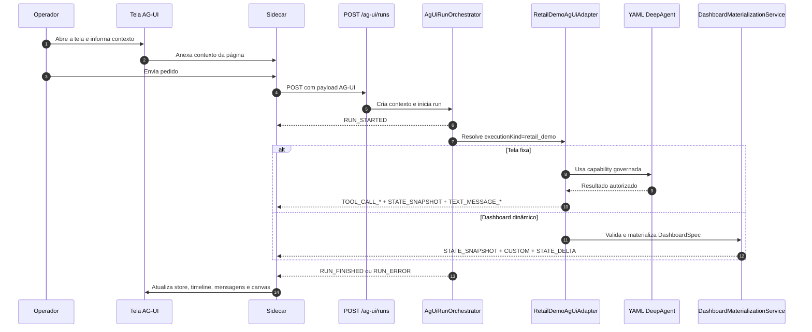
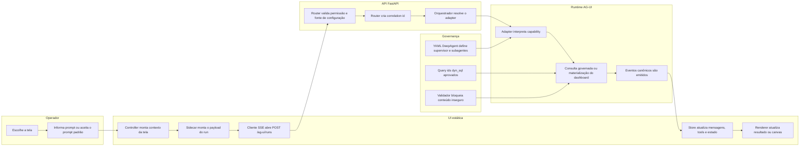

# AG-UI na Plataforma

## Visão geral

AG-UI, neste repositório, é o contrato que liga uma interface
administrativa a uma execução agentic orientada por eventos. Em vez de a
tela esperar uma resposta única no final, ela acompanha o trabalho do
backend em tempo real: início da execução, etapas, chamadas de tools,
mudanças de estado, texto incremental do assistente e encerramento.

Na prática, AG-UI foi desenhado para experiências em que a tela precisa
reagir enquanto a execução acontece. Isso serve para sidecar de chat,
timeline operacional, renderização progressiva de resultados e, no caso
mais visível desta demo, para um canvas de dashboard que nasce por fases
em vez de aparecer pronto de uma vez.

O runtime atual implementa AG-UI de forma isolada do WebChat. O WebChat
continua com seus próprios endpoints e contratos. AG-UI usa a rota
dedicada `POST /ag-ui/runs`, responde por Server-Sent Events e já está
montado na API principal.

## Leitura complementar

Se você precisa de um caminho mais guiado e menos enciclopédico para se
localizar rápido no slice atual, leia também o tutorial 101 em
[tutorial-101-generative-ui.md](./tutorial-101-generative-ui.md).
Este README continua sendo o documento dono do assunto. O tutorial 101 é
o atalho prático para onboarding, navegação pelos arquivos e primeiros
passos de validação local.

Se o foco for a pausa humana renderizada dentro da interface, complemente
essa leitura com [README-HUMAN-IN-THE-LOOP.md](./README-HUMAN-IN-THE-LOOP.md)
e [tutorial-101-human-in-the-loop.md](./tutorial-101-human-in-the-loop.md).
Esses dois materiais explicam o contrato `hil`, o componente de revisão
compartilhado e a fronteira correta entre renderização da pendência e
retomada formal da execução.

## Por que existe

A plataforma já tinha caminhos para conversa e execução de agentes, mas
esses caminhos não foram desenhados para telas que precisam refletir o
processo inteiro enquanto ele acontece. Quando a interface depende só da
resposta final, ela perde contexto operacional: o usuário não vê qual
tool rodou, em que etapa o fluxo está, se houve materialização parcial do
estado e quando um painel ainda está sendo montado.

AG-UI existe para resolver exatamente esse problema. Ele cria um contrato
de transporte e estado entre backend e frontend, sem obrigar a plataforma
inteira a migrar para um novo modelo de UI. Em termos simples: o AG-UI
não substitui tudo. Ele cria uma via especializada para telas agentic que
precisam de observabilidade, progressividade e governança mais forte.

## Explicação conceitual

Conceitualmente, AG-UI é uma ponte entre uma execução interna do sistema
e uma interface que entende eventos. O backend orquestra a execução,
emite eventos canônicos e envia tudo no mesmo stream HTTP. O frontend
consome esses eventos, atualiza um store local, re-renderiza os blocos da
tela e preserva o histórico operacional da execução.

O ponto importante é que a interface não decide a verdade do processo. A
verdade nasce no backend. O browser apenas envia intenção, contexto e
fonte de configuração, recebe o stream e espelha o estado autorizado.
Essa escolha reduz acoplamento, evita lógica crítica no cliente e mantém
o controle de segurança na API.

## Explicação for dummies

Pense no AG-UI como um painel de aeroporto. O passageiro não recebe só a
mensagem final dizendo que o voo pousou. Ele vê check-in, embarque,
portão, atraso, chamada final e pouso. Cada atualização ajuda a entender
o que está acontecendo sem precisar adivinhar.

Na plataforma, a ideia é a mesma. A tela abre uma execução e passa a
receber placas de sinalização: começou, chamou uma tool, mudou o estado,
gerou um trecho de texto, terminou ou falhou. Se for um dashboard, a tela
primeiro mostra que está materializando, depois recebe a estrutura do
painel, depois as fontes declaradas e os widgets, e só no fim entra em
estado pronto. Isso deixa a experiência mais clara, mais auditável e mais
segura, porque o navegador não inventa comportamento escondido.

## Conceitos que aparecem o tempo todo

### O que é AG-UI

AG-UI é o protocolo de interface agentic desta implementação. Ele define
como a API recebe um run, como o backend emite eventos e como a tela lê e
materializa esse fluxo.

### O que é SSE

SSE significa Server-Sent Events. É uma resposta HTTP longa em que o
servidor envia vários eventos ao longo do tempo. Em vez de devolver um
JSON único e encerrar, a API mantém a conexão aberta e vai entregando
blocos de dados. Aqui isso é importante porque a UI precisa receber o
andamento da execução, e não apenas o resultado final.

### O que é sidecar

O sidecar é o painel lateral de conversa reutilizável das páginas AG-UI.
Ele não é a execução em si. Ele é o canal visual pelo qual o operador vê
mensagens, tools acionadas, status, correlation id e possíveis
interrupções humanas.

### O que são snapshot e delta

Snapshot é uma fotografia completa do estado em um determinado momento.
Delta é uma mudança incremental sobre um estado que já existe. O sistema
usa os dois porque, em alguns momentos, faz sentido mandar tudo de uma
vez; em outros, é melhor mandar só a alteração necessária.

### O que é JSON Patch

JSON Patch é um formato padronizado para expressar alteração de estado,
como adicionar, substituir ou remover algo em um caminho específico do
JSON. Na prática, isso permite colocar novos widgets no dashboard sem
reenviar o estado inteiro a cada pequeno passo.

### O que é DeepAgent neste contexto

DeepAgent é o modo de execução agentic usado na demo PDV. Ele coordena
subagentes especializados e respeita limites, memória e ferramentas
governadas definidos no YAML. Aqui ele serve como o cérebro da demo de
varejo, mas o AG-UI é a camada de interface e transporte, não o motor de
decisão em si.

### O que é `dyn_sql<query_id>`

`dyn_sql<query_id>` é a sintaxe governada usada para consultas SQL
dinâmicas aprovadas. O ponto importante não é “SQL dinâmico” no sentido
de liberdade total. O importante é que a query continua fechada,
catalogada e validada. O usuário e o browser não podem mandar qualquer
SQL livre.

### O que é DashboardSpec

DashboardSpec é o contrato estruturado que descreve um dashboard de forma
segura. Ele não é HTML e não é JavaScript. Ele é uma especificação de
layout, widgets, fontes de dados, narrativa e políticas de segurança.

### O que é materialização online

Materialização online é o processo de transformar uma especificação em
estado renderizável enquanto a execução ainda está em curso. Em vez de a
tela receber um painel montado fora dela, ela acompanha a formação desse
painel por eventos.

## Estratégia adotada neste repositório

### Isolamento do WebChat

A primeira decisão estratégica foi não misturar AG-UI com WebChat. O
AG-UI tem rota própria, contrato próprio e telas próprias. Isso evita
quebrar superfícies antigas e reduz o risco de um ajuste de interface
agentic afetar um fluxo já consolidado de conversa.

### Backend como autoridade

O browser não cria correlation id, não executa SQL livre e não define a
verdade do estado operacional. O backend recebe o pedido, valida a fonte
de configuração, resolve o adapter, executa ou materializa a ação e
entrega os eventos autorizados.

### Governança fechada de dados

As consultas da demo PDV vêm de um catálogo controlado. Para capability
fixa, o adapter escolhe uma query aprovada. Para dashboard dinâmico, o
contrato restringe o uso a query ids governados e parâmetros declarados.
Isso reduz o risco de desvio funcional e bloqueia SQL arbitrário vindo da
UI.

### Renderização segura

O dashboard dinâmico não aceita HTML, JavaScript, CSS, SVG, iframe,
handlers inline, segredo ou correlation id injetado pela spec. A ideia é
simples: a tela deve renderizar um painel, não interpretar código livre.

### Reuso de componentes de interface

As páginas compartilham o cliente SSE, o sidecar, o store e o controller
base de varejo. Isso evita quatro implementações paralelas do mesmo
problema e mantém o comportamento da experiência mais previsível.

## Componentes reais da implementação

As peças comprovadas no código hoje são estas:

- Router AG-UI dedicado em `src/api/routers/ag_ui_router.py`.
- Montagem do router na API principal em `src/api/service_api.py`.
- Contrato HTTP e eventos em `src/api/schemas/ag_ui_models.py`.
- Orquestrador AG-UI em `src/api/services/ag_ui_run_orchestrator.py`.
- Adapter governado da demo PDV em `src/api/services/ag_ui_retail_demo_adapter.py`.
- Contrato seguro do dashboard em `src/api/schemas/ag_ui_dashboard_models.py`.
- Materialização progressiva do dashboard em `src/api/services/ag_ui_dashboard_materialization.py`.
- Cliente SSE do frontend em `app/ui/static/js/shared/ag-ui-client.js`.
- Sidecar reutilizável em `app/ui/static/js/shared/ag-ui-sidecar-chat.js`.
- Controller base das páginas de varejo em `app/ui/static/js/shared/ag-ui-retail-demo-page.js`.
- Controller da página dinâmica em `app/ui/static/js/ag-ui-dashboard-dinamico.js`.
- YAML da demo PDV em `app/yaml/ag-ui-pdv-vendas-demo.yaml`.

## Arquitetura do fluxo

## Fluxo funcional cruzado

## Como a API funciona

### Endpoint

A rota executável é `POST /ag-ui/runs`.

Ela devolve:

- `Content-Type: text/event-stream`.
- `X-Correlation-Id` no header.
- Eventos AG-UI no corpo da resposta.

O `correlation_id` nasce no backend. O frontend não deve inventar esse
valor e nem enviá-lo como se fosse a fonte oficial da execução.

### Validação de entrada

O request é aceito pelo contrato `AgUiRunRequest`. Os campos centrais são:

- `threadId` para identificar a superfície de UI.
- `runId` para identificar a execução.
- `executionKind` para escolher o adapter interno. Na demo atual, o valor
  executável é `retail_demo`.
- `user_email` para identificar o operador.
- `input` para carregar a intenção da tela.
- `metadata` para dados auxiliares da página.
- `yaml_config`, `yaml_inline_content` ou `encrypted_data` como fonte
  obrigatória de configuração.

Se nenhuma fonte de configuração vier, a API responde erro `400` com uma
mensagem direta. Isso é importante porque a estratégia aqui é falhar
fechado, e não inventar um fallback silencioso.

### Permissão

A rota usa a permissão de execução de agente. Em termos práticos, a tela
precisa estar operando com uma chave ou contexto autorizado para chamar o
endpoint. Sem isso, a execução não avança.

## Eventos do protocolo

Os eventos canônicos suportados no runtime atual incluem:

- `RUN_STARTED` para início da execução.
- `RUN_FINISHED` para encerramento normal ou interrupção HIL.
- `RUN_ERROR` para erro terminal.
- `STEP_STARTED` e `STEP_FINISHED` para etapas observáveis.
- `TOOL_CALL_START`, `TOOL_CALL_ARGS`, `TOOL_CALL_END` e `TOOL_CALL_RESULT`.
- `STATE_SNAPSHOT` para fotografia completa do estado.
- `STATE_DELTA` para mudanças incrementais via JSON Patch.
- `TEXT_MESSAGE_START`, `TEXT_MESSAGE_CONTENT` e `TEXT_MESSAGE_END`.
- `CUSTOM` para eventos nomeados da aplicação.

No dashboard dinâmico, os eventos customizados mais importantes são:

- `retail.dashboard.spec.started`.
- `retail.dashboard.spec.validated`.
- `retail.dashboard.data.bound`.
- `retail.dashboard.widget.added`.
- `retail.dashboard.render.ready`.
- `retail.dashboard.validation.failed`.

## Como a demo PDV funciona

### YAML DeepAgent da demo

O YAML da demo está em `app/yaml/ag-ui-pdv-vendas-demo.yaml` e usa:

- `tools_library: []` para permitir a injeção governada do catálogo
  builtin pelo fluxo oficial.
- `selected_supervisor` apontando para o supervisor AG-UI de varejo.
- `multi_agents` com `execution.type: deepagent`.
- subagentes por domínio de vendas, checkout, catálogo, clientes e
  dashboard dinâmico.
- tools na sintaxe `dyn_sql<query_id>`.

A sintaxe correta observada no codebase é `dyn_sql<query_id>`. Não use
`sql_dyn`, porque esse formato não é o contrato comprovado no projeto.

### Capabilities fixas

As telas fixas usam capabilities fechadas, como `sales_summary`,
`checkout_funnel`, `catalog_opportunities` e `customer_segments`. O
adapter resolve a capability, escolhe a query aprovada e executa a tool
dinâmica correspondente. Depois disso ele emite os eventos de tool, um
snapshot do estado `retailDemo` e uma mensagem textual curta do
assistente.

### Dashboard dinâmico

O dashboard dinâmico usa a capability `dashboard_dynamic`. Quando essa
capability chega com `dashboardSpec` ou `dashboard_spec`, o adapter não
segue o caminho da consulta governada fixa. Ele muda para o caminho de
materialização do dashboard.

Esse detalhe importa muito. No fluxo atual, o serviço de materialização
não executa SQL livre nem interpreta HTML. Ele valida a spec, gera um
snapshot inicial com estado `materializing`, adiciona as fontes e os
widgets de forma incremental e finaliza com estado `ready` quando a spec
é segura.

## Consultas governadas e política de dados

Nas telas fixas, o catálogo interno do adapter concentra as queries
aprovadas. No dashboard dinâmico, o subagente fica restrito a estes
query ids governados:

- `pdv_dashboard_series_vendas_periodo`.
- `pdv_dashboard_ranking_dimensoes`.
- `pdv_dashboard_mix_pagamento_entrega`.

Além disso, o caminho PDV bloqueia payloads com chaves como `sql`,
`raw_sql`, `sql_query` e `statement`. Em linguagem simples: a UI não pode
mandar uma consulta arbitrária para o banco e pedir que o backend execute
“porque o agente pediu”.

## DashboardSpec explicado de forma prática

`DashboardSpec` é o contrato seguro do canvas dinâmico. Ele descreve:

- título do dashboard;
- layout em grid;
- filtros;
- widgets de tipos permitidos;
- fontes de dados `dyn_sql`;
- parâmetros permitidos por fonte;
- narrativa;
- política de atualização;
- regras explícitas de segurança.

Os tipos de widget aceitos hoje são limitados a `kpi`, `line_chart`,
`bar_chart`, `donut_chart`, `table`, `insight_card`, `alert`,
`timeline` e `ranking`.

O validador rejeita, entre outras coisas:

- HTML bruto.
- JavaScript.
- CSS.
- SVG.
- iframe.
- handlers inline.
- SQL livre.
- segredos.
- correlation id embutido na spec.

Quando a spec falha, o backend emite um evento de validação recusada e a
tela recebe um erro estruturado. Quando a spec é válida, a materialização
segue em etapas e o renderer pode atualizar o canvas progressivamente.

## Como configurar

### 1. Configuração da API

No runtime atual, o router AG-UI já está incluído na API principal. Isso
significa que você não precisa ativar uma feature flag separada só para a
rota existir. O que você precisa é subir a API normalmente e operar com
um contexto autorizado.

### 2. Fonte de configuração obrigatória do run

Toda execução AG-UI precisa de uma fonte explícita de configuração:

- `yaml_config`.
- `yaml_inline_content`.
- `encrypted_data`.

As páginas estáticas da demo, hoje, usam este comportamento:

- se o contexto padrão da página tem `yaml`, o browser envia esse valor
  como `yaml_inline_content`;
- se não tem `yaml`, mas tem `payload`, o browser tenta interpretar esse
  payload como JSON e envia como `encrypted_data`;
- se nenhum dos dois existir, a tela bloqueia a execução com erro claro.

Em outras palavras: a UI estática não está mandando `yaml_config` como
fonte principal neste fluxo. Ela trabalha com YAML inline ou payload já
serializado.

### 3. Configuração de ambiente da demo PDV

Para o caminho governado de consultas da demo PDV, o backend precisa de:

- `DATABASE_VAREJO_DSN`.
- `DATABASE_VAREJO_SCHEMA`.

Se esses valores faltarem, a execução falha com erro explícito de
configuração incompleta. Se o schema vier inválido, a execução também
falha fechada.

### 4. Configuração da tela

As páginas de varejo usam por padrão:

- endpoint `/ag-ui/runs`;
- referência de YAML `app/yaml/ag-ui-pdv-vendas-demo.yaml` em metadata;
- `executionKind` igual a `retail_demo`.

Além disso, a tela precisa de:

- `userEmail` no contexto padrão do layout mestre;
- `apiKey` para a chamada autenticada;
- período inicial e final para as capabilities que usam faixa temporal;
- dimensão de ranking na tela dinâmica, limitada a `loja`, `produto`,
  `categoria` ou `marca`.

## Como ativar

### Ativação do backend

O backend fica ativado quando a API sobe com o router AG-UI montado,
porque a rota já está incluída na aplicação principal. O passo prático,
então, não é “ligar um módulo AG-UI oculto”. O passo prático é garantir
que a API esteja no ar e que o operador tenha contexto autorizado para
usar a rota.

### Ativação da demo de varejo

Para ativar a demo ponta a ponta:

1. Suba a API normalmente.
2. Garanta um contexto autorizado com chave de API e e-mail operacional.
3. Carregue YAML inline ou payload válido no contexto padrão da página.
4. Tenha `DATABASE_VAREJO_DSN` e `DATABASE_VAREJO_SCHEMA` configurados se
   for usar consultas governadas da demo PDV.
5. Abra o hub `app/ui/static/ui-admin-plataforma-ag-ui-varejo-demo.html`.
6. Escolha uma das telas de varejo.

## Como o usuário recebe a feature

O usuário operacional recebe AG-UI como uma página administrativa com:

- contexto visual da tela;
- botão de abertura do sidecar;
- botão de execução rápida;
- campos de período e, no dashboard dinâmico, seletor de dimensão;
- área principal de resultado ou canvas;
- status visível da execução.

No lado da experiência, isso significa que a pessoa não precisa abrir um
console técnico nem montar requests manualmente. Ela interage com a tela,
abre o sidecar, envia um pedido e acompanha o fluxo ali mesmo.

## Como usar na prática

### Fluxo das telas fixas

1. Abra o hub AG-UI de varejo.
2. Entre em uma tela fixa, como vendas, checkout ou catálogo.
3. Confirme o contexto operacional da página.
4. Ajuste o período.
5. Clique para abrir o sidecar ou use o botão de execução rápida.
6. Envie o pedido.
7. Acompanhe status, tools e resultado governado na tela.

### Fluxo do dashboard dinâmico

1. Abra a tela `ui-admin-plataforma-ag-ui-dashboard-dinamico.html`.
2. Escolha período e dimensão de ranking.
3. A tela monta um `DashboardSpec` local usando apenas query ids e tipos
   permitidos.
4. O validador local confere a spec antes do envio.
5. O sidecar envia o run com capability `dashboard_dynamic`.
6. O backend valida novamente a spec.
7. Se tudo estiver correto, o canvas entra em `materializing`, recebe
   fontes e widgets por etapas e termina em `ready`.
8. O histórico da própria página registra os dashboards materializados na
   sessão atual.

## O que acontece quando o operador clica em executar

1. O controller da página coleta o contexto visual e operacional.
2. O sidecar monta o payload AG-UI.
3. O cliente SSE abre um POST para `/ag-ui/runs`.
4. A API valida permissão e fonte de configuração.
5. A API resolve ou cria o `correlation_id`.
6. O orquestrador emite `RUN_STARTED`.
7. O adapter `retail_demo` decide qual caminho seguir.
8. O backend emite os eventos canônicos.
9. O sidecar atualiza store, timeline, mensagens e correlation id.
10. A página atualiza o resultado governado ou o canvas dinâmico.

## Técnicas usadas na implementação

As principais técnicas usadas no AG-UI atual são:

- transporte de eventos por SSE;
- separação entre router, orquestrador e adapter;
- contrato estrito com modelos Pydantic;
- renderização incremental de estado com snapshot e delta;
- materialização progressiva via JSON Patch;
- governança de dados por `dyn_sql<query_id>`;
- validação local e validação backend no dashboard dinâmico;
- geração de correlation id somente na API;
- sidecar reutilizável desacoplado da tela principal.

## Processos envolvidos

Os processos reais envolvidos hoje são estes:

- processo de autorização da chamada HTTP;
- processo de resolução da fonte de configuração;
- processo de criação do contexto AG-UI;
- processo de orquestração do run;
- processo de tradução do domínio para eventos AG-UI;
- processo de consumo SSE no navegador;
- processo de atualização do store da UI;
- processo de renderização segura do resultado ou do dashboard.

## Telas disponíveis

O hub das demos fica em:

- `app/ui/static/ui-admin-plataforma-ag-ui-varejo-demo.html`.

As telas da demo são:

- `ui-admin-plataforma-ag-ui-vendas-cockpit.html`.
- `ui-admin-plataforma-ag-ui-checkout-radar.html`.
- `ui-admin-plataforma-ag-ui-catalogo-central.html`.
- `ui-admin-plataforma-ag-ui-dashboard-dinamico.html`.

Todas reutilizam o contexto padrão da área administrativa, o mesmo
endpoint AG-UI, o sidecar compartilhado e a estratégia governada de
execução.

## Impacto para o usuário

Na rotina do operador, AG-UI muda a experiência de três formas:

- deixa claro o que está acontecendo durante a execução;
- reduz a necessidade de adivinhar se a operação travou ou ainda está em
  andamento;
- permite que telas mais ricas, como dashboard dinâmico, sejam montadas
  com governança forte e sem depender de código livre vindo do agente.

Em linguagem simples: o usuário passa a enxergar o processo e não apenas
o resultado final. Isso melhora confiança, diagnóstico e previsibilidade.

## Limites e pegadinhas

O que não deve ser assumido:

- AG-UI não é React neste repositório.
- AG-UI não usa CopilotKit no runtime atual.
- O browser não cria `correlation_id`.
- O caminho PDV não aceita SQL livre vindo da UI.
- O dashboard dinâmico não executa HTML, JavaScript ou CSS retornado pelo
  agente.
- O adapter efetivamente registrado hoje é `retail_demo`.
- Materializar um dashboard não significa, por si só, liberar qualquer
  consulta fora do catálogo governado.
- O `yamlPath` da página é metadata de contexto; a fonte real de
  configuração continua sendo `yaml_inline_content`, `yaml_config` ou
  `encrypted_data`.

## Human in the loop

O contrato AG-UI já aceita interrupções via `RUN_FINISHED` com outcome do
tipo `interrupt`, e o sidecar já possui área para aprovações pendentes.
No store compartilhado, esse outcome muda o status do run para
`interrupted` e popula a lista de interrupções que a tela pode renderizar.

Isso não quer dizer que toda tela da demo PDV já pause para aprovação
humana em produção. O que existe de forma comprovada é a capacidade do
protocolo de transportar esse tipo de estado quando o runtime precisar.

### Como isso se conecta à Generative UI do HIL

Generative UI do HIL é a camada de revisão humana montada a partir de um
contrato estruturado. No endpoint `/agent/execute`, esse contrato aparece
no envelope `hil`, com campos como `pending`, `allowed_decisions`,
`action_requests`, `review_configs`, `thread_id` e `resume_endpoint`. No
AG-UI, a interrupção pode ser transportada no encerramento do run, usando
`RUN_FINISHED` com outcome `interrupt`.

A diferença prática é simples. O HIL define o que está pendente, quais
ações precisam de revisão e quais decisões são permitidas. O AG-UI define
como essa informação chega à interface em uma experiência orientada por
eventos. No runtime atual, o sidecar compartilha o mesmo renderer visual
de HIL usado pelo WebChat v3 e pelo Admin WebChat. Quando o evento traz
um interrupt simples, o sidecar adapta esse shape para o contrato do
painel e continua mostrando aprovar e rejeitar. Quando o evento trouxer
dados mais ricos, a mesma peça visual já estará pronta para materializar
essa revisão sem criar um segundo renderer.

O ponto operacional decisivo é que o sidecar não faz a retomada sozinho.
Ele reaproveita o `HilReviewPanel` para materializar a revisão e entrega
a decisão ao host da interface por callback. A tela dona do fluxo é quem
decide se aquela decisão vira chamada formal para `/agent/continue` ou
`/workflow/continue`. Em linguagem simples: AG-UI já transporta e mostra
a pausa humana, mas o continue oficial continua explícito e fora de
`/ag-ui/runs`.

### Explicação simples da interrupção HIL

Pense no AG-UI como o canal que avisa a tela sobre o andamento do trabalho
do agente. Quando o trabalho para porque precisa de revisão humana, esse
canal pode avisar que o run terminou em estado interrompido, não em
sucesso comum. A tela então mostra a pendência para uma pessoa decidir.

O HIL é a ficha dessa pendência: mostra o que o agente queria fazer, quais
dados ele usaria e quais respostas humanas são aceitas. A UI generativa do
HIL pega essa ficha e monta a experiência de revisão com componentes do
próprio produto. Ela não executa código visual vindo do agente e não cria
decisões novas por conta própria.

### O que já existe e o que ainda exige cuidado

- O endpoint AG-UI já usa Server-Sent Events para publicar eventos de run.
- O store compartilhado já reconhece `RUN_FINISHED` com outcome
  `interrupt`.
- O sidecar já possui área dedicada para aprovações pendentes.
- A área visual de aprovação usa o mesmo componente compartilhado de HIL
  empregado em outras superfícies do produto.
- Quando o evento chega apenas com `interrupts` simples, o sidecar faz um
  adaptador explícito para continuar mostrando aprovar e rejeitar sem
  inventar contrato novo no browser.
- O sidecar já entrega a decisão humana para o host da interface via
  callback, mantendo o wiring de continue fora do renderer visual.
- Uma UI rica de HIL deve consumir o contrato estruturado do backend, não
  inferir estado por mensagem textual.
- Novas telas que combinem AG-UI e HIL precisam validar a retomada no
  servidor, preservando `thread_id`, `correlation_id` e decisões na ordem
  das ações pendentes.

## Troubleshooting

### Erro 400 dizendo que falta YAML ou configuração

Causa prática: o run foi enviado sem `yaml_config`, sem
`yaml_inline_content` e sem `encrypted_data`.

Como resolver: carregue YAML ou payload válido no contexto da página
antes de disparar o sidecar.

### Erro de configuração PDV incompleta

Causa prática: `DATABASE_VAREJO_DSN` ou `DATABASE_VAREJO_SCHEMA` não foi
configurado.

Como resolver: configure as duas variáveis no backend e reinicie a API.

### Erro de schema PDV inválido

Causa prática: o schema informado não é um identificador simples aceito
pela validação do adapter.

Como resolver: use um schema alfanumérico simples, sem formato ambíguo.

### Erro bloqueando SQL livre

Causa prática: o payload trouxe chaves como `sql`, `raw_sql`, `sql_query`
ou `statement`.

Como resolver: remova SQL livre do payload e use apenas capabilities e
query ids governados.

### DashboardSpec recusado

Causa prática: a spec tentou usar conteúdo inseguro, fonte inexistente,
layout impossível ou parâmetro não declarado.

Como resolver: corrija a spec para respeitar os widgets, parâmetros e
regras de segurança do contrato.

### O sidecar abre, mas não mostra correlation id

Causa prática: o backend ainda não enviou os headers ou a chamada não foi
aberta com sucesso.

Como resolver: verifique autenticação, permissão e resposta do endpoint.

### Erro 401 ou 403 na chamada AG-UI

Causa prática: chave inválida, ausente ou sem permissão suficiente.

Como resolver: opere com um contexto autorizado de execução de agente.

## Evidências de teste e validação

Os slices mais diretamente ligados ao AG-UI atual incluem testes de:

- router e orquestrador;
- adapter PDV;
- contrato e materialização de dashboard;
- cliente e sidecar de frontend;
- renderer do dashboard;
- páginas HTML com Playwright.

Na prática, isso significa que AG-UI neste repositório não é só um texto
conceitual. Há testes cobrindo backend, frontend e renderização visual do
fluxo demonstrado.

## Resumo direto

Se precisar lembrar da ideia central em poucas linhas, guarde isto:

- AG-UI é a via de interface agentic orientada por eventos.
- Ele roda separado do WebChat.
- O backend é a autoridade do processo.
- O browser só envia intenção e consome eventos.
- A demo PDV usa DeepAgent e queries `dyn_sql<query_id>` aprovadas.
- O dashboard dinâmico usa `DashboardSpec` validado e materializado em
  tempo de execução.
- Não existe SQL livre nem renderização de código arbitrário no canvas.
