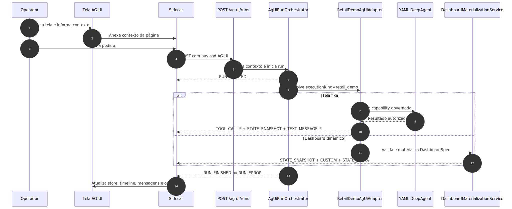

# Manual técnico, executivo, comercial e estratégico: AG-UI

> Este manual continua como porta de entrada ampla do tema, mas agora foi complementado por dois manuais especializados para leitura mais profunda do protocolo com referencial oficial e uso em ERP: [README-CONCEITUAL-AG-UI-GOOGLE-MICROSOFT-ERP.md](./README-CONCEITUAL-AG-UI-GOOGLE-MICROSOFT-ERP.md) e [README-TECNICO-AG-UI-GOOGLE-MICROSOFT-ERP.md](./README-TECNICO-AG-UI-GOOGLE-MICROSOFT-ERP.md). Use os dois novos arquivos quando a necessidade for entender a relação com o ecossistema AG-UI oficial, a implementação real no projeto, o uso em telas ERP e os casos de negócio comprovados no código.

## 1. O que é esta feature

AG-UI, neste projeto, é um protocolo de interface agentic orientado por eventos. Ele foi implementado para permitir que uma aplicação cliente envie um pedido de execução, mantenha uma conexão HTTP aberta e receba a história da execução em tempo real: início do run, etapas, chamadas de tool, snapshots e deltas de estado, texto incremental do assistente, erros e encerramento.

O ponto central não é apenas “ter streaming”. O ponto central é dar à interface um contrato canônico para acompanhar uma execução agentic sem precisar conhecer os detalhes internos do runtime do backend. Em vez de cada tela inventar seu próprio formato de progresso, o sistema publica um protocolo estável de eventos AG-UI.

Em linguagem simples, AG-UI é a camada que transforma uma execução interna da plataforma em uma conversa técnica compreensível para uma interface.

## 2. Que problema ela resolve

Sem AG-UI, uma aplicação cliente que quisesse acompanhar uma execução agentic teria três opções ruins.

A primeira seria esperar só a resposta final. Isso empobrece a experiência, porque o usuário não vê etapa, tool, materialização parcial, nem sabe se o processo ainda está trabalhando ou travou.

A segunda seria criar polling e contratos ad hoc por tela. Isso multiplica endpoints, formatos de payload e custo de manutenção.

A terceira seria empurrar lógica de orquestração para o frontend. Isso aumenta acoplamento, enfraquece a segurança e obriga cada aplicação consumidora a aprender detalhes internos do runtime.

AG-UI resolve esse problema oferecendo uma fronteira única: a aplicação cliente envia um run, o backend continua sendo a autoridade da execução e o frontend recebe um stream de eventos tipados e reconstituíveis.

## 3. Visão conceitual

Conceitualmente, AG-UI não é uma tela específica e não é um framework de frontend. Ele é o contrato entre uma execução agentic e uma interface consumidora.

Neste repositório, isso aparece de forma clara no código: existe um modelo canônico de eventos, uma rota dedicada para runs AG-UI, um encoder SSE, um orquestrador que conhece apenas o lifecycle do protocolo e adapters que traduzem um domínio interno para esse contrato externo.

Isso significa que a UI não conversa diretamente com a engine de domínio. Ela conversa com o protocolo AG-UI.

## 4. Visão técnica

Tecnicamente, a implementação atual tem cinco camadas principais.

A primeira camada é o contrato tipado de protocolo em `src/api/schemas/ag_ui_models.py`. É ali que o sistema define `AgUiRunRequest`, `AgUiRunStartedEvent`, `AgUiRunFinishedEvent`, `AgUiRunErrorEvent`, eventos de tool, texto, snapshot, delta, activity, custom e raw, tudo com Pydantic estrito e aliases oficiais do protocolo.

A segunda camada é a borda HTTP em `src/api/routers/ag_ui_router.py`. A rota `POST /ag-ui/runs` exige fonte explícita de configuração, valida permissão, resolve `correlation_id`, cria o contexto de execução e devolve `text/event-stream`.

A terceira camada é a bridge de lifecycle em `src/api/services/ag_ui_run_orchestrator.py`. Ela emite `RUN_STARTED`, resolve o adapter por `executionKind`, propaga os eventos emitidos pelo adapter e garante evento terminal coerente em caso de sucesso, erro de adapter não encontrado ou falha interna.

A quarta camada é o adapter de domínio. Hoje, o adapter concretamente registrado é `retail_demo`, implementado em `src/api/services/ag_ui_retail_demo_adapter.py`. Ele traduz capabilities governadas do domínio PDV em eventos AG-UI.

A quinta camada é o runtime compartilhado do frontend, com cliente SSE, store de estado, sidecar, renderizadores e controllers reutilizáveis em JavaScript puro.

## 5. Visão executiva

Para liderança, AG-UI é importante porque transforma uma execução agentic em um ativo visual e auditável. Em vez de entregar só uma resposta final, a plataforma entrega uma trilha operacional que outras aplicações podem consumir sem reinventar integração de streaming.

Isso melhora previsibilidade, reduz custo de integração entre times e acelera a entrega de experiências agentic mais ricas. Também reduz o risco de cada frente do produto criar seu próprio protocolo informal de andamento de execução.

Em termos executivos, AG-UI reduz duplicação de solução e aumenta reutilização de plataforma.

## 6. Visão comercial

Comercialmente, AG-UI é uma vantagem porque ajuda a vender a ideia de interface agentic integrada, não apenas de backend inteligente. O cliente não vê um sistema que responde “depois”. Ele vê um sistema que mostra o que está fazendo, quais passos executou, quando um dashboard está sendo materializado e quando uma ação está pronta.

Isso é especialmente valioso em demonstrações, provas de conceito e cenários de decisão operacional, onde confiança e transparência aumentam a percepção de valor.

O discurso comercial correto não é “temos SSE”. O discurso correto é “temos um protocolo de interface agentic que permite integrar outras aplicações a execuções assistidas, com progresso, ferramentas, estado e materialização segura”.

## 7. Visão estratégica

Estratégicamente, AG-UI fortalece a plataforma em quatro pontos.

O primeiro é padronização. Uma nova aplicação consumidora não precisa inventar um modelo próprio de eventos.

O segundo é desacoplamento. O backend publica eventos estáveis; o cliente só precisa saber consumir o protocolo.

O terceiro é extensibilidade. Novos domínios podem entrar por novos adapters sem quebrar a rota nem o modelo de transporte.

O quarto é velocidade de produto. A plataforma consegue criar novas superfícies agentic reaproveitando o mesmo endpoint, o mesmo cliente SSE, o mesmo sidecar e o mesmo store compartilhado.

## 8. Conceitos necessários para entender

### 8.1. Run AG-UI

Um run é uma execução rastreável do protocolo. Ele carrega `threadId`, `runId`, `executionKind`, `user_email`, entrada, metadata e uma fonte explícita de configuração.

### 8.2. SSE

SSE, ou Server-Sent Events, é o transporte usado pela rota AG-UI. O servidor mantém a conexão HTTP aberta e envia eventos ao longo do tempo.

### 8.3. Adapter

Adapter é a peça que traduz uma execução interna de domínio para eventos AG-UI. O orquestrador não conhece o domínio de negócio; ele só conhece adapters.

### 8.4. Snapshot e delta

Snapshot é uma fotografia completa do estado. Delta é uma alteração incremental, no caso desta implementação, modelada por JSON Patch. Os dois coexistem porque algumas telas precisam de baseline completa e outras de atualização incremental precisa.

### 8.5. DashboardSpec

DashboardSpec é o contrato seguro para dashboards dinâmicos. Em vez de o agente devolver HTML ou JavaScript, ele devolve uma especificação controlada de layout, widgets, fontes e políticas de segurança.

### 8.6. Outcome de interrupção

O protocolo suporta `RUN_FINISHED` com outcome do tipo `interrupt`, contendo interrupções estruturadas para HIL. O código e os testes confirmam esse suporte no contrato e no runtime compartilhado do frontend.

### 8.7. Backend como autoridade

No modelo atual, o navegador não decide a verdade da execução, não cria `correlation_id` e não escolhe livremente a tool ou a query efetiva. O backend continua sendo a fonte autorizada do processo.

## 9. O protocolo AG-UI implementado aqui

O protocolo implementado neste repositório tem três blocos principais: request, stream de eventos e metadados de execução.

### 9.1. Request

O request de `POST /ag-ui/runs` exige:

- `threadId`;
- `runId`;
- `executionKind`;
- `user_email`;
- `input` opcional;
- `parentRunId` opcional;
- `metadata` opcional;
- ao menos uma fonte explícita de configuração entre `yaml_config`, `yaml_inline_content` ou `encrypted_data`.

Se nenhuma fonte de configuração estiver presente, o endpoint falha com `400`.

### 9.2. Transporte

O transporte é `text/event-stream`. O encoder SSE serializa cada `AgUiBaseEvent` como:

- `event: <TYPE>`;
- `data: <JSON oficial do evento>`.

O backend ainda devolve `X-Correlation-Id` no header. O cliente lê esse valor; não deve inventá-lo.

### 9.3. Eventos oficiais

O contrato canônico lido no código suporta, entre outros:

- `RUN_STARTED`;
- `RUN_FINISHED`;
- `RUN_ERROR`;
- `STEP_STARTED`;
- `STEP_FINISHED`;
- `TEXT_MESSAGE_START`, `TEXT_MESSAGE_CONTENT`, `TEXT_MESSAGE_END` e `TEXT_MESSAGE_CHUNK`;
- `TOOL_CALL_START`, `TOOL_CALL_ARGS`, `TOOL_CALL_END`, `TOOL_CALL_RESULT` e `TOOL_CALL_CHUNK`;
- `STATE_SNAPSHOT`;
- `STATE_DELTA`;
- `MESSAGES_SNAPSHOT`;
- `ACTIVITY_SNAPSHOT`;
- `ACTIVITY_DELTA`;
- `RAW`;
- `CUSTOM`.

### 9.4. Regras de contrato importantes

Os testes confirmam algumas regras fortes:

- os nomes oficiais usam camelCase nos campos serializados;
- modelos extras são proibidos por `extra="forbid"`;
- `TEXT_MESSAGE_CONTENT` não aceita delta vazio;
- o boundary tipado rejeita payloads fora do contrato oficial;
- `STATE_DELTA` usa JSON Patch;
- interrupção HIL via outcome `interrupt` é parte do protocolo, não evento inventado lateralmente.

## 10. Como a feature funciona por dentro

O fluxo começa no router AG-UI. A rota valida a permissão, exige contexto YAML explícito, resolve `correlation_id`, monta `AgUiRunContext` e cria o encoder SSE.

Depois disso, o `AgUiRunOrchestrator` entra em ação. Ele emite `RUN_STARTED`, resolve o adapter a partir de `executionKind` e consome o stream de eventos desse adapter. Se o adapter não emitir um evento terminal, o orquestrador fecha o run com `RUN_FINISHED` e outcome de sucesso. Se o adapter não existir, emite `RUN_ERROR` com `AG_UI_ADAPTER_NOT_FOUND`. Se o adapter recusar a execução com `AgUiExecutionError`, o erro viaja para a interface com o código de domínio informado.

Na implementação registrada hoje, `executionKind=retail_demo` aponta para `RetailDemoAgUiAdapter.default()`.

## 11. Implementação atual na plataforma

### 11.1. Montagem na API

O router AG-UI está montado na API principal. Os testes confirmam que `/ag-ui/runs` coexiste com os endpoints legados de agente e streaming, em vez de substituí-los.

### 11.2. Bridge desacoplada

O orquestrador AG-UI não conhece regras de negócio do varejo, do dashboard nem de SQL. Ele conhece só o lifecycle do protocolo. Essa separação reduz acoplamento e permite registrar novos adapters sem alterar o contrato de transporte.

### 11.3. Adapter governado de varejo

O adapter `retail_demo` implementa dois caminhos concretos.

O primeiro é o caminho de capability fixa, como `sales_summary`, `checkout_funnel`, `catalog_opportunities` e `customer_segments`. Nesse caso, o adapter resolve a capability, escolhe uma query aprovada do catálogo interno, executa a tool dinâmica governada e emite os eventos de tool, snapshot e mensagem textual.

O segundo é o caminho `dashboard_dynamic`. Nesse caso, ele não executa a consulta fixa; delega a uma materialização de `DashboardSpec` segura e progressiva.

### 11.4. Materialização de dashboard

O serviço de materialização valida o `DashboardSpec`, emite um snapshot inicial com estado `materializing`, publica eventos customizados de início, validação, binding de fontes, adição de widgets e estado pronto, e usa deltas para adicionar fontes e widgets ao estado.

Se a spec falhar, o sistema publica estado `validation_failed`, devolve lista estruturada de erros e gera uma mensagem textual curta avisando que a renderização foi recusada.

### 11.5. Runtime compartilhado do frontend

No frontend, a implementação reutilizável já existe em JavaScript puro:

- cliente SSE com retry explícito e cancelamento;
- store de estado AG-UI;
- renderizadores de status, mensagens e timeline de tools;
- sidecar compartilhado;
- controller base para páginas da demo de varejo.

Isso é importante porque o valor da feature não está apenas no backend. Está também em ter um cliente e uma ergonomia de consumo reaproveitáveis.

## 12. Por que AG-UI ajuda a plataforma

AG-UI ajuda a plataforma porque separa claramente três responsabilidades.

A primeira é a execução de negócio, que continua no backend.

A segunda é o protocolo de observabilidade e interface, que fica em AG-UI.

A terceira é a apresentação da tela, que pode variar por aplicação sem obrigar reescrita do backend.

Na prática, isso ajuda em quatro frentes:

- reduz a necessidade de polling e contratos específicos por tela;
- permite interface progressiva e auditável;
- facilita reaproveitamento do mesmo backend por múltiplas superfícies;
- mantém o controle crítico de correlação, tool e erro no servidor.

## 13. Por que isso acelera outras aplicações

AG-UI acelera o uso por outras aplicações porque entrega um ponto de integração simples e estável.

Uma aplicação que queira usar a plataforma não precisa aprender o detalhe interno do adapter PDV, nem o shape interno do runtime de tool, nem inventar um mecanismo de progresso. Ela precisa só:

- fazer `POST` para `/ag-ui/runs`;
- enviar o contrato AG-UI do run;
- ler o stream SSE;
- reagir aos eventos tipados.

Isso acelera outras aplicações por cinco motivos.

O primeiro é transporte simples. HTTP + SSE são baratos de integrar e amplamente suportados.

O segundo é contrato estável. O modelo de evento já está centralizado e protegido por testes.

O terceiro é desacoplamento por adapter. Novos casos de uso podem entrar sem obrigar uma nova API por tela.

O quarto é runtime compartilhado no frontend. Páginas estáticas do admin já provam que a integração não depende de React.

O quinto é observabilidade pronta. O consumidor recebe `RUN_STARTED`, progresso, tools, snapshots, deltas, erros e `RUN_FINISHED` sem desenhar isso do zero.

Em termos práticos, AG-UI reduz o esforço de “colar” uma nova aplicação à plataforma.

## 14. Vantagens do protocolo nesta arquitetura

As vantagens concretas observadas aqui são:

- uma rota dedicada sem quebrar contratos legados;
- backend como autoridade da execução;
- `correlation_id` vindo do backend, não do browser;
- fronteira tipada e estrita para eventos;
- deltas em JSON Patch para reconstrução incremental;
- suporte de protocolo para HIL sem inventar outro canal;
- possibilidade de novos adapters por `executionKind`;
- reuse de cliente, store, sidecar e renderizadores no frontend.

Essas vantagens não são abstratas. Elas aparecem na implementação e nos testes existentes.

## 15. Casos reais de uso já comprovados no projeto

### 15.1. Cockpit de vendas

Há uma tela AG-UI fixa para cockpit de vendas. O caminho real confirmado dispara a capability `sales_summary`, usa a tool `dyn_sql<pdv_vendas_kpis_periodo>`, abre o sidecar, recebe `correlation_id` do backend e atualiza o DOM com o resultado governado.

### 15.2. Radar de checkout

Há uma tela AG-UI fixa para radar de checkout. O fluxo confirmado usa `checkout_funnel`, resolve a query governada `pdv_checkout_funil_status` e entrega o resultado pela mesma rota AG-UI.

### 15.3. Central de catálogo

Há uma tela AG-UI fixa para catálogo. O adapter resolve `catalog_opportunities` e usa o catálogo interno para mapear a capability à query aprovada correspondente.

### 15.4. Dashboard dinâmico

Existe uma tela AG-UI de dashboard dinâmico. Ela envia `capability=dashboard_dynamic`, passa `DashboardSpec`, o backend valida a spec, materializa um canvas progressivamente e os testes Playwright confirmam um cenário real em que a interface sai de estado vazio para um canvas com quatro widgets, histórico atualizado e sidecar aberto com `correlation_id` retornado pela API.

Esse é o caso mais rico do slice AG-UI atual porque mostra o protocolo servindo não só para chat, mas para montar interface por fases.

## 16. Pipeline ou fluxo principal

Esse fluxo mostra um detalhe importante: a UI sempre fala com a mesma rota, mas o backend decide como traduzir aquela execução para eventos AG-UI.

## 17. Sequência do dashboard dinâmico

Essa sequência explica por que o dashboard dinâmico acelera outras aplicações: o consumidor não precisa conhecer a lógica de materialização; ele só consome o stream.

## 18. O que acontece em caso de sucesso

No caminho feliz, a aplicação cliente envia um request com fonte de configuração válida, o backend resolve o adapter correto, o orquestrador emite `RUN_STARTED`, o adapter produz os eventos do domínio e o frontend recebe a sequência inteira até `RUN_FINISHED`.

No caso das telas fixas de varejo, o sucesso inclui timeline de tool, snapshot de resultado e texto curto do assistente.

No caso do dashboard dinâmico, o sucesso inclui snapshot inicial, binding de fontes, adição incremental de widgets e mudança final de estado para `ready`.

## 19. O que acontece em caso de erro

Os erros confirmados no código lido incluem estes.

### 19.1. Ausência de fonte de configuração

Se o request não enviar `yaml_config`, `yaml_inline_content` nem `encrypted_data`, o router retorna `400`.

### 19.2. Falta de autenticação ou permissão

Sem autenticação apropriada, o endpoint falha fechado.

### 19.3. Adapter não registrado

Se `executionKind` não tiver adapter correspondente, o orquestrador emite `RUN_ERROR` com `AG_UI_ADAPTER_NOT_FOUND`.

### 19.4. SQL livre no payload PDV

O adapter de varejo bloqueia payloads com chaves como `sql`, `raw_sql`, `sql_query` e `statement`, emitindo erro explícito de SQL livre bloqueado.

### 19.5. Capability ausente ou não permitida

Se a capability do domínio PDV não for reconhecida, o adapter devolve erro de capability obrigatória ou capability não permitida.

### 19.6. Configuração PDV incompleta

Sem `DATABASE_VAREJO_DSN` ou `DATABASE_VAREJO_SCHEMA`, o adapter falha com `AG_UI_RETAIL_CONFIG_MISSING`.

### 19.7. DashboardSpec inválido

Se a spec do dashboard contiver fonte inexistente, parâmetro proibido, conteúdo inseguro ou layout impossível, a materialização muda o estado para `validation_failed` e devolve erros estruturados.

## 20. Observabilidade e diagnóstico

AG-UI melhora observabilidade porque torna a sequência operacional visível para a interface e para o log.

Os principais sinais úteis são:

- `X-Correlation-Id` devolvido pela API;
- `RUN_STARTED`, `RUN_FINISHED` e `RUN_ERROR`;
- `STEP_STARTED` e `STEP_FINISHED`;
- timeline de `TOOL_CALL_*`;
- `STATE_SNAPSHOT` e `STATE_DELTA`;
- eventos customizados do dashboard dinâmico.

A ordem correta de diagnóstico é esta:

1. Confirmar se o request tinha fonte de configuração válida.
2. Confirmar se a rota respondeu `text/event-stream`.
3. Confirmar o `correlation_id` retornado no header.
4. Confirmar o `executionKind` enviado.
5. Confirmar se houve `RUN_STARTED`.
6. Confirmar se o erro veio do router, do orquestrador, do adapter PDV ou do validador de dashboard.
7. Só então investigar o detalhe da capability ou da spec.

## 21. Decisões técnicas e trade-offs

### 21.1. Rota própria em vez de reaproveitar endpoints legados

Ganho: o protocolo AG-UI fica isolado e não quebra contratos antigos.

Custo: existe mais uma fronteira HTTP para manter.

### 21.2. Orquestrador desacoplado do domínio

Ganho: adapters novos entram sem alterar o lifecycle do protocolo.

Custo: o adapter precisa assumir responsabilidade explícita de tradução do domínio.

### 21.3. Backend como fonte única de `correlation_id`

Ganho: reduz falsificação e divergência de rastreabilidade.

Custo: o frontend depende do header do backend para exibir o identificador.

### 21.4. DashboardSpec em vez de HTML livre

Ganho: materialização segura, validável e governada.

Custo: o canvas fica mais restrito do que um ambiente arbitrário de templating.

### 21.5. Capability governada em vez de SQL livre

Ganho: menor risco de abuso e maior previsibilidade do domínio.

Custo: menos liberdade improvisada no cliente.

## 22. O que já está pronto e o que ainda é limite

O que está comprovado no código atual:

- protocolo canônico de eventos AG-UI;
- rota `POST /ag-ui/runs` com SSE;
- encoder SSE;
- bridge por adapter;
- adapter `retail_demo` registrado;
- capabilities fixas de varejo;
- dashboard dinâmico materializado com contrato seguro;
- cliente SSE, sidecar e controller compartilhados em JS puro;
- testes de contrato, testes de frontend e testes Playwright cobrindo o caso real.

O que exige cuidado ao comunicar:

- o adapter concretamente registrado hoje é `retail_demo`;
- o protocolo suporta interrupção HIL, mas o slice concreto de demo lido aqui está centrado em varejo e dashboard, não em um adapter de produção genérico com todos os cenários agentic da plataforma;
- AG-UI não substitui automaticamente WebChat nem todos os endpoints de agente.

## 23. Exemplos práticos guiados

### 23.1. Aplicação administrativa que quer transparência de consulta

Cenário: uma tela de vendas quer mostrar não só o número final, mas também qual consulta governada foi acionada.

Como AG-UI ajuda: a tela faz um POST para `/ag-ui/runs`, recebe `RUN_STARTED`, eventos de `TOOL_CALL_*`, snapshot com resultado e `RUN_FINISHED`.

Valor prático: a interface mostra execução, resultado e trilha da tool sem inventar um backend específico para aquela tela.

### 23.2. Aplicação que precisa materializar interface por fases

Cenário: um dashboard nasce a partir de uma spec segura e precisa aparecer aos poucos.

Como AG-UI ajuda: o backend emite snapshot inicial com `materializing`, depois fontes e widgets por eventos e deltas, e por fim estado `ready`.

Valor prático: a tela acompanha o nascimento do dashboard em vez de ficar cega até a resposta final.

### 23.3. Outra aplicação interna que quer reutilizar a plataforma

Cenário: um portal interno diferente do admin quer consumir a mesma execução agentic.

Como AG-UI ajuda: em vez de acoplar ao runtime interno, o portal reaproveita o protocolo, a rota e o cliente SSE.

Valor prático: reduz esforço de integração e evita criar um novo endpoint de progresso dedicado.

## 24. Explicação 101

Pense no AG-UI como uma cabine de transmissão ao vivo da execução do agente. Em vez de esperar só o placar final, a aplicação acompanha o jogo acontecendo: começou, chamou uma ferramenta, atualizou o estado, montou um widget, terminou ou falhou.

Isso é útil porque outras aplicações não precisam saber jogar o jogo por dentro. Elas só precisam assistir à transmissão do jeito certo.

## 25. Limites e pegadinhas

Algumas interpretações erradas precisam ser evitadas.

A primeira é achar que AG-UI, neste repositório, é sinônimo de React ou CopilotKit. Não é. O slice comprovado usa HTML estático e JavaScript puro.

A segunda é achar que o frontend pode inventar `correlation_id`. Os testes Playwright confirmam explicitamente que o payload enviado não deve carregar `correlationId` nem `correlation_id`.

A terceira é achar que o adapter PDV aceita SQL livre. O código faz o oposto.

A quarta é tratar `DashboardSpec` como canal para HTML ou código arbitrário. O validador bloqueia esse tipo de conteúdo.

A quinta é presumir que qualquer `executionKind` já existe. O orquestrador depende de adapter registrado.

## 26. Troubleshooting

### 26.1. A aplicação abre a conexão, mas não recebe eventos

Sintoma: a interface não evolui.

Causa provável: resposta não veio como `text/event-stream`, erro de autenticação ou falha anterior ao `RUN_STARTED`.

Como confirmar: verificar status HTTP, header `X-Correlation-Id` e presença de `event: RUN_STARTED` no stream.

### 26.2. O run termina com erro de adapter

Sintoma: `RUN_ERROR` com código de adapter.

Causa provável: `executionKind` sem adapter ou erro explícito do domínio.

Como confirmar: revisar `executionKind` enviado e o código do erro retornado.

### 26.3. A capability PDV falha imediatamente

Sintoma: `RUN_ERROR` no começo da execução.

Causa provável: capability ausente, parâmetros inválidos, SQL livre no payload ou configuração incompleta do banco demo.

Como confirmar: revisar input do run e o código de erro do adapter.

### 26.4. O dashboard dinâmico não materializa

Sintoma: estado `validation_failed` ou ausência de widgets.

Causa provável: `DashboardSpec` inválido ou inseguro.

Como confirmar: revisar os erros estruturados de validação retornados no stream.

## Leituras relacionadas

- [README.md](./README.md): índice por intenção para navegar para slices vizinhos.
- [README-ARQUITETURA.md](./README-ARQUITETURA.md): contextualiza AG-UI dentro da superfície HTTP e dos papéis operacionais.
- [README-SERVICE-API.md](./README-SERVICE-API.md): aprofunda o boundary que publica `POST /ag-ui/runs`.
- [README-HUMAN-IN-THE-LOOP.md](./README-HUMAN-IN-THE-LOOP.md): explica o contrato de interrupção e retomada que AG-UI pode transportar.
- [README-LOGGING.md](./README-LOGGING.md): detalha correlation_id e rastreabilidade do stream.
- [tutorial-101-generative-ui.md](./tutorial-101-generative-ui.md): explica a experiência em linguagem 101.

## 27. Checklist de entendimento

- Entendi que AG-UI é um protocolo de interface agentic, não uma tela específica.
- Entendi que a rota dedicada é `/ag-ui/runs`.
- Entendi que o transporte é SSE.
- Entendi que o contrato de eventos é tipado e estrito.
- Entendi que o backend continua sendo a autoridade da execução.
- Entendi o papel do orquestrador e do adapter.
- Entendi que o adapter registrado hoje é `retail_demo`.
- Entendi que as telas fixas usam capabilities governadas e não SQL livre.
- Entendi que o dashboard dinâmico usa `DashboardSpec` seguro e materialização incremental.
- Entendi por que isso acelera outras aplicações.
- Entendi os limites atuais do slice.

## 28. Evidências no código

- `src/api/schemas/ag_ui_models.py`
  - Motivo da leitura: contrato oficial do protocolo.
  - Comportamento confirmado: request AG-UI, eventos tipados, aliases camelCase, deltas em JSON Patch e suporte a outcome `interrupt`.

- `src/api/routers/ag_ui_router.py`
  - Motivo da leitura: fronteira HTTP real.
  - Comportamento confirmado: rota `POST /ag-ui/runs`, exigência de fonte de configuração, SSE e header `X-Correlation-Id`.

- `src/api/services/ag_ui_event_encoder.py`
  - Motivo da leitura: transporte SSE.
  - Comportamento confirmado: serialização `event:` + `data:` por `AgUiBaseEvent`.

- `src/api/services/ag_ui_run_orchestrator.py`
  - Motivo da leitura: lifecycle independente do domínio.
  - Comportamento confirmado: `RUN_STARTED`, resolução de adapter, finalização automática e tratamento de erros canônicos.

- `src/api/services/ag_ui_retail_demo_adapter.py`
  - Motivo da leitura: implementação concreta registrada hoje.
  - Comportamento confirmado: capabilities PDV, bloqueio de SQL livre e tool `dyn_sql<query_id>`.

- `src/api/services/ag_ui_dashboard_materialization.py`
  - Motivo da leitura: materialização progressiva do dashboard.
  - Comportamento confirmado: snapshot inicial, eventos customizados, deltas, validação falha e estado `ready`.

- `src/api/schemas/ag_ui_dashboard_models.py`
  - Motivo da leitura: contrato seguro do dashboard.
  - Comportamento confirmado: widgets permitidos, fontes `dyn_sql`, parâmetros declarados e bloqueio de conteúdo inseguro.

- `app/ui/static/js/shared/ag-ui-client.js`
  - Motivo da leitura: cliente compartilhado do frontend.
  - Comportamento confirmado: POST SSE, retry, cancelamento, leitura do header `X-Correlation-Id` e ausência de geração local de `correlation_id`.

- `app/ui/static/js/shared/ag-ui-sidecar-chat.js`
  - Motivo da leitura: sidecar compartilhado.
  - Comportamento confirmado: renderização reutilizável de mensagens, timeline de tools, correlation id e interrupções HIL.

- `app/ui/static/js/shared/ag-ui-retail-demo-page.js`
  - Motivo da leitura: controller base de telas AG-UI de varejo.
  - Comportamento confirmado: montagem do payload do run, uso de `/ag-ui/runs`, resolução da fonte de configuração e atualização do resultado principal.

- `tests/unit/test_ag_ui_protocol_contract.py`
  - Motivo da leitura: proteção do protocolo.
  - Comportamento confirmado: serialização oficial, rejeição de payload fora do contrato e suporte formal a interruption outcome.

- `tests/unit/test_ag_ui_router.py`
  - Motivo da leitura: proteção do boundary HTTP.
  - Comportamento confirmado: autenticação, fonte de configuração obrigatória e stream SSE.

- `tests/unit/test_ag_ui_retail_demo_adapter.py`
  - Motivo da leitura: proteção do adapter real.
  - Comportamento confirmado: capabilities PDV, bloqueio de SQL livre e materialização do dashboard dinâmico.

- `tests/playwright/test_ag_ui_varejo_demo_pages.py`
  - Motivo da leitura: caso real das telas fixas.
  - Comportamento confirmado: sidecar, `correlation_id` vindo do backend, atualização do DOM e payload sem `correlationId` no browser.

- `tests/playwright/test_ag_ui_dashboard_dinamico.py`
  - Motivo da leitura: caso real do dashboard dinâmico.
  - Comportamento confirmado: canvas saindo de vazio para quatro widgets, histórico atualizado e spec segura sem `correlationId` liberado.# AG-UI na Plataforma

## Visão geral

AG-UI, neste repositório, é o contrato que liga uma interface
administrativa a uma execução agentic orientada por eventos. Em vez de a
tela esperar uma resposta única no final, ela acompanha o trabalho do
backend em tempo real: início da execução, etapas, chamadas de tools,
mudanças de estado, texto incremental do assistente e encerramento.

Na prática, AG-UI foi desenhado para experiências em que a tela precisa
reagir enquanto a execução acontece. Isso serve para sidecar de chat,
timeline operacional, renderização progressiva de resultados e, no caso
mais visível desta demo, para um canvas de dashboard que nasce por fases
em vez de aparecer pronto de uma vez.

O runtime atual implementa AG-UI de forma isolada do WebChat. O WebChat
continua com seus próprios endpoints e contratos. AG-UI usa a rota
dedicada `POST /ag-ui/runs`, responde por Server-Sent Events e já está
montado na API principal.

## Leitura complementar

Se você precisa de um caminho mais guiado e menos enciclopédico para se
localizar rápido no slice atual, leia também o tutorial 101 em
[tutorial-101-generative-ui.md](./tutorial-101-generative-ui.md).
Este README continua sendo o documento dono do assunto. O tutorial 101 é
o atalho prático para onboarding, navegação pelos arquivos e primeiros
passos de validação local.

Se o foco for a pausa humana renderizada dentro da interface, complemente
essa leitura com [README-HUMAN-IN-THE-LOOP.md](./README-HUMAN-IN-THE-LOOP.md)
e [tutorial-101-human-in-the-loop.md](./tutorial-101-human-in-the-loop.md).
Esses dois materiais explicam o contrato `hil`, o componente de revisão
compartilhado e a fronteira correta entre renderização da pendência e
retomada formal da execução.

## Por que existe

A plataforma já tinha caminhos para conversa e execução de agentes, mas
esses caminhos não foram desenhados para telas que precisam refletir o
processo inteiro enquanto ele acontece. Quando a interface depende só da
resposta final, ela perde contexto operacional: o usuário não vê qual
tool rodou, em que etapa o fluxo está, se houve materialização parcial do
estado e quando um painel ainda está sendo montado.

AG-UI existe para resolver exatamente esse problema. Ele cria um contrato
de transporte e estado entre backend e frontend, sem obrigar a plataforma
inteira a migrar para um novo modelo de UI. Em termos simples: o AG-UI
não substitui tudo. Ele cria uma via especializada para telas agentic que
precisam de observabilidade, progressividade e governança mais forte.

## Explicação conceitual

Conceitualmente, AG-UI é uma ponte entre uma execução interna do sistema
e uma interface que entende eventos. O backend orquestra a execução,
emite eventos canônicos e envia tudo no mesmo stream HTTP. O frontend
consome esses eventos, atualiza um store local, re-renderiza os blocos da
tela e preserva o histórico operacional da execução.

O ponto importante é que a interface não decide a verdade do processo. A
verdade nasce no backend. O browser apenas envia intenção, contexto e
fonte de configuração, recebe o stream e espelha o estado autorizado.
Essa escolha reduz acoplamento, evita lógica crítica no cliente e mantém
o controle de segurança na API.

## Explicação for dummies

Pense no AG-UI como um painel de aeroporto. O passageiro não recebe só a
mensagem final dizendo que o voo pousou. Ele vê check-in, embarque,
portão, atraso, chamada final e pouso. Cada atualização ajuda a entender
o que está acontecendo sem precisar adivinhar.

Na plataforma, a ideia é a mesma. A tela abre uma execução e passa a
receber placas de sinalização: começou, chamou uma tool, mudou o estado,
gerou um trecho de texto, terminou ou falhou. Se for um dashboard, a tela
primeiro mostra que está materializando, depois recebe a estrutura do
painel, depois as fontes declaradas e os widgets, e só no fim entra em
estado pronto. Isso deixa a experiência mais clara, mais auditável e mais
segura, porque o navegador não inventa comportamento escondido.

## Conceitos que aparecem o tempo todo

### O que é AG-UI

AG-UI é o protocolo de interface agentic desta implementação. Ele define
como a API recebe um run, como o backend emite eventos e como a tela lê e
materializa esse fluxo.

### O que é SSE

SSE significa Server-Sent Events. É uma resposta HTTP longa em que o
servidor envia vários eventos ao longo do tempo. Em vez de devolver um
JSON único e encerrar, a API mantém a conexão aberta e vai entregando
blocos de dados. Aqui isso é importante porque a UI precisa receber o
andamento da execução, e não apenas o resultado final.

### O que é sidecar

O sidecar é o painel lateral de conversa reutilizável das páginas AG-UI.
Ele não é a execução em si. Ele é o canal visual pelo qual o operador vê
mensagens, tools acionadas, status, correlation id e possíveis
interrupções humanas.

### O que são snapshot e delta

Snapshot é uma fotografia completa do estado em um determinado momento.
Delta é uma mudança incremental sobre um estado que já existe. O sistema
usa os dois porque, em alguns momentos, faz sentido mandar tudo de uma
vez; em outros, é melhor mandar só a alteração necessária.

### O que é JSON Patch

JSON Patch é um formato padronizado para expressar alteração de estado,
como adicionar, substituir ou remover algo em um caminho específico do
JSON. Na prática, isso permite colocar novos widgets no dashboard sem
reenviar o estado inteiro a cada pequeno passo.

### O que é DeepAgent neste contexto

DeepAgent é o modo de execução agentic usado na demo PDV. Ele coordena
subagentes especializados e respeita limites, memória e ferramentas
governadas definidos no YAML. Aqui ele serve como o cérebro da demo de
varejo, mas o AG-UI é a camada de interface e transporte, não o motor de
decisão em si.

### O que é `dyn_sql<query_id>`

`dyn_sql<query_id>` é a sintaxe governada usada para consultas SQL
dinâmicas aprovadas. O ponto importante não é “SQL dinâmico” no sentido
de liberdade total. O importante é que a query continua fechada,
catalogada e validada. O usuário e o browser não podem mandar qualquer
SQL livre.

### O que é DashboardSpec

DashboardSpec é o contrato estruturado que descreve um dashboard de forma
segura. Ele não é HTML e não é JavaScript. Ele é uma especificação de
layout, widgets, fontes de dados, narrativa e políticas de segurança.

### O que é materialização online

Materialização online é o processo de transformar uma especificação em
estado renderizável enquanto a execução ainda está em curso. Em vez de a
tela receber um painel montado fora dela, ela acompanha a formação desse
painel por eventos.

## Estratégia adotada neste repositório

### Isolamento do WebChat

A primeira decisão estratégica foi não misturar AG-UI com WebChat. O
AG-UI tem rota própria, contrato próprio e telas próprias. Isso evita
quebrar superfícies antigas e reduz o risco de um ajuste de interface
agentic afetar um fluxo já consolidado de conversa.

### Backend como autoridade

O browser não cria correlation id, não executa SQL livre e não define a
verdade do estado operacional. O backend recebe o pedido, valida a fonte
de configuração, resolve o adapter, executa ou materializa a ação e
entrega os eventos autorizados.

### Governança fechada de dados

As consultas da demo PDV vêm de um catálogo controlado. Para capability
fixa, o adapter escolhe uma query aprovada. Para dashboard dinâmico, o
contrato restringe o uso a query ids governados e parâmetros declarados.
Isso reduz o risco de desvio funcional e bloqueia SQL arbitrário vindo da
UI.

### Renderização segura

O dashboard dinâmico não aceita HTML, JavaScript, CSS, SVG, iframe,
handlers inline, segredo ou correlation id injetado pela spec. A ideia é
simples: a tela deve renderizar um painel, não interpretar código livre.

### Reuso de componentes de interface

As páginas compartilham o cliente SSE, o sidecar, o store e o controller
base de varejo. Isso evita quatro implementações paralelas do mesmo
problema e mantém o comportamento da experiência mais previsível.

## Componentes reais da implementação

As peças comprovadas no código hoje são estas:

- Router AG-UI dedicado em `src/api/routers/ag_ui_router.py`.
- Montagem do router na API principal em `src/api/service_api.py`.
- Contrato HTTP e eventos em `src/api/schemas/ag_ui_models.py`.
- Orquestrador AG-UI em `src/api/services/ag_ui_run_orchestrator.py`.
- Adapter governado da demo PDV em `src/api/services/ag_ui_retail_demo_adapter.py`.
- Contrato seguro do dashboard em `src/api/schemas/ag_ui_dashboard_models.py`.
- Materialização progressiva do dashboard em `src/api/services/ag_ui_dashboard_materialization.py`.
- Cliente SSE do frontend em `app/ui/static/js/shared/ag-ui-client.js`.
- Sidecar reutilizável em `app/ui/static/js/shared/ag-ui-sidecar-chat.js`.
- Controller base das páginas de varejo em `app/ui/static/js/shared/ag-ui-retail-demo-page.js`.
- Controller da página dinâmica em `app/ui/static/js/ag-ui-dashboard-dinamico.js`.
- YAML da demo PDV em `app/yaml/ag-ui-pdv-vendas-demo.yaml`.

## Arquitetura do fluxo

## Fluxo funcional cruzado

## Como a API funciona

### Endpoint

A rota executável é `POST /ag-ui/runs`.

Ela devolve:

- `Content-Type: text/event-stream`.
- `X-Correlation-Id` no header.
- Eventos AG-UI no corpo da resposta.

O `correlation_id` nasce no backend. O frontend não deve inventar esse
valor e nem enviá-lo como se fosse a fonte oficial da execução.

### Validação de entrada

O request é aceito pelo contrato `AgUiRunRequest`. Os campos centrais são:

- `threadId` para identificar a superfície de UI.
- `runId` para identificar a execução.
- `executionKind` para escolher o adapter interno. Na demo atual, o valor
  executável é `retail_demo`.
- `user_email` para identificar o operador.
- `input` para carregar a intenção da tela.
- `metadata` para dados auxiliares da página.
- `yaml_config`, `yaml_inline_content` ou `encrypted_data` como fonte
  obrigatória de configuração.

Se nenhuma fonte de configuração vier, a API responde erro `400` com uma
mensagem direta. Isso é importante porque a estratégia aqui é falhar
fechado, e não inventar um fallback silencioso.

### Permissão

A rota usa a permissão de execução de agente. Em termos práticos, a tela
precisa estar operando com uma chave ou contexto autorizado para chamar o
endpoint. Sem isso, a execução não avança.

## Eventos do protocolo

Os eventos canônicos suportados no runtime atual incluem:

- `RUN_STARTED` para início da execução.
- `RUN_FINISHED` para encerramento normal ou interrupção HIL.
- `RUN_ERROR` para erro terminal.
- `STEP_STARTED` e `STEP_FINISHED` para etapas observáveis.
- `TOOL_CALL_START`, `TOOL_CALL_ARGS`, `TOOL_CALL_END` e `TOOL_CALL_RESULT`.
- `STATE_SNAPSHOT` para fotografia completa do estado.
- `STATE_DELTA` para mudanças incrementais via JSON Patch.
- `TEXT_MESSAGE_START`, `TEXT_MESSAGE_CONTENT` e `TEXT_MESSAGE_END`.
- `CUSTOM` para eventos nomeados da aplicação.

No dashboard dinâmico, os eventos customizados mais importantes são:

- `retail.dashboard.spec.started`.
- `retail.dashboard.spec.validated`.
- `retail.dashboard.data.bound`.
- `retail.dashboard.widget.added`.
- `retail.dashboard.render.ready`.
- `retail.dashboard.validation.failed`.

## Como a demo PDV funciona

### YAML DeepAgent da demo

O YAML da demo está em `app/yaml/ag-ui-pdv-vendas-demo.yaml` e usa:

- `tools_library: []` para permitir a injeção governada do catálogo
  builtin pelo fluxo oficial.
- `selected_supervisor` apontando para o supervisor AG-UI de varejo.
- `multi_agents` com `execution.type: deepagent`.
- subagentes por domínio de vendas, checkout, catálogo, clientes e
  dashboard dinâmico.
- tools na sintaxe `dyn_sql<query_id>`.

A sintaxe correta observada no codebase é `dyn_sql<query_id>`. Não use
`sql_dyn`, porque esse formato não é o contrato comprovado no projeto.

### Capabilities fixas

As telas fixas usam capabilities fechadas, como `sales_summary`,
`checkout_funnel`, `catalog_opportunities` e `customer_segments`. O
adapter resolve a capability, escolhe a query aprovada e executa a tool
dinâmica correspondente. Depois disso ele emite os eventos de tool, um
snapshot do estado `retailDemo` e uma mensagem textual curta do
assistente.

### Dashboard dinâmico

O dashboard dinâmico usa a capability `dashboard_dynamic`. Quando essa
capability chega com `dashboardSpec` ou `dashboard_spec`, o adapter não
segue o caminho da consulta governada fixa. Ele muda para o caminho de
materialização do dashboard.

Esse detalhe importa muito. No fluxo atual, o serviço de materialização
não executa SQL livre nem interpreta HTML. Ele valida a spec, gera um
snapshot inicial com estado `materializing`, adiciona as fontes e os
widgets de forma incremental e finaliza com estado `ready` quando a spec
é segura.

## Consultas governadas e política de dados

Nas telas fixas, o catálogo interno do adapter concentra as queries
aprovadas. No dashboard dinâmico, o subagente fica restrito a estes
query ids governados:

- `pdv_dashboard_series_vendas_periodo`.
- `pdv_dashboard_ranking_dimensoes`.
- `pdv_dashboard_mix_pagamento_entrega`.

Além disso, o caminho PDV bloqueia payloads com chaves como `sql`,
`raw_sql`, `sql_query` e `statement`. Em linguagem simples: a UI não pode
mandar uma consulta arbitrária para o banco e pedir que o backend execute
“porque o agente pediu”.

## DashboardSpec explicado de forma prática

`DashboardSpec` é o contrato seguro do canvas dinâmico. Ele descreve:

- título do dashboard;
- layout em grid;
- filtros;
- widgets de tipos permitidos;
- fontes de dados `dyn_sql`;
- parâmetros permitidos por fonte;
- narrativa;
- política de atualização;
- regras explícitas de segurança.

Os tipos de widget aceitos hoje são limitados a `kpi`, `line_chart`,
`bar_chart`, `donut_chart`, `table`, `insight_card`, `alert`,
`timeline` e `ranking`.

O validador rejeita, entre outras coisas:

- HTML bruto.
- JavaScript.
- CSS.
- SVG.
- iframe.
- handlers inline.
- SQL livre.
- segredos.
- correlation id embutido na spec.

Quando a spec falha, o backend emite um evento de validação recusada e a
tela recebe um erro estruturado. Quando a spec é válida, a materialização
segue em etapas e o renderer pode atualizar o canvas progressivamente.

## Como configurar

### 1. Configuração da API

No runtime atual, o router AG-UI já está incluído na API principal. Isso
significa que você não precisa ativar uma feature flag separada só para a
rota existir. O que você precisa é subir a API normalmente e operar com
um contexto autorizado.

### 2. Fonte de configuração obrigatória do run

Toda execução AG-UI precisa de uma fonte explícita de configuração:

- `yaml_config`.
- `yaml_inline_content`.
- `encrypted_data`.

As páginas estáticas da demo, hoje, usam este comportamento:

- se o contexto padrão da página tem `yaml`, o browser envia esse valor
  como `yaml_inline_content`;
- se não tem `yaml`, mas tem `payload`, o browser tenta interpretar esse
  payload como JSON e envia como `encrypted_data`;
- se nenhum dos dois existir, a tela bloqueia a execução com erro claro.

Em outras palavras: a UI estática não está mandando `yaml_config` como
fonte principal neste fluxo. Ela trabalha com YAML inline ou payload já
serializado.

### 3. Configuração de ambiente da demo PDV

Para o caminho governado de consultas da demo PDV, o backend precisa de:

- `DATABASE_VAREJO_DSN`.
- `DATABASE_VAREJO_SCHEMA`.

Se esses valores faltarem, a execução falha com erro explícito de
configuração incompleta. Se o schema vier inválido, a execução também
falha fechada.

### 4. Configuração da tela

As páginas de varejo usam por padrão:

- endpoint `/ag-ui/runs`;
- referência de YAML `app/yaml/ag-ui-pdv-vendas-demo.yaml` em metadata;
- `executionKind` igual a `retail_demo`.

Além disso, a tela precisa de:

- `userEmail` no contexto padrão do layout mestre;
- `apiKey` para a chamada autenticada;
- período inicial e final para as capabilities que usam faixa temporal;
- dimensão de ranking na tela dinâmica, limitada a `loja`, `produto`,
  `categoria` ou `marca`.

## Como ativar

### Ativação do backend

O backend fica ativado quando a API sobe com o router AG-UI montado,
porque a rota já está incluída na aplicação principal. O passo prático,
então, não é “ligar um módulo AG-UI oculto”. O passo prático é garantir
que a API esteja no ar e que o operador tenha contexto autorizado para
usar a rota.

### Ativação da demo de varejo

Para ativar a demo ponta a ponta:

1. Suba a API normalmente.
2. Garanta um contexto autorizado com chave de API e e-mail operacional.
3. Carregue YAML inline ou payload válido no contexto padrão da página.
4. Tenha `DATABASE_VAREJO_DSN` e `DATABASE_VAREJO_SCHEMA` configurados se
   for usar consultas governadas da demo PDV.
5. Abra o hub `app/ui/static/ui-admin-plataforma-ag-ui-varejo-demo.html`.
6. Escolha uma das telas de varejo.

## Como o usuário recebe a feature

O usuário operacional recebe AG-UI como uma página administrativa com:

- contexto visual da tela;
- botão de abertura do sidecar;
- botão de execução rápida;
- campos de período e, no dashboard dinâmico, seletor de dimensão;
- área principal de resultado ou canvas;
- status visível da execução.

No lado da experiência, isso significa que a pessoa não precisa abrir um
console técnico nem montar requests manualmente. Ela interage com a tela,
abre o sidecar, envia um pedido e acompanha o fluxo ali mesmo.

## Como usar na prática

### Fluxo das telas fixas

1. Abra o hub AG-UI de varejo.
2. Entre em uma tela fixa, como vendas, checkout ou catálogo.
3. Confirme o contexto operacional da página.
4. Ajuste o período.
5. Clique para abrir o sidecar ou use o botão de execução rápida.
6. Envie o pedido.
7. Acompanhe status, tools e resultado governado na tela.

### Fluxo do dashboard dinâmico

1. Abra a tela `ui-admin-plataforma-ag-ui-dashboard-dinamico.html`.
2. Escolha período e dimensão de ranking.
3. A tela monta um `DashboardSpec` local usando apenas query ids e tipos
   permitidos.
4. O validador local confere a spec antes do envio.
5. O sidecar envia o run com capability `dashboard_dynamic`.
6. O backend valida novamente a spec.
7. Se tudo estiver correto, o canvas entra em `materializing`, recebe
   fontes e widgets por etapas e termina em `ready`.
8. O histórico da própria página registra os dashboards materializados na
   sessão atual.

## O que acontece quando o operador clica em executar

1. O controller da página coleta o contexto visual e operacional.
2. O sidecar monta o payload AG-UI.
3. O cliente SSE abre um POST para `/ag-ui/runs`.
4. A API valida permissão e fonte de configuração.
5. A API resolve ou cria o `correlation_id`.
6. O orquestrador emite `RUN_STARTED`.
7. O adapter `retail_demo` decide qual caminho seguir.
8. O backend emite os eventos canônicos.
9. O sidecar atualiza store, timeline, mensagens e correlation id.
10. A página atualiza o resultado governado ou o canvas dinâmico.

## Técnicas usadas na implementação

As principais técnicas usadas no AG-UI atual são:

- transporte de eventos por SSE;
- separação entre router, orquestrador e adapter;
- contrato estrito com modelos Pydantic;
- renderização incremental de estado com snapshot e delta;
- materialização progressiva via JSON Patch;
- governança de dados por `dyn_sql<query_id>`;
- validação local e validação backend no dashboard dinâmico;
- geração de correlation id somente na API;
- sidecar reutilizável desacoplado da tela principal.

## Processos envolvidos

Os processos reais envolvidos hoje são estes:

- processo de autorização da chamada HTTP;
- processo de resolução da fonte de configuração;
- processo de criação do contexto AG-UI;
- processo de orquestração do run;
- processo de tradução do domínio para eventos AG-UI;
- processo de consumo SSE no navegador;
- processo de atualização do store da UI;
- processo de renderização segura do resultado ou do dashboard.

## Telas disponíveis

O hub das demos fica em:

- `app/ui/static/ui-admin-plataforma-ag-ui-varejo-demo.html`.

As telas da demo são:

- `ui-admin-plataforma-ag-ui-vendas-cockpit.html`.
- `ui-admin-plataforma-ag-ui-checkout-radar.html`.
- `ui-admin-plataforma-ag-ui-catalogo-central.html`.
- `ui-admin-plataforma-ag-ui-dashboard-dinamico.html`.

Todas reutilizam o contexto padrão da área administrativa, o mesmo
endpoint AG-UI, o sidecar compartilhado e a estratégia governada de
execução.

## Impacto para o usuário

Na rotina do operador, AG-UI muda a experiência de três formas:

- deixa claro o que está acontecendo durante a execução;
- reduz a necessidade de adivinhar se a operação travou ou ainda está em
  andamento;
- permite que telas mais ricas, como dashboard dinâmico, sejam montadas
  com governança forte e sem depender de código livre vindo do agente.

Em linguagem simples: o usuário passa a enxergar o processo e não apenas
o resultado final. Isso melhora confiança, diagnóstico e previsibilidade.

## Limites e pegadinhas

O que não deve ser assumido:

- AG-UI não é React neste repositório.
- AG-UI não usa CopilotKit no runtime atual.
- O browser não cria `correlation_id`.
- O caminho PDV não aceita SQL livre vindo da UI.
- O dashboard dinâmico não executa HTML, JavaScript ou CSS retornado pelo
  agente.
- O adapter efetivamente registrado hoje é `retail_demo`.
- Materializar um dashboard não significa, por si só, liberar qualquer
  consulta fora do catálogo governado.
- O `yamlPath` da página é metadata de contexto; a fonte real de
  configuração continua sendo `yaml_inline_content`, `yaml_config` ou
  `encrypted_data`.

## Human in the loop

O contrato AG-UI já aceita interrupções via `RUN_FINISHED` com outcome do
tipo `interrupt`, e o sidecar já possui área para aprovações pendentes.
No store compartilhado, esse outcome muda o status do run para
`interrupted` e popula a lista de interrupções que a tela pode renderizar.

Isso não quer dizer que toda tela da demo PDV já pause para aprovação
humana em produção. O que existe de forma comprovada é a capacidade do
protocolo de transportar esse tipo de estado quando o runtime precisar.

### Como isso se conecta à Generative UI do HIL

Generative UI do HIL é a camada de revisão humana montada a partir de um
contrato estruturado. No endpoint `/agent/execute`, esse contrato aparece
no envelope `hil`, com campos como `pending`, `allowed_decisions`,
`action_requests`, `review_configs`, `thread_id` e `resume_endpoint`. No
AG-UI, a interrupção pode ser transportada no encerramento do run, usando
`RUN_FINISHED` com outcome `interrupt`.

A diferença prática é simples. O HIL define o que está pendente, quais
ações precisam de revisão e quais decisões são permitidas. O AG-UI define
como essa informação chega à interface em uma experiência orientada por
eventos. No runtime atual, o sidecar compartilha o mesmo renderer visual
de HIL usado pelo WebChat v3 e pelo Admin WebChat. Quando o evento traz
um interrupt simples, o sidecar adapta esse shape para o contrato do
painel e continua mostrando aprovar e rejeitar. Quando o evento trouxer
dados mais ricos, a mesma peça visual já estará pronta para materializar
essa revisão sem criar um segundo renderer.

O ponto operacional decisivo é que o sidecar não faz a retomada sozinho.
Ele reaproveita o `HilReviewPanel` para materializar a revisão e entrega
a decisão ao host da interface por callback. A tela dona do fluxo é quem
decide se aquela decisão vira chamada formal para `/agent/continue` ou
`/workflow/continue`. Em linguagem simples: AG-UI já transporta e mostra
a pausa humana, mas o continue oficial continua explícito e fora de
`/ag-ui/runs`.

### Explicação simples da interrupção HIL

Pense no AG-UI como o canal que avisa a tela sobre o andamento do trabalho
do agente. Quando o trabalho para porque precisa de revisão humana, esse
canal pode avisar que o run terminou em estado interrompido, não em
sucesso comum. A tela então mostra a pendência para uma pessoa decidir.

O HIL é a ficha dessa pendência: mostra o que o agente queria fazer, quais
dados ele usaria e quais respostas humanas são aceitas. A UI generativa do
HIL pega essa ficha e monta a experiência de revisão com componentes do
próprio produto. Ela não executa código visual vindo do agente e não cria
decisões novas por conta própria.

### O que já existe e o que ainda exige cuidado

- O endpoint AG-UI já usa Server-Sent Events para publicar eventos de run.
- O store compartilhado já reconhece `RUN_FINISHED` com outcome
  `interrupt`.
- O sidecar já possui área dedicada para aprovações pendentes.
- A área visual de aprovação usa o mesmo componente compartilhado de HIL
  empregado em outras superfícies do produto.
- Quando o evento chega apenas com `interrupts` simples, o sidecar faz um
  adaptador explícito para continuar mostrando aprovar e rejeitar sem
  inventar contrato novo no browser.
- O sidecar já entrega a decisão humana para o host da interface via
  callback, mantendo o wiring de continue fora do renderer visual.
- Uma UI rica de HIL deve consumir o contrato estruturado do backend, não
  inferir estado por mensagem textual.
- Novas telas que combinem AG-UI e HIL precisam validar a retomada no
  servidor, preservando `thread_id`, `correlation_id` e decisões na ordem
  das ações pendentes.

## Troubleshooting

### Erro 400 dizendo que falta YAML ou configuração

Causa prática: o run foi enviado sem `yaml_config`, sem
`yaml_inline_content` e sem `encrypted_data`.

Como resolver: carregue YAML ou payload válido no contexto da página
antes de disparar o sidecar.

### Erro de configuração PDV incompleta

Causa prática: `DATABASE_VAREJO_DSN` ou `DATABASE_VAREJO_SCHEMA` não foi
configurado.

Como resolver: configure as duas variáveis no backend e reinicie a API.

### Erro de schema PDV inválido

Causa prática: o schema informado não é um identificador simples aceito
pela validação do adapter.

Como resolver: use um schema alfanumérico simples, sem formato ambíguo.

### Erro bloqueando SQL livre

Causa prática: o payload trouxe chaves como `sql`, `raw_sql`, `sql_query`
ou `statement`.

Como resolver: remova SQL livre do payload e use apenas capabilities e
query ids governados.

### DashboardSpec recusado

Causa prática: a spec tentou usar conteúdo inseguro, fonte inexistente,
layout impossível ou parâmetro não declarado.

Como resolver: corrija a spec para respeitar os widgets, parâmetros e
regras de segurança do contrato.

### O sidecar abre, mas não mostra correlation id

Causa prática: o backend ainda não enviou os headers ou a chamada não foi
aberta com sucesso.

Como resolver: verifique autenticação, permissão e resposta do endpoint.

### Erro 401 ou 403 na chamada AG-UI

Causa prática: chave inválida, ausente ou sem permissão suficiente.

Como resolver: opere com um contexto autorizado de execução de agente.

## Evidências de teste e validação

Os slices mais diretamente ligados ao AG-UI atual incluem testes de:

- router e orquestrador;
- adapter PDV;
- contrato e materialização de dashboard;
- cliente e sidecar de frontend;
- renderer do dashboard;
- páginas HTML com Playwright.

Na prática, isso significa que AG-UI neste repositório não é só um texto
conceitual. Há testes cobrindo backend, frontend e renderização visual do
fluxo demonstrado.

## Resumo direto

Se precisar lembrar da ideia central em poucas linhas, guarde isto:

- AG-UI é a via de interface agentic orientada por eventos.
- Ele roda separado do WebChat.
- O backend é a autoridade do processo.
- O browser só envia intenção e consome eventos.
- A demo PDV usa DeepAgent e queries `dyn_sql<query_id>` aprovadas.
- O dashboard dinâmico usa `DashboardSpec` validado e materializado em
  tempo de execução.
- Não existe SQL livre nem renderização de código arbitrário no canvas.
