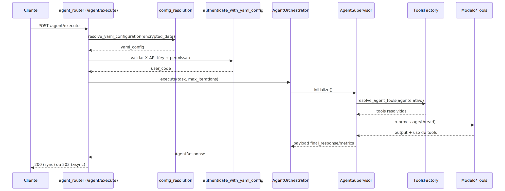
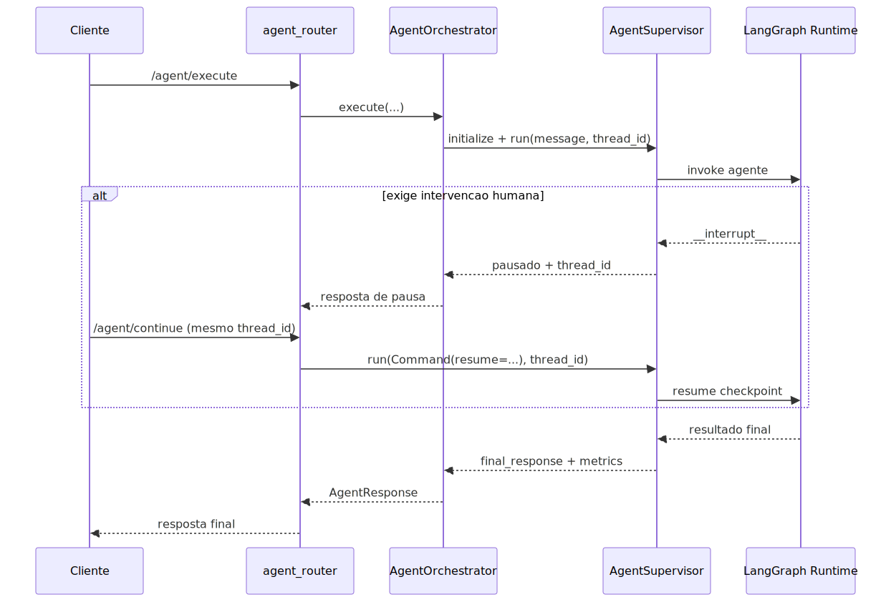
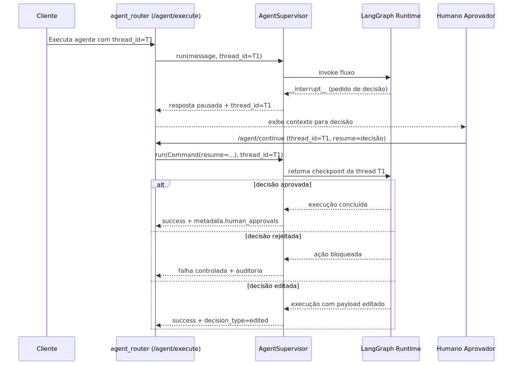

# Manual Tecnico: Agente Supervisor

Este manual cobre o contrato YAML do supervisor clássico (`AgentSupervisor`) baseado em `multi_agents[]` com `execution.type=agent`.

## 1. Escopo

Inclui:

1. Seleção do supervisor ativo.
2. Contrato completo de `multi_agents[]`.
3. Contrato de `agents[]`.
4. Precedência de tools e memória.
5. Comportamento de execução e payload de retorno.

Não inclui:

1. Parâmetros internos de cada tool do catálogo.
2. Modo `deepagent` (documentado em manual próprio).

## Leitura relacionada

- Contrato comum do YAML agentic: [README-AGENTIC-CONTRATO-COMUM.md](./README-AGENTIC-CONTRATO-COMUM.md)
- Configuração YAML da plataforma: [README-CONFIGURACAO-YAML.md](./README-CONFIGURACAO-YAML.md)
- Modo DeepAgent governado: [README-DEEPAGENTS-SUPERVISOR.md](./README-DEEPAGENTS-SUPERVISOR.md)
- Workflows determinísticos: [README-AGENTE-WORKFLOW.md](./README-AGENTE-WORKFLOW.md)
- Guia introdutório para YAML agentic: [README-AGENTIC-INICIANTES.md](./README-AGENTIC-INICIANTES.md)
- Versão didática 101 deste assunto: [tutorial-101-agentes.md](./tutorial-101-agentes.md)

## 1.1 Posicionamento Atual do Modo `agent`

Leitura prática:

1. `execution.type=agent` continua suportado quando o produto ainda precisa de `memory.agent_conversation_history` e `memory.qa_short_history` no comportamento clássico.
2. O modo clássico deve ser escolhido por necessidade real dos contratos clássicos de histórico, não por compatibilidades antigas já removidas.
3. Recursos novos de profundidade, governança local, memória persistente por identidade e especialistas remotos devem nascer em `execution.type=deepagent`, não no modo clássico.
4. O modo clássico continua sendo a escolha correta quando o fluxo é mais simples e depende explicitamente dos contratos clássicos de histórico conversacional.

## Diagrama de Sequencia: Agente Supervisor (execution.type=agent)

## Diagrama de Sequencia: Processo Macro Agente Supervisor

## 2. Sintaxe Canônica de Supervisor

Leitura prática da sintaxe canônica:

1. O bloco `memory` pode ativar `checkpointer` em SQLite e `agent_conversation_history` em Redis.
2. `global_tools_configuration` e `tools_library` ficam na raiz como baseline de ferramentas.
3. `selected_supervisor` aponta para o supervisor ativo, por exemplo `supervisor_operacional`.
4. O item correspondente em `multi_agents` precisa estar habilitado, declarar `execution.type=agent` e carregar prompt, directives, configurações locais, catálogo local, agentes e tenants.

## 3. Seleção do Supervisor Ativo

Regras de resolução (`SupervisorConfigResolver`):

1. `multi_agents` deve ser lista não vazia.
2. Cada item precisa de `id` único.
3. `selected_supervisor` é o seletor primário quando existe na raiz do YAML compilado.
4. `enabled` continua sendo uma validação complementar de consistência:

- o supervisor apontado por `selected_supervisor` precisa existir em `multi_agents`.
- o supervisor apontado por `selected_supervisor` precisa estar com `enabled: true`.
- se `selected_supervisor` não existir, o runtime ainda precisa encontrar exatamente um item habilitado para evitar ambiguidade.

Observação importante:

1. `selected_supervisor` é a chave raiz governada do assembly AST, do merge canônico e do parser NL.
2. No runtime alinhado, essa chave governa a seleção ativa tanto no modo clássico quanto no modo deepagent.
3. O modo clássico e o modo deepagent compartilham a mesma chave raiz no assembly; o que muda é `execution.type` de cada item em `multi_agents[]`.

Valores suportados em `execution.type`:

1. `agent` => modo clássico.
2. `deepagent` => modo deepagent.
3. `workflow` => valor aceito na normalização do assembly, mas a execução
  por workflow pertence ao runtime específico de workflows e deve ser
  tratada pelo manual de workflow, não como comportamento próprio do
  `AgentSupervisor` clássico documentado aqui.

## 4. Contrato de `multi_agents[]`

| Campo | Tipo | Obrigatorio | Default | Efeito |
| --- | --- | --- | --- | --- |
| `id` | `str` | sim | - | Identificador único do supervisor. |
| `enabled` | `bool` | nao | `false` | Marca supervisor como ativo candidato. |
| `execution.type` | `str` | nao | `agent` | Define o modo declarado no assembly. Neste README, o escopo operacional confirmado é `agent`; `deepagent` e `workflow` pertencem a runtimes/documentos específicos. |
| `prompt` | `str` | nao | prompt padrão | Prompt principal do supervisor. |
| `directives` | `list[str]` | nao | `[]` | Fallback de prompt quando `prompt` ausente. |
| `agents` | `list[dict]` | sim | - | Lista de agentes especialistas. |
| `tools_library` | `list[dict]` | nao | `[]` | Catálogo adicional no escopo do supervisor. |
| `local_tools_configuration` | `dict` | nao | `{}` | Overrides de configuração de tools no escopo do supervisor. |
| `local_mcp_configuration` | `dict` | nao | `{}` | Override de MCP no escopo do supervisor. |
| `tenants` | `list[dict]` | nao | `[]` | Metadado opcional de segregação por tenant. |
| `deepagent_memory` | `dict` | nao | `{}` | Ignorado no modo clássico; usado apenas no deepagent. |

Observação operacional importante:

1. No runtime governado pelo assembly, o contexto ativo precisa chegar ao `BaseSupervisor` já materializado com `agents`, `memory` e `tenants`.
2. `agents` e `tenants` podem ser listas vazias, mas o runtime não reidrata esses blocos buscando `agents` ou `tenants` na raiz do YAML.
3. `memory` continua sendo resolvido pelo bloco oficial da raiz, mas ele também precisa chegar pronto no contexto ativo; se vier ausente, o runtime falha cedo com erro explícito.
4. O efeito prático é simples: quando o slice governado vier incompleto, o erro aparece logo na carga da configuração, em vez de mascarar o problema com fallback estrutural legado.

## 5. Contrato de `agents[]`

Cada item de `multi_agents[].agents[]` é validado por `AgentEntry`.

| Campo | Tipo | Obrigatorio | Default | Efeito |
| --- | --- | --- | --- | --- |
| `id` | `str` | sim | - | ID único do agente. |
| `description` | `str` | sim | - | Descrição usada no roteamento e prompt. |
| `tools` | `list[str]` | sim | - | Tools habilitadas para o agente. |
| `system_prompt` | `str \| null` | nao | `null` | Prompt do agente (prioridade 1). |
| `prompt.system` | `str \| null` | nao | `null` | Prompt do agente (prioridade 2). |
| `config` | `dict` | nao | `{}` | Configuração adicional customizada. |
| `tools_config` | `dict` | nao | `{}` | Estrutura aceita pelo schema, sem uso crítico no runtime atual. |
| `local_tools_configuration` | `dict` | nao | `{}` | Overrides de tools por agente. |
| `local_mcp_configuration` | `dict` | nao | `{}` | Override de MCP no escopo do agente. |
| `limits.timeout_s` | `int` | nao | `30` | Guardrail de timeout por agente. |
| `limits.max_tool_calls` | `int` | nao | `5` | Guardrail de chamadas de tool. |
| `limits.token_budget` | `int` | nao | `8000` | Guardrail de orçamento de tokens. |
| `execution.default_mode` | `str` | nao | `auto` | Campo aceito no contrato (`auto`, `direct_sync`, `direct_async`, `subprocess`). |

Validações obrigatórias de agente (`validate_agent_entry_fields`):

1. `id` não vazio.
2. `description` não vazia.
3. `tools` com ao menos um item.
4. `config` deve ser objeto quando informado.

## 6. Prompt do Supervisor e Prompt dos Agentes

### 6.1 Prompt do supervisor (`resolve_supervisor_prompt`)

Ordem de prioridade:

1. `multi_agents[].prompt`
2. `supervisor.prompt` (raiz, se existir)
3. `multi_agents[].directives` (concatenação)
4. Prompt padrão interno

### 6.2 Prompt do agente

Ordem de prioridade:

1. `agents[].system_prompt`
2. `agents[].prompt.system`
3. Prompt padrão de agente

## 7. Precedência de Configuração de Tools

### 7.1 Catálogo efetivo (`tools_library`)

Merge por `id` (último vence):

1. `tools_library` da raiz
2. `multi_agents[].tools_library`

### 7.2 Overrides de configuração

Ordem de precedência (menor -> maior):

1. `global_tools_configuration` (raiz)
2. `multi_agents[].local_tools_configuration`
3. `multi_agents[].agents[].local_tools_configuration`

### 7.3 Resolução de tools por agente

1. Cada `tool_id` em `agents[].tools` deve existir no catálogo efetivo.
2. `ToolsFactory.resolve_agent_tools` aplica os overrides acima.
3. Ferramentas MCP adicionais podem ser mescladas ao conjunto final.

### 7.4 Configuração MCP local

Ordem de precedência do MCP local no supervisor clássico (menor -> maior):

1. `global_mcp_configuration`.
2. `multi_agents[].local_mcp_configuration`.
3. `multi_agents[].agents[].local_mcp_configuration`.

Regra prática:

1. O fluxo não deve assumir MCP por inferência textual. Se o objetivo exigir MCP e o escopo ativo não trouxer configuração compatível, o assembly devolve `questions` em vez de publicar YAML final.
2. Para catálogo e guardrails do assembly, `servers` ou `tools` já sinalizam MCP no escopo; para conexão MCP real em runtime, o bloco final ainda precisa de `servers`.

## 8. Memória no Supervisor Clássico

Fontes oficiais (raiz `memory`):

1. `memory.checkpointer` -> persistência de estado de execução.
2. `memory.agent_conversation_history` -> histórico de conversa por thread.
3. `memory.qa_short_history` -> configuração exposta no contexto (quando aplicável).

Observações:

1. Configuração fora de `memory` não é fonte oficial.
2. Sem `checkpointer`, o supervisor funciona sem persistência durável.
3. `memory.agent_conversation_history` continua contrato vivo do modo `agent`: o `AgentBuilder` ainda encapsula agentes com `RunnableWithMessageHistory` quando esse bloco está habilitado.
4. `memory.qa_short_history` continua contrato vivo: o `SupervisorConfigResolver` ainda o expõe no contexto do supervisor clássico e o slice de QA segue consumindo essa configuração.
5. Enquanto esses dois contratos existirem com uso real, a deprecação global de `execution.type=agent` seria incorreta.

## 9. Execução e Payload de Retorno

### 9.1 Entrada

`AgentSupervisor.run(message, thread_id=None, **kwargs)` aceita:

1. `message` string (fluxo normal)
2. `Command` do LangGraph (retomada/controle)

### 9.2 Saída de sucesso

Leitura prática da saída de sucesso:

1. O payload retorna `thread_id`, `status=success` e `correlation_id`.
2. `result` carrega a saída principal do fluxo.
3. `timing` expõe métricas como `total_ms`, `invoke_ms`, `overhead_ms`, `thread_generation_ms`, `config_prep_ms` e `command_detect_ms`.
4. `execution_timeline` traz a linha do tempo da execução.
5. `final_response` resume a resposta final gerada pelo supervisor.
6. `tools_usage` informa `total_calls` e o detalhamento agregado por ferramenta.

### 9.3 Saída de erro

Leitura prática da saída de erro:

1. O payload mantém `thread_id` e `correlation_id` para rastreabilidade.
2. `status=error` marca a falha terminal.
3. `error` carrega a mensagem operacional do problema.

### 9.4 Human-in-the-loop oficial (interrupt-only)

#### Diagrama de Sequencia: HIL no AgentSupervisor

Visão geral:

1. O supervisor clássico aceita retomada oficial via `Command(resume=...)` no método `run`.
2. A pausa humana do fluxo deve ser tratada pelo mecanismo oficial de `interrupt` do LangGraph.
3. A continuidade depende do mesmo `thread_id` usado na execução pausada.
4. A decisão humana deve permanecer auditável no metadata do fluxo que acionou a pausa.

Nota sobre aprovação assíncrona por canais:

1. O bloco `middlewares.human_in_the_loop.async_approval` pertence ao
  contrato DeepAgent documentado em
  [README-DEEPAGENTS-SUPERVISOR.md](./README-DEEPAGENTS-SUPERVISOR.md).
2. O modo clássico `execution.type=agent` não deve ser tratado como
  suporte automático a WhatsApp ou e-mail para HIL em background.
3. Para esse manual, o fluxo oficial continua sendo pausa por `interrupt`
  e retomada explícita por `/agent/continue` com o mesmo `thread_id`.
4. Se for necessário levar aprovação assíncrona para o AgentSupervisor
  clássico, isso precisa nascer como contrato executável próprio, com
  validação, runtime e testes, sem reaproveitar campos por inferência.

Por que existe:

1. Evita divergência entre pausa real de execução e pausa apenas lógica.
2. Garante compatibilidade direta com o contrato oficial do ecossistema LangGraph.
3. Reduz inconsistências em retomadas múltiplas, principalmente em cenários com checkpoints persistidos.
4. Facilita suporte técnico porque o ponto de retomada fica determinístico pelo `thread_id`.

Explicação conceitual:

1. O `interrupt` suspende a execução no runtime e devolve ao chamador um pedido de decisão humana.
2. A retomada é feita com `Command(resume=...)`, que injeta a resposta humana no ponto de pausa.
3. O runtime reinicia a execução do node interrompido com o estado da thread persistida.
4. Por isso, qualquer efeito externo antes da pausa deve ser idempotente para não gerar duplicidade.
5. O supervisor não deve inventar mecanismos paralelos de pausa fora do contrato oficial.

Explicação for dummies:

1. Imagine que o supervisor está executando uma tarefa sensível e precisa de um “ok humano”.
2. Em vez de só marcar um campo interno, ele aperta o botão oficial de pausa do motor.
3. O processo realmente para e espera alguém responder.
4. Quando a resposta chega, o processo volta do mesmo trilho, usando o mesmo identificador de thread.
5. Se usar outra thread, é como começar outro processo separado.
6. Isso evita confusão de estado e melhora muito a previsibilidade da operação.

Como usar na prática:

1. Execute normalmente com um `thread_id` estável.
2. Ao receber pedido de intervenção humana, responda via endpoint de continuação com a mesma thread.
3. Envie a decisão no `resume` do comando de continuação.
4. Verifique no metadata final se a decisão ficou registrada para auditoria.

Troubleshooting:

1. Sintoma: continuação não retoma o fluxo esperado.
  Diagnóstico: conferir se o `thread_id` enviado na continuação é exatamente o mesmo da pausa.
2. Sintoma: execução repete etapa anterior à pausa.
  Diagnóstico: comportamento esperado do `interrupt`; revisar idempotência de side-effects antes da pausa.
3. Sintoma: decisão humana não aparece no histórico.
  Diagnóstico: validar se o fluxo produtor da pausa grava auditoria de decisão no metadata.

## 10. Exemplos

### 10.1 Exemplo mínimo válido

Leitura prática do exemplo mínimo válido:

1. A raiz expõe uma tool direta chamada `uuid_generate`, publicada como ativa e ligada ao callable de geração de UUID.
2. Em `multi_agents`, o supervisor `sup_minimo` fica habilitado com `execution.type=agent`.
3. Esse supervisor declara um único especialista, `agente_uuid`.
4. O agente traz descrição, prompt de sistema e a tool `uuid_generate` no conjunto autorizado.

### 10.2 Exemplo completo

Leitura prática do exemplo completo:

1. `memory.checkpointer` usa SQLite com arquivo próprio do supervisor, enquanto `memory.agent_conversation_history` usa Redis com prefixo e TTL definidos.
2. `global_tools_configuration` publica `dyn_sql.timeout_seconds=20` como baseline.
3. `tools_library` registra a tool de fábrica `dyn_sql<buscar_pedido>` com leitura somente e metadados de criação da tool.
4. O supervisor `sup_operacoes` fica habilitado no modo clássico, com prompt principal e directives operacionais em português.
5. O próprio supervisor reduz `dyn_sql.timeout_seconds` para `12` no escopo local.
6. O agente `agente_atendimento` usa a mesma tool, baixa o timeout para `8` e define guardrails mais altos de tempo, chamadas de tool e orçamento de tokens.
7. O agente `agente_financeiro` reutiliza a tool `dyn_sql<buscar_pedido>`, mas com limites mais restritivos, adequados ao papel financeiro.

## 11. Matriz de Compatibilidade

| Cenário | Válido | Motivo |
| --- | --- | --- |
| Um único supervisor com `enabled: true` | sim | Seleção ativa inequívoca. |
| Dois supervisores com `enabled: true` | nao | Resolução falha por ambiguidade. |
| Agente sem `tools` | nao | Validação de agente falha. |
| `execution.type=agent` | sim | Executa `AgentSupervisor`. |
| `execution.type=deepagent` neste runtime | nao | Direciona para runtime deepagent, não o clássico. |

## 12. Restrições de Contrato

1. Use somente a sintaxe canônica documentada neste manual.
2. Configurações de memória devem permanecer em `memory.*`.
3. Campos fora do contrato explícito devem ser tratados como inválidos.

## 14. Mapeamento AST

A montagem assistida usa `AgenticDocumentAST` para o alvo de supervisor clássico.

Mapeamentos:

1. `AgenticDocumentAST.selected_supervisor` -> chave raiz `selected_supervisor` no fragmento compilado.
2. `AgenticDocumentAST.multi_agents` -> seção `multi_agents`.
3. `SupervisorAST.execution.type=agent` -> runtime clássico (`AgentSupervisor`).
4. `SupervisorAST.directives` -> `multi_agents[].directives` como fallback de prompt.
5. `AgentAST` -> item de `multi_agents[].agents[]`.

Exemplo AST:

Leitura prática do exemplo AST:

1. `selected_supervisor=sup_ast` marca o alvo ativo no fragmento compilado.
2. Em `multi_agents`, o supervisor `sup_ast` fica habilitado com `execution.type=agent`.
3. `directives` e `prompt.system` materializam a instrução principal do coordenador.
4. O agente filho `especialista` recebe descrição, prompt operacional e a tool `json_parse`.

Fluxo recomendado:

1. `draft` para gerar o supervisor AST.
2. `validate` para checar `SupervisorConfigResolver` + regras de agentes.
3. `confirm` para aplicar no YAML final.

Arquivos e classes que validam de verdade:

1. AST: `src/config/agentic_assembly/ast/document.py` -> `AgenticDocumentAST`, `src/config/agentic_assembly/ast/supervisor.py` -> `SupervisorAST`, `AgentAST`.
2. Parse: `src/config/agentic_assembly/parsers/supervisor_parser.py` -> `SupervisorParser`.
3. Validação agregada: `src/config/agentic_assembly/validators/document_validator.py` -> `DocumentSemanticValidator`.
4. Validação do alvo: `src/config/agentic_assembly/validators/supervisor_semantic_validator.py` -> `SupervisorSemanticValidator`, `src/agentic_layer/supervisor/config_resolver.py` -> `SupervisorConfigResolver`.
5. Compilação e merge: `src/config/agentic_assembly/compilers/supervisor_compiler.py` -> `SupervisorCompiler`, `src/config/agentic_assembly/compilers/document_compiler.py` -> `DocumentCompiler`.
6. Orquestração: `src/config/agentic_assembly/assembly_service.py` -> `AgenticAssemblyService`.

O que rodar ao mexer nisso:

1. Ative a `.venv` e execute `python scripts/docs/verify_agentic_ast_docs_sync.py` para validar sincronização entre documentação e AST.
2. Ainda na `.venv`, execute a bateria focal `PYTEST_DISABLE_PLUGIN_AUTOLOAD=1 pytest tests/unit/docs/test_agentic_ast_docs_sync.py tests/unit/test_agentic_assembly_service.py tests/unit/test_agentic_assembly_draft_llm_e2e.py tests/unit/test_agentic_assembly_quality_gate.py tests/unit/test_agentic_assembly_runtime_guardrails.py -q`.

## Evidência no código

1. Runtime do supervisor clássico: módulo canônico do supervisor em `src/agentic_layer/supervisor/`.
2. Resolução do supervisor ativo: `src/agentic_layer/supervisor/config_resolver.py`.
3. Orquestração HTTP e integração com o runtime: `src/orchestrators/agent_orchestrator.py`, `src/api/routers/agent_router.py`.
4. Registro e resolução de tools do agente: `src/agentic_layer/supervisor/tool_loader.py`.

## Lacunas no código

- Não encontrado no código: um payload público único, derivado automaticamente, que documente todas as variações de saída do supervisor por modo de execução.
  Onde deveria estar: schema HTTP dedicado ou documentação gerada a partir do runtime do supervisor.
