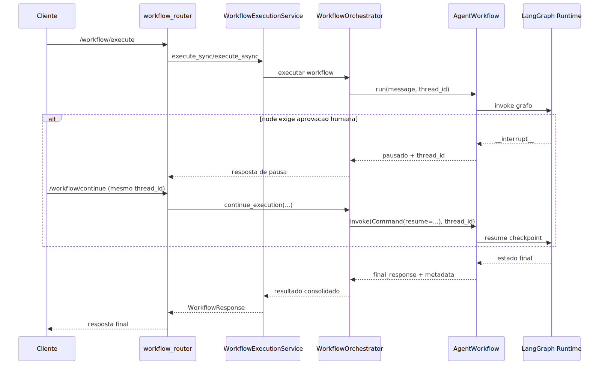

# Manual técnico, executivo, comercial e estratégico: Agente Workflow

> Este manual consolidado continua útil como visão geral do tema, mas agora foi complementado por dois manuais especializados e mais profundos: [README-CONCEITUAL-AGENTE-WORKFLOW-COMPLETO.md](./README-CONCEITUAL-AGENTE-WORKFLOW-COMPLETO.md) e [README-TECNICO-AGENTE-WORKFLOW-COMPLETO.md](./README-TECNICO-AGENTE-WORKFLOW-COMPLETO.md). Use os dois novos arquivos quando a necessidade for entender o contrato, o runtime, a sintaxe, os nodes, a retomada HIL e os exemplos reais com mais precisão.
> Para a trilha de monitoramento pós-resposta, revisão humana e melhoria futura via interaction_runs, veja também [README-CONCEITUAL-TELEMETRIA-INTERACOES-AGENTE.md](./README-CONCEITUAL-TELEMETRIA-INTERACOES-AGENTE.md) e [README-TECNICO-TELEMETRIA-INTERACOES-AGENTE.md](./README-TECNICO-TELEMETRIA-INTERACOES-AGENTE.md).

## 1. O que é esta feature

O Agente Workflow é a espinha dorsal determinística da plataforma quando o produto precisa declarar com precisão a ordem das etapas, os pontos de decisão, os dados que entram e saem de cada passo e os critérios que definem o próximo salto do processo. Ele não é um agente que improvisa o fluxo em tempo real. Ele é um runtime LangGraph montado a partir de YAML, validado por AST, compilado para um grafo executável e envolvido por telemetria, integridade estática, cache de artefato e contratos explícitos de continuidade.

Na prática, esta feature existe para responder a uma pergunta central do produto: quando um processo precisa ser repetível, auditável e seguro, como transformar um YAML em execução real sem depender de convenção implícita. O workflow resolve isso com três camadas acopladas de forma consciente: contrato declarativo, validação forte e runtime executável.

Em linguagem simples, o workflow é o mecanismo usado quando o sistema não quer apenas “chegar numa resposta”, mas provar como chegou, em qual ordem, com quais desvios, com quais dados e com quais limites.

## 2. Que problema ela resolve

Sem workflow, parte dos processos da plataforma ficaria presa a coordenação ad hoc entre agentes, chamadas de tool e decisões espalhadas em prompt ou código. Isso cria quatro dores práticas.

A primeira dor é falta de previsibilidade. Quando a ordem de execução não é declarada, o comportamento pode variar de forma difícil de auditar.

A segunda dor é diagnóstico ruim. Se um processo falha no meio, mas não deixa trilha clara de nodes, decisões e dados, suporte e operação perdem tempo tentando descobrir onde a execução realmente desviou.

A terceira dor é governança fraca de decisões. Em fluxos corporativos, algumas rotas precisam nascer de expressão, regra declarativa, condição validada ou aresta explícita, e não apenas de inferência informal.

A quarta dor é modularidade baixa. Sem workflow, processos com planejamento, execução iterativa, validação de schema, roteamento, envio de mensagens, resolução de mídia e subfluxos tendem a virar lógica dispersa em múltiplos lugares.

O workflow ataca essas dores transformando o processo em um grafo governado, com seleção explícita, AST canônica, compilação determinística e execução observável.

## 3. Visão executiva

Para liderança, o valor do workflow está em transformar automação complexa em processo controlado. Ele reduz risco operacional porque obriga o sistema a validar contrato, coerência de nodes, integridade de rotas, existência de tools e consistência de expressões antes de começar a executar.

Isso melhora previsibilidade e governança. Em vez de depender de comportamento emergente de agente, o produto passa a oferecer execução com trilho formal. Fica mais fácil responder perguntas executivas como: qual fluxo rodou, qual foi o caminho percorrido, em que passo houve falha, houve pausa humana, o processo estava íntegro antes de iniciar e quanto da lógica estava explícita no YAML.

O ganho executivo mais relevante é reduzir custo de exceção. Quanto mais processos corporativos são automatizados, mais caro fica operar fluxos opacos. Workflow existe para baixar esse custo e aumentar confiança operacional.

## 4. Visão comercial

Comercialmente, o workflow representa a capacidade de transformar operações, atendimento, integrações e automações agentic em processos vendáveis com clareza. O discurso comercial correto não é “temos um grafo”. O discurso correto é “temos automação configurável, auditável, rastreável e modular, em que cada passo é controlado por contrato”.

Isso ajuda a responder objeções comuns de clientes corporativos:

- Como saber em qual etapa o processo falhou.
- Como garantir que uma decisão siga regra de negócio e não improviso.
- Como reutilizar um subfluxo sem duplicar lógica.
- Como combinar LLM, regras, validações, tools e canais como WhatsApp sem perder controle.
- Como retomar execução pausada por aprovação humana.

O benefício percebido pelo cliente é previsibilidade com flexibilidade. A promessa comercial suportada pelo código é automação configurável e governada. A promessa que não deve ser feita é liberdade irrestrita de modelagem sem contrato. O sistema é YAML-first, mas com validação forte e sintaxe canônica.

## 5. Visão estratégica

Estratégicamente, o workflow fortalece a plataforma em cinco pontos.

O primeiro é a convergência entre YAML-first e execução real. O documento declarativo não fica solto. Ele vira AST, passa por parser, compilador, validação semântica e só então vira runtime.

O segundo é modularidade. Com sub_workflow, planner, executor, tool, schema_validator e nodes específicos de canal, a plataforma pode decompor processos complexos em partes menores e reutilizáveis.

O terceiro é governança de decisões. O produto passa a suportar node-driven e edge-first com regras claras sobre expressões, condições e destinos.

O quarto é observabilidade. O workflow produz estado, metadata, execution_trace, workflow_path, logs e marcadores específicos de transição.

O quinto é extensão futura. Como os modos de node vivem em AST e NodeFactory, a plataforma consegue crescer de forma mais controlada, adicionando novas capacidades sem diluir a lógica do runtime em condicionais espalhadas.

## 6. Conceitos necessários para entender

### 6.1. Workflow ativo

Workflow ativo é o fluxo escolhido para execução no documento agentic. O ponto de partida é selected_workflow. Se ele estiver ausente, a validação exige exatamente um workflow habilitado. Se houver mais de um habilitado sem seleção explícita, o documento é ambíguo e deve falhar.

Esse conceito importa porque o runtime não deveria “adivinhar” qual processo o usuário pretendia rodar.

### 6.2. AST canônica

AST, aqui, é a representação tipada do YAML de workflow. Ela define quais modos existem, quais campos são aceitos e como cada parte do documento deve ser lida pelo sistema. Isso importa porque o YAML persistido não pode ser tratado como texto livre sem contrato.

### 6.3. Node-driven

Node-driven é o modo em que a sequência do grafo nasce principalmente dos próprios nodes e de seus campos de roteamento. Exemplos: router.go_to_node, if.true_go_to, if.false_go_to, executor.loop_more_label e executor.loop_done_label.

Esse modo é útil para fluxos mais lineares ou mais compactos.

### 6.4. Edge-first

Edge-first é o modo em que a transição é declarada em workflows[].edges, usando from, to, when e default. Nesse caso, o grafo passa a depender de arestas explícitas em vez de inferir a ordem apenas pelos nodes.

Esse modo é útil quando a equipe quer legibilidade arquitetural e auditoria clara das transições.

### 6.5. StateGraph

StateGraph é o grafo executável do LangGraph. No projeto, ele é o runtime final compilado pelo AgentWorkflow. Isso importa porque o workflow do produto não é apenas uma configuração passiva. Ele vira um grafo real com state compartilhado entre nodes.

### 6.6. Estado do workflow

O estado do workflow é o contrato vivo compartilhado entre os nodes. Ele contém messages, input_text, last_output, current_step, metadata, context, variables, status, error_log e max_iterations.

Esse estado existe para transportar dados, controlar progresso e permitir diagnóstico. Sem ele, o processo seria uma cadeia opaca de funções sem memória operacional.

### 6.7. Integridade estática

Integridade estática é a checagem feita antes da compilação do grafo. Ela valida id de nodes, modos suportados, presença de prompt em modos críticos, regras de router, sintaxe de nodes especiais, coerência de edges e destinos declarados.

Ela é importante porque separa erro de contrato de erro de execução.

### 6.8. Planner e executor

Planner e executor são um par tático importante. O planner decompõe o trabalho em passos. O executor percorre esse plano, controla cursor, lida com retries, human approval e conclui o plano de forma iterativa.

Esse par é importante porque separa pensar o processo de executar o processo.

### 6.9. Sub-workflow

Sub-workflow é a capacidade de um node delegar a execução a outro workflow. Ele é importante porque permite modularizar o processo sem perder o contrato declarativo.

### 6.10. Human-in-the-loop no workflow

No escopo lido, o workflow suporta pausas humanas principalmente em nodes como executor, por meio de configuração de human approval e retomada usando thread_id e Command resume. Isso importa porque alguns passos não devem seguir automaticamente sem decisão humana.

## 7. Como a feature funciona por dentro

O fluxo interno começa com a seleção do workflow ativo. O WorkflowConfigResolver identifica o contexto ativo e o AgentWorkflow carrega esse contexto como fonte de verdade. Em seguida, o runtime roda um WorkflowIntegrityAnalyzer para validar o fluxo antes da compilação.

Se o relatório de integridade acusar erro, a inicialização falha antes de compilar o grafo. Isso não é excesso de rigor. É proteção contra execução parcial de um processo mal modelado.

Se o relatório estiver íntegro, o runtime inicializa ToolsFactory, MemoryFactory e checkpointer, resolve configuração de memória, define max_iterations, calcula chave de cache do workflow, verifica se já existe um artefato compilado reaproveitável e, se necessário, monta um StateGraph novo.

Na compilação, o AgentWorkflow adiciona nodes por meio do NodeFactory e depois decide como construir as transições. Se houver edges válidas, entra em edge-first via EdgeCompiler. Se não houver, entra em node-driven e cria arestas segundo o tipo de cada node.

Na execução, o runtime cria o estado inicial, define thread_id, workflow_id, recursion_limit e executor_max_iterations, invoca o grafo compilado e normaliza o resultado final em final_response, execution_steps, thread_id, workflow_metadata e sinais adicionais de canal.

Em fluxos pausados por human-in-the-loop, a continuação é feita pelo orchestrator e pela rota de continue, usando o mesmo thread_id para retomar a execução.

## 8. Divisão em etapas ou submódulos

### 8.1. Seleção e hidratação do contexto

Esta etapa resolve selected_workflow, identifica o fluxo ativo e hidrata a configuração completa. Ela existe para impedir execução ambígua e garantir que o runtime opere sobre um contexto já consolidado.

Recebe o YAML e entrega o workflow ativo, pronto para análise e compilação.

### 8.2. Parse e AST canônica

Nesta etapa, o WorkflowParser percorre workflows[], identifica nodes, edges e tools, converte cada modo conhecido para sua AST correspondente e transforma modos inválidos em UnsupportedNodeAST, emitindo diagnóstico.

Ela existe para separar “YAML aceito como texto” de “workflow aceito como contrato executável”.

### 8.3. Compilação canônica

O WorkflowCompiler normaliza ids de workflow e node, emite warnings quando precisa ajustar identificadores e rejeita nodes unsupported na compilação. Isso é importante porque o runtime precisa de ids estáveis e únicos para construir o grafo.

### 8.4. Validação semântica

Nesta etapa, o WorkflowSemanticValidator consolida regras fortes: existência do workflow selecionado, unicidade de ids, tools válidas, referências cruzadas, coerência de sub_workflow, targets de router e if, edges válidas, default duplicado, expressões parseáveis e integridade estática do runtime.

Ela existe para matar ambiguidades antes de entrarem em produção.

### 8.5. Inicialização de runtime

Aqui o AgentWorkflow inicializa ToolsFactory, MemoryFactory, checkpointer e cache do workflow compilado. Essa etapa existe para preparar recursos compartilhados e reaproveitar o grafo quando a configuração não mudou.

### 8.6. Construção do grafo

O StateGraph recebe nodes vindos do NodeFactory e depois ganha arestas por EdgeCompiler ou pelo construtor node-driven. Essa etapa existe para transformar o contrato declarativo em execução real.

### 8.7. Execução e retorno

O runtime constrói o estado inicial, roda o grafo, normaliza o status, trata erro_log e produz um envelope consumível pelo orchestrator e pela API.

## 9. Pipeline ou fluxo principal

O diagrama mostra a lógica principal: o workflow não começa na invocação do modelo, e sim no contrato. Primeiro o sistema decide se o documento é compilável. Só depois ele compila e executa.

### 9.1. Entrada declarativa

A entrada formal é a combinação de selected_workflow, workflows_defaults e workflows[]. Cada workflow pode trazer settings, tools_library, local_tools_configuration, local_mcp_configuration, nodes e edges.

Nos trechos lidos, tools_library e local_tools_configuration participam claramente da validação e da resolução de tools. O consumo runtime específico de local_mcp_configuration não ficou confirmado nos trechos lidos, então ele deve ser tratado como parte do contrato AST, não como comportamento operacional já comprovado aqui.

### 9.2. Parse e normalização

O parser tenta preservar o máximo possível do documento, mas já acusa modo não suportado, tipo inválido de nodes ou edges e falhas de validação. Modos desconhecidos não avançam como nodes normais; eles viram UnsupportedNodeAST e impedem compilação segura.

### 9.3. Validação forte

A validação semântica confere seleção, habilitação, tools, referências, expressions e edges. Esse ponto é importante porque o workflow aceita expressões em if, function, rule_router e edges.when, e essas expressões são parseadas e validadas antes da execução.

### 9.4. Montagem do runtime

O AgentWorkflow analisa integridade, inicializa ferramentas, memória e checkpointer e monta ou reutiliza o grafo compilado.

### 9.5. Execução do estado

O runtime injeta messages, input_text, last_output, metadata, variables, status, error_log e max_iterations. Esse estado é o eixo de passagem de dados entre os nodes.

### 9.6. Retorno

O resultado consolidado entrega final_response, execution_steps, workflow_metadata, sinais de canal como outgoing_message quando aplicável, e thread_id para continuidade ou retomada.

## 10. Sintaxe e contrato do workflow

### 10.1. selected_workflow

Escolhe explicitamente qual workflow habilitado deve ser o ativo em runtime. É importante porque elimina ambiguidade quando o documento carrega mais de um workflow.

### 10.2. workflows_defaults

É o bloco de defaults para a coleção de workflows. Ele é importante para reduzir duplicação. Nos trechos lidos, ele também participa da validação de local_tools_configuration e do catálogo efetivo de tools.

### 10.3. workflows[]

Cada item em workflows é um workflow completo com id, nome opcional, descrição opcional, enabled, settings, tools_library, local_tools_configuration, local_mcp_configuration, nodes e edges. Esse bloco é importante porque concentra o contrato executável do fluxo.

### 10.4. settings.max_iterations

Controla o freio de iteração do workflow. Ele é importante para evitar loops descontrolados, principalmente quando existe executor ou back edges fora do executor.

### 10.5. nodes[]

É a lista dos nodes do workflow. Todo node canônico herda campos comuns: id, mode, prompt, reads, writes, tools, params, settings, router, retry_policy e human_approval. Isso é importante porque cria uma gramática comum entre tipos diferentes de node.

### 10.6. edges[]

Quando presente e não vazia, ativa o modo edge-first. Cada edge usa from, to, when e default. Esse bloco é importante porque torna a topologia do grafo explícita.

### 10.7. Campos comuns dos nodes

Os campos comuns confirmados no código são estes:

- id: identificador único do node.
- mode: tipo do node e discriminador da AST.
- prompt: especialmente importante em agent, router, planner e executor.
- reads: declara o que o node lê do estado.
- writes: declara onde o node grava resultados.
- tools: catálogo de tools que o node pode usar.
- params: parâmetros específicos do tipo de node.
- settings: ajustes de execução do node.
- router: mapa de labels e destinos para nodes de roteamento.
- retry_policy: política de retry por node.
- human_approval: política de aprovação humana no node.

Esses campos importam porque evitam configuração solta e deixam mais claro o contrato operacional de cada passo.

## 11. Tipos de nodo e por que cada um é importante

### 11.1. agent

O node agent é o ponto em que o workflow delega interpretação ou geração ao modelo. Ele aceita output_schema e auto_retry além dos campos comuns. É importante quando o processo precisa de um passo realmente agentic, mas ainda dentro de um trilho explícito.

Seu valor prático está em combinar LLM com contrato local de leitura, escrita, tools e formato de saída.

### 11.2. router

O router decide o próximo caminho por labels. Ele depende de router.allowed_labels e, em node-driven, de router.go_to_node e fallback_node. Testes lidos mostram comportamento importante: matching de labels, fallback para DEFAULT e registro de router_decision e router_fallback_target no metadata.

Ele é importante porque separa decisão de rota da execução do passo seguinte.

### 11.3. planner

O planner constrói um plano estruturado com steps. Os testes confirmam recursos como output_key, cursor_key, enforce_list, coerce_json e auto_ids, além de parsing de JSON bruto ou em code block, remoção de tools inválidas e geração de warnings.

Ele é importante porque cria uma tática executável antes da ação. Em vez de agir sem decomposição, o sistema primeiro define os passos.

### 11.4. executor

O executor percorre o plano passo a passo. Os testes confirmam cursor, plan_done, retries, human approval, edições humanas, limite de iterações e summary por passo. Ele também usa failure_policy e settings específicos do executor.

Ele é importante porque transforma planejamento em ação com controle de progresso.

### 11.5. if

O node if avalia uma expressão booleana em condition e marca TRUE ou FALSE em metadata. Em node-driven, usa true_go_to e false_go_to. É importante quando a bifurcação precisa ser declarativa, simples e previsível.

### 11.6. set

O set materializa atribuições no estado via params.assign. Os testes confirmam expressões, interpolação e persistência em variables e metadata. Ele é importante para enriquecer estado sem depender de modelo nem tool externa.

### 11.7. merge

O merge consolida dados de múltiplas fontes, com strategy e comportamento para deduplicação e remoção de nulos. É importante para convergência de ramos e recomposição de payloads.

### 11.8. function

O function executa computação local com params.expression ou params.script. Os testes confirmam timeout_seconds, result_var, helpers como json_loads e falha explícita quando o script não define resultado. Ele é importante para regras e transformações locais que não justificam uma tool externa.

### 11.9. transform

O transform prepara payloads, mensagens e campos intermediários antes de seguir para outro passo. Ele é importante porque muito do valor do workflow está em preparar dado certo para o node seguinte, e não apenas em decidir rota.

### 11.10. rule_router

O rule_router avalia params.rules com when e label, além de default_label. Os testes confirmam fallback DEFAULT, funcionamento em edge-first mesmo sem go_to_node completo e rejeição de sintaxe legada como condition e go_to dentro das regras.

Ele é importante quando a decisão precisa nascer de regra explícita e auditável, não apenas de um LLM.

### 11.11. tool

O node tool executa uma ferramenta explícita via params.tool_id e arguments. Os testes confirmam resolução de argumentos por expressão, persistência de resultado e rejeição de sintaxe legada params.tool. Ele é importante porque integra capacidades externas sem dissolver o contrato do workflow.

### 11.12. schema_validator

O schema_validator valida um payload contra JSON Schema, com source, parse_json, schema e on_error. Os testes confirmam persistência de dado validado, registro em metadata e possibilidade de seguir em frente com on_error log. Ele é importante porque protege fronteiras de dado entre etapas.

### 11.13. sub_workflow

O sub_workflow delega execução para outro workflow, com workflow_id, input_path, inherit_variables, inherit_metadata, inherit_messages e result_path. Os testes confirmam prevenção de recursão, override de input_text e aplicação de writes a partir do retorno do fluxo filho.

Ele é importante porque permite modularizar o processo e reaproveitar fluxos sem duplicação.

### 11.14. whatsapp_media_resolver

Este node prepara mídia para uso em fluxos de WhatsApp, resolvendo uploads, cache TTL, fallback por URL e payload enriquecido. Os testes confirmam cache de media_id, reaproveitamento e fallback quando faltam credenciais.

Ele é importante porque mídia tem exigências operacionais próprias e não deve ser tratada como simples texto.

### 11.15. whatsapp_send

Este node monta a sequência final de envio para WhatsApp, gerando estrutura de saída pronta para o canal. Ele é importante porque fecha a execução de canal dentro do próprio grafo, sem espalhar a lógica terminal em integrações soltas.

## 12. Modos de execução do workflow

O sistema trabalha com três camadas de modo que não devem ser confundidas.

A primeira é o modo do documento: workflow.

A segunda é o modo topológico do grafo: node-driven ou edge-first.

A terceira é o modo operacional da API: direct_sync, direct_async e subprocess, sendo subprocess degradado para direct_async segundo a descrição da rota.

Essa separação é importante porque uma mesma modelagem funcional pode ser executada por caminhos operacionais diferentes sem mudar a semântica do grafo.

## 13. Configurações que mudam o comportamento

### 13.1. selected_workflow

Muda qual workflow o sistema executa. É a configuração mais importante do ponto de vista de seleção.

### 13.2. enabled

Controla se um workflow pode ser escolhido. Se selected_workflow apontar para workflow desabilitado, a validação falha.

### 13.3. settings.max_iterations

Controla o limite de iteração do runtime e do executor. É especialmente importante em workflows com loop.

### 13.4. edges

Quando presente e não vazia, muda o runtime para edge-first. Isso altera completamente a forma como as transições são compiladas.

### 13.5. retry_policy

Controla repetição local por node. É importante para distinguir falha transitória de erro estrutural.

### 13.6. human_approval

Controla pontos de aprovação humana. É relevante principalmente em nodes de execução sensível.

### 13.7. output_schema e auto_retry em agent

Mudam a forma como o node agent lida com estrutura de saída e repetição controlada.

### 13.8. planner settings

output_key, cursor_key, enforce_list, coerce_json e auto_ids alteram a forma como o planner produz o plano.

### 13.9. executor settings

loop_more_label, loop_done_label, emit_step_summary, passthrough_inputs, safe_format_inputs e políticas associadas mudam a forma como o executor progride.

## 14. Contratos, entradas e saídas

Os contratos principais confirmados no código são:

- documento YAML com selected_workflow, workflows_defaults e workflows;
- cada workflow com nodes e edges;
- estado do workflow com messages, input_text, last_output, current_step, metadata, context, variables, status, error_log e max_iterations;
- envelope de retorno do orchestrator com final_response, execution_steps, thread_id, workflow_metadata, analysis e sinais de sucesso;
- rotas HTTP em /workflow/execute e /workflow/continue.

Na API, a rota de execução aceita message, user_email, thread_id, format, correlation_id, encrypted_data, execution_mode e estimated_duration_seconds. A rota de continue aceita thread_id, correlation_id, human_response, encrypted_data e user_email.

Esses contratos importam porque conectam a modelagem YAML ao runtime e à operação externa do sistema.

## 15. O que acontece em caso de sucesso

No caminho feliz, o workflow é selecionado corretamente, passa por parser, compilação e validação semântica, é considerado íntegro pelo analyzer, vira StateGraph compilado, é executado com estado inicial consistente e retorna final_response, execution_steps, workflow_metadata e thread_id.

Quando há planner e executor, o sucesso pode incluir criação de plano, avanço de cursor, marcação de plan_done e resumo de execução por passo. Quando há WhatsApp, o sucesso pode incluir outgoing_message e metadata de canal. Quando há HIL, o sucesso pode significar pausa governada e retomada futura, não apenas conclusão imediata.

## 16. O que acontece em caso de erro

Os principais erros confirmados no código lido são estes.

### 16.1. Seleção ambígua de workflow

Se selected_workflow estiver ausente e houver mais de um workflow habilitado, a validação falha.

### 16.2. Workflow inexistente ou desabilitado

Se selected_workflow apontar para id inexistente ou desabilitado, o documento é rejeitado.

### 16.3. Node sem id ou modo inválido

O parser e a integridade rejeitam nodes sem identidade válida ou com modo não suportado.

### 16.4. Prompt ausente em modos críticos

Nodes agent, router, planner e executor exigem prompt.system válido na análise de integridade.

### 16.5. Destino inexistente em router, if ou edges

O validador rejeita labels sem destino, fallback inválido, if com target inexistente, sub_workflow inexistente e edges com from ou to inválidos.

### 16.6. Rule router com sintaxe legada

Os testes confirmam falha explícita quando a regra usa condition ou go_to em vez de when e label.

### 16.7. Function sem resultado ou com timeout

O node function falha quando o script não define variável de resultado ou estoura timeout.

### 16.8. Tool node sem tool_id válido

O node tool falha quando não recebe params.tool_id ou quando usa campo legado params.tool.

### 16.9. Executor excedendo max_iterations

O executor marca falha, registra erro específico e encerra o plano.

## 17. Observabilidade e diagnóstico

O workflow foi desenhado para ser rastreável. Os principais sinais confirmados no código são estes.

O primeiro é o relatório de integridade, com is_valid, errors, warnings, node_count, router_nodes_checked, missing_nodes, error_count e warning_count.

O segundo é o estado do workflow, especialmente metadata, workflow_path, execution_trace, status e error_log.

O terceiro é o logging do runtime, com marcadores para início de execução, sucesso, erro, compilação edge-first, transição de edge e execução de node.

O quarto é o envelope do orchestrator, que devolve execution_steps e analysis de forma normalizada.

A ordem correta de investigação é esta:

1. Confirmar qual workflow foi selecionado.
2. Ler o relatório de integridade.
3. Confirmar se o grafo entrou em edge-first ou node-driven.
4. Verificar workflow_path, execution_trace, router_decision, if_results, plan_cursor e plan_done conforme o tipo de fluxo.
5. Só então aprofundar no node específico.

## 18. Impacto técnico

Tecnicamente, o workflow encapsula complexidade de orquestração em um contrato forte. Ele reduz acoplamento implícito entre YAML e runtime, melhora testabilidade por meio de AST, parser, compiler, semantic validator e testes por tipo de node, e aumenta observabilidade com estado estruturado e trilha de execução.

Também melhora manutenção porque separa responsabilidade por tipo de node, usando NodeFactory e handlers especializados. Isso evita um runtime monolítico com lógica de todos os passos misturada num único lugar.

## 19. Impacto executivo

Executivamente, o workflow transforma automação em processo audível. Isso reduz risco de negócio, facilita governança e melhora previsibilidade operacional. Também ajuda liderança a escalar fluxos sem depender de interpretação informal de como o sistema decide cada passo.

## 20. Impacto comercial

Comercialmente, o workflow permite vender automação modular e governada para atendimento, processos internos, integrações e execução multietapa com IA. O diferencial não é apenas “ter IA no processo”. O diferencial é ter IA inserida em um fluxo controlado, com regras, validações, checkpoints e canais de saída previsíveis.

## 21. Impacto estratégico

Estratégicamente, o workflow prepara a plataforma para expansão controlada de automações mais ricas. Ele permite combinar agentic, regras, schema, tools e canais sem dissolver a governança em lógica manual. Isso fortalece a visão YAML-first da plataforma e sustenta evolução futura com menor risco de fragmentação arquitetural.

## 22. Exemplos práticos guiados

### 22.1. Workflow de atendimento com triagem

Cenário: o fluxo recebe uma pergunta, usa router para classificar intenção e segue para um branch específico.

Entrada: selected_workflow aponta para um fluxo com agent inicial e router.

Processamento: o router produz uma label válida, grava router_decision no metadata e o runtime segue para o próximo node compatível.

Saída: resposta final e execution_steps mostrando a trilha principal.

Valor: reduz improviso em triagens sensíveis.

### 22.2. Workflow com planner e executor

Cenário: a tarefa precisa ser quebrada em passos antes de executar.

Entrada: planner gera JSON de steps e executor percorre cada etapa.

Processamento: o planner grava plan e plan_cursor, o executor avança o cursor, executa o passo e marca plan_done quando concluir.

Saída: processo mais explicável e auditável do que uma execução única sem decomposição.

### 22.3. Workflow com validação de schema

Cenário: um node anterior gera um payload JSON que precisa ser validado antes de seguir.

Entrada: schema_validator com source e schema explícitos.

Processamento: o node valida o payload, registra resultado e decide se falha ou segue conforme on_error.

Saída: menor risco de quebrar em node posterior por dado inválido.

### 22.4. Workflow com sub_workflow

Cenário: uma parte do processo já existe como fluxo independente.

Entrada: sub_workflow com workflow_id e regras de herança de estado.

Processamento: o fluxo filho recebe estado inicial preparado e devolve resultado reaplicado ao pai.

Saída: reutilização de lógica sem duplicação.

### 22.5. Workflow de WhatsApp

Cenário: o processo precisa resolver mídia e enviar mensagem estruturada no canal.

Entrada: whatsapp_media_resolver seguido de whatsapp_send.

Processamento: o runtime resolve media_id, usa cache quando possível e constrói outgoing_message final.

Saída: integração de canal mantida dentro do mesmo grafo.

## 23. Explicação 101

Pense no workflow como um roteiro de operação que o sistema consegue ler, validar e executar. Cada node é um passo do roteiro. Alguns passos pensam, outros decidem, outros validam, outros transformam, outros chamam tool, outros disparam canal. O importante é que o sistema sabe qual passo veio antes, qual vem depois e o que deve acontecer se algo der errado.

Em vez de deixar a lógica “espalhada” entre prompts e código, o workflow concentra a história inteira do processo em um contrato executável.

## 24. Limites e pegadinhas

Algumas interpretações erradas precisam ser evitadas.

A primeira é achar que qualquer YAML com nodes vira workflow executável. Não vira. Modos não suportados e sintaxe incoerente são rejeitados.

A segunda é achar que edge-first é apenas um detalhe visual. Não é. Ele muda a forma como o grafo é compilado.

A terceira é confundir integridade estática com sucesso de execução. Um workflow pode estar íntegro e ainda falhar em tempo de execução por dados, tools ou integração.

A quarta é achar que function é um escape livre para qualquer script sem custo. O runtime impõe timeout e exige resultado explícito.

A quinta é confundir cache do workflow compilado com memória de execução. O cache reaproveita o artefato do grafo. O estado continua sendo construído por thread e por execução.

A sexta é presumir que local_mcp_configuration já tem uso operacional confirmado apenas porque existe na AST. Nos trechos lidos, isso não ficou demonstrado de ponta a ponta.

## 25. Troubleshooting

### 25.1. O workflow não executa e falha antes de começar

Sintoma: erro na inicialização.

Causa provável: integridade estática falhou, selected_workflow é inválido, nodes estão vazios ou há modo não suportado.

Como confirmar: revisar relatório de integridade e validação semântica.

### 25.2. O router não segue a rota esperada

Sintoma: fluxo cai em DEFAULT ou fallback.

Causa provável: label inválida, label não mapeada, fallback_node ativo ou decisão não reconhecida.

Como confirmar: verificar router_decision, router_fallback_target e configuração do router.

### 25.3. O executor entra em falha cedo

Sintoma: status failed com plan_done verdadeiro e erro específico.

Causa provável: max_iterations excedido, erro irrecuperável do passo ou decisão humana de rejeição.

Como confirmar: revisar error_log, execution_trace e metadata de approvals.

### 25.4. O sub_workflow falha imediatamente

Sintoma: erro antes de chamar o fluxo filho.

Causa provável: workflow_id vazio, input_path inválido ou recursão detectada.

Como confirmar: revisar params do node e workflow_stack no metadata.

### 25.5. O edge-first não escolhe uma transição

Sintoma: erro dizendo que nenhuma edge foi selecionada.

Causa provável: condições when não bateram e não existe default válido.

Como confirmar: revisar edges da origem, expressões when e defaults.

## 26. Diagramas

O diagrama mostra a ordem prática da execução exposta pela API. Ele ajuda a entender que a rota HTTP não executa o grafo diretamente. Ela passa por serviço, orchestrator e runtime antes de chegar no StateGraph.

## 27. Mapa de navegação conceitual

O workflow pode ser lido em seis camadas conceituais:

- seleção do fluxo ativo;
- AST e parser do contrato;
- compilação e validação semântica;
- runtime AgentWorkflow com NodeFactory;
- grafo executável em node-driven ou edge-first;
- orchestrator e API para execução e retomada.

Se um problema surgir, normalmente ele pertence a uma dessas camadas. Isso ajuda a não misturar erro de YAML com erro de runtime ou erro de integração.

## 28. Como colocar para funcionar

O caminho confirmado no código é este:

- declarar ao menos um workflow em workflows[];
- habilitar o fluxo desejado e selecioná-lo por selected_workflow quando houver mais de um;
- definir nodes válidos com modos canônicos;
- escolher node-driven ou edge-first;
- usar /workflow/execute para disparar execução;
- usar /workflow/continue para retomar fluxo pausado por HIL.

A rota de execução suporta seleção de modo operacional entre auto, direct_sync, direct_async e subprocess, conforme heurística da API.

## 29. Exercícios guiados

### 29.1. Exercício de topologia

Objetivo: distinguir node-driven de edge-first.

Passos:

1. Imaginar um workflow com router.go_to_node e sem edges.
2. Imaginar o mesmo workflow com edges declaradas.
3. Explicar o que muda na compilação do grafo.

Resposta esperada: node-driven deriva a transição do node; edge-first deriva das arestas explícitas.

### 29.2. Exercício de estado

Objetivo: entender por que variables e metadata coexistem.

Passos:

1. Associar variables a dados de trabalho.
2. Associar metadata a trilha operacional, decisões e auditoria.
3. Explicar por que isso ajuda no diagnóstico.

### 29.3. Exercício de planner e executor

Objetivo: entender a separação entre pensar e executar.

Passos:

1. Imaginar uma tarefa longa sem planner.
2. Imaginar a mesma tarefa com planner gerando steps.
3. Explicar por que o executor ganha previsibilidade nesse segundo cenário.

## 30. Checklist de entendimento

- Entendi o que é o workflow na arquitetura do produto.
- Entendi a diferença entre contrato AST e runtime compilado.
- Entendi selected_workflow e a regra de seleção obrigatória.
- Entendi a diferença entre node-driven e edge-first.
- Entendi o papel do estado compartilhado.
- Entendi por que integridade estática existe antes da execução.
- Entendi os campos comuns dos nodes.
- Entendi o papel de cada tipo de node canônico.
- Entendi como planner e executor trabalham juntos.
- Entendi como sub_workflow modulariza o processo.
- Entendi como WhatsApp entra no workflow sem sair do grafo.
- Entendi os principais erros confirmados no código.
- Entendi como diagnosticar problemas pela trilha de execução.
- Entendi o valor técnico, executivo, comercial e estratégico da feature.

## 31. Evidências no código

- src/config/agentic_assembly/ast/workflow.py: lido para confirmar o contrato AST canônico, os modos de node suportados e a sintaxe formal de edges.
- src/config/agentic_assembly/parsers/workflow_parser.py: lido para confirmar o parse leniente de workflows, nodes, edges e o tratamento de modos não suportados.
- src/config/agentic_assembly/compilers/workflow_compiler.py: lido para confirmar normalização de ids e rejeição de nodes fora do contrato compilável.
- src/config/agentic_assembly/validators/workflow_semantic_validator.py: lido para confirmar seleção do workflow, validação de tools, referências cruzadas, edges e expressões.
- src/agentic_layer/workflow/integrity_analyzer.py: lido para confirmar validações estáticas do runtime antes da compilação do grafo.
- src/agentic_layer/workflow/agent_workflow.py: lido para confirmar cache do workflow compilado, NodeFactory, montagem do StateGraph, modo edge-first ou node-driven, execução e retorno.
- src/agentic_layer/workflow/workflow_state.py: lido para confirmar a estrutura do estado compartilhado do workflow.
- src/agentic_layer/workflow/edge_compiler.py: lido para confirmar compilação declarativa de edges, avaliação de when, default e logging de transições.
- src/orchestrators/workflow_orchestrator.py: lido para confirmar o papel do orchestrator na inicialização, execução e retomada com HIL.
- src/api/routers/workflow_router.py: lido para confirmar as rotas HTTP /workflow/execute e /workflow/continue e seus modos operacionais.
- tests/unit/test_workflow_runtime_nodes_agent_router.py: lido para confirmar fallback, matching de labels e comportamento do router e do agent.
- tests/unit/test_workflow_runtime_nodes_function_tool_merge.py: lido para confirmar expression, script, timeout, tool_id e merge com deduplicação.
- tests/unit/test_workflow_runtime_nodes_set_if.py: lido para confirmar assign, decisão TRUE e FALSE, snapshots e validações de set e if.
- tests/unit/test_workflow_runtime_planner.py: lido para confirmar parsing do plano, coerce_json, auto_ids e warnings de tool no planner.
- tests/unit/test_workflow_runtime_executor.py: lido para confirmar cursor, retries, human approval, max_iterations e plan_done no executor.
- tests/unit/test_workflow_runtime_nodes_schema_rule.py: lido para confirmar schema_validator, rule_router e rejeição de sintaxe legada.
- tests/unit/workflow/nodes/test_sub_workflow_node.py: lido para confirmar input_path, prevenção de recursão e result_path no sub_workflow.
- tests/unit/test_workflow_runtime_nodes_whatsapp.py: lido para confirmar cache de mídia, fallback por URL e montagem de outgoing_message nos nodes de WhatsApp.
