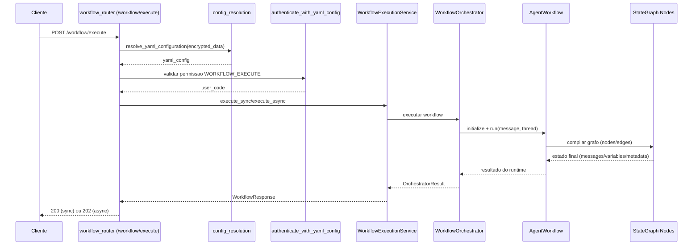
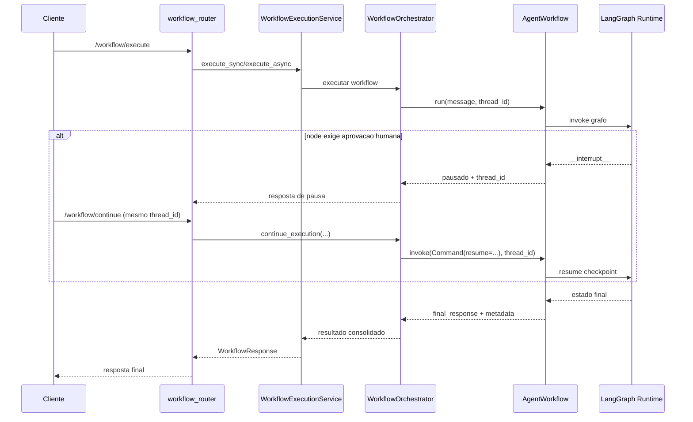
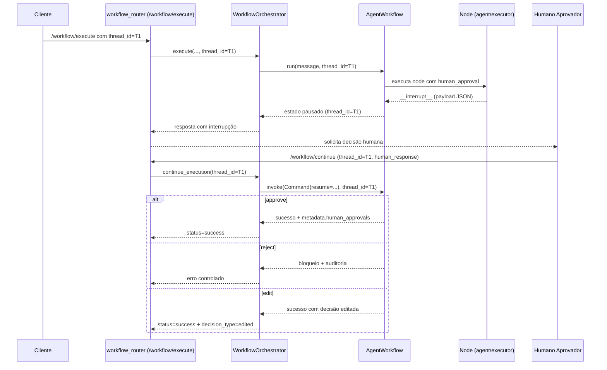

# Manual Tecnico: Agente Workflow

Este manual documenta o contrato YAML realmente executado pelo runtime de workflow (`AgentWorkflow`, `WorkflowIntegrityAnalyzer`, `EdgeCompiler` e nodes em `src/agentic_layer/workflow/nodes`).

<a id="diag-workflow"></a>

## Diagrama de Sequencia: Agente Workflow



<a id="diag-workflow-macro"></a>

## Diagrama de Sequencia: Processo Macro Workflow



## 1. Escopo e Seleção de Workflow

### Leitura relacionada

- Contrato comum do YAML agentic: [README-AGENTIC-CONTRATO-COMUM.md](./README-AGENTIC-CONTRATO-COMUM.md)
- Configuração YAML da plataforma: [README-CONFIGURACAO-YAML.md](./README-CONFIGURACAO-YAML.md)
- Supervisor clássico: [README-AGENTE-SUPERVISOR.md](./README-AGENTE-SUPERVISOR.md)
- DeepAgent governado: [README-DEEPAGENTS-SUPERVISOR.md](./README-DEEPAGENTS-SUPERVISOR.md)
- Human in the Loop no produto atual: [README-HUMAN-IN-THE-LOOP.md](./README-HUMAN-IN-THE-LOOP.md)
- Versão didática 101 deste assunto: [tutorial-101-workflow.md](./tutorial-101-workflow.md)

### 1.1 Seções raiz usadas pelo runtime

```yaml
selected_workflow: "atendimento_principal"
workflows_defaults: {}
workflows:
  - id: "atendimento_principal"
    enabled: true
    settings: {}
    local_tools_configuration: {}
    local_mcp_configuration: {}
    tools_library: []
    nodes: []
```

### 1.2 Regras de seleção

1. Se `selected_workflow` estiver definido, ele deve apontar para um workflow existente e habilitado.
2. Se não houver `selected_workflow`:
   - Se existir exatamente um `enabled: true`, esse workflow é selecionado.
   - Se houver múltiplos `enabled: true`, inicialização falha (ambiguo).
   - Se nenhum estiver habilitado, o primeiro da lista é selecionado.

### 1.3 Campos de `workflows[]`

| Campo | Tipo | Obrigatorio | Default | Regra |
|---|---|---|---|---|
| `id` | `str` | sim | - | Único e não vazio. |
| `enabled` | `bool` | nao | `true` | Controla elegibilidade para seleção automática. |
| `nodes` | `list[dict]` | sim | - | Lista não vazia. |
| `edges` | `list[dict] \| null` | nao | ausente | Ativa edge-first somente se lista não vazia. |
| `settings` | `dict` | nao | `{}` | Configurações globais do workflow (`max_iterations`). |
| `local_tools_configuration` | `dict` | nao | `{}` | Override de tools no escopo do workflow. |
| `local_mcp_configuration` | `dict` | nao | `{}` | Override de MCP no escopo do workflow. |
| `tools_library` | `list[dict]` | nao | `[]` | Catálogo adicional/override por workflow. |

### 1.4 Catálogo efetivo e MCP local

Ordem real do catálogo efetivo de tools do workflow (menor -> maior precedência):

1. `tools_library` da raiz.
2. `workflows_defaults.tools_library`.
3. `workflows[].tools_library`.

Ordem real dos overrides locais de tools (menor -> maior precedência):

1. `global_tools_configuration`.
2. `workflows_defaults.local_tools_configuration`.
3. `workflows[].local_tools_configuration`.

Contrato operacional de MCP local:

1. `MCPConfigResolver` compõe `global_mcp_configuration` com `workflows[].local_mcp_configuration` quando resolve MCP para workflow.
2. O contrato governado do assembly preserva o bloco `local_mcp_configuration` no `WorkflowAST`.
3. No fluxo `POST /config/assembly/objective-to-yaml`, um objetivo que exige MCP não vira YAML final se o escopo do workflow não tiver MCP ativo; nesse caso a API devolve `questions` em vez de inventar configuração.
4. Para catálogo e guardrails do assembly, `servers` ou `tools` já sinalizam MCP no escopo; para conexão MCP real em runtime, o bloco final ainda precisa de `servers`.

## 2. Modos de Execução

### 2.1 Node-driven (sem `edges`)

Transições seguem o modo do node:

1. `router` e `rule_router`: usam `router.go_to_node`.
2. `if`: usa `true_go_to` / `false_go_to`.
3. `executor`: usa loop por labels (`loop_more_label`, `loop_done_label`).
4. Demais nodes: encadeamento sequencial para o próximo node.

### 2.2 Edge-first (`edges` não vazio)

1. `edges` define 100% das transições.
2. `router`, `rule_router`, `if` e `executor` continuam executando lógica, mas não controlam transição implicitamente.
3. Em edge-first, campos internos de roteamento deixam de ser obrigatórios:
   - `if.true_go_to`
   - `if.false_go_to`
   - `rule_router.router.go_to_node`
   - `executor.settings.loop_more_label` / `loop_done_label`

## 3. Contrato `workflows[].edges` (Edge-first)

### 3.1 Sintaxe

```yaml
workflows:
  - id: "edge_first_exemplo"
    nodes:
      - id: "router_pedido"
        mode: "router"
        prompt:
          system: "Classifique em APROVAR ou RECUSAR"
        router:
          allowed_labels: ["APROVAR", "RECUSAR", "DEFAULT"]

      - id: "aprovar"
        mode: "agent"
        prompt:
          system: "Fluxo de aprovacao"

      - id: "recusar"
        mode: "agent"
        prompt:
          system: "Fluxo de recusa"

    edges:
      - from: "START"
        to: "router_pedido"

      - from: "router_pedido"
        to: "aprovar"
        when: "metadata.router_decision == 'APROVAR'"

      - from: "router_pedido"
        to: "recusar"
        when: "metadata.router_decision == 'RECUSAR'"

      - from: "router_pedido"
        to: "recusar"
        default: true

      - from: "aprovar"
        to: "END"

      - from: "recusar"
        to: "END"
```

### 3.2 Campos da edge

| Campo | Tipo | Obrigatorio | Default | Regra |
|---|---|---|---|---|
| `from` | `str` | sim | - | `START` ou `node_id` válido. |
| `to` | `str` | sim | - | `END` ou `node_id` válido. |
| `when` | `str` | nao | `null` | Expressão booleana segura. |
| `default` | `bool` | nao | `false` | Fallback por origem. |

### 3.3 Regras de validação

1. `edges` deve ser lista não vazia no edge-first.
2. `from/to` devem referenciar `START/END` ou nodes existentes.
3. `when` e `default: true` não podem coexistir na mesma edge.
4. Máximo de uma edge com `default: true` por origem.
5. Deve existir ao menos uma edge com `from: START`.

### 3.4 Prioridade de seleção por origem

1. Avalia `when` na ordem declarada.
2. Depois avalia edge incondicional (sem `when` e sem `default`).
3. Se nada casar, usa `default: true`.
4. Sem match: falha de execução.

## 4. Estado e Metadados do Workflow

### 4.1 Estrutura de `WorkflowState`

| Campo | Tipo |
|---|---|
| `messages` | `list[AnyMessage]` |
| `input_text` | `str` |
| `last_output` | `str` |
| `current_step` | `str` |
| `metadata` | `dict[str, Any]` |
| `context` | `str` |
| `variables` | `dict[str, Any]` |
| `status` | `running \| paused \| completed \| failed` |
| `error_log` | `list[dict[str, Any]]` |
| `max_iterations` | `int \| null` |

### 4.2 Metadados relevantes em runtime

1. `workflow_path`: trilha de nodes visitados.
2. `execution_trace`: eventos `start/success/failed` por node.
3. `data_flow`, `read_snapshots`, `write_snapshots`.
4. Campos por node (`router_decision`, `plan_done`, `schema_validator_results`, etc.).

## 5. Campos Comuns de Node

### 5.0 Modos suportados hoje

Os modos realmente registrados em `NodeFactory.registry` no runtime atual sao:

1. `agent`
2. `set`
3. `if`
4. `function`
5. `tool`
6. `merge`
7. `router`
8. `rule_router`
9. `transform`
10. `planner`
11. `executor`
12. `schema_validator`
13. `sub_workflow`
14. `whatsapp_media_resolver`
15. `whatsapp_send`

Impacto pratico:

1. YAML com `mode` fora dessa lista falha na compilacao do workflow.
2. A documentacao nao deve citar modos planejados como se ja existissem no registry.

### 5.1 Contrato base

```yaml
id: "node_id"
mode: "agent"
prompt:
  system: "Texto do prompt"
reads:
  - "variables.entrada"
writes:
  - "variables.saida"
tools:
  - "tool_id"
settings: {}
params: {}
```

### 5.2 Semântica comum

| Campo | Tipo | Obrigatorio | Observação |
|---|---|---|---|
| `id` | `str` | sim | Único no workflow. |
| `mode` | `str` | sim | Deve existir no `NodeFactory.registry`. |
| `prompt.system` | `str` | condicional | Obrigatório para `agent`, `router`, `planner`, `executor`. |
| `reads` | `list[str] \| str` | nao | Paths lidos do estado. |
| `writes` | `list[str] \| str` | nao | Paths escritos em `variables`. |
| `tools` | `list[str]` | nao | IDs de tools permitidas para o node. |
| `settings` | `dict` | nao | Ajustes do modo do node. |
| `params` | `dict` | nao | Parâmetros do node. |

### 5.3 Blocos transversais

1. `retry_policy`: aceito em `agent`, `router`, `executor`.
2. `human_approval`: aceito em `agent` e `executor`.
3. `output_schema` + `auto_retry`: aceito em `agent`.

### 5.4 Contrato oficial de pausa humana

<a id="diag-workflow-hil"></a>

#### Diagrama de Sequencia: HIL no Workflow



Decisão arquitetural adotada no runtime:

1. O padrão principal de pausa humana é o `interrupt` nativo do LangGraph.
2. O retorno da pausa sai em `__interrupt__` no resultado do grafo.
3. A retomada usa `Command(resume=...)` com o mesmo `thread_id`.
4. O payload enviado para pausa é sempre JSON serializável.
5. A decisão humana fica auditável em `metadata.human_approvals`.

Mapa de decisão humana aceito no `resume`:

1. Aprovação: `true`, `"aprovar"`, `"approve"`, `{"action": "approve"}`.
2. Rejeição: `false`, `"rejeitar"`, `"reject"`, `{"action": "reject"}`.
3. Edição: `"edit"`, `"editar"`, `{"action": "edit", ...}`.

Contrato sem legado:

1. `human_approval` usa exclusivamente `interrupt` oficial do LangGraph.
2. Não existe fallback para pausa lógica baseada apenas em metadata.

Visão geral:

1. Sempre que `human_approval.enabled: true`, o node pausa via `interrupt` e só continua após resposta humana.
2. A pausa acontece no ponto oficial do runtime LangGraph, com persistência associada ao `thread_id`.
3. A resposta humana é interpretada pelo node em três resultados explícitos: `approved`, `rejected` ou `edited`.
4. O resultado da decisão é gravado em `metadata.human_approvals.<node_id>` para rastreabilidade.

Por que existe:

1. Evitar divergência entre “pausa lógica” interna e pausa real de execução.
2. Garantir que o fluxo de retomada seja estável e compatível com o ecossistema LangGraph.
3. Tornar o histórico de decisões humanas auditável sem depender de interpretação implícita.
4. Reduzir risco de comportamento inconsistente quando o workflow é retomado várias vezes.

Explicação conceitual:

1. O `interrupt` é uma pausa dinâmica que suspende o grafo e devolve ao chamador um payload em `__interrupt__`.
2. Esse payload contém contexto de aprovação (motivo, ações esperadas e preview do que está sendo decidido), sempre em formato serializável.
3. A retomada é feita com `Command(resume=...)`, obrigatoriamente com o mesmo `thread_id`, para reaproveitar o checkpoint correto.
4. O node reinicia sua execução e interpreta o valor de `resume` usando um contrato determinístico (aprovar/rejeitar/editar).
5. Após interpretar, o node registra auditoria em metadata e segue execução normal, bloqueia a ação, ou aplica fluxo de edição aprovada.
6. Esse modelo elimina o estado híbrido onde o processo parecia pausado no metadata, mas sem pausa oficial no runtime.

Explicação for dummies:

1. Pense no workflow como uma esteira de fábrica.
2. Antes de uma etapa sensível, ele puxa o “freio oficial” da máquina (`interrupt`) e para de verdade.
3. O painel mostra exatamente o que precisa ser decidido e espera alguém responder.
4. Quando a pessoa responde, a esteira volta do mesmo ponto usando o mesmo identificador (`thread_id`).
5. Se a resposta for “aprovar”, a etapa continua.
6. Se for “rejeitar”, a etapa é bloqueada e isso fica registrado.
7. Se for “editar”, continua com a decisão marcada como editada e também auditada.
8. Resultado prático: menos ambiguidade, menos retrabalho de suporte e histórico claro para auditoria.

Como o usuário recebe essa feature:

1. Configura `human_approval.enabled: true` no node `agent` ou no `executor`.
2. Executa o workflow normalmente até ocorrer a pausa.
3. Recebe o conteúdo de `__interrupt__` no retorno da execução.
4. Envia a decisão humana por `Command(resume=...)` mantendo o mesmo `thread_id`.
5. O runtime retoma e grava o resultado em `metadata.human_approvals`.

Exemplo de decisão humana (contrato prático):

1. Aprovar: `true`, `"aprovar"`, `"approve"`, `{ "action": "approve" }`.
2. Rejeitar: `false`, `"rejeitar"`, `"reject"`, `{ "action": "reject" }`.
3. Editar: `"editar"`, `"edit"`, `{ "action": "edit", "edited_payload": {...} }`.
4. Resposta inválida: tratada como rejeição com motivo explícito no metadata.

Impacto para o usuário:

1. O processo de aprovação fica previsível e padronizado em todos os nodes suportados.
2. A retomada deixa de depender de convenção interna e passa a seguir o contrato oficial do framework.
3. Suporte e operação conseguem diagnosticar decisões humanas consultando metadata de forma direta.
4. O risco de “fluxo travado sem pausa real” é reduzido, porque o bloqueio é executado no motor oficial.

Limites e pegadinhas:

1. O `resume` precisa ser JSON serializável.
2. O `thread_id` da retomada deve ser o mesmo da pausa; mudar o `thread_id` abre outra linha de execução.
3. Qualquer side-effect antes de `interrupt` deve ser idempotente, pois o node reinicia ao retomar.
4. `decision_path` no `human_approval` é mantido para auditoria/contexto, não como fallback de decisão automática.

Troubleshooting:

1. Sintoma: workflow não retoma após decisão humana.
  Diagnóstico: conferir se a retomada usou o mesmo `thread_id` da pausa.
2. Sintoma: decisão humana “não reconhecida”.
  Diagnóstico: validar se o `resume` está no contrato aceito (approve/reject/edit).
3. Sintoma: execução parece repetir trecho antes da pausa.
  Diagnóstico: comportamento esperado do `interrupt`; revisar idempotência de operações anteriores.
4. Sintoma: dificuldade para auditar quem aprovou/rejeitou.
  Diagnóstico: inspecionar `metadata.human_approvals.<node_id>` no resultado final.

## 6. Referência Completa de Nodes

A lista abaixo cobre 100% dos modos suportados atualmente:

1. `agent`
2. `router`
3. `planner`
4. `executor`
5. `if`
6. `set`
7. `merge`
8. `function`
9. `transform`
10. `rule_router`
11. `tool`
12. `schema_validator`
13. `sub_workflow`
14. `whatsapp_media_resolver`
15. `whatsapp_send`

### Node `agent`

Função: invocar modelo/agente com ou sem tools, com suporte a schema estruturado.

Parâmetros:

1. `prompt.system` (`str`, obrigatório).
2. `tools` (`list[str]`, opcional).
3. `retry_policy` (`dict`, opcional): `max_attempts`, `backoff_seconds`, `breaker_threshold`.
4. `human_approval` (`dict`, opcional).
5. `output_schema` (`dict`, opcional).
6. `auto_retry` (`bool \| int \| dict`, opcional): controla tentativas de reparo para `output_schema`.

Exemplo mínimo:

```yaml
id: "responder"
mode: "agent"
prompt:
  system: "Responda de forma objetiva"
```

Exemplo completo:

```yaml
id: "responder_estruturado"
mode: "agent"
prompt:
  system: "Extraia status e prioridade"
tools:
  - "dyn_sql<buscar_ticket>"
reads:
  - "variables.ticket_id"
writes:
  - "variables.analise_ticket"
retry_policy:
  max_attempts: 3
  backoff_seconds: 0.2
  breaker_threshold: 2
human_approval:
  enabled: true
  decision_path: "metadata.approvals.agent_responder"
output_schema:
  type: object
  required: ["status", "prioridade"]
  properties:
    status:
      type: string
    prioridade:
      type: string
auto_retry:
  max_attempts: 2
  repair_prompt: "Responda estritamente em JSON válido"
```

### Node `router`

Função: classificar e decidir label de roteamento via modelo.

Parâmetros:

1. `prompt.system` (`str`, obrigatório).
2. `router.allowed_labels` (`list[str]`, obrigatório).
3. `router.go_to_node` (`dict`, obrigatório em node-driven).
4. `router.fallback_node` (`str`, opcional).
5. `router.retry_policy` (`dict`, opcional).
6. `tools` (`list[str]`, opcional).

Exemplo mínimo:

```yaml
id: "classificar"
mode: "router"
prompt:
  system: "Classifique em A ou B"
router:
  allowed_labels: ["A", "B", "DEFAULT"]
  go_to_node:
    A: "fluxo_a"
    B: "fluxo_b"
    DEFAULT: "fluxo_b"
```

Exemplo completo:

```yaml
id: "roteador_tickets"
mode: "router"
prompt:
  system: "Classifique em SUPORTE, FINANCEIRO ou DEFAULT"
tools:
  - "qa_rag_with_sources"
router:
  allowed_labels: ["SUPORTE", "FINANCEIRO", "DEFAULT"]
  go_to_node:
    SUPORTE: "resolver_suporte"
    FINANCEIRO: "resolver_financeiro"
    DEFAULT: "fallback"
  fallback_node: "fallback"
  retry_policy:
    max_attempts: 3
    backoff_seconds: 0.2
    breaker_threshold: 2
```

### Node `planner`

Função: gerar plano estruturado (`steps[]`) para execução posterior.

Parâmetros:

1. `prompt.system` (`str`, obrigatório).
2. `tools` (`list[str]`, opcional): allowlist para steps.
3. `settings.output_key` (`str`, default `plan`).
4. `settings.cursor_key` (`str`, default `plan_cursor`).
5. `settings.enforce_list` (`bool`, default `true`).
6. `settings.coerce_json` (`bool`, default `true`).
7. `settings.auto_ids` (`bool`, default `true`).

Exemplo mínimo:

```yaml
id: "planejar"
mode: "planner"
prompt:
  system: "Gere um plano com steps, desc, system_prompt, tools e inputs"
```

Exemplo completo:

```yaml
id: "planejar_execucao"
mode: "planner"
prompt:
  system: "Crie passos para resolver o ticket"
tools:
  - "dyn_sql<buscar_ticket>"
  - "qa_rag_with_sources"
settings:
  output_key: "plan"
  cursor_key: "plan_cursor"
  enforce_list: true
  coerce_json: true
  auto_ids: true
writes:
  - "variables.plano_gerado"
```

### Node `executor`

Função: executar um passo do plano por invocação, avançando cursor.

Parâmetros:

1. `prompt.system` (`str`, obrigatório).
2. `settings.output_key` (`str`, default `plan`).
3. `settings.cursor_key` (`str`, default `plan_cursor`).
4. `settings.emit_step_summary` (`bool`, default `true`).
5. `settings.passthrough_inputs` (`bool`, default `true`).
6. `settings.safe_format_inputs` (`bool`, default `true`).
7. `settings.human_approval` (`dict`, opcional).
8. `settings.retry_policy` (`dict`, opcional; default do node).
9. `settings.failure_policy` (`dict`, opcional; `mode` + `human_message`).
10. Em node-driven: `settings.loop_more_label` e `settings.loop_done_label` são obrigatórios.
11. Em cada step do plano: `retry_policy` e `failure_policy` podem sobrescrever defaults.

Exemplo mínimo:

```yaml
id: "executar"
mode: "executor"
prompt:
  system: "Execute o passo atual do plano"
settings:
  loop_more_label: "MORE"
  loop_done_label: "DONE"
```

Exemplo completo:

```yaml
id: "executar_plano"
mode: "executor"
prompt:
  system: "Execute o passo e registre resultado"
settings:
  output_key: "plan"
  cursor_key: "plan_cursor"
  emit_step_summary: true
  passthrough_inputs: true
  safe_format_inputs: true
  loop_more_label: "MORE"
  loop_done_label: "DONE"
  human_approval:
    enabled: true
    decision_path: "metadata.approvals.executor"
  retry_policy:
    max_attempts: 3
    backoff_seconds: 0.2
    breaker_threshold: 2
  failure_policy:
    mode: "request_human"
    human_message: "Falha no passo do plano"
writes:
  - "variables.executor_last_output"
```

### Node `if`

Função: avaliar expressão booleana e registrar decisão `TRUE/FALSE`.

Parâmetros:

1. `condition` (`str`, obrigatório).
2. Em node-driven: `true_go_to` e `false_go_to` (`str`, obrigatórios).
3. Em edge-first: `true_go_to/false_go_to` são opcionais.

Exemplo mínimo:

```yaml
id: "validar_total"
mode: "if"
condition: "variables.total > 0"
true_go_to: "seguir"
false_go_to: "encerrar"
```

Exemplo completo:

```yaml
id: "if_risco"
mode: "if"
reads:
  - "variables.score"
condition: "variables.score >= 70 and metadata.risk_flag == False"
true_go_to: "aprovar"
false_go_to: "revisar"
```

### Node `set`

Função: atribuir valores em `variables`.

Parâmetros:

1. `params.assign` (`dict`, obrigatório).
2. Cada valor em `assign` suporta literal, template, `{"expr": ...}` e `{"from": ...}`.

Exemplo mínimo:

```yaml
id: "set_status"
mode: "set"
params:
  assign:
    status: "aberto"
```

Exemplo completo:

```yaml
id: "set_contexto"
mode: "set"
reads:
  - "variables.pedido.id"
params:
  assign:
    resumo: "Pedido {variables.pedido.id}"
    total_calculado:
      expr: "variables.pedido.subtotal + variables.pedido.frete"
    cliente:
      from: "variables.pedido.cliente"
    vars:
      auditoria.correlation_id:
        from: "metadata.correlation_id"
```

### Node `merge`

Função: consolidar múltiplas leituras em objeto/lista.

Parâmetros:

1. `reads` (`list[str]`, obrigatório).
2. `params.strategy` (`dict \| list \| auto`, default `dict`).
3. `params.aliases` (`dict`, opcional).
4. `params.initial` (valor inicial compatível com strategy).
5. `params.drop_none` (`bool`, default `true`).
6. Para strategy `dict`: `deep_merge` (default `true`), `append_lists` (default `false`).
7. Para strategy `list`: `flatten_lists` (default `true`), `unique` (default `false`).

Exemplo mínimo:

```yaml
id: "merge_saida"
mode: "merge"
reads:
  - "variables.parte_a"
  - "variables.parte_b"
params:
  strategy: "dict"
```

Exemplo completo:

```yaml
id: "merge_relatorio"
mode: "merge"
reads:
  - "variables.cliente"
  - "variables.pedido"
  - "variables.itens"
writes:
  - "variables.relatorio"
params:
  strategy: "dict"
  aliases:
    cliente: "variables.cliente"
    pedido: "variables.pedido"
  initial:
    origem: "workflow"
  drop_none: true
  deep_merge: true
  append_lists: false
```

### Node `function`

Função: executar expressão segura ou script Python sandboxed.

Parâmetros:

1. `params.expression` (`str`) ou `params.script` (`str`) - obrigatório usar exatamente um.
2. `params.aliases` (`dict`, opcional).
3. `params.timeout_seconds` (`float`, default `2.0`, `> 0`).
4. `params.result_var` (`str`, default `result`) para modo `script`.
5. `params.allow_functions` (`list[str]`, opcional).
6. `params.block_functions` (`list[str]`, opcional).

Exemplo mínimo:

```yaml
id: "calcular_frete"
mode: "function"
params:
  expression: "variables.peso * 1.25"
writes:
  - "variables.frete"
```

Exemplo completo:

```yaml
id: "normalizar_score"
mode: "function"
reads:
  - "variables.raw_score"
params:
  aliases:
    score: "variables.raw_score"
  script: |
    score_num = float(score)
    result = max(0.0, min(100.0, score_num))
  result_var: "result"
  timeout_seconds: 1.5
  allow_functions: ["float", "max", "min", "round"]
  block_functions: ["json_loads"]
writes:
  - "variables.score_final"
```

### Node `transform`

Função: executar transformações determinísticas (`filter_messages`, `json_map`, `regex_replace`, `string_ops`).

Parâmetros gerais:

1. `settings.kind` (`str`, default `filter_messages`).

Parâmetros por `kind`:

1. `filter_messages`: `max_tokens`.
2. `json_map`: `source`, `mappings`, `engine` (`jmespath`/`jsonpath`).
3. `regex_replace`: `source`, `replacements` com `pattern`, `replacement`, `flags`, `target`.
4. `string_ops`: `source`, `ops`, `target`.

Exemplo mínimo:

```yaml
id: "compactar_historico"
mode: "transform"
settings:
  kind: "filter_messages"
  max_tokens: 250
```

Exemplo completo:

```yaml
id: "transformar_payload"
mode: "transform"
settings:
  kind: "json_map"
  source: "variables.payload"
  engine: "jmespath"
  mappings:
    - query: "cliente.nome"
      target: "saida.nome_cliente"
    - query: "itens[*].sku"
      target: "saida.skus"
      default: []
writes:
  - "variables.payload_transformado"
```

### Node `rule_router`

Função: roteamento determinístico por regras booleanas.

Parâmetros:

1. `params.rules` (`list[dict]`, obrigatório).
2. Cada regra: `when` (`str`) e `label` (`str`).
3. `params.default_label` (`str`, default `DEFAULT`).
4. Em node-driven: `router.go_to_node` (`dict`, obrigatório).

Exemplo mínimo:

```yaml
id: "rr_prioridade"
mode: "rule_router"
params:
  rules:
    - when: "variables.prioridade == 'alta'"
      label: "ALTA"
  default_label: "DEFAULT"
router:
  go_to_node:
    ALTA: "tratar_alta"
    DEFAULT: "tratar_padrao"
```

Exemplo completo:

```yaml
id: "rr_fraude"
mode: "rule_router"
reads:
  - "variables.score"
  - "metadata.canal"
params:
  rules:
    - when: "variables.score >= 90"
      label: "BLOQUEAR"
    - when: "variables.score >= 70 and metadata.canal == 'web'"
      label: "REVISAR"
  default_label: "APROVAR"
router:
  go_to_node:
    BLOQUEAR: "bloquear"
    REVISAR: "revisar"
    APROVAR: "aprovar"
```

### Node `tool`

Função: executar tool diretamente com payload declarativo.

Parâmetros:

1. `params.tool_id` (`str`, obrigatório).
2. `params.arguments` (`dict`, opcional).
3. `params.input` (`Any`, opcional).
4. `params.input_path` (`str`, opcional).
5. `params.pack_read_data` (`bool`, opcional).
6. `params.extract` (`str`, opcional).

Exemplo mínimo:

```yaml
id: "buscar_cliente"
mode: "tool"
params:
  tool_id: "dyn_sql<buscar_cliente_por_id>"
  arguments:
    cliente_id: "{variables.cliente_id}"
```

Exemplo completo:

```yaml
id: "consultar_pedido"
mode: "tool"
reads:
  - "variables.pedido_id"
params:
  tool_id: "dyn_api<consultar_pedido>"
  input_path: "variables.pedido_id"
  extract: "data.status"
  pack_read_data: true
writes:
  - "variables.status_pedido"
```

### Node `schema_validator`

Função: validar payload contra JSON Schema.

Parâmetros:

1. `params.schema` (`dict`, obrigatório).
2. `params.source` (`str`, default `last_output`).
3. `params.parse_json` (`bool`, default `true`).
4. `params.on_error` (`raise \| log \| request_human`, default `raise`).

Exemplo mínimo:

```yaml
id: "validar_saida"
mode: "schema_validator"
params:
  schema:
    type: object
    required: ["status"]
    properties:
      status:
        type: string
```

Exemplo completo:

```yaml
id: "validar_resposta_api"
mode: "schema_validator"
reads:
  - "variables.resposta_api"
writes:
  - "variables.resposta_validada"
params:
  source: "variables.resposta_api"
  parse_json: true
  on_error: "request_human"
  schema:
    type: object
    required: ["pedido_id", "status"]
    properties:
      pedido_id:
        type: string
      status:
        type: string
        enum: ["novo", "processando", "entregue"]
```

### Node `sub_workflow`

Função: executar outro workflow do mesmo YAML.

Parâmetros:

1. `params.workflow_id` (`str`, obrigatório).
2. `params.inherit_variables` (`bool`, default `true`).
3. `params.inherit_metadata` (`bool`, default `false`).
4. `params.inherit_messages` (`bool`, default `false`).
5. `params.input_value` (`Any`, opcional).
6. `params.input_path` (`str`, opcional).
7. `params.result_path` (`str`, opcional).

Exemplo mínimo:

```yaml
id: "executar_subfluxo"
mode: "sub_workflow"
params:
  workflow_id: "workflow_filho"
```

Exemplo completo:

```yaml
id: "subfluxo_pagamento"
mode: "sub_workflow"
reads:
  - "variables.pedido_id"
writes:
  - "variables.resultado_pagamento"
params:
  workflow_id: "pagamento"
  inherit_variables: true
  inherit_metadata: false
  inherit_messages: false
  input_path: "variables.pedido_id"
  result_path: "metadata.resultado.final"
```

### Node `whatsapp_media_resolver`

Função: resolver `media_id` de itens de produto com cache Redis.

Parâmetros:

1. `params.payload_path` (`str`, obrigatório semântico).
2. `params.write_path` (`str`, default `whatsapp.media_payload`).
3. `params.product_list_key` (`str`, default `produtos`).
4. `params.caption_field` (`str`, default `texto`).
5. `params.url_field` (`str`, default `imagem`).
6. `params.media_type` (`str`, default `image`).
7. `params.cache_ttl_seconds` (`int`, default `86400`).
8. `params.allow_url_fallback` (`bool`, default `true`).
9. `params.channel` (`dict`, opcional): `channel_id`, `description`, `metadata`, `queue_mode`.

Exemplo mínimo:

```yaml
id: "resolver_midia"
mode: "whatsapp_media_resolver"
params:
  payload_path: "variables.payload_whatsapp"
```

Exemplo completo:

```yaml
id: "resolver_midia_catalogo"
mode: "whatsapp_media_resolver"
reads:
  - "variables.payload_whatsapp"
writes:
  - "variables.payload_whatsapp_resolvido"
params:
  payload_path: "variables.payload_whatsapp"
  write_path: "whatsapp.media_payload"
  product_list_key: "produtos"
  caption_field: "texto"
  url_field: "imagem"
  media_type: "image"
  cache_ttl_seconds: 43200
  allow_url_fallback: true
  channel:
    channel_id: "whatsapp_default"
    queue_mode: "inline"
```

### Node `whatsapp_send`

Função: montar payload final de envio WhatsApp (`text`, `media`, `metadata.whatsapp_sequence`).

Parâmetros:

1. `params.payload_path` (`str`, obrigatório semântico).
2. `params.write_path` (`str`, default `whatsapp.outgoing_message`).
3. `params.product_list_key` (`str`, default `produtos`).
4. `params.text_key` (`str`, default `texto_geral`).

Exemplo mínimo:

```yaml
id: "montar_envio"
mode: "whatsapp_send"
params:
  payload_path: "whatsapp.media_payload"
```

Exemplo completo:

```yaml
id: "montar_envio_final"
mode: "whatsapp_send"
reads:
  - "whatsapp.media_payload"
writes:
  - "variables.outgoing"
params:
  payload_path: "whatsapp.media_payload"
  write_path: "whatsapp.outgoing_message"
  product_list_key: "produtos"
  text_key: "texto_geral"
```

## 7. Exemplo: Router/If/Executor convertidos para Edge-first

### 7.1 Versão node-driven

```yaml
workflows:
  - id: "fluxo_node_driven"
    nodes:
      - id: "rotear"
        mode: "router"
        prompt:
          system: "Classifique em APROVAR ou REVISAR"
        router:
          allowed_labels: ["APROVAR", "REVISAR", "DEFAULT"]
          go_to_node:
            APROVAR: "validar"
            REVISAR: "revisar"
            DEFAULT: "revisar"

      - id: "validar"
        mode: "if"
        condition: "variables.score >= 70"
        true_go_to: "executar"
        false_go_to: "revisar"

      - id: "executar"
        mode: "executor"
        prompt:
          system: "Execute o plano"
        settings:
          loop_more_label: "MORE"
          loop_done_label: "DONE"

      - id: "revisar"
        mode: "agent"
        prompt:
          system: "Revisar caso"
```

### 7.2 Versão edge-first equivalente

```yaml
workflows:
  - id: "fluxo_edge_first"
    nodes:
      - id: "rotear"
        mode: "router"
        prompt:
          system: "Classifique em APROVAR ou REVISAR"
        router:
          allowed_labels: ["APROVAR", "REVISAR", "DEFAULT"]

      - id: "validar"
        mode: "if"
        condition: "variables.score >= 70"

      - id: "executar"
        mode: "executor"
        prompt:
          system: "Execute o plano"

      - id: "revisar"
        mode: "agent"
        prompt:
          system: "Revisar caso"

    edges:
      - from: "START"
        to: "rotear"
      - from: "rotear"
        to: "validar"
        when: "metadata.router_decision == 'APROVAR'"
      - from: "rotear"
        to: "revisar"
        when: "metadata.router_decision == 'REVISAR'"
      - from: "rotear"
        to: "revisar"
        default: true
      - from: "validar"
        to: "executar"
        when: "metadata.if_results.validar.result == True"
      - from: "validar"
        to: "revisar"
        default: true
      - from: "executar"
        to: "END"
      - from: "revisar"
        to: "END"
```

## 8. Matriz de Compatibilidade

### 8.1 Combinações de structured output (`agent`)

| Combinação | Válido | Motivo |
|---|---|---|
| `output_schema` sem `auto_retry` | sim | `auto_retry` assume 1 tentativa. |
| `output_schema` + `auto_retry: true` | sim | Converte para 2 tentativas. |
| `output_schema` + `auto_retry: 3` | sim | Usa 3 tentativas. |
| `output_schema` + `auto_retry: {max_attempts: 2}` | sim | Usa configuração explícita. |
| `auto_retry` sem `output_schema` | sim | Ignorado na prática. |

### 8.2 Combinações de executor

| Combinação | Válido | Motivo |
|---|---|---|
| `settings.retry_policy` + `step.retry_policy` | sim | Step sobrescreve defaults do node. |
| `settings.failure_policy` + `step.failure_policy` | sim | Step sobrescreve defaults do node. |
| `step.on_failure` | nao | Campo rejeitado; usar `failure_policy`. |

### 8.3 Node-driven vs edge-first

| Campo | Node-driven | Edge-first |
|---|---|---|
| `if.true_go_to/false_go_to` | obrigatório | opcional |
| `rule_router.router.go_to_node` | obrigatório | opcional |
| `executor.loop_more_label/done_label` | obrigatório | opcional |
| `edges` | ausente | obrigatório (lista não vazia) |

## 9. Erros de Integridade e Validação

Códigos comuns de erro em análise estática (`WorkflowIntegrityAnalyzer`):

1. `NODES_INVALIDOS`
2. `NODE_ID_INVALIDO`
3. `NODE_ID_DUPLICADO`
4. `MODE_INVALIDO`
5. `PROMPT_AUSENTE`
6. `ROUTER_SEM_LABELS`
7. `IF_CONDICAO_INVALIDA`
8. `IF_DESTINO_INVALIDO`
9. `SET_ASSIGN_INVALIDO`
10. `FUNCTION_EXPR_INVALIDA`
11. `TOOL_ID_INVALIDO`
12. `MERGE_SEM_READS`
13. `SCHEMA_VALIDATOR_SCHEMA_INVALIDO`
14. `WHATSAPP_SEND_PAYLOAD`
15. `EDGES_*` (família de validações edge-first)

## 10. Observabilidade

Eventos registrados em runtime:

1. Integridade: `WORKFLOW_INTEGRITY_OK`, `WORKFLOW_INTEGRITY_ERROR`.
2. Edge-first: `WORKFLOW_EDGE_CONFIG`, `WORKFLOW_EDGE_TRANSITION`.
3. Execução: `WORKFLOW_NODE_START`, `WORKFLOW_NODE_END`, `WORKFLOW_EXECUTION_ERROR`.
4. Router: `WORKFLOW_ROUTER_DECISION`, `WORKFLOW_ROUTER_FALLBACK`.
5. Ferramentas: `TOOL_EXECUTION_SUCCESS`, `TOOL_EXECUTION_ERROR`.

## 14. Mapeamento AST

A camada de montagem assistida usa `AgenticDocumentAST` para gerar o contrato YAML canônico do workflow.

Mapeamentos principais:

1. `AgenticDocumentAST.target=workflow` -> seção `workflows`.
2. `WorkflowAST` -> item de `workflows[]`.
3. `WorkflowAST.tools_library` -> item de `workflows[].tools_library[]`.
4. `WorkflowAST.local_mcp_configuration` -> item de `workflows[].local_mcp_configuration`.
5. `WorkflowNodeAST` (união discriminada por `mode`) -> item de `workflows[].nodes[]`.
6. `WorkflowEdgeAST` -> item de `workflows[].edges[]`.

Exemplo AST para YAML:

```yaml
target: workflow
selected_workflow: wf_ast
workflows:
  - id: wf_ast
    enabled: true
    tools_library:
      - strategy: direct
        id: wf_tool
        description: "Tool local do workflow"
        category: utility_tools
        status: active
        impl: fake.module.workflow_tool
    nodes:
      - id: validar
        mode: if
        condition: "metadata.approved == True"
        true_go_to: aprovado
        false_go_to: reprovado
      - id: aprovado
        mode: agent
        prompt:
          system: "Continue o fluxo aprovado"
      - id: reprovado
        mode: agent
        prompt:
          system: "Informe reprovação"
```

No fluxo de API:

1. `POST /config/assembly/draft` gera o AST.
2. `POST /config/assembly/validate` valida semântica com `WorkflowIntegrityAnalyzer`.
3. `POST /config/assembly/confirm` compila e mescla no YAML final.
4. `POST /config/assembly/objective-to-yaml` encadeia `preflight`, `draft`, `validate` e `confirm` em dry-run e só devolve YAML final quando não há `questions` bloqueantes.

### 14.1 Exemplo mínimo a partir de prompt real

Exemplo prático validado no fluxo NL atual:

1. Prompt: `Crie um workflow com integração mcp para usar tool mcp_orders.`
2. Se o `base_yaml` do workflow não tiver `global_mcp_configuration` ativa nem `workflows[].local_mcp_configuration` ativa, o assembly devolve a pergunta `mcp` e o diagnóstico `NL_MCP_OBRIGATORIO_AUSENTE`.
3. Resultado prático: a API não publica YAML final por chute. Ela bloqueia o fluxo até o operador informar a configuração MCP correta do tenant.

Arquivos e classes que validam de verdade:

1. AST: `src/config/agentic_assembly/ast/document.py` -> `AgenticDocumentAST`, `src/config/agentic_assembly/ast/workflow.py` -> `WorkflowAST`, `WorkflowNodeAST`, `WorkflowEdgeAST`.
2. Parse: `src/config/agentic_assembly/parsers/workflow_parser.py` -> `WorkflowParser`.
3. Validação agregada: `src/config/agentic_assembly/validators/document_validator.py` -> `DocumentSemanticValidator`.
4. Validação do alvo: `src/config/agentic_assembly/validators/workflow_semantic_validator.py` -> `WorkflowSemanticValidator`, `src/agentic_layer/workflow/integrity_analyzer.py` -> `WorkflowIntegrityAnalyzer`, `src/config/agentic_assembly/parsers/expression_parser.py` -> `ExpressionParser`, `src/config/agentic_assembly/validators/expression_validator.py` -> `ExpressionSemanticValidator`.
5. Compilação e merge: `src/config/agentic_assembly/compilers/workflow_compiler.py` -> `WorkflowCompiler`, `src/config/agentic_assembly/compilers/document_compiler.py` -> `DocumentCompiler`.
6. Orquestração: `src/config/agentic_assembly/assembly_service.py` -> `AgenticAssemblyService`.

O que rodar ao mexer nisso:

```bash
source .venv/bin/activate && python scripts/docs/verify_agentic_ast_docs_sync.py
source .venv/bin/activate && PYTEST_DISABLE_PLUGIN_AUTOLOAD=1 pytest tests/unit/docs/test_agentic_ast_docs_sync.py tests/unit/test_agentic_assembly_service.py tests/unit/test_agentic_assembly_draft_llm_e2e.py tests/unit/test_agentic_assembly_quality_gate.py tests/unit/test_agentic_assembly_runtime_guardrails.py -q
```

## Evidência no código

1. Runtime do workflow: `src/agentic_layer/workflow/agent_workflow.py`.
2. Estado compartilhado: `src/agentic_layer/workflow/workflow_state.py`.
3. Integridade e contratos de edge e node: `src/agentic_layer/workflow/integrity_analyzer.py`.
4. Resolução do workflow ativo: `src/agentic_layer/workflow/config_resolver.py`.
5. Orquestração HTTP: `src/api/routers/workflow_router.py`, `src/orchestrators/workflow_orchestrator.py`.

## Lacunas no código

- Não encontrado no código: gerador visual oficial, dentro do produto, que represente todos os modos de node e edges do workflow a partir do runtime atual.
  Onde deveria estar: `app/ui/` ou ferramenta de design integrada ao assembly.
