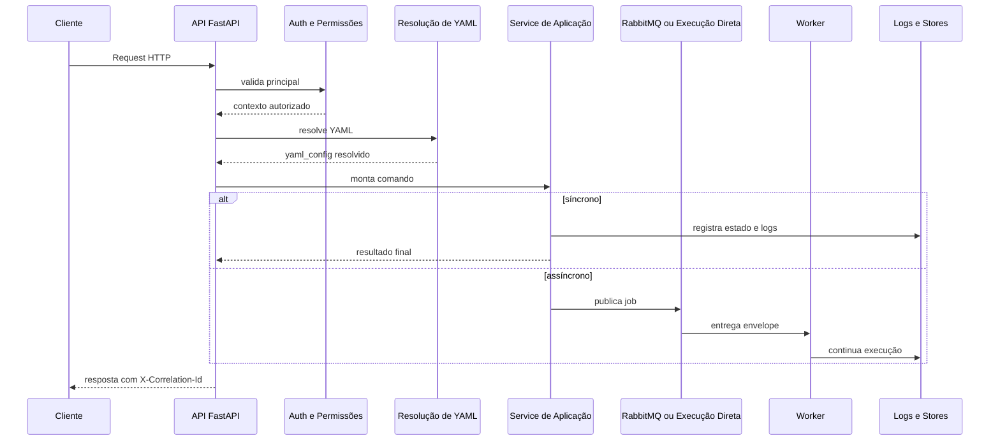
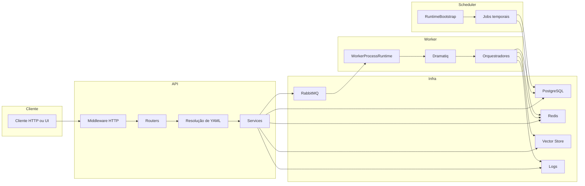
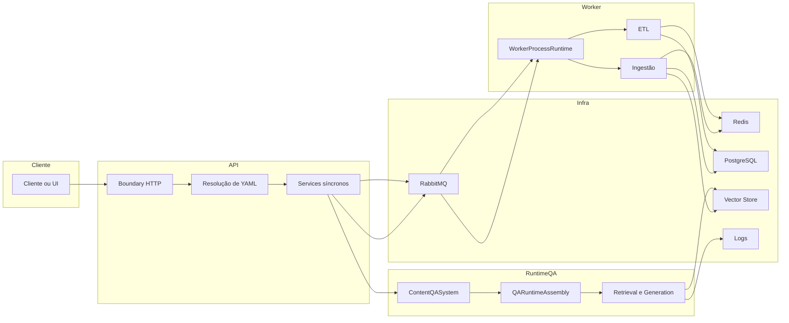

# Arquitetura da Plataforma

Este documento reflete o runtime real do projeto.
Ele descreve quem sobe cada processo, como o YAML entra no fluxo e
como a plataforma separa API, worker, scheduler e infraestrutura.

## Visão macro

Hoje a plataforma tem três processos principais.

- API HTTP.
- Worker.
- Scheduler.

Além deles, a operação depende de PostgreSQL, Redis, RabbitMQ,
vector store, catálogo de integrações e provider canônico de logs.

Em linguagem simples:

- a API recebe, autentica, resolve YAML e despacha;
- o worker executa trabalho pesado e plano de controle multicanal;
- o scheduler cuida dos jobs dirigidos por tempo.

## O que este documento é dono

Este documento é o dono da visão macro.
Ele explica como os processos se organizam, quais fronteiras existem e
como os grandes blocos se encaixam no runtime real.

Ele não tenta substituir os documentos especialistas.
Para manter a documentação coerente e sem redundância, a leitura mais
profunda de cada domínio fica distribuída assim:

- README-INGESTAO.md para a esteira documental, fan-out e engines
    modulares;
- README-ETL.md para o pipeline ETL dedicado e seus jobs;
- README-RAG.md para o runtime moderno de QA, retrieval e geração.

Em linguagem simples: aqui você entende o mapa da cidade.
Nos outros documentos, você entra em cada bairro com mais detalhe.

## Leitura relacionada

- Visão operacional da API: [README-SERVICE-API.md](./README-SERVICE-API.md)
- Execução de worker, scheduler e canais: [GUIA-DIDATICO-EXECUCAO-CANAIS.md](./GUIA-DIDATICO-EXECUCAO-CANAIS.md)
- Produção do acervo: [README-INGESTAO.md](./README-INGESTAO.md)
- Consulta sobre o acervo: [README-RAG.md](./README-RAG.md)
- Índice central da documentação: [README.md](./README.md)

## Entry points reais

O launcher operacional local é `run.sh`. Ele exige flags explícitas para
subir cada papel: API, worker e scheduler. Em linguagem simples, ele é o
ponto de partida prático para rodar os processos do projeto no ambiente
local sem confundir quem executa qual responsabilidade.

### API

- Runner: app/runners/api_runner.py.
- App FastAPI: src/api/service_api.py.
- Papel: subir Uvicorn, validar infraestrutura antes do HTTP,
  publicar routers, middlewares, OpenAPI, UI e proxy MCP.

### Worker

- Runner: app/runners/worker_runner.py.
- Runtime unificado: src/api/services/worker_process_runtime.py.
- Papel: forçar PROCESS_ROLE=worker, subir o plano de controle
  multicanal e o runtime assíncrono em RabbitMQ com Dramatiq.

### Scheduler

- Runner: app/runners/scheduler_runner.py.
- Bootstrap temporal: RuntimeBootstrap.
- Papel: forçar PROCESS_ROLE=scheduler, validar infraestrutura,
  restaurar jobs e aplicar liderança quando configurada.

## O que cada processo não faz

- A API não consome a fila oficial de ingestão e ETL.
- O worker não publica endpoints HTTP.
- O scheduler não vira consumidor do runtime Dramatiq.
- O bootstrap compartilhado não anula a separação operacional.

## Três domínios de execução sobre a mesma plataforma

Embora a plataforma compartilhe API, worker, scheduler e infraestrutura,
os três domínios principais não executam do mesmo jeito.

### Ingestão

Ingestão é o domínio documental.
Ela entra pelo boundary HTTP, publica job assíncrono e continua no
worker, onde roda IngestionService, fan-out e ContentIngestionOrchestrator.

### ETL

ETL também usa o mesmo contrato assíncrono de fila e worker, mas com
service e orquestrador próprios.
Ele não é um subtipo de ingestão; é um domínio vizinho que compartilha a
mesma infraestrutura de execução.

### RAG

RAG é o domínio de consulta.
No caminho principal, ele acontece no processo da API, usando
ContentQASystem, QARuntimeAssembly e o pipeline moderno de retrieval e
geração.

Em linguagem simples: ingestão e ETL usam o worker para produzir ou
transformar acervo; RAG usa o processo HTTP para consultar esse acervo
quando ele já está disponível.

## Fronteiras centrais do sistema

### Boundary HTTP

O boundary principal fica em src/api/service_api.py.
Ele cria o app FastAPI, registra CORS, rate limit, middlewares de
permissão, logs, routers e mount de /ui/static.

### Resolução de YAML

O carregamento compartilhado fica em
src/api/routers/config_resolution.py.
Esse helper resolve YAML por path, payload inline ou envelope
criptografado e integra secrets do tenant.

### Normalização de configuração

src/config/config_cli/configuration_factory.py normaliza o YAML,
anexa user_session, injeta catálogo builtin e devolve a configuração
consumível pelo runtime.

### Assembly agentic

src/config/agentic_assembly/assembly_service.py concentra:

- draft;
- validate;
- confirm;
- preflight;
- objective-to-yaml;
- recommendation de tools.

### Runtime de tools

src/agentic_layer/supervisor/tool_loader.py e
src/agentic_layer/supervisor/tools_factory.py resolvem tools,
overrides e sintaxe parametrizada, como dyn_sql, dyn_api e proc_sql.

## Como um request vira execução

O fluxo mais comum no código é este:

1. O middleware HTTP resolve ou gera o correlation_id.
2. O router valida autenticação e permissão.
3. O helper central resolve o YAML.
4. O service de aplicação transforma isso em comando de negócio.
5. O resultado sai no mesmo request ou vai para a fila.
6. Se houver fila, o worker continua com o mesmo correlation_id.

## Como ingestão, ETL e RAG se distribuem na arquitetura

Os três domínios reutilizam partes da plataforma, mas não no mesmo
papel.

- Ingestão reutiliza API, RabbitMQ, worker, Redis, PostgreSQL e vector
    store para construir o acervo consultável.
- ETL reutiliza API, RabbitMQ, worker, Redis e bancos externos ou
    próprios para mover e transformar dados estruturados.
- RAG reutiliza API, YAML resolvido, runtime moderno de QA, vector store
    e sinais lexicais para responder perguntas.

O ponto importante é este:
compartilhar infraestrutura não significa compartilhar a mesma regra de
negócio.
Cada domínio tem service, orquestrador e critérios operacionais
próprios.

## Mapa de dependência entre os domínios

O acoplamento correto entre os três domínios é assimétrico.

- A arquitetura macro sustenta ingestão, ETL e RAG.
- Ingestão e ETL dependem do worker oficial para o caminho assíncrono.
- RAG depende do runtime moderno no processo HTTP para o caminho de
    pergunta e resposta.
- RAG pode depender do acervo já ingerido ou indexado, mas não substitui
    a ingestão.
- ETL pode alimentar estruturas usadas mais tarde em consultas, mas não
    substitui o pipeline documental.

Em linguagem simples: um domínio prepara, outro transforma, outro
consulta. A plataforma é a base comum que permite essas três coisas sem
misturar responsabilidade.

## Fluxograma funcional cruzado

## Fluxo macro entre API, worker e domínios

## Como navegar sem redundância entre os documentos

Se a dúvida for sobre processo, runner, fronteira HTTP, filas ou
responsabilidade entre API, worker e scheduler, fique neste documento.

Se a dúvida for sobre:

- fan-out documental, PDF e engines modulares, mude para
  README-INGESTAO.md;
- jobs ETL e pipelines habilitados, mude para README-ETL.md;
- análise de pergunta, retrieval, cache, fusão e geração, mude para
  README-RAG.md.

Essa divisão é intencional.
Ela reduz repetição e evita que um documento macro vire um manual enorme
misturando detalhes de três domínios diferentes.

## Dois contratos assíncronos diferentes

### RabbitMQ mais Dramatiq

É o contrato oficial para ingestão e ETL assíncronos.
O worker falha fechado se o backend não for rabbitmq ou se o consumer
runtime não for dramatiq.

### Redis

Redis continua importante, mas para outro papel.
Ele sustenta progresso, cancelamento cooperativo, liderança do
scheduler, estado efêmero e plano de controle multicanal.

Em linguagem simples: RabbitMQ move o trabalho pesado.
Redis coordena e observa o trabalho.

## Lifespan HTTP

O app FastAPI usa lifespan em src/api/service_api.py.
Esse lifespan faz preflight, registra endpoints, publica defaults HTTP
e grava o provider de logs ativo no state da aplicação.

Ele não sobe o worker oficial.
No máximo, pode manter o scheduler de manutenção legado em uma
condição específica do modo all.

## YAML, AST e execução agentic

O YAML não executa sozinho.
Ele passa por resolvers, normalização e, quando o caminho é agentic
governado, por assembly AST.

O fluxo observado é:

1. Resolver YAML bruto ou criptografado.
2. Normalizar com ConfigurationFactory.
3. Executar draft, validate, confirm ou objective-to-yaml quando o
   fluxo usa a AST canônica.
4. Resolver tools e overrides no runtime final.

## Tools e catálogo builtin

O catálogo builtin nasce no código.
src/agentic_layer/tools/tools_library_builder.py descobre decorators
@tool e @tool_factory e sincroniza o catálogo persistido.

Depois disso:

- o runtime injeta o catálogo quando tools_library chega vazio;
- o YAML decide quais tools quer consumir;
- ToolLoader e ToolsFactory resolvem a instanciação final.

## Frontend no mesmo boundary HTTP

O mesmo app publica API e UI administrativa.
Isso aparece no mount de /ui/static e no ui_router.

A UI usa o cliente compartilhado de administração da Plataforma de Agentes de IA e chama os
mesmos endpoints protegidos da API.

Exemplos comprovados:

- app/ui/static/js/shared/admin-api-client.js
- app/ui/static/js/admin-ingestao.js
- app/ui/static/js/admin-etl.js
- app/ui/static/js/objective-yaml-studio.js
- app/ui/static/js/shared/ingestion-runs-dashboard-api.js

## Multi-tenant, identidade e segurança

O isolamento por tenant depende principalmente de:

- ClientDirectory para perfis e credenciais;
- user_auth para autenticação e permission keys;
- user_session no YAML resolvido para correlation_id, user_email e,
  quando aplicável, tenant_id.

Se essa cadeia falhar, a plataforma perde autorização, resolução de
secrets e rastreabilidade.

## Observabilidade e correlation_id

O middleware HTTP de src/api/service_api.py:

- resolve ou gera o correlation_id;
- registra logs de request;
- devolve X-Correlation-Id;
- injeta correlationId no corpo JSON quando aplicável.

Depois disso, src/core/logging_system.py mantém o logger contextual e
os serviços administrativos leem o provider canônico.

## Como rodar e validar

1. Ative a .venv.
2. Suba a API pelo runner oficial ou pelo launcher do projeto.
3. Valide /docs e /openapi.json com uma credencial que tenha
   swagger.read.
4. Suba o worker em processo separado e procure os markers
   MULTICHANNEL_SUPERVISOR_READY, WORKER_RUNTIME_READY e WORKER_READY.
5. Suba o scheduler em processo separado e procure SCHEDULER_READY.
6. Dispare uma rota longa, como /rag/ingest ou /rag/etl, e confirme
   task_id, status e propagação do mesmo correlation_id.

## Evidência no código

- app/runners/api_runner.py
- app/runners/worker_runner.py
- app/runners/scheduler_runner.py
- src/api/service_api.py
- src/api/routers/config_resolution.py
- src/config/config_cli/configuration_factory.py
- src/config/agentic_assembly/assembly_service.py
- src/agentic_layer/tools/tools_library_builder.py
- src/agentic_layer/supervisor/tool_loader.py
- src/agentic_layer/supervisor/tools_factory.py
- src/api/services/worker_process_runtime.py
- src/qa_layer/content_qa_system.py
- src/orchestrators/qa_runtime_assembly.py
- src/api/security/user_auth.py
- src/api/security/permissions.py
- app/ui/static/js/shared/admin-api-client.js

## Lacunas no código

Não encontrado no código.

Onde deveria estar:

- um manifesto administrativo único que exporte processos ativos,
  filas, stores e feature flags do ambiente;
- um inventário automático em Markdown gerado do OpenAPI e do catálogo
  builtin de tools;
- uma tela única de saúde sistêmica para API, worker, scheduler,
  RabbitMQ, Redis e PostgreSQL.
