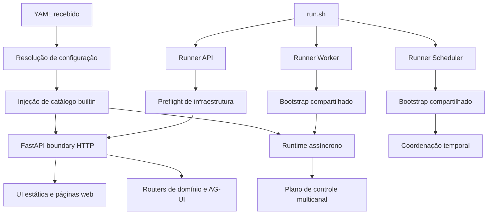
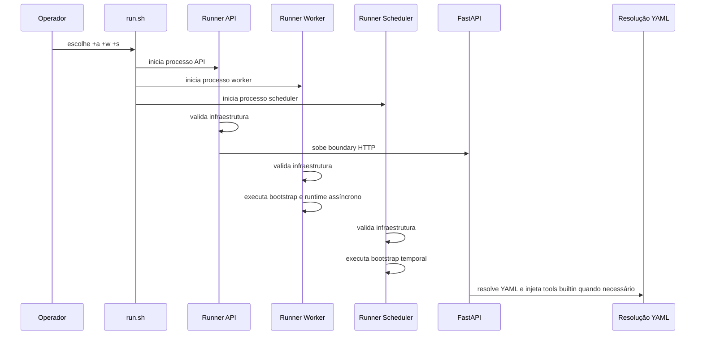

# Manual técnico, executivo, comercial e estratégico: arquitetura da plataforma

## 1. O que é esta arquitetura

Esta plataforma foi organizada para operar como um sistema de IA corporativa que precisa fazer quatro coisas ao mesmo tempo sem virar um monólito improvisado.

- Atender chamadas HTTP e interface web.
- Executar trabalho pesado e assíncrono fora do tempo de resposta do usuário.
- Manter tarefas temporais e manutenção periódica vivas.
- Montar runtime agentic governado a partir de configuração resolvida.

No código lido, essa arquitetura aparece de forma explícita em quatro partes principais.

- API: processo HTTP dedicado.
- Worker: processo dedicado ao runtime assíncrono e ao plano de controle multicanal.
- Scheduler: processo dedicado à coordenação temporal e manutenção periódica.
- UI: interface estática e páginas web servidas pelo mesmo app HTTP da API.

Isso significa que a arquitetura não foi desenhada como um único processo com vários modos escondidos. Ela foi desenhada como uma composição de papéis operacionais distintos, com bootstrap, prontidão e shutdown próprios.

## 2. Que problema ela resolve

Sem essa arquitetura, a plataforma cairia no padrão mais perigoso de sistemas agentic corporativos: o mesmo processo tentando atender web, montar interface, resolver YAML, falar com infraestrutura, disparar jobs, manter agendamentos e executar processamento pesado ao mesmo tempo.

Na prática, isso causaria cinco problemas.

1. A latência da API competiria com OCR, ETL, filas e jobs assíncronos.
2. O suporte perderia clareza sobre onde o fluxo quebrou: entrada, runtime ou coordenação temporal.
3. A operação não conseguiria escalar o gargalo certo.
4. A UI dependeria de contratos instáveis, porque a borda HTTP viraria uma mistura de responsabilidades.
5. O runtime agentic ficaria frágil, porque configuração, catálogo de tools e execução se misturariam sem fronteira clara.

Essa arquitetura existe para transformar concorrência real em papéis operacionais explícitos.

## 3. Visão executiva

Para liderança, a arquitetura importa porque ela reduz risco de indisponibilidade e reduz custo de evolução.

- O atendimento ao usuário não precisa competir diretamente com processamento pesado.
- Cada papel pode ser escalado conforme sua pressão operacional real.
- Fica mais fácil separar incidente de API, incidente de worker e incidente de scheduler.
- O produto evolui sem exigir reescrita estrutural sempre que um novo fluxo agentic entra.

Em linguagem executiva, isso melhora previsibilidade, governança e capacidade de crescimento.

## 4. Visão comercial

Comercialmente, essa arquitetura permite vender a plataforma como algo robusto o bastante para operação real, não apenas para demonstração pontual.

- A interface web pode conviver com APIs e AG-UI no mesmo boundary sem perder governança.
- Casos de uso longos ou pesados não travam o canal de atendimento.
- O cliente pode ter experiências síncronas, assíncronas e dirigidas por tempo usando a mesma plataforma.
- O catálogo builtin e a configuração governada ajudam a mostrar que a solução não depende de scripts soltos ou ajustes manuais por cliente.

Na prática, isso apoia discurso de produto escalável, auditável e pronto para ambientes corporativos com múltiplos fluxos.

## 5. Visão estratégica

Estratégicamente, a arquitetura fortalece a plataforma em seis frentes.

- Reuso: a mesma borda HTTP publica API, UI, AG-UI, workflows, administração e portal.
- Isolamento: API, worker e scheduler mantêm papéis explícitos.
- Governança: o runtime agentic recebe configuração resolvida e catálogo builtin injetado, em vez de depender de YAML arbitrário.
- Observabilidade: startup, prontidão e shutdown geram marcadores próprios por processo.
- Escalabilidade: cada processo pode crescer de forma independente.
- Evolução: novos casos de uso entram sem quebrar a separação entre entrada, execução e coordenação temporal.

Essa é a base que permite a plataforma crescer para mais fluxos agentic, RAG, ETL e experiências de interface sem acumular acoplamento estrutural desnecessário.

## 6. Conceitos necessários para entender

### Boundary HTTP

É a borda pública do sistema. No código lido, ela é o app FastAPI principal. É nessa borda que entram middlewares, autenticação, permissão, roteamento, correlação, páginas web, AG-UI, administração, portal do cliente e APIs funcionais.

### Processo dedicado

É um processo com intenção operacional explícita. Nesta plataforma, API, worker e scheduler não são apenas configurações diferentes. Cada um tem seu próprio runner, seu próprio `PROCESS_ROLE` e seu próprio bootstrap.

### Preflight de infraestrutura

É a validação obrigatória da infraestrutura antes da prontidão do processo. O ganho prático é falhar cedo quando o ambiente está inconsistente, em vez de subir um processo meio funcional.

### Runtime assíncrono

É a parte da plataforma que continua o trabalho fora do request HTTP. No worker atual, isso inclui o runtime de jobs assíncronos e o plano de controle multicanal.

### Coordenação temporal

É a parte responsável por tarefas dirigidas por tempo. Ela pertence ao scheduler, não à API e não ao worker.

### Configuração resolvida

É o estado em que um YAML recebido deixa de ser apenas texto e passa a ser configuração realmente utilizável: com placeholders expandidos, chaves de segurança resolvidas, contrato tratado e catálogo builtin de tools injetado quando aplicável.

### Catálogo builtin global

É o inventário persistido de tools nativas da plataforma. No runtime agentic, o YAML deve trazer `tools_library` vazia e a plataforma injeta o catálogo builtin ativo a partir do banco.

### Correlation ID

É o identificador lógico que atravessa requisição, resposta, logs e acompanhamento operacional. Ele é um eixo de diagnóstico, não um detalhe cosmético.

## 7. Como a arquitetura funciona por dentro

O caminho de execução começa no launcher local `run.sh`. Esse launcher não tenta adivinhar o que deve subir. Ele exige flags explícitas para API, worker e scheduler. Isso é um detalhe importante, porque a própria ferramenta operacional reforça a arquitetura por papéis.

Quando a API sobe, o runner dedicado força `PROCESS_ROLE=api`, resolve host, porta, workers e debug, configura locale, gera um `correlation_id` de bootstrap e roda um preflight obrigatório de infraestrutura antes de entregar controle ao Uvicorn. Só depois o app FastAPI entra em operação.

Quando o worker sobe, o runner força `PROCESS_ROLE=worker`, carrega variáveis de ambiente, valida infraestrutura, inicializa a política de startup, executa o bootstrap compartilhado e então liga o runtime do processo worker. Esse runtime registra prontidão explícita para supervisor multicanal e para o próprio processo worker.

Quando o scheduler sobe, o runner força `PROCESS_ROLE=scheduler`, valida infraestrutura, executa o bootstrap compartilhado e mantém apenas a parte de liderança e manutenção temporal necessária para aquele papel. Ele também emite seu próprio marcador de prontidão.

O boundary HTTP serve mais do que endpoints de API. O mesmo app monta arquivos estáticos em `/ui/static`, publica páginas públicas, portal do cliente, administração, AG-UI, workflows, RAG, UCP, logs, provisionamento e rotas de configuração. Isso mostra uma decisão arquitetural importante: a UI não é um serviço isolado; ela faz parte da mesma superfície HTTP governada.

Ao mesmo tempo, a API não absorve responsabilidades que pertencem ao worker ou ao scheduler. O worker e o scheduler têm runners próprios justamente para evitar esse acoplamento.

## 8. Divisão em camadas e papéis

### 8.1. Launcher operacional

- O que é: a borda local de inicialização da plataforma.
- Problema que resolve: evita startup implícito e inconsistente.
- Como funciona: exige flags explícitas, valida a `.venv`, inicia apenas os papéis escolhidos e coordena shutdown.
- Valor prático: o operador sabe exatamente o que foi iniciado.

### 8.2. Runner da API

- O que é: o processo dedicado do boundary HTTP.
- Problema que resolve: impede que HTTP nasça misturado com worker ou scheduler.
- Como funciona: força `PROCESS_ROLE=api`, faz preflight, configura servidor e sobe Uvicorn.
- Valor prático: torna a borda web previsível e diagnosticável.

### 8.3. Runner do worker

- O que é: o processo dedicado à execução assíncrona.
- Problema que resolve: tira do request HTTP o trabalho pesado e contínuo.
- Como funciona: valida infraestrutura, executa bootstrap compartilhado, liga runtime assíncrono e plano de controle multicanal, emite marcadores de prontidão e shutdown.
- Valor prático: separa atendimento de execução pesada.

### 8.4. Runner do scheduler

- O que é: o processo dedicado à coordenação temporal.
- Problema que resolve: impede que agendamento e manutenção periódica fiquem espalhados pela API.
- Como funciona: valida infraestrutura, aplica política de startup, sobe bootstrap temporal e emite marcador de prontidão.
- Valor prático: centraliza liderança e manutenção sem contaminar o boundary HTTP.

### 8.5. Boundary HTTP unificado

- O que é: o app FastAPI principal.
- Problema que resolve: concentra a superfície pública da plataforma sob uma borda única e governada.
- Como funciona: publica arquivos estáticos, routers de domínio, AG-UI, administração, RAG, portal e APIs funcionais.
- Valor prático: a UI e a API convivem sem duplicar infraestrutura web.

### 8.6. Pipeline de configuração agentic

- O que é: a trilha que transforma YAML em runtime utilizável.
- Problema que resolve: evita execução agentic baseada em configuração solta, placeholders quebrados ou catálogo manual de tools.
- Como funciona: resolve chaves de segurança, expande placeholders e injeta `tools_library` a partir do catálogo builtin persistido quando a chave chega vazia.
- Valor prático: aumenta governança e reduz drift entre configuração e runtime real.

## 9. Fluxo principal de ponta a ponta

### 9.1. Inicialização operacional

1. O operador escolhe explicitamente quais papéis iniciar.
2. Cada processo sobe pelo seu runner próprio.
3. Cada runner força o `PROCESS_ROLE` correto.
4. Cada processo valida infraestrutura obrigatória antes da prontidão.

O valor dessa etapa é impedir ambiguidade operacional logo no começo.

### 9.2. Montagem da superfície HTTP

1. O runner da API sobe o app FastAPI principal.
2. O app monta arquivos estáticos da UI.
3. O app publica routers funcionais e administrativos.
4. O app mantém exceções e correlação dentro da mesma borda pública.

O valor dessa etapa é entregar uma superfície única para API e interface sem perder governança.

### 9.3. Resolução de configuração

1. O YAML chega pela borda adequada.
2. O sistema resolve placeholders e chaves de segurança.
3. O sistema exige `tools_library` presente e vazia quando o fluxo é agentic.
4. O catálogo builtin ativo é carregado do banco e injetado na configuração.

O valor dessa etapa é garantir que o runtime receba configuração válida, não texto bruto com pressupostos escondidos.

### 9.4. Execução síncrona ou continuação assíncrona

1. O boundary HTTP recebe a requisição e organiza o contexto.
2. Se o caso de uso couber no tempo de resposta, ele termina ali.
3. Se exigir continuidade operacional, a execução segue para runtime assíncrono.
4. O worker assume a parte pesada da história.

O valor dessa etapa é preservar a estabilidade da borda pública.

### 9.5. Coordenação temporal e manutenção

1. O scheduler assume liderança e regras temporais.
2. O bootstrap compartilhado mantém tarefas periódicas configuradas.
3. O worker e o scheduler encerram de forma graciosa quando recebem sinal.

O valor dessa etapa é tornar manutenção e recorrência parte explícita da arquitetura.

## 10. Tática arquitetural adotada

A tática principal observada no código é esta: manter a plataforma como um boundary HTTP unificado com execução operacional distribuída por papéis.

Isso parece contraditório à primeira vista, mas não é.

- Unificado na entrada: um app HTTP concentra UI, API, AG-UI, administração e interfaces funcionais.
- Distribuído na execução: worker e scheduler mantêm os trabalhos que não pertencem à borda de entrada.

Essa tática evita os dois extremos ruins.

- Nem tudo vira microserviço cedo demais.
- Nem tudo fica esmagado dentro do mesmo processo HTTP.

## 11. Técnica usada para sustentar a arquitetura

As técnicas mais relevantes confirmadas no código são estas.

- Runners dedicados por papel.
- Forçamento explícito de `PROCESS_ROLE`.
- Preflight obrigatório de infraestrutura antes da prontidão.
- Bootstrap compartilhado para políticas de startup, manutenção e reconciliação.
- Marcadores estruturados de prontidão e shutdown.
- App FastAPI com mount de estáticos e inclusão modular de routers.
- Resolução de YAML com placeholders e chaves multi-tenant.
- Injeção de `tools_library` a partir do catálogo builtin persistido.
- Uso obrigatório de `X-Correlation-Id` e injeção de correlação em respostas JSON quando aplicável.

Essa combinação mostra uma arquitetura que mistura disciplina operacional com flexibilidade de runtime.

## 12. Decisões técnicas e trade-offs

### Separar runners por papel

Ganho: clareza operacional e isolamento de responsabilidade.

Custo: mais componentes para entender no onboarding.

Por que vale a pena: porque API, worker e scheduler têm ritmos e riscos diferentes.

### Manter UI e API no mesmo boundary HTTP

Ganho: menos duplicação de infraestrutura web e um ponto único de publicação.

Custo: o app HTTP fica rico e exige boa organização por routers.

Por que vale a pena: porque a superfície pública continua unificada sem apagar a separação entre entrada e execução pesada.

### Falhar cedo no startup

Ganho: evita operação degradada silenciosa.

Custo: ambientes incompletos falham mais cedo.

Por que vale a pena: porque serviço meio pronto custa mais caro para operar do que serviço que falha explicitamente.

### Exigir `tools_library` vazia no YAML

Ganho: impede catálogo manual paralelo e força governança do inventário builtin.

Custo: reduz liberdade de montar YAML improvisado.

Por que vale a pena: porque o objetivo da plataforma é ter catálogo governado, não configuração solta replicando inventário.

## 13. Configurações que mudam o comportamento

As configurações mais relevantes para esta arquitetura, pelo código lido, são estas.

### Papel do processo

`PROCESS_ROLE` decide se o processo é API, worker ou scheduler. Isso altera a natureza do bootstrap e da operação.

### Configuração do servidor HTTP

Host, porta, número de workers e debug alteram como a API nasce e é exposta.

### Flags de manutenção

Parâmetros como coleta de logs, reconciliação de ingestão e manutenção de aprovações humanas entram no bootstrap compartilhado e mudam o comportamento do runtime periódico.

### Configuração resolvida do YAML

Chaves de segurança, placeholders, presença obrigatória de `tools_library` e injeção do catálogo builtin alteram o modo como o runtime agentic é construído.

## 14. O que acontece em caso de sucesso

No caminho feliz, o que caracteriza sucesso arquitetural não é apenas o processo estar vivo. É isto.

- O papel correto sobe pelo runner correto.
- A infraestrutura obrigatória é validada antes da prontidão.
- A API expõe sua superfície HTTP e UI de forma consistente.
- O worker registra que está pronto para operação assíncrona.
- O scheduler registra que está pronto para coordenação temporal.
- A configuração agentic entra resolvida, com catálogo builtin coerente.
- O fluxo completo continua diagnosticável pelo `correlation_id`.

## 15. O que acontece em caso de erro

Os erros arquiteturais mais importantes vistos no código se agrupam em cinco famílias.

### Erro de preflight

O processo falha antes da prontidão porque a infraestrutura obrigatória não fecha.

### Erro de papel operacional

O processo sobe, mas o papel esperado não é o correto ou algum runner está ausente do ambiente operacional.

### Erro de boundary HTTP

O problema acontece antes da continuação assíncrona: autenticação, permissão, payload, validação ou montagem da borda.

### Erro de runtime assíncrono

O boundary aceitou o trabalho, mas a continuação falhou dentro do worker ou em infraestrutura externa que ele aciona.

### Erro de configuração agentic

O YAML chegou incompleto, com `tools_library` incorreta, placeholders não resolvidos ou catálogo builtin inválido.

## 16. Observabilidade e diagnóstico

A investigação arquitetural correta deve começar pela pergunta certa.

1. Qual papel falhou: API, worker ou scheduler?
2. A falha foi antes ou depois da prontidão?
3. O problema está na entrada HTTP, na continuação assíncrona ou na coordenação temporal?
4. O `correlation_id` permite ligar a história do caso?

Sinais confirmados no código que ajudam nisso.

- Preflight explícito no runner da API.
- Marcador `MULTICHANNEL_SUPERVISOR_READY` no worker.
- Marcador `WORKER_READY` no worker.
- Marcador `SCHEDULER_READY` no scheduler.
- `X-Correlation-Id` adicionado na resposta HTTP.
- Injeção do `correlation_id` em respostas JSON quando aplicável.
- Shutdown coordenado explícito no worker.

Na prática, a arquitetura ajuda porque ela transforma a pergunta o sistema está ruim em algo mais preciso: qual papel da plataforma falhou, em que fase e sob qual correlação?

## 17. Impacto técnico

Tecnicamente, esta arquitetura entrega estes ganhos.

- Reduz acoplamento entre borda HTTP, runtime assíncrono e coordenação temporal.
- Aumenta previsibilidade de startup e shutdown.
- Melhora capacidade de teste e de leitura operacional.
- Sustenta UI, AG-UI, workflows e APIs no mesmo boundary sem empurrar tudo para um só processo de execução.
- Reforça governança do runtime agentic via configuração resolvida e catálogo builtin.

## 18. Impacto executivo

Para liderança, o impacto principal é reduzir risco operacional com uma estrutura mais legível.

- O time sabe qual peça escalar.
- O suporte sabe onde começar uma investigação.
- A plataforma não depende de improviso para crescer.
- A evolução de produto não exige reescrita estrutural a cada novo fluxo.

## 19. Impacto comercial

Para venda e pré-venda, a arquitetura ajuda a sustentar estas mensagens.

- A plataforma suporta experiências web, API e agentic no mesmo produto.
- O processamento pesado não precisa travar a experiência de atendimento.
- O runtime agentic é governado, não improvisado.
- Há trilha operacional suficiente para operação corporativa.

Promessa que não deve ser feita.

- Não dizer que tudo é puramente desacoplado em microserviços independentes, porque o boundary HTTP continua propositalmente unificado.
- Não dizer que todo fluxo é sempre assíncrono, porque a arquitetura também suporta respostas síncronas.

## 20. Exemplos práticos guiados

### 20.1. Subir a plataforma localmente para desenvolvimento

Cenário: um desenvolvedor quer iniciar apenas API e worker.

Como a arquitetura ajuda: o launcher exige escolha explícita de papéis, inicia apenas os entrypoints necessários e coordena o shutdown desses processos.

Valor prático: reduz confusão de ambiente e deixa claro o que está realmente em execução.

### 20.2. Publicar UI administrativa sem criar outro servidor web

Cenário: a operação precisa abrir páginas administrativas e também chamar endpoints da plataforma.

Como a arquitetura ajuda: o mesmo app HTTP serve estáticos e expõe routers web e programáticos.

Valor prático: menos duplicação de deploy e menos pontos de integração entre frontend e backend.

### 20.3. Aceitar um fluxo longo sem travar a API

Cenário: um caso de ingestão ou processamento pesado não pode viver dentro do request.

Como a arquitetura ajuda: a borda HTTP contextualiza, aceita o pedido e a continuação acontece no worker.

Valor prático: a API se mantém estável mesmo quando o domínio exige execução longa.

### 20.4. Reconstituir um incidente

Cenário: um cliente relata que uma execução falhou, mas não está claro se foi erro de entrada ou de runtime.

Como a arquitetura ajuda: o `correlation_id` e os marcadores por processo permitem separar erro de boundary, erro de worker e erro de scheduler.

Valor prático: reduz tempo de diagnóstico e evita caça cega no sistema inteiro.

### 20.5. Montar runtime agentic governado

Cenário: um YAML chega para execução agentic.

Como a arquitetura ajuda: o sistema resolve placeholders, trata chaves multi-tenant e injeta o catálogo builtin quando `tools_library` chega vazia.

Valor prático: o runtime nasce consistente com o inventário real da plataforma.

## 21. Explicação 101

Pense na plataforma como uma operação com quatro frentes.

- A recepção atende o público: essa é a API com a UI integrada.
- A retaguarda faz o trabalho pesado: esse é o worker.
- A coordenação de agenda dispara e mantém tarefas periódicas: esse é o scheduler.
- A governança de configuração garante que o sistema use as ferramentas certas e a configuração certa: essa é a trilha de resolução YAML e catálogo builtin.

O ponto principal é que cada frente sabe o seu papel. Quando isso acontece, o sistema fica mais estável, mais legível e mais fácil de crescer.

## 22. Limites e pegadinhas

- UI integrada ao app HTTP não significa que a UI deva carregar responsabilidade de runtime pesado.
- `HTTP 200` ou `202` não significa que todo o trabalho terminou.
- Compartilhar bootstrap não significa colapsar API, worker e scheduler no mesmo papel.
- YAML presente não significa configuração válida; ele ainda precisa ser resolvido e governado.
- `tools_library` não é espaço para cadastro manual de catálogo builtin.

## 23. Troubleshooting

### 23.1. A API não sobe

Sintoma: o processo HTTP falha antes de aceitar tráfego.

Causa provável: falha no preflight de infraestrutura ou configuração inválida de host, porta ou ambiente.

Onde investigar: runner da API e validação de infraestrutura.

### 23.2. O worker sobe, mas não fica operacional

Sintoma: ausência de marcadores de prontidão do worker.

Causa provável: falha no bootstrap compartilhado, na infraestrutura obrigatória ou no runtime assíncrono do processo worker.

Onde investigar: logs do worker e marcadores `MULTICHANNEL_SUPERVISOR_READY` e `WORKER_READY`.

### 23.3. O scheduler sobe, mas tarefas não rodam

Sintoma: processo aparentemente vivo, mas coordenação temporal não acontece.

Causa provável: problema de liderança, política de startup ou bootstrap do scheduler.

Onde investigar: prontidão do scheduler e estado do bootstrap compartilhado.

### 23.4. O YAML agentic falha antes da execução

Sintoma: erro logo na resolução da configuração.

Causa provável: placeholders não resolvidos, chaves ausentes, `tools_library` ausente ou preenchida manualmente, ou catálogo builtin inválido.

Onde investigar: resolução de configuração e injeção do catálogo builtin.

## 24. Diagramas

Esse diagrama mostra a lógica macro da plataforma: entrada explícita por papéis, boundary HTTP unificado e execução operacional distribuída.

Esse diagrama mostra a ordem real de inicialização observada no código: cada papel sobe de forma explícita e o runtime de configuração agentic entra como parte da operação, não como detalhe secundário.

## 25. Checklist de entendimento

- Entendi que a plataforma tem quatro partes principais: API, worker, scheduler e UI.
- Entendi que API, worker e scheduler têm runners próprios.
- Entendi que o boundary HTTP é unificado, mas a execução pesada não fica nele.
- Entendi que a UI é servida pelo mesmo app HTTP da API.
- Entendi que a infraestrutura obrigatória é validada antes da prontidão.
- Entendi que o worker e o scheduler têm marcadores próprios de prontidão.
- Entendi que a configuração agentic passa por resolução e injeção do catálogo builtin.
- Entendi que `correlation_id` é parte da arquitetura operacional.

## 26. Evidências no código

- `run.sh`
  - Motivo da leitura: confirmar launcher operacional por papéis.
  - Comportamento confirmado: flags explícitas, inicialização seletiva e shutdown coordenado.

- `app/runners/api_runner.py`
  - Motivo da leitura: confirmar bootstrap da API.
  - Comportamento confirmado: `PROCESS_ROLE=api`, locale, preflight de infraestrutura e inicialização do Uvicorn.

- `app/runners/worker_runner.py`
  - Motivo da leitura: confirmar bootstrap do worker.
  - Comportamento confirmado: `PROCESS_ROLE=worker`, bootstrap compartilhado, runtime assíncrono, plano de controle multicanal e marcadores `WORKER_READY`.

- `app/runners/scheduler_runner.py`
  - Motivo da leitura: confirmar bootstrap do scheduler.
  - Comportamento confirmado: `PROCESS_ROLE=scheduler`, bootstrap temporal e marcador `SCHEDULER_READY`.

- `src/api/service_api.py`
  - Motivo da leitura: confirmar boundary HTTP real.
  - Comportamento confirmado: mount de `/ui/static`, inclusão modular de routers e resposta com `X-Correlation-Id`.

- `src/api/routers/config_resolution.py`
  - Motivo da leitura: confirmar entrada da configuração YAML no runtime.
  - Comportamento confirmado: resolução de YAML, expansão de placeholders e tratamento de chaves multi-tenant.

- `src/config/config_cli/configuration_factory.py`
  - Motivo da leitura: confirmar governança do catálogo builtin.
  - Comportamento confirmado: `tools_library` deve existir e chegar vazia; o catálogo builtin ativo é injetado a partir do banco.
