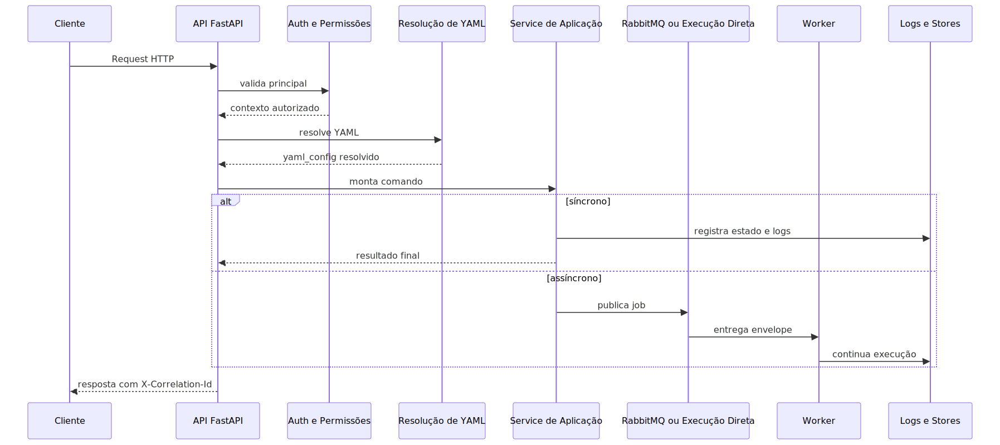

# Arquitetura da Plataforma

## 1. Visão geral

A arquitetura atual da plataforma foi desenhada para sustentar três tipos de trabalho que convivem no mesmo produto, mas exigem ritmos e garantias diferentes.

- Receber e validar pedidos de forma síncrona.
- Executar trabalho pesado e assíncrono com isolamento operacional.
- Manter tarefas recorrentes e coordenação temporal sem bloquear atendimento.

Por isso o sistema é separado em API, worker e scheduler. Essa divisão não é cosmética. Ela existe para impedir que o tempo de resposta do usuário concorra diretamente com OCR, fan-out documental, pipelines ETL, consumo de fila e manutenção operacional.

## 2. O problema que esta arquitetura resolve

Sem essa separação, a plataforma cairia em um padrão muito comum e muito ruim em sistemas de IA corporativa: um único processo tentando ao mesmo tempo atender HTTP, executar trabalho pesado, coordenar jobs periódicos, guardar contexto efêmero e interagir com infraestrutura externa.

Na prática, isso cria quatro efeitos ruins.

1. O atendimento ao usuário fica instável porque compete com execução pesada.
2. O suporte perde clareza sobre onde o problema realmente aconteceu.
3. A operação não consegue escalar o gargalo certo.
4. A rastreabilidade fica quebrada entre request, fila, worker e manutenção.

A arquitetura atual resolve isso separando a fronteira de entrada, a execução assíncrona e a coordenação temporal, mantendo um conjunto comum de configuração, logging, autenticação e infraestrutura.

## 3. Conceitos necessários para entender o módulo

### Boundary HTTP

Boundary HTTP é a borda pública do sistema. É o lugar em que identidade, permissão, contrato de request, correlation_id e normalização inicial de contexto são resolvidos antes de qualquer regra de negócio mais pesada.

### Worker

Worker é o processo que executa trabalho que não deve viver no tempo de resposta do request. No projeto atual, ele sustenta o runtime assíncrono oficial e o plano de controle multicanal.

### Scheduler

Scheduler é o processo responsável por tarefas dirigidas por tempo. Ele não existe para substituir o worker, mas para decidir quando certos trabalhos de manutenção ou restauração devem começar.

### YAML-first

YAML-first significa que a configuração de comportamento nasce em YAML e depois passa por resolução, normalização e, quando necessário, validação ou compilação governada. Isso reduz a quantidade de regra importante escondida em condicionais dispersas.

### Correlation ID

Correlation_id é o identificador lógico que atravessa a execução. Ele permite ligar a chamada HTTP, os logs, o job assíncrono e os modelos operacionais de leitura. Em arquitetura distribuída, isso é o mínimo necessário para contar a história real do processo.

### Preflight de infraestrutura

Preflight é a validação explícita das dependências críticas antes do processo declarar que está pronto. A utilidade prática disso é falhar cedo quando a infraestrutura obrigatória não existe ou está inconsistente.

## 4. Como a plataforma funciona por dentro

A entrada operacional local mais direta continua sendo o launcher `run.sh`. Ele existe para subir os papéis corretos sem apagar a separação entre API, worker e scheduler.

A plataforma começa no boundary HTTP. O app FastAPI é montado com middlewares, routers, proteção de documentação, montagem de UI estática e validações globais. Quando a request entra, a API resolve autenticação, permissão, correlation_id e configuração compartilhada.

Depois dessa etapa, o comportamento depende do domínio.

- Se o pedido é leve e síncrono, a resposta pode sair no mesmo processo HTTP.
- Se o pedido exige execução pesada, o boundary aceita a operação, publica o comando assíncrono e devolve ao cliente um contrato de acompanhamento.
- Se o pedido depende de manutenção temporal, o scheduler coordena o início do trabalho e garante que apenas o processo correto assuma o papel necessário.

Em paralelo a isso, worker e scheduler executam bootstraps próprios. Ambos validam infraestrutura, impõem seu `PROCESS_ROLE`, aplicam políticas de startup e só depois entram em estado operacional.

O detalhe importante aqui é arquitetural: a plataforma não trata API, worker e scheduler como meras variações de configuração do mesmo processo. Eles compartilham algumas peças, mas cada um nasce com intenção operacional explícita.

## 5. Pipeline ou fluxo principal

### Etapa 1: entrada e contextualização

O pedido entra pela API. Nessa etapa o sistema organiza identidade, permissões, correlation_id e configuração mínima. O objetivo não é executar a lógica final, mas impedir que o restante do fluxo receba contexto incompleto ou inconsistente.

### Etapa 2: decisão de modo de execução

Depois da contextualização, o sistema decide se o pedido pode terminar no mesmo processo HTTP ou se precisa ser entregue ao runtime assíncrono. Essa separação é fundamental porque o projeto combina consultas rápidas com trabalhos pesados de ingestão e ETL.

### Etapa 3: continuidade fora do request

Quando o fluxo é assíncrono, o boundary HTTP não tenta simular conclusão. Ele aceita o pedido, publica a continuidade e devolve contrato de acompanhamento. A execução real segue no worker, que mantém o mesmo vínculo lógico de observabilidade.

### Etapa 4: manutenção temporal

Tarefas dirigidas por tempo não nascem do request do usuário. Elas passam pelo scheduler, que cuida de liderança, bootstrap e restauração de jobs quando isso faz parte da política do runtime.

### Etapa 5: leitura operacional

A última etapa não é apenas “terminar”. É permitir que alguém consiga explicar o que aconteceu. Por isso a arquitetura depende de logs contextualizados, sinais de prontidão, estados efêmeros e endpoints operacionais.

## 6. Decisões técnicas importantes

### Separar API, worker e scheduler

Essa é a decisão mais importante do sistema. O ganho é previsibilidade operacional. O trade-off é maior custo mental inicial, porque o projeto deixa de parecer um serviço único simples. Esse custo vale a pena porque a alternativa seria esconder concorrência real atrás de uma superfície artificialmente simples.

### Fazer preflight antes da prontidão

O sistema valida infraestrutura obrigatória antes de declarar que um processo está pronto. O ganho é evitar operação degradada silenciosa. O trade-off é bloquear startup com mais frequência quando o ambiente está ruim. Isso é deliberado.

### Tratar YAML como entrada governada, não como texto livre

Essa decisão reduz drift entre o que a configuração parece dizer e o que o runtime realmente consegue executar. O ganho é segurança semântica. O trade-off é exigir mais disciplina na entrada.

### Manter correlation_id como eixo transversal

O projeto assume que observabilidade não é luxo. O correlation_id é a cola entre entrada, execução e suporte. O ganho é diagnóstico real. O trade-off é a necessidade de propagar contexto com rigor em todas as bordas.

## 7. O que acontece em caso de sucesso

No caminho feliz, a API sobe com infraestrutura validada, o worker entra em prontidão com plano de controle operacional ativo e o scheduler assume apenas o que precisa assumir. Uma request recebe contexto, é roteada para o domínio certo, executa no boundary ou continua no worker e termina com rastreabilidade suficiente para investigação posterior.

Do ponto de vista do operador, sucesso não é só receber HTTP 200 ou 202. É conseguir verificar que o processo certo estava pronto, que a execução seguiu para o papel correto e que a observabilidade preservou a história do caso.

## 8. O que acontece em caso de erro

Os erros mais importantes nesta arquitetura aparecem em quatro famílias.

### Erro de infraestrutura antes do startup

Quando infraestrutura obrigatória não fecha, o processo falha cedo. Isso evita que a aplicação suba “meio viva”. O sintoma prático é ausência de prontidão do papel afetado.

### Erro de boundary HTTP

Quando a falha acontece antes da publicação assíncrona, o problema tende a estar em autenticação, permissão, payload ou resolução de configuração. Nesse caso o worker nem deveria ser tratado como suspeito principal.

### Erro de continuação assíncrona

Quando a API aceita o pedido, mas o fluxo falha depois, o problema geralmente já saiu do boundary e entrou na execução assíncrona, na infraestrutura externa ou no domínio específico.

### Erro de coordenação temporal

Quando manutenção, liderança ou bootstrap temporal falham, o sintoma costuma aparecer em jobs que não disparam, não restauram ou não mantêm o estado esperado.

## 9. Configurações que mudam o comportamento

As configurações que realmente alteram esta arquitetura, pelo código lido, pertencem a quatro grupos.

### Papel do processo

O `PROCESS_ROLE` decide se o processo nasce como API, worker ou scheduler. Isso muda o comportamento operacional de forma estrutural.

### Configuração do servidor HTTP

Host, porta, quantidade de workers e modo de debug influenciam o bootstrap da API e o desenho do processo HTTP.

### Flags de manutenção e reconciliação

O bootstrap compartilhado recebe flags para coleta de logs, reconciliação de ingestão e manutenção de aprovações humanas. Elas alteram o que o runtime periódico vai manter vivo.

### Flags de governança agentic

No fluxo agentic, a habilitação de recursos governados altera se certos endpoints e validações AST podem operar de fato.

O ponto conceitual importante é este: as configurações relevantes não são apenas “dados”. Elas decidem em qual modo arquitetural a plataforma vai operar.

## 10. Observabilidade e diagnóstico

A regra prática de diagnóstico desta arquitetura é separar a pergunta em três camadas.

1. O boundary HTTP recebeu e contextualizou corretamente?
2. O trabalho continuou no processo certo?
3. A trilha operacional preservou correlation_id, status e logs suficientes?

Sinais úteis do código lido:

- a API registra startup e valida infraestrutura antes do bootstrap HTTP;
- o worker emite marcadores explícitos de prontidão e shutdown coordenado;
- o scheduler emite marcador explícito de prontidão;
- o runtime compartilha validação de infraestrutura, mas não apaga a separação entre papéis.

Em produção ou homologação, isso significa que uma investigação arquitetural boa começa pelo papel certo. Primeiro descubra se o problema é de entrada, continuidade assíncrona ou coordenação temporal. Só depois aprofunde no domínio específico.

Outro ponto importante é que a UI administrativa faz parte do mesmo app HTTP. Um exemplo concreto disso é `app/ui/static/js/admin-ingestao.js`, que consome a superfície administrativa publicada pela própria aplicação principal.

## 11. Exemplo prático guiado

Imagine uma solicitação de ingestão enviada pela API.

1. A API sobe e já validou infraestrutura obrigatória antes de aceitar tráfego.
2. A request entra, recebe correlation_id, passa por autenticação e resolução de contexto.
3. O domínio decide que o trabalho é assíncrono e devolve aceite com contrato de acompanhamento.
4. O worker, que já estava pronto, continua a execução com o mesmo vínculo lógico de observabilidade.
5. O operador acompanha task_id, correlation_id e leitura operacional até o estado terminal.

O valor arquitetural desse fluxo é simples: cada processo faz uma parte da história, mas a história continua rastreável de ponta a ponta.

## 12. Explicação 101

Pense na plataforma como uma operação com três equipes.

- A equipe de atendimento recebe o pedido, confere identidade e organiza o contexto.
- A equipe de execução pesada pega o trabalho que não cabe no atendimento ao vivo.
- A equipe de coordenação temporal garante que as tarefas periódicas aconteçam na hora certa.

A arquitetura existe para impedir que uma equipe faça o trabalho da outra de forma improvisada. Quando isso é respeitado, o sistema fica mais previsível e mais fácil de investigar.

## 13. Limites e pegadinhas

- Compartilhar infraestrutura não significa compartilhar a mesma regra de negócio.
- Aceite HTTP não significa término do trabalho.
- Worker e scheduler não são variações decorativas da API; eles têm responsabilidades próprias.
- Ler apenas Swagger não explica a semântica operacional da execução.
- Ler apenas YAML também não basta, porque parte do comportamento depende de normalização, validação e assembly.

## 14. Evidências no código

- `run.sh`: launcher operacional local.
- [app/runners/api_runner.py](../app/runners/api_runner.py): bootstrap dedicado da API, com preflight de infraestrutura.
- [app/runners/worker_runner.py](../app/runners/worker_runner.py): ciclo de vida do processo worker e marcadores de prontidão.
- [app/runners/scheduler_runner.py](../app/runners/scheduler_runner.py): ciclo de vida do processo scheduler.
- [src/api/service_api.py](../src/api/service_api.py): boundary HTTP, middlewares e publicação do app FastAPI.
- [src/api/routers/config_resolution.py](../src/api/routers/config_resolution.py): resolução compartilhada de configuração YAML.
- [app/ui/static/js/admin-ingestao.js](../app/ui/static/js/admin-ingestao.js): evidência da UI administrativa integrada ao mesmo app HTTP.
