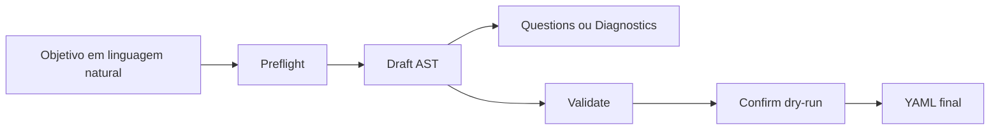

# Manual Técnico AST Agentic Designer

## 0. Comece aqui (nível iniciante)

Se você está começando agora no módulo agentic:

1. Leia primeiro `docs/README-AGENTIC-INICIANTES.md`.
2. Se o seu foco for sair de um objetivo em linguagem natural até o YAML final, leia também `docs/tutorial-101-nl2yaml.md`.
3. Volte para este manual para referência técnica completa.

Mapa mental recomendado:

1. YAML é a configuração de entrada.
2. Parser transforma YAML em AST tipada.
3. Validação estrutural e semântica gera diagnósticos.
4. `confirm` compila e mescla no YAML final.

Vocabulário rápido:

1. AST: representação canônica e tipada do contrato dentro do módulo de assembly.
2. Contrato estrutural: campos obrigatórios, tipos e formatos.
3. Contrato semântico: consistência de negócio (IDs, referências, tools válidas).
4. Diagnóstico: erro/aviso estruturado com `code`, `path`, `severity`.

### 0.1 AST em linguagem simples

Neste projeto, AST não é a AST do Python.
Aqui, AST é um objeto tipado que representa a parte agentic do YAML de forma segura para edição, validação e merge.

Pense assim:

1. O YAML é o arquivo grande e final que o runtime executa.
2. O AST é a versão organizada desse contrato, com campos conhecidos e tipos explícitos.
3. O módulo de assembly usa o AST para evitar editar o YAML cru no escuro.

Em português simples:

1. O parser lê YAML e converte para AST.
2. O validator confere se essa AST faz sentido estrutural e semanticamente.
3. O compiler transforma a AST validada em fragmento YAML.
4. O `confirm` mescla esse fragmento no YAML base.

### 0.2 Diagrama 101

```text
YAML base ou prompt
        |
        v
draft / parse
        |
        v
AgenticDocumentAST
        |
        +--> validate
        |       |
        |       v
        |   diagnostics + compiled_fragment
        |
        v
confirm
        |
        v
merge com o YAML base
        |
        v
YAML final
```

Leitura rápida do diagrama:

1. Se entrar YAML, o sistema faz parse para AST.
2. Se entrar prompt, o sistema tenta gerar AST.
3. A AST nunca deveria ir direto para gravação sem passar por validação.
4. O YAML final nasce do merge entre `base_yaml` e o fragmento compilado do alvo.
5. Quando `confirm` grava em um arquivo YAML já existente, a escrita agora preserva ao máximo o restante do documento e reescreve só os blocos top-level governados e o bloco `metadata` do selo.

### 0.3 Regra de consistência YAML x AST

Regra prática para o time:

1. Esta regra vale para o escopo agentic controlado pelo assembly, especialmente `workflows`, `multi_agents`, `tools_library`, `selected_workflow`, `selected_supervisor` e `workflows_defaults`.
2. A AST é a fonte de verdade do contrato dentro do escopo agentic governado pelo assembly.
3. O YAML persistido e lido pelo runtime atual continua existindo, mas nesse escopo ele é tratado como artefato compilado a partir da AST.
4. Fora do escopo agentic governado por este manual, o sistema continua YAML-first.
5. AST e YAML compilado não podem evoluir separadamente.
6. O `confirm` grava um hash canônico do fragmento governado em `metadata.agentic_assembly.governed_hashes.<target>`.
7. `validate` e `confirm` recalculam esse hash a partir do YAML atual; se o bloco governado tiver sido editado manualmente sem recompilação, o fluxo acusa deriva determinística.
8. O runtime também passou a exigir esse selo: `YamlConfigManager`, `WorkflowConfigResolver` e `SupervisorConfigResolver` recusam configuração governada sem hash válido ou com hash divergente, salvo rollback explícito em modo `warn`.

Quando mudar a estrutura canônica de `workflows`, `multi_agents`, `tools_library` ou campos relacionados, atualize na mesma PR:

1. modelos AST;
2. parser;
3. validator;
4. compiler;
5. schema e docs;
6. testes de round-trip e validação.

O erro clássico é tratar AST e YAML como dois contratos independentes.
Quando isso acontece, a UI monta uma coisa, o validator aceita outra e o runtime executa uma terceira.

### 0.4 Cuidados práticos

1. Parser tolerante não significa suporte real em runtime.
2. Diagnóstico de parse não substitui validação semântica.
3. `confirm` deve ser a etapa de consolidação, não de descoberta de contrato.
4. Se a AST governada mudou, o YAML compilado, o schema, os exemplos e a documentação também precisam mudar.
5. Se uma chave não estiver modelada no AST, ela não entra no escopo governado por inferência.

### 0.5 Arquivos e classes obrigatórios para validar mudanças

Ao mexer no contrato agentic, estes são os pontos reais de validação no código:

1. Envelope AST: `src/config/agentic_assembly/ast/document.py` -> `AgenticDocumentAST`.
2. AST de workflow: `src/config/agentic_assembly/ast/workflow.py` -> `WorkflowAST`, `WorkflowNodeAST` (união discriminada por `mode`) e `WorkflowEdgeAST`.
3. AST de supervisor: `src/config/agentic_assembly/ast/supervisor.py` -> `SupervisorAST` e `AgentAST`.
4. AST de deepagent: `src/config/agentic_assembly/ast/deepagent.py` -> `DeepAgentSupervisorAST`.
5. AST de tools: `src/config/agentic_assembly/ast/tool.py` -> `ToolDefinitionAST`.
6. Parsers: `src/config/agentic_assembly/parsers/workflow_parser.py` -> `WorkflowParser`, `src/config/agentic_assembly/parsers/supervisor_parser.py` -> `SupervisorParser`, `src/config/agentic_assembly/parsers/deepagent_parser.py` -> `DeepAgentParser`, `src/config/agentic_assembly/parsers/tool_parser.py` -> `ToolDefinitionsParser`.
7. Validação agregada: `src/config/agentic_assembly/validators/document_validator.py` -> `DocumentSemanticValidator`.
8. Validação por alvo: `src/config/agentic_assembly/validators/workflow_semantic_validator.py` -> `WorkflowSemanticValidator`, `src/config/agentic_assembly/validators/supervisor_semantic_validator.py` -> `SupervisorSemanticValidator`, `src/config/agentic_assembly/validators/deepagent_semantic_validator.py` -> `DeepAgentSemanticValidator`.
9. Expressões de workflow: `src/config/agentic_assembly/parsers/expression_parser.py` -> `ExpressionParser` e `src/config/agentic_assembly/validators/expression_validator.py` -> `ExpressionSemanticValidator`.
10. Compilação e merge: `src/config/agentic_assembly/compilers/workflow_compiler.py` -> `WorkflowCompiler`, `src/config/agentic_assembly/compilers/supervisor_compiler.py` -> `SupervisorCompiler`, `src/config/agentic_assembly/compilers/deepagent_compiler.py` -> `DeepAgentCompiler`, `src/config/agentic_assembly/compilers/document_compiler.py` -> `DocumentCompiler`.
11. Orquestração do fluxo oficial: `src/config/agentic_assembly/assembly_service.py` -> `AgenticAssemblyService`.
12. Schema consumido por UI e validação externa: `src/config/agentic_assembly/schema_service.py` -> `AgenticAssemblySchemaService`.

### 0.6 O que significa NL2YAML aqui

Quando este repositório fala de NL2YAML no escopo agentic, ele não está
falando de uma heurística solta que cospe YAML textual.
Ele está falando principalmente do fluxo governado
`objective-to-yaml`, que reutiliza a infraestrutura oficial de assembly.

Em linguagem simples:

1. o usuário descreve um objetivo em linguagem natural;
2. o sistema tenta transformar isso em AST agentic válida;
3. a AST passa por validação forte;
4. o YAML final só aparece quando a confirmação em dry-run fecha sem
  bloqueio.

Essa distinção importa porque evita um erro comum.
NL2YAML aqui não significa "gerar qualquer YAML que pareça correto".
Significa gerar um YAML governado por AST, validadores, compiler e
regras explícitas de bloqueio.

## 1. Objetivo

Este manual define o contrato técnico da AST canônica usada pelo fluxo de montagem assistida:

1. `objective-to-yaml` para o caso de uso final do produto: objetivo em linguagem natural para YAML validado ou perguntas bloqueantes.
2. `draft` para gerar rascunho AST.
3. `validate` para validação semântica forte.
4. `confirm` para compilar/mesclar e aplicar no YAML.

Escopo desta versão:

1. `workflow`
2. `agent_supervisor`
3. `deepagent_supervisor`

## 2. Endpoints `/config/assembly`

### 2.1 `POST /config/assembly/preflight`

Endpoint operacional para checar prontidão antes do primeiro draft ou da recomendação de tools.

Request JSON:

```json
{
  "user_email": "user@empresa.com",
  "target": "workflow",
  "base_yaml": {
    "llm": {
      "provider": "openai"
    }
  }
}
```

O preflight existe para responder cedo uma pergunta simples: "este ambiente está pronto para usar o assembly agora?".
Na prática, o backend valida um checklist mínimo sem duplicar regra crítica na UI:

1. feature flag do assembly;
2. identidade do operador presente na requisição;
3. provider LLM configurado;
4. suporte real a saída estruturada no provider carregado;
5. catálogo efetivo de tools carregável para o target solicitado.

Ponto importante:

1. o endpoint continua exigindo autenticação e permissão administrativa normais;
2. diferente de `draft`/`validate`/`confirm`, ele não esconde a feature flag desligada atrás de `404`;
3. em vez disso, devolve `ready=false` com checks acionáveis para operação.

Response JSON:

```json
{
  "success": false,
  "ready": false,
  "summary": "Ambiente ainda não está pronto para gerar drafts do assembly.",
  "target": "workflow",
  "llm_provider": "openai",
  "supports_structured_output": false,
  "catalog_size": 0,
  "checks": [
    {
      "code": "AST_PREFLIGHT_FEATURE_DISABLED",
      "label": "Feature flag do assembly",
      "status": "error",
      "message": "Ative FEATURE_AGENTIC_AST_ENABLED=true para continuar."
    }
  ],
  "diagnostics": [],
  "correlation_id": "..."
}
```

### 2.2 `POST /config/assembly/draft`

Request JSON:

```json
{
  "target": "workflow",
  "base_yaml": {
    "selected_workflow": "wf_base",
    "workflows": []
  },
  "template_path": null,
  "prompt": "crie um workflow de triagem com router",
  "generation_mode": "llm_schema",
  "constraints": {
    "max_nodes": 6,
    "allowed_modes": ["agent", "router", "if", "tool"]
  },
  "user_email": "user@empresa.com",
  "return_content": true
}
```

`generation_mode` suportado:

1. `auto`: tenta geração estruturada via LLM (`llm_schema`) como primeira opção; se a LLM falhar, não devolver payload AST válido ou devolver AST semanticamente inválida, o fluxo só pode cair para heurística local quando houver opt-in explícito.
2. `llm_schema`: exige geração estruturada via LLM; sem fallback. Este é o default recomendado do contrato e da UI.
3. `heuristic`: usa pipeline heurístico local (`intent_parser` + archetypes).

`template_path` é governado. Na prática, isso significa que o backend só aceita arquivos `.yaml` ou `.yml` dentro de `app/yaml`. Caminhos fora dessa pasta, atalhos com `..` que escapem da área governada e extensões diferentes são rejeitados com erro claro. Essa regra evita que uma chamada de draft leia arquivos arbitrários do servidor.

Constraint opcional para retries estruturados:

1. `constraints.llm_schema_max_attempts`: inteiro de `1` a `5` (default `2`).
2. `constraints.auto_heuristic_fallback_enabled`: controla se o modo `auto` pode cair para heurística local quando o ramo LLM não produzir um draft utilizável. O padrão atual é desabilitado; para produção, habilite explicitamente via request ou pela feature flag `FEATURE_AGENTIC_AST_AUTO_HEURISTIC_FALLBACK_ENABLED=true` quando houver decisão operacional formal.
3. `constraints.assembly_repair_max_attempts`: controla quantas tentativas de reparo conservador o pipeline faz antes de desistir do ramo atual.

Além do retry de schema, a chamada externa ao provider LLM usa o mecanismo central de retry do projeto. O retry de schema corrige resposta fora do formato esperado. O retry externo trata falha transitória de comunicação com o provider, como timeout. Erro de contrato, schema inválido ou credencial inválida não deve entrar em retry.

Response JSON:

```json
{
  "success": true,
  "ast_draft": {},
  "draft_fragment": {},
  "merged_preview": {},
  "diff_preview": [],
  "diagnostics": [],
  "questions": [],
  "validation_report": {
    "is_valid": true,
    "target": "workflow",
    "error_count": 0,
    "warning_count": 0,
    "diagnostics": []
  },
  "correlation_id": "..."
}
```

### 2.2.1 `POST /config/assembly/objective-to-yaml`

Endpoint de produto para quem quer sair de um objetivo em linguagem natural direto para um YAML final validado, sem precisar orquestrar manualmente `preflight`, `draft`, `validate` e `confirm` no cliente.

Request JSON:

```json
{
  "prompt": "Monte um workflow de atendimento com triagem e consulta ao CRM.",
  "user_email": "user@empresa.com",
  "target": "auto",
  "generation_mode": "llm_schema",
  "base_yaml": {
    "llm": {
      "provider": "openai"
    }
  }
}
```

O que esse endpoint faz na prática:

1. executa o `preflight` interno para garantir que o ambiente está pronto;
2. gera um draft governado a partir do objetivo;
3. valida semanticamente o AST produzido;
4. executa `confirm` em dry-run para produzir o YAML final em memória;
5. devolve o YAML serializado quando tudo estiver válido;
6. devolve `questions` e `diagnostics` quando faltar informação obrigatória.

Ponto importante:

1. ele reutiliza exatamente a infraestrutura oficial do assembly;
2. ele não cria engine paralela nem contrato alternativo de compilação;
3. o YAML só aparece como final quando já passou por validação antes da resposta.

### 2.2.1.1 Arquitetura real do NL2YAML governado

O fluxo `objective-to-yaml` é o caminho de produto para sair de um
objetivo em linguagem natural até um YAML final validado.
Mas ele não pula etapas.

As camadas reais do fluxo são estas:

1. o router HTTP autentica, aplica permissão e correlation_id;
2. o preflight verifica se o ambiente está pronto;
3. o draft tenta construir AST a partir do objetivo;
4. o validate verifica a consistência do AST;
5. o confirm em dry-run compila e mescla o YAML final em memória.

Em linguagem simples: é um funil com vários portões.
O operador entra com um objetivo, mas só sai com YAML final se passar
por todos os portões de segurança.

### 2.2.1.2 Etapa 1: boundary HTTP e feature flag

O boundary oficial está em `/config/assembly/objective-to-yaml`.
Esse endpoint exige autenticação, permissão administrativa e a feature
flag do assembly habilitada.

Boa prática importante:
o boundary já registra logs estruturados com target, generation_mode,
prompt_length, blocking_stage e validation_report.
Isso melhora a operação porque a investigação já começa sabendo em que
estágio o fluxo parou.

### 2.2.1.3 Etapa 2: preflight

Antes de falar em draft, o fluxo executa preflight.
Esse passo responde uma pergunta simples: o ambiente está pronto para
tentar gerar YAML final com segurança?

Na prática, o preflight verifica itens como:

1. feature flag do assembly;
2. identidade do operador;
3. provider LLM configurado;
4. suporte real a saída estruturada;
5. catálogo efetivo de tools para o target.

Boa prática importante:
quando o ambiente não está pronto, o fluxo para cedo e devolve
`blocking_stage=preflight`.
Ele não avança esperando que o problema desapareça mais adiante.

### 2.2.1.4 Etapa 3: draft governado

Se o preflight estiver pronto, o fluxo entra em `draft`.
É nessa fase que o objetivo em linguagem natural tenta virar AST.

O draft pode operar em modos como:

1. `llm_schema`, que exige saída estruturada do LLM;
2. `heuristic`, que usa pipeline local;
3. `auto`, que escolhe o ramo conforme a política configurada.

Boa prática importante:
o draft não publica YAML final.
Ele produz AST, perguntas bloqueantes, diagnósticos e preview de merge.

Em linguagem simples: draft é rascunho governado, não publicação.

### 2.2.1.5 Etapa 4: questions e bloqueios explícitos

Se o draft encontrar ambiguidades ou dependências ausentes, o fluxo não
inventa resposta.
Ele devolve `questions` obrigatórias e bloqueia a publicação.

Isso é importante porque o produto prefere ser honesto sobre uma lacuna
de informação a gerar um YAML aparentemente bonito, mas semanticamente
errado.

Em linguagem simples: quando o sistema não sabe, ele pergunta.
Ele não chuta.

### 2.2.1.6 Etapa 5: validate

Se não houver bloqueio no draft, a AST segue para `validate`.
Esse passo confirma se o payload gerado faz sentido estrutural e
semanticamente.

Aqui entram os validadores oficiais do assembly, não uma checagem leve.
É nessa etapa que o fluxo garante que alvo, referências, campos e
relações entre blocos continuam coerentes com o contrato canônico.

Boa prática importante:
o endpoint de produto continua reutilizando o mesmo validate oficial do
assembly. Ele não cria um validador paralelo só porque a entrada veio de
linguagem natural.

### 2.2.1.7 Etapa 6: confirm em dry-run

Quando o validate passa, o fluxo executa `confirm` em dry-run.
Esse passo compila o fragmento governado, faz o merge com o YAML base e
produz o `final_yaml` em memória.

Esse detalhe é decisivo.
No caminho `objective-to-yaml`, o YAML final não nasce direto do draft.
Ele nasce da mesma etapa de confirmação usada pelo fluxo oficial do
assembly.

Em linguagem simples: o sistema não entrega o primeiro rascunho. Ele
entrega o resultado que já passou pelo compilador e pelo merge oficial.

### 2.2.1.8 Técnicas e táticas importantes do NL2YAML atual

Estas técnicas aparecem no desenho atual e merecem ser entendidas como
boas práticas do fluxo.

1. separar `preflight`, `draft`, `validate` e `confirm` em vez de fundir
  tudo numa chamada opaca;
2. usar AST como contrato intermediário, e não YAML cru, durante a fase
  de geração;
3. bloquear cedo quando faltarem dependências, tools ou suporte do
  provider;
4. devolver `blocking_stage` e `questions` como contrato explícito;
5. usar `confirm` em dry-run para produzir o YAML final antes de qualquer
  gravação real;
6. registrar `decision_trace` e diagnósticos para operação e revisão.

### 2.2.1.9 Como pensar o NL2YAML em linguagem simples

Uma analogia útil é esta:

1. o objetivo em linguagem natural é o briefing;
2. o draft é o rascunho técnico;
3. o validate é a revisão de consistência;
4. o confirm é a consolidação final no formato aceito pela plataforma.

Se alguma dessas fases falhar, o sistema para e explica onde parou.
Isso é melhor do que entregar um YAML quase certo que depois quebra na
execução real.

### 2.2.1.10 Fluxo visual do NL2YAML governado



### 2.2.2 Quando sai YAML final e quando saem `questions`

Regra operacional do endpoint:

1. `final_yaml` e `final_yaml_text` só aparecem quando `preflight`, `draft`, `validate` e `confirm` em dry-run terminam sem bloqueio.
2. `blocking_stage` sempre aponta o estágio que interrompeu o fluxo: `preflight`, `draft`, `validate` ou `confirm`.
3. `questions` são bloqueantes, não meramente informativas.
4. Em workflow, um prompt real como `Crie um workflow com integração mcp para usar tool mcp_orders.` devolve `questions` quando o `base_yaml` não oferece MCP ativo no escopo selecionado.
5. Em deepagent, um prompt real como `Crie um deepagent para usar tool support_lookup e investigar chamados.` reaproveita `deepagent_memory` e `local_mcp_configuration` do `base_yaml` quando esses blocos já existem; se a memória estiver ausente, o fluxo retorna `questions` em vez de inventar fallback.

Response JSON no caminho feliz:

```json
{
  "success": true,
  "requested_target": "auto",
  "resolved_target": "workflow",
  "blocking_stage": null,
  "final_yaml": {
    "selected_workflow": "wf_atendimento"
  },
  "final_yaml_text": "selected_workflow: wf_atendimento\n",
  "diff_preview": [],
  "chosen_tools": [
    {
      "tool_id": "crm_lookup",
      "source": "confirm.final_yaml",
      "paths": [
        "workflows[0].nodes[0].tools[0]"
      ]
    }
  ],
  "decision_trace": [
    {
      "decision": "target",
      "source": "nl.classification",
      "value": "workflow",
      "details": "sinais=workflow"
    }
  ],
  "questions": [],
  "diagnostics": [],
  "preflight_ready": true,
  "preflight_summary": "Ambiente pronto para gerar drafts do assembly com LLM estruturado e catálogo disponível.",
  "preflight_checks": [],
  "validation_report": {
    "is_valid": true,
    "target": "workflow",
    "error_count": 0,
    "warning_count": 0,
    "diagnostics": []
  },
  "correlation_id": "..."
}
```

Response JSON quando ainda faltam dados:

```json
{
  "success": false,
  "requested_target": "auto",
  "resolved_target": "workflow",
  "blocking_stage": "draft",
  "final_yaml": null,
  "final_yaml_text": null,
  "chosen_tools": [],
  "questions": [
    {
      "id": "workflows.0.nodes.1.params.tool_id",
      "title": "Resolver Tool Ambígua",
      "question": "Escolha a tool correta antes de publicar o YAML final.",
      "required": true
    }
  ],
  "diagnostics": [
    {
      "code": "AST_OBJECTIVE_TO_YAML_QUESTOES_PENDENTES",
      "message": "O fluxo objetivo->YAML gerou perguntas obrigatórias; responda essas pendências antes de publicar o YAML final.",
      "path": "questions",
      "severity": "error",
      "target": "workflow"
    }
  ],
  "correlation_id": "..."
}
```

### 2.3 `POST /config/assembly/validate`

```json
{
  "target": "workflow",
  "base_yaml": {
    "workflows": []
  },
  "ast_payload": {
    "target": "workflow",
    "selected_workflow": "wf_1",
    "workflows": []
  },
  "strict": true
}
```

### 2.4 `POST /config/assembly/confirm`

```json
{
  "base_yaml": {
    "workflows": []
  },
  "ast_payload": {
    "target": "workflow",
    "selected_workflow": "wf_1",
    "workflows": []
  },
  "answers": {
    "selected_workflow": "wf_1"
  },
  "apply": false,
  "output_path": null,
  "force": false
}
```

### 2.5 `GET /config/assembly/schema`

Retorna JSON Schema para:

1. `workflow`
2. `agent_supervisor`
3. `deepagent_supervisor`
4. `common`
5. `all`

Observação:

1. O grupo `document` existe dentro do payload de schemas retornado pelo serviço.
2. Se um consumidor técnico pedir um `target` inválido fora da borda HTTP, o serviço falha explicitamente. O backend não faz mais fallback silencioso retornando todos os schemas.

### 2.6 `GET /config/assembly/catalog`

Retorna catálogo para UI:

1. `workflow_modes`
2. `tools_catalog`
3. `safe_functions`
4. `execution_modes`
5. `deepagent_middlewares`

### 2.7 `POST /config/assembly/recommend-tools`

Endpoint para analisar uma situação em linguagem natural e sugerir quais tools do catálogo agentic são mais indicadas.

Request JSON:

```json
{
  "user_email": "user@empresa.com",
  "base_yaml": {
    "llm": {
      "provider": "openai"
    },
    "selected_workflow": "wf_atendimento",
    "workflows": [
      {
        "id": "wf_atendimento",
        "enabled": true,
        "tools_library": []
      }
    ]
  },
  "situation": "Quero criar uma planilha excel com resumo de vendas.",
  "target": "workflow",
  "constraints": {
    "llm_schema_max_attempts": 3
  }
}
```

Response JSON:

```json
{
  "success": true,
  "analysis_summary": "Para esta situação, a estratégia é selecionar tools que descrevem criação e escrita de planilha.",
  "recommended_tools": [
    {
      "tool_id": "excel_writer",
      "reason": "A descrição da tool informa criação e gravação de planilhas Excel."
    }
  ],
  "solution_steps": [
    {
      "title": "Preparar dados da planilha",
      "description": "Organize os dados de entrada no formato esperado antes de chamar a tool.",
      "tool_ids": [
        "excel_writer"
      ]
    },
    {
      "title": "Gerar arquivo final",
      "description": "Use a tool indicada para criar e salvar o arquivo da planilha.",
      "tool_ids": [
        "excel_writer"
      ]
    }
  ],
  "limitations": [],
  "diagnostics": [
    {
      "code": "AST_TOOL_RECOMMENDATION_GERADA",
      "message": "Recomendação de tools gerada via LLM com envelope JSON válido (attempts_used=1).",
      "path": "recommended_tools",
      "severity": "info",
      "target": "workflow"
    }
  ],
  "catalog_size": 123,
  "correlation_id": "20260306_120000-aaaaaaaa-bbbb-cccc-dddd-eeeeeeeeeeee"
}
```

### 2.7 Guia completo - recomendação de tools por situação

#### 2.7.1 Visão geral

O endpoint `POST /config/assembly/recommend-tools` foi criado para responder uma pergunta operacional comum: "dada esta situação do cliente, quais tools do catálogo devo usar?".
Ele recebe um YAML base e uma descrição textual da situação.
Com isso, o backend monta o catálogo efetivo de tools e pede para o modelo gerar uma recomendação estruturada.
A resposta sempre volta no formato JSON com resumo da análise, tools sugeridas, passos da solução e diagnósticos.

#### 2.7.2 Por que existe

Antes desse endpoint, quem montava fluxos precisava descobrir manualmente quais tools usar.
Isso gerava duas dores: demora de configuração e risco de escolher tools incompatíveis com o catálogo real.
Esse endpoint existe para reduzir tentativa e erro e transformar a escolha de tools em uma etapa guiada.
Ele também evita suposição de capacidades não implementadas, porque a recomendação fica limitada ao catálogo carregado.

#### 2.7.3 Explicação conceitual

O fluxo começa no router de assembly e reutiliza os mesmos controles de segurança, autorização e correlation_id do restante do módulo AST.
Depois, o serviço resolve o catálogo efetivo de tools combinando `base_yaml` e o catálogo builtin persistido em `integrations.builtin_tool_registry`.
Em seguida, o gerador constrói um prompt restritivo para LLM com três regras centrais: não inventar tools, não especular e não assumir comportamento além do catálogo compacto.
Esse catálogo compacto inclui apenas campos seguros e úteis para decisão: nome da tool, descrição, categoria, tags, aliases e parâmetros declarados quando existirem.
Campos sensíveis, como chaves, tokens, senhas e credenciais, são removidos antes de montar o prompt.
A saída da LLM é obrigatoriamente JSON estruturado e validada por schema (`ToolRecommendationEnvelope`).
Por fim, o backend valida se todos os `tool_id` retornados realmente existem no catálogo carregado; se existir qualquer id inválido, a recomendação é marcada com erro e as sugestões são descartadas.

#### 2.7.4 Explicação for dummies

Pense nesse endpoint como um consultor interno de ferramentas.
Você conta o problema em linguagem simples, por exemplo "quero ler JSON e transformar em TXT".
O sistema abre uma "lista oficial" de tools permitidas.
Depois ele pede para a IA sugerir uma solução, mas com regra rígida: só pode falar do que está nessa lista.
Se a IA tentar citar uma tool que não existe, o sistema barra e devolve erro técnico.
Se a IA responder com tools válidas, você recebe um passo a passo organizado para montar sua solução.
Na prática, isso evita configuração baseada em adivinhação e acelera a tomada de decisão.

#### 2.7.5 Como o usuário recebe essa feature

Pré-requisitos:

1. Feature flag `FEATURE_AGENTIC_AST_ENABLED=true`.
2. Credencial com permissão `CONFIG_GENERATE`.
3. `base_yaml` contendo configuração de LLM válida.

Passo a passo operacional:

1. Cliente pode chamar `POST /config/assembly/preflight` para verificar prontidão do ambiente antes da análise.
2. Cliente envia `POST /config/assembly/recommend-tools` com `user_email`, `base_yaml` e `situation`.
3. Backend resolve `correlation_id` (payload, request state ou contexto).
4. Serviço carrega o catálogo efetivo de tools e executa a análise via LLM estruturada.
5. Backend valida ids retornados e monta resposta final com `recommended_tools` e `solution_steps`.

#### 2.7.6 Exemplos de uso

Exemplo feliz 1 - criar planilha Excel:

Request:

```json
{
  "user_email": "ops@empresa.com",
  "base_yaml": {
    "llm": {
      "provider": "openai"
    }
  },
  "situation": "Quero criar uma planilha excel com consolidado de vendas por dia.",
  "target": "workflow"
}
```

Resposta esperada:

1. `success=true`.
2. `recommended_tools` contendo tool de escrita de planilha.
3. `solution_steps` com sequência de execução (preparar dados e gerar arquivo).

Exemplo feliz 2 - ler JSON e gerar TXT:

Request:

```json
{
  "user_email": "ops@empresa.com",
  "base_yaml": {
    "llm": {
      "provider": "openai"
    }
  },
  "situation": "Como faço para ler um arquivo json e transformar em txt?",
  "target": "workflow"
}
```

Resposta esperada:

1. `recommended_tools` com uma tool de leitura JSON e outra de escrita textual, quando ambas estiverem no catálogo.
2. `solution_steps` descrevendo ordem de uso das tools.
3. `limitations` vazio quando não houver bloqueio de catálogo.

Exemplo de erro 1 - catálogo ausente:

Sintoma:

1. API retorna HTTP 400.

Detail esperado:

1. Mensagem indicando indisponibilidade do catálogo builtin no banco.

Exemplo de erro 2 - resposta com tool inexistente:

Sintoma:

1. HTTP 200 com `success=false`.
2. `diagnostics` contendo `AST_TOOL_RECOMMENDATION_TOOL_INVALIDO`.

Efeito prático:

1. `recommended_tools` e `solution_steps` ficam vazios para impedir uso de tool inventada.

#### 2.7.7 Impacto para o usuário

Para time técnico, o ganho principal é reduzir tempo na seleção inicial de tools ao montar um fluxo.
Para operação, o ganho é segurança: a recomendação não se apoia em suposição, apenas no que está descrito no catálogo.
Para sustentação, o ganho é rastreabilidade: a resposta traz diagnósticos estruturados e correlation_id.
No dia a dia, isso reduz retrabalho de teste manual de tools e acelera a criação de soluções guiadas por catálogo.

#### 2.7.8 Limites e pegadinhas

1. O endpoint não executa tool; ele só recomenda estratégia de uso.
2. Se a situação depender de capacidade não descrita no catálogo, a resposta deve vir sem recomendação e com limitação explícita.
3. `catalog_size` reflete o catálogo efetivo da requisição e pode variar conforme `base_yaml`/target.
4. `success` pode ser `false` mesmo com HTTP 200 quando há diagnóstico de erro de validação da resposta da LLM.

#### 2.7.9 Troubleshooting

Problema: HTTP 400 com detalhe de catálogo ausente.

1. Verifique se a sincronização inicial do catálogo builtin foi executada e se existem rows ativas em `integrations.builtin_tool_registry`.

Problema: `success=false` com `AST_TOOL_RECOMMENDATION_RESPOSTA_INVALIDA`.

1. Revise `base_yaml.llm` e confirme provider/modelo com suporte ao fluxo estruturado.
2. Se necessário, aumente `constraints.llm_schema_max_attempts` (limite interno de 1 a 5).

Problema: `success=false` com `AST_TOOL_RECOMMENDATION_TOOL_INVALIDO`.

1. A resposta da LLM referenciou tool fora do catálogo.
2. Ajuste a descrição da situação para ficar mais específica e alinhada às descrições reais do catálogo.

Problema: preflight retorna `ready=false` com `AST_PREFLIGHT_FEATURE_DISABLED`.

1. Confirme `FEATURE_AGENTIC_AST_ENABLED=true` no ambiente.
2. Refaça o preflight antes de tentar `draft` ou `recommend-tools`.

Problema: preflight retorna `ready=false` com erro de provider estruturado.

1. Revise `base_yaml.llm` e confirme provider/modelo com suporte real a `with_structured_output`.
2. Corrija a configuração antes de insistir no draft, porque o backend não fará fallback implícito por conveniência.

### 2.8 Fluxo guiado para operador não técnico

#### 2.8.1 Objetivo da nova experiência

A tela `ui-admin-plataforma-assembly-ast.html` agora possui uma visão guiada pensada para operador de negócio.
Na prática, isso significa que a pessoa não precisa começar lendo AST, schema ou catálogo bruto para sair de uma intenção em linguagem natural até um YAML publicável.
O backend continua sendo exatamente o mesmo.
O que mudou foi a forma de apresentar a jornada para reduzir atrito operacional.

#### 2.8.2 Persona alvo

Use o fluxo guiado quando o usuário se encaixar neste perfil:

1. entende o objetivo do negócio, mas não domina a estrutura AST;
2. consegue descrever o cenário em linguagem natural;
3. precisa responder perguntas de negócio e confirmar um preview compreensível;
4. não deveria tomar decisões olhando schema JSON, blocos AST ou catálogo cru como primeira interface.

Em termos simples:

1. a visão guiada é para quem quer montar a solução;
2. o modo avançado é para quem precisa inspecionar a estrutura técnica detalhada.

#### 2.8.3 O que a visão guiada faz

Fluxo resumido:

1. o operador executa um preflight operacional para saber se o ambiente está pronto;
2. o operador descreve o objetivo do negócio;
3. a UI pode chamar `recommend-tools` para explicar quais tools do catálogo fazem sentido para o cenário;
4. a UI pode chamar `objective-to-yaml` quando quiser ir direto para um YAML final validado ou receber perguntas bloqueantes em uma chamada única;
5. quando o operador precisar de inspeção fina do AST, a UI continua podendo usar `draft` e `confirm` separadamente;
6. perguntas obrigatórias retornadas pelo backend aparecem em formato guiado;
7. a publicação persistente usa `confirm` com `apply=true` quando o operador decidir salvar o resultado.

Ponto importante:

1. a UI guiada não cria endpoint paralelo;
2. a UI guiada não recompila lógica de negócio no navegador;
3. ela só organiza melhor os mesmos endpoints oficiais do módulo assembly.

#### 2.8.4 O que fica oculto por padrão

Na visão guiada, estes elementos deixam de ser o centro da experiência:

1. AST bruta;
2. schema técnico;
3. catálogo bruto;
4. YAML base como campo principal da tela.

Eles continuam existindo, mas ficam relegados ao modo avançado ou a ações explícitas de contexto avançado.
Isso reduz a chance de um operador não técnico tomar decisão olhando artefato estrutural em vez de olhar objetivo, perguntas pendentes e preview humano.

#### 2.8.5 Publicação assistida

A publicação guiada não pede mais o `output_path` inteiro como campo livre principal.
Em vez disso, a tela monta o caminho final a partir de duas decisões simples:

1. área de gravação permitida dentro de `app/yaml`;
2. nome do arquivo.

Impacto prático:

1. o operador enxerga claramente onde o arquivo será salvo;
2. a UI reduz erro operacional de caminho;
3. o backend continua aplicando a mesma política rígida de path seguro antes de gravar.

#### 2.8.6 Quando usar o modo avançado

Mesmo com a visão guiada, o modo avançado continua obrigatório para estes cenários:

1. investigar diagnósticos estruturais detalhados;
2. revisar AST retornada pelo `draft`;
3. inspecionar schema e catálogo completos;
4. trabalhar com contexto YAML mais técnico durante troubleshooting.

Recomendação prática:

1. operação usa a visão guiada como caminho padrão;
2. sustentação e engenharia entram no modo avançado quando precisam provar contrato, diagnosticar deriva ou revisar payload estrutural.

## 3. Estrutura AST Canônica

## 3.1 Envelope `AgenticDocumentAST`

```yaml
target: workflow
selected_workflow: wf_assistido
selected_supervisor: null
workflows_defaults: {}
workflows: []
multi_agents: []
deepagent_multi_agents: []
tools_library: []
local_tools_configuration: {}
global_tools_configuration: {}
memory: {}
```

### 3.1.1 Governança AST-first do escopo agentic

Lista fechada de chaves raiz governadas pelo assembly:

1. `selected_workflow`
2. `workflows_defaults`
3. `workflows`
4. `selected_supervisor`
5. `multi_agents`
6. `tools_library`

Subcontratos governados por essa decisão:

1. `workflows[]` via `WorkflowAST`.
2. `workflows[].nodes[]` via `WorkflowNodeAST`.
3. `workflows[].edges[]` via `WorkflowEdgeAST`.
4. `multi_agents[]` via `SupervisorAST`.
5. `multi_agents[]` em modo deepagent via `DeepAgentSupervisorAST`.
6. `multi_agents[].agents[]` via `AgentAST`.
7. `tools_library[]` de raiz e `multi_agents[].tools_library[]` via `ToolDefinitionAST`.

Observações operacionais importantes:

1. `workflows_defaults` está sob governança na raiz, mas seu conteúdo interno ainda é tratado como mapa opaco até existir AST tipada dedicada.
2. `selected_workflow` e `selected_supervisor` continuam sujeitos às regras de coerência com `enabled` enquanto o runtime ainda seleciona o ativo a partir do YAML compilado.
3. `WorkflowAST` preserva `tools_library` e `local_mcp_configuration` no item de workflow governado.

### 3.1.2 Publicação quando a base YAML é mista

No assembly agentic, existe uma diferença importante entre alvo semântico e chave física persistida.

Leitura simples:

1. O alvo semântico diz qual tipo de edição o usuário está fazendo: `agent_supervisor` ou `deepagent_supervisor`.
2. A chave física é onde o runtime realmente lê o resultado no YAML final.
3. Hoje os dois alvos de supervisor continuam compartilhando a mesma chave física `multi_agents` e o mesmo `selected_supervisor` de raiz.
4. O catálogo global `tools_library` também continua em uma chave física única na raiz.

Impacto prático:

1. Um supervisor clássico e um deepagent podem coexistir no mesmo documento sem erro arquitetural por si só.
2. O risco real não é a coexistência, e sim sobrescrever o item lateral errado durante o merge.
3. Por isso o assembly não pode mais tratar `multi_agents` como um bloco inteiro sempre que um dos dois alvos for confirmado.

Regra atual do código:

1. Quando o alvo é `agent_supervisor`, o merge seletivo mexe apenas nos itens de `multi_agents` cujo `execution.type` não é `deepagent`.
2. Quando o alvo é `deepagent_supervisor`, o merge seletivo mexe apenas nos itens de `multi_agents` cujo `execution.type` é `deepagent`.
3. O `tools_library` de raiz também é atualizado de forma seletiva por `id`, preservando tools globais que não participaram da edição atual.
4. Quando a base tem os dois tipos de supervisor, `validate` e `confirm` devolvem o diagnóstico informativo `AGENTIC_AST_MIXED_BASE_POLICY_APPLIED` para deixar explícito que a política de preservação foi aplicada.

Onde isso está no código:

1. `src/config/agentic_assembly/compilers/document_compiler.py` faz o merge seletivo de `multi_agents` por slice de target e o merge de `tools_library` por `id`.
2. `src/config/agentic_assembly/assembly_service.py` detecta base mista, anexa o diagnóstico informativo e registra log estruturado com target solicitado, targets presentes e política aplicada.
3. `src/api/routers/config_assembly_router.py` replica o mesmo código semântico no boundary HTTP para investigação operacional com `correlation_id`.

Quando o sistema preserva e por quê:

1. Preserva o slice lateral de `multi_agents` sempre que a base tem supervisores de tipos diferentes, porque o outro slice não faz parte do alvo semântico da edição atual.
2. Preserva tools globais de raiz não citadas no fragmento atual, porque o catálogo raiz é compartilhado por mais de um alvo e o resolver efetivo trabalha por sobreposição de escopos, não por substituição total.

Quando o sistema bloqueia e por quê:

1. Não bloqueia apenas porque a base é mista; isso deixou de ser um problema estrutural depois do merge seletivo.
2. `validate` e `confirm` continuam bloqueando quando existe erro real de parse, semântica ou deriva do YAML governado.
3. Em outras palavras: base mista virou cenário suportado e rastreável; erro continua sendo erro.

Limite atual fora do assembly:

1. O suporte a base mista vale para `draft`, `validate`, `confirm` e `objective-to-yaml`.
2. O `SupervisorConfigResolver` usado no runtime de execução ainda valida `multi_agents` inteiro e rejeita mais de um item com `enabled: true`, mesmo quando os itens habilitados pertencem a tipos diferentes.
3. Resultado prático: o assembly já preserva slices mistos, mas o YAML que vai para execução ainda precisa manter coerência operacional via `enabled` até o runtime ser alinhado com a seleção governada por `selected_supervisor`.

### 3.1.3 Exceções explícitas desta governança

Ficam fora do escopo governado nesta fase:

1. `target`, porque é metadado de orquestração do payload AST e não chave persistida no YAML final.
2. `deepagent_multi_agents`, porque é coleção AST de staging; a chave compilada de runtime continua sendo `multi_agents`.
3. `local_tools_configuration` na raiz do documento AST, porque o assembly ainda não a compila como chave raiz governada.
4. `global_tools_configuration` na raiz do documento AST, pelo mesmo motivo.
5. `memory` na raiz do documento AST, porque ainda não entra no fragmento compilado governado pelo assembly.
6. `multi_agents[].agents[].local_tools_configuration`, porque `AgentAST` não declara esse subcontrato nesta fase.
7. Qualquer bloco YAML fora do escopo agentic do assembly.

### 3.1.4 Selo de deriva do YAML governado

Para impedir que alguém altere manualmente o YAML governado e deixe o artefato fora de sincronia com o fluxo AST, o assembly mantém um selo de integridade no próprio YAML final.
Esse selo não vira uma segunda fonte de verdade; ele existe só para provar que o bloco governado ainda corresponde ao último fragmento canônico produzido pelo `confirm`.
Na prática, ele funciona como uma etiqueta de conferência: se alguém mexer em `workflows`, `multi_agents`, `selected_workflow`, `selected_supervisor`, `workflows_defaults` ou `tools_library` sem passar pelo assembly, o hash antigo deixa de bater com o conteúdo atual.
Quando isso acontece, `validate` e `confirm` passam a devolver um diagnóstico determinístico de deriva em vez de aceitar silenciosamente o arquivo alterado.

Caminho persistido no YAML:

1. `metadata.agentic_assembly.governed_hashes.workflow`
2. `metadata.agentic_assembly.governed_hashes.agent_supervisor`
3. `metadata.agentic_assembly.governed_hashes.deepagent_supervisor`

O payload salvo por alvo contém:

1. `hash`: digest SHA-256 do fragmento governado canônico;
2. `algorithm`: hoje sempre `sha256`;
3. `version`: versão do contrato de hash;
4. `governed_keys`: lista fechada das chaves raiz cobertas pelo alvo.

Leitura simples, sem jargão:

1. O assembly coloca uma "assinatura" no YAML quando termina de compilar.
2. Depois ele recalcula essa assinatura toda vez que precisa validar ou confirmar uma mudança.
3. Se a assinatura antiga não combina mais com o conteúdo atual, o sistema entende que alguém mexeu no YAML por fora.
4. Isso evita aceitar alteração manual escondida como se ainda fosse um artefato gerado pelo fluxo oficial.

### 3.1.5 Edição canônica sem bagunçar o arquivo

O `confirm` não reserializa mais o YAML inteiro por padrão quando grava em cima de um arquivo existente.
Na prática, o fluxo passou a funcionar assim:

1. o assembly continua calculando o YAML final completo em memória;
2. na hora de salvar, ele identifica os blocos top-level do arquivo original;
3. reescreve apenas as chaves governadas do alvo confirmado;
4. atualiza também o bloco `metadata`, porque o selo de integridade mudou;
5. preserva o restante do arquivo original como texto bruto, inclusive comentários, blocos não governados e ordem útil fora do escopo reescrito.

Impacto prático:

1. comentários em blocos não governados deixam de sumir a cada sincronização;
2. a ordem de seções auxiliares do YAML continua estável;
3. a legibilidade do arquivo não degrada só porque o assembly atualizou `workflows` ou `multi_agents`.

Limite intencional desta camada:

1. comentários e formatação interna do bloco governado ainda podem ser reescritos;
2. a preservação é garantida para o que está fora do bloco regravado, não para comentários internos do próprio bloco governado.

### 3.1.6 Consumo obrigatório no runtime

Depois da virada para AST-first, o runtime não trata mais `workflows` e `multi_agents` como blocos YAML livres.
Na prática, isso significa o seguinte:

1. `YamlConfigManager` valida o selo do fragmento governado quando carrega o arquivo completo.
2. `WorkflowConfigResolver` só resolve o workflow ativo se o fragmento do alvo `workflow` estiver sincronizado com o hash salvo.
3. `SupervisorConfigResolver` faz a mesma checagem para `agent_supervisor` e `deepagent_supervisor`.
4. Se o selo estiver ausente, o runtime entende que aquele YAML agentic não foi materializado pelo fluxo oficial do assembly.
5. Se o selo existir, mas o hash não bater, o runtime entende que houve edição manual posterior e bloqueia a configuração.

Rollback operacional temporário:

1. `FEATURE_AGENTIC_AST_RUNTIME_MODE=enforce`: comportamento padrão; bloqueia carga de configuração governada sem selo válido.
2. `FEATURE_AGENTIC_AST_RUNTIME_MODE=warn`: não bloqueia a carga, mas continua registrando diagnóstico explícito no log.

Recomendação prática:

1. use `warn` apenas como janela curta de migração para YAMLs antigos;
2. o estado saudável do sistema é `enforce` em todos os ambientes.

## 3.2 Blocos comuns (`ast/common.py`)

```yaml
retry_policy:
  max_attempts: 3
  backoff_seconds: 1.0
  breaker_threshold: 5

human_approval:
  enabled: true
  reason: "Mudança sensível"
  decision_path: "variables.approval"
  approved_values: ["approved"]
  rejected_values: ["rejected"]
  payload_paths: ["variables.payload"]

failure_policy:
  mode: "raise"
  human_message: "Falha operacional"

prompt:
  system: "Você é um assistente técnico"
```

## 3.3 Contrato Estrutural de Tools (`ast/tool.py`)

O contrato canônico de `tools_library` é estrito e não aceita formato legado.

Regras obrigatórias:

1. Toda tool deve declarar `strategy`.
2. `strategy=direct` exige `impl`.
3. `strategy=factory` exige `factory_impl`, `tool_name`, `factory_function` e `factory_returns`.
4. Campos fora do contrato são rejeitados (`extra=forbid`).

Exemplo `direct`:

```yaml
tools_library:
  - strategy: direct
    id: calculator
    description: "Calculadora básica"
    category: custom_tools
    status: active
    tags: ["math"]
    aliases: []
    config: {}
    metadata: {}
    impl: src.agentic_layer.tools.custom_tools.calculator_tool.calculator
```

Exemplo `factory`:

```yaml
tools_library:
  - strategy: factory
    id: qa_rag
    description: "QA com contexto vetorial"
    category: vector_store_tools
    status: active
    tags: ["qa"]
    aliases: []
    config: {}
    metadata: {}
    factory_impl: src.agentic_layer.tools.vector_store_tools.vectorstore_toolkit.create_vectorstore_toolkit_tools
    tool_name: qa_rag
    factory_function: create_vectorstore_toolkit_tools
    factory_returns: list
```

## 4. AST de Workflow

### 4.1 Sintaxe base

```yaml
target: workflow
selected_workflow: atendimento
workflows:
  - id: atendimento
    enabled: true
    settings:
      max_iterations: 10
    local_tools_configuration: {}
    local_mcp_configuration: {}
    tools_library: []
    nodes:
      - id: n1
        mode: agent
        prompt:
          system: "Classifique e responda"
        reads: []
        writes: []
        tools: []
        params: {}
        settings: {}
    edges:
      - from: START
        to: n1
      - from: n1
        to: END
```

### 4.2 `WorkflowNodeAST` por `mode`

Modes suportados na AST:

1. `agent`
2. `router`
3. `planner`
4. `executor`
5. `if`
6. `set`
7. `merge`
8. `function`
9. `transform`
10. `rule_router`
11. `tool`
12. `schema_validator`
13. `sub_workflow`
14. `whatsapp_media_resolver`
15. `whatsapp_send`

### 4.3 Exemplo completo workflow edge-first

```yaml
target: workflow
selected_workflow: wf_edge
workflows:
  - id: wf_edge
    enabled: true
    nodes:
      - id: triagem
        mode: router
        prompt:
          system: "Classifique em COMERCIAL ou SUPORTE"
        router:
          allowed_labels: ["COMERCIAL", "SUPORTE", "DEFAULT"]
      - id: comercial
        mode: agent
        prompt:
          system: "Atenda solicitações comerciais"
      - id: suporte
        mode: agent
        prompt:
          system: "Atenda solicitações técnicas"
    edges:
      - from: START
        to: triagem
      - from: triagem
        to: comercial
        when: "metadata.router_decision == 'COMERCIAL'"
      - from: triagem
        to: suporte
        default: true
      - from: comercial
        to: END
      - from: suporte
        to: END
```

## 5. AST de Supervisor Clássico

```yaml
target: agent_supervisor
selected_supervisor: sup_operacional
multi_agents:
  - id: sup_operacional
    enabled: true
    execution:
      type: agent
      default_mode: auto
    prompt:
      system: "Coordene especialistas"
    tools_library: []
    local_tools_configuration: {}
    tenants: []
    agents:
      - id: analista
        description: "Especialista operacional"
        prompt:
          system: "Atue como analista"
        tools: ["json_parse"]
        limits:
          timeout_s: 30
          max_tool_calls: 5
          token_budget: 8000
```

Regra operacional do runtime:

1. O fragmento compilado de supervisor precisa entregar o contexto ativo completo para execução.
2. `multi_agents[].agents` e `multi_agents[].tenants` devem existir no slice do supervisor ativo, mesmo que como listas vazias.
3. O runtime não volta para `agents` ou `tenants` na raiz do YAML para "completar" um slice governado quebrado.
4. Se o contexto ativo vier sem `memory`, `agents` ou `tenants`, o `BaseSupervisor` falha explicitamente e obriga recompilação correta via assembly AST.

## 6. AST de DeepAgent Supervisor

Modelo AST principal do modo deepagent: `DeepAgentSupervisorAST`.

```yaml
target: deepagent_supervisor
selected_supervisor: sup_deep
multi_agents:
  - id: sup_deep
    enabled: true
    execution:
      type: deepagent
      default_mode: direct_async
    middlewares:
      filesystem:
        enabled: true
      shell:
        enabled: false
      memory:
        enabled: true
        sources: []
      subagents:
        enabled: true
      human_in_the_loop:
        enabled: false
        async_approval:
          enabled: false
      summarization:
        enabled: false
      pii:
        enabled: true
        rules: []
      todo_list:
        enabled: true
      skills:
        enabled: false
    permissions:
      - operations: [read]
        paths: [/memories/**]
        mode: allow
    deepagent_memory:
      enabled: true
      backend: redis
      scope: user
      policy: read_write
      redis:
        url: "${REDIS_URL}"
        key_prefix: deepagent_memory
        ttl_seconds: 86400
    interrupt_on:
      human_gate:
        allowed_decisions: [approve, edit, reject]
    agents:
      - id: subagente_1
        name: analista_operacional
        description: "Subagente de execução"
        model: gpt-4.1-mini
        prompt:
          system: "Execute tarefas específicas"
        tools: ["json_parse"]
        skills: ["analise_operacional"]
        response_format:
          type: object
          properties:
            resumo:
              type: string
          required: [resumo]
    async_subagents:
      - name: pesquisador_remoto
        description: "Pesquisa longa em segundo plano"
        graph_id: graph-research

```

Leitura prática do AST DeepAgent atual:

1. `DeepAgentSupervisorAST` governa `execution.type`, `execution.default_mode`, `middlewares`, `permissions`, `deepagent_memory`, `interrupt_on`, `agents[]` e `async_subagents[]` no mesmo slice.
2. `DeepAgentAgentAST` governa `name`, `model`, `skills`, `response_format`, `interrupt_on` e `permissions` do subagente síncrono.
3. `middlewares.human_in_the_loop.async_approval` governa a aprovação assíncrona por canais, incluindo canais, aprovadores, validade e política de expiração.
4. `validate` e `confirm` precisam preservar esse conjunto inteiro; aceitar só parte dele no schema ou só parte dele no runtime volta a criar configuração morta.

## 7. AST de Expressão Segura

Sintaxe permitida (resumo):

1. `name`
2. `constant`
3. `attribute`
4. `subscript`
5. `call`
6. `unary`
7. `binary`
8. `bool`
9. `compare`
10. `list`
11. `tuple`
12. `dict`

Exemplos válidos:

```yaml
condition: "metadata.approved == True"
```

```yaml
when: "len(vars.items) > 0 and metadata.status == 'ok'"
```

Funções permitidas são as da whitelist `SAFE_FUNCTIONS` do runtime.

## 8. Diagnósticos

Cada diagnóstico usa:

1. `code`
2. `message`
3. `path`
4. `severity` (`error|warning|info`)
5. `target`

Exemplos de códigos:

1. `NODE_MODE_NAO_SUPORTADO`
2. `WORKFLOW_TOOL_INEXISTENTE`
3. `DEEPAGENT_MEMORY_BACKEND_INVALIDO`
4. `SUPERVISOR_AGENT_INVALIDO`
5. `EXPR_FUNCAO_NAO_PERMITIDA`
6. `TOOLS_LIBRARY_ID_DUPLICADO`
7. `TOOL_DEFINITION_INVALIDA`
8. `AST_DRAFT_LLM_INDISPONIVEL`
9. `AST_DRAFT_LLM_RESPOSTA_INVALIDA`
10. `AST_DRAFT_FALLBACK_HEURISTICO`
11. `AST_DRAFT_AUTO_FALLBACK_AUTORIZADO`
12. `AST_DRAFT_LLM_SCHEMA_TENTATIVA_FALHOU`
13. `AST_DRAFT_LLM_PROVIDER_NAO_SUPORTADO`

## 9. Fluxo operacional recomendado

1. `draft` para gerar AST + diff + perguntas.
2. Resolver `questions` no cliente.
3. `validate` com AST final e `strict=true`.
4. `confirm` com `apply=false` para revisão final.
5. `confirm` com `apply=true` para gravar arquivo.

Estratégia para iniciantes:

1. Comece com um YAML mínimo e funcional.
2. Faça `validate` em ciclos curtos.
3. Corrija primeiro erros estruturais (`TOOL_DEFINITION_INVALIDA`, etc.).
4. Corrija depois erros de referência (`WORKFLOW_TOOL_INEXISTENTE`, etc.).
5. Só aplique quando `is_valid=true` e diff revisado.

### 9.1 Fluxo real do código

O fluxo real no código é este:

1. `draft` resolve `base_yaml` e `target`.
2. O serviço faz parse do YAML ou gera AST a partir do prompt.
3. A AST é validada por alvo.
4. O validador devolve `compiled_fragment`.
5. `validate` e `confirm` recalculam o hash do YAML governado atual quando existe selo persistido.
6. O `confirm` mescla esse fragmento no YAML base e atualiza o hash governado do alvo confirmado.
7. No consumo de runtime, `YamlConfigManager`, `WorkflowConfigResolver` e `SupervisorConfigResolver` verificam o mesmo selo antes de aceitar o bloco governado.
8. Se `apply=true` apontar para um arquivo YAML já existente, a persistência usa rewrite parcial dos blocos governados em vez de `safe_dump` do documento inteiro.

Em termos de componentes:

1. orquestração: `src/config/agentic_assembly/assembly_service.py` -> `AgenticAssemblyService`;
2. parse: `src/config/agentic_assembly/parsers/workflow_parser.py` -> `WorkflowParser`, `src/config/agentic_assembly/parsers/supervisor_parser.py` -> `SupervisorParser`, `src/config/agentic_assembly/parsers/deepagent_parser.py` -> `DeepAgentParser`, `src/config/agentic_assembly/parsers/tool_parser.py` -> `ToolDefinitionsParser`;
3. validação agregada: `src/config/agentic_assembly/validators/document_validator.py` -> `DocumentSemanticValidator`;
4. validação por alvo: `WorkflowSemanticValidator`, `SupervisorSemanticValidator`, `DeepAgentSemanticValidator`;
5. merge: `src/config/agentic_assembly/compilers/document_compiler.py` -> `DocumentCompiler`;
6. schema para UI: `src/config/agentic_assembly/schema_service.py` -> `AgenticAssemblySchemaService`.

### 9.2 Runbook de mudança do contrato governado

Use este runbook sempre que quiser incluir, remover ou redefinir qualquer chave do escopo governado:

1. confirme primeiro se a chave pertence à lista fechada da seção `3.1.1`;
2. se não pertencer, trate a mudança como expansão de escopo e atualize a ADR antes de alterar código;
3. ajuste o AST tipado dono da chave;
4. ajuste parser, validator, compiler e schema no mesmo conjunto de mudanças;
5. atualize os manuais de workflow, supervisor, deepagent e este manual se a mudança alterar contrato publicado;
6. rode a verificação de sync documental e a suíte mínima do fluxo `draft -> validate -> confirm`;
7. só depois permita que o YAML compilado produzido por `confirm` passe a ser considerado canônico para aquela chave.

O que nunca fazer:

1. adicionar chave nova somente no YAML compilado;
2. adicionar chave nova somente na UI/schema;
3. deixar `workflows_defaults` crescer silenciosamente sem registrar o novo contrato em AST dedicada quando ele deixar de ser mapa opaco;
4. usar este runbook para blocos não agentic.

## 10. Política sem legado

1. A AST canônica é a referência oficial para o designer visual.
2. Campos/modes fora do contrato entram como diagnóstico explícito.
3. `confirm` bloqueia aplicação quando existe qualquer erro no consolidado (parse + semântico), exceto `force=true`.
4. Deriva em YAML governado também entra nesse bloqueio quando o hash persistido não confere com o conteúdo atual.
5. Se for necessário rollback operacional temporário no fluxo de assembly, ative `FEATURE_AGENTIC_AST_DRIFT_WARNING_ONLY=true`; nessa condição `validate` e `confirm` continuam acusando deriva, mas como warning em vez de erro.
6. Se o rollback temporário precisar atingir o consumo em runtime, use `FEATURE_AGENTIC_AST_RUNTIME_MODE=warn`; nessa condição o runtime continua emitindo diagnóstico, mas não recusa o carregamento do YAML governado.

### 10.1 Critério de go-live do builder visual para supervisores

O builder visual de supervisor só deve ser tratado como liberado para documentos mistos quando estas condições estiverem verdadeiras ao mesmo tempo:

1. `multi_agents` estiver sendo publicado por merge seletivo por alvo, sem apagar o slice lateral.
2. `tools_library` de raiz estiver sendo preservado por `id`, sem substituição top-level cega.
3. `validate` e `confirm` retornarem o diagnóstico informativo `AGENTIC_AST_MIXED_BASE_POLICY_APPLIED` em base mista bem-sucedida.
4. O boundary HTTP registrar o mesmo código semântico com `correlation_id` para investigação.
5. A suíte de guard rails do assembly continuar verde para os cenários mistos.

Leitura prática para operação:

1. Se a base é mista e a edição foi bem-sucedida, a expectativa correta é preservação lateral com diagnóstico informativo, não bloqueio.
2. Se a base é mista e houve bloqueio, o time deve procurar erro semântico, erro de parse ou deriva do YAML governado, e não culpar a mistura por padrão.

## 11. Quality Gate P3 (CI)

A suíte P3 valida o fluxo completo com cenários curados:

1. `draft` em `generation_mode=llm_schema` e em `generation_mode=auto` apenas quando o cenário declara opt-in explícito para fallback.
2. `validate` com `strict=true`.
3. `confirm` com `apply=false`.
4. comparação agregada por release para medir qualidade real do NL -> YAML.

Arquivos:

1. Catálogo de cenários: `tests/fixtures/agentic_assembly_quality_gate_scenarios.json`
2. Runner da suíte: `tests/helpers/agentic_assembly_quality_gate.py`
3. Teste gate: `tests/unit/test_agentic_assembly_quality_gate.py`
4. Guard rails de runtime e borda HTTP: `tests/unit/test_agentic_assembly_runtime_guardrails.py`
5. Contrato do manager e dos resolvers de runtime: `tests/unit/test_yaml_config_manager_missing_keys.py`, `tests/unit/test_workflow_config_resolver.py`, `tests/unit/test_supervisor_config_resolver.py` e `tests/unit/supervisor/test_config_resolver_legacy_mode.py`
6. Persistência canônica com preservação de layout externo: `tests/unit/test_agentic_assembly_service.py`

Execução local:

```bash
uv run env PYTEST_DISABLE_PLUGIN_AUTOLOAD=1 pytest -q tests/unit/test_agentic_assembly_quality_gate.py tests/unit/test_agentic_assembly_runtime_guardrails.py
```

O papel de cada bloco é diferente:

1. `test_agentic_assembly_quality_gate.py` protege cenários curados de `draft -> validate -> confirm`.
2. `test_agentic_assembly_runtime_guardrails.py` protege bypasses relevantes de borda HTTP, deriva AST/YAML e consumo do YAML compilado no runtime.

Métricas operacionais já medidas pelo benchmark:

1. `AST-valid rate`
2. `confirm-pass rate`
3. `tool hallucination rate`
4. `human edit distance`

Leitura prática dessas métricas:

1. `AST-valid rate` mostra quantos prompts conseguem chegar a uma AST estrutural e semanticamente utilizável.
2. `confirm-pass rate` mostra quantos cenários chegam ao YAML final sem bloquear no fluxo oficial.
3. `tool hallucination rate` mede quando o draft começa a citar tools que não existem no catálogo efetivo.
4. `human edit distance` mede o quanto o YAML final ainda se distancia do YAML esperado no benchmark curado.

### 11.1 Comandos mínimos obrigatórios antes de concluir uma mudança

Documentação AST:

```bash
source .venv/bin/activate && python scripts/docs/verify_agentic_ast_docs_sync.py
```

Suíte mínima do fluxo `draft -> validate -> confirm`:

```bash
source .venv/bin/activate && PYTEST_DISABLE_PLUGIN_AUTOLOAD=1 pytest tests/unit/docs/test_agentic_ast_docs_sync.py tests/unit/test_agentic_assembly_service.py tests/unit/test_agentic_assembly_draft_llm_e2e.py tests/unit/test_agentic_assembly_quality_gate.py tests/unit/test_agentic_assembly_runtime_guardrails.py -q
```

Se a alteração tocar tools, schema estruturado ou recomendação de tools:

```bash
source .venv/bin/activate && PYTEST_DISABLE_PLUGIN_AUTOLOAD=1 pytest tests/unit/test_agentic_assembly_tools_contract.py tests/unit/test_agentic_assembly_tool_recommendation.py tests/unit/test_agentic_assembly_structured_llm_client.py -q
```

## 12. Sobre o `verify_agentic_ast_docs_sync.py`

O script de verificação vale a pena, mas com limite claro.
Ele é útil para travar contrato documental estável.
Ele não é o lugar certo para tentar entender prosa livre como se fosse um compilador.

O que vale apertar:

1. verificar seções obrigatórias e tokens canônicos;
2. validar blocos `yaml` e `json` fenced;
3. exigir rotas e nomes canônicos do contrato;
4. falhar quando exemplos centrais do README saírem do padrão aceito.

O que não vale apertar demais:

1. tentar provar semântica completa do runtime só por regex;
2. exigir redação textual exata em parágrafos explicativos;
3. criar regras frágeis que quebrem por reformatação editorial.

Estratégia recomendada:

1. usar o script para checks estáveis de documentação;
2. usar testes do módulo para provar comportamento real;
3. usar round-trip YAML -> AST -> validate -> confirm para consistência funcional.

Comando direto do verificador:

```bash
source .venv/bin/activate && python scripts/docs/verify_agentic_ast_docs_sync.py
```
