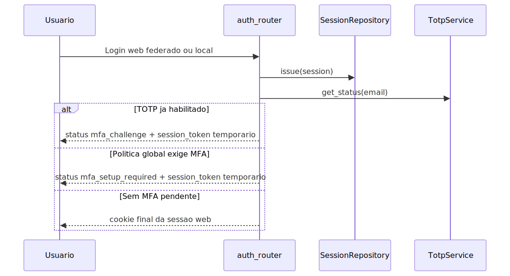

# Autenticação Web e MFA TOTP

Atualizado com base no runtime atual.

## Objetivo

Explicar quando o segundo fator TOTP entra na sessão web, quais rotas do
login humano participam desse fluxo e o que ainda não foi encontrado no
código.

## Visão geral

O MFA TOTP existe como uma etapa complementar da autenticação web. Ele
não substitui o login principal. Primeiro o backend autentica a pessoa,
cria o registro de sessão e descobre o estado TOTP daquela conta. Só
depois decide se pode emitir o cookie final ou se precisa exigir uma
confirmação adicional.

Isso vale para a família de sessão web atual, inclusive quando a sessão
é criada por login federado ou por login local. O segundo fator sempre é
resolvido depois da criação da sessão autenticada e antes da liberação do
cookie final quando a política pede essa verificação.

## Explicação conceitual

O backend centraliza a decisão de MFA na função que monta a resposta da
sessão autenticada. Nessa etapa ele consulta o estado TOTP do usuário e
também a política global de obrigatoriedade. A partir disso, ele escolhe
um de três resultados: sessão pronta, desafio para usuário já ativado ou
onboarding obrigatório para usuário ainda sem TOTP.

## Explicação for dummies

Pense no TOTP como uma segunda trava da porta. O login principal abre a
primeira trava. A segunda só aparece quando o sistema entende que aquela
conta já usa aplicativo autenticador ou quando a empresa configurou que
ninguém pode entrar sem esse passo extra.

Se a pessoa já tem o segundo fator, o sistema pede o código. Se ainda
não tem, o sistema pede a ativação. Se nada disso for exigido, a sessão
segue direto e o navegador recebe o cookie final.

## Leitura relacionada

- Visão geral da autenticação: [README-SISTEMA-AUTENTICACAO.md](./README-SISTEMA-AUTENTICACAO.md)
- Permissões depois do login: [README-AUTORIZACAO.md](./README-AUTORIZACAO.md)
- Boundary HTTP e sessão web: [README-SERVICE-API.md](./README-SERVICE-API.md)
- Índice central da documentação: [README.md](./README.md)

## Onde o TOTP entra no fluxo

## Estados observados na resposta

- ok: sessão final já pode ser usada.
- mfa_challenge: a conta já possui TOTP ativo e precisa informar o
  código antes do cookie final.
- mfa_setup_required: a política global exige MFA e a conta ainda não
  concluiu a ativação.

## Rotas reais envolvidas

- POST /api/auth/federated/session cria sessão web por login federado.
- POST /api/auth/local/session cria sessão web por conta local.
- POST /api/auth/federated/session/totp/start inicia a ativação TOTP.
- POST /api/auth/federated/session/totp/confirm confirma o código e
  libera a sessão final.
- GET /api/auth/federated/session devolve o resumo da sessão ativa.
- POST /api/auth/federated/logout revoga a sessão atual.

## Como o segredo TOTP é tratado

O runtime atual usa duas camadas diferentes:

- cache efêmero para a ativação em andamento;
- persistência cifrada do estado TOTP confirmado no fluxo de auditoria
  federada.

Na prática, isso evita guardar em texto puro o segredo definitivo e
separa o segredo temporário da ativação do estado persistido que será
usado nas verificações futuras.

## Política global de MFA

A exigência global vem da leitura de FEDERATED_MFA_REQUIRED. O efeito
prático é simples: a política manda exigir MFA ou não, mas a resposta
final ainda depende de o usuário já estar ativado ou ainda precisar
fazer onboarding do TOTP.

## Limite de tentativas

Existe um TotpAttemptLimiter com janela, máximo de tentativas e tempo de
bloqueio configuráveis. Mas o runtime atual cria uma nova instância do
limiter e do TotpService a cada chamada.

Consequência prática: o componente existe, porém não foi encontrada uma
persistência compartilhada desse contador entre requisições HTTP
distintas.

## Como validar

1. Faça login web com usuário sem TOTP e com MFA global desligado.
   A resposta deve chegar em estado ok.
2. Faça login com usuário que já tem TOTP ativo.
   A resposta deve vir com mfa_challenge.
3. Ative a política global e use conta sem TOTP.
   A resposta deve vir com mfa_setup_required.
4. Conclua start e confirm do TOTP.
   O cookie final só deve aparecer depois da confirmação válida.

## Evidência no código

- src/api/routers/auth_router.py
- src/api/security/federated_mfa_policy.py
- src/api/security/totp_service.py
- src/api/security/totp_attempt_limiter.py
- src/api/security/totp_activation_cache.py
- src/api/security/federated_login_audit.py
- src/api/middleware/federated_session.py
- src/api/security/federated_session_store.py

## Lacunas no código

Não encontrado no código.

Onde deveria estar:

- recovery codes de uso único para TOTP;
- rota HTTP pública ou fluxo administrativo exposto para desabilitar TOTP
  e revogar o segundo fator;
- persistência compartilhada do contador de tentativas entre requisições
  distintas;
- métricas e observabilidade dedicadas para esse fluxo de MFA.
