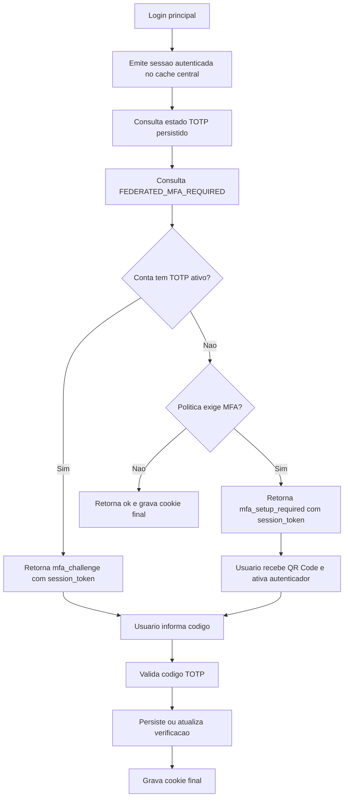
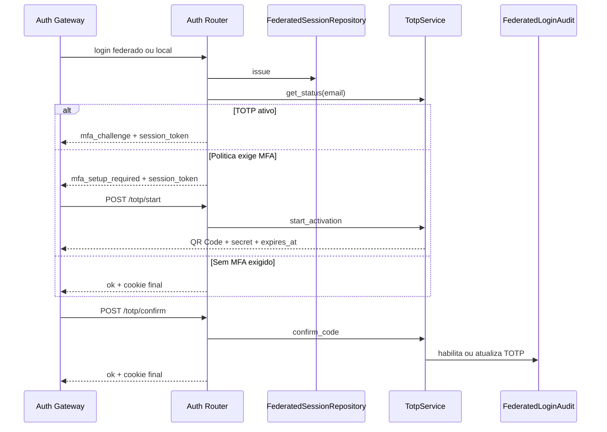

# Manual técnico, executivo, comercial e estratégico: autenticação MFA

## 1. O que é esta feature

A autenticação MFA do produto é a camada de segundo fator aplicada ao login web autenticado. No runtime atual, essa camada é implementada como TOTP, ou seja, código temporário gerado por aplicativo autenticador compatível com padrão otpauth.

Ela não substitui o login principal. Primeiro o sistema autentica a pessoa e cria uma sessão federada ou local. Só depois ele decide se essa sessão já pode receber o cookie final ou se precisa passar por uma etapa adicional de MFA.

Essa distinção é central: o MFA aqui é uma barreira complementar na emissão da sessão web final.

## 2. Que problema ela resolve

O MFA existe para reduzir o risco de comprometimento da conta quando a primeira camada de autenticação, sozinha, não é suficiente.

Sem MFA, o sistema fica mais exposto a cenários como estes.

1. Credencial principal comprometida.
2. Reuso indevido de conta autenticada em navegador não confiável.
3. Acesso privilegiado à interface administrativa com prova única de identidade.
4. Menor resistência operacional contra abuso humano em contas sensíveis.

O papel do TOTP é exigir uma segunda prova de posse antes de liberar a sessão web final.

## 3. Visão executiva

Para liderança, o MFA importa porque reduz risco de acesso indevido ao painel web e melhora governança do acesso humano.

- Reduz impacto de comprometimento da credencial principal.
- Eleva o nível de controle para contas administrativas.
- Cria base mais sólida para auditoria e conformidade.
- Aumenta a confiança operacional no acesso às áreas protegidas.

Em linguagem executiva, o MFA aumenta resiliência do acesso sem obrigar redesign completo da autenticação principal.

## 4. Visão comercial

Comercialmente, o MFA permite posicionar a plataforma como ambiente com proteção adicional de acesso ao painel web.

Isso ajuda a responder dores comuns de cliente.

1. Proteção de acesso administrativo.
2. Mitigação de risco quando a conta principal é comprometida.
3. Aderência maior a práticas de segurança corporativa.
4. Separação entre simples login e acesso realmente liberado.

O que pode ser afirmado com segurança: o produto já implementa MFA TOTP no login web e exige confirmação adicional antes de emitir o cookie final quando a política pede isso.

O que não deve ser prometido: o código lido não confirma recovery codes, desafio por SMS, push approval ou um fluxo público completo de autosserviço para desligar MFA via HTTP.

## 5. Visão estratégica

Estratégicamente, o MFA fortalece a camada de acesso humano e prepara a plataforma para um modelo de governança mais forte da interface administrativa.

Ele é importante por quatro motivos.

1. Mantém a autenticação principal separada da autenticação reforçada.
2. Permite política global sem reescrever o login.
3. Dá persistência auditável do estado TOTP confirmado.
4. Cria base para futuras extensões de segurança sem desmontar a sessão web existente.

## 6. Conceitos necessários para entender

### MFA

MFA significa autenticação multifator. Na prática, é quando o sistema exige mais de uma prova de identidade antes de liberar acesso.

### TOTP

TOTP é um código temporário de curta duração gerado por aplicativo autenticador. O servidor e o aplicativo compartilham um segredo e conseguem calcular o mesmo código no mesmo intervalo de tempo.

### Sessão temporária versus sessão final

No fluxo atual, a autenticação principal pode gerar uma sessão assinada temporária para atravessar o passo de MFA. O cookie final só é emitido quando esse passo termina com sucesso.

### Ativação

A ativação é o momento em que o sistema gera um segredo temporário, apresenta QR Code e espera a confirmação do primeiro código válido.

### Challenge

Challenge é a etapa em que a conta já tem TOTP ativo e o sistema pede apenas o código atual do aplicativo autenticador.

### Política global de MFA

É a decisão central que define se toda conta deve obrigatoriamente passar por MFA, mesmo quando ainda não terminou o onboarding do TOTP.

## 7. Como a feature funciona por dentro

O fluxo real observado no código é este.

1. O usuário faz login federado ou login local.
2. O backend emite um registro de sessão no repositório central de sessões web.
3. Antes de definir a resposta final, o router consulta o estado TOTP persistido daquele e-mail.
4. O router também consulta a política global de obrigatoriedade.
5. Se o usuário já tem TOTP ativo, a resposta volta como mfa_challenge e não emite o cookie final.
6. Se o usuário ainda não tem TOTP ativo, mas a política global exige MFA, a resposta volta como mfa_setup_required e também não emite o cookie final.
7. Se não houver exigência de MFA, a resposta volta como ok e o cookie final é emitido.
8. Quando o cliente entra em setup, a API gera segredo temporário, QR Code e expiração.
9. Quando o cliente confirma o código, o backend valida o TOTP e, se for ativação, persiste o segredo cifrado no banco.
10. Só depois disso o backend assina a sessão e grava o cookie httpOnly final.

## 8. Divisão em etapas ou submódulos

### 8.1. Emissão da sessão autenticada

Esta etapa cria a sessão web usando o repositório central de sessões federadas. O sistema ainda não decidiu se a sessão está liberada para uso final. Ele apenas cria o estado autenticado base.

O valor dessa separação é grande: o login principal continua simples, enquanto o reforço MFA entra depois, sem duplicar toda a lógica de autenticação.

### 8.2. Decisão de política MFA

O router consulta duas coisas.

1. Se o usuário já possui TOTP habilitado.
2. Se a política global exige MFA obrigatório.

Essa etapa é quem decide se a resposta será ok, mfa_challenge ou mfa_setup_required.

### 8.3. Ativação TOTP

Se a conta ainda não possui TOTP ativo e precisa configurá-lo, o sistema gera um segredo Base32, protege esse segredo com criptografia, cria a provisioning_uri e renderiza QR Code em base64 para a UI.

O segredo definitivo ainda não vai direto para o banco. Primeiro ele fica em cache efêmero associado à sessão, com TTL curto.

### 8.4. Confirmação do código

Na confirmação, o backend pode estar em um de dois cenários.

1. Existe ativação pendente no cache efêmero. Nesse caso, o código confirmado habilita o TOTP persistido no banco.
2. O TOTP já está habilitado. Nesse caso, o código apenas valida a segunda etapa do login e atualiza o timestamp de última verificação.

### 8.5. Persistência auditável

O estado TOTP confirmado fica na tabela de auditoria de login federado. O código lido confirma armazenamento de segredo cifrado, flag de habilitação, timestamp de confirmação e timestamp da última verificação bem-sucedida.

### 8.6. Rate limiting de tentativas

O serviço TOTP usa um limitador com janela móvel, teto de tentativas e tempo de bloqueio. Ele consulta se a tentativa está autorizada, registra falha quando necessário e limpa o contador após sucesso.

## 9. Pipeline ou fluxo principal

O fluxo principal de ponta a ponta pode ser lido assim.

1. O usuário envia login por provedor federado ou credencial local.
2. O backend valida a identidade principal.
3. O backend cria a sessão no cache central de sessões web.
4. O backend consulta o estado TOTP do usuário.
5. O backend consulta FEDERATED_MFA_REQUIRED para saber se MFA é obrigatório.
6. Se o usuário já tem TOTP, devolve mfa_challenge com session_token temporário assinado.
7. Se o usuário não tem TOTP e a política obriga, devolve mfa_setup_required com session_token temporário assinado.
8. A UI usa esse session_token para chamar o endpoint de start ou de confirm.
9. No setup, a API devolve QR Code, secret, provisioning_uri, issuer e expires_at.
10. Na confirmação, a API valida o código, persiste ou verifica o TOTP e, em caso de sucesso, grava o cookie final federated_session.

## 10. Como é implementado

No código lido, a implementação é distribuída por responsabilidades bem definidas.

1. Auth router decide o estado final da autenticação e expõe as rotas HTTP.
2. FederatedSessionRepository persiste a sessão temporária e a sessão reutilizável no cache central.
3. TotpService orquestra status, ativação, verificação, persistência e limitador.
4. TotpManager gera segredo, cifra o segredo, monta provisioning_uri e valida códigos.
5. TotpActivationCache segura a ativação pendente com TTL curto.
6. Federated login audit persiste o estado confirmado do TOTP no banco PostgreSQL.
7. Auth gateway na UI renderiza setup, challenge, QR Code, input do código e confirmação.

## 11. Como ligar

No runtime atual, “ligar MFA” tem dois significados diferentes.

### 11.1. Ligar a camada base de autenticação web

Sem a autenticação web ativa, o MFA não entra em cena. O código confirma estes pré-requisitos práticos.

1. settings.web_federated_auth.enabled precisa estar ativo.
2. settings.web_federated_auth.signing_secret precisa existir, porque o fluxo usa token de sessão assinado e cookie final assinado.
3. settings.web_federated_auth.session_ttl_seconds define a vida da sessão web no cache central.
4. O cache central de sessão precisa funcionar via SessionCacheFactory.

### 11.2. Ligar a exigência global de MFA

O código confirma explicitamente que a obrigatoriedade global vem da variável FEDERATED_MFA_REQUIRED.

Quando FEDERATED_MFA_REQUIRED está ativo, o login de uma conta sem TOTP confirmado não recebe sessão final direta. Em vez disso, volta como mfa_setup_required.

### 11.3. Ajustar proteção contra força bruta do TOTP

O router cria o serviço TOTP usando três configurações da camada de settings.

1. settings.totp_attempt_window_seconds.
2. settings.totp_attempt_max_attempts.
3. settings.totp_attempt_block_seconds.

Essas configurações controlam a janela de contagem, o teto de falhas e o bloqueio temporário.

## 12. Como a UI participa

A interface de login web trata MFA como continuação do login, não como tela isolada antes da autenticação principal.

O comportamento observado no código é este.

1. O frontend chama login local ou login federado.
2. Se o backend responder ok, a UI redireciona para a área protegida.
3. Se responder mfa_setup_required, a UI troca o painel de login por uma etapa de ativação TOTP.
4. Se responder mfa_challenge, a UI mostra apenas o campo para o código.
5. A UI chama /api/auth/federated/session/totp/start para obter QR Code e segredo manual.
6. A UI chama /api/auth/federated/session/totp/confirm para validar o código.
7. Após sucesso, a UI redireciona porque o cookie final já foi emitido pelo backend.

## 13. Contratos, entradas e saídas

Os contratos HTTP confirmados no código são estes.

### 13.1. Resposta da sessão autenticada

O backend devolve um payload com status, provider_id, email, email_verified, mfa_required, totp_enabled e, quando necessário, session_token temporário para concluir o MFA.

Os estados confirmados são estes.

1. ok.
2. mfa_challenge.
3. mfa_setup_required.

### 13.2. Início da ativação

O endpoint POST /api/auth/federated/session/totp/start aceita session_token opcional e devolve secret, provisioning_uri, account_label, issuer, qr_code_base64 e expires_at.

### 13.3. Confirmação do código

O endpoint POST /api/auth/federated/session/totp/confirm aceita code e session_token opcional. Em sucesso, devolve a sessão final com status ok e o backend já grava o cookie httpOnly.

## 14. O que acontece em caso de sucesso

Existem dois caminhos felizes.

### 14.1. Usuário já ativado

O login principal devolve mfa_challenge. O usuário informa o código. O backend valida o TOTP persistido, atualiza totp_last_verified_at e emite o cookie final.

### 14.2. Usuário ainda não ativado, mas precisa ativar

O login principal devolve mfa_setup_required. A UI pede o QR Code. O usuário cadastra o segredo no aplicativo autenticador, informa o primeiro código e o backend grava secret_encrypted, totp_enabled, totp_confirmed_at e totp_last_verified_at.

## 15. O que acontece em caso de erro

Os cenários de erro confirmados no código são estes.

### 15.1. TOTP já habilitado

Se o cliente tentar iniciar ativação para conta que já está ativa, a API devolve conflito.

### 15.2. Código inválido

Se o código não bater com o segredo esperado, a API devolve erro de validação e registra falha no limitador.

### 15.3. Ativação expirada

Se o segredo temporário expirar antes da confirmação, a API devolve 410 Gone e a UI pode reiniciar o setup.

### 15.4. Nenhuma ativação pendente ou TOTP não habilitado

Se a confirmação chegar sem ativação pendente e sem TOTP persistido, a API devolve erro de negócio.

### 15.5. Limite de tentativas excedido

Quando o limitador atinge o teto, a API devolve 429 Too Many Requests com Retry-After.

### 15.6. Segredo de assinatura ausente

Sem signing_secret, o sistema não consegue concluir a sessão web e falha fechado.

### 15.7. Auditoria federada indisponível

Se a persistência do estado TOTP no banco falhar, a operação também falha, porque o backend não finge que a conta está protegida sem persistir o segredo confirmado.

## 16. Como o segredo TOTP é tratado

O código mostra uma separação importante entre segredo temporário e segredo persistido.

1. Durante a ativação, o segredo fica em cache efêmero por sessão.
2. Para confirmação real, esse segredo já está cifrado pelo TotpManager.
3. Após confirmação, o valor persistido no banco é secret_encrypted, não o segredo em texto puro.
4. Durante a verificação, o TotpManager descriptografa o segredo apenas para validar o código informado.

Isso reduz o risco de tratar o onboarding do TOTP como simples armazenamento de texto sensível em memória ou banco sem proteção.

## 17. Decisões técnicas e trade-offs

### 17.1. MFA depois da autenticação principal

Ganho: reaproveita a camada de login existente e evita duplicar toda a autenticação.

Custo: exige sessão temporária assinada antes da liberação da sessão final.

### 17.2. Cache efêmero para ativação

Ganho: não persiste secret definitivo sem confirmação do usuário.

Custo: ativações expiram e precisam ser regeneradas quando o usuário demora demais.

### 17.3. Persistência do estado TOTP na auditoria federada

Ganho: há trilha persistida de segredo cifrado, habilitação e últimas verificações.

Custo: o módulo de auditoria vira dependência operacional do MFA.

### 17.4. Limitador em memória do serviço

Ganho: implementação simples e integrada ao fluxo.

Custo: o código lido não confirma persistência compartilhada do contador entre múltiplas requisições distribuídas.

## 18. Vantagens práticas

1. Protege melhor o login web humano.
2. Não exige redesenho do login principal.
3. Suporta challenge para usuário já ativado e setup para usuário novo.
4. Mantém segredo persistido em forma cifrada.
5. Usa cookie final apenas depois da confirmação do segundo fator.
6. Tem bloqueio temporário por excesso de tentativas.

## 19. Observabilidade e diagnóstico

Para diagnosticar MFA corretamente, o operador precisa responder estas perguntas.

1. A autenticação web está ativa e com signing_secret válido?
2. A resposta do login voltou como ok, mfa_challenge ou mfa_setup_required?
3. O session_token temporário foi emitido?
4. A ativação TOTP foi criada ou o segredo temporário expirou?
5. O código falhou por valor inválido, por expiração ou por bloqueio?
6. O estado persistido no banco existe e está com totp_enabled verdadeiro?

O diagnóstico mais importante é este: problema de MFA não é sempre problema do aplicativo autenticador. Pode ser política global, sessão temporária inválida, segredo temporário expirado, signing_secret ausente ou persistência federada indisponível.

## 20. Impacto técnico

Tecnicamente, o MFA reforça o boundary web sem acoplar a verificação de segundo fator diretamente ao provedor de login. Isso mantém a arquitetura mais modular e torna a política de MFA independente do método principal de autenticação.

## 21. Impacto executivo

Executivamente, o MFA reduz risco de acesso administrativo indevido e melhora a narrativa de segurança da plataforma para operações sensíveis.

## 22. Impacto comercial

Comercialmente, o MFA ajuda a sustentar posicionamento de ambiente corporativo mais protegido. Isso é especialmente relevante quando o produto atende clientes com preocupação de governança, auditoria e administração centralizada.

## 23. Impacto estratégico

Estratégicamente, o MFA cria uma base concreta para evoluções futuras em segurança de acesso humano, porque o produto já separa autenticação principal, sessão temporária, segundo fator, persistência auditável e middleware de sessão protegida.

## 24. Exemplos práticos guiados

### 24.1. Conta já protegida por TOTP

Cenário: o usuário já ativou TOTP antes.

O que acontece: o login retorna mfa_challenge com session_token temporário. A UI pede o código atual do autenticador. Após confirmação correta, o cookie final é emitido.

### 24.2. Conta sem TOTP com política global obrigatória

Cenário: o time de segurança ativa FEDERATED_MFA_REQUIRED.

O que acontece: o login não libera sessão final para conta ainda sem TOTP. Em vez disso, responde mfa_setup_required. O usuário precisa escanear QR Code e confirmar o primeiro código válido.

### 24.3. Código errado repetido

Cenário: o usuário insiste em códigos inválidos.

O que acontece: o TotpAttemptLimiter registra falhas até disparar bloqueio temporário e a API responde com Retry-After.

### 24.4. QR Code expirado

Cenário: o usuário demorou demais para confirmar o setup.

O que acontece: o segredo temporário não é mais consumível, a API responde 410 e a UI precisa regenerar a ativação.

## 25. Explicação 101

Pense no login como duas portas.

A primeira porta é a autenticação principal, por Google ou por conta local. A segunda porta é o código temporário do autenticador.

O sistema só entrega a chave final da sala, que é o cookie de sessão web, depois que as duas portas foram abertas quando a política exige isso. Se a pessoa ainda não configurou o autenticador, o sistema primeiro ensina a configurar e só depois libera a entrada.

## 26. Limites e pegadinhas

1. O MFA atual é TOTP, não um catálogo genérico de fatores.
2. O código lido não confirma recovery codes.
3. O código lido não confirma rota pública de disable TOTP, embora a lógica de desabilitação exista no serviço e na persistência.
4. O limitador de tentativas existe, mas o código lido não confirma estado compartilhado entre processos diferentes.
5. A política global de MFA depende de FEDERATED_MFA_REQUIRED e não de um YAML por tenant.
6. Sem signing_secret, o fluxo de MFA não chega ao fim porque não há token de sessão assinado válido.

## 27. Troubleshooting

### 27.1. O login nunca pede MFA

Sintoma: toda resposta chega como ok.

Causas prováveis: FEDERATED_MFA_REQUIRED desligado e usuário sem TOTP ativo, ou autenticação web desabilitada.

Como confirmar: revisar o status retornado pela criação da sessão e o valor efetivo da política global.

### 27.2. O usuário já ativou TOTP, mas o sistema pede setup de novo

Sintoma: retorna mfa_setup_required em vez de mfa_challenge.

Causa provável: estado TOTP persistido não está habilitado, não existe ou falhou ao ser consultado.

Como confirmar: revisar get_totp_state e a tabela de auditoria federada.

### 27.3. O QR Code é gerado, mas a confirmação sempre falha

Sintoma: códigos sempre voltam inválidos.

Causas prováveis: segredo temporário expirado, problema de horário no autenticador, código digitado com formato incorreto ou falha na criptografia/descriptografia do segredo.

Como confirmar: revisar expiração, erro retornado pelo confirm e os logs do TotpManager.

### 27.4. O usuário recebe bloqueio muito cedo

Sintoma: 429 antes do esperado.

Causa provável: configuração agressiva de janela, máximo de tentativas ou bloqueio.

Como confirmar: revisar settings.totp_attempt_window_seconds, settings.totp_attempt_max_attempts e settings.totp_attempt_block_seconds.

### 27.5. O login falha ao concluir mesmo com código correto

Sintoma: o TOTP valida, mas a sessão final não fecha.

Causas prováveis: signing_secret ausente, repositório de sessão indisponível ou falha na persistência de auditoria.

Como confirmar: revisar os pontos de emissão do cookie final e os erros de infraestrutura do repositório ou da auditoria.

## 28. Diagramas

Esse diagrama mostra a decisão central do runtime: o login principal não entrega necessariamente a sessão final. O MFA intercepta a emissão do cookie quando o estado do usuário ou a política global exigem isso.

Esse diagrama mostra a ordem real de interação entre UI, router, sessão, serviço TOTP e persistência auditável.

## 29. Mapa de navegação conceitual

O tema MFA pode ser navegado assim.

1. Boundary HTTP: auth_router.
2. Política global: federated_mfa_policy.
3. Sessão web: federated_session_store e middleware federated_session.
4. Serviço de orquestração: totp_service.
5. Motor criptográfico e TOTP: totp_manager.
6. Estado efêmero de setup: totp_activation_cache.
7. Proteção contra repetição de erro: totp_attempt_limiter.
8. Persistência auditável: federated_login_audit.
9. UI de login: auth-gateway.js.

## 30. Como colocar para funcionar

O caminho confirmado no código é este.

1. Ativar a autenticação web em settings.web_federated_auth.enabled.
2. Definir settings.web_federated_auth.signing_secret.
3. Garantir o backend do cache central de sessão via SessionCacheFactory.
4. Garantir a auditoria federada configurada, porque o estado TOTP confirmado depende dela.
5. Ativar FEDERATED_MFA_REQUIRED quando a empresa quiser exigir MFA para todas as contas web.
6. Ajustar os parâmetros do limitador TOTP na camada de settings.

## 31. Exercícios guiados

### Exercício 1

Objetivo: entender a diferença entre challenge e setup.

Passos: compare os estados mfa_challenge e mfa_setup_required retornados pelo backend.

Resposta esperada: challenge é para conta já ativada; setup é para conta que ainda precisa ativar o TOTP.

### Exercício 2

Objetivo: entender como “ligar” MFA globalmente.

Passos: observe que a decisão de obrigatoriedade não está no YAML do tenant, e sim em FEDERATED_MFA_REQUIRED.

Resposta esperada: o backend avalia a política global no momento de montar a resposta da sessão.

### Exercício 3

Objetivo: entender por que o cookie final não sai antes da confirmação.

Passos: observe que o router só grava o cookie final quando o estado final é ok.

Resposta esperada: durante setup ou challenge, o cliente recebe session_token temporário, não a sessão web final.

## 32. Checklist de entendimento

- Entendi que o MFA atual é TOTP na autenticação web.
- Entendi que o MFA entra depois da autenticação principal.
- Entendi que o backend pode responder ok, mfa_challenge ou mfa_setup_required.
- Entendi que FEDERATED_MFA_REQUIRED controla a obrigatoriedade global.
- Entendi que o segredo temporário de ativação fica em cache efêmero.
- Entendi que o segredo confirmado é persistido de forma cifrada.
- Entendi que o cookie final só é emitido após sucesso do MFA.
- Entendi que existe limitador de tentativas configurável.
- Entendi que a UI participa do setup e do challenge.
- Entendi quais limitações ainda não estão confirmadas no código.

## 33. Evidências no código

- src/api/routers/auth_router.py
  - Motivo da leitura: confirmar a decisão de MFA durante a emissão da sessão, os estados ok, mfa_challenge e mfa_setup_required, e as rotas de start e confirm.
  - Comportamento confirmado: o cookie final só é emitido quando a sessão chega a ok.

- src/api/security/federated_mfa_policy.py
  - Motivo da leitura: confirmar como a obrigatoriedade global é ligada.
  - Comportamento confirmado: a política é controlada por FEDERATED_MFA_REQUIRED.

- src/api/security/totp_service.py
  - Motivo da leitura: confirmar a orquestração do fluxo TOTP.
  - Comportamento confirmado: status, setup, confirm, persistência, disable lógico e integração com limitador.

- src/api/security/totp_manager.py
  - Motivo da leitura: confirmar a técnica do TOTP.
  - Comportamento confirmado: geração Base32, criptografia do segredo, provisioning_uri, QR code e validação do código.

- src/api/security/totp_attempt_limiter.py
  - Motivo da leitura: confirmar proteção contra múltiplas falhas.
  - Comportamento confirmado: janela, teto de tentativas, bloqueio e reset após sucesso.

- src/api/security/totp_activation_cache.py
  - Motivo da leitura: confirmar onde o segredo temporário fica durante o onboarding.
  - Comportamento confirmado: cache efêmero por sessão com TTL.

- src/api/security/federated_login_audit.py
  - Motivo da leitura: confirmar persistência do estado TOTP.
  - Comportamento confirmado: colunas de segredo cifrado, enabled, confirmed_at e last_verified_at, além de funções de enable, update e disable.

- src/api/security/federated_session_store.py
  - Motivo da leitura: confirmar a sessão web central usada antes e depois do MFA.
  - Comportamento confirmado: emissão, save, load, revoke e persistência no cache central de sessão.

- src/api/middleware/federated_session.py
  - Motivo da leitura: confirmar como a sessão final protege páginas HTML.
  - Comportamento confirmado: middleware carrega cookie assinado, resolve a sessão e redireciona para o gateway quando necessário.

- src/config/settings.py
  - Motivo da leitura: confirmar os campos da camada de settings usados pelo fluxo.
  - Comportamento confirmado: web_federated_auth e parâmetros do limitador TOTP.

- app/ui/static/js/auth-gateway.js
  - Motivo da leitura: confirmar a UX real de setup e challenge.
  - Comportamento confirmado: a UI trata mfa_setup_required, mfa_challenge, renderiza QR Code, chama start e confirm e redireciona após sucesso.
