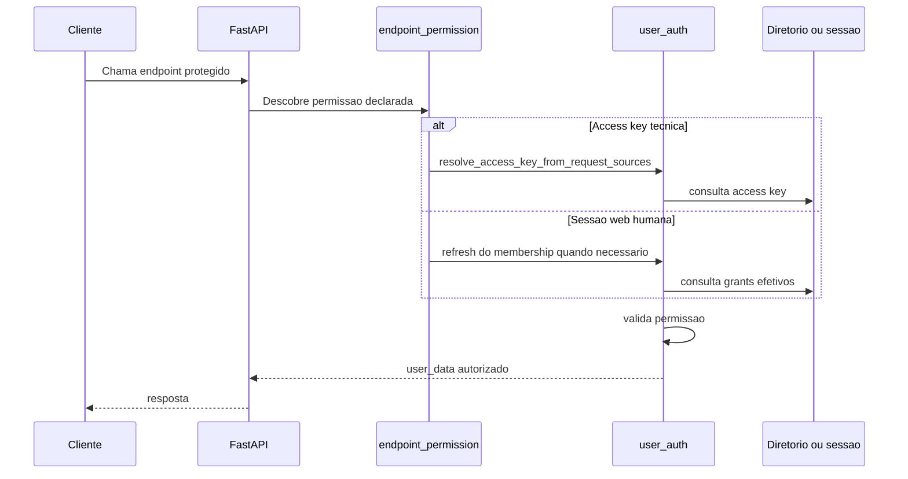

# Autorização da Plataforma

Atualizado com base no runtime atual.

## Objetivo

Explicar como a plataforma decide quem pode executar cada rota HTTP e
como o mesmo catálogo de permissões atende chamadas técnicas e sessões
web humanas.

## Visão geral

A autorização atual usa um catálogo central de permissões e um modelo de
principal canônico. Isso evita que a área web tenha um sistema paralelo
de grants diferente do usado pelas access keys técnicas.

Na prática, o backend avalia qual principal está tentando acessar a rota,
descobre qual permissão aquela rota declarou e então aplica a validação
com base no catálogo central. O mesmo desenho cobre credencial técnica,
membership humano e, em nível de contrato, um principal reservado para
canal.

## Explicação conceitual

O catálogo central mora em permissions.py e define nomes, público-alvo,
precedência e grants base por papel humano. O vínculo entre rota e
permissão nasce no decorador endpoint_permission. A execução da checagem
fica concentrada em enforce_endpoint_permission e require_permission,
dependendo da trilha HTTP usada pelo endpoint.

## Explicação for dummies

Pense na autorização como uma lista de portas internas do prédio. A
autenticação descobre quem entrou. A autorização decide quais portas
internas aquela pessoa ou integração pode abrir.

Cada porta tem uma etiqueta. Essa etiqueta é a permissão da rota. O
sistema compara a etiqueta da porta com o crachá que a sessão ou a chave
carrega. Se bater, entra. Se não bater, a resposta é bloqueada mesmo que
o login tenha dado certo.

## Leitura relacionada

- Como a identidade é montada: [README-SISTEMA-AUTENTICACAO.md](./README-SISTEMA-AUTENTICACAO.md)
- Segundo fator na sessão web: [README-AUTENTICACAO-MFA.md](./README-AUTENTICACAO-MFA.md)
- Boundary HTTP que aplica permissão por endpoint: [README-SERVICE-API.md](./README-SERVICE-API.md)
- Índice central da documentação: [README.md](./README.md)

## Tipos de principal encontrados no catálogo

- machine_credential para access key técnica.
- user_account_membership para sessão web humana vinculada a
  tenant_users.
- channel_end_user como tipo reservado no contrato, ainda sem a mesma
  governança completa encontrada nos dois tipos anteriores.

## Fluxo real de autorização

## Ordem de precedência aplicada

O backend define esta ordem canônica:

1. superadmin
2. explicit_deny
3. explicit_allow
4. role_base
5. default_deny

Traduzindo isso para o dia a dia: uma negação explícita vence o papel
base, uma permissão explícita amplia o papel quando não houver negação e,
se nada conceder acesso, o padrão final é negar.

## Papéis humanos e grants base

Os papéis humanos encontrados hoje são:

- owner
- admin
- billing_manager
- member

Resumo prático do catálogo atual:

- owner herda o conjunto mais amplo de permissões administrativas;
- admin herda um conjunto operacional grande, porém menor que owner;
- billing_manager existe no contrato, mas não recebe grants base
  administrativos por padrão;
- member não herda grants administrativos por default.

## Como a rota declara a permissão

O contrato protegido nasce de duas peças juntas:

- endpoint_permission anexa a permissão ao endpoint;
- enforce_endpoint_permission ou require_permission executa a checagem.

Isso importa porque a fonte de verdade da permissão não é um texto solto
na documentação. Ela está no código da própria rota e pode ser coletada
de forma centralizada pelo registro de permissões.

## Governança humana já exposta no runtime

O router de autenticação web já expõe governança humana autenticada para
o painel administrativo.

Hoje o código já mostra:

- catálogo de permissões para a UI em /api/auth/admin/permission-catalog;
- listagem de memberships em /api/auth/admin/memberships;
- convite administrativo de membership;
- revogação de membership;
- leitura e atualização da governança de grants explícitos.

## Refresh da sessão humana

Antes de autorizar operações sensíveis, o backend pode reler o contexto
do membership e atualizar effective_permissions e membership_role.

Impacto prático: revogar grants ou trocar o papel de um usuário pode
refletir em novas chamadas sem depender de um login completo do zero.

## Como validar

1. Chame um endpoint protegido com access key válida.
   A rota deve passar sem 401 e sem 403.
2. Faça login web e consulte a sessão autenticada.
   O payload deve refletir membership_role e effective_permissions.
3. Altere grants humanos no painel administrativo.
   A nova chamada deve refletir o refresh do snapshot humano.

## Evidência no código

- src/api/security/permissions.py
- src/api/security/permission_registry.py
- src/api/security/user_auth.py
- src/api/security/federated_session_store.py
- src/api/routers/auth_router.py
- src/api/routers/admin/users_router.py

## Lacunas no código

Não encontrado no código.

Onde deveria estar:

- uma governança completa para channel_end_user no mesmo nível dos
  principais humano e técnico;
- um artefato externo gerado automaticamente que inventarie permissões
  por endpoint a partir do registro central.
