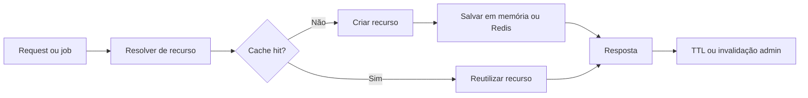

# Caching da Plataforma

Atualizado com base no runtime atual.

## Objetivo

Explicar quais famílias de cache realmente aparecem no código, quando o
backend usa memória local ou Redis e como a invalidação administrativa
entra no fluxo sem exigir adivinhação por nome de componente.

## Visão geral

O projeto não usa um cache único. Ele combina pool quente em memória,
Redis para compartilhamento entre processos e um cache polimórfico de
sessão que pode cair em arquivo ou memória quando Redis não está
disponível.

Em termos práticos, isso significa que alguns caches só aceleram o mesmo
processo, enquanto outros ajudam API, worker e rotinas distribuídas.
Também significa que invalidar o cache certo depende de saber se o dado
é local, compartilhado ou apenas efêmero.

## Explicação conceitual

O centro do desenho atual está em resource_pool.py. Esse módulo reúne
TTLCache local, cache de YAML em Redis com fallback em memória e vários
invalidadores para grupos como LLM, vector store, tools dinâmicas, YAML,
engines de banco e itens genéricos.

Ao redor dele, existem famílias especializadas. A sessão web humana usa
SessionCacheFactory, o onboarding TOTP reutiliza esse mesmo backend para
segredo temporário e o domínio administrativo expõe operações de limpeza
e inspeção por AdminCacheService.

## Explicação for dummies

Pense no cache como uma mesa de apoio. Em vez de ir ao depósito toda vez,
o sistema deixa na mesa o que usa com frequência. Algumas mesas ficam ao
lado do mesmo processo. Outras ficam num lugar compartilhado, como o
Redis, para vários processos aproveitarem.

Se você limpar a mesa errada, pode não resolver nada. Se limpar tudo sem
critério, pode derrubar desempenho de mais de um fluxo ao mesmo tempo.

## Fluxo resumido

## Famílias principais encontradas no runtime

### Pool quente de recursos

resource_pool.py concentra reaproveitamento de:

- LLMs;
- vector stores;
- tools dinâmicas;
- engines de banco;
- YAML e artefatos derivados;
- itens genéricos com TTL.

### Chaves canônicas

CacheKeyRegistry padroniza chaves determinísticas por ambiente e tenant.
Isso evita colisão entre clientes e reduz risco de reaproveitar tool ou
artefato montado com configuração diferente.

### Sessão web e TOTP

SessionCacheFactory tenta Redis primeiro. Se não conseguir, pode usar
arquivo de sessão e depois memória local. O cache temporário de ativação
TOTP reutiliza essa mesma base.

Consequência prática: o segredo temporário do TOTP é efêmero e não deve
ser tratado como persistência definitiva do segundo fator.

### RAG e runtime agentic

O runtime também reaproveita cache em embeddings, BM25, pipelines RAG,
tools dinâmicas e MCP por tenant. O detalhe importante aqui não é uma
lista infinita de componentes, mas o padrão: chaves previsíveis,
reaproveitamento por tenant e invalidação específica quando possível.

## Invalidação administrativa

A API já expõe operações administrativas para limpar grupos importantes
de cache.

Na prática, o código já mostra operações para:

- limpar tudo;
- flush de Redis;
- invalidar LLM;
- invalidar tools dinâmicas;
- invalidar YAML;
- invalidar engines de banco;
- invalidar cache genérico;
- invalidar vector store;
- resetar cache BM25;
- inspecionar memória e estatísticas.

Regra prática: prefira invalidadores específicos antes de usar limpeza
total ou flush global do Redis.

## Como validar

1. Faça duas chamadas equivalentes para o mesmo tenant.
  O segundo uso deve mostrar reaproveitamento do recurso quente.
2. Gere um recurso cacheado e chame o invalidator administrativo.
  A próxima execução deve reconstruir o recurso.
3. Crie uma sessão web e depois consulte a sessão em nova requisição.
  O backend deve reler o cache da sessão.
4. No fluxo TOTP, confirme que o segredo temporário some após consumo ou
  expiração.

## Evidência no código

- src/core/resource_pool.py
- src/core/cache_key_registry.py
- src/core/cache/redis/redis_manager.py
- src/security/session_cache.py
- src/api/security/federated_session_store.py
- src/api/security/totp_activation_cache.py
- src/api/routers/admin/cache_router.py
- src/api/services/admin/cache_service.py

## Lacunas no código

Não encontrado no código.

Onde deveria estar:

- um inventário administrativo único listando todas as famílias de cache
  ativas, TTL efetivo e estatísticas por namespace;
- persistência compartilhada do limitador de tentativas TOTP;
- uma política central única de TTL para todas as famílias de cache.
