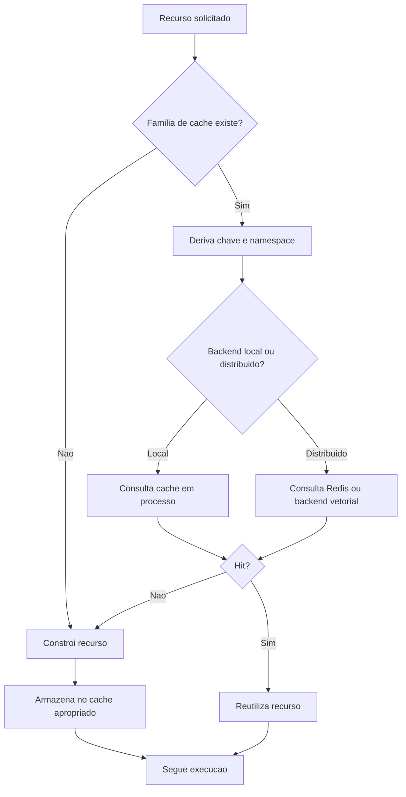
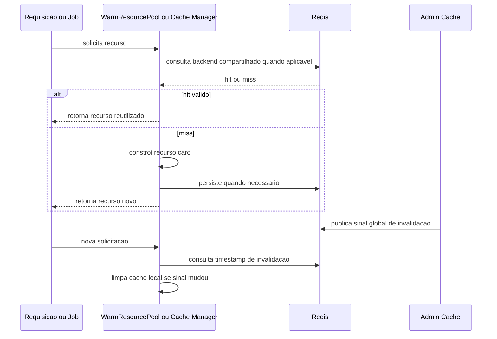

# Manual técnico, executivo, comercial e estratégico: caching da plataforma

## 1. O que é esta feature

Caching, nesta plataforma, não é um componente único. É um conjunto de mecanismos de reaproveitamento de estado, artefatos e resultados caros para reduzir latência, evitar recomputação desnecessária e proteger integrações pesadas, como Redis, bancos, vector stores, modelos de linguagem e montagem de pipelines.

O código lido mostra que a plataforma usa múltiplas famílias de cache, cada uma com papel diferente.

1. Cache quente em memória do processo para recursos caros de montar.
2. Cache Redis compartilhado quando o reaproveitamento precisa sobreviver ao processo atual.
3. Cache especializado para RAG, embeddings, BM25 e retrieval semântico.
4. Cache efêmero de sessão e segurança para fluxos web e TOTP.
5. Cache agentic e administrativo para catálogo de tools, supervisores e limpeza seletiva.
6. Microcaches locais em módulos específicos para evitar consultas repetidas dentro de uma mesma execução ou serviço.

## 2. Que problema ela resolve

Sem caching, a plataforma sofreria em seis frentes operacionais.

1. Recriação repetida de LLM, vector store e engines SQL.
2. Reparse e recarga desnecessária de YAMLs iguais.
3. Recomputação de embeddings já vistos.
4. Rebuild desnecessário de pipelines de RAG e vocabulários BM25.
5. Sessões web e segredos temporários obrigando persistência mais pesada ou roundtrips extras.
6. Maior pressão sobre Redis, banco, busca vetorial e provedores externos.

O papel do caching aqui não é apenas acelerar. Ele também reduz custo operacional, ruído de observabilidade e risco de sobrecarga em componentes caros.

## 3. Visão executiva

Para liderança, caching importa porque reduz custo marginal de operação por requisição e melhora previsibilidade de tempo de resposta.

- Menos recomputação significa menor consumo de infraestrutura.
- Menos reconstrução de recursos caros significa menor latência média.
- Menos acessos redundantes a Redis, banco e provedores externos significa menor risco de saturação.
- Invalidação administrativa seletiva significa menor risco operacional do que limpar tudo sem critério.

Em linguagem executiva, a estratégia de cache transforma capacidade computacional em capacidade operacional mais estável.

## 4. Visão comercial

Comercialmente, o valor não é vender “um cache”. O valor é demonstrar que a plataforma consegue atender cenários de uso repetitivo com mais velocidade e mais estabilidade sem exigir reengenharia a cada tenant.

Isso ajuda em quatro conversas com cliente.

1. Escalabilidade de uso recorrente.
2. Resposta mais previsível em consultas semelhantes.
3. Menor risco de degradação por pico operacional.
4. Administração controlada de limpeza e invalidação sem reset bruto do sistema inteiro.

O que pode ser prometido com segurança: a plataforma foi desenhada para reaproveitar recursos e resultados em várias camadas.

O que não deve ser prometido: cache não elimina custo em toda primeira execução, não substitui capacidade de infraestrutura e não corrige configuração ruim ou retrieval fraco.

## 5. Visão estratégica

Estratégicamente, caching fortalece a plataforma em cinco dimensões.

1. Permite reuso de recursos transversais por tenant e por ambiente.
2. Separa caches locais, distribuídos e semânticos de acordo com o problema real.
3. Dá governança operacional via admin e via sinal global de invalidação.
4. Prepara o produto para múltiplos processos e múltiplos serviços sem depender só de memória local.
5. Melhora a viabilidade de arquitetura YAML-first, RAG e agentic com menos recomposição redundante.

## 6. Conceitos necessários para entender

### Cache quente em processo

É o cache que vive dentro do processo atual. Ele é rápido, mas não é compartilhado automaticamente com outros workers ou pods.

### Cache distribuído

É o cache que usa Redis como backend compartilhado. Ele permite reuso entre processos diferentes e melhora cenários distribuídos.

### TTL

TTL é o tempo máximo de vida de uma entrada. Quando o TTL expira, o dado deixa de ser considerado reutilizável.

### Invalidação seletiva

É a remoção só da família certa de cache, em vez de apagar tudo. Isso reduz impacto colateral.

### Invalidação global

É um sinal compartilhado, publicado em Redis, que avisa outros caches quentes de processo que eles precisam se considerar obsoletos.

### Namespace por tenant e ambiente

É o uso de prefixos e hashes para evitar colisão entre clientes, ambientes e configurações semanticamente diferentes.

### Cache semântico

É o cache que tenta reaproveitar respostas ou resultados por semelhança semântica de consulta, e não apenas por igualdade literal de texto.

### Cache efêmero de sessão

É um cache de curta duração para estado temporário, como chaves privadas de sessão ou segredos TOTP durante ativação.

## 7. Como a estratégia de caching funciona por dentro

O desenho observado no código segue um princípio simples: cada tipo de dado recebe a estratégia de cache compatível com seu custo e sua semântica.

1. Recursos pesados de montar ficam em memória local do processo no WarmResourcePool.
2. Resultados que precisam ser compartilhados entre processos usam Redis.
3. Pipelines e montagem de RAG usam cache próprio com métricas, hits, misses e invalidação global.
4. Segurança usa cache efêmero com backends intercambiáveis, priorizando Redis e caindo para arquivo ou memória.
5. O admin opera invalidação seletiva e também publica um sinal global para forçar outros caches locais a se atualizarem.

Esse desenho evita dois extremos ruins.

1. Colocar tudo em memória local e perder coerência distribuída.
2. Colocar tudo em Redis e pagar custo de rede até para reaproveitamento estritamente local.

## 8. Quais caches a plataforma possui

O código confirma famílias canônicas de cache de plataforma e também microcaches locais. As famílias abaixo são as mais fortes porque aparecem como abstrações reutilizadas, capacidades administrativas ou peças centrais do runtime.

### 8.1. WarmResourcePool

O WarmResourcePool é o núcleo do cache quente em processo.

Ele mantém, por processo, as seguintes famílias.

1. LLMs.
2. Vector stores.
3. Tools dinâmicas.
4. Engines SQL.
5. Configurações YAML parseadas.
6. Caches de LLM associados ao backend LangChain.
7. Cache genérico com TTL opcional.

Ele também consulta o sinal global de invalidação antes de reutilizar recursos e limpa seu estado quando detecta uma invalidação mais nova.

### 8.2. Cache global de YAML

O cache de YAML evita repetir parsing e reconstrução do mesmo conteúdo. O código usa hash do conteúdo YAML como identidade de reaproveitamento.

Esse detalhe importa porque o cache não é baseado apenas no caminho do arquivo. Se o conteúdo muda, a identidade muda.

### 8.3. Cache de LLM

Além do reaproveitamento do próprio objeto LLM no pool quente, o sistema também pode ligar um cache de respostas do LLM via backend Redis com namespace por tenant.

O código mostra três ideias importantes.

1. O cache de LLM pode ser desligado por configuração.
2. O namespace é isolado por tenant.
3. O wrapper ObservedCache registra hits, misses e limpeza, melhorando rastreabilidade.

### 8.4. Cache de vector store

Vector stores são recursos caros de montar e por isso são mantidos quentes por tenant, tipo e identidade canônica do alvo vetorial.

Esse cache reduz custo de reconstrução de factories e conexão com backends vetoriais.

### 8.5. Cache de tools dinâmicas

Tools dinâmicas, como tool SQL dinâmica e tool API dinâmica, reaproveitam chave determinística calculada com apoio do CacheKeyRegistry. O objetivo é garantir que a mesma tool configurada para o mesmo contexto não seja reconstruída sem necessidade.

### 8.6. Cache de engines SQL

Engines SQL ficam em cache no pool quente para reaproveitar pooling do SQLAlchemy e evitar reconstrução de engine a cada uso.

Esse cache é especialmente importante porque engine não é apenas um objeto. Ela própria já mantém pool interno de conexões.

### 8.7. Cache genérico

O WarmResourcePool também mantém um cache genérico com TTL opcional, usado para reaproveitamentos locais que não justificam uma abstração especializada.

Esse cache é importante para operação porque o admin consegue inspecioná-lo e invalidá-lo por prefixo.

### 8.8. Cache de pipelines de RAG

O PipelineCacheManager mantém instâncias de ContentQASystem por hash canônico do YAML. Ele registra hits, misses, stores e evictions, purga expirados e aplica o sinal global de invalidação.

Na prática, ele evita remontar pipeline inteiro quando o contrato YAML efetivo continua o mesmo.

### 8.9. Cache Redis de embeddings

O RedisCachedEmbeddings encapsula o backend de embeddings e tenta recuperar vetores já calculados antes de recomputar. Ele faz isso por hash do texto e namespace configurado.

Isso é valioso porque embeddings são uma das partes mais caras de pipelines de RAG e indexação.

### 8.10. Cache semântico de retrieval

O SemanticQueryCache é um cache especializado para reaproveitar resultados de retrieval por similaridade semântica. Ele pode operar com backends diferentes, incluindo Redis com RediSearch, Qdrant e Azure Search.

Esse ponto é central para entender a arquitetura: a plataforma não trata todo cache de RAG como igualdade literal. Para retrieval, ela também suporta reaproveitamento por proximidade semântica.

### 8.11. Cache BM25

O runtime BM25 mantém cache Redis para payloads do índice e do vocabulário BM25. O código registra flag de habilitação, TTL normalizado, hits, misses, store e invalidação.

Esse cache existe para evitar reconstruir artefatos lexicais pesados sempre que o mesmo alvo BM25 já foi preparado.

### 8.12. Cache de sessão web

O SessionCacheFactory escolhe backend para chaves efêmeras de sessão.

A ordem prática é esta.

1. Tenta Redis quando Redis está habilitado e acessível.
2. Se Redis não puder ser usado, tenta arquivo em diretório configurável.
3. Se isso também falhar, cai para memória local.

Esse cache é importante porque permite operar tanto em ambiente simples quanto em ambiente distribuído.

### 8.13. Cache de ativação TOTP

O TotpActivationCache usa a camada de sessão para guardar, com TTL, o segredo temporário necessário à ativação do TOTP.

Esse é um cache de segurança efêmero, não uma persistência definitiva do segundo fator.

### 8.14. Cache de CredentialManager

O CredentialManagerCache mantém instâncias reaproveitáveis do gerenciador de credenciais por tenant, correlation_id, digest de security_keys e identidade do objeto YAML.

Ele existe para reduzir custo de reconstrução da camada que resolve segredos e credenciais operacionais.

### 8.15. Cache de ToolsFactory do supervisor

No domínio agentic, o supervisor usa um cache compartilhado de ToolsFactory por hash do YAML e IDs de tools. Esse cache é global por processo, usa TTL e respeita invalidação global.

### 8.16. Microcaches locais confirmados

Além das famílias canônicas, o código mostra microcaches locais em módulos específicos. Eles não formam, por si só, uma capacidade central de plataforma, mas existem e importam.

1. Cache em memória de perfil de tenant no onboarding WhatsApp.
2. Cache de sessão para verificação de duplicação na ingestão.
3. Cache local de vector store no gerenciador de persistência documental.

Esses microcaches seguem a mesma lógica geral: evitar lookups repetidos no mesmo contexto de execução.

## 9. Como as chaves de cache são organizadas

O CacheKeyRegistry centraliza a construção de chaves determinísticas. Isso reduz colisão e evita reaproveitamento de artefato incompatível.

Os princípios confirmados no código são estes.

1. Prefixo por ambiente.
2. Hash canônico do YAML quando o contrato do tenant importa.
3. Assinatura determinística para tools dinâmicas e payloads relacionados.
4. Sanitização de campos sensíveis antes do hashing.

Na prática, isso significa que cache não é só guardar valor. É garantir que a identidade do valor reutilizado faz sentido no contexto certo.

## 10. Pipeline ou fluxo principal

O fluxo macro do caching na plataforma pode ser lido assim.

1. O runtime recebe uma requisição ou uma necessidade interna de recurso.
2. Antes de montar o recurso, consulta o cache especializado correspondente.
3. Se houver hit válido, reaproveita o artefato.
4. Se houver miss, constrói o recurso caro.
5. Após construir, persiste no cache certo com TTL ou política apropriada.
6. Em operação administrativa, um endpoint pode invalidar seletivamente a família necessária.
7. Quando a limpeza precisa propagar coerência, o admin publica sinal global de invalidação em Redis.
8. Nos próximos acessos, caches locais detectam esse sinal e se limpam.

## 11. Divisão por etapas ou submódulos

### 11.1. Identidade e namespace

Esta etapa define a chave correta. Sem identidade correta, cache vira fonte de bug, não de performance.

O sistema usa ambiente, tenant, hash canônico e assinatura do artefato para decidir quando algo pode ser reaproveitado com segurança.

### 11.2. Reaproveitamento local

Aqui entram WarmResourcePool, caches LRU e caches de dicionário em processo. Eles são rápidos e baratos, mas valem principalmente dentro do mesmo processo.

### 11.3. Reaproveitamento distribuído

Aqui entram RedisSessionCache, RedisCachedEmbeddings, cache BM25 e caminhos Redis do cache semântico. Eles existem quando o sistema quer compartilhar reaproveitamento entre processos.

### 11.4. Reaproveitamento semântico

Aqui o objetivo deixa de ser só igualdade literal. O cache semântico tenta reaproveitar retrieval por proximidade vetorial da consulta.

### 11.5. Governança e limpeza

Esta etapa é crucial. A plataforma não só cria cache; ela também expõe endpoints para limpar famílias específicas e propaga sinal global de invalidação quando necessário.

## 12. Decisões técnicas e trade-offs

### 12.1. Misturar memória local com Redis

Ganho: reduz latência para reaproveitamento estritamente local e permite compartilhamento quando isso é necessário.

Custo: o sistema precisa distinguir bem o que pode ficar só em memória e o que deve ser compartilhado.

### 12.2. Usar invalidação seletiva antes de flush global

Ganho: menor impacto operacional e menor risco de derrubar desempenho de tudo ao mesmo tempo.

Custo: operação precisa entender qual família limpar.

### 12.3. Usar hash canônico do YAML

Ganho: reaproveitamento coerente por contrato efetivo, e não apenas por nome de arquivo ou ponteiro solto.

Custo: exige cuidado com sanitização e cálculo estável.

### 12.4. Ter cache semântico separado

Ganho: consultas semanticamente equivalentes podem reaproveitar retrieval caro.

Custo: exige backend vetorial adequado e pode introduzir risco de falso reaproveitamento se o threshold for mal configurado.

### 12.5. Fazer fallback de sessão para arquivo ou memória

Ganho: o sistema continua operável sem Redis em ambiente simples.

Custo: em cenário distribuído, fallback local perde semântica de compartilhamento.

## 13. Configurações que mudam o comportamento

O código confirma algumas superfícies explícitas de configuração de cache.

### 13.1. Cache de LLM

O bloco llm.cache controla se o cache de resposta do modelo está habilitado. O código também consome parâmetros de Redis, namespace, TTL e decisão de usar RedisManager ou URL direta.

### 13.2. Cache semântico

O SemanticQueryCache consome configuração de habilitação, distance_threshold, ttl_seconds, max_items e backend. Os backends confirmados no código são Redis com RediSearch, Qdrant e Azure Search.

### 13.3. Cache BM25

O runtime BM25 lê enabled, ttl_seconds e key_prefix, normaliza o TTL e decide se o cache Redis pode ficar ativo.

### 13.4. Cache de sessão

O SessionCacheFactory lê a disponibilidade real do Redis e usa a variável de ambiente SESSION_CACHE_DIR para o backend em arquivo.

### 13.5. TTL padrão do pool quente

Vários caches centrais usam DEFAULT_TTL_SECONDS igual a 900 segundos como base. Esse valor aparece como padrão em WarmResourcePool, PipelineCacheManager e supervisor cache.

Importante: o código não mostra uma política única e centralizada de TTL para todas as famílias. Cada família pode ter sua própria regra.

## 14. Contratos, entradas e saídas

No plano operacional, os principais contratos expostos pela API administrativa são estes.

1. Limpar tudo em memória administrativa.
2. Executar flush do Redis.
3. Resetar cache de CredentialManager.
4. Resetar cache BM25.
5. Invalidar cache de LLM.
6. Invalidar cache de vector store.
7. Invalidar cache de tools dinâmicas.
8. Invalidar cache de YAML.
9. Invalidar cache de engines SQL.
10. Invalidar cache genérico por prefixo.
11. Consultar estatísticas consolidadas de memória e Redis.

## 15. O que acontece em caso de sucesso

No caminho feliz, o cache reduz trabalho real.

1. Um recurso é solicitado.
2. A chave correta é derivada.
3. O backend certo é consultado.
4. O sistema encontra a entrada válida.
5. O recurso é reutilizado.
6. Logs e métricas registram hit, reuso ou reaproveitamento.

Do ponto de vista do usuário, isso aparece como menor latência. Do ponto de vista da operação, aparece como menos reconstruções e menos pressão sobre componentes caros.

## 16. O que acontece em caso de erro

Os principais cenários de falha confirmados no código são estes.

### 16.1. Redis indisponível

O sistema não consegue usar o backend distribuído. Dependendo da família, ele faz fallback seguro ou desabilita o cache.

### 16.2. TTL inválido

O sistema normaliza ou ignora valores inválidos e registra warning quando necessário.

### 16.3. Payload corrompido no cache

Caches de embeddings e BM25 tratam falhas de desserialização como miss ou erro recuperável, evitando propagar lixo como se fosse valor válido.

### 16.4. Invalidação global não consultável

Se a consulta ao sinal global falhar, os caches locais seguem operando, mas registram warning. Isso evita indisponibilidade imediata, mas reduz coerência entre processos.

### 16.5. Backend sem capacidade exigida

No cache semântico Redis, por exemplo, a ausência de suporte a RediSearch desabilita a estratégia semântica em vez de fingir que ela existe.

## 17. Observabilidade e diagnóstico

O desenho de caching do projeto é relativamente bom em observabilidade porque o código registra estado de cache em diversos pontos.

Os sinais mais importantes confirmados no código são estes.

1. Hits, misses, stores e evictions do PipelineCacheManager.
2. Hits e misses do cache de LLM via ObservedCache.
3. Logs de hit, miss, store e invalidate do cache BM25.
4. Estatísticas consolidadas no admin para memória e Redis.
5. Snapshot administrativo por tenant, incluindo llms, vectorstores, tools, db engines, cache genérico, YAML e CredentialManager.
6. Registro do sinal global de invalidação com motivo, pid e timestamp.

Na prática, diagnosticar cache nesta plataforma significa responder quatro perguntas.

1. O cache existe para esta família?
2. O backend certo está disponível?
3. A chave calculada pertence ao tenant e ao ambiente corretos?
4. Houve invalidação recente tornando o reaproveitamento inválido?

## 18. Impacto técnico

Tecnicamente, caching reduz custo de montagem, centraliza identidade por tenant, reforça separação entre reaproveitamento local e distribuído e melhora a capacidade do runtime de suportar RAG e agentic sem reconstrução contínua de tudo.

## 19. Impacto executivo

Executivamente, a plataforma ganha previsibilidade de resposta, menor custo por repetição de trabalho e menor risco de saturação de infraestrutura em cenários de uso repetido.

## 20. Impacto comercial

Comercialmente, caching ajuda a sustentar discurso de desempenho consistente e de escalabilidade operacional. Ele também melhora a capacidade de demonstração, porque fluxos repetidos tendem a estabilizar mais rápido quando o reaproveitamento está saudável.

## 21. Impacto estratégico

Estratégicamente, caching reforça a ideia de produto-plataforma e não de scripts isolados. Ele viabiliza crescimento de complexidade sem multiplicar linearmente o custo de cada execução repetida.

## 22. Exemplos práticos guiados

### 22.1. Mesmo tenant, mesmo YAML, mesmo pipeline

Cenário: o mesmo contrato YAML é usado repetidamente.

O que acontece: o PipelineCacheManager reaproveita a instância do pipeline por hash canônico do YAML, registrando hit e reuso.

Benefício prático: o sistema evita reconstruir ContentQASystem a cada chamada equivalente.

### 22.2. Mesmo texto, embedding já calculado

Cenário: um texto já foi vetorizado anteriormente.

O que acontece: RedisCachedEmbeddings busca o vetor por hash do texto e evita nova computação.

Benefício prático: reduz custo de embedding em cenários com repetição de texto.

### 22.3. Limpeza seletiva de vector store

Cenário: o problema está no reaproveitamento de vector store, não no resto da plataforma.

O que acontece: a operação pode usar invalidação seletiva de vector store em vez de limpar tudo.

Benefício prático: menor impacto colateral.

### 22.4. Redis fora do ar no cache de sessão

Cenário: Redis não está acessível.

O que acontece: SessionCacheFactory tenta cair para arquivo e, se necessário, memória local.

Benefício prático: o fluxo continua funcionando em ambientes simples ou degradados.

### 22.5. Mudança administrativa ampla

Cenário: a operação invalida múltiplas famílias.

O que acontece: além da limpeza direta, o admin publica sinal global de invalidação em Redis para que outros processos invalidem seus caches quentes na próxima consulta.

Benefício prático: melhora coerência entre processos sem exigir restart completo de tudo.

## 23. Explicação 101

Pense em cache como deixar pronto o que custa caro montar de novo.

Se uma consulta precisa reconstruir sempre o mesmo motor, o mesmo vector store, o mesmo embedding ou o mesmo pipeline, a plataforma fica lenta e cara. Então ela guarda esses resultados em lugares diferentes conforme a necessidade.

Se o reaproveitamento precisa valer só dentro do processo atual, usa memória local. Se precisa ser compartilhado, usa Redis. Se a comparação é por semelhança da pergunta, usa cache semântico. Se é estado temporário de segurança, usa cache efêmero com TTL.

## 24. Limites e pegadinhas

1. Cache não corrige desenho ruim de chave.
2. Cache não substitui persistência definitiva.
3. Cache local não resolve compartilhamento entre múltiplos processos.
4. Flush global do Redis pode ser operacionalmente caro e deve ser exceção.
5. Cache semântico melhora reaproveitamento, mas também pode reaproveitar indevidamente se o threshold estiver mal calibrado.
6. Fallback local de sessão é útil, mas perde semântica distribuída.
7. Nem toda estrutura cacheada é administrável pelo mesmo endpoint.
8. O código não sustenta uma política única de TTL para todas as famílias.

## 25. Troubleshooting

### 25.1. A segunda chamada não ficou mais rápida

Sintoma: o comportamento continua parecendo miss.

Causas prováveis: chave diferente por tenant, YAML ou namespace; TTL expirado; invalidação global recente; backend Redis indisponível; cache desligado por configuração.

Como confirmar: revisar logs de hit e miss da família específica e consultar o admin de estatísticas.

### 25.2. O admin limpou o cache, mas outro processo ainda reutilizou estado

Sintoma: um worker ainda parece usar recurso antigo.

Causas prováveis: o processo ainda não consultou o sinal global de invalidação ou a família em questão não depende daquele sinal.

Como confirmar: verificar logs do sinal global e do primeiro acesso seguinte ao cache quente.

### 25.3. O cache semântico não entrou em funcionamento

Sintoma: só aparecem misses ou o recurso foi desligado.

Causas prováveis: backend desabilitado, RediSearch ausente, embeddings sem suporte, Redis indisponível ou configuração desativada.

Como confirmar: revisar o motivo de disable_reason e os logs de inicialização do SemanticQueryCache.

### 25.4. Sessões web falham entre processos

Sintoma: uma sessão criada em um processo não é vista no outro.

Causa provável: fallback para arquivo local ou memória local em vez de Redis distribuído.

Como confirmar: verificar qual backend o SessionCacheFactory escolheu no ambiente atual.

### 25.5. BM25 continua reconstruindo índice

Sintoma: o índice BM25 parece sempre ser recalculado.

Causas prováveis: cache desabilitado, TTL muito baixo, Redis indisponível, chave de alvo mudando ou invalidação frequente.

Como confirmar: revisar os eventos bm25_cache_status em log.

## 26. Diagramas

Esse fluxo mostra o comportamento macro: a plataforma decide primeiro se existe uma família de cache aplicável, depois escolhe a chave e o backend correto, e só constrói o recurso se não houver reaproveitamento válido.

Esse diagrama mostra por que o sistema combina cache local com coordenação distribuída: a limpeza administrativa precisa alcançar outros processos sem depender apenas de memória local.

## 27. Mapa de navegação conceitual

O tema caching pode ser navegado assim.

1. Identidade: CacheKeyRegistry.
2. Recurso quente: WarmResourcePool.
3. Segurança efêmera: SessionCacheFactory e TotpActivationCache.
4. RAG: PipelineCacheManager, RedisCachedEmbeddings, SemanticQueryCache e BM25.
5. Agentic: cache de ToolsFactory do supervisor.
6. Operação: AdminCacheService e cache_router.
7. Coerência distribuída: sinal global de invalidação em Redis.

## 28. Como colocar para funcionar

O código confirma estes pré-requisitos práticos.

1. Redis precisa estar habilitado e saudável para as famílias distribuídas.
2. Quando o cache de sessão em arquivo for necessário, o diretório definido por SESSION_CACHE_DIR precisa ser gravável.
3. Para cache semântico Redis, o backend precisa oferecer suporte a busca vetorial adequada e, no caso Redis, a RediSearch.
4. Para cache de LLM, o bloco llm.cache precisa estar habilitado e com backend acessível.
5. Para BM25, o bloco de configuração de cache precisa vir habilitado com chave e TTL coerentes.

## 29. Exercícios guiados

### Exercício 1

Objetivo: entender a diferença entre cache local e distribuído.

Passos: identifique uma família do WarmResourcePool e uma família Redis, depois compare o que acontece se um segundo processo for iniciado.

Aprendizado esperado: cache local acelera o processo atual; cache distribuído pode ser compartilhado.

### Exercício 2

Objetivo: entender invalidação seletiva.

Passos: observe que existem endpoints separados para LLM, vector store, tools, YAML, DB, BM25 e cache genérico.

Aprendizado esperado: a plataforma foi desenhada para evitar limpeza global por padrão.

### Exercício 3

Objetivo: entender por que hash canônico importa.

Passos: compare a ideia de usar nome de arquivo do YAML com a ideia de usar hash do conteúdo sanitizado.

Aprendizado esperado: duas configurações com nomes parecidos podem representar contratos diferentes e não devem compartilhar o mesmo cache.

## 30. Checklist de entendimento

- Entendi que a plataforma não possui um único cache.
- Entendi a diferença entre cache quente local e cache distribuído.
- Entendi que o WarmResourcePool é a peça central de reaproveitamento em processo.
- Entendi que embeddings, BM25 e cache semântico são famílias especializadas de RAG.
- Entendi que sessão web e TOTP usam cache efêmero, não persistência definitiva.
- Entendi que o admin expõe invalidação seletiva por família.
- Entendi que existe sinal global de invalidação em Redis.
- Entendi que CacheKeyRegistry evita colisão entre ambiente e tenant.
- Entendi que cache semântico não é o mesmo que cache literal.
- Entendi que flush global do Redis deve ser exceção.

## 31. Evidências no código

- src/core/resource_pool.py
  - Motivo da leitura: confirmar o núcleo do cache quente em processo, o cache global de YAML, as famílias administráveis e a checagem de invalidação global.
  - Comportamento confirmado: cache de llm, vector store, tools dinâmicas, YAML, engines SQL, cache genérico, cache de LLM e limpeza seletiva.

- src/core/cache_key_registry.py
  - Motivo da leitura: confirmar a construção das chaves canônicas por ambiente, tenant e assinatura do artefato.
  - Comportamento confirmado: hashing sanitizado e namespaces determinísticos para dyn sql, dyn api, workflows e supervisores.

- src/core/cache/invalidation_signals.py
  - Motivo da leitura: confirmar a coordenação distribuída de invalidação.
  - Comportamento confirmado: publicação e leitura de timestamp global de invalidação em Redis.

- src/qa_layer/pipeline_cache_manager.py
  - Motivo da leitura: confirmar o cache global de pipelines de RAG.
  - Comportamento confirmado: hits, misses, stores, evictions, TTL, clear e invalidação global.

- src/qa_layer/redis_cached_embeddings.py
  - Motivo da leitura: confirmar o cache Redis de embeddings.
  - Comportamento confirmado: reaproveitamento por hash de texto com store e lookup transparentes.

- src/qa_layer/rag_engine/semantic_cache.py
  - Motivo da leitura: confirmar o cache semântico de retrieval.
  - Comportamento confirmado: suporte a Redis com RediSearch, Qdrant e Azure Search, com threshold e TTL.

- src/core/bm25_runtime/index_manager.py
  - Motivo da leitura: confirmar o cache BM25.
  - Comportamento confirmado: enabled, TTL, key_prefix, hit, miss, store e invalidate via Redis.

- src/security/session_cache.py
  - Motivo da leitura: confirmar o cache efêmero de sessão e a escolha de backend.
  - Comportamento confirmado: prioridade prática Redis, fallback para arquivo e depois memória local.

- src/api/security/totp_activation_cache.py
  - Motivo da leitura: confirmar o cache efêmero de ativação TOTP.
  - Comportamento confirmado: armazenamento temporário com TTL, load sem consumo e consume destrutivo.

- src/security/credential_manager.py
  - Motivo da leitura: confirmar o cache do CredentialManager.
  - Comportamento confirmado: LRU com TTL, snapshot administrativo e limpeza explícita.

- src/agentic_layer/supervisor/supervisor_cache.py
  - Motivo da leitura: confirmar o cache compartilhado de ToolsFactory no domínio agentic.
  - Comportamento confirmado: TTLCache por hash do YAML e IDs de tools, com invalidação global.

- src/api/services/admin/cache_service.py
  - Motivo da leitura: confirmar as famílias realmente expostas na operação administrativa.
  - Comportamento confirmado: clear all, flush Redis, reset de CredentialManager, reset BM25, invalidação seletiva e estatísticas consolidadas.

- src/api/routers/admin/cache_router.py
  - Motivo da leitura: confirmar os endpoints administrativos públicos do domínio de cache.
  - Comportamento confirmado: rotas específicas para limpar, resetar e invalidar famílias distintas.

- src/channel_layer/services/whatsapp_meta_onboarding.py
  - Motivo da leitura: confirmar microcache local fora da camada administrativa central.
  - Comportamento confirmado: cache em memória de perfil por client_code.

- src/ingestion_layer/core/duplication_manager.py
  - Motivo da leitura: confirmar microcache local de sessão na ingestão.
  - Comportamento confirmado: reaproveitamento local de resultado de duplicação por hash do chunk.

- src/ingestion_layer/document_persistence_manager.py
  - Motivo da leitura: confirmar microcache local de vector store no domínio de persistência.
  - Comportamento confirmado: reúso por cache_identity e por target físico já resolvido.
