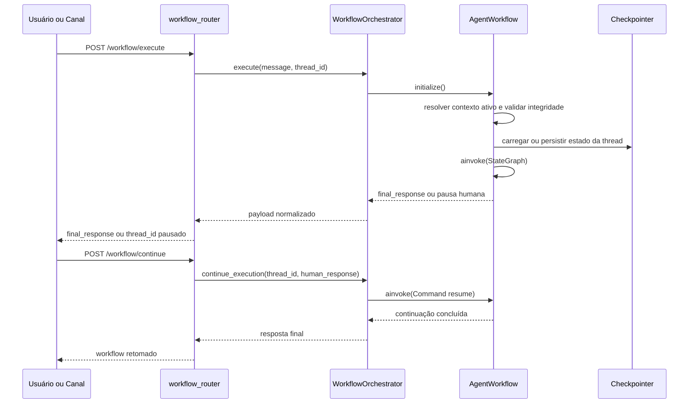

# Manual conceitual, executivo, comercial e estratégico: agente workflow completo

## 1. O que é esta feature

O agente workflow é a espinha dorsal determinística da plataforma quando o produto precisa transformar um processo de negócio em trilho governado, repetível e auditável. Em vez de deixar o caminho nascer de improviso do modelo, o sistema exige que a sequência, os pontos de decisão, os dados compartilhados e os desvios possíveis estejam declarados em uma gramática YAML que depois é convertida em AST, validada e só então executada como grafo LangGraph.

Na prática, isso significa que workflow não é apenas um arquivo de configuração nem apenas um runtime de grafo. Ele é a combinação de contrato declarativo, validação forte e execução com memória, checkpoint, continuidade e observabilidade. O objetivo não é “responder qualquer coisa”. O objetivo é permitir processos corporativos em que a plataforma consiga dizer qual fluxo foi escolhido, quais nós rodaram, por que uma rota foi tomada, onde houve erro e como retomar a partir de uma pausa humana.

## 2. Que problema ela resolve

Sem workflow, a plataforma cairia em três custos operacionais clássicos. O primeiro é o custo de imprevisibilidade: um fluxo com múltiplas etapas, ferramentas, validações e integrações passa a depender demais da interpretação do agente ou de código ad hoc espalhado. O segundo é o custo de auditoria: quando uma execução falha, operação e suporte não conseguem provar facilmente em qual etapa ocorreu o desvio. O terceiro é o custo de evolução: sem uma gramática comum, cada automação nova tende a reinventar um mini-orquestrador próprio.

O workflow resolve isso impondo uma estrutura comum. O YAML declara. A AST tipa. O parser tolera e coleta diagnóstico. O validador bloqueia inconsistência real. O runtime monta o grafo. A API expõe execução e retomada. Esse encadeamento reduz ambiguidade e evita que a automação corporativa dependa de convenção implícita.

## 3. Visão executiva

Para liderança, o workflow importa porque diminui o custo de exceção e aumenta previsibilidade. Processos corporativos com múltiplas etapas deixam de ser caixas-pretas e passam a ser ativos governados. Isso melhora governança porque selected_workflow, nodes, edges, retry_policy, human_approval e thread_id passam a fazer parte de um contrato audível, e não de lógica escondida em código de aplicação ou prompt.

O ganho executivo prático é que o produto consegue sustentar automações mais críticas sem depender de improviso operacional. Antes da execução, há uma barreira de contrato. Durante a execução, há trilha de estado. Em pausas humanas, há continuidade explícita por thread_id. Em falhas, há mensagens e diagnósticos mais rastreáveis. Isso reduz risco de automação opaca e melhora capacidade de suporte, compliance e operação.

## 4. Visão comercial

Comercialmente, o workflow representa automação configurável com governança. A conversa correta com o cliente não é “temos um grafo”. A conversa correta é “temos um mecanismo para desenhar processos agentic com passos claros, regras de desvio, retomada humana, integração com ferramentas e rastreabilidade operacional”.

Isso ajuda a responder objeções corporativas frequentes. Como saber em qual passo o processo falhou. Como garantir que um desvio segue regra explícita. Como reaproveitar um subfluxo sem duplicar lógica. Como misturar IA, ferramentas, validação de schema, canais como WhatsApp e checkpoints sem perder controle. O benefício percebido é flexibilidade sem abrir mão de governança.

O código sustenta essa promessa até o ponto em que o fluxo respeita a gramática canônica. O que ele não sustenta é “liberdade total sem contrato”. O produto é YAML-first, mas não texto livre. O workflow aceita composição, não caos.

## 5. Visão estratégica

Estrategicamente, o agente workflow fortalece a plataforma em cinco eixos.

1. Ele aproxima configuração e runtime. O YAML não é um artefato solto; ele entra em um pipeline canônico de AST, schema, validação e execução.
2. Ele reduz acoplamento. A lógica de processo deixa de ficar escondida em routers, services e handlers específicos de canal.
3. Ele permite extensão controlada. Novos modos de node entram por contrato AST, NodeFactory, schema e validação semântica.
4. Ele melhora governança do ecossistema agentic. Workflow, supervisor e deepagent passam a compartilhar a mesma disciplina de assembly.
5. Ele prepara a plataforma para operações longas e humanas. Checkpointer, thread_id, interrupt e continue_execution aproximam o runtime de casos reais de aprovação, revisão e retomada.

## 6. Conceitos necessários para entender

### 6.1. Workflow determinístico

Workflow determinístico significa que a plataforma não está pedindo ao agente que invente o caminho a cada rodada. O fluxo é descrito antes. Isso é importante porque há cenários em que improviso é custo, não benefício.

### 6.2. AST canônica

AST é a representação tipada da seção workflows do YAML. Na prática, ela funciona como contrato de estrutura: quais modos existem, quais campos são aceitos e quais blocos pertencem ao domínio workflow. Isso importa porque texto YAML sozinho não garante integridade.

### 6.3. Parse leniente e validação forte

O parser tenta ler o máximo possível e coletar diagnósticos, inclusive convertendo modos inválidos para unsupported quando necessário. A validação semântica é a barreira forte: ela bloqueia ids duplicados, workflow selecionado inválido, tool inexistente, sub_workflow autorreferente, edge inconsistente e expressão quebrada.

### 6.4. Workflow ativo

O runtime não deveria adivinhar qual fluxo rodar quando mais de um está habilitado. Por isso selected_workflow é obrigatório sempre que houver ambiguidade. O resolver aceita omissão apenas quando existe exatamente um workflow habilitado.

### 6.5. StateGraph

StateGraph é o runtime de grafo do LangGraph. No projeto, ele recebe nodes adicionados pelo NodeFactory e edges montadas de forma implícita por ordem ou declarativa pelo EdgeCompiler. Isso importa porque o YAML não roda sozinho; ele precisa virar grafo executável.

### 6.6. Estado do workflow

O estado compartilhado do runtime contém messages, input_text, last_output, current_step, metadata, context, variables, status, error_log e max_iterations. Em termos simples, ele é a memória operacional que passa de node para node.

### 6.7. Edge-first e node-driven

Node-driven significa que o fluxo nasce principalmente da ordem dos nodes e de campos como true_go_to, false_go_to e router.go_to_node. Edge-first significa que a transição é declarada em workflows[].edges com from, to, when e default. O projeto suporta os dois modelos.

### 6.8. Human-in-the-loop

Human-in-the-loop é a capacidade de pausar o grafo e esperar resposta externa. No projeto, isso aparece em BaseNodeHandler com interrupt, em WorkflowOrchestrator.continue_execution com Command(resume=...) e na superfície HTTP /workflow/continue.

### 6.9. Thread ID

thread_id é o ponteiro persistente da execução. Reutilizar o mesmo identificador significa retomar a mesma thread. Mudar o identificador significa começar outra execução. Isso é importante porque continuidade sem identidade estável vira ilusão.

## 7. Como a feature funciona por dentro

O ciclo de vida completo do workflow começa antes do runtime. Quando o YAML entra no assembly, a seção workflows é parseada para WorkflowAST. Depois disso, o DocumentSemanticValidator delega a WorkflowSemanticValidator a checagem de integridade. O resultado compilado vira fragmento governado apto para consumo do runtime.

No runtime, WorkflowConfigResolver revalida o alvo governado e resolve o workflow ativo. AgentWorkflow então carrega a configuração, roda WorkflowIntegrityAnalyzer como barreira de coerência operacional, inicializa ToolsFactory, MemoryFactory e checkpointer, decide se reaproveita um grafo compilado por hash ou monta um novo StateGraph, adiciona nodes, compila as transições e executa o fluxo.

Na borda de produto, WorkflowOrchestrator encapsula esse runtime e normaliza o resultado. A API expõe dois contratos públicos principais: /workflow/execute para disparar a thread e /workflow/continue para retomar pausa humana usando o mesmo thread_id e o mesmo correlation_id.

## 8. Divisão em etapas ou submódulos

### 8.1. Modelagem declarativa

Esta etapa existe para descrever o processo de negócio em YAML. Ela recebe selected_workflow, workflows_defaults, tools_library, nodes e edges e entrega um documento passível de parse. O valor dessa etapa é tornar a lógica de processo audível.

### 8.2. AST e schema

Aqui o sistema transforma o YAML em tipos canônicos. O benefício não é cosmético; é impedir que a plataforma trate o workflow como texto sem gramática. Também é nessa camada que o designer visual e os catálogos conseguem expor workflow_modes e safe_functions.

### 8.3. Validação semântica

Esta etapa existe para bloquear fluxo ambíguo ou incoerente antes da execução. Ela reduz risco de erro operacional que, sem essa barreira, só apareceria em produção.

### 8.4. Resolução de contexto ativo

Nesta etapa o sistema escolhe o workflow efetivo, mescla defaults, tools e memória e define o snapshot pronto para uso. É aqui que a plataforma decide o que realmente vai rodar, e não apenas o que estava declarado no YAML.

### 8.5. Compilação do grafo

Aqui o contrato declarativo vira runtime LangGraph. O valor é converter um documento de processo em execução real com checkpoint, edges, state e mecanismos de retomada.

### 8.6. Execução, pausa e retomada

Esta etapa recebe a mensagem, constrói o estado inicial, persiste checkpoint quando necessário, executa os nodes, produz final_response e permite retomada por thread_id em caso de human-in-the-loop.

## 9. Fluxo principal de ponta a ponta

```mermaid
flowchart TD
    A[YAML com workflows] --> B[WorkflowParser]
    B --> C[WorkflowCompiler]
    C --> D[WorkflowSemanticValidator]
    D --> E[Fragmento governado]
    E --> F[WorkflowConfigResolver]
    F --> G[AgentWorkflow]
    G --> H[WorkflowIntegrityAnalyzer]
    H --> I[StateGraph]
    I --> J[WorkflowOrchestrator]
    J --> K[/workflow/execute]
    I --> L[interrupt]
    L --> M[/workflow/continue com Command resume]
```

O diagrama mostra o ponto central da feature: o runtime não nasce direto do YAML bruto. Ele nasce de um pipeline de governo. Isso diferencia o projeto de implementações mais simples de LangGraph em que o desenvolvedor monta o grafo diretamente em código sem um contrato AST intermediário.

## 10. Decisões técnicas e trade-offs

### 10.1. Parser tolerante com validator rigoroso

O ganho é separar erro de leitura de erro de contrato. O custo é mais complexidade de pipeline. O benefício compensa porque o sistema consegue coletar diagnósticos úteis sem aceitar execução insegura.

### 10.2. Dois modos de transição

Suportar node-driven e edge-first aumenta flexibilidade e expressividade. O custo é duplicar parte da superfície conceitual. O benefício é que fluxos simples ficam compactos e fluxos mais governados ficam declarativos nas edges.

### 10.3. Governança AST antes do runtime

O ganho é impedir drift entre YAML, editor visual e execução real. O custo é exigir mais disciplina no assembly. Isso fortalece a plataforma porque novos modos precisam entrar pelo caminho oficial.

### 10.4. Checkpointer e thread_id como contrato

O ganho é continuidade real. O custo é tornar a identidade da execução parte explícita do uso. Sem isso, human-in-the-loop seria apenas um “quase pausa”.

### 10.5. NodeFactory e BaseNodeHandler

O ganho é consistência entre nodes equivalentes. Reads, writes, retry_policy, human_approval e execution_trace passam a obedecer um padrão comum. O custo é maior disciplina ao introduzir novos modos.

## 11. Configurações que mudam o comportamento

O workflow tem alguns blocos que realmente alteram o comportamento do sistema.

selected_workflow define o fluxo ativo e evita ambiguidade.

workflows_defaults permite compartilhar defaults de memória, catálogo de tools e local_tools_configuration.

settings.max_iterations atua como freio de iteração no runtime.

edges muda o modelo de transição para edge-first.

retry_policy muda resiliência por node.

human_approval ativa pausa humana em nodes que suportam esse gate.

tools_library e local_tools_configuration definem o catálogo efetivo e os overrides de tool por workflow.

background_execution_subagent aparece no schema do workflow, mas o slice lido nesta investigação não confirmou consumo operacional próprio além do contrato AST e schema.

local_mcp_configuration existe no contrato AST e em YAMLs reais, mas o consumo runtime específico dessa chave não foi confirmado no slice lido do workflow executor.

## 12. Contratos, entradas e saídas

O contrato declarativo principal é a coleção workflows dentro do documento agentic. O contrato operacional público aparece na API.

Em /workflow/execute, a entrada é a mensagem, o user_email, o formato, o correlation_id opcional, o thread_id opcional e o modo de execução. A saída síncrona traz final_response, execution_steps, thread_id, workflow_metadata, analysis, success e, quando aplicável, identificadores de task assíncrona.

Em /workflow/continue, a entrada é thread_id, correlation_id, human_response e o mesmo YAML resolvido. A saída padronizada traz thread_id, correlation_id, status, final_response, workflow_metadata e sucesso lógico.

O invariante crítico é simples: retomada sem thread_id válido falha cedo. O sistema não cria identidade nova na continuação.

## 13. O que acontece em caso de sucesso

No caminho feliz, o assembly aceita a AST, o validator aprova o workflow, o resolver encontra o fluxo ativo, o runtime inicializa tools e memória, o StateGraph roda até END ou até um ponto terminal equivalente, e o orquestrador devolve final_response, execution_steps e workflow_metadata coerentes com a trilha executada.

Quando há pausa humana intencional, o sucesso parcial é um estado paused com thread_id estável. O sucesso final só acontece após o continue_execution concluir a thread.

## 14. O que acontece em caso de erro

Os erros se dividem em quatro famílias.

Erros de contrato declarativo, como workflow selecionado inexistente, ids duplicados, edge inválida e tool ausente.

Erros de integridade runtime, como destino inexistente em router ou lista de nodes vazia, que levam a WorkflowIntegrityError antes da compilação do grafo.

Erros de execução, como falha de tool, expressão inválida, plano inválido, schema inválido ou exaustão do retry_policy.

Erros de continuidade, como thread_id ausente ou thread/checkpoint não encontrado na retomada.

## 15. Observabilidade e diagnóstico

O workflow foi desenhado para investigação em várias camadas. Há logs do assembly, logs do resolver, logs do runtime, logs de transição de edge, execution_trace no metadata, read_snapshots, write_snapshots e workflow_metadata exposto ao chamador. Em /workflow/execute e /workflow/continue, o correlation_id é devolvido no header e o thread_id volta no payload.

O começo da investigação costuma ser: qual workflow estava ativo, qual thread_id foi usada, se o erro aconteceu na validação, na integridade do runtime ou dentro de um node, e se houve pausa humana pendente.

## 16. Impacto técnico

O impacto técnico principal é reduzir lógica de processo espalhada. O workflow concentra orquestração em uma linguagem comum, reforça separação entre contrato e execução, reaproveita components de memória e tools, e torna o runtime mais substituível e testável.

## 17. Impacto executivo

O impacto executivo é previsibilidade operacional. O produto consegue automatizar processos mais críticos sem abrir mão de rastreabilidade, pausa humana e critérios claros de continuidade.

## 18. Impacto comercial

O impacto comercial é oferecer automação governada, e não automação opaca. Isso é relevante para clientes que exigem prova de trilha, pontos de revisão e modularidade de processos.

## 19. Impacto estratégico

O impacto estratégico é consolidar a visão YAML-first agentic da plataforma. Workflow deixa de ser um recurso isolado e passa a ser um pilar que conversa com tools, canais, HIL, background execution e assembly governado.

## 20. Exemplos práticos guiados

### 20.1. Workflow edge-first declarativo

O arquivo de modelo do sistema traz um workflow de demonstração chamado workflow_edge_first_demo. Ele existe para mostrar um caso em que router decide A, B ou DEFAULT e as edges explícitas definem o salto seguinte. Esse exemplo é importante porque prova que o projeto não depende apenas da ordem dos nodes; ele suporta transição governada por when e default.

### 20.2. Workflow planner e executor

O mesmo YAML-modelo traz um fluxo de planejamento estratégico com planner, executor e finalize. Esse exemplo mostra um padrão próximo ao estado da arte orchestrator-worker e evaluator-optimizer do LangGraph, mas com uma camada extra de contrato AST, failure_policy e continuidade humana.

### 20.3. Workflow de Instagram

O YAML de comentário de Instagram mostra um caso real de set, agent, function e merge para produzir payload de resposta pública e DM. Esse exemplo é comercialmente importante porque mostra workflow sendo usado como automação de canal, não apenas como experimento de laboratório.

### 20.4. Workflow de WhatsApp com mídia

O YAML-modelo também mostra whatsapp_media_resolver e whatsapp_send. Isso prova que o catálogo de nodes não é abstrato demais; ele já carrega modos especializados para payload multimídia e canal externo.

## 21. Explicação 101

Se fosse preciso explicar para alguém novo: workflow é o jeito da plataforma dizer “este processo deve seguir esta trilha, com estes pontos de decisão, estes dados compartilhados e esta forma de pausa humana”. Em vez de cada automação improvisar sua própria coordenação, o sistema usa uma gramática comum e um motor comum. Isso deixa o comportamento mais previsível, mais auditável e mais fácil de evoluir.

## 22. Limites e pegadinhas

Workflow não significa liberdade total de modelagem. O runtime aceita apenas os modos registrados no NodeFactory e no contrato AST.

YAML válido sintaticamente não significa workflow executável. O validator pode bloquear por integridade ou referência cruzada.

local_mcp_configuration e alguns blocos de settings existem no contrato, mas o slice lido não confirmou consumo operacional específico de todos eles no executor.

Pausa humana não é só uma mensagem ao usuário. Ela depende de interrupt, checkpointer e reutilização do mesmo thread_id.

## 23. Troubleshooting

Se a execução falhar antes de rodar qualquer node, a causa mais provável está na validação ou na análise de integridade.

Se a continuação falhar com 400, primeiro revise thread_id e human_response.

Se a continuação falhar com 404, a suspeita principal é thread/checkpoint não encontrado.

Se um router não encontrar destino, procure labels, allowed_labels, go_to_node, fallback_node e edges.when/default.

Se um sub_workflow falhar cedo, revise workflow_id, recursion stack e catálogo de workflows compilados.

## 24. Diagramas



## 25. Mapa de navegação conceitual

O workflow se apoia em quatro camadas: AST e schema, validação semântica, resolução de contexto e runtime executor. Em torno disso ficam a borda HTTP, os canais e o catálogo de tools. Ler o tema fora dessa ordem costuma gerar confusão porque mistura contrato de montagem com comportamento de execução.

## 26. Como colocar para funcionar

O caminho executável confirmado pelo código é usar um YAML com seção workflows válida, passar pela resolução de configuração do router, executar /workflow/execute com autenticação compatível com workflow.execute e, em caso de pausa humana, retomar a mesma thread por /workflow/continue usando o mesmo correlation_id lógico da execução pausada.

O slice lido confirmou a superfície HTTP e o orquestrador, mas não incluiu uma execução manual ponta a ponta nesta tarefa. Portanto, a validação aqui é estática e baseada em código e testes lidos.

## 27. Exercícios guiados

Exercício 1. Leia o exemplo workflow_edge_first_demo e responda em voz alta por que as edges tornam o desvio mais auditável do que depender apenas da ordem dos nodes.

Exercício 2. Leia o fluxo de planejamento estratégico e identifique onde o planner pensa, onde o executor itera e onde uma revisão humana pode entrar.

Exercício 3. Leia o fluxo do Instagram e explique por que set, function e merge existem antes de qualquer envio de canal.

## 28. Checklist de entendimento

- Entendi por que workflow não é apenas um grafo LangGraph cru.
- Entendi a diferença entre YAML, AST, validação e runtime.
- Entendi o papel de selected_workflow.
- Entendi a diferença entre node-driven e edge-first.
- Entendi por que thread_id e checkpointer são críticos para HIL.
- Entendi o valor executivo da feature.
- Entendi o valor comercial da feature.
- Entendi os limites do contrato.

## 29. Evidências no código

- src/config/agentic_assembly/ast/workflow.py
  - Motivo da leitura: confirmar gramática canônica dos blocos workflow.
  - Símbolo relevante: WorkflowAST, WorkflowNodeAST, WorkflowEdgeAST.
  - Comportamento confirmado: lista oficial de modos, estrutura de edges e settings globais.

- src/config/agentic_assembly/parsers/workflow_parser.py
  - Motivo da leitura: confirmar parse leniente e fallback unsupported.
  - Símbolo relevante: WorkflowParser.
  - Comportamento confirmado: modos desconhecidos viram UnsupportedNodeAST com diagnóstico.

- src/config/agentic_assembly/validators/workflow_semantic_validator.py
  - Motivo da leitura: confirmar regras de seleção, integridade e referências cruzadas.
  - Símbolo relevante: WorkflowSemanticValidator.
  - Comportamento confirmado: valida selected_workflow, tools, edges, expressões e sub_workflow.

- src/agentic_layer/workflow/agent_workflow.py
  - Motivo da leitura: confirmar montagem do StateGraph e execução real.
  - Símbolo relevante: AgentWorkflow.
  - Comportamento confirmado: cache por hash, resolver de contexto, edge-first, node-driven, run e thread_id.

- src/orchestrators/workflow_orchestrator.py
  - Motivo da leitura: confirmar execute e continue_execution.
  - Símbolo relevante: WorkflowOrchestrator.
  - Comportamento confirmado: retomada usa Command resume com o mesmo thread_id.

- src/api/routers/workflow_router.py
  - Motivo da leitura: confirmar contrato HTTP público.
  - Símbolo relevante: /workflow/execute e /workflow/continue.
  - Comportamento confirmado: execute seleciona modo híbrido e continue falha cedo sem thread_id.
