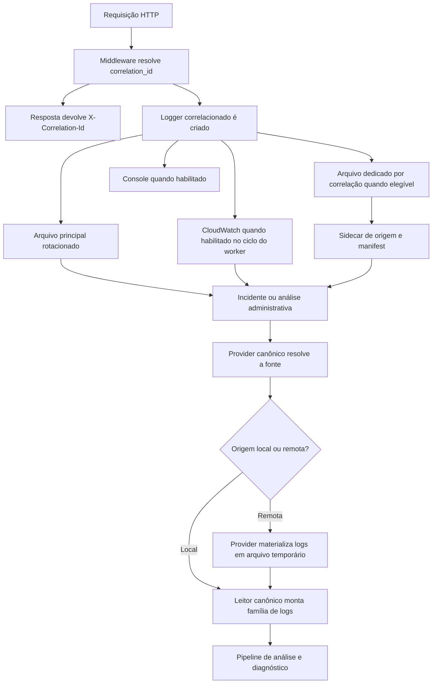

# Manual conceitual, executivo, comercial e estratégico: arquitetura de logs com correlation ID, arquivo local e providers remotos

## 1. O que é esta feature

Nesta plataforma, logging não é apenas a gravação de mensagens para debug. Logging é a capacidade transversal que transforma cada execução relevante em uma história rastreável, com identidade lógica própria, trilha estruturada em JSON, saída persistente em arquivo e leitura administrativa governada por provider.

O conceito central é simples, mas poderoso: toda execução importante precisa ser acompanhada por um correlation_id. Esse identificador nasce ou é reaproveitado na borda HTTP, atravessa a API, aparece na resposta para o cliente, segue para os logs de runtime e depois vira a chave usada para recuperar a família de arquivos ou eventos remotos daquela execução.

O que torna esta arquitetura diferente de um logging comum é a separação explícita entre dois problemas.

1. Escrever logs durante a execução.
2. Ler, localizar, materializar e analisar logs depois que a execução já aconteceu.

Essa separação evita um erro arquitetural comum: misturar emissão de log com busca administrativa de log e acabar acoplando o runtime inteiro ao tipo de storage ou ao provedor de observabilidade.

## 2. Que problema ela resolve

Sem essa arquitetura, a investigação de incidentes em uma plataforma com API, worker, scheduler e integrações externas vira um processo ruim em três níveis.

1. O problema técnico: mensagens ficam espalhadas entre processo HTTP, job assíncrono e arquivos diferentes sem uma chave única de correlação.
2. O problema operacional: a equipe perde tempo procurando arquivo manualmente ou tentando adivinhar qual stream remoto contém a execução certa.
3. O problema de governança: cada ambiente acaba desenvolvendo sua própria forma de escrever e ler logs, o que destrói previsibilidade.

O desenho observado no código resolve isso com quatro camadas bem definidas.

1. A API fixa um correlation_id e devolve esse identificador ao cliente.
2. O runtime escreve logs estruturados em destinos canônicos, como arquivo compartilhado, arquivo dedicado por correlação, console e CloudWatch quando habilitado.
3. A camada administrativa resolve um provider de leitura, como filesystem, AWS CloudWatch, Northflank ou Azure Log Analytics.
4. O leitor canônico reorganiza o material encontrado como família de logs da mesma execução e entrega isso ao pipeline de análise.

Na prática, isso reduz o tempo de diagnóstico e reduz também a chance de a equipe analisar o log errado.

## 3. Visão executiva

Executivamente, essa feature importa porque reduz risco operacional e melhora previsibilidade de suporte. Ela encurta o caminho entre incidente e evidência. Em vez de depender da memória do operador ou de tentativa e erro, a plataforma responde com um identificador de correlação e estrutura a investigação a partir dele.

Para liderança, isso produz quatro ganhos concretos.

1. Redução de tempo de diagnóstico em incidentes distribuídos entre API e worker.
2. Maior capacidade de auditoria técnica em execuções críticas.
3. Menor dependência de conhecimento tribal sobre onde cada log fica em cada ambiente.
4. Melhor governança porque produção não depende de fallback implícito para decidir de onde os logs administrativos virão.

O valor executivo não está em ter muito log. Está em ter log utilizável, correlacionado e governado.

## 4. Visão comercial

Comercialmente, essa arquitetura sustenta uma conversa importante com clientes corporativos: a plataforma não opera como caixa-preta. Ela foi desenhada para permitir rastreabilidade de ponta a ponta, inclusive quando a execução cruza processo HTTP, job assíncrono e provider remoto de logs.

Isso ajuda em três tipos de cenário comercial.

1. Projetos com requisito de auditoria e rastreabilidade de incidentes.
2. Ambientes com múltiplos estágios operacionais, como homologação, produção e runtimes distribuídos.
3. Casos em que o cliente exige clareza sobre como a plataforma investiga falhas sem depender de acesso manual ao servidor.

O que o código permite prometer com segurança é o seguinte.

1. Cada execução HTTP relevante recebe um correlation_id rastreável.
2. Esse ID volta no header da resposta e, quando aplicável, também no corpo JSON.
3. O runtime consegue escrever logs locais estruturados e, se habilitado, publicar eventos no CloudWatch.
4. A camada administrativa consegue ler logs por filesystem local, CloudWatch, Northflank e Azure Log Analytics.

O que não pode ser prometido é fallback mágico entre providers fora de development. O código falha fechado quando o provider não está configurado corretamente.

## 5. Visão estratégica

Estratégicamente, essa arquitetura fortalece a plataforma por cinco razões.

1. Protege o runtime de escrita contra acoplamento com o mecanismo de leitura administrativa.
2. Reforça a regra de correlation_id único como fio lógico da execução.
3. Permite trocar a origem de leitura administrativa sem reescrever o pipeline de análise.
4. Dá base para automação de diagnóstico centrada em evidência, porque o formato de entrada do analisador fica unificado.
5. Evita fallback implícito perigoso entre filesystem e providers remotos fora de development.

Em linguagem simples, essa feature não serve apenas para registrar o passado. Ela prepara o produto para operar melhor no futuro.

## 6. Conceitos necessários para entender

### 6.1. Correlation ID

Correlation ID é o identificador lógico único da execução. Ele é a resposta para a pergunta "qual é o caso que estamos investigando?". Sem esse identificador, um log estruturado ainda pode ser bonito, mas não necessariamente será útil para reconstruir a história certa.

### 6.2. Log estruturado

Log estruturado significa que o evento não é gravado apenas como texto livre. O runtime monta um payload JSON com timestamp, nível, logger e campos extras, como correlation_id, origem, exceção e contexto de execução. Isso facilita busca, análise automatizada e materialização por provider.

### 6.3. Arquivo compartilhado de runtime

É o arquivo principal rotacionado do processo. Ele registra a trilha geral da aplicação e serve como backbone operacional mesmo quando o arquivo dedicado por correlação não é criado.

### 6.4. Arquivo dedicado por correlação

É um arquivo específico para uma execução lógica. Ele existe para facilitar investigação por caso, reduzindo a necessidade de filtrar um arquivo compartilhado grande.

### 6.5. Sidecar de origem

O sidecar é um arquivo auxiliar que registra metadados de origem daquela correlação, como fábrica de logger, origem lógica e nome do arquivo efetivo. Ele ajuda a reconstruir a relação entre correlation_id e arquivo físico.

### 6.6. Manifest de correlação

O manifest é um índice append-only que registra, em formato JSONL, a relação entre correlation_id, metadata_filename e log_filename. Ele reduz o custo de lookup da família de logs sem exigir varredura cega da pasta inteira.

### 6.7. Provider canônico de leitura

É a camada que sabe de onde buscar logs para análise administrativa. Essa camada não é o logger de runtime. Ela é o resolvedor que decide se a leitura virá do filesystem local, do AWS CloudWatch, da Northflank ou do Azure Log Analytics.

### 6.8. Materialização

Materializar significa transformar eventos remotos em artefato local temporário para que o pipeline de análise trate tudo com o mesmo contrato. Em vez de o analisador entender cada API remota, o provider busca os eventos e os entrega como arquivo local temporário.

## 7. Como a arquitetura funciona por dentro

O fluxo começa na borda HTTP. O middleware de request resolve o correlation_id usando o estado do request quando ele já existe, ou o header X-Correlation-Id, e gera um novo ID apenas quando necessário. Esse identificador é gravado no state do request, entra no contexto de log e volta para o cliente na resposta.

Depois disso, o runtime cria um logger correlacionado. Se a feature de arquivo dedicado por correlação estiver habilitada e o ID for elegível para isolamento, o sistema cria um arquivo próprio para aquela execução. Caso contrário, ele usa o logger compartilhado do processo. Em ambos os casos, a saída segue estruturada em JSON.

Além do arquivo local compartilhado e do arquivo por correlação, o runtime também pode usar console e CloudWatch. O detalhe arquitetural mais importante é que o CloudWatch não é anexado cedo no bootstrap HTTP. O código adia esse acoplamento até o ciclo por-worker, para evitar um desenho mais frágil no processo da API.

Depois, quando alguém precisa investigar o que aconteceu, a segunda metade da arquitetura entra em cena. A camada administrativa resolve o provider ativo. Em development, o código força filesystem. Fora de development, o provider precisa ser explicitamente configurado como filesystem, aws_cloudwatch, northflank ou azure. Se isso não acontecer, a aplicação falha de forma explícita.

Se o provider for remoto, ele consulta a origem remota e materializa o resultado em arquivo local temporário. Se o provider for local, ele trabalha diretamente sobre o diretório de logs. Em seguida, o leitor canônico monta a família de logs da correlação e entrega o material ao comando de análise.

## 8. Divisão em etapas ou submódulos

### 8.1. Fixação da identidade lógica

Essa etapa resolve o correlation_id e garante que a resposta devolva essa identidade para o cliente. Ela existe para impedir que a investigação comece sem chave única.

### 8.2. Enriquecimento do contexto de log

Essa etapa mistura contexto do request com campos do evento e sanitiza dados sensíveis. Ela existe para que cada linha de log carregue contexto suficiente sem exigir parsing manual do texto.

### 8.3. Escrita operacional do runtime

Essa etapa grava eventos no arquivo principal, no console, em arquivo dedicado por correlação e, quando habilitado, no CloudWatch. Ela existe para preservar a trilha operacional durante a execução real.

### 8.4. Metadados de origem e manifest

Essa etapa grava sidecar e manifest append-only. Ela existe para transformar correlação lógica em localização física confiável.

### 8.5. Resolução do provider de leitura

Essa etapa decide de onde virão os logs para consulta administrativa. Ela existe para desacoplar o analisador do storage ou do provedor remoto.

### 8.6. Materialização e normalização

Essa etapa traz logs remotos para o formato local temporário e organiza a família da correlação. Ela existe para que a análise downstream não precise saber se os eventos vieram do arquivo local, do CloudWatch, da Northflank ou do Azure.

### 8.7. Análise administrativa

Essa etapa executa o pipeline de leitura e síntese. Ela existe para transformar logs em diagnóstico, não apenas em dump bruto.

## 9. Fluxo principal

Esse diagrama mostra a ideia central da arquitetura: escrita e leitura são etapas diferentes, mas conectadas pelo mesmo correlation_id.

## 10. Decisões técnicas e trade-offs

### 10.1. Separar escrita de leitura administrativa

Ganho: reduz acoplamento e evita que o runtime inteiro precise conhecer APIs remotas de logs.

Custo: exige duas camadas e um contrato de materialização.

### 10.2. Usar arquivo compartilhado e arquivo dedicado por correlação

Ganho: combina rastreabilidade por caso com uma trilha geral contínua do processo.

Custo: aumenta o número de artefatos operacionais e exige manifest para não degradar lookup.

### 10.3. Falhar fechado fora de development

Ganho: evita fallback implícito perigoso e torna o ambiente observável de forma explícita.

Custo: a configuração incorreta interrompe a leitura administrativa em vez de mascarar o problema.

### 10.4. Adiar CloudWatch até o worker

Ganho: reduz fragilidade no bootstrap HTTP e concentra anexação remota onde a plataforma já aceita custo de execução longa.

Custo: o operador precisa entender que habilitar CloudWatch não significa anexação imediata no processo da API antes do ciclo do worker.

### 10.5. Materializar providers remotos em arquivo local temporário

Ganho: unifica o contrato da análise e reduz complexidade downstream.

Custo: cria etapa intermediária de artefato temporário e limpeza posterior.

## 11. Configurações que mudam o comportamento

As configurações mais relevantes confirmadas no código são estas.

1. enable_file_logging ativa ou desativa o arquivo principal rotacionado.
2. enable_console_logging ativa ou desativa a saída de console.
3. log_output_directory muda o diretório base dos logs globais.
4. log_file_rotation_max_bytes e log_file_rotation_backup_count controlam rotação do arquivo principal.
5. log_correlation_directory define o diretório base dos arquivos dedicados por correlação.
6. enable_correlation_file_logging ativa ou desativa o arquivo específico por correlation_id.
7. enable_cloudwatch_logging ativa ou desativa o envio para CloudWatch.
8. cloudwatch_log_group, cloudwatch_log_stream_prefix e cloudwatch_region_name controlam o destino no AWS CloudWatch.
9. environment define se o provider administrativo será forçado para filesystem ou se precisará ser explicitamente resolvido.
10. log_provider_type escolhe o provider administrativo fora de development.

## 12. O que acontece em caso de sucesso

No caminho feliz, a plataforma responde com X-Correlation-Id, grava eventos estruturados nos destinos configurados e mantém metadados suficientes para que a leitura administrativa reencontre a família de logs depois.

Quando a análise administrativa é executada, o provider resolve a origem, o material é preparado e o pipeline de análise produz resultado consolidado sem depender da topologia física original dos logs.

## 13. O que acontece em caso de erro

Os erros mais relevantes confirmados no código são estes.

1. Provider administrativo ausente ou inválido fora de development.
2. CloudWatch sem log_group ou sem credenciais mínimas.
3. Filesystem sem selector, como correlation_id, log_name ou all_logs.
4. Northflank sem token, project_id ou workload alvo.
5. Azure sem workspace_id, query ou credenciais de access token.
6. Falha ao materializar logs remotos em arquivo temporário.
7. Ausência de arquivo correspondente à correlação esperada.

O ponto conceitual importante é este: a arquitetura prefere erro explícito a fallback implícito.

## 14. Observabilidade e diagnóstico

Para diagnosticar corretamente, a pergunta inicial não deve ser "onde está o arquivo?". A pergunta correta é "qual é o correlation_id da execução?".

Depois disso, a ordem mais segura é esta.

1. Confirmar se a resposta da API devolveu X-Correlation-Id.
2. Confirmar se o ambiente estava escrevendo em arquivo local, console e ou CloudWatch conforme a configuração.
3. Confirmar qual provider administrativo estava ativo.
4. Confirmar se a correlação gerou arquivo dedicado ou se a trilha principal ficou apenas no log compartilhado.
5. Só então investigar o conteúdo do evento e a causa raiz.

## 15. Impacto técnico

Tecnicamente, essa feature reduz acoplamento entre runtime e observabilidade, melhora lookup de logs por execução, padroniza análise de múltiplos ambientes e reforça o uso do correlation_id como contrato transversal de plataforma.

## 16. Impacto executivo

Executivamente, ela reduz tempo de investigação, melhora governança de incidentes e aumenta previsibilidade operacional porque a equipe investiga por evidência concreta e não por inspeção improvisada de diretório.

## 17. Impacto comercial

Comercialmente, ela fortalece a credibilidade da plataforma em ambientes corporativos porque viabiliza suporte rastreável, auditoria operacional e separação clara entre observabilidade local e remota.

## 18. Impacto estratégico

Estratégicamente, ela prepara a plataforma para crescer em diagnósticos automatizados, observabilidade distribuída e execução agentic mais complexa sem perder rastreabilidade ponta a ponta.

## 19. Exemplos práticos guiados

### 19.1. Incidente de API com worker assíncrono

Cenário: a API aceita a solicitação, devolve task_id e depois o processamento falha no worker.

O correlation_id devolvido na resposta permite localizar o arquivo de API, o arquivo de worker e os metadados de origem como uma única família lógica. Sem essa arquitetura, a equipe teria de adivinhar qual job e qual stream pertenciam ao mesmo incidente.

### 19.2. Ambiente corporativo com CloudWatch

Cenário: a operação usa AWS para centralizar logs, mas o analisador administrativo precisa continuar funcionando com o mesmo fluxo.

O provider de CloudWatch consulta os eventos remotos, materializa o resultado em artefato local temporário e entrega esse material ao pipeline de análise. O ganho prático é usar a mesma lógica administrativa mesmo fora do filesystem local.

### 19.3. Ambiente de desenvolvimento local

Cenário: o time está depurando o serviço no workstation ou no WSL.

Em development, o código força filesystem como provider administrativo. O ganho prático é reduzir complexidade operacional local e evitar que uma configuração remota mal definida atrapalhe a investigação básica.

## 20. Explicação 101

Pense nessa arquitetura como um protocolo de rastreamento de encomendas. O correlation_id é o código do pedido. Os arquivos locais, o CloudWatch e os providers remotos são centros de distribuição diferentes. O que importa é que todos falem a mesma identidade lógica para que o sistema saiba reconstruir a rota do pacote certo.

Se o código do pedido não existir, você até pode ver caixas soltas no galpão, mas não sabe qual delas pertence ao cliente certo. Se o código existir, a busca deixa de ser tentativa e erro.

## 21. Limites e pegadinhas

1. CloudWatch de escrita e CloudWatch de leitura não são exatamente o mesmo problema. O primeiro é handler de runtime. O segundo é provider administrativo.
2. Estar em development muda a regra do provider administrativo, porque o código força filesystem.
3. Fora de development, ausência de log_provider_type válido não cai silenciosamente em filesystem.
4. Nem toda correlação necessariamente produz arquivo dedicado; isso depende da configuração e da elegibilidade do ID.
5. Materialização de provider remoto cria artefato temporário; isso não significa que o storage original mudou.
6. O arquivo principal rotacionado continua existindo mesmo quando a correlação ganha arquivo próprio.

## 22. Troubleshooting

### 22.1. Sintoma: a resposta da API não permite rastrear o caso

Causa provável: o correlation_id não foi preservado ou o fluxo analisado não passou pelo middleware HTTP esperado.

### 22.2. Sintoma: a análise administrativa falha só em produção

Causa provável: log_provider_type ausente ou inválido fora de development.

### 22.3. Sintoma: CloudWatch está habilitado, mas o processo HTTP não mostra stream ativo

Causa provável: a anexação foi adiada para o ciclo do worker e ainda não foi ativada naquele processo.

### 22.4. Sintoma: o correlation_id existe, mas não há arquivo dedicado correspondente

Causa provável: o logger daquela execução usou o caminho compartilhado ou a correlação não entrou no critério de arquivo dedicado.

### 22.5. Sintoma: o provider remoto retorna vazio

Causa provável: filtro insuficiente, janela temporal errada, stream_prefix incorreto ou ausência de evidência no provedor remoto.

## 23. Checklist de entendimento

- Entendi por que correlation_id é o eixo da arquitetura de logging.
- Entendi a diferença entre escrita de runtime e leitura administrativa.
- Entendi o papel do arquivo principal e do arquivo dedicado por correlação.
- Entendi o papel do sidecar e do manifest.
- Entendi como o CloudWatch participa da arquitetura.
- Entendi por que filesystem é forçado em development.
- Entendi por que produção falha fechado sem provider explícito.
- Entendi os limites da materialização remota.

## 24. Evidências no código

- src/api/service_api.py
  - Motivo da leitura: confirmar nascimento do correlation_id na borda HTTP e devolução em header e body JSON.
  - Comportamento confirmado: o middleware resolve correlation_id, registra no request e devolve X-Correlation-Id.

- src/core/logging_system.py
  - Motivo da leitura: confirmar escrita em arquivo principal, arquivo dedicado por correlação, console e CloudWatch.
  - Comportamento confirmado: o runtime suporta rotação, arquivo específico por correlação e ativação adiada do CloudWatch.

- src/core/log_origin_metadata.py
  - Motivo da leitura: confirmar sidecar, manifest e contexto de origem.
  - Comportamento confirmado: a correlação é associada a metadados de origem e a um índice append-only persistente.

- src/api/services/log_provider_service.py
  - Motivo da leitura: confirmar providers canônicos de leitura e regra de falha fechada fora de development.
  - Comportamento confirmado: filesystem, AWS CloudWatch, Northflank e Azure são suportados, com provider explícito fora de development.

- src/api/services/canonical_log_reader.py
  - Motivo da leitura: confirmar montagem da família de logs por correlação.
  - Comportamento confirmado: o leitor canônico resolve nomes, papéis operacionais e ordem da família de arquivos.

- src/analysis/cloudwatch_log_fetcher.py
  - Motivo da leitura: confirmar consulta e materialização de eventos do CloudWatch.
  - Comportamento confirmado: eventos remotos são buscados por filtro e gravados em arquivo temporário local.
