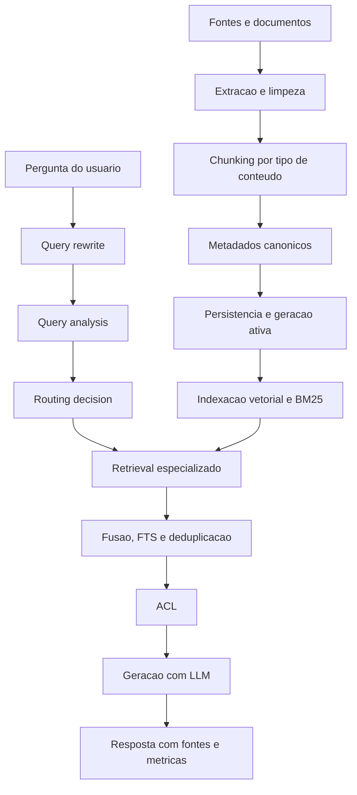

# Manual conceitual, executivo, comercial e estratégico: Pipeline RAG completo

## 1. O que é esta feature

O pipeline RAG desta plataforma é a capacidade que transforma acervo bruto em contexto consultável e, depois, transforma perguntas em respostas apoiadas por evidência. Ele não é apenas um chat com busca vetorial. O código lido mostra duas metades inseparáveis.

- A metade de produção de corpus, que extrai conteúdo, normaliza estrutura, cria chunks, preserva metadados, versiona a geração ativa e mantém os alvos vetorial e BM25 sincronizados.
- A metade de inferência, que reescreve a pergunta quando necessário, analisa o tipo de consulta, escolhe a estratégia de retrieval mais adequada, combina sinais semânticos e lexicais, aplica controle de acesso e só então chama o LLM para redigir a resposta.

Na prática, esta feature existe para impedir um erro comum em RAG corporativo: achar que “indexar tudo e fazer similarity search” basta. O runtime real deste projeto trata RAG como um sistema de decisão e não como um atalho de prompt.

## 2. Que problema ela resolve

Sem esse pipeline, a plataforma cairia em quatro problemas operacionais graves.

- Perguntas muito diferentes seriam tratadas pela mesma estratégia de busca, reduzindo precisão.
- Conteúdo com códigos, siglas, nomes normativos, tabelas e termos exatos dependeria apenas de embeddings, o que degrada recuperação literal.
- Mudanças de corpus poderiam deixar o índice vetorial e a base lexical fora de sincronia, criando respostas inconsistentes.
- Quando uma resposta viesse ruim, o time não conseguiria separar erro de ingestão, erro de retrieval, erro de ACL, erro de configuração e erro de geração.

O pipeline resolve isso separando produção de corpus, análise de pergunta, roteamento, retrieval, enriquecimento, fusão, geração e observabilidade. Em linguagem simples: ele organiza a consulta para que o modelo responda com base em evidência recuperada pelo caminho mais adequado.

## 3. Visão executiva

Para liderança, esta feature importa porque converte RAG de experimento para capacidade operacional auditável. O ganho não é só qualidade de resposta. O ganho é previsibilidade diagnóstica.

- Se a resposta saiu ruim, a operação consegue investigar se houve falha de chunking, desatualização de corpus, decisão errada de retrieval, ausência de vocabulário BM25, ACL excessiva ou contexto insuficiente na geração.
- Se o acervo muda, o sistema não depende de reindexação implícita e invisível. Há no código um conceito explícito de geração preparada, alvo físico de indexação e sincronismo entre componentes do corpus.
- Se a pergunta usa linguagem imprecisa, o runtime tenta melhorar a recuperabilidade antes de buscar, em vez de delegar toda a inteligência ao LLM final.

Isso reduz custo de suporte, reduz retrabalho técnico e melhora governança, porque o problema deixa de ser “o modelo errou” e passa a ser um fluxo investigável por etapa.

## 4. Visão comercial

Comercialmente, o valor suportado pelo código é claro: a plataforma não apenas conversa com documentos. Ela prepara o corpus, escolhe estratégia de busca por tipo de pergunta, combina sinais diferentes de recuperação e preserva rastreabilidade.

Isso responde dores reais de clientes que lidam com:

- acervo técnico e regulatório,
- códigos e siglas normativas,
- documentos longos com estrutura desigual,
- filtros implícitos por metadado,
- necessidade de explicar por que uma resposta foi dada.

O diferencial comercial não é prometer “IA que sabe tudo”. O diferencial real é prometer um RAG mais governado, mais auditável e mais adaptado a corpus corporativo. O que não deve ser prometido é infalibilidade. O código lido mostra guardrails, não onisciência.

## 5. Visão estratégica

Estrategicamente, o pipeline fortalece a plataforma em seis dimensões.

- Reforça a direção YAML-first, porque o runtime depende de contratos canônicos de configuração e falha cedo quando o mínimo obrigatório não existe.
- Mantém baixo acoplamento, separando setup, análise, roteamento, retrieval, fusão, cache, ACL e geração.
- Permite evolução incremental, porque novas estratégias entram como processadores e serviços especializados, não como ifs espalhados.
- Preserva governança do corpus, porque indexação vetorial e BM25 aparecem como conjunto operacional sincronizado.
- Prepara a plataforma para domínios especializados, combinando expansão lexical, self-query por domínio e vocabulário ativo do índice.
- Deixa espaço para evolução futura em avaliação, otimização de retrieval e aprofundamento multimodal sem reescrever o pipeline inteiro.

## 6. Conceitos necessários para entender

### 6.1. Ingestão

Ingestão é o processo que transforma fontes brutas em material consultável. Não é só “salvar arquivo”. No código lido, envolve resolver fonte, escolher cliente, escolher processador, extrair conteúdo, criar chunks, padronizar metadados, persistir manifesto e indexar.

### 6.2. Chunking

Chunking é o corte do conteúdo em partes menores. Isso importa porque o LLM não lê o acervo inteiro. Ele lê um conjunto limitado de trechos recuperados. O projeto usa chunking dependente do tipo de conteúdo. Texto simples tenta respeitar parágrafos e só cai para sentenças quando necessário. PDF tem uma sequência de estratégias e fallback próprio.

### 6.3. Busca vetorial

Busca vetorial é a parte que encontra semelhança de significado. Ela funciona bem para perguntas conceituais e descrições abertas, mas sozinha pode falhar quando a resposta depende de código exato, sigla ou nomenclatura literal.

### 6.4. BM25

BM25 é recuperação lexical clássica. O papel dele aqui é proteger o pipeline contra a cegueira literal da busca puramente semântica. Ele é especialmente valioso para termos técnicos, códigos e expressões exatas.

### 6.5. FTS

FTS é full-text search em banco relacional. No runtime lido, ele complementa a recuperação principal e pode enriquecer resultados em vez de substituir todo o pipeline.

### 6.6. Hybrid Search

Hybrid Search é a combinação de múltiplos sinais de recuperação. Neste projeto, isso significa combinar denso, lexical e, quando aplicável, FTS. O código também separa hybrid manual de hybrid nativo do vector store.

### 6.7. Fusion

Fusion é a etapa que combina resultados de múltiplos retrievers. Não é só juntar listas. É ordenar, deduplicar, pesar fontes e reduzir redundância.

### 6.8. Query rewrite

Query rewrite é a reescrita controlada da pergunta para melhorar recuperabilidade. O objetivo não é mudar a intenção do usuário, mas corrigir, expandir ou parafrasear de forma segura.

### 6.9. Multi-query

Multi-query é a geração de múltiplas formulações da mesma intenção para ampliar cobertura de retrieval quando uma única forma de perguntar não é suficiente.

### 6.10. Self-query

Self-query é a tentativa de transformar linguagem natural em filtros estruturados ou busca mais aderente a metadados. Isso é importante quando a resposta depende de atributos do documento e não só do texto livre.

### 6.11. Cache semântico

Cache semântico reaproveita resultados de consultas semanticamente parecidas para reduzir latência e custo, sem depender de igualdade literal da pergunta.

### 6.12. ACL no retrieval

ACL é o controle de acesso aplicado após a recuperação. O pipeline não considera a busca bem-sucedida só porque encontrou documentos relevantes; ainda precisa validar se o contexto atual pode usar aqueles documentos.

## 7. Como a feature funciona por dentro

O fluxo completo tem duas histórias encadeadas.

Primeiro, o corpus é produzido. A plataforma resolve fontes, processa cada tipo de conteúdo com estratégia própria, cria chunks com metadados padronizados, persiste a geração ativa e indexa esse material em estruturas complementares. Isso forma a base consultável.

Depois, a inferência acontece. A pergunta entra pelo boundary de QA, passa por query rewrite quando habilitado, é analisada semanticamente, recebe uma decisão de roteamento, executa a estratégia de retrieval compatível, pode ser enriquecida por FTS, passa por ACL, e só então vai para geração com contexto formatado.

O ponto conceitual mais importante é este: a plataforma não trata RAG como uma etapa única. Ela trata RAG como uma cadeia de decisões interdependentes. Isso melhora precisão, governança e diagnóstico, mas também aumenta a disciplina necessária na configuração.

## 8. Divisão em etapas ou submódulos

### 8.1. Produção do corpus

Esta etapa existe para converter fontes heterogêneas em material indexável. Ela recebe documentos, conteúdos remotos e contexto operacional; escolhe clientes e processadores; cria chunks e metadados; persiste manifesto e documentos; prepara o índice para ingestão e indexa vetorial e lexicalmente.

O valor dessa etapa é simples: sem corpus consistente, retrieval sofisticado só acelera erro.

### 8.2. Governança da geração ativa

Esta etapa existe para garantir que o conjunto operacional do corpus continue coerente. O código lido mostra conceitos de geração preparada, alvo físico vetorial e alvo físico BM25. Isso significa que o runtime não trata o índice como um saco de dados amorfo. Existe uma noção explícita de geração operacional ativa.

O valor aqui é reduzir corrupção silenciosa do acervo consultável.

### 8.3. Reescrita e análise da pergunta

Esta etapa existe para melhorar a chance de recuperar a evidência certa. Primeiro a plataforma pode reescrever a consulta. Depois extrai tipo de pergunta, domínio, tipo de dado, entidades, palavras-chave e sinais técnicos.

O valor aqui é impedir que a escolha do retriever seja feita no escuro.

### 8.4. Roteamento adaptativo

Esta etapa existe para escolher a melhor estratégia de busca. Ela transforma features da pergunta em decisão operacional: retrieval tradicional, hybrid, multi-query, self-query ou processamento especializado.

O valor aqui é não tratar toda pergunta com o mesmo martelo.

### 8.5. Retrieval especializado

Esta etapa existe para efetivamente recuperar evidência. Dependendo da pergunta, o pipeline pode privilegiar vetor, lexical, híbrido, expansão múltipla de query ou filtros estruturados.

O valor aqui é casar a estratégia com o tipo de evidência necessária.

### 8.6. Pós-retrieval

Esta etapa existe para melhorar qualidade antes da geração. Ela inclui deduplicação, fusão, eventual enriquecimento via FTS, aplicação de ACL e preparação de fontes.

O valor aqui é reduzir ruído e melhorar a utilidade do contexto final.

### 8.7. Geração da resposta

Esta etapa existe para transformar documentos recuperados e contexto do usuário em resposta legível, com rastreabilidade de fontes e telemetria de execução.

O valor aqui é fazer o LLM responder apoiado por contexto e não por improviso.

## 9. Pipeline principal de ponta a ponta

O diagrama mostra a lógica macro do sistema. A parte superior produz o corpus. A parte inferior consulta esse corpus. O ponto de interseção é o retrieval, que depende da qualidade da ingestão e da decisão de busca.

## 10. Decisões técnicas e trade-offs

### 10.1. Separar corpus e inferência

Ganho: isola produção de acervo da consulta online.

Custo: exige disciplina de versionamento e sincronismo.

Impacto prático: respostas ruins podem nascer de ingestão ruim, mesmo com retrieval forte.

### 10.2. Manter BM25 junto do vetor

Ganho: melhora perguntas com termos exatos.

Custo: exige manutenção de um segundo sinal de retrieval e seu vocabulário.

Impacto prático: evita perder códigos, siglas e normas por dependência excessiva da semântica.

### 10.3. Roteamento adaptativo

Ganho: escolhe estratégia por tipo de pergunta.

Custo: aumenta complexidade do runtime e superfície de configuração.

Impacto prático: melhora precisão, mas exige boa observabilidade para diagnóstico.

### 10.4. Fail-first em vez de fallback invisível

Ganho: impede mascarar configuração ruim ou pipeline quebrado.

Custo: o sistema falha mais cedo quando o contrato mínimo não está atendido.

Impacto prático: mais dor no setup, menos erro silencioso em produção.

### 10.5. Cache semântico

Ganho: reduz latência e custo em consultas parecidas.

Custo: exige gestão de TTL, backend e risco de mascarar mudanças do corpus se a política for mal calibrada.

Impacto prático: acelera uso repetitivo, mas precisa ser observável.

## 11. Comparação com estado da arte

Esta comparação usa o código lido como fonte de verdade interna e referências externas apenas como padrão de mercado para RAG avançado.

### 11.1. Onde o projeto já está alinhado ao estado da arte

- Chunking dependente de estrutura: o projeto já diferencia estratégia por tipo de conteúdo e, no PDF, percorre múltiplas estratégias ordenadas antes de cair em fallback. Isso está alinhado à recomendação de chunking por seção, parágrafo e sentença descrita em referências modernas de RAG avançado.
- Versionamento e atualização de corpus: a noção de geração preparada e alvo físico ativo aproxima o projeto de práticas de versioning e update strategy recomendadas para RAG corporativo.
- Query preprocessing: o runtime tem query rewrite e query analysis antes do retrieval, o que está alinhado à literatura moderna de query preprocessing.
- Query router: há um roteador adaptativo que decide estratégia de retrieval com base em features da pergunta.
- Hybrid retrieval e fusão: o código suporta hybrid manual, hybrid nativo, Weighted RRF, linear fusion e deduplicação. Isso está alinhado ao padrão moderno de combinar denso e esparso, inclusive com pesos explícitos.
- Multi-query e self-query: o pipeline já implementa expansão por múltiplas consultas e recuperação com filtros estruturados.
- Reranking: existe reranker neural baseado em cross-encoder, um padrão consolidado de pós-retrieval moderno.
- Cache semântico: existe camada explícita para reaproveitamento semântico com múltiplos backends.

### 11.2. Onde o projeto parece parcialmente alinhado

- Multimodalidade no corpus: a ingestão PDF mostra OCR, extração visual e chunking rico, mas o slice lido não confirma um retrieval multimodal de ponta a ponta tão sofisticado quanto arquiteturas de multi-vector ou late interaction.
- Query decomposition: multi-query existe, mas uma decomposição explícita de perguntas complexas em subperguntas independentes, como em pipelines de subquery orchestration, não ficou confirmada no código lido.
- Pós-completion validation: não ficou confirmado no slice lido um passo formal de fact-checking da resposta final após geração.

### 11.3. Onde o estado da arte vai além do que foi confirmado no código

- Índices hierárquicos de summary-to-detail não foram confirmados no código lido.
- Geração de sample questions por chunk para alignment optimization não foi confirmada.
- Rescoring em múltiplos estágios com representações diferentes, como coarse-to-fine vector rescoring, não foi confirmado.
- Pipeline explícito de golden dataset, avaliação automatizada e red-team do RAG não foi confirmado nos módulos lidos.

### 11.4. O que isso significa na prática

O projeto já está acima do RAG ingênuo e incorpora várias técnicas que hoje caracterizam RAG avançado de produção. Ao mesmo tempo, ele ainda pode evoluir em avaliação sistemática, decomposição complexa de perguntas e arquiteturas de re-ranking multiestágio mais profundas.

## 12. O que acontece em caso de sucesso

No caminho feliz, a plataforma consegue:

- manter o corpus operacional sincronizado,
- encontrar evidência por estratégia adequada,
- aplicar restrição de acesso,
- montar contexto útil para o LLM,
- devolver resposta com fontes e métricas.

Para o usuário, isso aparece como resposta mais consistente. Para a operação, aparece como retrieval trace, metadados, tempos de execução e capacidade de explicar o caminho da resposta.

## 13. O que acontece em caso de erro

Os principais erros confirmados no código lido seguem a filosofia fail-first.

- Configuração obrigatória ausente: o runtime não tenta adivinhar comportamento.
- BM25 habilitado sem alvo ou vocabulário resolvível: o pipeline registra e falha explicitamente.
- Strategy ou retriever indisponível: o motor pode cair para caminho tradicional em alguns pontos específicos, mas não mascara ausência estrutural do runtime moderno.
- LLM indisponível na geração: a resposta inteligente falha explicitamente.

Em termos simples: o projeto aceita fallback localizado em execução, mas evita fallback implícito para esconder contrato quebrado.

## 14. Observabilidade e diagnóstico

O pipeline foi desenhado para investigação por etapa. O código lido confirma:

- logs por passo de pipeline,
- trace de retrieval,
- telemetria da decisão de roteamento,
- métricas de cache semântico,
- métricas do fusion engine,
- metadados de contexto aplicado,
- tempos de geração via LLM.

Na prática, isso permite responder perguntas como:

- a pergunta foi reescrita ou não?
- qual estratégia foi escolhida?
- houve hybrid nativo ou manual?
- houve hit de cache?
- quantos documentos foram cortados por ACL?
- quais fontes foram efetivamente usadas?

## 15. Impacto técnico

Tecnicamente, esta feature reduz acoplamento entre ingestão, retrieval e geração; reforça a separação entre corpus e inferência; melhora rastreabilidade; e protege o domínio contra a simplificação perigosa de “um retriever para tudo”.

## 16. Impacto executivo

Executivamente, reduz risco operacional, melhora previsibilidade de suporte e permite priorizar evolução com base em evidência de pipeline, não em impressão subjetiva sobre o modelo.

## 17. Impacto comercial

Comercialmente, sustenta uma narrativa de RAG corporativo governado, útil para clientes que exigem precisão, literalidade e capacidade de auditoria.

## 18. Impacto estratégico

Estrategicamente, fortalece a plataforma como base de conhecimento, analytics e agentes, porque prepara o terreno para múltiplos domínios e múltiplas estratégias de retrieval sob o mesmo runtime governado.

## 19. Exemplos práticos guiados

### 19.1. Pergunta conceitual ampla

Cenário: o usuário pergunta por um conceito técnico sem citar um código exato.

Processamento esperado: query rewrite opcional, query analysis identificando caráter conceitual, retrieval tradicional ou híbrido, reranking e geração.

Impacto prático: a busca semântica tende a liderar.

### 19.2. Pergunta com código normativo

Cenário: o usuário cita norma, sigla ou identificador literal.

Processamento esperado: query analysis identifica sinais técnicos, hybrid query pode ser enriquecida com technical_terms, BM25 ganha relevância e fusion combina literalidade com semântica.

Impacto prático: o pipeline reduz o risco de perder documento certo por depender apenas de embeddings.

### 19.3. Pergunta com filtro implícito

Cenário: a resposta depende de atributos estruturados do documento.

Processamento esperado: self-query por domínio ou estratégia compatível com filtros estruturados.

Impacto prático: a plataforma tenta recuperar não só pelo texto, mas também pela estrutura do acervo.

## 20. Explicação 101

Imagine uma biblioteca corporativa em que os livros foram cortados em partes úteis, etiquetados e indexados de dois jeitos: por significado e por palavras exatas. Quando alguém faz uma pergunta, a plataforma primeiro tenta entender que tipo de pergunta é. Depois escolhe qual combinação de catálogo usar para achar as páginas certas. Só quando essas páginas foram escolhidas ela pede ao modelo para escrever a resposta. O valor do sistema está menos em “ter um modelo” e mais em “saber encontrar a evidência certa do jeito certo”.

## 21. Limites e pegadinhas

- Busca vetorial não substitui recuperação literal.
- BM25 forte não corrige chunking ruim.
- Resposta ruim pode nascer de corpus ruim, não de prompt ruim.
- Cache acelera, mas pode esconder mudanças recentes se mal governado.
- Hybrid melhora cobertura, mas aumenta complexidade diagnóstica.
- Query rewrite ajuda a recuperar melhor, mas não pode mudar intenção do usuário.
- Documento indexado não significa documento realmente recuperável para toda pergunta.

## 22. Checklist de entendimento

- Entendi que o pipeline tem metade de corpus e metade de inferência.
- Entendi por que chunking e metadados são tão importantes quanto embeddings.
- Entendi por que BM25 continua relevante.
- Entendi por que existe query analysis antes do retrieval.
- Entendi por que o sistema roteia a pergunta.
- Entendi por que hybrid search não é só “somar resultados”.
- Entendi o papel de cache, ACL e geração final.
- Entendi onde o projeto já acompanha o estado da arte.
- Entendi onde ainda há espaço real de evolução.

## 23. Evidências no código

- src/services/ingestion_service.py
  - Motivo da leitura: fachada oficial da ingestão e ponto de entrada do corpus.
  - Símbolo relevante: IngestionService.
  - Comportamento confirmado: preparação da requisição, fanout opcional e delegação ao orquestrador.
- src/ingestion_layer/document_persistence_manager.py
  - Motivo da leitura: governança da geração ativa e indexação.
  - Símbolo relevante: DocumentPersistenceManager.
  - Comportamento confirmado: persistência de manifesto, sincronismo vetorial e BM25, alvos físicos e prepared generation.
- src/qa_layer/rag_engine/intelligent_orchestrator.py
  - Motivo da leitura: orquestração do runtime moderno.
  - Símbolo relevante: intelligent_retrieve.
  - Comportamento confirmado: query rewrite, roteamento, retrieval, ACL, geração e telemetria.
- src/qa_layer/rag_engine/retrieval_engine.py
  - Motivo da leitura: execução das estratégias de retrieval.
  - Símbolo relevante: execute_hybrid_processor, execute_self_query_processor, execute_multi_query_processor.
  - Comportamento confirmado: hybrid nativo/manual, self-query, multi-query e fallback localizado.
- src/qa_layer/rag_engine/generation_engine.py
  - Motivo da leitura: geração final da resposta.
  - Símbolo relevante: generate_intelligent_answer.
  - Comportamento confirmado: montagem de contexto, chamada ao LLM e formatação de fontes.
