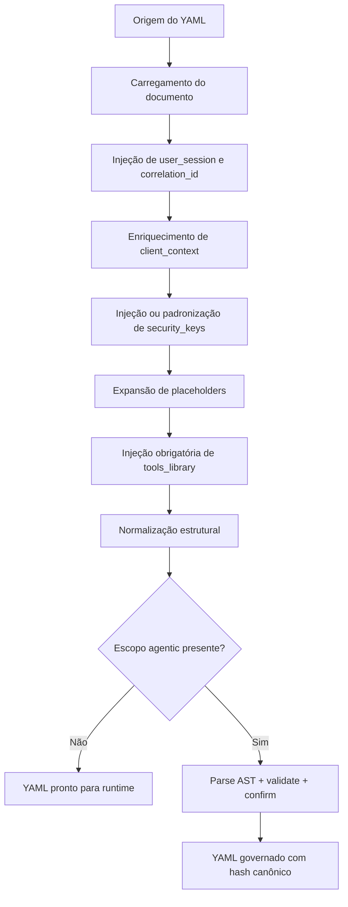
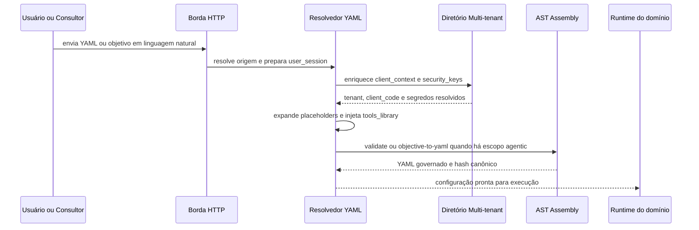

# Manual técnico, executivo, comercial e estratégico: Configuração YAML

## 1. O que é esta feature

A configuração YAML é o contrato operacional da plataforma. Ela descreve o que a aplicação deve fazer, com quais recursos, com quais segredos, em qual contexto de cliente, em qual topologia agentic e sob quais limites de governança. O ponto central não é “ter um arquivo de configuração”. O ponto central é fazer a plataforma funcionar a partir de um documento declarativo, sem empurrar a inteligência de montagem para código manual em cada fluxo.

Na prática, o YAML é o idioma operacional do produto. Ele permite declarar ingestão, RAG, supervisors, workflows, tools, memória, segredos, canais e comportamento de execução sem exigir que cada combinação vire uma implementação nova em Python.

Em linguagem simples, o YAML aqui não é apenas um arquivo. Ele é a forma padrão de montar o produto.

## 2. Que problema ela resolve

Sem um contrato YAML forte, a plataforma cairia em três problemas clássicos.

O primeiro é fragmentação. Cada endpoint ou serviço passaria a interpretar configuração de um jeito próprio.

O segundo é dependência excessiva de desenvolvimento. Sempre que um consultor ou operação quisesse criar um novo agente, fluxo ou variante de atendimento, seria necessário abrir tarefa para engenharia mexer no código.

O terceiro é governança fraca. Se segredos, tenant, catálogo de tools e topologia agentic pudessem entrar por caminhos arbitrários, o runtime ficaria imprevisível e difícil de auditar.

O YAML resolve isso criando um trilho único de resolução, enriquecimento, validação e compilação.

## 3. Visão conceitual

Conceitualmente, a plataforma é YAML-first. Isso significa que a intenção do produto nasce primeiro em configuração e só depois vira runtime. Mas YAML-first não significa texto livre. Significa documento declarativo com contrato, estrutura esperada, enriquecimento obrigatório de contexto e, no escopo agentic, governança AST-first.

O conceito mais importante é este: o sistema não executa “o YAML que chegou”. Ele executa o YAML depois de resolver origem, user_session, tenant, security_keys, placeholders, catálogo de tools, normalização estrutural e validação do trecho agentic quando aplicável.

## 4. Visão tática

Taticamente, o YAML serve para acelerar montagem de solução sem perder controle. Ele permite que a empresa opere numa camada mais alta de abstração.

Em vez de dizer “vamos programar um agente novo”, a tática da plataforma é dizer “vamos montar ou ajustar o contrato YAML correto, validar o escopo governado e publicar a configuração certa para o tenant certo”.

Essa tática é especialmente forte em três situações:

- criação de agentes e automações a partir de objetivo de negócio;
- personalização por tenant sem bifurcar código-fonte;
- troca de provider, credencial, workflow, supervisor ou tool sem reimplementar o produto.

## 5. Visão técnica

Tecnicamente, o YAML entra por um resolvedor central. Ele pode vir de arquivo, payload ou conteúdo inline. Depois, recebe user_session com correlation_id, é enriquecido com client_context, injeta security_keys a partir do diretório multi-tenant quando necessário, expande placeholders, injeta o catálogo builtin em tools_library e passa por normalização estrutural.

Quando o documento toca o escopo agentic, o sistema deixa de tratar esse trecho como texto livre. O fluxo passa por parse para AST canônica, validação semântica, compilação de fragmento governado, detecção de deriva e confirmação. Se a feature FEATURE_AGENTIC_AST_ENABLED estiver desligada, os endpoints de assembly ficam indisponíveis.

O ponto técnico crítico é este: o YAML é uma entrada declarativa, mas a plataforma só o aceita como executável depois de transformá-lo em artefato confiável.

## 6. Visão executiva

Para liderança, o valor do YAML é padronização com velocidade. Ele reduz dependência de mudanças de código para cada nova necessidade de cliente e transforma configuração em ativo governado.

Isso melhora time-to-value porque novas variantes podem nascer mais rápido. Também melhora governança porque o sistema impõe trilho de validação, seleção de tenant, resolução de segredos e contrato agentic antes de publicar a configuração final.

O ganho executivo mais forte é reduzir custo de personalização. Em software empresarial, personalização desgovernada costuma virar backlog de engenharia. Aqui, a arquitetura tenta deslocar essa personalização para uma camada declarativa controlada.

## 7. Visão comercial

Comercialmente, o YAML vira uma alavanca clara de oferta. A conversa correta não é “nosso sistema tem YAML”. A conversa correta é “nossa plataforma permite montar agentes, workflows e automações por configuração governada, com isolamento por tenant e segredos próprios do cliente”.

Isso é valioso para pré-venda porque reduz o atrito entre demonstração e entrega. O time comercial ou consultivo consegue mostrar adaptação de comportamento sem prometer uma sprint de código para cada ajuste.

O benefício percebido pelo cliente é autonomia com controle. O benefício percebido pela empresa de software é capacidade de escalar customização sem multiplicar custo técnico na mesma proporção.

## 8. Visão estratégica

Estratégicamente, o YAML fortalece a plataforma em quatro frentes.

A primeira é reuso. Em vez de hardcode por caso de uso, o produto reutiliza engines, tools, validadores e runtime a partir de configuração.

A segunda é separação entre produto e implantação. O core continua estável enquanto cada tenant recebe seu próprio contrato operacional.

A terceira é governança de evolução. Como o escopo agentic passa por AST, parser, compilador e confirm, a plataforma consegue crescer sem transformar configuração em caos textual.

A quarta é habilitação de operação consultiva. A empresa pode colocar consultores mais perto da montagem da solução, porque a camada de definição foi elevada acima do código-fonte.

## 9. Conceitos necessários para entender

### 9.1. Resolução de YAML

Resolução é o processo de transformar uma entrada bruta em configuração pronta para uso. Ela inclui origem, contexto, segredos, placeholders, tools e normalização.

### 9.2. client_context

client_context é o bloco que materializa identidade de cliente e tenant no YAML. No código lido, tenant_id deve morar em client_context.client.tenant_id. Colocar tenant_id em metadata ou em caminhos legados é tratado como configuração inválida em vários pontos do runtime.

### 9.3. security_keys

security_keys é o store lógico de segredos do YAML. O sistema o padroniza com fallback de leitura e usa esse store para expandir placeholders em qualquer parte do documento.

### 9.4. Placeholder

Placeholder é um valor simbólico no formato ${VAR}. O runtime tenta resolvê-lo via security_keys e, quando necessário, via .env.

### 9.5. tools_library

tools_library é o catálogo visível ao runtime agentic. No contrato observado, ele deve chegar vazio no YAML recebido e ser preenchido automaticamente com o catálogo builtin persistido. Preencher manualmente esse bloco é erro.

### 9.6. AST governada

No escopo agentic, AST é a representação tipada do YAML. Ela existe para garantir que draft, validate, confirm, schema e runtime falem a mesma língua.

### 9.7. Drift governado

Drift é a divergência entre o YAML governado validado e o conteúdo que permanece depois. O sistema registra hashes em metadata.agentic_assembly.governed_hashes para detectar isso.

### 9.8. YAML pessoal e YAML por tenant

O código confirma dois níveis de associação de YAML persistido: YAML por conta de usuário e YAML por vínculo usuário-tenant. Isso é importante porque a mesma pessoa pode operar em múltiplos contextos organizacionais.

## 10. BYOK no contexto real desta plataforma

BYOK, no sentido prático deste projeto, significa permitir que o cliente use suas próprias credenciais, chaves e segredos dentro da execução da plataforma, sem exigir que tudo seja fixado no código-fonte do produto.

O que o código confirma é o seguinte:

- o YAML pode carregar security_keys localmente;
- o resolvedor pode enriquecer o YAML com credenciais vindas do diretório multi-tenant;
- placeholders como ${VAR} são resolvidos pelo SecurityKeysStore;
- em canais, se um segredo referenciado não existir em tenant_secrets, o sistema falha com erro explícito;
- quando a chave não existe no payload local, o store ainda mantém fallback para .env.

Isso leva a uma conclusão importante: a plataforma suporta um modelo operacional próximo de BYOK, mas não é um BYOK rígido e exclusivo em todos os fluxos, porque o código ainda aceita fallback para .env em parte da resolução. Em outras palavras, o tenant pode trazer suas próprias chaves, mas o sistema ainda preserva compatibilidade com segredos de ambiente quando necessário.

### 10.1. Por que BYOK importa

BYOK importa por quatro razões.

A primeira é isolamento comercial. Cada cliente pode operar com sua própria conta de provider, seu próprio token de canal ou sua própria chave de API.

A segunda é governança de custo. O consumo do cliente pode ficar ligado à credencial do próprio cliente em vez de ser totalmente absorvido pela empresa de software.

A terceira é segurança contratual. O segredo do cliente não precisa virar constante de aplicação.

A quarta é portabilidade. Trocar credencial ou provider fica mais próximo de configuração do que de reescrita de código.

### 10.2. Implicações práticas de BYOK

BYOK mal governado vira caos de segredo. Por isso o sistema não trata secrets como texto solto. Ele exige client_context resolvido, usa diretório multi-tenant, registra erros quando tenant_secrets não atende a referência e padroniza acesso por SecurityKeysStore.

Em termos simples: a plataforma tenta dar liberdade ao cliente sem perder rastreabilidade nem abrir atalhos inseguros.

## 11. Separação por tenants e suas implicações

A separação por tenant no código não é apenas organizacional. Ela afeta resolução de YAML, resolução de segredos, persistência de datasets, telemetria e autorização.

Os sinais concretos lidos mostram isso:

- o diretório central de clientes resolve YAML por usuário, por tenant e por canal;
- a injeção de security_keys depende do client_code e pode consultar tenant_secrets;
- o bootstrap de dataset exige client_context.client.tenant_id;
- alvos físicos de índice são nomeados com tenant e vectorstore, como qdrant:tenant:vectorstore:gN e bm25:tenant:vectorstore:gN;
- vários fluxos rejeitam tenant_id em local errado e exigem o caminho canônico client_context.client.tenant_id.

### 11.1. Implicações técnicas

Tecnicamente, a separação por tenant evita colisão de índices, misturas acidentais de credenciais e ambiguidade sobre qual configuração está ativa.

### 11.2. Implicações operacionais

Operacionalmente, a empresa consegue isolar clientes, segmentar troubleshooting, localizar segredos por contexto e reduzir risco de usar canal ou provider do tenant errado.

### 11.3. Implicações comerciais

Comercialmente, isso suporta oferta multi-tenant real. A empresa pode vender a mesma plataforma para múltiplos clientes sem prometer um ambiente manualmente customizado para cada um.

### 11.4. Implicações de governança

Do ponto de vista de governança, essa separação facilita autorização, faturamento por contexto, auditoria de pertença e gestão de projetos por tenant.

## 12. Como o YAML funciona por dentro

O fluxo começa na borda, onde a plataforma resolve de onde veio o YAML. Depois injeta user_session com correlation_id e user_email, quando aplicável. Em seguida, tenta enriquecer client_context e security_keys por meio do diretório multi-tenant.

Com security_keys padronizado, o sistema expande placeholders recursivamente. Depois injeta tools_library a partir do catálogo builtin persistido, desde que o YAML o tenha declarado vazio. Só então segue para normalização estrutural e, quando há escopo agentic, para parse, validação e confirmação governada.

O ponto importante é que a plataforma empilha preparação antes de execução. Ela não trata o YAML como algo pronto só porque foi carregado sem erro de sintaxe.

## 13. Pipeline principal

O diagrama mostra a lógica principal: YAML carregado não é YAML pronto. Antes de virar runtime, ele é enriquecido, normalizado e, quando necessário, governado.

## 14. Criação de agentes sem programação manual

Uma das capacidades mais estratégicas do sistema é permitir geração assistida de configuração agentic a partir de objetivo em linguagem natural. O código confirma um fluxo formal para isso por meio dos endpoints de assembly, especialmente draft, objective-to-yaml, validate e confirm.

Na prática, o caminho é este:

- o usuário informa objetivo, target e contexto base;
- o serviço de assembly resolve o alvo correto;
- o draft pode ser gerado por LLM com envelope JSON estrito e schema explícito;
- se faltar informação, o sistema devolve questions obrigatórias em vez de inventar configuração;
- o validate verifica coerência semântica;
- o confirm produz YAML final, faz merge com a base e registra hash governado.

Isso é o que torna plausível a criação de agentes sem programação manual direta. O consultor não precisa escrever Python nem dominar detalhes internos do runtime para começar um novo draft de configuração. Ele trabalha na camada de intenção e restrição, enquanto a plataforma tenta transformar isso em YAML canônico.

### 14.1. O que “sem programação” significa aqui

Significa reduzir a necessidade de editar código-fonte para montar a solução. Não significa ausência total de governança, de revisão ou de entendimento funcional.

O sistema não publica configuração textual crua direto para produção. Ele passa por schema, validação e confirmação. Essa distinção é fundamental.

### 14.2. Por que isso é importante para consultores

Isso aproxima consultoria e montagem de solução. Em vez de depender de um desenvolvedor para toda variação de agente, o consultor pode ajudar a descrever o objetivo, selecionar o tipo de fluxo e iterar na configuração declarativa.

Na prática, a plataforma desloca parte do trabalho da camada de código para a camada de contrato operacional.

### 14.3. Por que isso é importante para uma empresa de software

Para a empresa, isso traz vantagens reais:

- reduz backlog de engenharia para customizações repetitivas;
- encurta prototipação e prova de conceito;
- aumenta reaproveitamento do core técnico;
- melhora margem operacional em cenários de personalização;
- permite que especialistas de negócio contribuam antes de uma implementação de baixo nível.

O risco evitado aqui é virar fábrica de projetos totalmente manuais. A estratégia do YAML é transformar personalização em parametrização governada.

## 15. Decisões técnicas e trade-offs

### 15.1. Falha fechada para tools_library

O sistema exige tools_library na raiz e vazia. Isso reduz liberdade textual, mas impede catálogos divergentes ou manipulados manualmente.

### 15.2. Fallback de segredos para .env

O fallback aumenta resiliência e compatibilidade. O custo é que BYOK não fica 100% rígido em todos os fluxos. Isso precisa ser entendido como escolha de transição e compatibilidade, não como isolamento absoluto de segredo em toda a base.

### 15.3. Tenant_id em caminho canônico

Exigir client_context.client.tenant_id aumenta rigor e reduz ambiguidade. O custo é rejeitar layouts legados ou atalhos improvisados.

### 15.4. AST governada no escopo agentic

Esse desenho aumenta disciplina e segurança. O custo é tornar a edição agentic menos livre do que um YAML artesanal. Em troca, a plataforma ganha validação forte e proteção contra drift.

### 15.5. Geração assistida com perguntas obrigatórias

O sistema prefere devolver perguntas quando falta informação em vez de inventar um YAML “bonito”. Isso sacrifica conveniência imediata, mas evita publicar configuração perigosa ou ilusória.

## 16. Configurações que mudam comportamento

### 16.1. FEATURE_AGENTIC_AST_ENABLED

Liga ou desliga a disponibilidade da montagem AST governada por endpoints de assembly.

### 16.2. tools_library

Precisa existir na raiz e chegar vazia. Se vier preenchida, o sistema rejeita o YAML recebido.

### 16.3. client_context.client.tenant_id

Define o tenant do fluxo e influencia resolução de índices, datasets e múltiplos validadores de runtime.

### 16.4. security_keys

Controla a disponibilidade de segredos locais e participa da expansão de placeholders.

### 16.5. vector_store.if_exists

Controla a política do dataset vivo durante ingestão.

### 16.6. user_session.correlation_id

Controla a identidade lógica da execução para logs, rastreabilidade e continuidade entre camadas.

## 17. Contratos, entradas e saídas

Os contratos mais relevantes confirmados no código são estes:

- entrada do YAML por origem resolvida pela borda;
- user_session contendo correlation_id e, quando aplicável, user_email;
- client_context.client com tenant_id e dados do cliente;
- security_keys como store padrão de segredos;
- tools_library como catálogo builtin injetado;
- payloads agentic que passam por draft, objective-to-yaml, validate e confirm;
- YAML pessoal e YAML organizacional resolvidos por repositórios distintos no diretório multi-tenant.

Esses contratos são importantes porque ligam definição declarativa a persistência, runtime e governança.

## 18. O que acontece em caso de sucesso

No caminho feliz, o YAML entra por uma origem suportada, recebe user_session, é enriquecido com client_context, resolve security_keys e placeholders, ganha tools_library canônica, passa pela normalização estrutural e, se tiver escopo agentic, passa também por parse, validate e confirm.

Quando tudo fecha corretamente, o resultado não é apenas um YAML sintaticamente bonito. É uma configuração pronta para runtime, associada ao tenant correto e, no trecho governado, com selo de hash canônico.

## 19. O que acontece em caso de erro

Os erros mais relevantes confirmados no código são estes.

### 19.1. Origem de YAML inválida

O sistema pode falhar logo na leitura quando a origem do documento não é suportada ou está ausente.

### 19.2. tools_library ausente ou preenchida

O resolvedor falha fechado se tools_library não existir na raiz ou vier preenchida manualmente.

### 19.3. client_code não resolvido

Sem access_key ou client_context suficiente para determinar client_code, a injeção de security_keys é negada.

### 19.4. Security_keys não encontradas

Se o diretório multi-tenant não localizar security_keys do cliente, a API retorna erro explícito orientando cadastro prévio.

### 19.5. Segredo referenciado ausente em tenant_secrets

Se o YAML referenciar um segredo inexistente na tabela tenant_secrets, a requisição falha com mensagem específica.

### 19.6. tenant_id ausente ou em local errado

Vários fluxos exigem client_context.client.tenant_id. Usar metadata.tenant_id ou caminhos legados pode quebrar bootstrap e validações posteriores.

### 19.7. Draft agentic sem contexto suficiente

Na geração assistida, o sistema não precisa “falhar silenciosamente”. Ele pode devolver questions obrigatórias e bloquear a publicação do YAML final até que a lacuna seja resolvida.

## 20. Observabilidade e diagnóstico

O diagnóstico correto do YAML segue esta ordem.

1. Confirmar a origem do documento.
2. Confirmar se user_session foi injetado com correlation_id.
3. Confirmar se client_context.client foi enriquecido com tenant e client_code.
4. Confirmar se security_keys foi resolvido localmente, por diretório ou por fallback .env.
5. Confirmar se placeholders críticos foram realmente substituídos.
6. Confirmar se tools_library chegou vazia e foi preenchida pelo catálogo builtin.
7. Quando houver escopo agentic, verificar diagnostics, validation_report e metadata.agentic_assembly.governed_hashes.

Em linguagem simples: primeiro prove que o YAML foi preparado corretamente. Só depois investigue o domínio que o consumiu.

## 21. Impacto técnico

Tecnicamente, o YAML reduz acoplamento entre produto e customização. Ele concentra configuração, tenant, segredos e topologia agentic num contrato único, em vez de espalhar essa responsabilidade por múltiplos serviços.

Também melhora testabilidade e previsibilidade porque o código tem pontos únicos de resolução, validação e compilação.

## 22. Impacto executivo

Executivamente, o YAML é um mecanismo de escala. Ele reduz a pressão para atender cada customização com desenvolvimento dedicado e melhora o controle sobre o que está efetivamente em produção para cada tenant.

## 23. Impacto comercial

Comercialmente, o YAML transforma flexibilidade em argumento de venda: a empresa consegue adaptar agentes, canais e fluxos com mais velocidade e menor atrito, sem prometer reengenharia para cada novo cenário.

## 24. Impacto estratégico

Estratégicamente, o YAML prepara a plataforma para um modelo de software configurável e consultivo. Isso aumenta reutilização, reduz dependência de código manual e fortalece uma operação multi-tenant com governança explícita.

## 25. Exemplos práticos guiados

### 25.1. Cliente com credenciais próprias

Cenário: um tenant quer usar seu próprio token de WhatsApp e sua própria chave de provider.

Processamento: o YAML referencia security_keys, o diretório multi-tenant injeta o contexto do cliente e a resolução de segredos usa tenant_secrets e placeholders.

Resultado: a plataforma usa credenciais do próprio cliente sem embutir segredo no código.

### 25.2. Consultor criando um agente novo

Cenário: um consultor descreve o objetivo do agente em linguagem natural.

Processamento: o fluxo objective-to-yaml gera draft AST, faz perguntas obrigatórias se faltar contexto, valida o payload e produz YAML final canônico em dry-run antes de aplicar.

Resultado: o consultor participa da montagem da solução sem precisar escrever código-fonte.

### 25.3. Bootstrap de dataset por tenant

Cenário: uma ingestão nova precisa ativar alvo vetorial e BM25.

Processamento: o runtime lê client_context.client.tenant_id e compõe nomes físicos de alvo com tenant e vectorstore.

Resultado: o índice nasce fisicamente segmentado pelo tenant correto.

## 26. Explicação 101

Pense no YAML como a ficha técnica de uma operação inteira. Essa ficha diz quem é o cliente, quais segredos usar, qual fluxo rodar e quais recursos estão disponíveis. A plataforma lê essa ficha, completa o que faltar com contexto autorizado, verifica se a ficha está coerente e só então começa a executar.

O objetivo não é deixar qualquer pessoa digitar qualquer texto e torcer para dar certo. O objetivo é permitir configuração rápida sem abrir mão de segurança e rastreabilidade.

## 27. Limites e pegadinhas

Algumas interpretações erradas precisam ser evitadas.

A primeira é achar que YAML-first significa ausência de validação. O código mostra o oposto: a plataforma faz bastante validação antes do runtime.

A segunda é tratar BYOK como modelo puro e exclusivo já garantido em 100% dos fluxos. O fallback para .env mostra que a plataforma ainda combina tenant-managed keys com compatibilidade operacional.

A terceira é confundir “sem programação” com “sem governança”. A geração assistida de YAML continua cercada por schema, validate e confirm.

A quarta é achar que tenant é só um campo informativo. No código, tenant_id participa de resolução física de alvo, diretório de segredos e autorização de contexto.

A quinta é achar que tools_library pode ser escrito manualmente no YAML. O contrato observado não permite isso.

## 28. Troubleshooting

### 28.1. O YAML carregou mas o fluxo não encontra tools

Sintoma: falha cedo relacionada a tools_library.

Causa provável: tools_library ausente ou preenchida manualmente.

Como confirmar: revisar o documento recebido e a etapa de injeção do catálogo builtin.

### 28.2. O tenant correto não foi reconhecido

Sintoma: falhas de dataset, alvo vetorial ou autorização.

Causa provável: tenant_id ausente ou fora do caminho client_context.client.tenant_id.

Como confirmar: revisar client_context no YAML já resolvido.

### 28.3. Um placeholder não foi resolvido

Sintoma: provider ou canal falha com valor literal ${VAR} ou credencial vazia.

Causa provável: segredo ausente em security_keys, tenant_secrets ou .env.

Como confirmar: revisar a origem do segredo e verificar se houve fallback ou erro explícito.

### 28.4. O objective-to-yaml não publica o YAML final

Sintoma: o fluxo retorna questions ou bloqueia em preflight, validate ou confirm.

Causa provável: falta de contexto, schema inválido, target mal resolvido ou ambiente não pronto.

Como confirmar: revisar validation_report, questions e blocking_stage retornados pelo assembly.

## 29. Diagramas

O diagrama mostra que o YAML não vai direto do usuário para o runtime. Ele atravessa camadas de preparação, governança e contexto.

## 30. Checklist de entendimento

- Entendi que o YAML é o contrato operacional da plataforma.
- Entendi que YAML-first não significa texto livre sem validação.
- Entendi onde BYOK aparece no código e onde ainda existe fallback para .env.
- Entendi por que client_context.client.tenant_id é estrutural.
- Entendi como o diretório multi-tenant participa da resolução.
- Entendi por que tools_library precisa chegar vazia.
- Entendi como a AST governa o trecho agentic.
- Entendi como objective-to-yaml ajuda a criar agentes sem programação manual.
- Entendi por que isso é valioso para consultores.
- Entendi por que isso é valioso para uma empresa de software.
- Entendi os limites e riscos do modelo.

## 31. Evidências no código

- src/config/config_cli/configuration_factory.py: confirma injeção obrigatória de tools_library, expansão de placeholders e finalização central da configuração.
- src/security/security_keys_resolver.py: confirma SecurityKeysStore, fallback para .env e resolução recursiva de placeholders ${VAR}.
- src/api/routers/config_resolution.py: confirma enriquecimento via diretório multi-tenant, injeção de security_keys, erros explícitos de tenant_secrets e exigência de client_code.
- src/channel_layer/config_resolver.py: confirma carga de YAML de canal com enrich_yaml_with_client_context e erro explícito quando segredo do tenant não existe.
- src/security/client_directory.py: confirma diretório central multi-tenant com resolução de YAML por usuário, tenant e canal.
- src/security/user_yaml_repository.py: confirma persistência e resolução de YAML pessoal e YAML organizacional por vínculo usuário-tenant.
- src/ingestion_layer/document_persistence_manager.py: confirma bootstrap de dataset dependente de tenant_id e composição de alvo físico com tenant e vectorstore.
- src/core/progress_callback.py: confirma resolução canônica de tenant_id em client_context.client.tenant_id.
- src/api/routers/config_assembly_router.py: confirma endpoints de draft, objective-to-yaml, validate e confirm no fluxo governado.
- src/config/agentic_assembly/assembly_service.py: confirma o ciclo preflight, draft, validate, confirm, merge final e selo de hash governado.
- src/config/agentic_assembly/nl/llm_draft_generator.py: confirma geração estruturada de draft AST por LLM com envelope JSON, schema explícito e questions obrigatórias.
- src/config/agentic_assembly/nl/repair_loop.py: confirma reparos básicos automáticos e reforça a estratégia de reduzir atrito sem abrir mão de validação.
