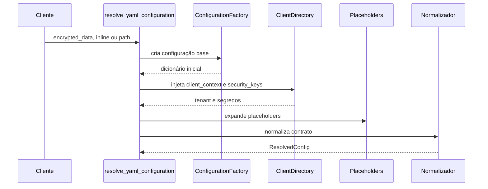

# Configuração YAML da Plataforma

Este documento cobre o caminho real do YAML até o runtime.
Ele não substitui os documentos de domínio, tools ou AST.
O objetivo aqui é explicar como o YAML entra, é enriquecido e quais
regras do código fazem a configuração ser aceita ou rejeitada.

## Papel do YAML no produto

O YAML continua sendo o contrato operacional principal.
Mas ele não vai direto para execução.

Antes de chegar ao runtime, ele passa por carregamento, injeção de
contexto, resolução de segredos, expansão de placeholders, normalização
e, no escopo agentic, validação governada.

## De onde o YAML pode vir

No boundary HTTP atual, a resolução aceita três entradas:

- encrypted_data;
- yaml_inline_content;
- yaml_config_path.

Fora do boundary HTTP, também existe carregamento a partir de arquivo.

## Fluxo real de resolução

## O que a fábrica faz no caminho principal

Pelo código atual, ConfigurationFactory:

1. carrega YAML de arquivo ou payload;
2. injeta user_session com correlation_id;
3. valida security_keys;
4. injeta tools_library quando a chave existe e chega vazia;
5. garante o security keys store;
6. expande placeholders, quando a expansão está habilitada;
7. normaliza a estrutura YAML;
8. anexa metadados de carregamento.

Em linguagem simples: o YAML final de runtime já não é o mesmo objeto
cru que entrou pela API.

## tools_library não é preenchida pelo cliente

O contrato atual é fechado.

- a chave tools_library precisa existir na raiz;
- ela deve chegar vazia;
- a injeção usa o catálogo builtin persistido carregado pelo cache de
    tools;
- tools_library ausente ou preenchida gera erro.

Na prática, o cliente não publica catálogo manual dentro do YAML.

## client_context e security_keys

O resolver HTTP enriquece o YAML com dados vindos do diretório de
clientes e do repositório de segredos.

Isso é importante porque tenant, identidade do cliente e chaves não são
tratados como detalhe cosmético.
Eles influenciam autorização, rastreabilidade e resolução de recursos.

## Placeholders

O runtime expande placeholders depois do enriquecimento multi-tenant.

Esse detalhe importa porque o sistema precisa conhecer o cliente antes
de tentar resolver parte dos segredos.

Se placeholder crítico sobra no final, isso é sinal de lacuna de
configuração e não de sucesso parcial.

## user_session é obrigatório para o runtime

O caminho principal injeta correlation_id em user_session.
Além disso, vários componentes do runtime falham quando esse bloco ou o
correlation_id não existem.

Em linguagem simples: user_session não é um adorno do YAML.
Ele participa do isolamento operacional e do rastreamento.

## vector_store.if_exists no runtime atual

O código atual lê vector_store.if_exists como política obrigatória de
lifecycle do acervo em fluxos de ingestão.

Em linguagem simples: essa chave diz o que o sistema deve fazer quando o
acervo já existe. Como ela decide se o acervo será atualizado, preservado
ou reconstruído, o sistema não aplica mais default silencioso para update.
Se a chave estiver ausente, vazia, com tipo errado ou com valor inválido,
a configuração deve falhar de forma clara antes da ingestão continuar.

Pontos observados no runtime:

- o valor é normalizado para overwrite, skip ou update;
- valores ausentes ou inválidos falham fechado;
- a camada de vector store bloqueia flags legadas de purge;
- no caminho de overwrite, a persistência pode preparar nova geração de
    dataset antes da troca do alvo físico;
- o lifecycle de dataset usa repositório canônico com geração ativa e
    physical_bm25_target.

Na prática, não trate if_exists como um detalhe só do provider vetorial.
Ele rege o conjunto inteiro do dataset vivo: PostgreSQL, vector store,
BM25 e versões de documento.

O alias vector_store.incremental_indexing.respect_last_modified não faz
parte do contrato atual. Use vector_store.incremental_indexing.enabled
para ativar ou desativar a indexação incremental.

## Rejeição de estruturas legadas

O normalizador e o runtime rejeitam caminhos antigos em vez de mascarar
erro.

Exemplos já documentados pelo código e pelas mensagens atuais:

- user_session fora do lugar certo;
- chaves legadas de purge ligadas ao overwrite;
- estruturas antigas rejeitadas pelo normalizador.

O efeito prático desejado é falhar cedo.

## Escopo agentic governado

Nem todo o YAML passa pelo mesmo nível de governança.
O trecho agentic inclui blocos como:

- workflows;
- multi_agents;
- selected_workflow;
- selected_supervisor;
- workflows_defaults;
- tools_library.

Nesse escopo, o fluxo oficial é draft, validate e confirm.

## AST não é detalhe opcional da UI

Quando FEATURE_AGENTIC_AST_ENABLED está ativa, o fluxo governado de AST
também vira superfície HTTP pública.

Isso inclui endpoints como:

- /config/assembly/draft;
- /config/assembly/objective-to-yaml;
- /config/assembly/validate;
- /config/assembly/confirm;
- /config/assembly/schema;
- /config/assembly/catalog.

Se a feature estiver desligada, esse slice responde como ausente.

Quando o fluxo AST confirma um documento governado, o runtime registra o
selo de hash em `metadata.agentic_assembly.governed_hashes`. Esse selo
serve para detectar drift, ou seja, diferença entre o contrato validado e
o conteúdo persistido depois. Em linguagem simples: é uma assinatura de
controle para saber se o YAML compilado continua igual ao que foi
validado.

## Validação de contrato YAML geral

O código atual registra que a validação geral em /config/contract está
desativada.

Isso não quer dizer ausência de validação.
Quer dizer que a proteção principal hoje vem da resolução, da
normalização e dos validadores do escopo agentic.

## Como validar um YAML sem adivinhar

1. Confirme a origem do YAML: encrypted_data, inline ou path.
2. Confirme se user_session.correlation_id ficou presente.
3. Confirme se client_context e security_keys foram enriquecidos.
4. Confirme se placeholders críticos foram resolvidos.
5. Confirme se tools_library existe e chegou vazia para receber injeção.
6. Se houver ingestão, confirme que vector_store.if_exists existe, usa
    overwrite, skip ou update, e combina com a intenção do acervo.
7. Se houver escopo agentic, passe por /config/assembly/validate.

## Leitura complementar sem fragmentar assunto

- Use GUIA-USUARIO-TOOLS.md para catálogo e famílias de tools.
- Use README-AST-AGENTIC-DESIGNER.md para fluxo AST.
- Use README-DEEPAGENTS-SUPERVISOR.md para o contrato do DeepAgent.
- Use README-INGESTAO.md quando a dúvida for pipeline documental.

## Como rodar e validar

1. Use um endpoint que passe por resolve_yaml_configuration.
2. Envie encrypted_data, YAML inline ou yaml_config_path.
3. Confira correlation_id na request e nos logs.
4. Verifique se o YAML resolvido não deixou placeholder crítico para
     trás.
5. Se o fluxo for agentic, valide também no slice /config/assembly.

## Evidência no código

- src/api/routers/config_resolution.py
- src/config/config_cli/configuration_factory.py
- src/security/client_directory.py
- src/security/security_keys_resolver.py
- src/utils/yaml_schema_normalizer.py
- src/api/routers/config_assembly_router.py
- src/config/agentic_assembly/assembly_service.py
- src/config/agentic_assembly/drift_detector.py
- src/ingestion_layer/document_persistence_manager.py
- src/ingestion_layer/vector_stores/base.py
- src/telemetry/ingestion/dataset_lifecycle_repository.py
- src/api/routers/config_contract_router.py

## Lacunas no código

Não encontrado no código.

Onde deveria estar:

- um endpoint administrativo único para exportar o YAML final resolvido
    de forma segura para auditoria humana;
- uma visão consolidada dos erros de resolução, normalização e validação
    do YAML no mesmo relatório operacional.
