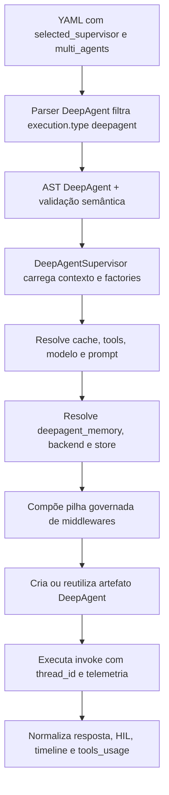
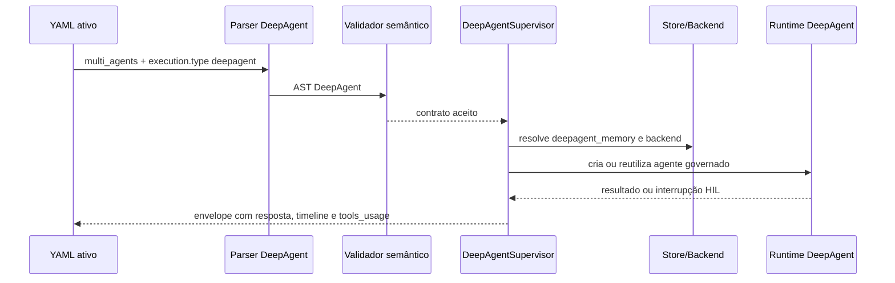

# Manual técnico, executivo, comercial e estratégico: DeepAgent Supervisor

## 1. O que é esta feature

O DeepAgent Supervisor é o modo governado de supervisão agentic da plataforma quando um supervisor em multi_agents declara execution.type como deepagent. Ele não é apenas uma variação cosmética do supervisor clássico. Ele é um runtime separado, montado localmente pelo produto, com cadeia explícita de middlewares, validações fechadas, memória persistente opcional, proteção de filesystem, shell governado, subagentes síncronos e assíncronos, human-in-the-loop, sumarização, proteção de dados sensíveis, skills e telemetria de execução.

Na prática, esta feature existe para resolver um problema que um agente simples não resolve sozinho: permitir autonomia operacional sem abrir mão de controle. O DeepAgent consegue delegar, consultar memória, operar com recursos de sistema e coordenar tarefas complexas, mas só dentro de uma pilha que o produto monta de forma declarativa e auditável.

Em termos simples, ele funciona como um coordenador de alto nível que recebe um objetivo, monta o ambiente de execução compatível com aquele YAML e só libera capacidades concretas quando as dependências, permissões e contratos estão corretos.

## 2. Que problema ela resolve

Sem o DeepAgent Supervisor, a plataforma ficaria restrita a coordenações mais lineares ou menos governadas. Isso cria quatro dores práticas.

A primeira dor é autonomia sem fronteira. Um agente que pode usar filesystem, shell, memória e subagentes sem contrato forte tende a gerar comportamento imprevisível, difícil de auditar e perigoso do ponto de vista operacional.

A segunda dor é confusão entre capacidade declarada e capacidade real. Em projetos agentic, é comum um YAML dizer que algo existe, mas o runtime final montar outra coisa, muitas vezes apoiado em defaults implícitos de biblioteca. O DeepAgent evita isso montando explicitamente a pilha governada do produto e falhando cedo quando alguma peça crítica não existe.

A terceira dor é diagnóstico ruim. Quando um agente responde mal, o problema pode estar na tool, no modelo, na permissão, na memória, na ausência de backend, no shell, no subagente ou no processo de revisão humana. O DeepAgent melhora esse cenário registrando plano de middlewares, timeline de execução, uso de tools e telemetria por estágio.

A quarta dor é falta de separação entre persistência, contexto de prompt e controle operacional. No DeepAgent, memória persistente, checkpointer, cache, summarization e skills são tratados como problemas diferentes, em camadas diferentes. Isso evita misturar conceitos e reduz risco de configuração enganosa.

## 3. Visão executiva

Para liderança, o valor do DeepAgent está em permitir automação mais poderosa sem perder governança. Ele reduz risco operacional porque não libera capacidades críticas por convenção implícita. Filesystem exige permissions. Human-in-the-loop exige interrupt_on e checkpointer. Memória persistente exige backend explícito. Skills, subagentes, summarization e memory middleware exigem backend compatível. Quando algo está incoerente, o runtime falha fechado.

Isso melhora previsibilidade. Em vez de um agente aparentemente inteligente, mas difícil de controlar, a plataforma passa a oferecer um agente com autonomia contratual. Esse desenho ajuda gestão a responder perguntas relevantes para escala e compliance: o que o agente pode fazer, quem aprovou, o que ficou persistido, quais limites estavam ativos e por que um fluxo foi interrompido.

O impacto executivo mais forte é reduzir o custo oculto de operação. Quanto mais agentic uma plataforma fica, mais caro se torna explicar comportamentos não governados. O DeepAgent ataca exatamente esse custo.

## 4. Visão comercial

Do ponto de vista comercial, o DeepAgent Supervisor representa uma capacidade vendável de automação governada. O discurso comercial correto não é "temos um agente com acesso ao sistema". O discurso correto é "temos um agente com capacidades operacionais controladas, permissões explícitas, memória persistente opcional, revisão humana configurável e rastreabilidade de execução".

Isso resolve dores comuns de clientes corporativos que querem agentes mais autônomos, mas não aceitam caixa-preta. O DeepAgent ajuda a responder objeções como:

- Como impedir que o agente escreva onde não deve.
- Como separar memória do usuário, do agente e da organização.
- Como exigir aprovação humana em ferramentas críticas.
- Como manter rastreabilidade do que o agente fez.
- Como escalar subagentes sem virar um ecossistema impossível de operar.

A promessa comercial suportada pelo código é controle com extensibilidade. A promessa que não deve ser feita é autonomia ilimitada. O runtime foi desenhado para autonomia governada, não para execução livre sem fronteiras.

## 5. Visão estratégica

Estratégicamente, o DeepAgent fortalece a plataforma em quatro frentes.

A primeira é governança de runtime agentic. A plataforma deixa de depender de comportamento implícito de biblioteca e passa a centralizar sua política de execução em contrato AST, parser, validator e supervisor governado.

A segunda é evolução sustentável. Como os recursos do DeepAgent estão modelados em AST dedicada e validados semanticamente, a plataforma consegue evoluir features como skills, approvals, memória e subagentes sem espalhar regra de negócio pelo código todo.

A terceira é convergência de arquitetura YAML-first com runtime forte. O YAML continua sendo a porta de entrada declarativa, mas o comportamento real é garantido por parse, validação semântica e composição explícita do runtime.

A quarta é preparação para automação mais sofisticada. DeepAgent abre caminho para cenários com delegação, aprovações, memória durável, uso controlado de shell e coordenação de especialistas, sem abandonar observabilidade e isolamento.

## 6. Conceitos necessários para entender

### 6.1. Supervisor governado

Supervisor governado é um supervisor cujo comportamento real não fica entregue a defaults invisíveis. No DeepAgent, o produto lê o contrato, valida, compõe middlewares, verifica dependências do runtime, injeta recursos compatíveis e registra o plano resultante. Isso importa porque o mesmo YAML pode parecer válido para um leitor humano e ainda assim ser recusado se faltar backend, permissão ou checkpointer.

### 6.2. Middleware

Middleware, neste contexto, é uma camada que intercepta ou enriquece a execução do agente. Ele pode limitar chamadas, aplicar retry, auditar seleção de tool, expor filesystem, resumir contexto, proteger PII, injetar memória, gerenciar todo list ou exigir revisão humana. O DeepAgent depende dessa ideia porque a governança do runtime é implementada como pilha ordenada de middlewares.

### 6.3. Backend e store

Backend é a ponte de runtime que middlewares como filesystem, subagents, skills, memory e summarization usam para operar. Store é a persistência concreta usada pela memória durável. No código lido, a memória persistente governada do DeepAgent usa um StoreBackend apoiado em DeepAgentRedisStore quando deepagent_memory está habilitado.

Em termos simples, store é onde a memória mora; backend é o jeito como o runtime acessa recursos que dependem dessa infraestrutura.

### 6.4. Checkpointer

Checkpointer é a estrutura que preserva estado suficiente para pausas e retomadas. Ele é particularmente importante para human-in-the-loop. O validator exige memory.checkpointer.enabled quando middlewares.human_in_the_loop.enabled está verdadeiro. Isso evita aprovações humanas sem estado consistente de retomada.

### 6.5. Permissions

Permissions são regras declarativas que limitam operações de filesystem. Elas aceitam operações read e write, caminhos absolutos sem .. e modo allow ou deny. A importância delas é simples: filesystem sem política explícita seria uma abertura operacional excessiva. Por isso, filesystem habilitado exige permissions explícitas no mesmo escopo.

### 6.6. Skills

Skills são fontes adicionais de conhecimento instrucional carregadas pelo runtime. Elas podem existir no topo do supervisor e também em subagentes. No DeepAgent, skills não são apenas texto extra; elas fazem parte da montagem governada e dependem de backend ativo quando middlewares.skills está habilitado.

### 6.7. Todo list

Todo list é a lista de tarefas interna do agente. No runtime lido, ela é tratada como middleware oficial. O valor disso é estruturar o trabalho do agente durante execuções mais longas ou com múltiplas etapas, reduzindo perda de contexto operacional.

### 6.8. Human-in-the-loop

Human-in-the-loop é a capacidade de interromper a execução para decisão humana. No DeepAgent, isso depende de interrupt_on e de checkpointer habilitado. A decisão permitida no contrato é approve, edit ou reject. O objetivo não é desacelerar toda execução, mas criar ponto de controle onde o custo de errar é alto.

### 6.9. Summarization

Summarization é o resumo automático de contexto para evitar crescimento descontrolado de histórico. No DeepAgent, ela pode ser montada com configuração customizada ou via factory padrão do runtime, sempre com model e backend compatíveis.

### 6.10. PII

PII significa informação de identificação pessoal ou sensível. O DeepAgent trata isso com regras explícitas de sanitização, usando estratégias como block, redact, mask e hash. O runtime também define um conjunto default quando nenhuma regra é declarada, cobrindo email, cartão, IP, MAC address e URL.

### 6.11. Runtime cache e prompt cache

Runtime cache, neste contexto, é o reaproveitamento do artefato DeepAgent já montado para o mesmo supervisor e mesmo hash de YAML, controlado por versão de cache. Prompt cache é outro problema: um middleware específico de caching de prompt pode ser acrescentado quando o runtime o suporta. O objetivo de ambos é reduzir custo e latência, mas sem confundir cache de artefato com memória conversacional.

## 7. Como a feature funciona por dentro

O fluxo interno começa com a seleção do supervisor ativo e a leitura do contexto já resolvido. A partir daí, o DeepAgentSupervisor carrega configuração, inicializa factories compartilhadas, resolve a factory governada do runtime DeepAgent, compõe middlewares extras do produto, monta backend e store persistente quando deepagent_memory está habilitado, obtém checkpointer e cria o agente.

A criação do agente não é uma chamada simples. O supervisor primeiro verifica se existe uma entrada de cache válida para aquele supervisor e hash de YAML. Se existir e a versão do cache coincidir, ele reutiliza o DeepAgent já montado. Se não existir, ou se o hash e a versão não coincidirem, ele invalida a entrada antiga e reconstrói tudo.

Depois disso, o supervisor resolve tools, modelo, prompt, skills top-level, response_format, interrupt_on, permissions, checkpointer, store e backend, sempre verificando se a assinatura da factory de runtime suporta aqueles parâmetros. Isso importa porque o produto não assume que o runtime externo sempre aceitará qualquer recurso. Se o runtime atual não suportar um parâmetro governado exigido pelo YAML, a inicialização falha.

Na execução propriamente dita, o supervisor constrói payload de entrada, aplica timeout lógico, invoca o agente e normaliza o retorno. Se houver interrupção de human-in-the-loop, o resultado é normalizado para um contrato consistente. Se houver sucesso, o payload final inclui resposta, métricas, timeline de execução, uso de tools e, quando aplicável, diagnóstico adicional.

## 8. Divisão em etapas ou submódulos

### 8.1. Leitura e seleção do contrato

Esta etapa identifica qual supervisor está ativo e se o caminho é mesmo deepagent. O parser dedicado filtra apenas supervisors com execution.type deepagent. Isso existe para impedir mistura implícita entre o supervisor clássico e o DeepAgent.

Ela recebe o YAML bruto e entrega um payload normalizado para AST. O valor desta etapa é reduzir ambiguidade antes da montagem do runtime.

### 8.2. AST e validação semântica

Nesta etapa, o contrato é convertido para DeepAgentSupervisorAST e passa por validações semânticas específicas. É aqui que o sistema garante regras como:

- filesytem habilitado exige permissions explícitas;
- permissions não podem existir sem filesystem habilitado;
- human-in-the-loop exige checkpointer habilitado na seção raiz memory;
- async_approval não pode ser habilitado sem human-in-the-loop;
- skills devem ser lista válida, sem vazios e sem duplicação;
- response_format deve seguir estrutura válida de JSON Schema;
- deepagent_memory só aceita certos escopos e políticas.

O objetivo desta etapa é falhar cedo antes que o runtime execute algo incoerente.

### 8.3. Inicialização de dependências compartilhadas

Aqui entram ToolsFactory, MemoryFactory e caches compartilhados. O sistema reutiliza cache de ToolsFactory entre supervisores por TTL e também consulta sinais de invalidação global. Isso reduz reconstrução desnecessária e evita divergência entre supervisor clássico e DeepAgent no tratamento de tools.

### 8.4. Resolução de memória persistente

Se deepagent_memory estiver habilitado, o supervisor monta DeepAgentRedisStore com URL, prefixo, TTL, política de escrita e namespace estável por escopo. Depois cria um StoreBackend oficial do runtime usando esse store.

Esta etapa existe porque memória persistente não pode ser apenas um dicionário solto. Ela precisa ter política de escrita, namespace consistente e retry em operações Redis.

### 8.5. Composição da pilha governada

Esta é a etapa mais importante. O runtime monta a pilha real de middlewares do DeepAgent, ligando ou desligando capacidades conforme o contrato governado. É aqui que entram filesystem, shell, todo list, PII, skills, summarization, memory middleware, human-in-the-loop, exclusão de tools, permissions, subagentes e middlewares extras do produto.

### 8.6. Criação do agente e cache do artefato

Depois da composição, o agente DeepAgent é criado. O artefato resultante é armazenado no pool com hash do YAML e versão de cache. Isso evita remontagem desnecessária em chamadas futuras com a mesma configuração.

### 8.7. Execução, telemetria e normalização do retorno

Durante a execução, o supervisor registra eventos, telemetria de tools, interrupções, retomadas, resposta final e timeline consolidada. O retorno final não é apenas texto; ele é um envelope operacional que ajuda suporte e operação a entender o comportamento do runtime.

## 9. Pipeline ou fluxo principal

O diagrama mostra a ordem macro real. A lógica importante é que a execução não começa na chamada do modelo. Ela começa na validação do contrato e na montagem do ambiente governado.

### 9.1. Entrada declarativa

A entrada é o YAML ativo. selected_supervisor define quem lidera. multi_agents contém o contrato do supervisor DeepAgent e seus especialistas. Se o contrato estiver estruturalmente incoerente, o fluxo para antes de montar o runtime.

### 9.2. Filtragem e parse

O parser dedicado percorre multi_agents, ignora supervisores que não sejam deepagent e converte os candidatos para AST própria. Isso evita aplicar regras de DeepAgent em supervisores clássicos.

### 9.3. Validação fechada

A validação semântica aplica regras de coerência entre recursos. Esse é um dos pontos mais importantes para entender o produto: o DeepAgent não aceita combinações ambíguas apenas porque elas são sintaticamente válidas.

### 9.4. Inicialização do supervisor

Com contrato válido, o supervisor carrega contexto ativo, inicializa factories compartilhadas, resolve a factory governada do runtime e monta a lista de middlewares extras do produto, como auditoria, execução de tools, pós-processamento e tratamento de erro.

### 9.5. Resolução de backend e store

Se houver deepagent_memory ativa, o supervisor monta DeepAgentRedisStore e um backend compatível com o runtime DeepAgent. Se não houver configuração válida, o backend não existe. Isso é relevante porque várias capacidades dependem dele.

### 9.6. Composição do agente governado

Nesta etapa, a pilha governada é materializada. O supervisor adiciona middlewares conforme toggles e dependências reais. Também recompõe subagentes síncronos com a mesma política governada do produto.

### 9.7. Execução e normalização

Na execução, o supervisor invoca o agente com thread_id, registra eventos, consolida telemetria, trata pausas de HIL e devolve um envelope final com final_response, metrics, tools_usage e execution_timeline.

## 10. Recursos do DeepAgent e por que cada um é importante

### 10.1. Filesystem

Filesystem é a capacidade de expor operações de sistema de arquivos ao agente por meio de middleware oficial. Ele é importante porque várias automações reais exigem leitura ou manipulação controlada de conteúdo. Mas, ao mesmo tempo, ele é um dos recursos mais sensíveis do runtime.

Por isso o produto aplica duas proteções duras. A primeira é que middlewares.filesystem.enabled verdadeiro exige permissions explícitas no mesmo escopo. A segunda é que permissions não podem existir se filesystem estiver desligado. Em outras palavras, o produto não aceita filesystem implícito nem política ociosa.

Na montagem do runtime, FilesystemMiddleware também exclui a tool execute do conjunto livre, reduzindo conflito com shell.

### 10.2. Permissions

Permissions materializam a fronteira real do filesystem. Elas são transformadas em FilesystemPermission do runtime oficial e exigem operações válidas, caminhos absolutos e modo allow ou deny. Isso é importante porque não basta habilitar filesystem; é preciso dizer com clareza o que pode e o que não pode ser lido ou escrito.

### 10.3. Shell

Shell é a capacidade de abrir uma sessão de execução governada. Ele é importante para cenários em que o agente precisa operar em workspace, rodar comandos de diagnóstico ou executar fluxos controlados.

O DeepAgent não trata shell como um botão simples. Ele exige execution_policy válida, com tipo host, docker ou codex_sandbox, além de parâmetros operacionais como timeouts, limites de saída, recursos de CPU e memória, rootfs read-only, rede, imagem e usuário, dependendo da policy escolhida.

Isso reduz risco porque transforma shell em capacidade declarativa e auditável, não em escape operacional solto.

### 10.4. Todo list

Todo list é o middleware que dá ao agente uma lista interna de tarefas. Ele é importante porque agentes longos, com múltiplas etapas, tendem a perder rastreabilidade interna quando trabalham apenas com conversa acumulada. O todo list ajuda o runtime a manter um plano operacional visível e estruturado.

No código lido, ele pode receber system_prompt e tool_description próprios. Isso mostra que sua função não é apenas existir; é ser tratada como ferramenta de organização do raciocínio operacional.

### 10.5. Skills

Skills permitem injetar fontes adicionais de instrução para o supervisor e para subagentes. Elas são importantes para especialização e reaproveitamento de comportamento. Em vez de crescer um prompt único indefinidamente, o runtime pode apontar para caminhos de skills específicos.

Mas o produto não trata isso como texto livre sem custo. Se middlewares.skills estiver habilitado, a lista top-level de skills precisa existir e o backend precisa estar disponível. Essa exigência mostra que, aqui, skill é parte do runtime governado, não adorno de prompt.

### 10.6. Subagentes síncronos

Subagentes síncronos são especialistas que o supervisor pode delegar localmente. Eles são importantes porque separam responsabilidades. O coordenador principal não precisa carregar toda a complexidade sozinho.

O valor técnico mais relevante é que o produto recompõe os subagentes com a mesma política governada. Eles podem herdar modelo, tools, permissões e interrupt_on do pai, mas essa herança é filtrada e remontada, não simplesmente copiada.

### 10.7. Async subagents

Async subagents representam delegação assíncrona baseada em graph_id e, opcionalmente, URL e headers. Eles são importantes para cenários em que o coordenador precisa disparar trabalho externo ou desacoplado.

O código lido confirma contrato forte de name, description e graph_id, além de validação de headers e URL. O objetivo é impedir definição assíncrona ambígua ou parcial.

### 10.8. Memory middleware

Memory middleware é a capacidade de expor memória ao runtime do agente. Ele é importante porque memória persistente sozinha não garante uso adequado durante a execução. O middleware decide que fontes entram na experiência de runtime.

No código lido, ele usa backend e sources, e ainda tenta habilitar add_cache_control quando a assinatura do runtime suporta esse parâmetro. Isso mostra uma preocupação prática: memória útil precisa conviver com política de cache e controle de contexto.

### 10.9. deepagent_memory persistente

deepagent_memory é a persistência durável do DeepAgent. Ela é importante porque permite sobrevivência de informação entre execuções, separada do histórico momentâneo da conversa.

O código lido confirma backend redis como caminho aceito, TTL opcional, key_prefix namespaced, escopos user, agent e org, e política read_only ou read_write. Também confirma retry explícito nas operações Redis e bloqueio de escrita quando a policy é read_only.

Em linguagem simples, essa camada existe para garantir que memória durável tenha contrato e governança, e não seja confundida com simples contexto de prompt.

### 10.10. Checkpointer

Checkpointer é especialmente importante para pausas de human-in-the-loop e retomadas. O validator exige que a seção raiz memory.checkpointer.enabled esteja ativa quando HIL está habilitado. Isso evita o erro de pedir aprovação humana sem capacidade de continuidade consistente.

### 10.11. Human-in-the-loop

Human-in-the-loop é a capacidade de interromper o fluxo para decisão humana em tools específicas. Ele é importante porque alguns atos do agente podem ter custo alto demais para serem completamente autônomos.

No código lido, HIL exige interrupt_on configurado no supervisor. Sem isso, o runtime recusa a montagem. A descrição de aprovação também pode ser customizada por description_prefix.

### 10.12. Async approval

Async approval é a camada declarativa de aprovação assíncrona por canais como whatsapp e email. O validator normaliza esse contrato, impõe TTL, política de expiração, canais e aprovadores, e bloqueia enabled verdadeiro quando HIL está desligado.

O código lido confirma fortemente a existência e validação desse contrato. A entrega operacional completa do canal assíncrono além dessa camada não foi confirmada nos trechos lidos, então a afirmação segura é: o contrato existe, é validado e faz parte da governança oficial do DeepAgent.

### 10.13. Summarization

Summarization controla redução de contexto. Ela é importante porque agentes com histórico longo podem degradar desempenho, custo e clareza se o contexto crescer sem disciplina.

O runtime aceita duas formas: com configuração customizada, usando SummarizationMiddleware, ou pela factory padrão do runtime, usando create_summarization_middleware. Nos dois casos, model e backend precisam existir.

### 10.14. PII

PII middleware protege dados sensíveis. Ele é importante porque agentes podem manipular entradas, saídas e resultados de tools com conteúdo sensível. O código permite aplicar regras a input, output e tool_results, com estratégias diferentes por tipo de dado.

Quando o YAML não fornece regras, o runtime já aplica defaults seguros para alguns tipos frequentes. Isso mostra que PII não foi tratado como opcional meramente decorativo.

### 10.15. Response format

Response format permite structured output top-level por JSON Schema. Ele é importante porque integrações corporativas frequentemente precisam de saída previsível e validável, não apenas texto livre. O produto só aceita esse recurso quando a factory do runtime realmente suporta o parâmetro.

### 10.16. Interrupt_on

Interrupt_on é o contrato que define em quais tools HIL pode agir e quais decisões humanas são permitidas. Ele é importante porque HIL sem granularidade vira bloqueio genérico e pouco útil. O código restringe allowed_decisions a approve, edit e reject.

### 10.17. Limites, retries e auditoria

Além dos recursos funcionais, o DeepAgent inclui limites de chamadas, retries, auditoria de seleção de tool, logging de execução de tool, pós-processamento de resposta e tratamento de erros estruturado. Eles são importantes porque autonomia sem disciplina operacional rapidamente vira instabilidade difícil de investigar.

### 10.18. Cache

O DeepAgent usa mais de uma camada de cache relevante.

A primeira é o cache compartilhado de ToolsFactory com TTL, usado entre supervisores. Ele evita reconstrução redundante do catálogo materializado de ferramentas.

A segunda é o cache do próprio artefato DeepAgent no resource pool, usando chave por supervisor, hash do YAML e versão de cache. Isso evita remontar o agente inteiro a cada chamada idêntica.

A terceira é o prompt cache middleware quando suportado pelo runtime. Ele reduz custo e latência de montagem de contexto de modelo.

Essas camadas são importantes porque sem elas o runtime ficaria mais caro e lento. Mas nenhuma delas substitui memória persistente. Cache serve para reaproveitar montagem ou contexto técnico; memória serve para carregar informação do trabalho.

## 11. Configurações que mudam o comportamento

As configurações abaixo são as que mais alteram o DeepAgent no código lido.

### 11.1. execution.type

Controla se o supervisor entra no caminho governado DeepAgent. Sem valor deepagent, esta feature não entra em ação.

### 11.2. middlewares.filesystem.enabled

Controla exposição de filesystem. Quando verdadeiro, exige permissions explícitas. Se estiver falso, permissions tornam-se inválidas.

### 11.3. permissions

Controla fronteira de leitura e escrita do filesystem. Regras inválidas são rejeitadas antes da execução.

### 11.4. middlewares.shell.enabled e execution_policy

Controlam se shell existe e sob qual política operacional roda. Policy inválida impede montagem do runtime.

### 11.5. middlewares.todo_list.enabled

Controla se o agente passa a ter lista interna de tarefas. Também aceita system_prompt e tool_description.

### 11.6. middlewares.skills.enabled e skills

Controlam se skills entram na pilha governada. Com enabled verdadeiro, a lista de skills top-level precisa existir e o backend precisa estar disponível.

### 11.7. middlewares.memory.enabled e deepagent_memory

Controlam duas coisas distintas: exposição de memória ao runtime e persistência durável. Uma sem a outra pode existir, mas não significam a mesma coisa.

### 11.8. deepagent_memory.scope

Controla namespace da memória persistente. Pode ser user, agent ou org. Escopo org exige user_session com tenant_id explícito.

### 11.9. deepagent_memory.policy

Controla se a memória persistente é read_only ou read_write. Em read_only, tentativas de escrita são bloqueadas.

### 11.10. memory.checkpointer.enabled

É obrigatório para cenários de human-in-the-loop. Se HIL estiver ligado sem checkpointer, a validação falha.

### 11.11. interrupt_on

Controla em quais tools pode haver interrupção e quais decisões humanas são válidas.

### 11.12. middlewares.human_in_the_loop.async_approval

Controla contrato de aprovação assíncrona, com TTL, política de expiração, canais e aprovadores. O código lido confirma validação e normalização desse bloco.

### 11.13. middlewares.summarization

Controla se o runtime resume contexto e com quais parâmetros de trigger, keep e prompt.

### 11.14. middlewares.pii.rules

Controla tipos de dados sensíveis, estratégia e escopo de aplicação das regras.

## 12. Contratos, entradas e saídas

A entrada principal desta feature é o bloco do supervisor em multi_agents, selecionado por selected_supervisor e filtrado por execution.type deepagent.

Os contratos mais relevantes confirmados no código são:

- supervisor top-level com middlewares, skills, response_format, interrupt_on, permissions, agents e async_subagents;
- deepagent_memory como bloco de persistência governada;
- permissions com operations, paths e mode;
- async_subagents com name, description, graph_id e, opcionalmente, url e headers;
- interrupt_on com regras por tool;
- response_format como JSON Schema.

Na saída, o supervisor retorna envelope com final_response, metadata ou diagnostics, metrics, thread_id, mode, success, execution_timeline e tools_usage. Quando há human-in-the-loop, o retorno pode incluir contrato hil normalizado.

## 13. O que acontece em caso de sucesso

No caminho feliz, o parser identifica o supervisor DeepAgent, a validação aceita o contrato, o supervisor carrega factories, resolve ou recria o artefato DeepAgent, monta a pilha governada de middlewares, executa o agente e normaliza o retorno.

O consumidor percebe o sucesso como uma resposta final com mode deepagent, success verdadeiro, métricas e timeline. A operação percebe o sucesso pelos logs de inicialização, plano governado de middlewares, resolução de modelo, eventual cache hit ou cache miss, e resumo de uso de tools.

Se houver HIL legítimo, o sucesso não significa necessariamente conclusão imediata. Pode significar pausa controlada aguardando decisão humana, com contrato normalizado no retorno.

## 14. O que acontece em caso de erro

Os principais erros confirmados no código lido são estes.

### 14.1. Filesystem sem permissions

Sintoma: o supervisor falha antes da execução.

Causa provável: middlewares.filesystem.enabled verdadeiro sem permissions explícitas.

Reação do sistema: erro fechado de validação ou normalização.

### 14.2. Permissions sem filesystem

Sintoma: o supervisor rejeita o contrato.

Causa provável: permissions declaradas com filesystem desligado.

Reação do sistema: erro explícito.

### 14.3. HIL sem checkpointer

Sintoma: o contrato é rejeitado.

Causa provável: human_in_the_loop habilitado sem memory.checkpointer.enabled na raiz.

Reação do sistema: erro de validação semântica.

### 14.4. Async approval sem HIL

Sintoma: o contrato é rejeitado.

Causa provável: async_approval.enabled verdadeiro enquanto human_in_the_loop está desligado.

Reação do sistema: erro semântico explícito.

### 14.5. Skills, memory, subagents, filesystem ou summarization sem backend

Sintoma: a montagem do agente falha.

Causa provável: recurso governado habilitado, mas backend DeepAgent não inicializado.

Reação do sistema: ValueError explícito antes da execução.

### 14.6. Shell com execution_policy inválida

Sintoma: a montagem falha.

Causa provável: tipo de policy fora de host, docker ou codex_sandbox.

Reação do sistema: erro explícito.

### 14.7. deepagent_memory inválida

Sintoma: falha antes da execução.

Causa provável: backend diferente de redis, URL ausente, TTL inválido, scope inválido ou policy inválida.

Reação do sistema: erro explícito.

### 14.8. Runtime externo incompleto

Sintoma: ImportError na inicialização.

Causa provável: ausência de middlewares obrigatórios do runtime governado, como FilesystemMiddleware, SubAgentMiddleware, AsyncSubAgentMiddleware, PatchToolCallsMiddleware ou Permission middleware.

Reação do sistema: inicialização abortada.

## 15. Observabilidade e diagnóstico

O DeepAgent foi desenhado para ser investigável. O código lido confirma quatro camadas principais de observabilidade.

A primeira é a telemetria de lifecycle do supervisor. Ela registra início, sucesso e erro de inicialização e execução.

A segunda é a telemetria de tools. Há auditoria de seleção de tool, marcação de início e fim de execução, sucesso ou erro, e resumo de uso ao final.

A terceira é o plano governado de middlewares. O supervisor registra explicitamente se filesystem, shell, memory, subagents, HIL, summarization, PII, todo list, skills, prompt cache, checkpointer, store, backend e runtime cache estavam on ou off.

A quarta é a timeline final consolidada, que mistura lifecycle e snapshot de telemetria do runtime.

A investigação operacional mais eficiente começa assim:

1. Confirmar o supervisor ativo e o mode deepagent no retorno.
2. Ler o plano governado de middlewares para ver o estado on ou off de cada capacidade.
3. Verificar se houve cache hit ou reconstrução do artefato.
4. Confirmar se store e backend estavam ativos quando recursos que dependem deles estavam ligados.
5. Verificar tools_usage e execution_timeline.
6. Se houver HIL, confirmar interrupt_on, checkpointer e contrato hil no payload final.

## 16. Impacto técnico

Tecnicamente, o DeepAgent reduz acoplamento implícito entre YAML, runtime externo e comportamento real. Ele encapsula regras de coerência que, sem isso, ficariam espalhadas em múltiplas camadas. Também reforça separação entre persistência, cache, memória de prompt, checkpointer e autorização de filesystem.

Ele melhora testabilidade porque o contrato passa por parser, AST, validator, smoke test e montagem explícita. Também melhora observabilidade porque o runtime registra plano, timeline, telemetria e resumo de uso.

Outro ganho técnico importante é a reutilização controlada de cache. O sistema reaproveita ToolsFactory e o artefato do supervisor sem confundir esse reaproveitamento com memória de execução.

## 17. Impacto executivo

Executivamente, esta feature reduz risco de automação opaca. Ela melhora previsibilidade, auditoria e capacidade de escalar agentes com fronteiras claras. Também diminui custo de suporte porque respostas problemáticas deixam mais rastros úteis.

Para liderança, isso significa maior confiança para liberar casos de uso agentic em produção, inclusive aqueles que envolvem recursos sensíveis ou processos com aprovação.

## 18. Impacto comercial

Comercialmente, o DeepAgent posiciona a plataforma como solução de automação governada, não apenas como chatbot avançado. Isso é particularmente relevante para clientes que exigem controle de acesso, memória persistente sob política explícita, aprovação humana e observabilidade de execução.

Ele ajuda a vender segurança operacional e capacidade de expansão. Também ajuda a evitar promessas ruins, como autonomia irrestrita, que o código não sustenta nem pretende sustentar.

## 19. Impacto estratégico

O impacto estratégico está em transformar capacidades avançadas de agentes em contrato estável de plataforma. Isso prepara o produto para ampliar uso de subagentes, memória durável, canais de aprovação, shell governado e políticas de segurança sem depender de customização manual dispersa.

Também fortalece a direção YAML-first porque o contrato declarativo é mantido, mas sempre amarrado à execução real via parser, validator e montagem explícita do runtime.

## 20. Exemplos práticos guiados

### 20.1. Cenário feliz com skills, todo list e memória persistente

Cenário: um supervisor DeepAgent coordena uma tarefa complexa, usa skills top-level, mantém uma lista interna de tarefas e persiste memória em Redis por usuário.

Entrada: supervisor com execution.type deepagent, middlewares.skills.enabled verdadeiro, middlewares.todo_list.enabled verdadeiro, middlewares.memory.enabled verdadeiro e deepagent_memory configurada para scope user e policy read_write.

Processamento: o runtime valida a AST, monta backend e store Redis, adiciona SkillsMiddleware, TodoListMiddleware e MemoryMiddleware, cria ou reutiliza o artefato DeepAgent e executa a tarefa.

Saída: resposta final com mode deepagent, success verdadeiro, tools_usage, timeline e memória durável disponível para execuções futuras.

Impacto: o usuário percebe continuidade e organização; a operação percebe governança e rastreabilidade.

### 20.2. Cenário de filesystem protegido

Cenário: o supervisor precisa ler arquivos, mas não pode escrever neles.

Entrada: filesystem enabled com permissions que permitem read em um caminho e negam write.

Processamento: o runtime materializa FilesystemPermission e injeta Permission middleware correspondente.

Saída: o agente pode operar dentro da fronteira permitida. Qualquer tentativa fora da política deve ser bloqueada pelo runtime governado.

Impacto: autonomia útil sem abrir o sistema de arquivos de forma irrestrita.

### 20.3. Cenário de erro com HIL incompleto

Cenário: o YAML ativa human-in-the-loop, mas esquece memory.checkpointer.enabled.

Entrada: middlewares.human_in_the_loop.enabled verdadeiro e ausência de checkpointer habilitado na seção raiz.

Processamento: a validação semântica detecta incoerência antes da execução.

Saída: falha explícita, sem tentar operar com pausa humana inconsistente.

Impacto: evita um fluxo aparentemente seguro que, na prática, não conseguiria retomar corretamente.

### 20.4. Cenário de cache do supervisor

Cenário: o mesmo supervisor é chamado várias vezes com o mesmo YAML.

Entrada: mesmas configurações, mesmo hash e mesma versão de cache.

Processamento: o supervisor encontra entrada válida no pool e reutiliza o artefato DeepAgent.

Saída: menor custo de remontagem e menor latência operacional.

Impacto: escala melhor sem alterar o contrato funcional.

## 21. Explicação 101

Pense no DeepAgent Supervisor como um gerente operacional que não deixa o agente simplesmente "sair fazendo". Antes de agir, ele checa se o agente tem permissão, se pode usar memória, se precisa pedir aprovação, se pode acessar arquivos, se pode abrir shell, se tem lista de tarefas, se existe backend para tudo isso e se o runtime suporta cada recurso prometido pelo YAML.

A diferença prática para um agente mais simples é esta: aqui a autonomia vem acompanhada de trilhos. O agente continua poderoso, mas não age em território indefinido.

## 22. Limites e pegadinhas

O DeepAgent não faz algumas coisas que um leitor distraído poderia presumir.

A primeira pegadinha é achar que memory top-level do supervisor DeepAgent é suportada. O código lido rejeita esse uso e orienta para deepagent_memory na persistência e memory raiz para checkpointer.

A segunda é achar que context_schema top-level já funciona neste runtime. O código lido trata isso como não suportado.

A terceira é confundir cache com memória. Cache reaproveita montagem e alguns contextos técnicos. Memória persistente é outra camada.

A quarta é achar que async approval completo foi confirmado ponta a ponta apenas por existir no AST. O que o código lido confirma de forma segura é a existência e validação forte do contrato assíncrono.

A quinta é presumir que qualquer recurso declarado no YAML será aceito pelo runtime externo. O supervisor verifica se a assinatura da factory suporta parâmetros como skills, response_format, interrupt_on, permissions, checkpointer, store e backend. Se não suportar, a inicialização falha.

## 23. Troubleshooting

### 23.1. O supervisor não entra em modo DeepAgent

Sintoma: o comportamento parece de supervisor clássico.

Causa provável: execution.type não está como deepagent no supervisor ativo.

Como confirmar: revisar selected_supervisor e o bloco execution do supervisor correspondente.

Ação recomendada: confirmar o contrato do supervisor ativo antes de investigar middlewares.

### 23.2. O runtime diz que falta backend

Sintoma: erro informando que filesystem, skills, memory, subagents, summarization ou permissions exigem backend.

Causa provável: recurso governado habilitado sem deepagent_memory válida ou sem backend inicializado.

Como confirmar: revisar deepagent_memory e os logs do plano governado.

Ação recomendada: alinhar toggles e backend. Não desligar o erro artificialmente.

### 23.3. O filesystem está ligado, mas o contrato é rejeitado

Sintoma: erro antes de executar.

Causa provável: ausência de permissions explícitas ou paths inválidos.

Como confirmar: revisar permissions, operations e paths.

Ação recomendada: declarar política explícita coerente com filesystem.

### 23.4. O HIL não funciona

Sintoma: erro na inicialização ou ausência de pausa humana quando esperada.

Causa provável: interrupt_on ausente, checkpointer desligado ou contrato assíncrono inválido.

Como confirmar: revisar interrupt_on, memory.checkpointer.enabled e o bloco async_approval.

Ação recomendada: corrigir o contrato em vez de tentar forçar execução sem estado.

### 23.5. O supervisor reconstrói sempre o agente

Sintoma: não há reaproveitamento do artefato DeepAgent.

Causa provável: hash do YAML mudou, versão do cache mudou ou a entrada foi invalidada.

Como confirmar: verificar logs de cache hit, cache invalidado e cache miss.

Ação recomendada: investigar mudanças reais de configuração e sinais de invalidação.

## 24. Diagramas

O diagrama mostra que o runtime útil nasce depois da validação, não antes. Isso importa porque grande parte da governança do DeepAgent está na preparação e não apenas na execução final.

## 25. Mapa de navegação conceitual

O DeepAgent pode ser entendido por cinco camadas:

- contrato declarativo no YAML;
- AST e validação semântica;
- supervisor governado;
- runtime DeepAgent com middlewares oficiais e extras do produto;
- persistência, cache, telemetria e envelope final de execução.

Essa visão ajuda a diagnosticar onde está um problema. Se a falha é de coerência, ela tende a estar nas primeiras camadas. Se a falha é de capacidade ativa, ela tende a aparecer na composição do supervisor. Se a falha é operacional, ela aparece no runtime e na telemetria.

## 26. Como colocar para funcionar

O código lido confirma o caminho conceitual de ativação:

- selecionar um supervisor em selected_supervisor;
- declarar execution.type deepagent;
- definir middlewares coerentes;
- declarar permissions quando filesystem estiver ativo;
- habilitar memory.checkpointer na raiz quando HIL estiver ativo;
- configurar deepagent_memory redis quando a feature exigir backend persistente;
- fornecer skills top-level quando middlewares.skills estiver ativo.

O smoke test confirma o caminho feliz de montagem do runtime com checkpointer habilitado, permissions, skills e structured output.

Caminho de execução operacional completo por comando de usuário não confirmado no código/configuração lidos além da evidência do teste de smoke.

## 27. Exercícios guiados

### 27.1. Exercício de leitura de contrato

Objetivo: distinguir persistência de memória e middleware de memória.

Passos:

1. Encontrar no YAML um supervisor DeepAgent com deepagent_memory.
2. Separar mentalmente o que é persistência durável e o que é exposição de memória ao runtime.
3. Confirmar que middlewares.memory.enabled e deepagent_memory resolvem problemas diferentes.

O que observar: deepagent_memory depende de Redis e policy; middlewares.memory depende de backend e sources.

Resposta esperada: memória persistente e middleware de memória não são a mesma coisa.

### 27.2. Exercício de governança de filesystem

Objetivo: entender por que filesystem exige permissions.

Passos:

1. Imaginar filesystem enabled sem permissions.
2. Observar que o validador rejeita esse cenário.
3. Explicar o risco evitado.

Resposta esperada: o produto impede acesso a filesystem sem fronteira declarativa.

### 27.3. Exercício de HIL

Objetivo: entender por que HIL exige checkpointer.

Passos:

1. Ativar mentalmente human_in_the_loop.
2. Remover checkpointer raiz da configuração.
3. Explicar por que a validação fecha o contrato.

Resposta esperada: pausa humana sem estado de retomada seria operacionalmente frágil.

## 28. Checklist de entendimento

- Entendi que DeepAgent é um runtime governado, não apenas um supervisor clássico com extras.
- Entendi que parser, AST e validação semântica são parte essencial da feature.
- Entendi que filesystem exige permissions explícitas.
- Entendi a diferença entre deepagent_memory, memory middleware e checkpointer.
- Entendi por que shell é tratado com execution_policy governada.
- Entendi por que todo list é relevante em execuções longas.
- Entendi como skills entram no runtime e por que dependem de backend.
- Entendi o papel dos subagentes síncronos e assíncronos.
- Entendi o papel de PII, summarization e HIL.
- Entendi que o DeepAgent usa múltiplas camadas de cache com propósitos diferentes.
- Entendi o que acontece no caminho feliz.
- Entendi os principais erros confirmados no código.
- Entendi como investigar comportamento pelo plano governado, tools_usage e execution_timeline.
- Entendi o valor técnico, executivo, comercial e estratégico da feature.

## 29. Evidências no código

- src/agentic_layer/supervisor/deep_agent_supervisor.py
  - Motivo da leitura: runtime principal do DeepAgent Supervisor.
  - Símbolos relevantes: DeepAgentSupervisor, _create_agent, _create_governed_deep_agent, _resolve_deepagent_middlewares_config, _build_deepagent_store_backend.
  - Comportamento confirmado: montagem governada do runtime, middlewares, cache do artefato, memória persistente e validações operacionais.

- src/config/agentic_assembly/ast/deepagent.py
  - Motivo da leitura: contrato AST oficial do modo deepagent.
  - Símbolos relevantes: DeepAgentSupervisorAST, DeepAgentMiddlewaresAST e ASTs de filesystem, shell, memory, subagents, HIL, summarization, PII, todo_list e skills.
  - Comportamento confirmado: forma declarativa oficial do DeepAgent.

- src/config/agentic_assembly/validators/deepagent_semantic_validator.py
  - Motivo da leitura: regras semânticas do contrato.
  - Símbolos relevantes: \_validate\_hil\_checkpointer, \_extract\_middlewares\_flags, \_validate\_hil\_async\_approval, \_validate\_permissions\_list.
  - Comportamento confirmado: falha fechada para combinações incoerentes.

- src/agentic_layer/supervisor/deepagent_redis_store.py
  - Motivo da leitura: persistência real de memória durável.
  - Símbolos relevantes: DeepAgentRedisStore.
  - Comportamento confirmado: Redis com TTL, retry, namespaces e política read_only ou read_write.

- src/agentic_layer/supervisor/supervisor_cache.py
  - Motivo da leitura: cache compartilhado entre supervisores.
  - Símbolos relevantes: get_or_create_tools_factory, SUPERVISOR_CACHE_VERSION.
  - Comportamento confirmado: cache TTL de ToolsFactory e invalidação coordenada.

- src/config/agentic_assembly/parsers/deepagent_parser.py
  - Motivo da leitura: parse dedicado do contrato DeepAgent.
  - Símbolos relevantes: DeepAgentParser.
  - Comportamento confirmado: filtragem por execution.type deepagent e bloqueio de campos top-level não suportados.

- tests/smoke/test_deepagent_runtime_smoke.py
  - Motivo da leitura: evidência de caminho feliz do runtime.
  - Símbolos relevantes: test_deepagent_supervisor_runtime_smoke_repassa_contrato_top_level.
  - Comportamento confirmado: skills, permissions, checkpointer, response_format e invoke real do supervisor.
