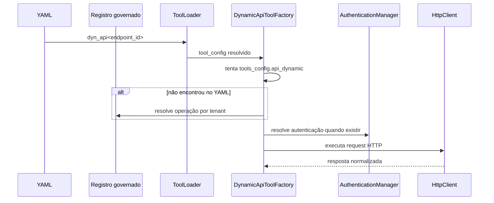

# API Dinâmica

Este documento cobre a família dyn_api, usada para expor endpoints HTTP
aprovados para agentes e workflows.

## O que essa família resolve

Ela evita criar uma integração nova em código para cada endpoint externo
que possa ser descrito por contrato.

No runtime atual, dyn_api também pode resolver operação publicada em
registro governado por tenant quando ela não está no YAML local.

## Leitura relacionada

- Guia geral de tools: [GUIA-USUARIO-TOOLS.md](./GUIA-USUARIO-TOOLS.md)
- Catálogo governado por tenant: [README-INTEGRACOES-GOVERNADAS.md](./README-INTEGRACOES-GOVERNADAS.md)
- SQL dinâmico e procedures: [README-DYNAMIC-SQL-TOOLS.md](./README-DYNAMIC-SQL-TOOLS.md)
- Tools por finalidade: [tools/por_finalidade.md](./tools/por_finalidade.md)
- Catálogo alfabético: [tools/alfabetica.md](./tools/alfabetica.md)

## Sintaxe pública no YAML

- dyn_api<endpoint_id>

O modo parametrizado é o caminho mais seguro porque entrega apenas o
endpoint necessário ao agente.

## Ordem real de resolução

O runtime tenta primeiro tools_config.api_dynamic.endpoints.
Se o endpoint não existir no YAML, ele tenta o registro governado por
tenant.

No caminho persistido, o código exige:

- user_session.tenant_id;
- publish_to_agents=true;
- protocol_type=rest_json.

Se houver auth_profile_id, o perfil de autenticação também precisa ser
resolvido.

## Onde a configuração vive

O bloco principal dessa família é tools_config.api_dynamic.

As partes mais importantes são:

- endpoints;
- authentications.

O endpoint pode descrever método, URL, parâmetros de path, query, body,
headers, timeout e autenticação.

## Como a execução é montada

## Guardrails importantes

- nome interno com prefixo esperado;
- endpoint_id obrigatório;
- URL obrigatória;
- autenticação válida quando o endpoint declara authentication;
- validação de parâmetros antes da chamada externa;
- retry e timeout no cliente HTTP.

No registro governado, dyn_api falha fechado para protocol_type fora de
rest_json.

## Autenticação e cache

Quando o endpoint exige autenticação, a família usa
AuthenticationManager.

Na prática, isso traz três efeitos importantes:

- token pode ser reaproveitado;
- placeholders em headers podem usar security_keys;
- erro de autenticação fica separado de erro de rede ou de cadastro.

## Contrato de parâmetros

A factory monta schema dinâmico para path, query e body.
Isso reduz inventação de campos fora do contrato.

Em linguagem simples: se o agente tentar mandar parâmetro que não existe
ou esquecer um obrigatório, a falha deve acontecer antes da API externa.

## Quando usar dyn_api e quando não usar

- Use dyn_api quando o endpoint for conhecido e o contrato for
    declarativo.
- Evite dyn_api quando a integração exigir fluxo altamente customizado,
    transformação pesada de resposta ou política de segurança que o YAML
    não consiga descrever com clareza.

## Como validar

1. Confirme se o endpoint está no YAML ou no registro governado.
2. Se vier do registro, confirme tenant_id, publish_to_agents e
     protocol_type.
3. Confirme se método, URL e timeout fazem sentido.
4. Confirme se a autenticação foi resolvida.
5. Em runtime, siga o correlation_id para separar erro de cadastro,
     autenticação e rede.

## Evidência no código

- src/agentic_layer/tools/domain_tools/dynamic_api_tools/dynamic_api_factory.py
- src/agentic_layer/tools/domain_tools/dynamic_tool_registry_resolver.py
- src/agentic_layer/tools/domain_tools/dynamic_api_tools/auth_manager.py
- src/agentic_layer/tools/domain_tools/dynamic_api_tools/http_client.py
- src/agentic_layer/supervisor/tool_loader.py
- src/integrations/repository.py

## Lacunas no código

Não encontrado no código.

Onde deveria estar:

- uma visão administrativa única para diagnosticar endpoint, auth
    profile e publicação para agentes no mesmo painel;
- um inventário consolidado das operações dyn_api disponíveis por
    tenant.
