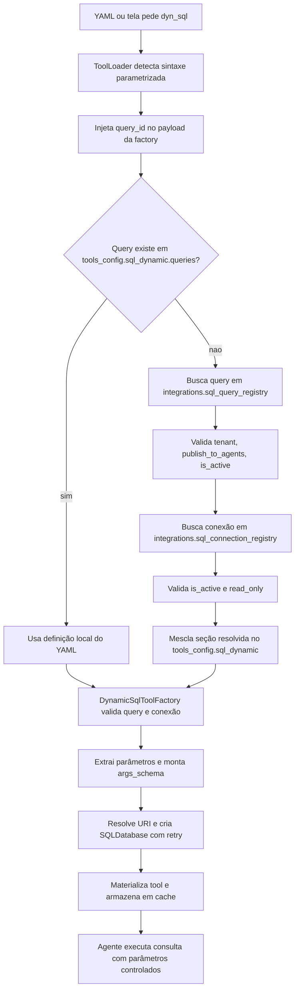

# Manual técnico, executivo, comercial e estratégico: Dyn SQL

## 1. O que é esta feature

Dyn SQL é a capacidade da plataforma de transformar uma consulta SQL previamente aprovada em uma tool utilizável por agentes, workflows e experiências AG-UI sem exigir uma implementação nova em Python para cada consulta.

Em vez de criar uma classe ou endpoint dedicado para cada relatório, filtro ou lookup, o sistema guarda a definição governada da consulta, associa essa consulta a uma conexão técnica e materializa a tool apenas quando o YAML pede algo como `dyn_sql<query_id>`.

Em linguagem simples, Dyn SQL é o mecanismo que permite dizer ao runtime: “use esta consulta que já foi cadastrada, revisada e aprovada”, sem mandar SQL livre do usuário para o agente.

## 2. Que problema ela resolve

Sem Dyn SQL, cada nova necessidade de leitura em banco tenderia a cair em uma destas alternativas ruins:

- criar código novo para cada consulta recorrente;
- deixar SQL espalhada em YAMLs gigantes;
- permitir SQL livre sem governança;
- duplicar a mesma consulta em vários agentes e telas.

Dyn SQL resolve esse problema convertendo consulta aprovada em ativo reutilizável. A query fica registrada de forma rastreável, com limites de timeout, formato de retorno, conexão associada, schema de parâmetros, status operacional e decisão explícita sobre publicação para agentes.

O ganho prático é separar duas coisas que não deveriam estar misturadas:

- a definição governada da consulta;
- a execução contextual dessa consulta por um agente.

## 3. Visão conceitual

Conceitualmente, Dyn SQL não é “geração de SQL”. Ele é “materialização segura de SQL conhecida”.

O centro da feature é este:

- a consulta já existe;
- a consulta foi cadastrada com código estável;
- a conexão técnica já foi aprovada;
- a publicação para agentes pode ser ligada ou desligada;
- o runtime só transforma isso em tool quando o contexto autorizado pede.

Essa diferença é importante porque separa Dyn SQL de duas famílias irmãs.

Dyn SQL não é NL2SQL. NL2SQL propõe uma query a partir de linguagem natural. Dyn SQL executa uma query previamente governada.

Dyn SQL também não é Dyn API. Dyn API materializa operações HTTP governadas. Dyn SQL materializa consultas de banco governadas.

## 4. Visão tática

Taticamente, Dyn SQL é a escolha certa quando a organização já sabe quais perguntas de dados quer responder com frequência e quer colocá-las no runtime agentic sem abrir espaço para SQL improvisada.

Ele é especialmente útil para:

- consultas repetidas em agentes especialistas;
- painéis AG-UI que dependem de fontes confiáveis de dados;
- lookups operacionais com parâmetros controlados;
- relatórios por tenant com forte governança;
- cenários em que a equipe precisa publicar ou retirar consultas do runtime sem novo deploy de código.

## 5. Visão técnica

Tecnicamente, Dyn SQL funciona como uma factory parametrizada registrada no catálogo builtin da plataforma. O catálogo base expõe a sintaxe pública `dyn_sql<query_id>`, e a factory resolve esse identificador para uma consulta concreta.

Essa resolução pode seguir dois caminhos.

### 5.1. Caminho local no YAML

Se o `query_id` existir em `tools_config.sql_dynamic.queries`, o runtime usa o YAML atual como fonte de verdade imediata.

### 5.2. Caminho governado no registro persistido

Se o `query_id` não estiver no YAML local, o runtime tenta resolver a query no catálogo persistido do tenant. Nesse caso, ele exige `user_session.tenant_id`, query ativa e publicada para agentes, e conexão SQL ativa marcada como somente leitura.

Em linguagem simples, o YAML manda primeiro. O banco de governança entra quando a query não foi carregada localmente, mas já existe publicada para aquele tenant.

## 6. Visão executiva

Para liderança, Dyn SQL reduz o custo operacional de evoluir a camada de dados usada por agentes sem transformar cada nova consulta em projeto de software.

O valor executivo não está apenas em velocidade. Está em governança. A plataforma cria um caminho controlado para publicar consultas reutilizáveis, limitar conexões a leitura, desativar rapidamente o que não deve continuar em produção e manter rastreabilidade por tenant.

## 7. Visão comercial

Comercialmente, Dyn SQL responde a uma dor recorrente de clientes que querem agentes conectados ao dado real, mas não aceitam abrir o banco para execução livre.

O discurso comercial forte não é “o agente roda qualquer SQL”. O discurso correto é: “a plataforma executa somente consultas previamente governadas, com publicação controlada, conexão técnica separada e possibilidade de reutilização em múltiplos fluxos”.

Isso é especialmente relevante em contas com times de BI, operações, atendimento, varejo e backoffice, onde a pergunta de negócio é recorrente, mas a governança de acesso ao banco é rígida.

## 8. Visão estratégica

Estratégicamente, Dyn SQL fortalece a plataforma porque transforma consultas aprovadas em ativos reutilizáveis do ecossistema agentic.

Isso reduz acoplamento entre produto e código, melhora a governança por tenant e prepara o terreno para experiências mais ricas, como AG-UI e workflows, sem depender de duplicação de lógica ou de SQL embutida em vários pontos do sistema.

## 9. O que Dyn SQL não é

Entender o que a feature não faz evita erro de desenho.

- Não é gerador de SQL via LLM.
- Não é executor de SQL arbitrária enviada pelo browser.
- Não é fallback para conexão de escrita.
- Não é atalho para burlar publicação ou tenant.
- Não substitui Dyn API quando a fonte correta é HTTP.

## 10. Conceitos necessários para entender

### 10.1. `query_id`

É o identificador lógico da consulta que o YAML pede quando usa `dyn_sql<query_id>`.

### 10.2. `query_code`

No registro persistido, esse é o código estável da query em `integrations.sql_query_registry`. Na prática, é o identificador publicado que o resolvedor usa ao procurar uma consulta governada.

### 10.3. `connection_id`

É o vínculo técnico entre a query e a conexão SQL cadastrada.

### 10.4. `publish_to_agents`

É a trava administrativa que decide se a consulta pode virar tool no runtime agentic.

### 10.5. `read_only`

É a política da conexão SQL governada. Para Dyn SQL por registro persistido, a conexão precisa estar marcada como somente leitura.

### 10.6. `parameter_schema_json`

É o schema administrativo dos parâmetros aceitos pela consulta. Ele ajuda a montar o contrato da tool.

### 10.7. Factory parametrizada

É uma factory base cadastrada uma vez no catálogo builtin, mas capaz de materializar muitas tools concretas a partir do parâmetro passado na sintaxe curta.

## 11. Como a feature funciona por dentro

O fluxo real começa quando um YAML, supervisor, workflow ou tela AG-UI pede uma tool como `dyn_sql<clientes_ativos>`.

O `ToolLoader` detecta a sintaxe parametrizada, separa a base `dyn_sql` do parâmetro e injeta esse valor no `tool_config` com a chave correta, que para essa família é `query_id`.

Depois disso, a factory `create_dynamic_sql_tool` recebe o payload completo de execução.

Se o `query_id` existir em `tools_config.sql_dynamic.queries`, a factory resolve a consulta localmente.

Se não existir, a factory chama `DynamicToolRegistryResolver.resolve_sql_dynamic_section(query_id)` para buscar a definição governada no registro persistido.

Quando a query vem do registro, a factory mescla o resultado no bloco `tools_config.sql_dynamic`, como se a consulta sempre tivesse estado no YAML. Isso é importante porque mantém o restante do pipeline igual, reduzindo bifurcação de comportamento.

Depois da resolução, a `DynamicSqlToolFactory` valida prefixo, `query_id`, `connection_id`, SQL, parâmetros e conexão.

Em seguida, ela:

- extrai placeholders do SQL, como `@p1`, `@p2`;
- constrói dinamicamente o schema Pydantic da tool;
- resolve a URI de conexão por `uri` direta ou `secret_key`;
- cria `SQLDatabase` com retry;
- monta uma tool estruturada com execução isolada por chamada;
- usa o `resource_pool` para cache thread-safe da tool materializada.

## 12. Divisão em etapas ou submódulos

### 12.1. Catálogo builtin da factory base

O catálogo builtin registra a existência da família `dyn_sql` como factory parametrizada. Isso não guarda cada consulta concreta. Guarda a capacidade de materializar consultas concretas.

Valor entregue: o runtime sabe que `dyn_sql<...>` é uma sintaxe válida e qual factory deve ser chamada.

### 12.2. Catálogo governado de conexões

As conexões SQL persistidas ficam em `integrations.sql_connection_registry`.

Valor entregue: desacoplar segredo, engine, defaults e política de leitura da definição da query.

### 12.3. Catálogo governado de queries

As queries persistidas ficam em `integrations.sql_query_registry`.

Valor entregue: transformar consultas aprovadas em ativos operacionais publicáveis.

### 12.4. Resolvedor de registro dinâmico

O `DynamicToolRegistryResolver` converte o registro persistido em configuração consumível pela factory.

Valor entregue: permitir fallback do YAML para o banco sem reescrever a factory nem inventar um segundo runtime.

### 12.5. Factory de materialização

A `DynamicSqlToolFactory` materializa a tool concreta a partir da consulta resolvida.

Valor entregue: criar tool com contrato de entrada consistente, retry, cache e execução segura.

### 12.6. Workbench administrativo

A UI administrativa de SQL governado permite cadastrar, editar, testar e publicar queries e procedures.

Valor entregue: governança operacional sem depender de edição manual de banco ou YAML para cada ajuste.

## 13. Onde a feature armazena os dados

Este é um ponto central do pedido: Dyn SQL não vive só em memória. Ele usa tabelas persistidas de governança.

### 13.1. `integrations.sql_connection_registry`

Armazena a conexão técnica usada pelas queries governadas.

Os campos confirmados no código incluem:

- `sql_connection_id`
- `tenant_id`
- `connection_code`
- `db_engine`
- `connection_mode`
- `secret_ref`
- `connection_string_encrypted`
- `default_database_name`
- `default_schema_name`
- `validation_query`
- `read_only`
- `is_active`
- `metadata_json`

Na prática, essa tabela responde à pergunta: “em qual banco, em qual modo e sob qual política esta família de queries pode rodar?”.

### 13.2. `integrations.sql_query_registry`

Armazena a definição governada da query.

Os campos confirmados no código incluem:

- `sql_query_id`
- `tenant_id`
- `query_code`
- `name`
- `description`
- `group_id`
- `connection_id`
- `query_kind`
- `sql_text`
- `parameter_schema_json`
- `result_format`
- `max_rows`
- `timeout_seconds`
- `publish_to_agents`
- `is_active`
- `metadata_json`

Na prática, essa tabela responde à pergunta: “qual consulta o agente pode usar, em qual conexão, com quais parâmetros e sob quais limites?”.

### 13.3. `integrations.sql_procedure_registry`

É a tabela da família irmã `proc_sql`, usada para procedures governadas. Ela não é o foco principal de Dyn SQL, mas faz parte do mesmo bounded context administrativo.

### 13.4. `integrations.integration_group_registry`

Serve para agrupamento funcional opcional das queries e procedures.

## 14. Regras de governança confirmadas no código

O runtime fechado do registro persistido impõe regras explícitas.

### 14.1. Tenant obrigatório

Se a query não estiver no YAML local e o runtime precisar buscar no banco, `user_session.tenant_id` é obrigatório. Sem tenant explícito, a resolução falha fechado.

### 14.2. Query precisa estar ativa

Registro inativo não pode virar tool.

### 14.3. Query precisa estar publicada para agentes

Sem `publish_to_agents=true`, a query existe administrativamente, mas não entra no runtime agentic.

### 14.4. Conexão precisa estar ativa

Conexão inativa bloqueia a materialização.

### 14.5. Conexão precisa ser somente leitura

Dyn SQL via registro persistido exige `read_only=true` na conexão SQL. Isso é uma proteção estrutural, não apenas convenção de uso.

## 15. Contrato público e sintaxe

O contrato público da family é a sintaxe parametrizada:

- `dyn_sql<query_id>`

O `ToolLoader` mapeia `dyn_sql` para a chave `query_id` no payload da factory.

Em seguida, a tool materializada recebe um nome interno no formato `dyn_sql_<query_id>`.

## 16. Como os parâmetros funcionam

Dyn SQL extrai placeholders do SQL no formato `@p1`, `@p2`, `@p3` e os converte para parâmetros nomeados compatíveis com a execução via SQLAlchemy.

O schema da tool é montado dinamicamente a partir de:

- parâmetros encontrados no SQL;
- descrições e tipos presentes em `parameter_schema_json` ou no bloco YAML equivalente.

Isso é importante porque evita duas fragilidades comuns:

- chamar a tool sem parâmetros obrigatórios;
- transformar a execução em concatenação livre de string.

## 17. Cache, retry e concorrência

Dyn SQL foi desenhado para execução concorrente e reaproveitamento seguro.

Os pontos relevantes confirmados no código são:

- chave de cache específica por tenant, query, conexão e conteúdo SQL;
- cache da tool materializada no `resource_pool`;
- retry para criação de conexão e para execução SQL diante de falhas transitórias de banco;
- isolamento por configuração única da tool.

Em linguagem simples, a plataforma tenta não reconstruir a mesma tool a cada chamada e também tenta resistir melhor a falhas transitórias de infraestrutura.

## 18. Relação com AG-UI

Dyn SQL já aparece como fonte governada real em experiências AG-UI do repositório.

Os dashboards e demos de varejo declaram explicitamente fontes `dyn_sql` e deixam claro que o browser não envia SQL livre. O front envia apenas a intenção/capability e o runtime materializa a query governada correspondente.

Esse detalhe é estrategicamente importante: AG-UI consome dado governado, não query textual vinda da interface.

## 19. Fluxo principal ponta a ponta

Esse diagrama mostra por que o comportamento é governado. A tool não nasce de SQL aleatória. Ela nasce de uma consulta previamente resolvida e validada.

## 20. O que acontece em caso de sucesso

No caminho feliz, o runtime:

- identifica corretamente o `query_id`;
- resolve a query no YAML ou no catálogo persistido;
- resolve a conexão técnica;
- cria a tool com nome `dyn_sql_<query_id>`;
- executa a consulta com parâmetros controlados;
- devolve o resultado no formato configurado.

Quando a origem é registro persistido, o sistema ainda registra em log que a tool foi resolvida pelo catálogo governado do tenant.

## 21. O que acontece em caso de erro

Os erros mais relevantes confirmados no código são estes.

### 21.1. `query_id` ausente

Sem `query_id`, a factory parametrizada não sabe qual consulta materializar.

### 21.2. Query não encontrada

Se o `query_id` não existir nem no YAML nem no registro persistido, a materialização falha.

### 21.3. Tenant ausente para fallback persistido

Se a query não estiver no YAML e faltar `user_session.tenant_id`, o runtime falha fechado para evitar vazamento entre tenants.

### 21.4. Query não publicada

Se `publish_to_agents=false`, a query não vira tool agentic.

### 21.5. Conexão não somente leitura

Se a conexão governada não estiver com `read_only=true`, Dyn SQL por registro persistido bloqueia a resolução.

### 21.6. SQL vazia ou conexão inválida

SQL vazia, conexão inexistente, `secret_key` sem valor ou URI ausente também bloqueiam a materialização.

## 22. Observabilidade e diagnóstico

Dyn SQL produz sinais úteis para investigação.

Os principais pontos observáveis confirmados são:

- logs do `ToolLoader` ao detectar tool parametrizada;
- logs da factory com `query_id`, nome da tool e origem da resolução;
- logs do resolvedor de registro informando tenant, `query_code` e `connection_code`;
- chave de cache específica por tenant e query;
- `correlation_id` propagado na factory.

Na prática, quando uma query não materializa, a investigação começa perguntando:

- a query estava no YAML ou só no banco?
- havia `tenant_id`?
- `publish_to_agents` estava ligado?
- a conexão estava ativa e em `read_only`?
- o segredo da conexão estava acessível via `security_keys`?

## 23. Vantagens práticas

As vantagens reais observadas no desenho da feature são estas.

- reduz necessidade de criar código novo para cada consulta recorrente;
- evita SQL livre no runtime agentic;
- permite governar publicação de queries por tenant;
- mantém a conexão técnica separada da definição da consulta;
- dá precedência ao YAML local quando o fluxo precisa ser fechado no contexto atual;
- oferece fallback governado para catálogo persistido;
- favorece reuso em AG-UI, agentes e workflows;
- suporta cache, retry e execução concorrente.

## 24. Exemplos práticos guiados

### 24.1. Query publicada para agentes

Cenário: uma equipe cadastra `clientes_ativos` no catálogo, liga `publish_to_agents` e associa a query a uma conexão somente leitura.

O que acontece: qualquer YAML que declare `dyn_sql<clientes_ativos>` pode materializar essa consulta sem duplicar a SQL no próprio YAML, desde que o tenant corresponda.

### 24.2. Query existente só no YAML

Cenário: um supervisor local traz uma consulta específica em `tools_config.sql_dynamic.queries`.

O que acontece: a factory usa a definição local e não consulta o registro persistido.

Valor prático: o contrato YAML-first continua com precedência quando esse é o desenho desejado.

### 24.3. Query não publicada

Cenário: a query existe no catálogo, mas a revisão humana ainda não terminou e `publish_to_agents=false`.

O que acontece: o registro existe administrativamente, porém não vira tool para agentes.

Valor prático: a plataforma separa cadastro técnico de liberação para runtime.

### 24.4. Conexão com escrita

Cenário: a query está certa, mas a conexão governada foi cadastrada sem `read_only`.

O que acontece: o resolvedor bloqueia a materialização quando a origem é o registro persistido.

Valor prático: a proteção não depende só de disciplina humana; ela está no contrato do runtime.

## 25. Explicação 101

Pense em Dyn SQL como um catálogo de consultas aprovadas com nome próprio.

Em vez de dizer ao agente “invente uma query”, você diz “use esta consulta cadastrada aqui”. O sistema procura essa consulta, confere se ela pode ser usada por agentes, verifica a conexão correta e só então transforma isso em ferramenta executável.

É a diferença entre dar liberdade total ao agente para escrever no banco e entregar a ele um conjunto de consultas já governadas.

## 26. Limites e pegadinhas

Existem limites importantes que não devem ser escondidos.

- Dyn SQL não substitui revisão da própria consulta cadastrada.
- `publish_to_agents=true` não corrige SQL mal escrita.
- o fallback persistido depende de `tenant_id` explícito;
- a precedência do YAML significa que um contexto local pode sobrescrever a consulta publicada;
- Dyn SQL governa execução de consulta conhecida, não descoberta automática de schema;
- se a necessidade é chamar API externa, a família correta é Dyn API, não Dyn SQL.

## 27. Troubleshooting

### 27.1. A tool não aparece no runtime

Sintoma: `dyn_sql<query_id>` foi declarado, mas a tool não materializa.

Causas prováveis: query ausente no YAML e no catálogo, `tenant_id` ausente, `publish_to_agents=false` ou conexão inativa.

### 27.2. A query existe no admin, mas o agente não usa

Sintoma: o item aparece na UI administrativa, mas falha na resolução por agente.

Causa provável: cadastro administrativo concluído sem publicação para agentes.

### 27.3. A query publicada continua bloqueando

Sintoma: mesmo publicada, a tool não resolve.

Causa provável: conexão associada sem `read_only=true`, segredo ausente em `security_keys` ou registro de conexão inativo.

### 27.4. O retorno vem estranho ou limitado

Sintoma: menos linhas do que esperado ou formato diferente.

Causa provável: `max_rows`, `result_format`, `fetch_mode` ou `include_columns` definidos na configuração governada.

## 28. Impacto técnico

Dyn SQL reforça a separação entre catálogo governado e runtime agentic, reduz espalhamento de SQL e melhora a capacidade de reuso com baixo acoplamento.

## 29. Impacto executivo

Dyn SQL diminui dependência de deploy para publicar consultas recorrentes e melhora o controle de risco ao exigir conexão somente leitura e publicação explícita.

## 30. Impacto comercial

Dyn SQL viabiliza vender integração com dados internos sem prometer execução livre de SQL, o que é muito mais aceitável para clientes com governança forte.

## 31. Impacto estratégico

Dyn SQL posiciona a plataforma como camada de orquestração governada sobre ativos de dados já conhecidos, preparando terreno para AG-UI, copilotos corporativos e fluxos agentic com menor risco operacional.

## 32. Checklist de entendimento

- Entendi que Dyn SQL materializa consulta conhecida, não gera SQL nova.
- Entendi a diferença entre YAML local e catálogo persistido.
- Entendi para que servem `integrations.sql_connection_registry` e `integrations.sql_query_registry`.
- Entendi o papel de `publish_to_agents`.
- Entendi por que a conexão precisa ser `read_only` no registro persistido.
- Entendi a sintaxe `dyn_sql<query_id>`.
- Entendi como a tool vira fonte governada para AG-UI.
- Entendi os limites e as causas comuns de bloqueio.

## 33. Evidências no código

- `src/agentic_layer/tools/domain_tools/dynamic_sql_tools/dynamic_sql_factory.py`
  - Motivo da leitura: núcleo da materialização de Dyn SQL.
  - Comportamento confirmado: precedência do YAML, fallback para registro persistido, validação de `query_id`, `connection_id`, SQL, parâmetros, retry, cache e nome interno `dyn_sql_<query_id>`.

- `src/agentic_layer/tools/domain_tools/dynamic_tool_registry_resolver.py`
  - Motivo da leitura: resolução do catálogo persistido.
  - Comportamento confirmado: uso de `integrations.sql_query_registry` e `integrations.sql_connection_registry`, exigência de `tenant_id`, `publish_to_agents`, `is_active` e `read_only`.

- `src/agentic_layer/supervisor/tool_loader.py`
  - Motivo da leitura: parser da sintaxe parametrizada.
  - Comportamento confirmado: `dyn_sql<query_id>` é mapeada para a chave `query_id` no payload da factory.

- `src/agentic_layer/tools/tools_library_builder.py`
  - Motivo da leitura: registro da factory base no catálogo builtin.
  - Comportamento confirmado: `dyn_sql` é adicionado manualmente como factory parametrizada base com sintaxe pública `dyn_sql<query_id>`.

- `src/integrations/repository.py`
  - Motivo da leitura: persistência do catálogo técnico.
  - Comportamento confirmado: criação, listagem, carga e atualização das tabelas `integration_group_registry`, `sql_connection_registry`, `sql_query_registry` e `sql_procedure_registry`.

- `src/integrations/models.py`
  - Motivo da leitura: contrato validado dos registros.
  - Comportamento confirmado: `db_engine`, `connection_mode`, `publish_to_agents`, `query_kind`, `result_format`, `timeout_seconds` e demais campos fazem parte do bounded context de integrações.

- `src/api/schemas/admin_integrations_models.py`
  - Motivo da leitura: contratos administrativos HTTP.
  - Comportamento confirmado: payloads e responses expõem campos de conexão, query, publicação, timeout, parâmetros e metadados.

- `app/ui/static/ui-admin-plataforma-sql-natural.html`
  - Motivo da leitura: workbench administrativo da feature.
  - Comportamento confirmado: cadastro, edição, teste seguro, publicação e ativação de queries governadas.

- `tests/unit/test_dynamic_sql_tools.py`
  - Motivo da leitura: garantias comportamentais.
  - Comportamento confirmado: precedência do YAML sobre o banco, fallback para o registro persistido e falha fechada quando falta `tenant_id`.

- `app/ui/static/ui-admin-plataforma-ag-ui-vendas-cockpit.html`
  - Motivo da leitura: uso real em experiência AG-UI.
  - Comportamento confirmado: a tela declara explicitamente que usa apenas queries `dyn_sql` governadas.
