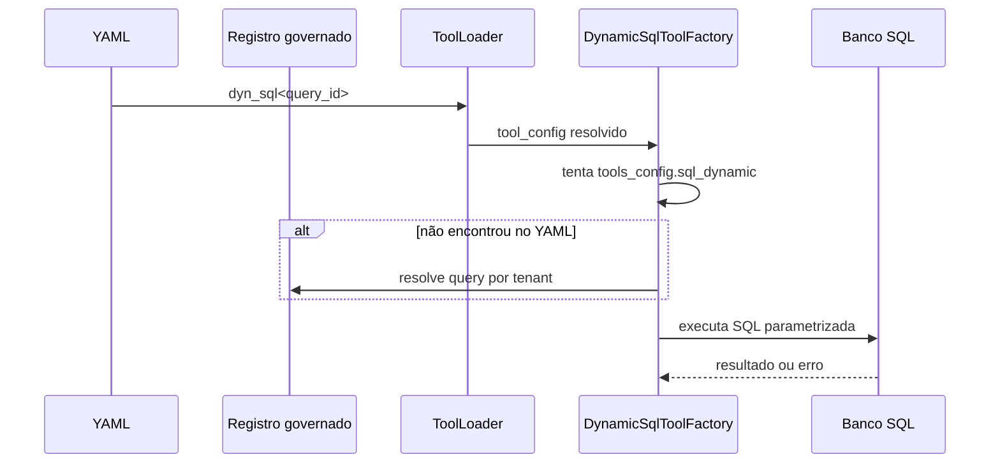
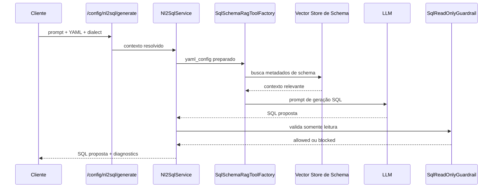

# SQL Dinâmico e Procedures

Este documento cobre a família usada para consultas SQL parametrizadas e
procedures aprovadas.

## O que essa família resolve

Ela permite expor consultas e procedures sem criar um caso de uso novo
em código para cada necessidade.

No runtime atual, dyn_sql também consegue resolver uma query publicada
em registro governado por tenant quando ela não está no YAML ativo.

## Escopo deste documento

Este documento é o dono da família SQL dinâmica e do fluxo dedicado de
NL2SQL.
Ele cobre três usos diferentes, mas relacionados.

- dyn_sql para query parametrizada já conhecida.
- proc_sql para procedure previamente aprovada.
- schema_rag_sql e o endpoint dedicado de NL2SQL para gerar uma SQL
    proposta a partir de linguagem natural e metadados de schema.

Em linguagem simples: aqui moram os caminhos em que o sistema precisa
chegar a SQL, seja porque a SQL já existe, seja porque ela ainda precisa
ser sugerida com ajuda do LLM.

## Leitura relacionada

- Guia geral de tools: [GUIA-USUARIO-TOOLS.md](./GUIA-USUARIO-TOOLS.md)
- Catálogo governado por tenant: [README-INTEGRACOES-GOVERNADAS.md](./README-INTEGRACOES-GOVERNADAS.md)
- APIs dinâmicas como família irmã: [README-DYNAMIC-API-TOOLS.md](./README-DYNAMIC-API-TOOLS.md)
- Tools por finalidade: [tools/por_finalidade.md](./tools/por_finalidade.md)
- Catálogo alfabético: [tools/alfabetica.md](./tools/alfabetica.md)

## Sintaxe pública no YAML

- dyn_sql<query_id>
- proc_sql<procedure_id>

O tool_loader lê essa forma curta e entrega o identificador para a
factory certa.

## Ordem real de resolução

Para dyn_sql, o runtime tenta primeiro o YAML local.
Se a query não estiver em tools_config.sql_dynamic.queries, ele tenta o
registro governado por tenant.

No caminho persistido, o código exige:

- user_session.tenant_id;
- query publicada para agentes;
- conexão ativa e somente leitura.

Em linguagem simples: o YAML tem precedência, e o banco entra como
catálogo governado de fallback.

## O que a factory precisa encontrar

O bloco principal desta família é tools_config.sql_dynamic.

As peças mais importantes são:

- connections;
- queries.

Para uma tool concreta, a resolução precisa chegar a um query_id e a um
connection_id válidos.

## Como a execução é montada

## Guardrails importantes

- nome interno da tool com prefixo esperado;
- query_id e connection_id obrigatórios;
- SQL não vazio;
- validação de parâmetros extraídos do template SQL;
- retry para falha transitória de banco;
- cache da tool no resource pool.

Além disso, no registro governado, dyn_sql exige publish_to_agents=true
e conexão read_only=true.

## Parâmetros

A factory extrai placeholders como p1, p2 e p3 e monta o schema da
entrada da tool.

Isso reduz dois riscos práticos:

- parâmetro obrigatório faltar na chamada;
- SQL final ser montada por concatenação textual livre.

## Procedures

proc_sql continua na mesma família, mas representa outro caso de uso.
O foco deixa de ser consulta parametrizada e passa a ser uma procedure
previamente aprovada.

Na prática, não trate procedure como se fosse só uma query com outro
nome.

## Onde entra o NL2SQL

NL2SQL não é dyn_sql com outro nome.
Ele também não é execução cega de linguagem natural direto no banco.

O fluxo dedicado atual passa pelo endpoint:

- POST /config/nl2sql/generate

Esse endpoint resolve o YAML necessário, chama Nl2SqlService e devolve
uma SQL proposta com diagnósticos para revisão humana.

Boa prática importante:
o contrato já nasce orientado a revisão.
Mesmo no caminho feliz, o resultado continua sendo proposta assistida,
não autorização automática de execução.

## Arquitetura real do NL2SQL

O caminho atual de NL2SQL tem camadas bem definidas.

- o router resolve correlation_id, permissão e origem do YAML;
- o service valida prompt, user_email e dialeto SQL;
- o service normaliza user_session e schema_metadata no yaml_config;
- SqlSchemaRagToolFactory recupera metadados relevantes do schema;
- o LLM gera a proposta de SQL;
- o guardrail central valida se a consulta é somente leitura;
- a resposta volta com diagnósticos e contexto de revisão.

Em linguagem simples: primeiro o sistema monta o contexto técnico do
banco, depois rascunha a consulta e só no final decide se aquela saída
pode ser mostrada como proposta segura para revisão.

## Etapa 1: resolução do contexto YAML

O endpoint dedicado de NL2SQL aceita mais de uma origem de contexto.

- yaml_config já em memória no payload;
- yaml_config_path;
- yaml_inline_content;
- encrypted_data.

Isso permite atender interface administrativa e automação sem duplicar o
motor central.

Boa prática importante:
o router resolve primeiro o contexto e só depois chama o service. Assim,
o boundary HTTP continua responsável pelo envelope da requisição, e não
pela geração da SQL em si.

## Etapa 2: validação operacional do pedido

Nl2SqlService falha cedo quando algum item estrutural está ausente.

Os bloqueios mais importantes observados no código são estes:

- yaml_config precisa ser um mapeamento válido;
- prompt precisa estar preenchido;
- user_email precisa existir;
- dialect precisa ser postgresql, mysql ou mssql;
- schema_metadata.vectorstore_id é obrigatório.

Boa prática importante:
o fluxo não tenta adivinhar dialeto nem inventar vectorstore.
Quando falta configuração obrigatória, ele falha de forma explícita e
revisável.

## Etapa 3: preparação do YAML para o motor schema_rag_sql

Antes de criar a tool, o service ajusta o yaml_config de trabalho.
Ele garante dois pontos:

- user_session recebe user_email e correlation_id;
- schema_metadata recebe o sql_dialect normalizado.

Isso permite que o motor schema_rag_sql trabalhe com um contrato
estável, sem depender do formato exato em que o YAML chegou pelo
endpoint.

Em linguagem simples: o service organiza a mesa antes de chamar o motor
de geração.

## Etapa 4: recuperação semântica dos metadados de schema

O coração técnico do NL2SQL está em SqlSchemaRagToolFactory.
Ela não gera SQL no escuro.
Primeiro busca, no vector store de metadados, os documentos de schema
mais relevantes para a pergunta do usuário.

Essa é uma aplicação prática de RAG ao domínio SQL.
O LLM não recebe o banco inteiro. Ele recebe um recorte do contexto com
tabelas, colunas, relacionamentos e descrições relevantes para a
pergunta.

Boa prática importante:
o contexto de schema tem limite operacional de caracteres.
Se passar do teto, o runtime trunca o conteúdo e registra esse fato nos
diagnósticos.

## Etapa 5: geração da SQL pelo LLM

Depois da recuperação de schema, a factory monta um prompt especializado
para geração SQL.
Esse prompt já restringe o espaço de saída, por exemplo:

- usar só tabelas e colunas presentes no contexto;
- preferir joins explícitos quando necessários;
- produzir uma única sentença SQL;
- evitar comandos administrativos ou mutáveis.

Em linguagem simples: o LLM não recebe liberdade total para escrever o
que quiser. Ele recebe uma tarefa estreita, com contexto e regras.

## Etapa 6: limpeza da resposta e guardrail de leitura

Quando o LLM responde, a SQL ainda não é tratada como pronta.
Primeiro o service remove code fences quando existirem.
Depois passa a consulta pelo SqlReadOnlyGuardrail.

Esse guardrail é a peça mais importante da segurança operacional do
fluxo.
Se a SQL não for validada como somente leitura, o endpoint bloqueia a
resposta bem-sucedida e registra a causa nos diagnósticos.

Boa prática importante:
o sistema não confunde SQL plausível com SQL aceitável para revisão.

## Etapa 7: resposta revisável e diagnósticos

Mesmo quando a geração dá certo, o endpoint não devolve só o texto da
SQL.
Ele também devolve contexto de revisão, como:

- vectorstore_id usado;
- top_k aplicado;
- origem do contexto YAML;
- resumo do contexto de schema;
- resultado do guardrail;
- avisos de revisão humana obrigatória.

Em linguagem simples: a resposta tenta mostrar de onde veio a proposta,
para que alguém consiga auditar se a SQL faz sentido ou não.

## Boas práticas reais do NL2SQL

Estas práticas já estão embutidas no fluxo atual.

- o endpoint é de proposta, não de execução;
- o dialeto SQL é explícito e validado;
- a geração usa contexto semântico de schema em vez do banco inteiro;
- o truncamento do contexto volta como diagnóstico observável;
- a SQL só segue adiante quando passa pelo guardrail de leitura;
- a revisão humana continua obrigatória.

## Quando usar cada caminho SQL

- Use dyn_sql quando a query já existe e a tarefa é preencher
    parâmetros.
- Use proc_sql quando a operação precisa passar por procedure aprovada.
- Use NL2SQL quando ainda não existe SQL pronta e você quer uma proposta
    inicial baseada no schema.
- Use schema_rag_sql como motor técnico interno do NL2SQL ou em cenários
    agentic em que a geração assistida faça sentido.

## Como pensar o NL2SQL em linguagem simples

Uma analogia útil é esta:

- dyn_sql é pegar um formulário pronto e preencher os campos.
- proc_sql é chamar um procedimento já autorizado.
- NL2SQL é pedir a um analista assistido que rascunhe a consulta com
    base no catálogo do banco, mas ainda exigindo revisão antes de usar.

Essa analogia ajuda a não misturar geração assistida com execução
operacional.

## Fluxo dedicado de NL2SQL

## Quando usar dyn_sql e quando não usar

- Use dyn_sql quando a query já existe e o agente só precisa preencher
    parâmetros.
- Use proc_sql quando a operação precisa passar por procedure aprovada.
- Use schema_rag_sql quando a entrada é linguagem natural e a SQL ainda
    precisa ser gerada a partir de metadados de schema.

## Como validar

1. Confirme se a query está no YAML ou no registro governado.
2. Se vier do registro, confirme tenant_id, publish_to_agents e
     read_only.
3. Confirme se a conexão foi resolvida.
4. Confirme se os parâmetros esperados batem com a query.
5. Em runtime, siga o correlation_id para separar erro de contrato,
     conexão e SQL.

## Evidência no código

- src/api/routers/config_nl2sql_router.py
- src/api/services/nl2sql_service.py
- src/agentic_layer/tools/domain_tools/dynamic_sql_tools/dynamic_sql_factory.py
- src/agentic_layer/tools/domain_tools/schema_rag_tools/sql_schema_rag_factory.py
- src/agentic_layer/tools/domain_tools/dynamic_tool_registry_resolver.py
- src/agentic_layer/supervisor/tool_loader.py
- src/agentic_layer/tools/tool_config_resolver.py
- src/integrations/repository.py
- src/integrations/sql_read_only_guardrail.py
- src/core/resource_pool.py

## Lacunas no código

Não encontrado no código.

Onde deveria estar:

- uma visão administrativa pronta que una YAML local e registro
    governado na mesma tela de diagnóstico;
- um relatório operacional único das queries publicadas para agentes por
    tenant.
