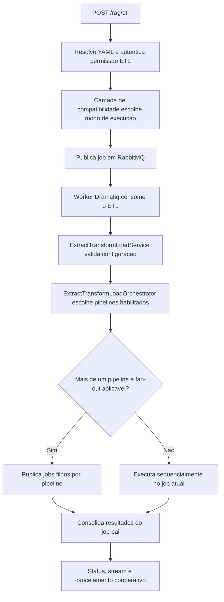
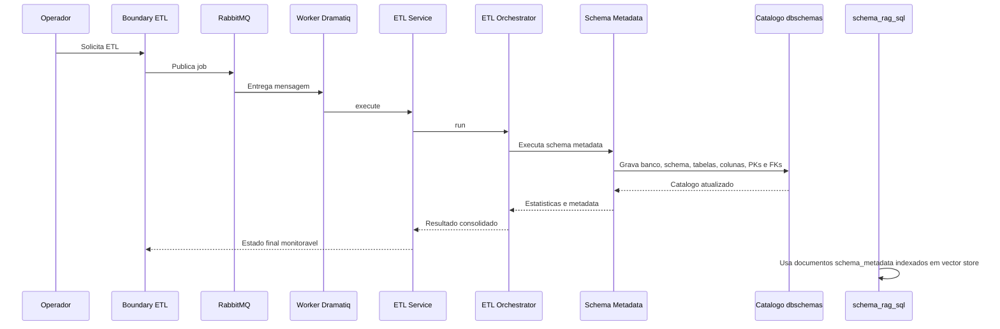

# Manual técnico, executivo, comercial e estratégico: ETL

## 1. O que é esta feature

Neste repositório, ETL é uma capacidade dedicada da plataforma para extrair, transformar e carregar dados estruturados sem passar pelo pipeline documental de ingestão.

Ele existe como um domínio próprio, com endpoint HTTP, service de aplicação, orquestrador, worker assíncrono, cancelamento cooperativo e pipelines especializados.

O ponto mais importante para entender o produto é este: ETL aqui não é apenas “importar dados”. Ele é a esteira operacional usada quando a plataforma precisa captar estrutura de fontes externas e transformá-la em ativos internos reutilizáveis.

No runtime atual, esse domínio cobre duas famílias principais.

1. Pipelines externos da família Apify, voltados a dados estruturados de hospitality.
2. Pipeline de schema metadata, voltado à leitura de tabelas, colunas e relacionamentos de bancos relacionais.

É esse segundo caminho que interessa diretamente para apoiar NL2SQL.

## 2. Que problema ela resolve

Sem ETL dedicado, a plataforma precisaria misturar três problemas diferentes no mesmo fluxo.

1. Aceitar um pedido operacional pela API.
2. Coordenar execução longa, cancelável e monitorável.
3. Interpretar e persistir dados estruturados vindos de fontes muito diferentes.

Isso aumentaria acoplamento, reduziria observabilidade e criaria um risco grande de tratar estrutura de banco de dados como se fosse documento genérico.

O ETL resolve isso separando responsabilidades.

- A API aceita e autentica.
- O runtime assíncrono agenda e monitora.
- O service valida se o YAML permite a execução.
- O orquestrador escolhe apenas os pipelines habilitados.
- Cada pipeline concreto faz seu trabalho especializado.

Para NL2SQL, o ganho prático é ainda mais específico: o produto precisa conhecer o banco antes de tentar sugerir SQL. Esse conhecimento estrutural não nasce de uma pergunta do usuário. Ele precisa ser preparado antes, de forma governada, reprocessável e rastreável.

## 3. Quando ele é usado

O ETL é usado quando a fonte de dados é estruturada e o produto precisa transformar essa estrutura em catálogo interno ou dataset operacional reutilizável.

Os casos confirmados no código são estes.

1. Coleta estruturada via Apify para domínios de hospitality.
2. Extração de metadados de schema de bancos relacionais.
3. Preparação de catálogo técnico de tabelas e colunas no schema dbschemas.
4. Alimentação da base estrutural que sustenta etapas posteriores de schema RAG e NL2SQL.

Em linguagem simples, ETL entra em cena quando o sistema precisa entender dados organizados, não apenas texto solto.

## 4. Visão executiva

Executivamente, ETL importa porque transforma ativos externos em ativos operacionais internos com governança.

- Reduz dependência de intervenção manual para mapear estruturas de dados.
- Torna a preparação de bases técnicas repetível e auditável.
- Permite escala operacional em fluxos de atualização recorrente.
- Melhora previsibilidade de iniciativas de analytics, RAG e NL2SQL.

Para liderança, o valor não é “rodar um job”. O valor é criar uma ponte confiável entre fonte externa e capacidade inteligente da plataforma.

## 5. Visão comercial

Comercialmente, ETL é a capacidade que permite dizer que a plataforma não depende apenas de documentos soltos. Ela também entende estruturas de negócio já existentes, como bancos relacionais, catálogos e fontes externas especializadas.

No caso de NL2SQL, isso responde uma dor concreta de cliente: a empresa já tem banco com tabelas, colunas e relacionamentos, mas precisa transformar esse patrimônio técnico em contexto utilizável por uma camada assistida de geração de SQL.

O benefício tangível é claro.

1. Menor esforço manual para mapear schemas grandes.
2. Melhor base para perguntas em linguagem natural sobre dados corporativos.
3. Menor risco de o time depender de conhecimento tribal sobre o banco.
4. Melhor velocidade de onboarding de novos times técnicos e de negócio.

O que pode ser prometido com base no código: a plataforma já possui ETL dedicado para catalogar schema relacional e isso apoia a preparação do terreno para NL2SQL.

O que não deve ser prometido: o ETL sozinho não é o gerador de SQL. A geração NL2SQL acontece em outro slice, que usa metadados de schema indexados em vector store.

## 6. Visão estratégica

Estratégicamente, o ETL fortalece a plataforma por quatro razões.

1. Mantém dados estruturados fora do pipeline documental.
2. Reforça a arquitetura de jobs assíncronos com cancelamento e monitoramento reais.
3. Separa captura estrutural de consulta inteligente.
4. Cria base para evolução de novos pipelines especializados sem reescrever a fronteira HTTP.

No caso de schema metadata, isso é ainda mais importante porque a plataforma passa a ter uma camada técnica que conhece o banco de forma reutilizável, e não apenas por leitura manual de documentação.

## 7. Conceitos necessários para entender

### 7.1. ETL dedicado

ETL dedicado significa que a plataforma trata extração, transformação e carga como um domínio próprio, com contrato operacional, monitoramento e serviços específicos.

### 7.2. Pipeline filho

Cada pipeline filho é uma esteira concreta, como Booking, Hotels.com, TripAdvisor ou schema metadata. O orquestrador pai coordena, mas não reimplementa a lógica interna de cada filho.

### 7.3. Schema metadata

Schema metadata é o conjunto de informações estruturais de um banco relacional: banco, schema, tabelas, colunas, tipos, chaves primárias e chaves estrangeiras. Isso é o mapa técnico do banco.

### 7.4. Catálogo dbschemas

O ETL de schema metadata grava esse mapa técnico em tabelas internas do schema dbschemas do PostgreSQL destino. Esse catálogo é persistente e serve como ativo técnico reutilizável.

### 7.5. NL2SQL

NL2SQL é a capacidade de receber uma pergunta em linguagem natural e devolver uma proposta de SQL. Para funcionar bem, ele precisa de contexto técnico do schema. O ETL não gera a SQL, mas prepara o terreno estrutural para isso.

### 7.6. Fan-out por pipeline

Quando mais de um pipeline ETL está habilitado, o runtime pode delegar um job filho por pipeline. Isso permite paralelismo operacional sem misturar estados internos de esteiras diferentes.

## 8. Como a feature funciona por dentro

O fluxo real observado no código é este.

1. O operador chama POST /rag/etl.
2. A API resolve o YAML e autentica a operação com permissão de ETL.
3. O boundary HTTP responde no contrato de aceitação assíncrona e delega a execução à camada de compatibilidade do runtime.
4. O runtime escolhe o modo de execução e, no caminho assíncrono, registra o job canônico, publica em RabbitMQ e devolve task_id, polling_url, stream_url e cancel_url.
5. O worker oficial consume o job via Dramatiq.
6. ExtractTransformLoadService valida se o bloco extract_transform_load existe, está habilitado e tem ao menos um subsistema ligado.
7. ExtractTransformLoadOrchestrator verifica quais pipelines concretos estão habilitados no YAML.
8. Se houver múltiplos pipelines e paralelismo efetivo maior que um, o runtime pode fazer fan-out real por pipeline filho.
9. Cada pipeline concreto executa sua própria lógica e devolve subresultado.
10. O resultado final consolida warnings, errors, progresso, metadata e estatísticas.

## 9. Divisão em etapas ou submódulos

### 9.1. Boundary HTTP do ETL

O endpoint dedicado aceita o pedido, resolve o YAML, aplica autorização e entrega a execução à camada compatível com modos síncrono e assíncrono.

O problema que ele resolve é simples: garantir que ETL seja uma operação controlada, autenticada e rastreável, e não uma chamada interna improvisada.

### 9.2. Service de aplicação

ExtractTransformLoadService é a porta de aplicação do ETL. Ele falha cedo quando o bloco extract_transform_load não existe, quando enabled não está verdadeiro ou quando nenhum subsistema foi ligado.

Esse comportamento é importante porque evita ETL “vazio” ou ambiguamente configurado.

### 9.3. Orquestrador

ExtractTransformLoadOrchestrator coordena os pipelines concretos. Ele monta o resultado raiz, chama apenas as esteiras habilitadas, propaga cancelamento e consolida métricas e erros.

Ele não conhece o detalhe de leitura de colunas, de actors externos ou de persistência específica. Ele coordena.

### 9.4. Runtime assíncrono

O ETL roda sobre RabbitMQ com consumo via Dramatiq. O código lido deixa explícito que Redis não é mais backend permitido para ingestão e ETL, e que runtime inline também não é mais permitido como contrato assíncrono oficial.

### 9.5. Fan-out operacional

Quando mais de um pipeline está habilitado, EtlPipelineFanoutCoordinator pode publicar um job filho por pipeline, monitorar cada filho e consolidar tudo no job pai.

Esse desenho melhora escala e evita que uma única execução monolítica esconda o comportamento de cada esteira.

### 9.6. Pipeline schema metadata

Esse é o submódulo central para tabelas de banco e apoio a NL2SQL. Ele lê uma base relacional de origem, interpreta tabelas, colunas, PKs, FKs e amostras opcionais, e grava tudo no catálogo dbschemas do PostgreSQL destino.

## 10. Pipeline schema metadata para ingestão de tabelas de bancos

O pipeline schema metadata existe para transformar o banco de origem em um catálogo técnico interno.

Ele não copia o banco inteiro. Ele extrai estrutura.

O fluxo confirmado no código é este.

1. Valida o YAML de schema metadata.
2. Lê source_database e target_database no contrato novo, quando presentes.
3. Testa conexão com banco de origem e destino.
4. Descobre as tabelas do schema de origem.
5. Filtra tabelas conforme a lista tables, com suporte a wildcard.
6. Para cada tabela selecionada, grava ou atualiza registro da tabela no destino.
7. Carrega e grava colunas, tipos e nulabilidade.
8. Carrega e grava a chave primária quando existir.
9. Carrega e grava chaves estrangeiras e garante a referência das tabelas relacionadas.
10. Coleta sample_rows apenas quando include_sample_rows estiver explicitamente ligado.

Esse pipeline é valioso para NL2SQL porque materializa o mapa estrutural do banco em forma persistida e auditável.

## 11. Relação correta entre ETL e NL2SQL

Esta é a distinção mais importante deste documento.

O ETL de schema metadata grava catálogo técnico em dbschemas.

Já o runtime de NL2SQL, chamado schema_rag_sql, usa um vector store configurado em schema_metadata.vectorstore_id e busca documentos de tipo schema_metadata para montar contexto antes de pedir SQL ao modelo.

Na prática, isso significa o seguinte.

1. O ETL de schema metadata não é, por si só, a geração de SQL.
2. O ETL de schema metadata também não é, por si só, a busca vetorial usada pela tool schema_rag_sql.
3. O ETL prepara a base estrutural do banco no catálogo técnico.
4. Para usar NL2SQL com qualidade, o produto ainda precisa da camada de documentos de schema indexados no vector store configurado para schema_rag_sql.

Em linguagem simples, o ETL prepara a planta técnica do banco. O NL2SQL usa uma forma pesquisável dessa planta para gerar a proposta de SQL.

## 12. Contrato novo e contrato legado de schema metadata

O orquestrador atual suporta dois contratos para schema metadata.

### 12.1. Contrato novo

O contrato novo é detectado quando extract_transform_load.schema_metadata contém source_database e target_database.

Nesse contrato, o processador dedicado exige campos obrigatórios para origem e destino.

- source_database.database_dsn
- source_database.database_type
- source_database.database_name
- source_database.schema
- source_database.tables
- source_database.include_sample_rows
- target_database.database_dsn
- target_database.database_type
- target_database.database_name
- target_database.database_code
- target_database.schema

Esse é o contrato mais claro para ingestão de tabelas, porque separa origem e destino de forma explícita.

### 12.2. Contrato legado

Se o YAML não estiver no formato novo, o orquestrador ainda aceita o contrato legado baseado em source_dsn, database_code, schema_name, database_name, only_tables e ignore_tables.

Esse branch ainda existe no código e precisa ser entendido como compatibilidade operacional, não como caminho preferencial para novos casos.

## 13. Configurações que mudam o comportamento

As configurações realmente relevantes para ETL observadas no código são estas.

### 13.1. extract_transform_load.enabled

Sem esse campo verdadeiro, o ETL falha cedo.

### 13.2. extract_transform_load.apify.*.enabled

Controla quais pipelines da família Apify entram na execução.

### 13.3. extract_transform_load.schema_metadata.enabled

Liga ou desliga a extração de schema metadata.

### 13.4. extract_transform_load.schema_metadata.source_database.tables

Controla quais tabelas do schema de origem serão processadas. O processador aceita lista e wildcard. Quando ausente, assume * como seleção total.

### 13.5. extract_transform_load.schema_metadata.source_database.include_sample_rows

Controla se o ETL vai capturar até três linhas por tabela como amostra. O valor padrão confirmado no código é false.

Isso é importante para NL2SQL porque sample rows podem ajudar contexto humano e técnico, mas também elevam risco de exposição de dados sensíveis.

### 13.6. extract_transform_load.schema_metadata.target_database.database_code

Define o identificador canônico do banco no catálogo de destino. O processador normaliza esse valor por slug quando necessário.

### 13.7. Backend assíncrono

O runtime oficial exige ASYNC_JOB_QUEUE_BACKEND igual a rabbitmq e ASYNC_JOB_CONSUMER_RUNTIME igual a dramatiq. O código falha fechado fora desse contrato.

## 14. Como usar

Operacionalmente, usar ETL significa preparar o YAML certo, chamar o endpoint e acompanhar a execução até estado terminal.

O caminho real confirmado no código é este.

1. Preparar um YAML com extract_transform_load.enabled igual a true.
2. Ligar pelo menos um pipeline filho, como schema_metadata.enabled.
3. Informar corretamente a configuração da origem e do destino quando o caso for ingestão de tabelas de banco.
4. Garantir RabbitMQ e worker Dramatiq ativos para o caminho assíncrono oficial.
5. Chamar POST /rag/etl com o contexto YAML resolvível.
6. Acompanhar o progresso por /api/v1/status/{task_id} ou /api/v1/status/stream/{task_id}.
7. Se necessário, registrar cancelamento por POST /rag/etl/{task_id}/cancel.

## 15. Como usar para apoiar NL2SQL

Para apoiar NL2SQL com tabelas de banco, a sequência conceitual correta é esta.

1. Rodar o ETL de schema metadata para catalogar a estrutura do banco no destino técnico.
2. Garantir que os metadados de schema usados pelo runtime de NL2SQL estejam indexados no vector store configurado em schema_metadata.vectorstore_id.
3. Habilitar schema_metadata.enabled, vectorstore_id e sql_dialect no slice que vai usar schema_rag_sql.
4. Só então usar o endpoint ou a tool de NL2SQL.

O erro que esta plataforma evita é confundir “ler o banco” com “já estar pronto para gerar SQL com RAG”. Uma etapa prepara o catálogo técnico; a outra prepara a busca semântica sobre o schema.

## 16. Contratos, entradas e saídas

Os contratos operacionais confirmados no código são estes.

### 16.1. Entrada HTTP

POST /rag/etl dispara o ETL dedicado sem passar pela ingestão documental.

### 16.2. Resposta de aceitação

O boundary HTTP trabalha no contrato de aceitação assíncrona e devolve task_id, correlation_id, execution_mode, polling_url, stream_url e cancel_url quando a execução é agendada no worker.

### 16.3. Status

O acompanhamento de execução usa os endpoints de status da plataforma.

### 16.4. Cancelamento

O cancelamento usa POST /rag/etl/{task_id}/cancel e registra cancelamento cooperativo para o job ETL.

## 17. O que acontece em caso de sucesso

Quando o ETL termina bem, o resultado consolidado informa sucesso, estatísticas, duração e metadados operacionais.

No caso de schema metadata, o sucesso significa que o catálogo de destino recebeu ou atualizou registros de banco, schema, tabela, coluna, PK, FK e, se opt-in explícito estiver ativo, sample rows.

Do ponto de vista do usuário, o sucesso não é “copiei o banco”. O sucesso é “tenho o mapa técnico do banco pronto para ser usado por outras capacidades da plataforma”.

## 18. O que acontece em caso de erro

Os principais erros confirmados no código são estes.

### 18.1. Bloco ETL ausente

Se extract_transform_load não existir, o service falha cedo.

### 18.2. ETL desligado

Se extract_transform_load.enabled estiver falso, o service rejeita a execução.

### 18.3. Nenhum subsistema habilitado

Se nem Apify nem schema_metadata estiverem ativos, o ETL falha com erro de configuração.

### 18.4. Configuração incompleta do schema metadata

No contrato novo, source_database e target_database são obrigatórios.

No contrato legado, source_dsn e database_code são obrigatórios.

### 18.5. Falha de conexão

Se a conexão com banco de origem ou destino falhar, o pipeline schema metadata encerra com erro explícito.

### 18.6. Nenhuma tabela encontrada

Se o filtro de tabelas não encontrar nada, o processor devolve falha com mensagem correspondente.

### 18.7. Cancelamento cooperativo

TaskCancelledError é tratado como estado terminal legítimo. Isso significa que cancelamento faz parte do contrato, não é acidente.

## 19. Observabilidade e diagnóstico

Investigar ETL corretamente exige olhar para quatro camadas.

1. Aceitação HTTP da operação.
2. Enfileiramento no backend assíncrono.
3. Progresso e cancelamento do job pai e dos filhos.
4. Resultado consolidado do pipeline concreto.

Os sinais mais úteis confirmados no código são estes.

- task_id
- correlation_id
- execution_mode
- polling_url
- stream_url
- cancel_url
- etl_parallelism_runtime em metadata
- etl_child_context nos jobs filhos

No caso do fan-out, isso importa muito porque um ETL pode ter job pai e múltiplos jobs filhos. Se o operador olhar só para um log isolado, pode diagnosticar o pipeline errado.

## 20. Decisões técnicas e trade-offs

### 20.1. ETL separado da ingestão documental

Ganho: reduz acoplamento e evita que estrutura de banco vire “documento qualquer”.

Custo: exige domínio operacional próprio para monitoramento e documentação.

### 20.2. Falha cedo em vez de fallback implícito

Ganho: deixa erro de configuração visível.

Custo: exige YAML corretamente preenchido desde o início.

### 20.3. Fan-out por pipeline filho

Ganho: melhora paralelismo e observabilidade por esteira.

Custo: aumenta complexidade de coordenação pai-filho.

### 20.4. Sample rows só com opt-in

Ganho: reduz risco de expor dados sensíveis sem intenção explícita.

Custo: o catálogo pode ficar menos rico para análise humana quando o usuário realmente queria amostras.

### 20.5. ETL de schema separado do runtime NL2SQL

Ganho: separa preparação estrutural de geração de SQL.

Custo: exige que o operador entenda que ETL e schema RAG são etapas diferentes da cadeia.

## 21. Vantagens práticas

1. ETL estruturado com contrato operacional claro.
2. Monitoramento unificado com task_id, status e cancelamento.
3. Fan-out real por pipeline quando há múltiplas esteiras habilitadas.
4. Catálogo técnico persistido do banco no schema dbschemas.
5. Base mais sólida para projetos de NL2SQL e schema RAG.
6. Menor dependência de conhecimento tribal sobre o schema do cliente.

## 22. Impacto técnico

Tecnicamente, o ETL reforça a arquitetura hexagonal ao separar boundary HTTP, serviço de aplicação, orquestração, runtime assíncrono e pipelines concretos. Isso aumenta clareza, reduz acoplamento e melhora a capacidade de testar e evoluir cada parte do fluxo.

## 23. Impacto executivo

Executivamente, o ETL reduz risco operacional em iniciativas que dependem de dados estruturados porque o conhecimento técnico deixa de ficar espalhado entre pessoas, scripts ad hoc e documentação informal. A plataforma passa a ter uma esteira repetível para preparar esse conhecimento.

## 24. Impacto comercial

Comercialmente, ETL amplia a proposta de valor da plataforma. Ela deixa de ser somente um sistema que responde perguntas sobre documentos e passa a ser também uma base para organizar patrimônio estruturado do cliente e habilitar usos mais sofisticados, como apoio a NL2SQL.

## 25. Impacto estratégico

Estratégicamente, ETL cria a ponte entre sistemas de origem e capacidades inteligentes de alto valor. Essa ponte é essencial para escalar catálogo técnico, governança de schema, integração com RAG estruturado e evolução de experiências assistidas sobre dados corporativos.

## 26. Exemplos práticos guiados

### 26.1. Catálogo de schema para time de dados

Cenário: o cliente tem um ERP grande e quer entender melhor o banco antes de introduzir perguntas em linguagem natural.

O ETL lê tabelas, colunas e relacionamentos do schema escolhido e grava esse catálogo em dbschemas. O resultado é uma base técnica persistida que reduz o esforço manual de mapeamento.

### 26.2. Preparação para NL2SQL

Cenário: o cliente quer perguntar “qual o total vendido por mês” em linguagem natural.

O ETL sozinho não responde isso, mas prepara a estrutura do banco de forma governada. Depois, a camada de schema RAG usa metadados de schema indexados em vector store para montar o contexto que permitirá gerar a proposta de SQL.

### 26.3. Execução com múltiplos pipelines

Cenário: o YAML liga Apify e schema metadata ao mesmo tempo.

O runtime pode fazer fan-out por pipeline, publicando filhos distintos e consolidando o resultado no job pai. Isso melhora paralelismo e facilita diagnóstico.

### 26.4. Evitando vazamento de dados por amostra

Cenário: o banco contém dados pessoais.

Manter include_sample_rows desabilitado faz o ETL catalogar estrutura sem carregar amostras reais de linhas, reduzindo risco de exposição desnecessária.

## 27. Explicação 101

Pense no ETL como uma equipe de levantamento técnico.

A equipe entra na fonte, anota o que existe, organiza essa informação no formato interno da empresa e deixa tudo pronto para uso futuro.

Quando o assunto é banco relacional, essa equipe não precisa copiar o prédio inteiro. Ela precisa desenhar a planta: quais salas existem, como elas se chamam, quais portas ligam uma à outra e quais regras estruturais importam. Essa planta é o que depois ajuda outras partes do sistema, inclusive as que vão apoiar NL2SQL.

## 28. Limites e pegadinhas

1. ETL não é sinônimo de ingestão documental.
2. ETL de schema metadata não é sinônimo de indexação vetorial de schema.
3. ETL de schema metadata não gera SQL por conta própria.
4. include_sample_rows pode ser útil, mas não deve ser ligado por reflexo em ambientes sensíveis.
5. O código ainda suporta contrato legado de schema metadata, então é preciso distinguir compatibilidade de padrão preferencial.
6. O runtime assíncrono oficial depende de RabbitMQ e Dramatiq; não há backend Redis permitido para ETL.

## 29. Troubleshooting

### 29.1. O endpoint aceita, mas nada anda

Sintoma: a API responde, mas o progresso não avança.

Causas prováveis: fila RabbitMQ indisponível, worker Dramatiq parado ou falha no registro inicial do job.

Como confirmar: revisar o task_id, os endpoints de status e a disponibilidade do backend assíncrono configurado.

### 29.2. O ETL falha imediatamente

Sintoma: erro logo no começo da execução.

Causas prováveis: extract_transform_load ausente, enabled desligado ou nenhum subsistema habilitado.

Como confirmar: revisar o bloco extract_transform_load do YAML.

### 29.3. O schema metadata não encontra tabelas

Sintoma: resultado com “Nenhuma tabela encontrada para processar”.

Causas prováveis: schema incorreto, filtro tables restritivo demais ou fonte apontando para o ambiente errado.

Como confirmar: revisar source_database.schema e source_database.tables.

### 29.4. O NL2SQL continua sem contexto mesmo após o ETL

Sintoma: a geração de SQL não encontra metadados suficientes.

Causa provável: o ETL atualizou dbschemas, mas a camada usada pelo schema_rag_sql ainda não tem os documentos de schema indexados no vector store configurado.

Como confirmar: revisar schema_metadata.vectorstore_id e o fluxo de indexação vetorial de schema metadata.

### 29.5. O cancelamento foi solicitado, mas a tarefa ainda não terminou

Sintoma: cancel_url foi chamado, mas o job ainda aparece em andamento por um período.

Causa provável: cancelamento cooperativo depende do próximo ponto de verificação do fluxo.

Como confirmar: acompanhar o estado terminal no monitoramento em vez de assumir cancelamento instantâneo.

## 30. Diagramas

Esse diagrama mostra a espinha dorsal operacional do ETL dedicado. O ponto principal é que o ETL não roda como detalhe escondido do request HTTP. Ele entra em uma malha própria de autenticação, fila, worker, monitoramento e cancelamento.

Esse diagrama destaca a relação correta com NL2SQL. O ETL atualiza o catálogo técnico relacional. O runtime de geração de SQL fica em outro slice e consome metadados de schema em formato pesquisável no vector store.

## 31. Como colocar para funcionar

O caminho operacional confirmado no código é este.

1. Garantir backend assíncrono RabbitMQ configurado.
2. Garantir consumer runtime Dramatiq configurado.
3. Subir API e worker oficial.
4. Preparar YAML com extract_transform_load.enabled igual a true.
5. Ligar o pipeline filho desejado.
6. Se o objetivo for tabelas de banco, preencher corretamente source_database e target_database no contrato novo, ou o contrato legado quando necessário.
7. Chamar POST /rag/etl.
8. Acompanhar task_id pelos endpoints de status.

## 32. Checklist de entendimento

- Entendi que ETL é um domínio separado da ingestão documental.
- Entendi que o boundary oficial é POST /rag/etl.
- Entendi que o runtime assíncrono oficial usa RabbitMQ e Dramatiq.
- Entendi que o service falha cedo quando o YAML está incompleto.
- Entendi que o orquestrador executa apenas pipelines habilitados.
- Entendi que existe fan-out real por pipeline quando aplicável.
- Entendi como o pipeline schema metadata lê tabelas, colunas e relacionamentos.
- Entendi que sample rows só entram por opt-in explícito.
- Entendi que o ETL grava catálogo técnico em dbschemas.
- Entendi que ETL apoia NL2SQL, mas não é a etapa final de geração de SQL.

## 33. Evidências no código

- src/api/routers/rag_router.py
  - Motivo da leitura: confirmar boundary HTTP do ETL, permissão, contrato 202 e rota de cancelamento.
  - Comportamento confirmado: POST /rag/etl dispara ETL dedicado e POST /rag/etl/{task_id}/cancel registra cancelamento.

- src/api/routers/rag_runtime_etl_compat.py
  - Motivo da leitura: confirmar modo sync/async, payload de resposta e URLs de acompanhamento.
  - Comportamento confirmado: o ETL pode embutir resultado em direct_sync ou ser agendado com polling_url, stream_url e cancel_url.

- src/services/etl_service.py
  - Motivo da leitura: confirmar validação inicial do ETL.
  - Comportamento confirmado: falha cedo quando extract_transform_load está ausente, desligado ou sem subsistemas habilitados.

- src/etl_layer/orchestrator.py
  - Motivo da leitura: confirmar seleção de pipelines, suporte a schema metadata novo e legado e consolidação do resultado.
  - Comportamento confirmado: o orquestrador executa apenas os pipelines habilitados e mantém compatibilidade com dois contratos de schema metadata.

- src/api/services/etl_pipeline_fanout_coordinator.py
  - Motivo da leitura: confirmar fan-out real por pipeline filho.
  - Comportamento confirmado: o coordenador publica jobs filhos, monitora o estado operacional e consolida o resultado no job pai.

- src/telemetry/etl_parallelism_runtime.py
  - Motivo da leitura: confirmar o modelo operacional de paralelismo.
  - Comportamento confirmado: o ETL paraleliza por pipeline habilitado e persiste snapshot canônico de paralelismo e contexto filho.

- src/etl_layer/providers/data/table_schema_metadata_processor.py
  - Motivo da leitura: confirmar o contrato novo do ETL de tabelas.
  - Comportamento confirmado: o processor exige source_database e target_database, filtra tabelas, lê metadados e só coleta sample_rows com opt-in explícito.

- src/schema_metadata/ingestor.py
  - Motivo da leitura: confirmar o branch legado de schema metadata.
  - Comportamento confirmado: o ingestor antigo ainda processa source_dsn, schema_name, only_tables e ignore_tables e grava no catálogo relacional.

- src/schema_metadata/writer.py
  - Motivo da leitura: confirmar o destino do catálogo técnico.
  - Comportamento confirmado: os metadados são gravados no schema dbschemas do PostgreSQL destino.

- src/config/agentic_assembly/validators/supervisor_semantic_validator.py
  - Motivo da leitura: confirmar o acoplamento operacional com schema_rag_sql.
  - Comportamento confirmado: a tool schema_rag_sql exige schema_metadata.enabled, vectorstore_id e sql_dialect no runtime que vai gerar SQL.

- src/agentic_layer/tools/domain_tools/schema_rag_tools/sql_schema_rag_factory.py
  - Motivo da leitura: confirmar como o NL2SQL usa metadados de schema.
  - Comportamento confirmado: o runtime schema_rag_sql consulta documentos schema_metadata em vector store, não o catálogo dbschemas diretamente.

- src/api/services/nl2sql_service.py
  - Motivo da leitura: confirmar a função do ETL dentro da cadeia de NL2SQL.
  - Comportamento confirmado: o serviço dedicado de NL2SQL depende de schema_metadata.vectorstore_id e da busca semântica de contexto de schema para gerar a SQL proposta.
