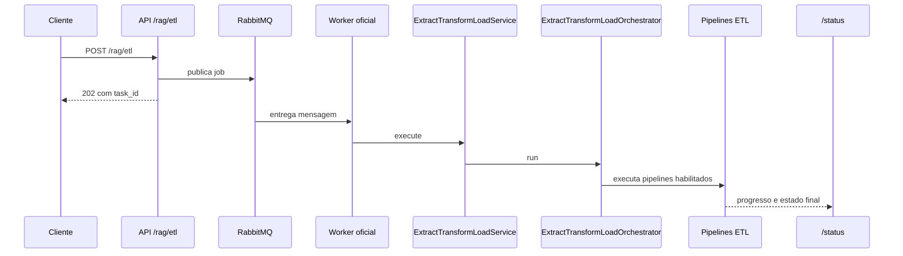

# Pipeline ETL

Este documento cobre o ETL dedicado da plataforma.
Ele mostra pré-condições, pipelines encontrados no código e o contrato
operacional entre API, worker e monitoramento.

## O que ETL significa aqui

Neste repositório, ETL não é sinônimo de ingestão.
Ele tem superfície própria.

- Rota HTTP: POST /rag/etl.
- Service: ExtractTransformLoadService.
- Orquestrador: ExtractTransformLoadOrchestrator.

Em linguagem simples: ingestão trabalha com conteúdo documental.
ETL trabalha com transformação estruturada e pipelines específicos.

## Escopo deste documento

Este documento é o dono do ETL dedicado.
Ele cobre a fronteira HTTP do ETL, o contrato assíncrono no worker, a
arquitetura interna do orquestrador e as famílias de pipeline
comprovadas no código.

Para evitar redundância:

- README-ARQUITETURA.md explica a topologia macro da plataforma.
- README-INGESTAO.md cobre ingestão documental, fan-out e leitura
    operacional.
- README-RAG.md cobre retrieval, geração e resposta final.

Em linguagem simples: este documento explica como a plataforma move e
prepara dados estruturados. Ele não é o manual do pipeline documental
nem o manual do runtime de consulta.

## Leitura relacionada

- Visão macro da plataforma: [README-ARQUITETURA.md](./README-ARQUITETURA.md)
- Ingestão documental: [README-INGESTAO.md](./README-INGESTAO.md)
- Pipeline de consulta RAG: [README-RAG.md](./README-RAG.md)
- Versão didática 101 deste assunto: [tutorial-101-etl.md](./tutorial-101-etl.md)

## Pré-condições reais

O service falha cedo quando:

- o bloco extract_transform_load não existe;
- extract_transform_load.enabled está falso;
- nenhum subsistema de ETL está habilitado.

Essa validação evita ETL vazio ou ambíguo.

## Pipelines comprovados no código

O orquestrador atual coordena quatro frentes.

- Booking.
- Hotels.com.
- TripAdvisor.
- schema metadata.

Os três primeiros vivem na família Apify.
O quarto usa TableSchemaMetadataETLProcessor.

## Arquitetura real do ETL dedicado

O ETL atual é organizado em camadas, e isso aparece claramente no
runtime.

- a rota HTTP recebe o pedido e publica a tarefa;
- ExtractTransformLoadService valida se a execução pode começar;
- ExtractTransformLoadOrchestrator escolhe os pipelines habilitados;
- cada pipeline concreto executa sua coleta, transformação e
    persistência;
- o resultado final volta consolidado com sucesso, warnings, erros e
    metadados.

Esse desenho é importante porque separa entrada, coordenação e trabalho
especializado.
O service não precisa conhecer regras internas de Booking ou schema
metadata. O orquestrador não vira uma coleção de ifs por provider. E os
pipelines concretos não precisam resolver autenticação HTTP ou contrato
de fila.

Em linguagem simples: a API pede, o service confere, o orquestrador
coordena e cada esteira especializada executa só o que lhe compete.

## O papel do service de ETL

ExtractTransformLoadService é a porta de entrada de aplicação para esse
domínio.
No código atual, ele faz algumas coisas decisivas.

- falha cedo quando extract_transform_load não existe;
- falha cedo quando extract_transform_load.enabled está falso;
- exige ao menos um subsistema habilitado;
- prepara session_id e mede duração;
- limpa logs antes da execução quando o fluxo pede isso;
- consolida analysis do resultado ao final.

Boa prática importante:
o service não tenta adivinhar intenção do operador quando o YAML está
incompleto. Ele interrompe cedo e deixa o problema observável.

## O papel do orquestrador

ExtractTransformLoadOrchestrator é o maestro do domínio.
Ele decide quais pipelines realmente entram em execução, constrói o
resultado raiz e consolida o subresultado de cada pipeline filho.

No runtime atual, isso inclui:

- manter metadata, warnings e errors em um payload único;
- registrar warning quando um pipeline está desligado no YAML;
- tratar cancelamento cooperativo como estado canônico;
- separar o caminho schema_metadata do caminho Apify;
- permitir uma chamada única com múltiplos pipelines habilitados.

Em linguagem simples: o orquestrador escolhe quais esteiras ligam e
junta o resultado de todas, mas não reimplementa o trabalho interno de
cada esteira.

## Família Apify: template comum e especialização por fonte

Booking, Hotels.com e TripAdvisor seguem uma espinha dorsal comum.
Essa base está em BaseApifyETLPipeline.

Ela concentra responsabilidades repetidas entre esses provedores:

- validação da infraestrutura hospitality;
- inicialização do repositório interno;
- esqueleto padrão de run;
- persistência de place, detalhes e reviews;
- merge de contadores e subresultados;
- pós-processamento opcional de reviews;
- checagem de cancelamento entre etapas críticas.

Boa prática importante:
esse é um uso real de template method.
A base define o roteiro comum e os pipelines concretos só implementam as
partes que realmente mudam, como actor, modelo e conversor de dados.

## Exemplo concreto: Booking.com

BookingETLPipeline deixa essa arquitetura bem visível.
Ele coleta hotéis com BookingActor, pode coletar reviews com
BookingReviewsActor e converte os dados do provider para o contrato
interno de hospitality antes de persistir.

Isso evita um erro comum em ETL apressado: gravar o payload cru do
provider só porque ele chegou primeiro.
Aqui o pipeline valida, converte e só então persiste.

Em linguagem simples: o pipeline não despeja JSON do provedor no banco.
Ele traduz a informação para o idioma interno da plataforma.

## Família schema metadata: catálogo técnico do banco

O pipeline schema metadata é outra linha de trabalho.
Ele não coleta places ou reviews. Ele inspeciona um banco relacional,
lê tabelas, colunas e chaves, e grava isso no catálogo dbschemas.

As amostras de linhas são opcionais. Elas só devem ser coletadas quando
`extract_transform_load.schema_metadata.source_database.include_sample_rows`
estiver explicitamente habilitado. No uso comum de NL2SQL, principalmente
em schemas com dados pessoais, mantenha esse valor desabilitado.

TableSchemaMetadataETLProcessor faz esse caminho em etapas claras:

- parse e normalização da configuração;
- teste de conexão de origem e destino;
- inspeção do schema escolhido;
- filtro das tabelas selecionadas;
- leitura de colunas, PKs e FKs;
- leitura de amostras apenas com opt-in explícito;
- gravação estruturada no destino.

Esse pipeline importa muito porque ele abastece outros fluxos técnicos,
principalmente o NL2SQL baseado em schema.

Em linguagem simples: ele pega a planta do banco e transforma essa
planta em um catálogo reaproveitável pelo resto do sistema. Ele não
precisa copiar linhas reais para gerar essa planta.

## Fluxo ponta a ponta

1. A API recebe POST /rag/etl.
2. O request é preparado para execução assíncrona.
3. O job é publicado em RabbitMQ.
4. A API devolve 202 com task_id.
5. O worker oficial consome a fila via Dramatiq.
6. ExtractTransformLoadService valida o bloco ETL.
7. ExtractTransformLoadOrchestrator roda os pipelines habilitados.
8. O progresso e o estado terminal aparecem em /status.



## Cancelamento e acompanhamento

O cancelamento cooperativo fica em:

- POST /rag/etl/{task_id}/cancel.

O acompanhamento usa:

- GET /status/{task_id};
- GET /api/v1/status/{task_id};
- GET /status/stream/{task_id};
- GET /api/v1/status/stream/{task_id}.

Em linguagem simples: a API aceita, o worker executa e a leitura do
estado acontece no mesmo boundary de monitoramento usado por ingestão.

## Papel de RabbitMQ e Redis

RabbitMQ é o transporte principal do job ETL.
Redis continua importante, mas para coordenação e status efêmero.

Uso prático de Redis neste slice:

- progresso efêmero;
- cancelamento cooperativo;
- reconciliação operacional;
- locks e estado auxiliar.

## Como o orquestrador decide o que rodar

O orquestrador não roda tudo por padrão.
Ele verifica cada pipeline habilitado no YAML e executa só o que está
ativo.

Se um pipeline estiver desligado, isso vira warning operacional, não
execução silenciosa.

## Cancelamento, progresso e consolidação

O ETL dedicado não trata cancelamento como detalhe opcional.
O orquestrador propaga a checagem cooperativa e responde a
TaskCancelledError como estado terminal legítimo.

Também existe preocupação explícita com progresso.
O fluxo aceita progress_callback para atualizar marcos de execução sem
misturar essa responsabilidade com a lógica de transformação.

Boa prática importante:
progresso e cancelamento vivem no contrato operacional do domínio, e não
só no boundary HTTP. Isso reduz o risco de a interface marcar uma tarefa
como cancelada enquanto uma esteira interna continua rodando.

## Boas práticas reais do ETL atual

Estas práticas já aparecem no código e ajudam a ler o domínio do jeito
certo.

- ETL não é tratado como subtipo de ingestão documental.
- O service falha cedo quando a configuração está incompleta.
- O orquestrador roda apenas pipelines explicitamente habilitados.
- Pipelines equivalentes reaproveitam uma base comum.
- Provider externo e persistência interna são separados por conversão de
    modelo.
- Schema metadata usa pipeline técnico próprio, não um desvio ad hoc da
    família Apify.
- Cancelamento cooperativo e progresso são parte do contrato real.

## Como pensar o ETL em linguagem simples

Uma analogia útil é esta:

- o service é a portaria que confere se a operação pode começar;
- o orquestrador é o supervisor que escolhe quais esteiras serão
    ligadas;
- os pipelines Apify são equipes de coleta especializadas por fonte;
- o schema metadata é a equipe que faz inventário técnico do banco;
- o worker é o galpão onde tudo isso roda sem travar a API.

Essa analogia ajuda porque o ETL atual não é um endpoint que chama um
provider e pronto.
Ele é um domínio com esteiras diferentes, mas coordenadas pelo mesmo
contrato operacional.

## Fluxo arquitetural do ETL dedicado

```mermaid
flowchart LR
        subgraph API
                A1[/rag/etl]
                A2[ExtractTransformLoadService]
        end

        subgraph Worker
                W1[ExtractTransformLoadOrchestrator]
                W2[BaseApifyETLPipeline]
                W3[Booking ou Hotels.com ou TripAdvisor]
                W4[TableSchemaMetadataETLProcessor]
        end

        subgraph Infra
                I1[RabbitMQ]
                I2[Redis]
                I3[Hospitality DB]
                I4[Schema DB]
                I5[Providers externos]
        end

        A1 --> I1 --> A2 --> W1
        W1 --> W2 --> W3 --> I5
        W3 --> I3
        W1 --> W4 --> I4
        I2 --> A1
```

## Como validar que o ETL funcionou

1. Garanta extract_transform_load.enabled igual a true.
2. Habilite ao menos um pipeline de Apify ou schema metadata.
3. Execute POST /rag/etl.
4. Confirme resposta 202 com task_id.
5. Acompanhe a task em /status até estado terminal.
6. Se necessário, cancele pela rota dedicada.

## Fluxograma funcional cruzado

```mermaid
flowchart LR
    subgraph Cliente
        C1[Cliente ou UI]
    end

    subgraph API
        A1[/rag/etl]
        A2[/status]
    end

    subgraph Worker
        W1[WorkerProcessRuntime]
        W2[ExtractTransformLoadService]
        W3[ExtractTransformLoadOrchestrator]
        W4[Pipelines habilitados]
    end

    subgraph Infra
        I1[RabbitMQ]
        I2[Redis]
        I3[PostgreSQL]
        I4[Providers externos]
    end

    C1 --> A1 --> I1 --> W1 --> W2 --> W3 --> W4
    W4 --> I3
    W4 --> I4
    I2 --> A2
    I3 --> A2
```

## Como rodar e validar

1. Ative a .venv.
2. Suba a API.
3. Suba o worker oficial.
4. Prepare um YAML com extract_transform_load ativo.
5. Execute POST /rag/etl.
6. Valide task_id, polling e eventual cancelamento.

## Evidência no código

- src/api/routers/rag_etl_router.py
- src/api/routers/rag_cancellation_router.py
- src/api/routers/streaming_router.py
- src/services/etl_service.py
- src/etl_layer/orchestrator.py
- src/etl_layer/providers/apify/base_apify_pipeline.py
- src/etl_layer/providers/apify/booking_pipeline.py
- src/etl_layer/providers/apify/hotelscom_pipeline.py
- src/etl_layer/providers/apify/tripadvisor_pipeline.py
- src/etl_layer/providers/data/table_schema_metadata_processor.py
- src/api/services/worker_process_runtime.py

## Lacunas no código

Não encontrado no código.

Onde deveria estar:

- um dry-run administrativo do bloco extract_transform_load antes da
  chamada ao provider externo;
- uma visão única que mostre, no mesmo payload, fila, worker e plano
  ETL selecionado para a execução.
