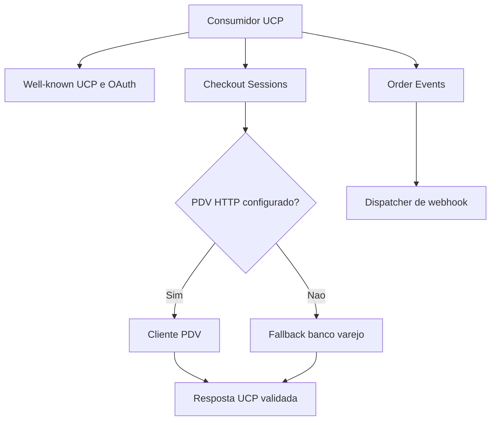
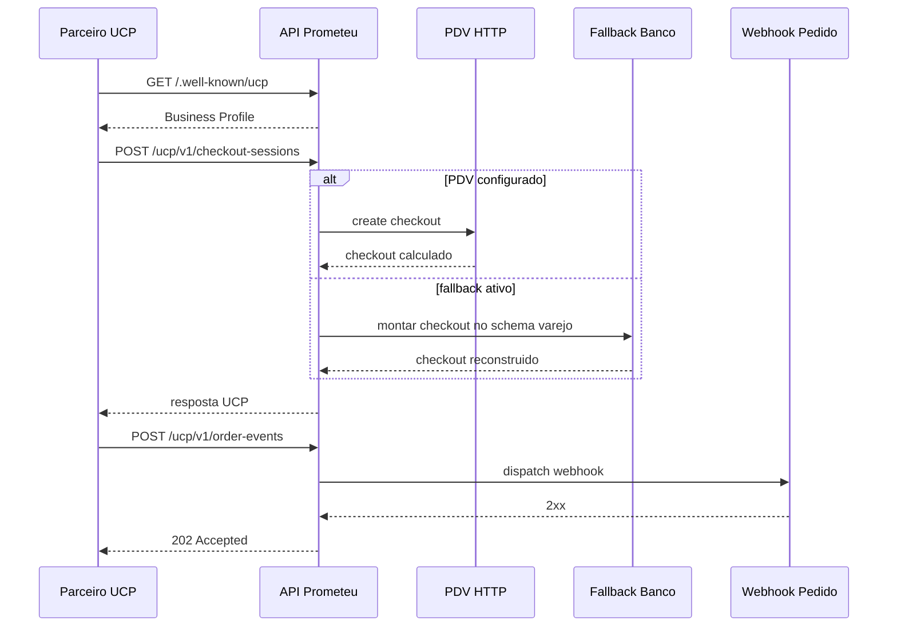

# Manual técnico, executivo, comercial e estratégico: Google UCP

## 1. O que é esta feature

Esta feature expõe a plataforma como um merchant compatível com Universal Commerce Protocol, publicando discovery, recebendo operações de checkout e processando eventos de pedido de forma padronizada.

No código atual, isso é feito sem SDK proprietário do Google. A implementação é própria, sobre FastAPI, com contrato UCP explícito, cliente HTTP para PDV, fallback em banco varejo e webhook de pós-compra.

Em termos simples, a plataforma aprende a falar a língua do UCP. Quem integra com UCP consegue descobrir capacidades, abrir checkout, acompanhar o estado da sessão e informar eventos de pedido usando contratos previsíveis.

## 2. Que problema ela resolve

Sem essa feature, cada integração de checkout precisaria ser tratada como adaptação proprietária entre um consumidor externo e o PDV interno.

Isso gera problemas práticos.

1. Maior custo de onboarding por parceiro.
2. Divergência entre contrato prometido e comportamento real do backend.
3. Dificuldade para discovery automático de capacidades.
4. Falta de separação clara entre protocolo público e motor interno de checkout.

O UCP resolve isso padronizando a conversa. A plataforma passa a se apresentar com manifesto well-known, contrato REST de checkout e mecanismo formal de eventos de pedido.

## 3. Visão executiva

Executivamente, esta feature reduz risco de integração e encurta o tempo necessário para conectar parceiros de comércio que esperam um contrato de checkout padronizado.

Ela importa porque cria previsibilidade.

1. Discovery deixa claro o que a plataforma oferece.
2. Checkout segue um binding consistente.
3. Pós-compra tem um canal formal de notificação.
4. O backend pode trocar a estratégia operacional entre PDV remoto e fallback sem quebrar o contrato externo.

Para liderança, o valor real não é “ter uma rota a mais”. O valor é reduzir custo de integração e evitar retrabalho comercial e técnico.

## 4. Visão comercial

Comercialmente, essa feature ajuda a posicionar a plataforma como camada de orquestração pronta para ecossistemas digitais de comércio.

Ela responde bem a dores como estas.

1. O cliente não quer integração customizada para cada canal.
2. O cliente quer um checkout padronizado e auditável.
3. O cliente quer manter o PDV como motor de negócio, sem expor complexidade interna.

O que pode ser prometido com segurança com base no código.

1. Manifesto de discovery UCP.
2. Metadados OAuth para discovery.
3. Binding REST de checkout com create, get, update, complete e cancel.
4. Recebimento de eventos de pedido com despacho de webhook.
5. Fallback em banco para cenários sem PDV HTTP configurado.

O que não deve ser prometido.

1. Uso de SDK Google específico.
2. Fluxo completo de autorização OAuth dentro desta camada. O código publica metadados OAuth, mas não implementa aqui um servidor OAuth completo.

## 5. Visão estratégica

Estratégicamente, UCP fortalece a plataforma porque separa o contrato público do mecanismo interno de comércio.

Isso traz quatro ganhos estruturais.

1. O protocolo externo permanece estável mesmo se o PDV mudar.
2. O checkout pode operar por integração remota ou por fallback controlado.
3. A plataforma pode servir discovery para ecossistemas externos e também consumir discovery via tool interna.
4. O domínio comercial fica mais desacoplado do canal específico que iniciou a compra.

## 6. Conceitos necessários para entender

### 6.1. Business Profile

É o manifesto publicado em /.well-known/ucp. Ele informa versão do protocolo, serviços publicados, endpoint REST e capabilities habilitadas.

### 6.2. OAuth metadata

É o JSON publicado em /.well-known/oauth-authorization-server. Ele serve para discovery de metadados do servidor de autorização compatível com RFC 8414.

### 6.3. Checkout Session

É a sessão de compra manipulada pelo binding REST. Ela nasce incompleta, pode ser atualizada, pode ser completada e pode ser cancelada.

### 6.4. PDV como fonte de verdade

Neste projeto, a plataforma não calcula o checkout sozinha no caminho principal. Ela repassa o contrato ao PDV, que devolve items, totals, payment handlers, fulfillment e status.

### 6.5. Fallback UCP

Quando a configuração do PDV HTTP está ausente ou quando o fallback é forçado, a plataforma usa o banco varejo como fallback operacional para manter o contrato UCP ativo.

### 6.6. Idempotência

As operações mutáveis de checkout usam Idempotency-Key para evitar duplicidade operacional quando a mesma requisição é repetida.

### 6.7. Order events

São eventos pós-compra, como mudanças de estado do pedido, que chegam pela rota UCP e são reenviados para um webhook configurado.

## 7. O que significa Google UCP neste código

O nome do documento fala em Google UCP porque esse é o contexto de negócio da integração. Mas o código lido implementa o protocolo UCP de forma genérica.

Não há evidência, no slice lido, de SDK Google específico, biblioteca proprietária do Google ou adapter exclusivo de vendor. O que existe é implementação própria do contrato UCP, usando nomes e schemas do protocolo.

Essa distinção é importante porque evita expectativa errada. A plataforma está pronta para o contrato. Ela não depende de runtime Google proprietário para oferecer esse contrato.

## 8. Como a feature funciona por dentro

O fluxo macro confirmado no código é este.

1. A API sobe e inclui três routers UCP na aplicação principal.
2. O router de discovery publica o manifesto UCP e o metadata OAuth em well-known.
3. O router de checkout expõe o binding REST em um base path configurável.
4. Para cada operação de checkout, a plataforma decide entre PDV HTTP e fallback em banco.
5. A resposta é validada contra modelos tipados antes de voltar ao consumidor.
6. O router de order events recebe eventos do ERP e dispara um webhook externo.
7. Paralelamente, a plataforma também possui uma tool interna de discovery que permite a agentes consultar manifestos UCP de merchants externos.

## 9. Divisão em etapas ou submódulos

### 9.1. Discovery protocolar

Esse submódulo existe para responder a pergunta inicial de qualquer ecossistema UCP: o que este merchant suporta e onde os serviços estão publicados?

Ele fica responsável por montar o Business Profile e os metadados OAuth a partir da configuração de ambiente e do host atual da requisição.

### 9.2. Binding REST de checkout

Esse submódulo existe para transformar operações UCP de compra em chamadas concretas de runtime.

Ele registra create, get, update, complete e cancel, valida payloads e escolhe a estratégia operacional adequada.

### 9.3. Cliente PDV

Esse submódulo existe para encapsular o contrato HTTP com o PDV, incluindo paths, timeout, retry, backoff, validação de resposta e propagação de correlation_id.

### 9.4. Fallback em banco varejo

Esse submódulo existe para manter o protocolo funcional mesmo sem a API de PDV configurada. Ele reconstrói o checkout usando schema varejo, handlers de pagamento e produtos do banco.

### 9.5. Eventos de pedido

Esse submódulo existe para completar o ciclo pós-compra. O ERP informa o evento e a plataforma reencaminha para o webhook configurado.

### 9.6. Tool interna de discovery

Esse submódulo existe para o sentido inverso: em vez de expor a plataforma como merchant UCP, ele permite que agentes da própria plataforma descubram manifestos UCP de terceiros.

## 10. Pipeline ou fluxo principal

### 10.1. Discovery do merchant

Quando alguém chama /.well-known/ucp, UcpBusinessProfileBuilder lê a versão do protocolo, resolve o host correto a partir da requisição, calcula o endpoint REST com base em UCP_REST_BASE_PATH, monta a lista de capabilities e injeta signing_keys quando configuradas.

Na prática, essa etapa é o cartão de apresentação do merchant.

### 10.2. Discovery OAuth

Quando alguém chama /.well-known/oauth-authorization-server, UcpOAuthAuthorizationServerBuilder publica um JSON completo vindo de UCP_OAUTH_AUTH_SERVER_METADATA_JSON ou monta o payload a partir das variáveis obrigatórias de issuer, authorization endpoint, token endpoint, escopos, response types, grant types e auth methods.

Essa etapa existe para que um consumidor UCP não precise adivinhar onde está o servidor de autorização.

### 10.3. Criação de checkout

No create, o router valida o payload com PdvCheckoutCreateRequest, extrai Idempotency-Key e decide entre PDV HTTP e fallback.

Se o PDV estiver configurado, a chamada é delegada ao cliente HTTP. Se não estiver, ou se UCP_FALLBACK_ENABLED estiver ligado, a plataforma usa UcpFallbackCheckoutRepository.

### 10.4. Consulta e atualização de checkout

No get, a plataforma apenas recupera o estado vigente.

No update, ela exige que o campo id do payload coincida com o checkout_id da rota. Isso evita atualização de sessão errada.

### 10.5. Finalização e cancelamento

No complete, o contrato exige payment_data e aceita risk_signals opcionais.

No cancel, a plataforma solicita o cancelamento e devolve o estado final da sessão.

### 10.6. Validação de continue_url

Se o status retornado for requires_escalation, o router exige continue_url HTTPS absoluto. Isso evita devolver ao consumidor um link inválido ou inseguro para continuação do fluxo.

### 10.7. Order events

Quando o ERP envia um evento de pedido, o router valida event_type e checkout_id, resolve o webhook e dispara a notificação com retry exponencial.

## 11. Como ligar a feature

O código confirma três grupos de configuração para ativar a feature.

### 11.1. Grupo 1: discovery e manifesto UCP

As variáveis confirmadas para o manifesto são estas.

1. UCP_PROTOCOL_VERSION
2. UCP_REST_BASE_PATH
3. UCP_CAPABILITIES
4. UCP_SIGNING_KEYS_JSON

O .env.example já traz defaults e placeholders para esse grupo. O default confirmado para versão é 2026-01-11 e o default do base path é /ucp/v1.

### 11.2. Grupo 2: discovery OAuth

Há dois modos confirmados.

Modo A: fornecer um JSON completo por UCP_OAUTH_AUTH_SERVER_METADATA_JSON.

Modo B: informar separadamente:

1. UCP_OAUTH_ISSUER
2. UCP_OAUTH_AUTHORIZATION_ENDPOINT
3. UCP_OAUTH_TOKEN_ENDPOINT
4. UCP_OAUTH_REVOCATION_ENDPOINT, opcional
5. UCP_OAUTH_SCOPES_SUPPORTED
6. UCP_OAUTH_RESPONSE_TYPES_SUPPORTED
7. UCP_OAUTH_GRANT_TYPES_SUPPORTED
8. UCP_OAUTH_TOKEN_ENDPOINT_AUTH_METHODS_SUPPORTED

### 11.3. Grupo 3: operação de checkout no PDV

As variáveis confirmadas no cliente PDV são estas.

1. UCP_PDV_BASE_URL
2. UCP_PDV_CREATE_CHECKOUT_PATH
3. UCP_PDV_GET_CHECKOUT_PATH_TEMPLATE
4. UCP_PDV_UPDATE_CHECKOUT_PATH_TEMPLATE
5. UCP_PDV_COMPLETE_CHECKOUT_PATH_TEMPLATE
6. UCP_PDV_CANCEL_CHECKOUT_PATH_TEMPLATE
7. UCP_PDV_TIMEOUT_SECONDS
8. UCP_PDV_RETRY_ATTEMPTS
9. UCP_PDV_BACKOFF_BASE_SECONDS

### 11.4. Grupo 4: fallback operacional

O fallback é ativado em qualquer um destes cenários.

1. UCP_FALLBACK_ENABLED=true.
2. UCP_PDV_BASE_URL ou path obrigatório ausente para a operação.

Para o fallback funcionar, o banco varejo precisa estar configurado. O runtime de fallback ainda identifica a origem do pool como UCP_FALLBACK_DSN.

### 11.5. Grupo 5: webhook de order events

O webhook pode vir no próprio payload do evento ou ser resolvido pelo segredo UCP_ORDER_WEBHOOK_URL.

## 12. Como usar

Na prática, usar esta feature significa seguir este roteiro operacional.

1. Subir a API com os routers UCP incluídos.
2. Configurar manifesto e base path.
3. Configurar metadados OAuth, quando o discovery OAuth for necessário.
4. Escolher a estratégia operacional do checkout: PDV HTTP ou fallback em banco.
5. Configurar o webhook de order events.
6. Validar os endpoints well-known.
7. Executar o fluxo create, get, update, complete e cancel no base path configurado.

## 13. Quando é usado

O uso confirmado no código faz sentido nestes cenários.

1. Quando a plataforma precisa se apresentar para um ecossistema que espera discovery UCP.
2. Quando o checkout deve ser exposto por contrato padronizado, mas o cálculo real continua no PDV.
3. Quando o sistema precisa manter um modo de operação controlado mesmo sem o PDV HTTP configurado.
4. Quando o ERP precisa avisar eventos de pedido por contrato formal.
5. Quando agentes internos precisam descobrir merchants externos via manifesto UCP.

## 14. Casos de uso reais

### 14.1. Merchant publishing

A plataforma publica /.well-known/ucp e /.well-known/oauth-authorization-server para permitir discovery automático por consumidores externos.

### 14.2. Checkout orquestrado pelo PDV

O consumidor externo abre uma checkout session. A plataforma valida o contrato UCP e delega o cálculo ao PDV, que retorna status, totals, payment handlers e fulfillment.

### 14.3. Continuidade operacional por fallback

Se a API PDV estiver ausente ou se o modo fallback estiver forçado, a plataforma reconstrói a sessão usando banco varejo e mantém o contrato externo ativo.

### 14.4. Pós-compra

O ERP informa que um pedido foi criado, pago ou enviado. O router recebe o evento e o reencaminha para um webhook configurado.

### 14.5. Discovery de terceiros por agentes

Um agente da própria plataforma pode usar a tool de discovery UCP para ler o manifesto de outro merchant e resumir capacidades, serviços e handlers.

## 15. O que tem implementado hoje

O slice lido confirma implementação destes itens.

1. Business Profile em /.well-known/ucp.
2. OAuth authorization server metadata em /.well-known/oauth-authorization-server.
3. Checkout Sessions com create, get, update, complete e cancel.
4. Validação de payload com modelos Pydantic estritos.
5. Cliente PDV com retry exponencial.
6. Fallback em banco com idempotência e rebuild de payload UCP.
7. Validação de continue_url para requires_escalation.
8. Order events com dispatcher HTTP e retry.
9. Tool interna ucp_discovery para descoberta de manifesto de terceiros.

## 16. Contratos, entradas e saídas

Os endpoints confirmados são estes.

1. GET /.well-known/ucp
2. GET /.well-known/oauth-authorization-server
3. POST {base}/checkout-sessions
4. GET {base}/checkout-sessions/{checkout_id}
5. PUT {base}/checkout-sessions/{checkout_id}
6. POST {base}/checkout-sessions/{checkout_id}/complete
7. POST {base}/checkout-sessions/{checkout_id}/cancel
8. POST {base}/order-events

O base é derivado de UCP_REST_BASE_PATH, com default confirmado de /ucp/v1.

Os contratos de checkout são tipados por Pydantic e cobrem buyer, line_items, totals, links, payment handlers, fulfillment, order e envelope ucp obrigatório.

## 17. O que acontece em caso de sucesso

No caminho feliz, o consumidor externo enxerga uma interface previsível.

1. Discovery retorna manifesto coerente com host e base path reais.
2. OAuth metadata retorna endpoints e escopos configurados.
3. O checkout é criado e devolve payload validado.
4. Updates recalculam a sessão.
5. Complete devolve confirmação de order.
6. Cancel devolve a sessão cancelada.
7. Order events retornam 202 após despacho do webhook.

## 18. O que acontece em caso de erro

Os erros confirmados no código incluem estes.

### 18.1. Configuração UCP inválida

Se UCP_PROTOCOL_VERSION estiver vazio ou inválido, o discovery falha com erro 500.

### 18.2. Capabilities inválidas

Se UCP_CAPABILITIES vier em JSON inválido ou formato incompatível, o discovery falha explicitamente.

### 18.3. Signing keys inválidas

Se UCP_SIGNING_KEYS_JSON não for lista JSON válida, o discovery falha.

### 18.4. OAuth metadata mal configurado

Se faltar issuer, authorization_endpoint, token_endpoint ou listas obrigatórias, o metadata OAuth falha.

### 18.5. Payload de checkout inválido

Create, update e complete retornam erro 422 quando o payload não passa na validação tipada.

### 18.6. checkout_id ou id incoerente

Update falha quando o id do payload difere do checkout_id da rota. Get e cancel também falham quando checkout_id é inválido.

### 18.7. Falha de PDV

Se houver erro HTTP, erro de rede, resposta não JSON ou resposta incompatível com o schema, a plataforma converte isso em erro 502 ou 500 conforme a natureza da falha.

### 18.8. Conflito de idempotência no fallback

Se a mesma Idempotency-Key reaparecer com payload ou estado divergente, o fallback responde com conflito.

### 18.9. continue_url inseguro

Se o status for requires_escalation e continue_url não for HTTPS absoluto, a resposta é rejeitada.

### 18.10. Webhook de pedido inválido

Se o webhook não estiver configurado ou se houver falha de rede/HTTP no dispatch, order-events falha explicitamente.

## 19. Observabilidade e diagnóstico

Os pontos principais de observabilidade confirmados no código são estes.

1. correlation_id vindo do header x-correlation-id ou de fallback local.
2. logs específicos para discovery, checkout e order events.
3. retry com backoff exponencial no cliente PDV.
4. retry com backoff exponencial no dispatcher de order events.
5. logs explícitos de payload inválido, configuração inválida e falhas externas.

Para diagnosticar corretamente, a ordem prática é esta.

1. Verificar se o problema é em discovery, checkout ou order events.
2. Validar as variáveis UCP do grupo correto.
3. Confirmar se o fluxo caiu no PDV HTTP ou no fallback.
4. Confirmar se houve conflito de idempotência.
5. Conferir se o webhook está resolvendo UCP_ORDER_WEBHOOK_URL.

## 20. Decisões técnicas e trade-offs

### 20.1. Contrato público separado do motor interno

Ganho: o consumidor fala com UCP, não com o detalhe do PDV.

Custo: exige camada extra de adaptação e validação.

### 20.2. Cliente PDV tipado

Ganho: respostas incompatíveis são rejeitadas cedo.

Custo: qualquer divergência contratual do PDV quebra de forma explícita.

### 20.3. Fallback em banco

Ganho: mantém a operação viva em cenários controlados sem PDV HTTP.

Custo: introduz um segundo caminho operacional que precisa ser entendido e diagnosticado corretamente.

### 20.4. OAuth metadata separado

Ganho: melhora discovery e interoperabilidade.

Custo: exige governança adicional de configuração.

### 20.5. Tool interna de discovery

Ganho: a plataforma não apenas se expõe via UCP, ela também consegue analisar UCP de terceiros.

Custo: adiciona mais uma superfície funcional para manter alinhada ao contrato.

## 21. Vantagens práticas

1. Padroniza discovery de capabilities.
2. Padroniza o ciclo de vida de checkout.
3. Mantém o PDV como fonte de verdade no caminho principal.
4. Permite continuidade operacional por fallback.
5. Oferece webhook de pós-compra com retry.
6. Reaproveita a mesma linguagem protocolar para exposição e descoberta.

## 22. Impacto técnico

Tecnicamente, a feature reduz acoplamento entre canais externos de comércio e a lógica interna do checkout. O consumidor enxerga um contrato estável, enquanto a plataforma mantém a liberdade de operar com PDV remoto ou fallback local.

## 23. Impacto executivo

Executivamente, ela reduz risco de integração, melhora previsibilidade de onboarding e diminui o custo de explicar o contrato comercial e técnico para parceiros.

## 24. Impacto comercial

Comercialmente, a plataforma passa a sustentar uma narrativa forte de interoperabilidade de checkout. Isso ajuda especialmente em cenários de marketplace, canais parceiros e ecossistemas que exigem protocolo público de descoberta e compra.

## 25. Impacto estratégico

Estratégicamente, UCP prepara a plataforma para operar em ecossistemas de comércio com menos dependência de adaptação por cliente. Também fortalece a separação entre domínio comercial, canal de integração e motor de execução.

## 26. Exemplos práticos guiados

### 26.1. Discovery de um merchant

Cenário: um parceiro quer descobrir automaticamente o que a plataforma suporta.

Ele chama /.well-known/ucp e recebe versão, serviços e capabilities. Se o metadata OAuth estiver configurado, também pode descobrir issuer e token endpoint em /.well-known/oauth-authorization-server.

### 26.2. Criação de checkout com PDV remoto

Cenário: o checkout é aberto a partir de um canal externo.

O router valida o payload, repassa ao PDV, recebe o estado calculado e devolve a sessão com totals, payment handlers e links.

### 26.3. Criação de checkout com fallback

Cenário: o PDV HTTP ainda não está configurado, mas o time precisa manter a integração ativa em ambiente controlado.

O router detecta fallback e usa banco varejo para montar a sessão UCP, incluindo line items, totals e status inicial.

### 26.4. Escalada de checkout

Cenário: o checkout exige continuação fora do fluxo principal.

Se o status vier como requires_escalation, a resposta só é aceita se trouxer continue_url HTTPS absoluto.

### 26.5. Evento de pedido pós-compra

Cenário: o ERP precisa avisar que um pedido foi criado.

O router valida event_type e checkout_id, resolve o webhook e despacha o evento com retry.

### 26.6. Agente interno avaliando um merchant externo

Cenário: um agente precisa entender que capabilities um merchant UCP de terceiro oferece.

A tool ucp_discovery consulta o manifesto do merchant, valida o schema e devolve resumo de serviços, capabilities, payment handlers e signing keys.

## 27. Explicação 101

Imagine que UCP é uma tomada universal para checkout.

Em vez de cada parceiro plugar um conector diferente, a plataforma publica uma tomada padrão dizendo como iniciar a compra, como consultar o estado e como avisar eventos de pedido.

Por trás dessa tomada, o sistema ainda pode usar o PDV normal ou um fallback em banco. Para quem integra, isso quase não muda. O contrato externo continua o mesmo.

## 28. Limites e pegadinhas

1. O código lido não mostra SDK Google específico.
2. OAuth metadata publicado não significa que esta camada implementa todo o servidor OAuth.
3. Fallback não é o mesmo caminho arquitetural do PDV HTTP; ele existe para continuidade operacional controlada.
4. requires_escalation exige continue_url HTTPS absoluto, não qualquer link.
5. Idempotency-Key mal reutilizada no fallback gera conflito explícito.
6. Sem banco varejo configurado, o fallback não sobe.

## 29. Troubleshooting

### 29.1. O well-known não responde corretamente

Sintoma: /.well-known/ucp ou /.well-known/oauth-authorization-server falha.

Causa provável: variáveis UCP ou UCP_OAUTH ausentes ou inválidas.

Como confirmar: revisar UCP_PROTOCOL_VERSION, UCP_REST_BASE_PATH, UCP_CAPABILITIES e o grupo OAuth.

### 29.2. Checkout retorna 500 em vez de 502

Sintoma: a integração falha antes mesmo de chamar o PDV.

Causa provável: configuração inválida do cliente PDV ou fallback indisponível.

Como confirmar: verificar UCP_PDV_BASE_URL e paths obrigatórios; se fallback estiver ativo, verificar banco varejo.

### 29.3. Checkout retorna 409 no fallback

Sintoma: conflito de idempotência.

Causa provável: Idempotency-Key reutilizada com payload ou estado divergente.

Como confirmar: revisar o payload e a chave reutilizada.

### 29.4. Order events falham com 500

Sintoma: o ERP envia evento, mas a rota rejeita.

Causa provável: webhook não configurado.

Como confirmar: revisar UCP_ORDER_WEBHOOK_URL ou o webhook_url do payload.

### 29.5. Order events falham com 502

Sintoma: o router aceita o payload, mas o dispatch falha.

Causa provável: erro HTTP ou de rede no webhook externo.

Como confirmar: revisar logs do dispatcher e a disponibilidade do webhook.

## 30. Diagramas

Esse diagrama mostra o desenho macro da feature: discovery, checkout e pós-compra, com bifurcação entre PDV remoto e fallback.

Esse diagrama mostra a ordem real das interações mais importantes.

## 31. Como colocar para funcionar

O caminho confirmado no código e na configuração é este.

1. Definir UCP_PROTOCOL_VERSION e UCP_REST_BASE_PATH.
2. Definir UCP_CAPABILITIES com checkout e, quando aplicável, order.
3. Configurar o grupo OAuth quando o discovery OAuth precisar estar ativo.
4. Escolher entre PDV HTTP e fallback.
5. Se for PDV HTTP, preencher UCP_PDV_BASE_URL e todos os paths obrigatórios.
6. Se for fallback, garantir UCP_FALLBACK_ENABLED ou ausência deliberada do PDV HTTP e banco varejo configurado.
7. Definir UCP_ORDER_WEBHOOK_URL ou garantir que o payload de order event leve webhook_url.
8. Subir a API e validar os endpoints well-known e o base path UCP.

## 32. Checklist de entendimento

- Entendi que a feature implementa UCP por FastAPI, não por SDK Google.
- Entendi o papel do Business Profile.
- Entendi o papel do metadata OAuth.
- Entendi como o checkout escolhe entre PDV e fallback.
- Entendi que o PDV é a fonte de verdade no caminho principal.
- Entendi quando o fallback entra.
- Entendi para que serve Idempotency-Key.
- Entendi como order events são despachados.
- Entendi que existe uma tool interna de discovery UCP.
- Entendi como ligar a feature por configuração.

## 33. Evidências no código

- src/api/routers/ucp_router.py
  - Motivo da leitura: confirmar discovery UCP e metadata OAuth.
  - Comportamento confirmado: well-known UCP e OAuth são publicados sem prefixo de rota.

- src/api/routers/ucp_checkout_router.py
  - Motivo da leitura: confirmar operações de checkout e decisão PDV versus fallback.
  - Comportamento confirmado: create, get, update, complete e cancel escolhem caminho principal ou fallback e validam payloads.

- src/api/routers/ucp_order_event_router.py
  - Motivo da leitura: confirmar contrato de order events.
  - Comportamento confirmado: order-events valida payload e despacha webhook com resposta 202 em sucesso.

- src/ucp/pdv_checkout_api.py
  - Motivo da leitura: confirmar contrato tipado do PDV e variáveis de configuração.
  - Comportamento confirmado: cliente HTTP com retry, timeout, backoff e validação estrita de resposta.

- src/ucp/ucp_fallback_repository.py
  - Motivo da leitura: confirmar fallback em banco e idempotência.
  - Comportamento confirmado: checkout pode ser reconstruído a partir do banco varejo quando o fallback é usado.

- src/ucp/ucp_fallback_runtime.py
  - Motivo da leitura: confirmar pool e retry do fallback.
  - Comportamento confirmado: o fallback usa pool psycopg com política central de retry.

- src/ucp/order_event_dispatcher.py
  - Motivo da leitura: confirmar resolução do webhook e política de dispatch.
  - Comportamento confirmado: webhook_url pode vir do payload ou do segredo UCP_ORDER_WEBHOOK_URL.

- src/agentic_layer/tools/vendor_tools/ucp_tools/ucp_discovery_tool.py
  - Motivo da leitura: confirmar uso interno da feature no ecossistema agentic.
  - Comportamento confirmado: agentes podem descobrir manifestos UCP de terceiros.

- src/api/service_api.py
  - Motivo da leitura: confirmar wiring dos routers na aplicação principal.
  - Comportamento confirmado: os routers UCP são incluídos na API principal.

- .env.example
  - Motivo da leitura: confirmar que a configuração UCP e OAuth faz parte do runtime suportado.
  - Comportamento confirmado: existem placeholders e defaults para discovery, OAuth, PDV, webhook e fallback.
