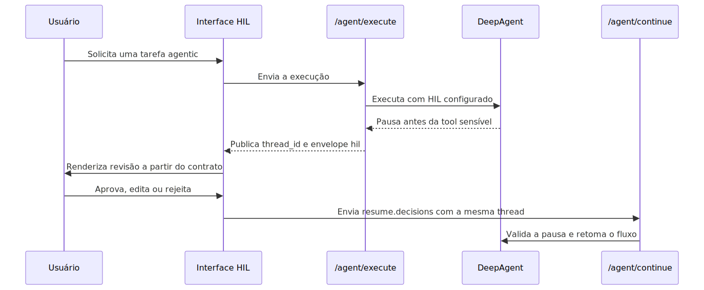
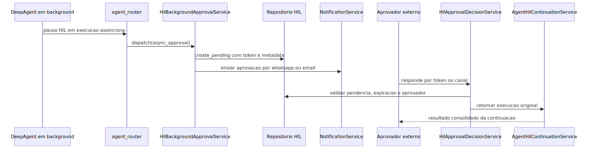

# Manual técnico, executivo, comercial e estratégico: Human-in-the-Loop

## 1. O que é esta feature

Human-in-the-Loop, ou HIL, é a capacidade da plataforma de interromper uma execução agentic em um ponto sensível, publicar um contrato formal de revisão humana e retomar exatamente a mesma execução depois que uma pessoa decide aprovar, editar ou rejeitar a ação pendente.

Quando o foco for a variante em execução agendada e background, com run
durável, scheduler universal e canais de aprovação, complemente este
manual com
[README-CONCEITUAL-AGENDAMENTO-AGENTIC-BACKGROUND-HIL.md](./README-CONCEITUAL-AGENDAMENTO-AGENTIC-BACKGROUND-HIL.md)
e
[README-TECNICO-AGENDAMENTO-AGENTIC-BACKGROUND-HIL.md](./README-TECNICO-AGENDAMENTO-AGENTIC-BACKGROUND-HIL.md).

Nesta base de código, HIL não é um texto de resposta do modelo e não é um fluxo manual improvisado por fora do runtime. É uma capacidade de execução com contrato tipado, preservação de thread, registro de pausa, retomada formal e, em parte dos fluxos, notificação assíncrona para aprovadores externos.

Em linguagem simples, HIL é o freio oficial do motor agentic. Ele pausa no ponto certo, guarda onde parou, mostra o que precisa ser decidido e continua do mesmo lugar quando a decisão chega.

## 2. Que problema ela resolve

Sem HIL, uma automação sensível costuma cair em um de dois extremos ruins.

O primeiro extremo é fazer tudo de forma automática, inclusive ações que deveriam ser revisadas por alguém. Isso reduz governança e aumenta risco operacional.

O segundo extremo é tirar a decisão para fora do runtime e obrigar o operador a reexecutar ou reconstruir contexto manualmente depois. Isso quebra rastreabilidade, duplica trabalho e enfraquece auditoria.

HIL resolve esse problema criando uma pausa controlada dentro do próprio runtime. A execução não some, não recomeça do zero e não depende de interpretação textual do frontend. Ela entra em estado pendente, publica o que precisa de revisão e espera uma continuação formal.

## 3. Visão conceitual

Conceitualmente, HIL nesta plataforma é composto por quatro elementos inseparáveis.

O primeiro é a pausa formal da execução. Ela pode acontecer no DeepAgent antes de uma tool sensível ou no Workflow por aprovação humana e `human_gate`.

O segundo é o contrato público da pausa. No fluxo de agentes, isso aparece no envelope `hil` da resposta HTTP. No fluxo de AG-UI, a pausa via `interrupt` pode viajar no outcome do stream.

O terceiro é a persistência do contexto. A pausa só faz sentido porque a thread e o estado do runtime ficam preservados por checkpointer.

O quarto é a retomada formal. A continuação usa contrato tipado, `thread_id` obrigatório e validações de consistência, em vez de um pedido textual solto.

## 4. Visão tática

Taticamente, HIL deve ser usado quando o risco da ação supera o custo de uma confirmação humana.

Os casos mais adequados são:

- uso de tool com efeito externo relevante;
- operações com impacto comercial, financeiro ou de comunicação;
- fluxos em que editar argumentos antes da execução pode evitar dano;
- cenários em que a decisão precisa ser aprovada por uma identidade específica;
- jornadas omnichannel em que a aprovação precisa chegar por WhatsApp ou e-mail sem perder o estado do agente.

Os casos menos adequados são os de baixa criticidade e alta frequência, nos quais a pausa humana só adicionaria latência sem reduzir risco real.

## 5. Visão técnica

Tecnicamente, HIL já existe no repositório como um sistema distribuído em camadas.

A camada de contrato tipado fica em `src/api/schemas/agent_hil_models.py`, com `AgentHilResponse`, payload oficial de `resume`, request de continuação e request de decisão assíncrona por token.

A camada de publicação HTTP fica principalmente em `src/api/routers/agent_router.py`, que expõe `hil-http-v1`, publica `thread_id`, responde com envelope `hil` e aceita continuação em `/agent/continue` e decisão assíncrona em `/agent/hil/decisions`.

A camada de pausa e retomada do DeepAgent passa por `src/agentic_layer/supervisor/deep_agent_supervisor.py`, `src/agentic_layer/supervisor/hil_interrupts.py`, `src/api/services/agent_hil_continuation_service.py` e o registro de pausas HIL.

A camada de aprovação assíncrona fica em `src/agentic_layer/supervisor/hil_async_approval_contract.py`, `src/api/services/hil_background_approval_service.py`, `src/api/services/hil_approval_notification_service.py`, `src/api/services/hil_approval_decision_service.py`, `src/api/services/hil_approval_channel_bridge.py` e `src/api/services/hil_approval_maintenance_job.py`.

A camada de UI generativa compartilhada fica em `app/ui/static/js/shared/ui-webchat-hil-contract.js` e `app/ui/static/js/shared/hil-review-panel.js`, com consumo comprovado em WebChat, Admin WebChat, AG-UI sidecar e testes de frontend.

## 6. Visão executiva

Para liderança, HIL é uma capacidade de governança operacional. Ele permite usar automação avançada sem abrir mão de pontos de aprovação em etapas críticas.

Isso reduz risco de execução indevida, aumenta auditabilidade e ajuda a transformar agentes em ferramentas utilizáveis em cenários reais de negócio, não apenas em demonstrações controladas.

Em termos executivos, HIL troca automação cega por automação governada.

## 7. Visão comercial

Comercialmente, HIL ajuda a responder a uma objeção clássica: “o agente vai tomar decisão sozinho sem controle humano?”. A resposta real do produto passa a ser: “ele pode pausar exatamente quando a política exigir, mostrar o que quer fazer e só seguir com autorização explícita”.

Isso é valioso em pré-venda porque reduz a percepção de risco em casos de uso de atendimento, operação, análise, publicação e integração com sistemas externos.

O benefício comercial concreto não é só segurança. É confiança para adoção.

## 8. Visão estratégica

Estratégicamente, HIL fortalece a plataforma em quatro frentes.

A primeira é governança. A plataforma não depende de “bom comportamento” do prompt para pedir revisão.

A segunda é reutilização. O mesmo contrato de pausa pode ser consumido por WebChat, Admin WebChat, AG-UI e canais assíncronos.

A terceira é evolução. O produto já tem uma base para revisão humana síncrona e também para aprovação assíncrona por canal.

A quarta é posicionamento de plataforma. HIL deixa de ser um recurso pontual de interface e passa a ser uma capacidade do runtime agentic.

## 9. Conceitos necessários para entender

### 9.1. `thread_id`

É o identificador lógico da execução pausada. A continuação precisa usar exatamente o mesmo `thread_id`. Se a thread mudar, a execução retomada deixa de ser a mesma.

### 9.2. `correlation_id`

É o identificador de rastreabilidade da operação. Ele aparece na resposta, nos logs, no registro de pausa e na decisão assíncrona. O cliente não deve inventar um valor novo na retomada.

### 9.3. Envelope `hil`

É o contrato oficial publicado pelo endpoint de agentes quando existe pausa humana pendente. Ele inclui `pending`, `protocol_version`, `message`, `allowed_decisions`, `action_requests`, `review_configs` e `resume_endpoint`.

### 9.4. `action_requests`

É a lista de ações ou tools interrompidas que precisam de revisão humana. O frontend usa esse bloco para mostrar o que está pendente.

### 9.5. `review_configs`

É a configuração por ação pendente, especialmente a lista de decisões permitidas por item.

### 9.6. `interrupt_on`

É a configuração declarativa do DeepAgent que define quais tools exigem interrupção humana e quais decisões aquela interrupção aceita.

### 9.7. `human_gate`

É a tool de pausa humana do lado de Workflow e de fluxos que usam `interrupt(...)` do LangGraph para suspender a execução e esperar um `Command(resume=...)`.

### 9.8. `async_approval`

É o bloco declarativo que habilita aprovação HIL assíncrona no DeepAgent. Ele define TTL, política de expiração, canais habilitados e aprovadores permitidos.

### 9.9. `approval_token`

É o token seguro usado para decisão assíncrona de uma pausa HIL persistida. Ele é usado para localizar o pedido de aprovação durável e validar a decisão.

### 9.10. UI generativa do HIL

Aqui, “Generative UI” não significa HTML livre vindo do modelo. Significa uma interface montada a partir de um contrato estruturado de revisão, usando componentes compartilhados e regras do frontend, sem executar código arbitrário gerado pelo agente.

## 10. Como a feature funciona por dentro

O fluxo de agentes começa quando `/agent/execute` resolve YAML, autenticação e supervisor. Se o supervisor ativo entrar em pausa HIL, a resposta continua sendo HTTP bem-sucedido, mas passa a carregar `metrics.status=paused`, `metrics.requires_human=true`, `thread_id` e o envelope `hil`.

Esse envelope é o gatilho oficial para o cliente. Os testes de frontend confirmam explicitamente que o cliente não deve inferir HIL pelo texto da resposta. Se o backend não publicar `hil.pending=true`, a interface não deve assumir que existe pausa humana.

Quando a decisão chega, o fluxo síncrono usa `/agent/continue`. Esse endpoint reaproveita a configuração resolvida, exige `thread_id`, valida a pausa pendente, confere se a quantidade de decisões corresponde ao número de ações pendentes e executa `Command(resume=...)` na mesma thread.

Quando o fluxo usa aprovação assíncrona, a pausa vira também um registro durável com token, aprovadores permitidos, canais e TTL. A decisão posterior pode chegar por `/agent/hil/decisions` ou ser interceptada de um canal que carregue o payload HIL de decisão.

No Workflow, a lógica muda de superfície, mas não de princípio. A execução pausa por aprovação humana ou por `human_gate`, preserva a thread e é retomada por `/workflow/continue` com o mesmo `thread_id`.

## 11. Divisão em etapas ou submódulos

### 11.1. Publicação do contrato HIL

Essa etapa transforma uma pausa interna do runtime em um contrato público consumível por UI ou integração. O `agent_router` monta `AgentHilResponse`, define `hil-http-v1`, publica decisões permitidas e fornece o endpoint de retomada.

Valor entregue: o cliente recebe um contrato explícito e não precisa adivinhar a pausa.

### 11.2. Registro da pausa pendente

Essa etapa impede que alguém continue uma execução inexistente ou antiga. O router registra a pausa HIL pendente com correlação, thread, identidade do usuário e supervisor.

Valor entregue: consistência e segurança na retomada.

### 11.3. Continuação síncrona

Essa etapa recebe a decisão humana, valida o contexto da pausa e executa `Command(resume=...)` no supervisor correto.

Valor entregue: a execução continua do ponto certo, sem recomposição manual.

### 11.4. Aprovação assíncrona durável

Essa etapa cria o pedido persistente de aprovação, gera token, resolve aprovadores e canais e dispara a notificação quando `async_approval` está habilitado.

Valor entregue: o agente pode pausar em background sem depender de a pessoa estar olhando a mesma tela naquele momento.

### 11.5. Decisão assíncrona e ponte de canal

Essa etapa recebe a decisão posterior por token, valida expiração, aprovador esperado, canal, decisão permitida e retoma a execução original. Quando a resposta chega por canal, a bridge HIL a intercepta antes do fluxo normal do canal.

Valor entregue: confirmação humana fora da interface principal, sem perder o estado original.

### 11.6. UI generativa compartilhada

Essa etapa renderiza o pedido de revisão humana na interface. O `HilContract` normaliza a resposta do backend e monta o `resume`. O `HilReviewPanel` renderiza ações, argumentos, botões e estados visuais sem acoplamento à API.

Valor entregue: uma mesma experiência de revisão humana pode ser reutilizada em várias superfícies.

## 12. Fluxo principal do HIL síncrono

Esse fluxo mostra a essência da feature: a execução não é recriada depois da decisão. Ela é retomada.

## 13. Fluxo de confirmação assíncrona

Esse é o ponto em que HIL deixa de ser apenas uma pausa interativa na tela e passa a ser uma capacidade de operação distribuída.

## 14. Como funciona a Generative UI do HIL

Nesta base, a UI generativa do HIL é formada por duas peças compartilhadas.

A primeira peça é `ui-webchat-hil-contract.js`. Ela normaliza a resposta do backend e transforma o envelope `hil` em um contrato frontend estável com `threadId`, `correlationId`, `allowedDecisions`, `actionRequests`, `reviewConfigs` e `resumeEndpoint`. Também monta o payload de `resume` respeitando a ordem real das ações pendentes.

A segunda peça é `hil-review-panel.js`. Esse componente renderiza um painel OO com ciclo de vida `mount`, `update`, `destroy` e `getState`. O painel mostra a mensagem de revisão, as ações pendentes, um preview seguro dos argumentos e botões de decisão. Ele não faz `fetch`, não conhece `/agent/continue` e não monta a API por conta própria.

Esse detalhe é essencial: a UI de revisão não está acoplada à rede. Ela recebe contrato e emite intenção. A superfície dona do fluxo decide como enviar a decisão ao backend.

Os testes de frontend confirmam explicitamente esse desacoplamento. O componente compartilhado não contém chamadas diretas para API nem constrói sozinho o `resume_endpoint`.

## 15. Onde a Generative UI já é usada

O painel compartilhado já aparece em três superfícies confirmadas no código.

A primeira é o WebChat v3.

A segunda é o Admin WebChat.

A terceira é o sidecar de AG-UI, que adapta interrupções do stream para o mesmo contrato visual de revisão.

Isso mostra que o produto não tem uma UI de HIL diferente para cada tela. Ele já tem uma base comum de renderização humana.

## 16. Como funcionam as confirmações assíncronas

As confirmações assíncronas do DeepAgent seguem um contrato declarativo chamado `async_approval`, aninhado em `middlewares.human_in_the_loop`.

Esse contrato é validado por `HilAsyncApprovalContract`. O código confirma estas regras.

- `enabled` precisa ser booleano.
- `ttl_seconds` deve ficar entre 60 e 604800.
- `expiration_policy` aceita apenas `expire` ou `fail_run`.
- `require_approver_match` precisa ser booleano.
- os canais declarativos aceitos hoje são apenas `whatsapp` e `email`.
- cada canal habilitado exige `template_id`.
- quando o canal está habilitado, precisa existir ao menos um aprovador compatível.
- cada aprovador precisa ter `user_email` ou `user_code`.
- o destino por canal é declarado em `channel_user_ids`.

Quando o DeepAgent assíncrono pausa por HIL, o router tenta disparar o fluxo assíncrono. Se `async_approval` estiver desligado, nada é enviado. Se estiver ligado, o sistema cria um pedido durável de aprovação, registra token, TTL, política e aprovadores permitidos, e então tenta notificar os canais configurados.

Hoje, a notificação assíncrona por canal suporta decisões `approve` e `reject`. O fluxo por botão do canal não cobre `edit`.

## 17. Exemplo prático de confirmação assíncrona

Um caso real suportado pelo contrato atual é este: um DeepAgent roda em background, pausa ao tentar executar uma ação sensível, cria um pedido de aprovação com TTL de dez minutos, envia um template de WhatsApp e um e-mail para o aprovador permitido e espera a decisão chegar depois.

Se a pessoa aprovar pelo canal com identidade compatível, o sistema valida token, canal, remetente e estado da pausa e continua a thread original. Se o aprovador não corresponder ao esperado, a decisão é recusada.

Isso é importante porque confirma que HIL assíncrono não é só envio de mensagem. É envio mais validação de identidade mais retomada formal.

## 18. Exemplos declarativos de agentes em YAML com HIL

O repositório lido não trouxe um arquivo pronto em `app/yaml` com HIL totalmente habilitado para uso direto. Também não foi encontrado o arquivo `app/yaml/hil-deepagent-minimo.yaml`, embora o OpenAPI do router o cite como exemplo de request.

Ainda assim, o código e os testes deixam claro quais formas declarativas são suportadas.

### 18.1. Exemplo declarativo A: DeepAgent com pausa síncrona

Um supervisor DeepAgent com HIL síncrono precisa combinar, no mínimo:

- `execution.type=deepagent`;
- checkpointer ativo na configuração de memória;
- `middlewares.human_in_the_loop.enabled=true`;
- `interrupt_on` no supervisor com tool e decisões permitidas;
- execução direta síncrona quando a pausa precisar voltar na mesma resposta HTTP.

Na prática, esse é o caso de uso em que o operador está na mesma tela aguardando a revisão.

### 18.2. Exemplo declarativo B: DeepAgent com aprovação assíncrona

Esse caso adiciona ao cenário anterior o bloco `async_approval`, com:

- TTL;
- política de expiração;
- canais habilitados;
- templates por canal;
- aprovadores com identidade declarada;
- mapeamento de destinatário por canal.

Na prática, esse é o caso de uso em que a pessoa aprovadora não precisa estar olhando a interface original no momento da pausa.

### 18.3. Exemplo declarativo C: catálogo YAML da plataforma com HIL desligado

Os YAMLs reais lidos em `app/yaml/ag-ui-pdv-vendas-demo.yaml`, `app/yaml/system/rag-config-modelo.yaml` e `app/yaml/rag-config-linx-food.yaml` já contêm a seção `middlewares.human_in_the_loop`, mas com `enabled=false`.

Isso mostra que o contrato declarativo já faz parte do modelo da plataforma, mesmo quando a feature está desligada em exemplos operacionais concretos.

## 19. Workflow com HIL

No Workflow, a pausa humana aparece por dois caminhos confirmados no código.

O primeiro é a tool `human_gate`, que usa `interrupt(...)` do LangGraph e exige checkpointer durável.

O segundo é a resposta padrão de bloqueio humano construída pelo `BaseNodeHandler`, que registra metadados de aprovação e devolve `status=paused` enquanto a decisão estiver pendente.

Quando a decisão chega, `/workflow/continue` retoma a execução com o mesmo `thread_id` e o `human_response` informado.

O ponto importante é que Workflow e DeepAgent seguem a mesma ideia de produto, mas não exatamente o mesmo contrato HTTP. O endpoint de decisão HIL assíncrona atual não cobre workflow.

## 20. Como a tool `human_gate` funciona

A tool `human_gate` foi implementada para ambiente cloud stateless. Ela não bloqueia `stdin`, não depende de console interativo e foi desenhada para usar `interrupt(...)` do LangGraph com estado persistido por checkpointer.

O fluxo confirmado pela própria implementação é:

1. a tool recebe `prompt` e contexto;
2. chama `interrupt(...)` com payload estruturado;
3. o LangGraph pausa e persiste o estado;
4. um frontend ou orquestrador externo coleta a decisão humana;
5. a retomada usa `Command(resume=...)`.

Em outras palavras, `human_gate` é o mecanismo técnico de pausa do runtime, não um atalho de terminal.

## 21. Configurações que mudam o comportamento

As configurações mais relevantes para HIL são estas.

### 21.1. `middlewares.human_in_the_loop.enabled`

Liga ou desliga o middleware de HIL do DeepAgent.

### 21.2. `interrupt_on`

Define quais tools interrompem a execução e quais decisões cada uma aceita. O contrato aceita apenas `approve`, `edit` e `reject`.

### 21.3. `middlewares.human_in_the_loop.description_prefix`

Define o prefixo descritivo usado pelo middleware HIL quando a interrupção é publicada.

### 21.4. `middlewares.human_in_the_loop.async_approval`

Define a aprovação assíncrona: TTL, política de expiração, canais e aprovadores.

### 21.5. Checkpointer

Sem checkpointer durável, a pausa não tem como ser tratada como capacidade confiável de retomada.

## 22. O que acontece em caso de sucesso

Quando tudo corre bem, a execução pausa com `success=true`, mas com `metrics.status=paused` e envelope `hil.pending=true`. Depois da decisão humana, a continuação reutiliza o mesmo `correlation_id` e o mesmo `thread_id`, executa `Command(resume=...)` e finaliza com status explícito, como `completed` ou `rejected`.

Nos testes de integração do DeepAgent, esse caminho aparece com o execute devolvendo pausa HIL e o continue devolvendo resultado final mantendo a mesma thread.

## 23. O que acontece em caso de erro

Os principais cenários de erro confirmados no código lido são estes.

### 23.1. `interrupt_on` inválido

Se a configuração listar tool vazia, shape incorreto, decisões repetidas ou decisões fora de `approve`, `edit` e `reject`, o contrato é rejeitado.

### 23.2. HIL habilitado sem `interrupt_on`

O DeepAgent falha fechado quando `middlewares.human_in_the_loop.enabled=true` sem `interrupt_on` no supervisor.

### 23.3. Continuação com `thread_id` ausente ou errado

O endpoint de continuação falha quando a thread não corresponde a uma pausa pendente válida.

### 23.4. Número de decisões incompatível

O continue falha se a quantidade de decisões não corresponder à quantidade de `action_requests` registradas na pausa.

### 23.5. Decisão não permitida para a ação

O continue falha se a decisão enviada não estiver na lista permitida daquele item.

### 23.6. Decisão assíncrona fora do aprovador esperado

A decisão assíncrona falha se o canal, o usuário do canal, o e-mail ou o principal permitido não corresponderem ao pedido persistido.

### 23.7. Expiração de aprovação assíncrona

Pedidos pendentes podem expirar e ser fechados pelo job de manutenção, conforme a política declarada.

### 23.8. Workflow fora do escopo do endpoint assíncrono

O fluxo assíncrono atual de decisão HIL não cobre workflow.

## 24. Observabilidade e diagnóstico

Para investigar HIL em produção ou desenvolvimento, siga esta ordem.

1. Verifique se a execução realmente entrou em HIL ou se falhou por outro motivo.
2. Confirme `metrics.status=paused` e `metrics.requires_human=true`, quando aplicável.
3. Confirme a presença de `thread_id` e envelope `hil` na resposta.
4. Confirme se o YAML ou AST final habilita HIL de forma coerente.
5. Confirme se a continuação foi feita com o mesmo `thread_id`.
6. Se houver async approval, verifique status do pedido persistido, canal, expiração e principal permitido.
7. Se o fluxo for Workflow, confirme se a pausa veio de aprovação humana ou `human_gate` e não de um erro de node.

Os logs do router, dos serviços de continuação e do job de manutenção registram os eventos relevantes de pausa, envio, decisão, expiração e retomada.

## 25. Impacto técnico

Tecnicamente, HIL reduz acoplamento entre runtime e frontend, porque a decisão humana passa a viajar em contrato estruturado. Também melhora segurança, porque a continuação valida pausa pendente, identidade, thread e decisão permitida antes de retomar.

Além disso, a existência de uma UI compartilhada de revisão diminui duplicação de lógica em WebChat, Admin e AG-UI.

## 26. Impacto executivo

Executivamente, HIL reduz o risco de ações irreversíveis ou sensíveis saírem sem supervisão. Ele também melhora previsibilidade de auditoria e simplifica a explicação de governança para áreas mais conservadoras do negócio.

## 27. Impacto comercial

Comercialmente, HIL transforma uma objeção sobre risco em um diferencial de produto: o agente pode agir rápido, mas para quando a política exigir. Isso aumenta a viabilidade comercial de cenários em que automação pura seria rejeitada.

## 28. Impacto estratégico

Estratégicamente, HIL prepara a plataforma para cenários em que agentes precisam interagir com operadores, aprovadores externos e canais digitais sem perder o contexto de execução. Isso fortalece a plataforma como runtime governado, não só como orquestrador de prompts.

## 29. Exemplos práticos guiados

### 29.1. Aprovação humana na mesma tela

Cenário: um DeepAgent precisa validar uma ação sensível antes de executar uma tool.

O que acontece: o execute devolve `paused`, a UI monta o painel de revisão com base no envelope `hil`, o operador decide e a mesma tela chama `/agent/continue`.

Valor para o usuário: não há perda de contexto e não existe a sensação de que a execução “sumiu”.

### 29.2. Aprovação por canal externo

Cenário: a execução acontece em background e o aprovador não está no painel administrativo.

O que acontece: a pausa vira um pedido durável, a plataforma notifica por WhatsApp ou e-mail, o aprovador responde e a decisão retoma a thread original.

Valor para operação: a execução pode esperar aprovação sem depender da tela original permanecer aberta.

### 29.3. Workflow com portão humano

Cenário: um node do workflow depende de decisão humana antes de avançar.

O que acontece: o runtime pausa, o metadata registra a aprovação pendente e `/workflow/continue` retoma o mesmo `thread_id`.

Valor técnico: o workflow continua sendo um fluxo determinístico, mesmo com intervenção humana no meio.

## 30. Explicação 101

Pense no HIL como um semáforo oficial no meio da esteira do agente.

Quando tudo está liberado, o agente segue. Quando chega a uma etapa sensível, o semáforo fecha, guarda exatamente onde a esteira parou e mostra para uma pessoa o que precisa ser decidido. Depois que a pessoa responde, o semáforo abre e a esteira continua do mesmo ponto.

O importante é que o sistema não tenta lembrar “de cabeça” onde estava. Ele usa thread, contrato e persistência para retomar corretamente.

## 31. Limites e pegadinhas

Há alguns limites importantes confirmados no código.

- o trio de decisões do DeepAgent é fixo em `approve`, `edit` e `reject`;
- o envio assíncrono por canal trabalha hoje com `approve` e `reject`;
- os canais declarativos aceitos em `async_approval` são `whatsapp` e `email`;
- o endpoint assíncrono de decisão não cobre workflow;
- o cliente não deve inferir HIL pelo texto da resposta;
- o `thread_id` não pode ser recalculado livremente pelo frontend;
- o arquivo `app/yaml/hil-deepagent-minimo.yaml` citado no OpenAPI não foi encontrado no workspace lido;
- os YAMLs reais lidos em `app/yaml` expõem a seção HIL, mas não trazem um exemplo pronto com a feature ligada.

## 32. Troubleshooting

### 32.1. O frontend não mostra revisão humana

Sintoma: a resposta diz algo como “aguardando aprovação”, mas o painel não aparece.

Causa provável: a UI está olhando o texto da resposta em vez de `hil.pending=true`.

### 32.2. O continue falha com conflito de pausa

Sintoma: `/agent/continue` não encontra a pausa pendente.

Causa provável: `thread_id`, `correlation_id`, usuário ou supervisor não correspondem ao registro da pausa.

### 32.3. O DeepAgent rejeita a configuração HIL

Sintoma: o YAML não confirma ou o supervisor falha ao iniciar.

Causa provável: ausência de `interrupt_on`, shape inválido, decisões fora do trio permitido ou `async_approval` mal formado.

### 32.4. A decisão assíncrona é recusada

Sintoma: o token existe, mas a decisão falha.

Causa provável: pedido expirado, já resolvido, remetente fora do principal permitido ou decisão não autorizada.

### 32.5. O Workflow não retoma

Sintoma: `/workflow/continue` falha ou devolve thread não encontrada.

Causa provável: `thread_id` incorreto ou checkpoint não preservado.

## 33. Como colocar para funcionar

O caminho confirmado no código para usar HIL em agentes exige pelo menos:

- endpoint `/agent/execute` ou execução DeepAgent em background;
- configuração YAML coerente com DeepAgent;
- checkpointer durável;
- middleware HIL ligado quando aplicável;
- `interrupt_on` configurado para as tools sensíveis;
- cliente capaz de consumir envelope `hil` e reenviar `resume` com `thread_id` e `correlation_id` preservados.

Para async approval, além disso, é preciso:

- habilitar `async_approval`;
- declarar canais e templates;
- declarar aprovadores compatíveis;
- garantir que os adapters de notificação do ambiente estejam configurados.

O caminho completo de “ligar um YAML pronto já existente” não foi confirmado no workspace porque não foi encontrado um arquivo final de exemplo com HIL habilitado em `app/yaml`.

## 34. Checklist de entendimento

- Entendi que HIL é uma capacidade do runtime, não um texto da UI.
- Entendi a diferença entre pausa síncrona e aprovação assíncrona.
- Entendi o papel de `thread_id` e `correlation_id`.
- Entendi o envelope `hil` e seus campos principais.
- Entendi como o DeepAgent usa `interrupt_on`.
- Entendi como o Workflow usa `human_gate` e `/workflow/continue`.
- Entendi como a UI generativa do HIL é montada.
- Entendi o limite atual dos canais assíncronos.
- Entendi que não há um YAML pronto habilitado para HIL nos arquivos lidos de `app/yaml`.
- Entendi os principais erros e como investigar.

## 35. Lacunas reais encontradas

Durante esta revisão, duas lacunas objetivas apareceram.

A primeira é documental-operacional: o OpenAPI do router de agentes cita `app/yaml/hil-deepagent-minimo.yaml`, mas esse arquivo não foi encontrado no workspace lido.

A segunda é de exemplificação: os YAMLs reais lidos em `app/yaml` já trazem a seção `human_in_the_loop`, porém com `enabled=false`, o que significa que o repositório atual não oferece um exemplo operacional final pronto de HIL habilitado para documentação baseada em arquivo de produção ou demo.

Essas lacunas não impedem entender o contrato nem o runtime, mas limitam a existência de um exemplo declarativo final completo dentro da pasta `app/yaml`.

## 36. Evidências no código

- `src/api/routers/agent_router.py`
  - Motivo da leitura: contrato HTTP principal de HIL.
  - Comportamento confirmado: `hil-http-v1`, examples de execute e continue, registro de pausa, `/agent/continue`, `/agent/hil/decisions` e disparo de async approval em background.

- `src/api/schemas/agent_hil_models.py`
  - Motivo da leitura: modelos públicos de HIL.
  - Comportamento confirmado: envelope `hil`, resume tipado, request de decisão por token e resposta consolidada.

- `src/api/services/agent_hil_continuation_service.py`
  - Motivo da leitura: retomada formal.
  - Comportamento confirmado: validação de pausa, `Command(resume=...)`, reutilização de thread e reabertura de pausa quando necessário.

- `src/agentic_layer/supervisor/deep_agent_supervisor.py`
  - Motivo da leitura: contrato de HIL no DeepAgent.
  - Comportamento confirmado: middleware HIL, exigência de `interrupt_on`, integração com `async_approval` e validações de configuração.

- `src/agentic_layer/supervisor/hil_interrupts.py`
  - Motivo da leitura: normalização de interrupções.
  - Comportamento confirmado: ação pendente, review config, decisões agregadas e IDs de interrupt.

- `src/agentic_layer/supervisor/hil_async_approval_contract.py`
  - Motivo da leitura: contrato declarativo assíncrono.
  - Comportamento confirmado: TTL, canais `whatsapp` e `email`, expiração `expire` ou `fail_run`, aprovadores e validações.

- `src/api/services/hil_background_approval_service.py`
  - Motivo da leitura: criação da aprovação durável.
  - Comportamento confirmado: criação de pedido pendente, cálculo de expiracão, allowed principals e disparo de notificação.

- `src/api/services/hil_approval_notification_service.py`
  - Motivo da leitura: entrega assíncrona.
  - Comportamento confirmado: adapters de WhatsApp e e-mail, botões de decisão e atualização de status de notificação.

- `src/api/services/hil_approval_decision_service.py`
  - Motivo da leitura: resolução da decisão assíncrona.
  - Comportamento confirmado: validação de token, expiração, principal permitido, decisão aceita e retomada da execução.

- `src/api/services/hil_approval_channel_bridge.py`
  - Motivo da leitura: ponte entre canal e decisão HIL.
  - Comportamento confirmado: interceptação de payload HIL em mensagens de canal e envio para o serviço de decisão.

- `src/api/services/hil_approval_maintenance_job.py`
  - Motivo da leitura: expiração e saneamento de pendências.
  - Comportamento confirmado: fechamento de pedidos expirados e logging auditável.

- `src/agentic_layer/tools/system_tools/human_input.py`
  - Motivo da leitura: `human_gate`.
  - Comportamento confirmado: pausa via `interrupt(...)`, exigência de checkpointer e retomada por `Command(resume=...)`.

- `src/agentic_layer/workflow/nodes/base.py`
  - Motivo da leitura: resposta padrão do Workflow sob bloqueio humano.
  - Comportamento confirmado: `status=paused`, `human_approvals` e `requires_human` em metadata.

- `src/api/routers/workflow_router.py`
  - Motivo da leitura: retomada de workflow.
  - Comportamento confirmado: `/workflow/continue` com `thread_id` e `human_response`.

- `app/ui/static/js/shared/ui-webchat-hil-contract.js`
  - Motivo da leitura: contrato frontend compartilhado.
  - Comportamento confirmado: normalização do envelope HIL e montagem do payload de resume.

- `app/ui/static/js/shared/hil-review-panel.js`
  - Motivo da leitura: UI generativa compartilhada.
  - Comportamento confirmado: painel OO desacoplado da API, decisões, edição e ciclo de vida do componente.

- `app/ui/static/js/ui-webchat-v3.js`
  - Motivo da leitura: uso concreto do painel compartilhado.
  - Comportamento confirmado: montagem do `HilReviewPanel` e envio de decisão pela superfície dona do fluxo.

- `app/ui/static/js/admin-webchat/app.js`
  - Motivo da leitura: segunda superfície concreta da UI HIL.
  - Comportamento confirmado: reutilização do painel de revisão no admin.

- `app/ui/static/js/shared/ag-ui-sidecar-chat.js`
  - Motivo da leitura: integração com AG-UI.
  - Comportamento confirmado: interrupções do AG-UI adaptadas para o mesmo painel compartilhado de HIL.

- `tests/integration/hil/test_hil_deepagent_flow.py`
  - Motivo da leitura: comportamento ponta a ponta.
  - Comportamento confirmado: execute pausado com `hil.pending=true`, `thread_id`, `correlation_id` e continue preservando a mesma thread.

- `tests/frontend/ui_webchat_hil_contract.test.js`
  - Motivo da leitura: proteção do contrato frontend.
  - Comportamento confirmado: o cliente ignora texto sem envelope HIL e usa `thread_id` e `correlation_id` do backend.

- `tests/frontend/hil_review_panel_contract.test.js`
  - Motivo da leitura: proteção da UI generativa compartilhada.
  - Comportamento confirmado: painel desacoplado da API, preservação de ordem, edição e estados visuais.

- `tests/unit/test_hil_background_approval_service.py`
  - Motivo da leitura: async approval durável.
  - Comportamento confirmado: criação de pedido, TTL, allowed principals e disparo de notificação.

- `tests/unit/test_agentic_assembly_service.py`
  - Motivo da leitura: contrato declarativo confirmado pelo assembly.
  - Comportamento confirmado: preservação do bloco `async_approval` no YAML final e validações claras quando faltam canais.
