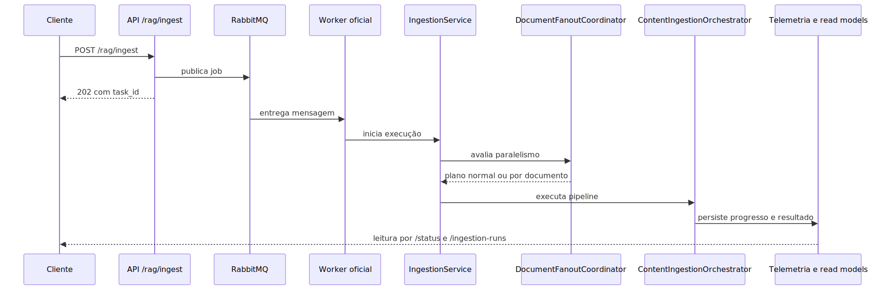

# Pipeline de Ingestão

## 1. Visão geral

A ingestão existe para transformar material bruto em acervo consultável com rastreabilidade operacional. Isso parece simples quando dito em uma frase, mas no código real envolve aceitar o pedido sem travar o atendimento HTTP, decidir se o lote pode ser dividido, escolher a origem do conteúdo, processar cada tipo de material, persistir os resultados e atualizar a visão operacional do run.

Em linguagem simples: ingestão não é “ler arquivo e salvar no banco vetorial”. É uma esteira que prepara conteúdo para que o restante da plataforma consiga confiar no acervo produzido.

## 2. O problema que este módulo resolve

O problema real da ingestão é combinar diversidade de origem com previsibilidade operacional. Um sistema corporativo de IA precisa lidar com arquivos locais, fontes remotas, anexos, OCR, conteúdo multimodal, fan-out por documento, cancelamento cooperativo e leitura operacional do lote, tudo isso sem transformar a API em gargalo.

Se a ingestão fosse tratada só como upload e indexação, três coisas quebrariam rapidamente.

1. O request HTTP ficaria pesado demais.
2. Cada tipo de conteúdo começaria a exigir um fluxo improvisado próprio.
3. O operador perderia a capacidade de entender o que o lote realmente fez.

A arquitetura atual tenta evitar isso com uma fachada de aplicação, um orquestrador modular, factories especializadas e telemetria própria de execução.

## 3. Conceitos necessários para entender o módulo

### Aceitação assíncrona

Aceitação assíncrona significa que o endpoint recebe o pedido, valida o contexto mínimo e devolve um contrato de acompanhamento antes de o processamento pesado terminar. Isso impede que OCR, parsing e fan-out concorram com o tempo de resposta do usuário.

### Ingestion request

O `IngestionRequest` é o objeto que traduz YAML e contexto de entrada em um comando de negócio estruturado. O valor prático disso é concentrar a diversidade de fontes em um contrato interno mais previsível.

### Data source

Data source é a abstração que resolve de onde o conteúdo vem. Ela separa “como descobrir o material” de “como processar esse material”. Essa distinção é importante porque baixar uma página remota, listar um bucket ou ler um arquivo local são problemas diferentes.

### Processor

Processor é a peça especialista em entender o tipo de conteúdo. Ele não decide a estratégia macro do lote; ele decide como extrair, limpar, estruturar e quebrar em partes um tipo específico de documento.

### Fan-out documental

Fan-out é a decisão de dividir um lote em execuções menores por documento ou grupo de documentos. A utilidade prática é aumentar throughput e isolar melhor o comportamento do processamento, sem esconder que o lote ainda pertence a um único run lógico.

### Telemetria operacional

Telemetria operacional é o conjunto de estados, métricas e resumos usados para contar a história do run. Ela é diferente do simples status efêmero de uma task. O objetivo é permitir leitura mais rica de filas, filhos, throughput, ETA e estágio atual.

## 4. Como o módulo funciona por dentro

A ingestão começa fora do orquestrador. O primeiro ator importante é a fachada de aplicação, que monta o contexto do pedido, resolve paralelismo solicitado, escolhe o modo de execução e registra o início do run. Essa camada existe para que API e outras entradas reutilizem a mesma semântica de negócio.

Depois disso, a fachada constrói o `IngestionRequest`. Esse passo é importante porque o YAML sozinho ainda não está no formato ideal para execução. O sistema precisa transformar configuração, fontes e contexto em um pedido estruturado.

Com o pedido pronto, a fachada decide entre dois caminhos.

- Caminho direto, quando o lote segue inteiro para o orquestrador.
- Caminho com fan-out, quando o lote é quebrado em execuções menores.

No caminho direto, o `ContentIngestionOrchestrator` assume a coordenação real. Ele não concentra toda a inteligência numa única classe gigantesca. O código lido mostra um desenho com mixins, factories, componentes de runtime, coordenador de execução, executor de pipeline e finalizador de resultado.

Na prática, isso significa que o orquestrador age mais como maestro do que como processador bruto. Ele organiza contexto, delega parsing por tipo, coordena persistência, acompanha progresso e fecha o resultado.

## 5. Pipeline ou fluxo principal

### Etapa 1: recebimento e preparação do pedido

A ingestão recebe o contexto vindo da borda HTTP ou de outro boundary compatível. Nesse momento, o sistema registra início, prepara callback de progresso e constrói o pedido operacional rico.

### Etapa 2: decisão de paralelismo

Com o pedido em mãos, a fachada decide se o lote vai seguir inteiro ou se pode entrar em fan-out. O detalhe importante aqui é que essa decisão não nasce no endpoint. Ela nasce no serviço de aplicação da ingestão.

### Etapa 3: descoberta da origem

O pipeline precisa entender se o conteúdo veio de arquivo local, fonte remota, storage, Confluence, YouTube ou fonte dinâmica. Essa etapa resolve o material elegível antes do processamento profundo.

### Etapa 4: processamento por tipo de conteúdo

Depois que o material foi descoberto, cada item segue para o processor adequado. O processor especializado cuida de extração, limpeza, estruturação e chunking, sem reinventar o contrato inteiro do pipeline para cada tipo de documento.

### Etapa 5: persistência e indexação

Com o conteúdo preparado, o pipeline persiste os resultados, atualiza o destino vetorial e registra metadados e sinais operacionais. O objetivo não é só “guardar texto”, mas produzir acervo consultável com coerência operacional.

### Etapa 6: fechamento operacional

No fim, a ingestão publica um resultado compreensível para operadores e consumidores. Isso inclui status, métricas, snapshots de paralelismo e leitura operacional do run.

## 6. Decisões técnicas importantes

### Tirar o trabalho pesado do request HTTP

Essa decisão protege latência e estabilidade do boundary público. O trade-off é a necessidade de acompanhar status assíncrono em vez de confiar apenas na resposta imediata do endpoint.

### Deixar a decisão de fan-out no serviço, não no endpoint

O ganho é manter a API fina e impedir que a semântica de paralelismo fique espalhada em múltiplos boundaries. O trade-off é que o serviço precisa conhecer mais regras de execução do lote.

### Usar orquestrador modular em vez de god class

O ganho é clareza evolutiva: factories, processadores, coordenador e finalizador têm papéis distintos. O trade-off é exigir mais disciplina para manter contratos consistentes entre essas peças.

### Manter telemetria própria do run

O ganho é permitir leitura operacional real, não apenas polling superficial de task. O trade-off é a necessidade de manter mais estado e mais modelos de observabilidade.

## 7. O que acontece em caso de sucesso

No caminho feliz, a ingestão recebe um pedido coerente, constrói o request interno, escolhe o modo correto de execução, processa o material com os processors adequados, persiste os resultados e fecha o run com status e métricas compreensíveis.

Para o usuário final, sucesso pode aparecer como aceite assíncrono e depois conclusão operacional do lote. Para o operador, sucesso também significa conseguir responder perguntas como: quantos documentos entraram, se houve fan-out, quanto já terminou e se o run está consistente.

## 8. O que acontece em caso de erro

### Erro antes do processamento real

Se a falha acontece antes da continuação assíncrona, o problema tende a estar na entrada, no contexto do pedido ou na resolução inicial do YAML.

### Erro no fan-out

Se o lote foi dividido, o problema pode acontecer na coordenação do pai, na publicação dos filhos ou na sincronização do estado agregado. Esse tipo de erro exige olhar o run como conjunto, não só um documento isolado.

### Erro por tipo de conteúdo

Quando um processor ou origem específica falha, o sintoma pode aparecer como degradação localizada do lote. Isso é justamente um dos motivos para a arquitetura separar descoberta de fonte, processor e telemetria operacional.

### Erro de persistência ou indexação

Quando o conteúdo foi processado, mas a persistência falha, o risco maior é produzir um lote parcialmente compreendido pela operação. Por isso a telemetria e o fechamento do resultado importam tanto quanto o parsing em si.

## 9. Configurações que mudam o comportamento

As configurações relevantes da ingestão, pelo código lido, se agrupam em quatro classes.

### Origens habilitadas

O YAML decide que famílias de origem entram no lote. Isso muda radicalmente o caminho da esteira.

### Perfis de processamento por tipo

Perfis por tipo de conteúdo controlam parsing, OCR, multimodalidade, chunking e outras decisões internas. O importante aqui não é decorar chave. É entender que PDF, imagem, markdown e storage remoto não passam pela mesma lógica.

### Paralelismo documental

O pedido pode carregar uma intenção de paralelismo, mas a decisão efetiva ainda é resolvida pelo serviço de ingestão conforme o contexto do lote e as regras do runtime.

### Destino de persistência

O comportamento do acervo também depende de como a plataforma trata persistência e indexação do conjunto vivo. Isso afeta não só performance, mas a integridade operacional do resultado.

## 10. Observabilidade e diagnóstico

A investigação de ingestão fica mais clara quando é dividida em quatro perguntas.

1. O pedido foi aceito e transformado em request interno coerente?
2. O lote seguiu pelo caminho direto ou por fan-out?
3. O processamento falhou na descoberta da origem, no processor ou na persistência?
4. O estado operacional final conta a mesma história que os logs e a execução real?

Sinais importantes do código lido:

- a fachada da ingestão registra início, modo de execução e paralelismo solicitado;
- o orquestrador registra etapas explícitas do pipeline;
- o runtime mantém snapshots de paralelismo documental;
- a leitura operacional do run existe para ir além do simples status efêmero.

## 11. Exemplo prático guiado

Imagine um lote com múltiplos PDFs e anexos remotos.

1. O pedido entra pela API e é aceito como execução assíncrona.
2. O serviço de ingestão monta um `IngestionRequest` com fontes e contexto.
3. O serviço decide que o lote pode usar fan-out documental.
4. Cada documento segue para a família e o processor corretos.
5. O pipeline extrai conteúdo, faz chunking, persiste e atualiza a telemetria.
6. O operador acompanha o pai, os filhos e o progresso agregado pela leitura operacional.

O detalhe importante é que o usuário não precisa conhecer cada arquivo do repositório para entender isso. Ele precisa entender que a ingestão é uma cadeia de decisão entre entrada, paralelismo, processamento, persistência e observabilidade.

## 12. Explicação 101

Pense na ingestão como a cozinha da plataforma. O pedido chega com ingredientes muito diferentes. Alguns vêm prontos, outros vêm crus, outros ainda precisam ser buscados fora do prédio.

A ingestão não serve apenas para guardar esses ingredientes. Ela serve para limpar, organizar, separar em porções úteis e registrar o que aconteceu durante o preparo. Só depois disso o restante da plataforma consegue usar esse material com confiança.

## 13. Limites e pegadinhas

- Aceitação da ingestão não prova indexação concluída.
- Fan-out não nasce no endpoint só porque o lote é grande.
- Processar um tipo de arquivo não significa que todos os outros tipos seguem o mesmo caminho.
- Status efêmero de task não substitui a leitura operacional do run.
- Ler apenas a configuração não basta para entender o comportamento do lote; a decisão real passa pela fachada e pelo orquestrador.

## 14. Evidências no código

- [src/services/ingestion_service.py](../src/services/ingestion_service.py): fachada de aplicação da ingestão, decisão de fan-out e montagem do request.
- [src/ingestion_layer/main_orchestrator.py](../src/ingestion_layer/main_orchestrator.py): orquestrador modular do pipeline de ingestão.
- [src/api/routers/config_resolution.py](../src/api/routers/config_resolution.py): resolução de configuração compartilhada usada pelos boundaries.
