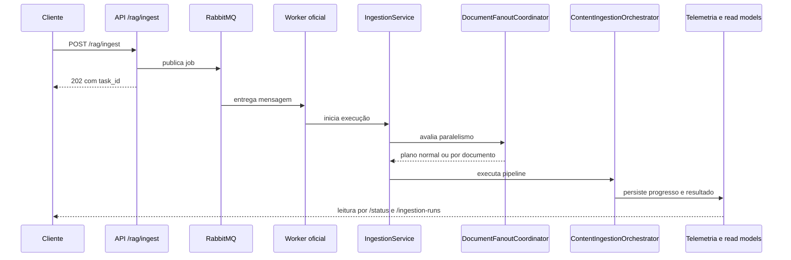
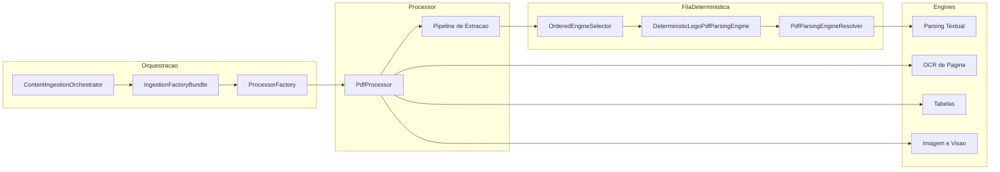

# Pipeline de Ingestão

Este documento descreve a ingestão como ela roda hoje no código.
O foco é separar o que acontece no boundary HTTP, no worker e na
camada operacional de leitura dos runs.

## O que a ingestão faz

A ingestão tem dois níveis.

- Nível 1: aceitar o pedido e tirar o trabalho pesado do request HTTP.
- Nível 2: processar documentos, persistir resultado e atualizar a
  visão operacional.

Em linguagem simples:

- a API aceita o pedido;
- o worker consome a fila;
- o serviço de ingestão decide o caminho interno;
- a telemetria e os endpoints de runs contam a história do processo.

## Escopo deste documento

Este documento é o dono da ingestão documental.
Ele cobre o que acontece do pedido de ingestão até a esteira modular de
processamento, persistência, fan-out e leitura operacional.

Para evitar redundância com outros documentos:

- README-ARQUITETURA.md cobre a topologia macro entre API, worker,
    scheduler e infraestrutura;
- README-ETL.md cobre o domínio ETL, que compartilha worker, mas não é
    ingestão documental;
- README-RAG.md cobre o runtime de consulta, não a construção do acervo.
- tutorial-101-processo-completo-de-ingestao-e-rag.md costura os dois
    lados em uma leitura guiada, ponta a ponta.

Em linguagem simples: este documento explica como o acervo é produzido,
não como a pergunta é respondida depois.

## Leitura relacionada

- Visão macro da plataforma: [README-ARQUITETURA.md](./README-ARQUITETURA.md)
- Pipeline de consulta RAG: [README-RAG.md](./README-RAG.md)
- Fluxo guiado de ingestão até resposta: [tutorial-101-processo-completo-de-ingestao-e-rag.md](./tutorial-101-processo-completo-de-ingestao-e-rag.md)
- Pipeline combinado de ingestão e RAG: [PIPELINE-INGESTAO-RAG.md](./PIPELINE-INGESTAO-RAG.md)
- Domínio ETL dedicado: [README-ETL.md](./README-ETL.md)
- Versão didática 101 deste assunto: [tutorial-101-ingestao.md](./tutorial-101-ingestao.md)
- Tutorial 101 específico de PDF: [tutorial-101-ingestao-pdf.md](./tutorial-101-ingestao-pdf.md)
- Tutorial 101 específico de Excel: [tutorial-101-ingestao-excel-e-rag-de-excel.md](./tutorial-101-ingestao-excel-e-rag-de-excel.md)

## Entry points reais

### Boundary HTTP

As rotas públicas do domínio ficam sob o prefixo /rag.

- POST /rag/ingest.
- GET /rag/ingest/jobs/running.
- POST /rag/ingest/{task_id}/cancel.

As rotas operacionais de leitura ficam sob /ingestion-runs.

- POST /ingestion-runs/query.
- GET /ingestion-runs/active.
- POST /ingestion-runs/benchmark.
- POST /ingestion-runs/detail.

O acompanhamento assíncrono usa /status e /api/v1/status.

### Worker

O consumo real sai do boundary HTTP e entra no worker oficial.
Esse worker exige RabbitMQ como backend e Dramatiq como consumer
runtime.

## Fluxo ponta a ponta

1. A API recebe o pedido de ingestão.
2. O correlation_id é resolvido no boundary HTTP.
3. O job é publicado para execução assíncrona.
4. A API devolve 202 com task_id e URLs de acompanhamento.
5. O worker consome a mensagem e entrega a execução ao
   IngestionService.
6. O IngestionService decide entre o caminho normal e o fan-out por
   documento.
7. O ContentIngestionOrchestrator executa a ingestão real.
8. A telemetria e o read model operacional alimentam /status e
   /ingestion-runs.

O preparador compartilhado desse caminho é o
IngestionRuntimePreparationService. Ele concentra a preparação comum
entre entrada HTTP e execução de job, reduzindo a chance de cada caminho
montar runtime de ingestão de um jeito diferente.



## Onde a decisão de fan-out acontece

O fan-out não nasce na API.
Ele nasce dentro do IngestionService.

Na prática, isso significa que o request HTTP não garante paralelismo
sozinho. O serviço ainda precisa validar se o lote pode ser dividido.

O método público principal é execute.
Existe também execute_single_document, que força o caminho oficial de
um único documento e desliga o fan-out nesse slice.

## Arquitetura modular da ingestão

A ingestão avançada não é uma classe única fazendo tudo.
O desenho observado hoje separa o fluxo em peças especializadas para
evitar acoplamento excessivo e permitir evolução por tipo de conteúdo.

O centro do runtime é o ContentIngestionOrchestrator.
Ele não implementa toda a inteligência sozinho.
Ele combina mixins de despacho por tipo, anexos, progresso, montagem de
resultado e persistência, e delega a coordenação pesada para serviços
auxiliares.

Em volta dele existem quatro blocos importantes.

- IngestionFactoryBundle, que monta as factories de clientes,
    processadores, data sources e vector stores.
- IngestionCoordinator, que organiza contexto, execução e finalização do
    pipeline.
- runtime components, que acoplam peças pesadas fora do construtor para
    reduzir inicialização acoplada.
- progress and cancellation hooks, para observabilidade e cancelamento
    cooperativo.

Em linguagem simples: o orquestrador funciona como maestro.
Ele distribui responsabilidade para componentes menores em vez de virar
uma god class com lógica de cada engine embutida no mesmo lugar.

## Como as factories sustentam a modularidade

A modularidade não começa no PDF.
Ela começa antes, no bundle de factories que prepara os quatro tipos de
dependência usados pela ingestão.

- client_factory decide como ler o conteúdo bruto.
- processor_factory decide qual processador manipula cada tipo de
    documento.
- data_source_factory resolve a origem do acervo.
- vector_store_factory resolve a store de destino.

Isso importa porque o orquestrador não deveria conhecer em detalhe cada
cliente, cada source e cada processor concreto.
Ele recebe um conjunto coerente de fábricas e trabalha em cima desse
contrato.

Boa prática observada no código:
o bundle usa lazy loading para credenciais, reduzindo custo de startup e
evitando carregar segredo cedo demais quando a execução ainda não
precisou dele.

## Contrato comum dos processadores

Os processadores de conteúdo seguem um contrato base comum.
BaseContentProcessor implementa o template method principal de
processamento e garante etapas mínimas previsíveis.

O fluxo base de um processador é este:

1. validar se o conteúdo pode ser processado;
2. executar pré-processamento;
3. extrair texto;
4. limpar e normalizar o texto;
5. quebrar em chunks;
6. executar pós-processamento;
7. respeitar cancelamento cooperativo entre as etapas.

Isso é importante porque evita que cada processador invente um contrato
próprio.
TXT, PDF, Excel, HTML e outros tipos podem ter comportamento interno
distinto, mas continuam obedecendo a uma espinha dorsal comum.

Em linguagem simples: cada processador pode ser especialista no seu tipo
de arquivo, mas todos entram e saem pela mesma porta arquitetural.

## Mapa 101 das modalidades reais de ingestão

Se você precisa explicar ingestão de forma didática para alguém novo no
projeto, este é o resumo mais útil: o runtime principal não trata todos
os tipos pelo mesmo caminho. Ele agrupa o trabalho em famílias.

- família local: markdown, texto, DOCX, PDF, JSON, PowerPoint e imagem;
- família Confluence: páginas e anexos com resolução própria;
- família remota: web scraping, YouTube, Google Drive, Azure Blob, S3 e MinIO;
- família dynamic_data: fontes que geram documentos ou arquivos no runtime.

<!-- markdownlint-disable MD013 -->
| Modalidade | Evidência de entrada | Dono do fluxo | O que acontece por dentro, em linguagem simples | Status no runtime principal |
| --- | --- | --- | --- | --- |
| Markdown | `markdown_file_paths` em `IngestionRequest` | `LocalContentFamilyService` | arquivo local entra na esteira comum e vira chunks textuais orientados por markdown | pronto |
| Texto/TXT | `text_file_paths` | `LocalContentFamilyService` | usa a esteira local mais simples, sem pipeline multimodal especializado | pronto |
| DOCX | `docx_file_paths` | `LocalContentFamilyService` + `DocxContentProcessor` | valida bytes do Word, extrai parágrafos e entrega documento canônico antes do chunking | pronto |
| PDF | `pdf_file_paths` | `LocalContentFamilyService` + `PDFContentProcessor` | usa a esteira mais avançada, com parsing, OCR e componentes visuais | pronto |
| JSON | `json_file_paths` | `LocalContentFamilyService` + `JsonContentProcessor` | preserva estrutura, aplica perfis e cria metadados próprios para chunking | pronto |
| PowerPoint | `ppt_file_paths` | `LocalContentFamilyService` + `PPTContentProcessor` | extrai texto dos slides antes de seguir para chunking | pronto |
| Imagem | `image_file_paths` | `LocalContentFamilyService` + `ImageContentProcessor` | delega para pipeline multimodal com OCR, descrição e chunk especializado | pronto |
| Confluence | `confluence_page_ids` | `ConfluenceContentFamilyService` | resolve páginas elegíveis, anexos e só depois materializa a página canônica | pronto |
| Web scraping | `web_scraping_urls` | `RemoteContentFamilyService` | pré-baixa páginas e anexos, monta documentos ricos e então indexa | pronto |
| YouTube | `youtube_video_ids` e `youtube_sources` | `RemoteContentFamilyService` | resolve vídeos e playlists e reaproveita a esteira remota | pronto |
| Google Drive | `google_drive_sources` | `RemoteContentFamilyService` | descobre documentos elegíveis, deduplica IDs e envia ao pipeline remoto | pronto |
| Azure Blob | `azure_blob_sources` | `RemoteContentFamilyService` | coleta blobs, aplica política incremental e converte em chunks | pronto |
| S3 | `s3_sources` | `RemoteContentFamilyService` | lista objetos, filtra padrões e reaproveita o pipeline remoto | pronto |
| MinIO | `minio_sources` | `RemoteContentFamilyService` | replica a lógica de storage remoto com client e credenciais próprias | pronto |
| Dados dinâmicos | `dynamic_data_sources` | `DynamicDataContentFamilyService` | executa scripts/fontes dinâmicas e indexa o material gerado no runtime | pronto |
| Excel `.xlsx` e `.xls` | parser e factory existem, mas o contrato principal não expõe `excel_file_paths` | `ExcelContentProcessor` existe fora do caminho compartilhado | parser e RAG tabular existem, mas a entrada genérica compartilhada ainda está parcial | parcial |
<!-- markdownlint-enable MD013 -->

### Família local

A família local é a porta de entrada dos arquivos já disponíveis para o
worker. Ela chama a esteira comum de processamento por arquivo e depois
cada tipo segue para o processador correto.

Em linguagem simples: a família local organiza a fila. Quem entende o
conteúdo de verdade é o processador do tipo.

### Família Confluence

Confluence não foi tratado como um HTML remoto qualquer.
Ele ganhou uma esteira própria porque precisa resolver páginas
elegíveis, recursão, visibilidade e anexos antes do chunking.

Em linguagem simples: no Confluence, o sistema primeiro decide o que é
uma página válida. Só depois ele transforma isso em documento.

### Família remota

A família remota cobre origens que não chegam como arquivo local pronto.
Primeiro o sistema precisa listar, baixar ou pré-materializar a origem.
Depois disso, o pipeline comum de documento e chunk reaparece.

Em linguagem simples: a família remota primeiro busca o material e só
depois começa a ingerir de verdade.

### Família dynamic_data

Dynamic data é uma família separada porque a fonte é um script ou
processo que gera documentos ou arquivos temporários durante a própria
execução.

Em linguagem simples: aqui a ingestão começa fabricando o material que
vai ser ingerido.

### O caso especial de Excel

Excel precisa ser descrito com rigor, porque é fácil gerar expectativa
errada.

- `ContentProcessorFactory` registra `ExcelContentProcessor`.
- `FileSystemDataSource` reconhece `.xlsx` e `.xls`.
- Existe tutorial específico de Excel e fluxo especializado de RAG tabular.
- Mas o contrato compartilhado `IngestionRequest` não expõe `excel_file_paths`.
- E `IngestionService` não coleta Excel em `local_files` no caminho genérico atual.

Impacto prático: Excel existe no projeto, mas ainda não deve ser tratado
como ingestão local genérica pronta fim a fim.

## PDF é um pipeline de pipelines

O caso mais avançado da ingestão hoje é PDF.
Ele não é tratado como um simples processador monolítico.
O runtime separa o problema em várias camadas menores.

Primeiro existe um pipeline explícito de extração, com etapas como:

- validação dos bytes e da assinatura %PDF;
- pré-processamento document-level de OCR, quando aplicável;
- parsing via engine;
- aplicação controlada do resultado para metadata e persistência.

Depois, por baixo desse pipeline, existe a seleção da engine concreta de
parsing e, em paralelo, outras famílias de engines para OCR de página,
tabelas, extração de imagem, descrição de imagem e embeddings visuais.

Em linguagem simples: quando o sistema diz que está processando um PDF,
na prática ele está coordenando várias mini-esteiras especializadas.

## Como a fila de engines é governada

O contrato central da fila de engines está em OrderedEngineSelector e no
parser tipado de base.options.
Esse desenho padroniza a leitura do YAML e a execução encadeada das
engines, em vez de espalhar ifs por todo o runtime.

Os pontos mais importantes observados no código são estes:

- a fila é ordenada e determinística;
- requested_engine e fallback_enabled entram como parte explícita do
    request;
- cada tentativa carrega o resultado padronizado da engine anterior;
- a próxima opção decide se roda com base no contexto objetivo, e não em
    um if hardcoded no orquestrador;
- quando fallback_enabled é falso, a fila para após a tentativa anterior;
- hints de downstream permitem que a engine anterior sinalize, de forma
    genérica, que a próxima deve pular.

Isso é a parte mais importante da arquitetura modular.
O sistema evita esconder política operacional dentro do core do
orquestrador.
Quem governa a ordem e o encadeamento é a configuração e o contrato
comum da fila.

## Deterministic Lego e política de falha

Para parsing de PDF, a engine mais estratégica do desenho atual é a
DeterministicLegoPdfParsingEngine.
Ela recebe uma lista de opções de engine e aplica uma política de falha
explícita, como strict_first_success ou best_effort.

Na prática, isso significa que a plataforma não trata toda engine como
equivalente.
Ela preserva ordem, motivo de handoff, resultado canônico, capacidade e
contrato de saída antes de seguir para a próxima opção.

Boa prática importante do desenho atual:
mesmo quando uma engine falha ou está indisponível, o runtime tenta
normalizar o resultado operacional para manter observabilidade e logs
comparáveis.

## Disponibilidade, catálogo e desativação controlada

O runtime também não presume que toda engine configurada esteja sempre
instalada ou pronta.
PdfParsingEngineResolver verifica dependências e aplica política de
disponibilidade conforme o mode configurado.

Se a engine estiver indisponível:

- em mode crítico, o runtime falha fechado;
- em modo permissivo, a engine pode ser substituída por uma engine
    desabilitada que preserva o contrato e a telemetria.

Além disso, PdfEngineCatalog separa engines configuradas das engines
realmente usadas em runtime.
Isso é útil para responder duas perguntas diferentes:

- o que o YAML mandou disponibilizar;
- o que a execução de fato utilizou.

Em linguagem simples: o sistema diferencia intenção de configuração e
execução real, o que é essencial para debugging sério.

## OCR documental não expõe fallback livre por engine

Nem toda família modular aceita o mesmo tipo de fallback.
No OCR document-level de PDF, o código é explícito:
processing.ocr.document_preprocessing não aceita fallback_enabled por
engine.

Isso mostra uma boa prática importante.
A plataforma não tenta uniformizar tudo à força.
Cada família de engine expõe apenas o grau de liberdade que o contrato
real suporta com segurança.

Em linguagem simples: modularidade não significa liberar qualquer
combinação arbitrária; significa ter contratos claros por família de
capacidade.

## Boas práticas reais da arquitetura de engines

Estas práticas já aparecem no runtime e merecem ser tratadas como regra
de leitura da arquitetura.

- o YAML governa a fila, não o orquestrador por nome de engine;
- o orquestrador central coordena, mas não embute inteligência nominal de
    cada engine;
- a engine anterior publica fatos objetivos para a próxima tentativa;
- cancelamento cooperativo pode interromper o pipeline entre etapas;
- logs de etapa registram se a técnica executou ou foi pulada, com
    motivo explícito;
- disponibilidade e wiring de engine são tratados antes da execução
    efetiva.

## Como ler a ingestão avançada sem se perder

Se você precisar estudar a ingestão profunda, use esta ordem mental.

1. Boundary HTTP e worker para entender o disparo do job.
2. IngestionService para entender fan-out e coordenação do lote.
3. ContentIngestionOrchestrator para entender o núcleo da esteira.
4. IngestionFactoryBundle e contracts base para entender modularidade.
5. Processadores por content type.
6. Pipeline PDF e fila de engines quando o problema for parsing ou OCR.

Essa ordem evita um erro comum:
abrir primeiro uma engine concreta de PDF e concluir errado que ela é a
fonte de verdade da ingestão inteira.

## Quem controla o runtime do worker

WorkerProcessRuntime sobe dois blocos em ordem coordenada.

- plano de controle multicanal;
- runtime assíncrono de jobs.

O snapshot exposto pelo runtime responde se o worker está pronto para:

- multichannel supervisor;
- ingestão;
- ETL;
- fan-out ativo.

Em linguagem simples: sem esse runtime, a API aceita o pedido, mas o
trabalho pesado não anda.

## Correlação e observabilidade

O job nasce na API e segue com correlation_id reaproveitado.
Depois, a investigação prática continua por três superfícies.

- /status/{task_id} para polling.
- /status/stream/{task_id} para SSE.
- /ingestion-runs/detail para abrir a visão durável do run.

O router de streaming também reconcilia ingestões órfãs quando um
processo local morre sem registrar status terminal.

## O que a leitura operacional expõe

Os endpoints de runs não são só histórico bruto.
Eles cruzam o estado persistido com overlays do job ativo.

Uso prático:

- /ingestion-runs/query para listar e filtrar execuções;
- /ingestion-runs/active para mostrar o conjunto ativo;
- /ingestion-runs/detail para abrir um run específico;
- /ingestion-runs/benchmark para linha de base histórica do pipeline
  PDF.

## O detalhe operacional não é um espelho cru do banco

O serviço canônico de leitura operacional é o
IngestionOperationalReadService.
Ele não só lê a persistência: ele também cruza job vivo, read model,
detalhe durável, filhos de fan-out e fonte de replay.

Quando existe fan-out, o detalhe expõe o contrato `fanout_overview`.
Esse bloco resume filhos, paralelismo efetivo, progresso terminal,
throughput, ETA e sinais de cancelamento. Em linguagem simples: ele é a
visão curta do lote dividido, sem obrigar o operador a abrir filho por
filho para entender se o processamento está saudável.

Na prática, isso evita que cada rota monte seu próprio resumo parcial.
O mesmo serviço concentra:

- listagem paginada de runs;
- conjunto ativo em memória;
- detalhe persistido com overlay do job vivo;
- preview dos filhos do fan-out;
- origem de replay com documentos que ainda podem ser reexecutados.

Em linguagem simples: a leitura operacional do painel já é uma camada de
interpretação. Ela existe para contar a história do run de forma mais
confiável do que uma leitura bruta de tabela.

## Cancelamento cooperativo e reconciliação de runs fantasmas

O domínio de ingestão hoje já tem duas proteções diferentes.

A primeira é o cancelamento cooperativo exposto no boundary por
POST /rag/ingest/{task_id}/cancel.
A segunda é a reconciliação canônica de runs ativos que ficaram sem
fechamento confiável no plano de controle.

Essa reconciliação não terminaliza tudo automaticamente.
Ela classifica cada run ativo em categorias auditáveis, como:

- healthy_active;
- safe_to_cancel;
- safe_to_fail;
- control_plane_degraded;
- needs_manual_review.

Só as categorias seguras podem sofrer mutação terminal automática.
As demais ficam preservadas para análise humana ou investigação do plano
de controle.

Em linguagem simples: quando um worker cai, um pai perde contato com os
filhos ou um estado ativo fica suspeito, o sistema tenta primeiro
classificar com segurança antes de carimbar cancelado ou erro.

## Perfis operacionais, benchmark e ETA

O resumo operacional do run já é mais rico do que um contador de
sucessos e falhas.
O agregado canônico do domínio deriva alertas, quarentena, replay,
scorecards e projeções de capacidade.

Hoje, a visão operacional já expõe perfis prontos de execução para PDFs:

- balanced;
- throughput_24h;
- deep_ocr.

Além disso, o progress_overview já calcula sinais como:

- active_children e terminal_children;
- throughput_confidence;
- capacity_effective_parallelism;
- processed_docs_per_hour;
- eta_seconds e projected_completion_at.

O benchmark histórico de PDFs usa essa mesma linha de raciocínio para
propor baseline e perfil recomendado.

Em linguagem simples: o painel não responde só "quantos terminaram".
Ele também ajuda a responder "com que velocidade o lote anda" e "qual
perfil operacional faz mais sentido para esse tipo de PDF".

## Como validar que a ingestão funcionou

1. Suba a API e o worker oficial.
2. Execute POST /rag/ingest.
3. Confirme resposta 202 com task_id.
4. Acompanhe a task em /status/{task_id} ou /status/stream/{task_id}.
5. Abra /ingestion-runs/detail para conferir alertas, qualidade,
    fan-out e ETA operacional.
6. Use /ingestion-runs/benchmark quando a dúvida for capacidade histórica
    de PDF, e não um run isolado.
7. Se houver erro, diferencie falha de publish, falha do worker,
    reconciliação e
   falha interna do pipeline.

## Fluxograma funcional cruzado

```mermaid
flowchart LR
    subgraph Cliente
        C1[Cliente ou UI]
    end

    subgraph API
        A1[/rag/ingest]
        A2[/status]
        A3[/ingestion-runs]
    end

    subgraph Worker
        W1[WorkerProcessRuntime]
        W2[IngestionService]
        W3[DocumentFanoutCoordinator]
        W4[ContentIngestionOrchestrator]
    end

    subgraph Infra
        I1[RabbitMQ]
        I2[Redis]
        I3[PostgreSQL]
        I4[Vector Store]
    end

    C1 --> A1 --> I1 --> W1 --> W2
    W2 --> W3 --> W4
    W4 --> I2
    W4 --> I3
    W4 --> I4
    I2 --> A2
    I3 --> A3
```

## Fluxo modular de PDF e engines



## Como rodar e validar

1. Ative a .venv.
2. Suba a API.
3. Suba o worker oficial.
4. Dispare POST /rag/ingest com um YAML válido.
5. Valide 202, task_id e correlation_id.
6. Consulte /status e /ingestion-runs/detail até estado terminal.
7. Se o lote for PDF, compare o run com /ingestion-runs/benchmark para
    entender baseline, perfil sugerido e ritmo esperado.

## Evidência no código

- src/api/routers/rag_ingestion_router.py
- src/api/routers/rag_cancellation_router.py
- src/api/routers/streaming_router.py
- src/api/routers/ingestion_runs_router.py
- src/api/services/ingestion_operational_read_service.py
- src/api/services/ingestion_runtime_preparation_service.py
- IngestionRuntimePreparationService
- src/services/ingestion_service.py
- src/services/document_fanout_coordinator.py
- src/api/services/worker_process_runtime.py
- src/ingestion_layer/main_orchestrator.py
- src/ingestion_layer/ingestion_factory_bundle.py
- src/ingestion_layer/processors/base.py
- src/ingestion_layer/processors/pdf_pipeline/pdf_extraction_stages.py
- src/ingestion_layer/processors/pdf_document_ocr_service.py
- src/ingestion_layer/processors/pdf_parsing_engine_resolver.py
- src/ingestion_layer/pdf_tools/pdf_base_options_parser.py
- src/ingestion_layer/pdf_tools/deterministic_lego_pdf_parsing_engine.py
- src/ingestion_layer/engine_catalog.py
- src/telemetry/ingestion/operational_insights.py
- src/telemetry/ingestion/ingestion_run_reconciliation_service.py
- app/runners/worker_runner.py

## Lacunas no código

Não encontrado no código.

Onde deveria estar:

- um endpoint único de diagnóstico que mostre, no mesmo payload, fila,
  worker, fan-out e stores ativos da ingestão;
- uma visão administrativa pronta que relacione publish do job e
  consumo do worker sem precisar cruzar várias rotas.
