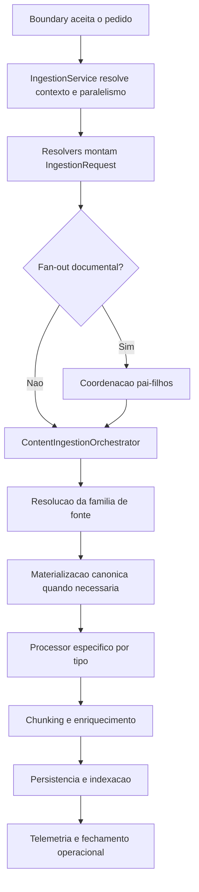
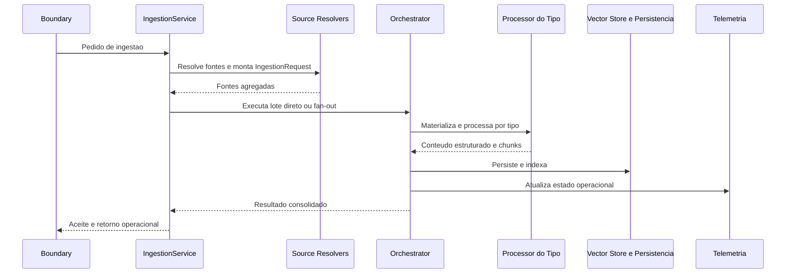

# Manual técnico, executivo, comercial e estratégico: Pipeline de Ingestão

## 1. O que é esta feature

O pipeline de ingestão é a esteira que transforma material bruto em acervo utilizável pelo restante da plataforma. Ele não existe só para mover arquivos para um banco vetorial. Ele existe para receber fontes heterogêneas, decidir como cada fonte deve ser tratada, extrair conteúdo de forma especializada, preservar metadados relevantes, persistir o resultado e manter uma leitura operacional confiável do run.

No código real, ingestão é uma capacidade sistêmica. Ela combina uma fachada de aplicação, resolução de fontes, orquestração modular, processamento por tipo, persistência, fan-out documental e telemetria. Isso significa que o sistema não pensa em “arquivo” apenas como um blob. Ele pensa em lote, origem, tipo de conteúdo, política de execução, rastreabilidade e qualidade do dado produzido.

## 2. Que problema ela resolve

O problema real da ingestão não é “importar documentos”. O problema é tornar previsível o processamento de conteúdos muito diferentes sem destruir latência, clareza operacional ou qualidade do acervo.

Sem esse pipeline, a plataforma enfrentaria pelo menos seis problemas.

- A API teria de carregar trabalho pesado demais, como parsing, OCR, scraping e indexação.
- Cada tipo de conteúdo criaria um fluxo improvisado próprio, com comportamento diferente e difícil de manter.
- Fontes remotas e arquivos locais se misturariam sem fronteira clara entre aquisição e processamento.
- O operador perderia a capacidade de entender em que etapa um lote falhou.
- O produto não conseguiria sustentar casos corporativos com PDF complexo, planilha, JSON estruturado e páginas web no mesmo padrão de governança.
- O acervo final ficaria inconsistente porque tipos distintos exigem técnicas de extração e chunking diferentes.

## 3. Visão executiva

Para liderança, o pipeline de ingestão importa porque ele é a base de confiança do produto. Sem ingestão boa, não existe RAG confiável, auditoria confiável nem operação previsível. Em termos práticos, ele reduz risco de dados incompletos, respostas ruins por acervo mal preparado e suporte caro por falta de rastreabilidade.

Ele também cria capacidade de escala. A plataforma deixa de depender de um fluxo manual por tipo de documento e passa a trabalhar com uma esteira comum, onde novos tipos ou novas fontes podem entrar sem reescrever toda a superfície operacional.

## 4. Visão comercial

Comercialmente, a ingestão é o argumento que sustenta a promessa de “trazer o conteúdo do cliente para dentro da plataforma com governança”. Isso vale para contratos em PDF, páginas web, documentos Word, planilhas, exportações JSON e sites que precisam de captura autenticada ou resiliente.

O valor comercial suportado pelo código é este: a plataforma não trata todos os documentos da mesma forma. Ela usa técnicas específicas para cada família de conteúdo, preserva metadados úteis para busca e auditoria e mantém uma leitura operacional do lote. O que não deve ser prometido é ingestão perfeita para qualquer origem sem configuração. O pipeline melhora robustez e cobertura, mas continua dependente de fonte acessível, configuração coerente e conteúdo legível.

## 5. Visão estratégica

Estrategicamente, a ingestão fortalece a plataforma porque organiza o dado na entrada, que é o ponto onde a dívida técnica mais rapidamente contamina o restante do produto. O desenho atual reforça cinco objetivos estratégicos.

- Separar aquisição da fonte de processamento do conteúdo.
- Centralizar o comportamento da ingestão em uma fachada e um orquestrador, não em endpoints dispersos.
- Permitir paralelismo e fan-out sem perder o run lógico.
- Sustentar múltiplos tipos de conteúdo sem espalhar lógica condicional por todo o sistema.
- Entregar acervo com metadados ricos o suficiente para RAG, filtros, auditoria e diagnóstico posterior.

## 6. Conceitos necessários para entender

### Aceitação assíncrona

Aceitação assíncrona significa que o boundary registra o pedido e devolve um contrato de acompanhamento antes do processamento pesado terminar. Isso protege a latência da API contra OCR, scraping, parsing e indexação.

### IngestionRequest

`IngestionRequest` é o comando estruturado que concentra as fontes resolvidas do YAML, o contexto do tenant, o vetor de execução e dados operacionais do lote. Ele existe para impedir que o orquestrador receba configuração bruta demais.

### Data source

Data source é a abstração que resolve a origem do conteúdo. O papel dela é descobrir e materializar o insumo inicial. Isso é diferente do papel do processor, que interpreta o conteúdo.

### Processor

Processor é a peça especialista em transformar um tipo de conteúdo em texto, estrutura e chunks. PDF, HTML, Excel, DOCX e JSON não passam pela mesma técnica, porque o problema de extrair valor de cada um deles é diferente.

### Materialização canônica

Materialização canônica é o momento em que um documento bruto vindo de storage ou fonte remota é convertido para a representação esperada pelo processor. No caso de HTML remoto, por exemplo, isso garante texto limpo e `pages_info` coerente antes do chunking.

### Fan-out documental

Fan-out é a decisão de dividir o lote em execuções menores. Ele existe para throughput e isolamento operacional, mas sem perder a ideia de um run pai agregado.

### Telemetria operacional

Telemetria operacional é o conjunto de estados, métricas e snapshots que permite entender o lote para além de um simples status de task. É ela que sustenta leitura de progresso, quantidade de documentos, filhos, persistência e fechamento do run.

## 7. Como a feature funciona por dentro

A ingestão começa na fachada de aplicação. `IngestionService` recebe a configuração, resolve paralelismo solicitado, verifica se fan-out documental está habilitado e registra o início da execução. Essa camada não processa documento; ela prepara a execução.

Em seguida, o serviço monta o `IngestionRequest`, que concentra arquivos locais, URLs de scraping, fontes cloud, fontes dinâmicas e demais entradas resolvidas pelos source resolvers. Essa etapa é importante porque o YAML ainda não é o contrato ideal de execução.

Com o request pronto, a fachada decide se o lote segue pelo caminho direto ou pelo caminho de fan-out. Se o lote for quebrado, o pai continua sendo a unidade lógica de observabilidade. Se o lote seguir inteiro, `ContentIngestionOrchestrator` assume a coordenação.

O orquestrador é modular. O código lido mostra mixins, bundle de factories, componentes de runtime, executor de pipeline, coordenador e finalizador de resultado. Isso significa que ele age como maestro do fluxo, não como uma god class que tenta fazer tudo sozinha.

Depois da resolução de origem, cada item vai para a família de conteúdo correta. Quando necessário, o documento é materializado para a forma canônica antes do processor. Só então entram extração, limpeza, estruturação, chunking, persistência e indexação.

## 8. Divisão em etapas ou submódulos

### 8.1. Preparação do pedido e política de execução

Esta etapa existe para transformar a intenção do YAML em um pedido executável. O serviço registra início, resolve paralelismo solicitado, verifica a política de fan-out e monta o `IngestionRequest`.

O que recebe: YAML, contexto do tenant, contexto de execução e callback de progresso.

O que faz: converte configuração em um contrato interno previsível.

O que entrega: request pronto para fan-out ou orquestração direta.

O que pode dar errado: fonte mal declarada, request vazio ou execução inconsistente com modo de documento único.

Como diagnosticar: verificar logs da `IngestionService`, especialmente os campos de `requested_document_parallelism`, `execution_mode` e resumo das fontes resolvidas.

### 8.2. Resolução das fontes

Esta etapa existe para separar aquisição da origem de interpretação do conteúdo. Os resolvers leem blocos do YAML e devolvem famílias de fonte como arquivos locais, Confluence, URLs de web scraping, YouTube, Google Drive, Azure Blob, S3 e dados dinâmicos.

O que recebe: bloco `ingestion` do YAML.

O que faz: descobre o que realmente precisa entrar no lote.

O que entrega: bundle de fontes resolvidas para construção do request.

O que pode dar errado: fonte desabilitada, URL ausente, padrão local sem arquivo correspondente ou configuração remota incompleta.

Como diagnosticar: revisar os resolvers de fonte e o resumo operacional do request.

### 8.3. Orquestração, coordenação e fan-out

Esta etapa existe para decidir se o lote será processado inteiro ou particionado. Ela também garante que progresso, cancelamento cooperativo, checkpoints, persistência e finalização não fiquem espalhados em cada processor.

O que recebe: `IngestionRequest`, vector store, callback de progresso e contexto do run.

O que faz: coordena o fluxo e delega as tarefas técnicas às peças corretas.

O que entrega: resultado consolidado do lote ou do run pai.

O que pode dar errado: quebra no fan-out, run pai inconsistente, falha de telemetria ou persistência parcial.

Como diagnosticar: cruzar logs do serviço, do orquestrador e o snapshot operacional do run pai.

### 8.4. Processamento específico por tipo de ingestão

Esta etapa é o centro técnico da ingestão. É aqui que cada família de conteúdo aplica tática e técnica próprias.

#### 8.4.1. PDF

Conceito: PDF é o tipo mais sensível da ingestão porque mistura texto, layout, páginas, imagens, tabelas, anexos e, em alguns casos, necessidade de OCR.

Tática: o pipeline de PDF foi quebrado em etapas explícitas para evitar improviso. Primeiro valida bytes e assinatura `%PDF`. Depois pode aplicar pré-processamento document-level para OCR. Em seguida executa uma engine de parsing, consolida o resultado, enriquece metadados e finalmente aplica chunking por estratégia.

Técnica: o código confirma um `PdfExtractionApplicationService` e um pipeline de extração com estágios formais como validação de bytes, aplicação de OCR document-level, parsing via engine e preparação do payload final. Depois disso, o `PdfChunkingService` executa chunking com Strategy Pattern, analisando tipo de conteúdo, páginas detectadas e estratégia disponível. O `PDFContentProcessor` ainda coordena runtime, metadados, processamento rico e multimodalidade.

Fluxo prático: PDF bruto entra como `StorageDocument`, é convertido em `PDFDocument`, recebe metadados normalizados e pode ganhar resumo de domínio antes de ser chunkado.

O que pode dar errado: arquivo sem bytes, assinatura inválida, engine de parsing falhando, texto vazio pós-processamento, chunking sem estratégia útil ou artefato ausente em retomada.

Como diagnosticar: seguir os eventos de extração e chunking de PDF, observando `stages_executed`, engine usada, quantidade de caracteres extraídos, páginas detectadas e estratégia de chunking aplicada.

Visão técnica: PDF é o tipo onde o pipeline mais claramente separa parsing, OCR, metadados e chunking, justamente porque esse conteúdo é o mais propenso a ambiguidades e perda de informação.

Visão executiva: PDF reduz risco em contratos, normas, relatórios e documentos regulatórios, onde uma ingestão superficial comprometeria diretamente a confiança no produto.

Visão comercial: esse tipo é essencial para vendas corporativas porque muitos clientes medem maturidade da plataforma pela capacidade de lidar com PDFs escaneados, complexos ou com layout difícil.

#### 8.4.2. HTML

Conceito: HTML é conteúdo textual com ruído estrutural. O desafio não é baixar o arquivo, mas limpar scripts, estilos e markup sem perder o texto útil.

Tática: o sistema trata HTML como tipo de conteúdo e não como sinônimo de scraping. Isso permite reutilizar o mesmo processor tanto para arquivos HTML quanto para conteúdo vindo de fontes remotas já materializadas.

Técnica: `HtmlContentProcessor` usa `BeautifulSoup` para remover `script` e `style`, extrair texto e normalizar espaços. Depois delega o chunking ao processor base, com telemetria específica dos parâmetros adaptativos. Para documentos já vindos de storage, `build_from_storage` devolve uma forma limpa e pronta para chunking.

Fluxo prático: HTML entra bruto, é convertido em texto legível e segue para chunking como qualquer outro conteúdo textual limpo.

O que pode dar errado: HTML vazio, erro de parse ou perda de conteúdo relevante se a página for altamente dependente de renderização dinâmica que não foi resolvida antes.

Como diagnosticar: verificar logs de limpeza HTML e tamanho final do conteúdo texto.

Visão técnica: HTML é o tipo responsável por normalizar o conteúdo marcado em uma forma compatível com chunking e busca.

Visão executiva: ele reduz o risco de páginas estáticas entrarem no acervo com ruído demais e valor de busca de menos.

Visão comercial: é relevante para clientes que mantêm bases de conhecimento, páginas institucionais, manuais web e FAQs em HTML.

#### 8.4.3. Web Scraping

Conceito: web scraping é uma família de fonte remota, não apenas um tipo de arquivo. O problema aqui é adquirir o conteúdo web de forma resiliente, autenticada e diagnosticável, e depois entregá-lo à esteira padrão.

Tática: o pipeline separa captura da web de processamento do HTML. Primeiro resolve as URLs do bloco `remote_sources.web_scraping`. Depois o cliente de scraping busca, limpa, deduplica, lida com anexos, autenticação, anti-bot, cache, proxy e políticas de captcha/cloudflare. Só então o conteúdo segue para o pipeline comum como documento web/HTML.

Técnica: `WebScrapingDatasourceMultimodalAdapterClient` coordena `WebFetcher`, `HtmlContentParser`, `LinkExtractor`, `AttachmentHandler`, cache, deduplicação, proxy e user agent. Na família remota, `process_web_scraping` obtém documentos para o pipeline, separa páginas, anexos e prefetched documents, materializa anexos quando necessário e chama `_process_files_with_pipeline` com `SourceType.REMOTE_FILE`. Antes do chunking, `WebContentProcessor` materializa o HTML remoto com `pages_info`, URL e status HTTP.

Fluxo prático: URL entra como fonte remota, vira documento prefetched, é materializada como conteúdo HTML canônico e então é chunkada e persistida no pipeline padrão.

O que pode dar errado: URL sem documento prefetched correspondente, bloqueio anti-bot, página inacessível, anexos não materializados ou falha de fetch autenticado.

Como diagnosticar: começar pela família remota, confirmar URLs resolvidas, documentos preparados para o pipeline, anexos indexados e materialização canônica antes do chunking.

Visão técnica: scraping resolve a aquisição; HTML resolve a interpretação do conteúdo. Confundir essas duas camadas gera documentação ruim e implementação frágil.

Visão executiva: scraping amplia a capacidade de captura de conhecimento corporativo sem exigir upload manual de tudo.

Visão comercial: é um diferencial quando o cliente quer ingerir portais internos, páginas autenticadas, manuais web e bases de conhecimento que não nascem como arquivo estático.

#### 8.4.4. Excel

Conceito: planilha não é só texto tabular. Ela carrega estrutura de abas, linhas, colunas, tipos numéricos, datas e, em certos casos, tabelas lógicas relevantes para consulta.

Tática: o pipeline preserva informação estruturada e ao mesmo tempo gera uma forma textual pesquisável. A ingestão evita tratar a planilha como simples CSV achatado.

Técnica: `ExcelContentProcessor` valida e carrega workbook, usa `openpyxl` para `.xlsx` e mantém um caminho best-effort para `.xls`, preserva tipos como datas e decimais, extrai metadados estruturados e usa `ExcelSheetAnalyzer` para enriquecer a leitura das abas e tabelas. O chunking respeita limites adaptativos e tamanho por linhas.

Fluxo prático: `StorageDocument` vira `ExcelDocument`, carregando conteúdo textual, nomes de abas, contagem de linhas e colunas, além de `tables_data` e `raw_data` quando configurado.

O que pode dar errado: workbook inválido, formato legado limitado, arquivo binário ou com macro fora do contrato atual, planilha protegida ou conteúdo grande demais.

Como diagnosticar: verificar logs de carregamento da planilha, quantidade de abas processadas, parâmetros de chunking e metadados anexados ao documento final.

Visão técnica: Excel é o tipo que protege melhor a semântica de dado estruturado dentro da ingestão generalista.

Visão executiva: isso reduz risco de relatórios, listas operacionais e planilhas de controle entrarem no acervo como texto empobrecido.

Visão comercial: é muito relevante para clientes cuja operação vive em planilhas, dashboards exportados e controles tabulares compartilhados por áreas de negócio.

#### 8.4.5. DOCX

Conceito: DOCX representa documentação corporativa editável, geralmente com parágrafos, seções e estrutura narrativa mais rica do que TXT.

Tática: a ingestão valida o arquivo, extrai o texto de forma segura e preserva metadados suficientes para o restante da esteira.

Técnica: `DocxContentProcessor` valida assinatura ZIP (`PK`), usa `python-docx` para ler o documento e extrai os parágrafos para formar o conteúdo textual. O processor mantém opções de preservação de estrutura, seções e tabelas, ainda que o caminho principal confirmado no código seja a extração de parágrafos e metadados de storage.

Fluxo prático: o documento entra como `StorageDocument`, vira `DocxDocument` e segue para chunking e persistência.

O que pode dar errado: arquivo sem bytes, assinatura inválida ou falha de extração do parser DOCX.

Como diagnosticar: observar os erros explícitos de validação e extração no `DocxContentProcessor`.

Visão técnica: DOCX cobre o caso clássico de políticas, procedimentos, contratos editáveis e manuais operacionais produzidos em Word.

Visão executiva: reduz risco de conhecimento crítico ficar fora da base só porque nasce em formato Office e não em PDF.

Visão comercial: é um requisito comum em clientes corporativos, onde a documentação viva do negócio costuma circular em Word antes de qualquer publicação formal.

#### 8.4.6. JSON

Conceito: JSON é conteúdo textual com estrutura explícita. O valor dele não está só no texto, mas nas chaves, profundidade, arranjos e perfil semântico do payload.

Tática: o pipeline preserva o JSON inteiro como conteúdo, mas enriquece o documento com metadados estruturais e perfis de processamento. Isso evita que a estrutura se perca totalmente no chunking.

Técnica: `JsonContentProcessor` usa `JsonMetadataBuilder`, configura perfis como `standard` e `schema_metadata`, controla preservação de estrutura, profundidade máxima e flattening de arrays e registra perfil aplicado ao documento. O processor pode incluir metadados de estrutura JSON, aplicar chunking específico e acionar processamento por domínio quando permitido.

Fluxo prático: o JSON entra como `StorageDocument`, é materializado com conteúdo completo e metadata estrutural e então segue para chunking compatível com o perfil do documento.

O que pode dar errado: JSON inválido, profundidade excessiva, chunking inadequado para o perfil ou metadados estruturais insuficientes para o caso.

Como diagnosticar: verificar o perfil selecionado, presença dos metadados de estrutura e parâmetros aplicados ao documento.

Visão técnica: JSON é o tipo mais importante para ingestão de payloads estruturados e integrações, porque a qualidade da estrutura é tão importante quanto o texto.

Visão executiva: ele reduz risco de transformar dados estruturados em texto cego, o que destruiria valor para filtros, buscas e análises futuras.

Visão comercial: é relevante para clientes que trabalham com exportações de sistemas, APIs, catálogos, cadastros e logs estruturados.

## 9. Pipeline ou fluxo principal

O diagrama mostra a ideia central da ingestão: a plataforma primeiro organiza a execução, depois resolve a origem e só então entra no processamento técnico do conteúdo.

### Passo 1. Aceite do pedido

O boundary delega para `IngestionService`, que registra o início do run e prepara o callback de progresso.

### Passo 2. Construção do request

Os source resolvers leem o YAML e montam o `IngestionRequest` com as famílias de fonte já agregadas.

### Passo 3. Decisão de fan-out

O serviço decide se o lote pode ser particionado ou se seguirá direto para o orquestrador.

### Passo 4. Orquestração da execução

`ContentIngestionOrchestrator` organiza factories, runtime, progresso, cancelamento e persistência.

### Passo 5. Resolução da família de conteúdo

Arquivos locais, fontes remotas e documentos prefetched seguem para a família correta.

### Passo 6. Materialização canônica

Quando o documento bruto ainda não está no formato ideal do processor, o sistema usa `build_from_storage` para gerar a representação correta antes do chunking.

### Passo 7. Processamento por tipo

Cada processor aplica a técnica adequada para PDF, HTML, web, Excel, DOCX ou JSON.

### Passo 8. Chunking, persistência e indexação

Com o conteúdo pronto, a esteira cria chunks, persiste metadados e envia o resultado ao destino vetorial.

### Passo 9. Fechamento operacional

O pipeline produz métricas, snapshots e status compreensíveis para quem opera o sistema.

## 10. Decisões técnicas e trade-offs

### Separar serviço, fonte e processor

Ganho: reduz acoplamento e torna o sistema evoluível.

Custo: aumenta o número de componentes.

Impacto prático: HTML, scraping e PDF podem evoluir sem colidir no mesmo bloco de código.

### Fazer materialização canônica antes do chunking

Ganho: o processor recebe um documento coerente com a técnica esperada.

Custo: existe uma etapa a mais entre aquisição e chunking.

Impacto prático: páginas web entram com `pages_info` e texto limpo, não com HTML cru arbitrário.

### Manter fan-out fora do endpoint

Ganho: a API continua fina e a política de execução fica centralizada.

Custo: o serviço de ingestão assume mais responsabilidade de coordenação.

Impacto prático: a semântica operacional do lote fica consistente em qualquer boundary.

### Tratar PDF como pipeline próprio

Ganho: o tipo mais complexo recebe o nível de controle que precisa.

Custo: PDF tem mais componentes, mais estágios e mais superfície de observabilidade.

Impacto prático: aumenta robustez em documentos difíceis, mas exige configuração e tuning mais cuidadosos.

## 11. Configurações que mudam o comportamento

### `ingestion.local_files`

Controla descoberta de arquivos locais e padrões de inclusão. Afeta diretamente quais tipos entram no lote por arquivos do filesystem.

### `ingestion.remote_sources.web_scraping`

Controla URLs, autenticação, anti-bot, proxy, cache, deduplicação, anexos e políticas do scraping.

### `ingestion.content_profiles.type_specific`

Controla habilitação e comportamento de tipos como TXT, Markdown, PDF, JSON, PPT e DOCX. É aqui que o sistema decide se determinado tipo está ativo para os arquivos resolvidos.

### Configuração específica de PDF

Controla runtime de parsing, chunking, OCR, tabelas, multimodalidade e snapshot da extração. Esse é um dos blocos mais sensíveis da ingestão.

### Configuração específica de Excel e JSON

Controla perfis de extração, limites, estrutura preservada, chunking e metadados especializados.

### Paralelismo documental

O pedido pode carregar intenção de paralelismo, mas a decisão efetiva continua centralizada no serviço de ingestão e na política de fan-out.

## 12. Contratos, entradas e saídas

Na entrada, o pipeline trabalha com múltiplas famílias de insumo: arquivos locais, URLs de web scraping, fontes cloud, fontes dinâmicas e documentos já materializados por outras integrações.

O contrato interno mais importante é o `IngestionRequest`, que organiza essas fontes para o orquestrador. O pipeline rejeita implicitamente entradas vazias ou tipos não habilitados pela configuração.

Na saída, a ingestão devolve um payload com resultado do processamento, métricas, análise de sucesso, correlação do run e leitura operacional suficiente para acompanhamento posterior.

## 13. O que acontece em caso de sucesso

No caminho feliz, a ingestão aceita o pedido, monta o request, resolve a política de execução, processa cada documento com sua técnica adequada, persiste os chunks e fecha o run com status coerente e métricas legíveis.

Para o usuário, sucesso significa que o lote foi aceito e depois concluído com o acervo preparado. Para a operação, sucesso significa conseguir explicar quantos itens entraram, que famílias foram processadas, se houve fan-out e qual foi o destino final do conteúdo.

## 14. O que acontece em caso de erro

### Erro antes do processamento real

O problema tende a estar na entrada, na configuração da fonte ou na construção do request.

### Erro de aquisição da fonte

Acontece quando a descoberta do conteúdo falha, como scraping bloqueado, URL inválida ou arquivo ausente.

### Erro de materialização

Acontece quando o documento bruto não consegue virar a representação canônica esperada pelo processor.

### Erro do processor

Acontece quando a técnica específica do tipo falha, como PDF inválido, workbook corrompido, DOCX com assinatura inválida ou JSON inconsistente.

### Erro de persistência

Acontece quando o conteúdo foi processado, mas o resultado não conseguiu ser consolidado no destino final ou na telemetria.

## 15. Observabilidade e diagnóstico

A investigação da ingestão fica melhor quando segue esta ordem.

1. Confirmar se o pedido virou `IngestionRequest` coerente.
2. Confirmar se houve fan-out ou caminho direto.
3. Separar erro de aquisição da fonte de erro do processor.
4. Confirmar se houve materialização canônica antes do chunking quando o tipo exigia isso.
5. Confirmar se a persistência final e a telemetria contam a mesma história.

Sinais úteis do código lido incluem logs de início da `IngestionService`, steps explícitos do pipeline no orquestrador, eventos de extração e chunking PDF, logs de chunking HTML/Web, logs de planilha Excel e os resumos de documentos preparados no web scraping.

## 16. Impacto técnico

Tecnicamente, o pipeline reduz acoplamento entre origem e processamento, encapsula técnicas específicas por tipo, evita duplicação de lógica de parsing espalhada pelo sistema e melhora a chance de evolução segura. Também reforça paralelismo, cancelamento cooperativo e observabilidade como partes do contrato, não como remendos posteriores.

## 17. Impacto executivo

Para liderança, a ingestão reduz risco de operação invisível e de base de conhecimento mal preparada. Ela aumenta previsibilidade de prazo, melhora governança do conteúdo e diminui o custo de explicar por que determinada informação entrou, falhou ou ficou parcial.

## 18. Impacto comercial

Para comercial e pré-venda, a ingestão é a resposta à pergunta “como o conteúdo do cliente entra na plataforma de forma séria?”. A resposta suportada pelo código é: por uma esteira com técnicas diferentes para PDF, HTML, web, Excel, DOCX e JSON, não por um upload genérico com comportamento opaco.

## 19. Impacto estratégico

Estrategicamente, a ingestão prepara o terreno para tudo o que vem depois: RAG, filtros, domínio, observabilidade, reprocessamento e expansão para novas integrações. Ela é o ponto onde a plataforma decide se quer crescer como produto governado ou como coleção de conectores improvisados.

## 20. Exemplos práticos guiados

### Exemplo 1. Lote de PDFs regulatórios

Cenário: o cliente precisa ingerir normas e relatórios em PDF.

Processamento: o pipeline valida bytes, decide pré-processamento para OCR, chama a engine de parsing, normaliza metadata e aplica chunking por estratégia.

Resultado prático: o acervo entra com estrutura muito mais rica do que uma simples extração linear de texto.

### Exemplo 2. Portal web com anexos

Cenário: o cliente quer capturar páginas e anexos de um portal interno.

Processamento: scraping adquire o conteúdo, separa páginas e anexos, materializa documentos prefetched e entrega HTML canônico para o pipeline de ingestão.

Resultado prático: a plataforma consegue unir aquisição web e processamento documental na mesma esteira.

### Exemplo 3. Base operacional em Excel

Cenário: áreas de negócio trabalham com planilhas de controle.

Processamento: o workbook é carregado, as abas são analisadas, tipos são preservados e o conteúdo textual estruturado vira base de chunks.

Resultado prático: a planilha deixa de ser um anexo mudo e passa a ser conteúdo consultável com contexto estrutural.

### Exemplo 4. Exportação JSON de sistema

Cenário: uma integração exporta dados em JSON.

Processamento: o JSON é preservado como conteúdo, recebe metadados de estrutura e segue com perfil de chunking compatível.

Resultado prático: o dado estruturado não é achatado sem critério antes de entrar no acervo.

## 21. Explicação 101

Pense na ingestão como a área de recebimento e preparação de uma fábrica. O material chega de jeitos diferentes: alguns vêm em caixas organizadas, outros chegam em papel amassado, outros precisam ser buscados em outro endereço.

A ingestão não serve apenas para “guardar”. Ela serve para conferir o material, separar por tipo, tratar cada um com a técnica certa, registrar o que foi feito e entregar um conjunto confiável para o restante da plataforma.

## 22. Limites e pegadinhas

- Aceitação assíncrona não significa ingestão concluída.
- Web scraping não é a mesma coisa que processamento de HTML.
- Um processor suportar um tipo não significa que a fonte correspondente está habilitada no YAML.
- PDF rico continua dependendo de engine e configuração coerentes.
- Fan-out melhora throughput, mas não elimina a necessidade de reconciliar o estado do run pai.
- Preservar estrutura em Excel e JSON é útil, mas aumenta a importância de metadados corretos.

## 23. Troubleshooting

### Sintoma: o lote foi aceito, mas nenhum documento entrou

Causa provável: fontes não resolvidas, tipo desabilitado ou request vazio.

Como confirmar: revisar resumo das fontes resolvidas no serviço de ingestão.

Ação recomendada: validar os blocos `ingestion.local_files`, `remote_sources` e `content_profiles.type_specific`.

### Sintoma: páginas web falham antes do chunking

Causa provável: erro de fetch, anti-bot, falta de documento prefetched ou falha de materialização.

Como confirmar: seguir a família `web_scraping` até a preparação dos documentos para o pipeline.

Ação recomendada: separar aquisição web de processamento HTML.

### Sintoma: PDF entra vazio ou com pouco valor

Causa provável: falha de parsing, OCR inadequado, engine incompatível ou chunking ruim.

Como confirmar: revisar `stages_executed`, quantidade de caracteres extraídos e estratégia de chunking usada.

Ação recomendada: ajustar a configuração PDF antes de tratar o problema como simples “falha do documento”.

### Sintoma: planilha ou JSON entram sem valor de busca

Causa provável: estrutura foi achatada demais ou chunking não respeitou o perfil do tipo.

Como confirmar: revisar metadata estrutural gerada e parâmetros de chunking.

Ação recomendada: revisar o perfil específico do tipo no YAML.

## 24. Diagramas

Este diagrama mostra a fronteira principal da ingestão: serviço prepara, orquestrador coordena, processor interpreta, persistência consolida e telemetria conta a história.

## 25. Como colocar para funcionar

Pelo código lido, a ingestão depende de quatro pré-condições básicas.

- YAML com bloco `ingestion` coerente e as famílias de fonte habilitadas.
- Perfis de tipo habilitados em `content_profiles.type_specific` para os formatos desejados.
- Vector store disponível para o destino do conteúdo processado.
- Para fontes remotas, autenticação, anti-bot e parâmetros da origem configurados quando necessários.

O sinal operacional mais claro de funcionamento é ver o pedido aceito, o `IngestionRequest` montado, os tipos processados com steps explícitos e o fechamento do run com métricas e resultado coerentes.

## 26. Checklist de entendimento

- Entendi a diferença entre aquisição da fonte e processamento do conteúdo.
- Entendi por que a ingestão começa na fachada de serviço e não no processor.
- Entendi como fan-out entra na esteira.
- Entendi o papel específico de PDF, HTML, web scraping, Excel, DOCX e JSON.
- Entendi como a materialização canônica evita chunking em cima de documento bruto inadequado.
- Entendi o valor técnico, executivo, comercial e estratégico da ingestão.
- Entendi os principais pontos de diagnóstico.

## 27. Evidências no código

### `src/services/ingestion_service.py`

Motivo da leitura: confirmar a fachada de aplicação, a montagem do `IngestionRequest` e a decisão entre caminho direto e fan-out.

Símbolos relevantes: `IngestionService.execute`, `_execute_prepared_request`, `_build_document_fanout_plan`.

Comportamento confirmado: a decisão de execução nasce no serviço, não no endpoint.

### `src/services/ingestion_request_source_resolvers.py`

Motivo da leitura: confirmar como arquivos locais, web scraping e demais fontes são resolvidos a partir do YAML.

Símbolos relevantes: `resolve_local_files`, `resolve_web_scraping` e o bundle `ResolvedIngestionSources`.

Comportamento confirmado: web scraping entra como família de fonte remota e não como processor textual puro.

### `src/ingestion_layer/main_orchestrator.py`

Motivo da leitura: confirmar a composição do orquestrador, sua natureza modular e a lista de famílias suportadas.

Símbolos relevantes: `ContentIngestionOrchestrator`, `SUPPORTED_CONTENT_TYPES`, `_log_ingestion_pipeline_step`.

Comportamento confirmado: o orquestrador coordena a esteira e registra steps explícitos do pipeline.

### `src/ingestion_layer/processors/pdf_extraction_application_service.py`

Motivo da leitura: confirmar o ciclo real de extração de PDF e a montagem do `PDFDocument`.

Símbolos relevantes: `PdfExtractionApplicationService.build_from_storage`, `extract_pdf_text`.

Comportamento confirmado: PDF passa por um pipeline de extração dedicado antes de virar documento final.

### `src/ingestion_layer/processors/pdf_pipeline/pdf_extraction_stages.py`

Motivo da leitura: confirmar os estágios explícitos do pipeline PDF.

Símbolos relevantes: `ValidatePdfBytesStage`, `ApplyDocumentOcrStage`, `ParseViaEngineStage`, `ApplyEngineResultStage`.

Comportamento confirmado: o pipeline PDF valida bytes, pode pré-processar para OCR, executa engine de parsing e só depois prepara o payload final.

### `src/ingestion_layer/processors/pdf_chunking_service.py`

Motivo da leitura: confirmar a estratégia de chunking PDF.

Símbolos relevantes: `PdfChunkingService.create_chunks`, `_run_pdf_chunking_strategy_loop`.

Comportamento confirmado: o chunking PDF usa Strategy Pattern e fallback explícito.

### `src/ingestion_layer/processors/html_processor.py`

Motivo da leitura: confirmar como HTML bruto vira texto limpo e chunkável.

Símbolos relevantes: `HtmlContentProcessor.build_from_storage`, `_html_to_text`.

Comportamento confirmado: scripts e estilos são removidos e o HTML é normalizado em texto.

### `src/ingestion_layer/clients/web_scraping/_client.py`

Motivo da leitura: confirmar que scraping é um orquestrador de aquisição, não apenas parser HTML.

Símbolos relevantes: `WebScrapingDatasourceMultimodalAdapterClient` e seus componentes delegados.

Comportamento confirmado: a captura web coordena fetch, parser, anexos, cache, proxy, anti-bot e multimodalidade.

### `src/ingestion_layer/remote_content_family.py`

Motivo da leitura: confirmar como o web scraping entra na família remota do pipeline.

Símbolo relevante: `process_web_scraping`.

Comportamento confirmado: URLs são resolvidas, documentos prefetched são validados e o resultado segue para `_process_files_with_pipeline`.

### `src/ingestion_layer/processors/web_processor.py`

Motivo da leitura: confirmar a materialização canônica das páginas web antes do chunking.

Símbolos relevantes: `WebContentProcessor.build_from_storage`, `_update_clean_page_content`.

Comportamento confirmado: o HTML remoto ganha `pages_info`, URL, status HTTP e texto limpo antes do chunking.

### `src/ingestion_layer/processors/excel_processor.py`

Motivo da leitura: confirmar a técnica de ingestão de planilhas.

Símbolos relevantes: `ExcelContentProcessor.build_from_storage`, `create_chunks`.

Comportamento confirmado: a planilha preserva abas, metadados estruturados e chunking adaptativo.

### `src/ingestion_layer/processors/docx_processor.py`

Motivo da leitura: confirmar a validação e extração do DOCX.

Símbolos relevantes: `DocxContentProcessor.build_from_storage`, `_extract_docx_text`.

Comportamento confirmado: DOCX é validado por bytes e assinatura ZIP e extraído com `python-docx`.

### `src/ingestion_layer/processors/json_processor.py`

Motivo da leitura: confirmar o tratamento estrutural do JSON.

Símbolos relevantes: `JsonContentProcessor`, `_resolve_profile`, `JsonMetadataBuilder`.

Comportamento confirmado: JSON preserva estrutura, perfis de processamento e metadados especializados antes do chunking.
