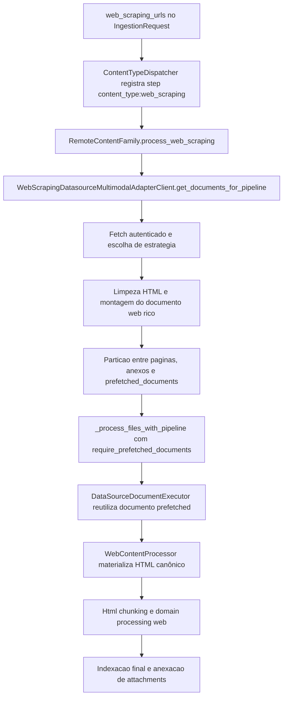
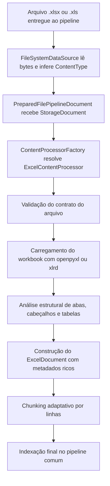
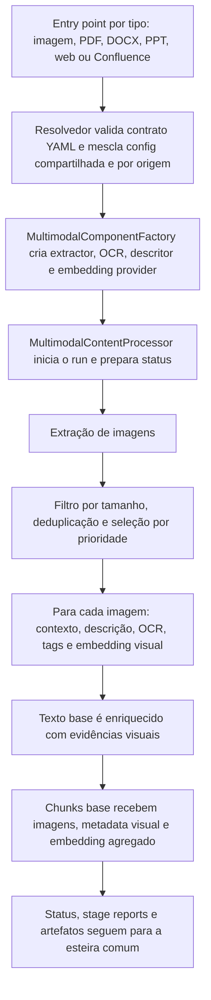
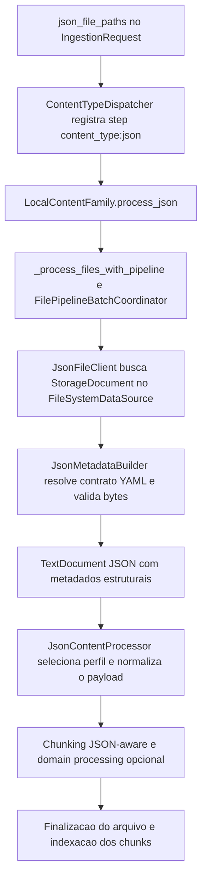
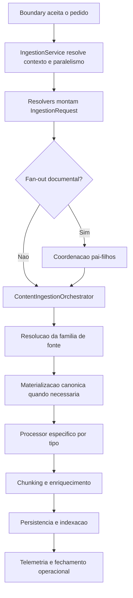
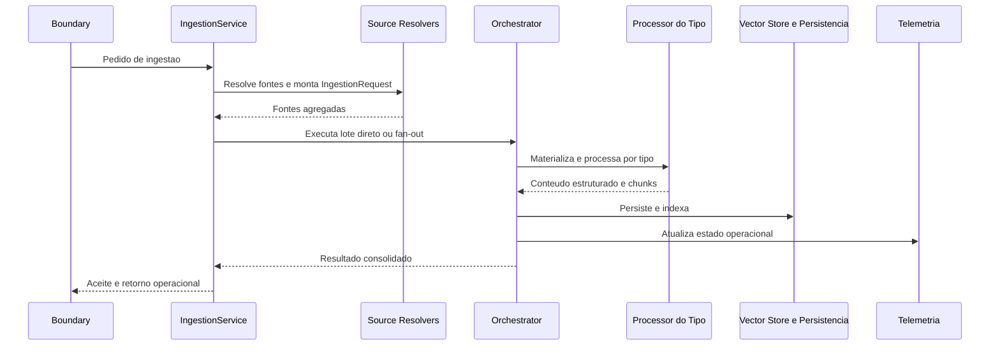

# Manual técnico, executivo, comercial e estratégico: Pipeline de Ingestão

## 1. O que é esta feature

O pipeline de ingestão é a esteira que transforma material bruto em acervo utilizável pelo restante da plataforma. Ele não existe só para mover arquivos para um banco vetorial. Ele existe para receber fontes heterogêneas, decidir como cada fonte deve ser tratada, extrair conteúdo de forma especializada, preservar metadados relevantes, persistir o resultado e manter uma leitura operacional confiável do run.

No código real, ingestão é uma capacidade sistêmica. Ela combina uma fachada de aplicação, resolução de fontes, orquestração modular, processamento por tipo, persistência, fan-out documental e telemetria. Isso significa que o sistema não pensa em “arquivo” apenas como um blob. Ele pensa em lote, origem, tipo de conteúdo, política de execução, rastreabilidade e qualidade do dado produzido.

## 2. Que problema ela resolve

O problema real da ingestão não é “importar documentos”. O problema é tornar previsível o processamento de conteúdos muito diferentes sem destruir latência, clareza operacional ou qualidade do acervo.

Sem esse pipeline, a plataforma enfrentaria pelo menos seis problemas.

- A API teria de carregar trabalho pesado demais, como parsing, OCR, scraping e indexação.
- Cada tipo de conteúdo criaria um fluxo improvisado próprio, com comportamento diferente e difícil de manter.
- Fontes remotas e arquivos locais se misturariam sem fronteira clara entre aquisição e processamento.
- O operador perderia a capacidade de entender em que etapa um lote falhou.
- O produto não conseguiria sustentar casos corporativos com PDF complexo, planilha, JSON estruturado e páginas web no mesmo padrão de governança.
- O acervo final ficaria inconsistente porque tipos distintos exigem técnicas de extração e chunking diferentes.

## 3. Visão executiva

Para liderança, o pipeline de ingestão importa porque ele é a base de confiança do produto. Sem ingestão boa, não existe RAG confiável, auditoria confiável nem operação previsível. Em termos práticos, ele reduz risco de dados incompletos, respostas ruins por acervo mal preparado e suporte caro por falta de rastreabilidade.

Ele também cria capacidade de escala. A plataforma deixa de depender de um fluxo manual por tipo de documento e passa a trabalhar com uma esteira comum, onde novos tipos ou novas fontes podem entrar sem reescrever toda a superfície operacional.

## 4. Visão comercial

Comercialmente, a ingestão é o argumento que sustenta a promessa de “trazer o conteúdo do cliente para dentro da plataforma com governança”. Isso vale para contratos em PDF, páginas web, documentos Word, planilhas, exportações JSON e sites que precisam de captura autenticada ou resiliente.

O valor comercial suportado pelo código é este: a plataforma não trata todos os documentos da mesma forma. Ela usa técnicas específicas para cada família de conteúdo, preserva metadados úteis para busca e auditoria e mantém uma leitura operacional do lote. O que não deve ser prometido é ingestão perfeita para qualquer origem sem configuração. O pipeline melhora robustez e cobertura, mas continua dependente de fonte acessível, configuração coerente e conteúdo legível.

## 5. Visão estratégica

Estrategicamente, a ingestão fortalece a plataforma porque organiza o dado na entrada, que é o ponto onde a dívida técnica mais rapidamente contamina o restante do produto. O desenho atual reforça cinco objetivos estratégicos.

- Separar aquisição da fonte de processamento do conteúdo.
- Centralizar o comportamento da ingestão em uma fachada e um orquestrador, não em endpoints dispersos.
- Permitir paralelismo e fan-out sem perder o run lógico.
- Sustentar múltiplos tipos de conteúdo sem espalhar lógica condicional por todo o sistema.
- Entregar acervo com metadados ricos o suficiente para RAG, filtros, auditoria e diagnóstico posterior.

## 6. Conceitos necessários para entender

### Aceitação assíncrona

Aceitação assíncrona significa que o boundary registra o pedido e devolve um contrato de acompanhamento antes do processamento pesado terminar. Isso protege a latência da API contra OCR, scraping, parsing e indexação.

### IngestionRequest

`IngestionRequest` é o comando estruturado que concentra as fontes resolvidas do YAML, o contexto do tenant, o vetor de execução e dados operacionais do lote. Ele existe para impedir que o orquestrador receba configuração bruta demais.

### Data source

Data source é a abstração que resolve a origem do conteúdo. O papel dela é descobrir e materializar o insumo inicial. Isso é diferente do papel do processor, que interpreta o conteúdo.

### Processor

Processor é a peça especialista em transformar um tipo de conteúdo em texto, estrutura e chunks. PDF, HTML, Excel, DOCX e JSON não passam pela mesma técnica, porque o problema de extrair valor de cada um deles é diferente.

### Materialização canônica

Materialização canônica é o momento em que um documento bruto vindo de storage ou fonte remota é convertido para a representação esperada pelo processor. No caso de HTML remoto, por exemplo, isso garante texto limpo e `pages_info` coerente antes do chunking.

### Fan-out documental

Fan-out é a decisão de dividir o lote em execuções menores. Ele existe para throughput e isolamento operacional, mas sem perder a ideia de um run pai agregado.

### Telemetria operacional

Telemetria operacional é o conjunto de estados, métricas e snapshots que permite entender o lote para além de um simples status de task. É ela que sustenta leitura de progresso, quantidade de documentos, filhos, persistência e fechamento do run.

## 7. Como a feature funciona por dentro

A ingestão começa na fachada de aplicação. `IngestionService` recebe a configuração, resolve paralelismo solicitado, verifica se fan-out documental está habilitado e registra o início da execução. Essa camada não processa documento; ela prepara a execução.

Em seguida, o serviço monta o `IngestionRequest`, que concentra arquivos locais, URLs de scraping, fontes cloud, fontes dinâmicas e demais entradas resolvidas pelos source resolvers. Essa etapa é importante porque o YAML ainda não é o contrato ideal de execução.

Com o request pronto, a fachada decide se o lote segue pelo caminho direto ou pelo caminho de fan-out. Se o lote for quebrado, o pai continua sendo a unidade lógica de observabilidade. Se o lote seguir inteiro, `ContentIngestionOrchestrator` assume a coordenação.

O orquestrador é modular. O código lido mostra mixins, bundle de factories, componentes de runtime, executor de pipeline, coordenador e finalizador de resultado. Isso significa que ele age como maestro do fluxo, não como uma god class que tenta fazer tudo sozinha.

Depois da resolução de origem, cada item vai para a família de conteúdo correta. Quando necessário, o documento é materializado para a forma canônica antes do processor. Só então entram extração, limpeza, estruturação, chunking, persistência e indexação.

## 8. Divisão em etapas ou submódulos

### 8.1. Preparação do pedido e política de execução

Esta etapa existe para transformar a intenção do YAML em um pedido executável. O serviço registra início, resolve paralelismo solicitado, verifica a política de fan-out e monta o `IngestionRequest`.

O que recebe: YAML, contexto do tenant, contexto de execução e callback de progresso.

O que faz: converte configuração em um contrato interno previsível.

O que entrega: request pronto para fan-out ou orquestração direta.

O que pode dar errado: fonte mal declarada, request vazio ou execução inconsistente com modo de documento único.

Como diagnosticar: verificar logs da `IngestionService`, especialmente os campos de `requested_document_parallelism`, `execution_mode` e resumo das fontes resolvidas.

### 8.2. Resolução das fontes

Esta etapa existe para separar aquisição da origem de interpretação do conteúdo. Os resolvers leem blocos do YAML e devolvem famílias de fonte como arquivos locais, Confluence, URLs de web scraping, YouTube, Google Drive, Azure Blob, S3 e dados dinâmicos.

O que recebe: bloco `ingestion` do YAML.

O que faz: descobre o que realmente precisa entrar no lote.

O que entrega: bundle de fontes resolvidas para construção do request.

O que pode dar errado: fonte desabilitada, URL ausente, padrão local sem arquivo correspondente ou configuração remota incompleta.

Como diagnosticar: revisar os resolvers de fonte e o resumo operacional do request.

### 8.3. Orquestração, coordenação e fan-out

Esta etapa existe para decidir se o lote será processado inteiro ou particionado. Ela também garante que progresso, cancelamento cooperativo, checkpoints, persistência e finalização não fiquem espalhados em cada processor.

O que recebe: `IngestionRequest`, vector store, callback de progresso e contexto do run.

O que faz: coordena o fluxo e delega as tarefas técnicas às peças corretas.

O que entrega: resultado consolidado do lote ou do run pai.

O que pode dar errado: quebra no fan-out, run pai inconsistente, falha de telemetria ou persistência parcial.

Como diagnosticar: cruzar logs do serviço, do orquestrador e o snapshot operacional do run pai.

### 8.4. Processamento específico por tipo de ingestão

Esta etapa é o centro técnico da ingestão. É aqui que cada família de conteúdo aplica tática e técnica próprias.

#### 8.4.1. PDF

Conceito: PDF é o tipo mais sensível da ingestão porque mistura texto, layout, páginas, imagens, tabelas, anexos e, em alguns casos, necessidade de OCR.

Tática: o pipeline de PDF foi quebrado em etapas explícitas para evitar improviso. Primeiro valida bytes e assinatura `%PDF`. Depois pode aplicar pré-processamento document-level para OCR. Em seguida executa uma engine de parsing, consolida o resultado, enriquece metadados e finalmente aplica chunking por estratégia.

Técnica: o código confirma um `PdfExtractionApplicationService` e um pipeline de extração com estágios formais como validação de bytes, aplicação de OCR document-level, parsing via engine e preparação do payload final. Depois disso, o `PdfChunkingService` executa chunking com Strategy Pattern, analisando tipo de conteúdo, páginas detectadas e estratégia disponível. O `PDFContentProcessor` ainda coordena runtime, metadados, processamento rico e multimodalidade.

Fluxo prático: PDF bruto entra como `StorageDocument`, é convertido em `PDFDocument`, recebe metadados normalizados e pode ganhar resumo de domínio antes de ser chunkado.

O que pode dar errado: arquivo sem bytes, assinatura inválida, engine de parsing falhando, texto vazio pós-processamento, chunking sem estratégia útil ou artefato ausente em retomada.

Como diagnosticar: seguir os eventos de extração e chunking de PDF, observando `stages_executed`, engine usada, quantidade de caracteres extraídos, páginas detectadas e estratégia de chunking aplicada.

Visão técnica: PDF é o tipo onde o pipeline mais claramente separa parsing, OCR, metadados e chunking, justamente porque esse conteúdo é o mais propenso a ambiguidades e perda de informação.

Visão executiva: PDF reduz risco em contratos, normas, relatórios e documentos regulatórios, onde uma ingestão superficial comprometeria diretamente a confiança no produto.

Visão comercial: esse tipo é essencial para vendas corporativas porque muitos clientes medem maturidade da plataforma pela capacidade de lidar com PDFs escaneados, complexos ou com layout difícil.

#### 8.4.2. HTML

Conceito: HTML é conteúdo textual com ruído estrutural. O desafio não é baixar o arquivo, mas limpar scripts, estilos e markup sem perder o texto útil.

Tática: o sistema trata HTML como tipo de conteúdo e não como sinônimo de scraping. Isso permite reutilizar a mesma lógica base tanto para arquivos HTML puros quanto para páginas web já capturadas e entregues ao pipeline como documentos remotos prontos.

Técnica: `HtmlContentProcessor` remove `script` e `style` com `BeautifulSoup`, extrai texto, normaliza espaços e delega o chunking ao processor base. Quando o HTML vem da web, `WebContentProcessor` especializa essa base: preserva URL, status HTTP e `pages_info`, atualiza o texto limpo antes do chunking e ainda pode aplicar processamento por domínio depois que os chunks já existem.

Fluxo prático: HTML bruto entra em `StorageDocument`, é limpo para texto útil, recebe telemetria de chunking e segue para a mesma esteira padrão de persistência usada pelos demais tipos.

O que pode dar errado: HTML vazio, erro de parse, página com markup pouco semântico ou dependência forte de renderização dinâmica que não foi resolvida na etapa anterior de aquisição.

Como diagnosticar: primeiro confirmar se a aquisição entregou HTML suficiente; depois verificar logs de limpeza HTML, `pages_info`, URL/status da página e tamanho final do texto usado para chunking.

Visão técnica: HTML é a fronteira que transforma marcação em texto indexável. Sem essa camada, o pipeline de web scraping viraria apenas captura de bytes sem valor real de busca.

Visão executiva: ele reduz o risco de páginas entrarem no acervo com ruído demais e contexto de menos, o que degrada qualidade de resposta e aumenta custo de suporte.

Visão comercial: é relevante para clientes que mantêm bases de conhecimento, portais institucionais, FAQs e manuais web em HTML.

#### 8.4.3. Web Scraping

Conceito: web scraping é uma família de fonte remota, não apenas um tipo de arquivo. O problema aqui é adquirir o conteúdo web de forma resiliente, autenticada e diagnosticável, e depois entregá-lo à esteira padrão.

Tática: o pipeline separa aquisição web de interpretação HTML. Primeiro a plataforma tenta capturar a página com a melhor estratégia disponível. Depois ela transforma esse resultado em um documento web rico, separa anexos, indexa páginas por URL normalizada e só então entrega a URL ao pipeline genérico com um documento prefetched obrigatório. Isso evita buscar a mesma página duas vezes e impede que o chunking trabalhe em cima de fetch improvisado.

Técnica: o caminho principal confirmado no código passa por seis blocos especializados. `ContentTypeDispatcher` detecta `web_scraping_urls`; `RemoteContentFamilyService` assume a trilha remota; `WebScrapingDatasourceMultimodalAdapterClient` faz fetch, limpeza, deduplicação e attachments; `ContentTypeDispatcher` particiona páginas e anexos e monta o índice de prefetched documents; `DataSourceDocumentExecutor` reutiliza o documento já capturado em vez de fazer novo fetch; `WebContentProcessor` materializa o HTML remoto e entrega chunks limpos para a esteira comum.

Fluxo prático: URL entra como fonte remota, vira documento web rico e indexado por URL, é reaproveitada pelo pipeline como documento prefetched obrigatório, ganha materialização HTML canônica e então segue para chunking, persistência e indexação.

##### Pipeline detalhado da ingestão HTML Web Scraping

O diagrama mostra a ideia central do desenho: o web scraping prepara o documento antes da esteira genérica de arquivo. O pipeline comum continua cuidando de chunking, persistência e telemetria, mas não reexecuta a captura da página.

##### Etapa 1. Seleção da trilha remota de scraping

O fluxo só nasce quando o request chega com `web_scraping_urls`. `ContentTypeDispatcher` registra o step `content_type:web_scraping` e chama `_process_web_scraping_content`, que delega para `RemoteContentFamilyService.process_web_scraping`.

Essa separação importa porque web scraping não é tratado como “mais um HTML”. A plataforma primeiro assume que o problema é remoto e operacional: autenticação, política anti-bot, anexos, retries e montagem do documento. Só depois disso ela pensa em texto e chunks.

##### Etapa 2. Validação operacional e preparação da família remota

Na família remota, o código valida três condições logo no início: existência de URLs, disponibilidade de vector store e reset do índice interno de anexos web. Depois resolve o contexto de telemetria do run.

Essa etapa é importante porque o scraping não é útil se o resultado não puder seguir para indexação. O código evita continuar com um pipeline parcialmente configurado, o que reduziria observabilidade e deixaria a falha mais cara de diagnosticar.

##### Etapa 3. Aquisição da página e escolha de estratégia

`WebScrapingDatasourceMultimodalAdapterClient` nasce a partir do bloco `remote_sources.web_scraping` e extrai daí as políticas de processamento, anti-bot, rate limiting, proxy rotation, cache, deduplicação, segurança, filtros de qualidade, renderização JavaScript, anexos e multimodalidade.

Para cada URL, `_fetch_document_data` segue um fluxo explícito:

1. obtém sessão autenticada quando necessário;
2. identifica domínio e contexto de autenticação;
3. avalia se a URL exige proxy premium;
4. registra o estado dos proxies disponíveis;
5. pergunta ao `LinkExtractor` se deve usar estratégia avançada;
6. tenta scraping avançado quando a página parece SPA ou dinâmica;
7. em caso de falha, cai para o caminho básico.

O caminho avançado usa `scrape_spa_website` e pode operar com Playwright, screenshots e extração de imagens. O caminho básico usa `_scrape_basic_fallback`. Em ambos, o client limpa o HTML com `HtmlContentParser`, tenta converter o DOM em conteúdo estruturado e escolhe entre esse conteúdo estruturado ou o texto simples como representação preferida do documento.

Essa escolha técnica resolve um problema prático importante: nem toda página precisa de renderização pesada, mas algumas só ficam úteis depois dela. O pipeline tenta a estratégia mais rica quando a heurística indica necessidade, sem obrigar o custo máximo em todas as URLs.

##### Etapa 4. Montagem do documento web rico

Depois do fetch, `_transform_to_document_async` transforma os dados brutos em um documento web canônico. Ele sanitiza a URL para gerar um identificador estável, monta metadata a partir dos dados capturados e cria um `StorageDocument` web com texto, HTML e metadados de origem.

Existe aqui um detalhe arquitetural decisivo: em `get_documents_for_pipeline`, o client pede o bundle com `pipeline_ready=True`. Isso faz o client devolver o documento base já capturado, mas sem reexecutar processamento multimodal nem processamento por domínio dentro dele. Em outras palavras, o client prepara o documento para a esteira padrão, em vez de tentar concluir toda a interpretação sozinho.

Esse comportamento evita duplicação de trabalho e reduz risco de inconsistência entre o caminho do cliente e o caminho oficial de chunking do pipeline.

##### Etapa 5. Separação entre páginas, anexos e índice de prefetch

`RemoteContentFamilyService.process_web_scraping` recebe do client uma lista de documentos e chama `_partition_web_documents_for_pipeline`. Essa função separa:

- páginas principais;
- anexos web identificados por `metadata.source_type == web_attachment`;
- `prefetched_documents`, um mapa de URL normalizada para documento de página.

Na sequência, a família remota coleta o índice de metadados de anexos, constrói `_web_attachment_index`, cria fallback de metadados quando necessário, materializa anexos em `.sandbox/web_attachments` e propaga os caminhos materializados.

Essa etapa tem valor operacional direto. Ela garante que páginas e anexos não sejam confundidos e que a página principal carregue o contexto dos anexos quando o pipeline padrão for indexar os chunks.

##### Etapa 6. Reentrada no pipeline genérico com documento prefetched obrigatório

Depois de preparar os documentos, a família remota chama `_process_files_with_pipeline` usando as próprias URLs como `file_paths`, mas injeta `prefetched_documents` em `data_source_params` e marca `require_prefetched_documents=True`.

Isso significa que a etapa genérica de arquivo não vai tentar buscar a página por conta própria. Ela precisa encontrar um documento já preparado para aquela URL. Se o documento prefetched estiver ausente, o pipeline falha com erro explícito.

Na prática, essa decisão impede divergência entre a aquisição web rica e a etapa de chunking. O conteúdo processado pelo chunker é exatamente o conteúdo que passou pela lógica oficial de scraping, e não uma segunda leitura incidental da URL.

##### Etapa 7. Reuso do prefetch e materialização HTML canônica

Quando `DataSourceDocumentExecutor.prepare` recebe a URL, ele tenta resolver o documento no mapa de prefetched documents. Se encontrar, registra que o prefetch foi reutilizado. Se não encontrar e o prefetch for obrigatório, aborta.

Com o documento em mãos, o pipeline escolhe o processor correto para `ContentType.HTML` e chama `WebContentProcessor.build_from_storage`. Essa materialização faz três coisas importantes:

- extrai o HTML bruto a partir de `raw_bytes` ou do conteúdo do documento;
- converte o HTML em texto limpo com a lógica herdada de `HtmlContentProcessor`;
- constrói `pages_info` com URL, status HTTP, HTML bruto e texto limpo.

Esse é o momento em que a página web deixa de ser apenas “resultado de scraping” e vira entrada canônica para o chunking HTML do sistema.

##### Etapa 8. Chunking, domain processing e anexação de attachments

Na etapa de chunking, `WebContentProcessor` atualiza `pages_info` com o texto limpo definitivo, calcula parâmetros adaptativos e delega o corte do conteúdo ao fluxo herdado de `HtmlContentProcessor` e `BaseContentProcessor`. Depois disso, ele ainda pode aplicar `DomainProcessingResolver` aos chunks web, quando esse processamento estiver habilitado.

No fechamento do arquivo, a esteira genérica verifica chunks vazios, aplica bloqueios de qualidade quando existirem e, no caso de `SourceType.REMOTE_FILE`, anexa aos chunks da página os metadados dos attachments materializados na fase remota. Só então a indexação final é executada.

##### O que acontece em caso de sucesso no Web Scraping

No caminho feliz, cada URL é capturada com a estratégia adequada, convertida em documento web rico, associada aos seus anexos, reaproveitada como prefetch obrigatório, materializada em HTML canônico, chunkada e persistida. O operador consegue confirmar esse sucesso pelos logs de início do step web scraping, pelos logs de estratégia `WEB_STRATEGY`, pela mensagem `Documentos web preparados para pipeline padrao`, pelo reuso do prefetch e pelos logs de chunking web/HTML.

##### O que acontece em caso de erro no Web Scraping

Os principais cenários de erro confirmados no código são estes:

- request sem `web_scraping_urls`;
- vector store ausente para a família remota;
- falha de autenticação, rede, anti-bot, proxy ou captura da página;
- ausência de documento prefetched para alguma URL solicitada;
- falha ao materializar anexos ou ao construir o índice de attachments;
- HTML vazio, parse problemático ou documento sem chunks no fechamento do processor.

Existe também um risco operacional típico desse fluxo: a captura pode até funcionar, mas a página ainda chegar pobre em texto útil se a renderização dinâmica não tiver sido realmente resolvida pela estratégia escolhida.

##### Como diagnosticar problemas reais no Web Scraping

O diagnóstico mais eficiente é seguir a ordem do pipeline.

1. Confirmar que o request chegou com `web_scraping_urls` e que o dispatcher registrou `content_type:web_scraping`.
2. Verificar se a família remota registrou `INICIANDO PROCESSAMENTO WEB SCRAPING`.
3. Procurar os logs `WEB_SCRAPING_FETCH_INICIO`, `WEB_STRATEGY`, `WEB_ADVANCED_OK`, `WEB_BASIC_OK` ou `WEB_FALLBACK` para descobrir como a página foi capturada.
4. Confirmar que o client retornou documentos com `GET_DOCUMENTS_PIPELINE_OK`.
5. Checar a mensagem `Documentos web preparados para pipeline padrao` e os contadores de páginas e anexos.
6. Se houver falha antes do chunking, validar se o mapa de `prefetched_documents` continha todas as URLs e se o executor reutilizou o prefetch.
7. No chunking, revisar logs de `pages_info`, `WEB CHUNKING` e `HTML CHUNKING` para verificar se houve texto limpo suficiente.
8. Se a página foi indexada com pouco valor, comparar a estratégia de captura escolhida com o volume de texto final e os attachments associados.

##### Limites e pegadinhas do pipeline Web Scraping

- Web scraping não é processamento HTML. Captura e interpretação são fases diferentes e com falhas diferentes.
- Página capturada não significa página semanticamente útil. Uma SPA parcialmente renderizada pode gerar pouco texto apesar de a URL ter sido acessada com sucesso.
- Attachment materializado não significa attachment indexado com valor. O anexo ainda depende do processor correspondente na sequência do pipeline.
- O caminho `pipeline_ready=True` evita duplicação de trabalho no client, mas exige que a esteira comum continue sendo a dona do chunking e da indexação.

Visão técnica: esse pipeline existe para impedir que captura web, limpeza HTML, anexos e chunking se misturem num bloco opaco. A separação atual permite saber se um problema veio da rede, da estratégia de scraping, do prefetch, da materialização HTML ou do chunking.

Visão executiva: web scraping amplia a capacidade de captura de conhecimento corporativo sem exigir upload manual, mas faz isso com governança operacional suficiente para rastrear onde uma página falhou.

Visão comercial: é um diferencial forte para clientes que precisam ingerir portais internos, páginas autenticadas, documentações online, manuais web e bases de conhecimento que não nascem como arquivo local.

#### 8.4.4. Excel

Conceito: planilha não é só texto tabular. Ela carrega estrutura de abas, linhas, colunas, tipos numéricos, datas e, em certos casos, tabelas lógicas relevantes para consulta.

Tática: o pipeline preserva informação estruturada e ao mesmo tempo gera uma forma textual pesquisável. A ingestão evita tratar a planilha como simples CSV achatado e tenta manter suficiente contexto de abas, colunas, tipos, tabelas e limites de contrato para que a consulta posterior não trabalhe às cegas.

Técnica: o pipeline Excel confirmado no código gira em torno de `StorageDocument` + `ExcelContentProcessor`. O `FileSystemDataSource` identifica `.xlsx` e `.xls`, entrega bytes e metadata básicos; `ContentProcessorFactory` registra `ExcelContentProcessor` para `ContentType.EXCEL_XLSX` e `ContentType.EXCEL_XLS`; o processor valida o arquivo, escolhe `openpyxl` ou caminho legado `xlrd`, extrai texto e metadados estruturais com `ExcelSheetAnalyzer` e só então cria chunks textuais com limites adaptativos. Um ponto importante: o contrato principal `IngestionRequest` lido no código não expõe `excel_file_paths`, então o caminho acionável confirmado dentro da esteira compartilhada hoje é o de arquivos dinâmicos e de qualquer fluxo que já entregue `StorageDocument` Excel ao pipeline.

Fluxo prático: um arquivo `.xlsx` ou `.xls` entra no pipeline como `StorageDocument`, é validado, vira `ExcelDocument` com schema, estatísticas e dados estruturados e depois é chunkado linha a linha para indexação.

##### Pipeline detalhado da ingestão Excel

O diagrama mostra o ponto central do desenho atual: o pipeline Excel está pronto da etapa de `StorageDocument` em diante, mas o contrato principal do request ainda não oferece um campo top-level dedicado para planilhas locais. Por isso a documentação precisa separar claramente “processor Excel pronto” de “entrada principal já exposta no contrato”.

##### Etapa 1. Entrada real do arquivo na esteira

No código lido, o caminho confirmado para o Excel dentro da esteira compartilhada passa por `_load_dynamic_file_document` em `ContentTypeDispatcher`, chamado pela família `dynamic_data`. Nesse método, arquivos `.xlsx` e `.xls` são tratados fora do caminho de clients tradicionais: o dispatcher pede um `StorageDocument` cru ao `FileSystemDataSource` e deixa o parsing para a camada de processor.

Além disso, qualquer outro fluxo que entregue um `StorageDocument` com `ContentType.EXCEL_XLSX` ou `ContentType.EXCEL_XLS` ao executor comum também cai na mesma esteira. O que não foi confirmado no código lido é um campo dedicado como `excel_file_paths` no `IngestionRequest` principal. Esse é um detalhe crucial, porque ele limita o que pode ser prometido como entrada top-level do pipeline Excel hoje.

##### Etapa 2. Leitura de bytes e inferência do tipo

`FileSystemDataSource` é responsável apenas por leitura do arquivo, não por parsing da planilha. Ele verifica a extensão suportada, lê o arquivo em binário, coleta tamanho e timestamps e devolve um `StorageDocument` com `raw_bytes` obrigatórios. A inferência de tipo distingue `.xlsx` como `ContentType.EXCEL_XLSX` e `.xls` como `ContentType.EXCEL_XLS`.

Essa separação existe para manter o filesystem como boundary simples. O DataSource descobre e materializa o arquivo; o processor decide como entender a planilha.

##### Etapa 3. Seleção do processor Excel

Quando o documento entra no executor comum, `ContentProcessorFactory` resolve `ExcelContentProcessor` para os dois content types de Excel. Isso padroniza o comportamento: `.xlsx` e `.xls` podem ter engines de abertura diferentes, mas o contrato de processamento continua concentrado em um único processor.

Na prática, isso reduz drift entre formatos. Em vez de criar fluxos arbitrários por extensão, o desenho mantém um mesmo dono para validação, análise estrutural, enriquecimento e chunking.

##### Etapa 4. Validação do contrato do arquivo

Antes de abrir o workbook, `ExcelContentProcessor.validate_storage_document` aplica uma série de guardrails:

- exige `file_path`;
- rejeita formatos explicitamente fora do contrato atual, como `.xlsm` e `.xlsb`;
- valida a extensão contra `excel.file_handling.supported_extensions` quando essa lista estiver configurada;
- confirma existência física do arquivo em fontes locais;
- impõe `max_file_size_mb` quando configurado;
- falha fechado se `raw_bytes` estiver ausente.

Essa etapa é importante porque muitas falhas de Excel não são “erro de parser”; são violação de contrato de arquivo. O processor tenta separar essas causas cedo, com erro explícito e rastreável.

##### Etapa 5. Carregamento do workbook

Depois da validação, `_load_workbook` tenta abrir o arquivo com `openpyxl`. Esse é o caminho padrão para `.xlsx`. Se a abertura falhar e o documento for `.xls`, o processor registra a troca de estratégia e tenta `_load_xls_workbook` com `xlrd` em modo best-effort.

O caminho `.xls` carrega limitações confirmadas no código:

- leitura legada best-effort;
- ausência de tabelas nativas estruturadas;
- fórmulas não interpretadas, apenas resultados já salvos;
- macros, comentários, hyperlinks, filtros, validações, objetos embarcados e pivot tables ignorados;
- arquivos protegidos por senha rejeitados.

Isso precisa estar explícito porque `.xls` e `.xlsx` não têm o mesmo nível de fidelidade no pipeline atual. O suporte existe para os dois, mas o contrato não promete a mesma riqueza estrutural para o formato legado.

##### Etapa 6. Análise estrutural de abas e tabelas

Com o workbook aberto, `_extract_text_and_metadata` ou `_extract_xls_text_and_metadata` percorrem as abas válidas. O processor pode limitar quantas planilhas serão processadas, ignorar nomes de abas configurados, cortar o número máximo de linhas por aba e pular planilhas com densidade de dado abaixo do mínimo configurado.

Durante esse passo, o pipeline:

- detecta ou resolve cabeçalhos;
- processa linhas em payload estruturado e linha formatada de texto;
- acumula estatísticas por coluna;
- usa `ExcelSheetAnalyzer` para classificar a estrutura da aba;
- extrai tabelas nativas em `.xlsx` quando disponíveis;
- gera `excel_schema_summary` e `excel_numeric_stats` quando habilitados.

Na prática, esta é a etapa que transforma “arquivo de planilha” em “documento consultável com semântica estrutural”. É aqui que o pipeline decide se uma aba tem densidade suficiente, se uma linha parece cabeçalho e quais colunas parecem numéricas, textuais ou de data.

##### Etapa 7. Construção do ExcelDocument

Depois da análise, `build_from_storage` monta um `ExcelDocument`. Esse documento não carrega apenas o texto das planilhas. Ele também leva um conjunto rico de metadados contratuais e operacionais, incluindo:

- `sheet_names`, `total_sheets`, `total_rows`, `total_columns`;
- metadata por aba com densidade, tipo estrutural, cabeçalhos e tabelas detectadas;
- `excel_schema_summary` e `excel_numeric_stats` quando habilitados;
- `tables_data` e `raw_data` quando configurados;
- `excel_extension`, `excel_engine`, `excel_processing_mode`, `excel_contract_profile` e `excel_processing_limitations`.

Esse enriquecimento é o que impede a planilha de virar apenas texto achatado. O conteúdo textual existe para busca e chunking, mas a metadata é o que preserva governança e capacidade de diagnóstico.

##### Etapa 8. Chunking adaptativo por linhas

Quando o documento já está materializado, `create_chunks` divide o conteúdo em blocos textuais respeitando parâmetros adaptativos do `BaseContentProcessor`. O chunking é guiado por linhas e pelo limite configurado, com possibilidade de sobreposição textual e com `row_chunk_size` registrado em log.

Cada chunk recebe metadata canônica com índice, quantidade de linhas, tamanho do bloco e processor responsável. Se o documento não gerar conteúdo útil, o processor devolve zero chunks. Se o limite máximo de chunks for atingido, o fluxo registra warning e interrompe a geração adicional.

Essa estratégia é adequada para planilhas porque preserva a granularidade de linha, que costuma ser a unidade mais útil para leitura sem destruir a estrutura inteira da aba em um único bloco gigante.

##### Etapa 9. Fechamento na esteira comum

Depois do chunking, o arquivo volta para o executor comum da ingestão. `DocumentProcessorExecutor` registra sucesso, ausência de chunks ou erro. Se houver chunks, o pipeline segue para persistência e indexação como qualquer outro tipo suportado.

Isso significa que o Excel não possui um fechamento paralelo próprio. O parsing e o enriquecimento são especializados, mas o encerramento operacional permanece centralizado na esteira comum.

##### O que acontece em caso de sucesso no Excel

No caminho feliz, o arquivo chega com bytes válidos, é aberto pela engine correta, tem abas e colunas analisadas, vira `ExcelDocument` com metadados estruturais e sai em chunks textuais indexáveis. O operador consegue confirmar isso pelos logs de carregamento do workbook, pelos contadores de abas processadas, pelos metadados `excel_engine` e `excel_processing_mode` e pelo fechamento do processor com quantidade de chunks criada.

##### O que acontece em caso de erro no Excel

Os principais erros confirmados no código são estes:

- ausência de `file_path` ou de `raw_bytes`;
- extensão fora do contrato ou formato explicitamente não suportado, como `.xlsm` e `.xlsb`;
- arquivo local inexistente;
- tamanho acima do limite configurado;
- falha ao abrir workbook com `openpyxl`;
- falha do fallback `.xls` por ausência de `xlrd`, proteção por senha ou erro de carga do workbook;
- baixa densidade de uma aba, fazendo com que ela seja ignorada;
- documento final sem conteúdo útil para chunking.

Há ainda uma falha arquitetural importante que não é do parser, e sim do contrato de entrada: o request principal da ingestão não expõe `excel_file_paths`. Isso limita o acionamento top-level do pipeline Excel compartilhado no estado atual do código lido.

##### Como diagnosticar problemas reais no Excel

O diagnóstico mais eficiente é seguir a ordem do pipeline.

1. Confirmar por qual caminho o arquivo Excel entrou na esteira, porque o contrato principal não expõe `excel_file_paths`.
2. Verificar se o `FileSystemDataSource` devolveu `StorageDocument` com `raw_bytes` e content type de Excel.
3. Conferir se `ExcelContentProcessor` foi realmente selecionado pela factory.
4. Procurar logs de validação do workbook e do engine usado (`openpyxl` ou `xlrd`).
5. Se for `.xls`, verificar `excel_processing_mode` e `excel_processing_limitations`.
6. Inspecionar `sheet_names`, `total_sheets`, `excel_schema_summary`, `excel_numeric_stats` e `tables_data` para saber se a análise estrutural funcionou.
7. Se o resultado estiver pobre, revisar densidade mínima, abas excluídas, máximo de linhas e detecção de cabeçalho.
8. Se não houver indexação, confirmar se o problema foi zero chunks, falha de abertura do workbook ou limitação do caminho de entrada atual.

##### Limites e pegadinhas do pipeline Excel

- O pipeline Excel existe, mas o contrato principal de request ainda não expõe entrada top-level dedicada para planilhas.
- `.xls` é suportado em modo best-effort, não no mesmo nível estrutural de `.xlsx`.
- A presença do arquivo não garante ingestão útil: planilhas muito esparsas podem ser ignoradas por densidade.
- `tables_data` e `raw_data` dependem de configuração; sem eles, parte da riqueza estrutural pode não ser persistida em metadata.
- Chunking por linhas melhora granularidade, mas pode separar contexto demais quando a planilha depende fortemente da relação entre blocos distantes da mesma aba.

Visão técnica: Excel é a esteira mais explicitamente orientada a estrutura tabular no pipeline. O valor dela está em preservar schema, colunas, tipos e tabelas, e não apenas extrair texto.

Visão executiva: esse pipeline reduz o risco de relatórios, catálogos, inventários e controles operacionais entrarem no acervo como texto empobrecido e sem contexto numérico.

Visão comercial: é especialmente relevante para clientes cuja operação gira em torno de planilhas exportadas, relatórios consolidados e bases tabulares compartilhadas entre áreas. O diferencial suportado pelo código é a leitura estruturada do workbook, não apenas a ingestão do arquivo como blob.

#### 8.4.5. Multimodal

Conceito: ingestão multimodal é a capacidade de tratar imagem como evidência de conteúdo, e não como ruído visual descartável. Na prática, isso significa extrair imagens, decidir quais realmente importam, ler texto presente nelas via OCR quando fizer sentido, gerar descrição visual quando houver ganho semântico, opcionalmente produzir embedding visual e devolver chunks que preservem a ligação entre texto e imagem.

Tática: o desenho real evita criar um pipeline paralelo por tipo de arquivo. Em vez disso, o projeto mantém um runtime multimodal compartilhado e o injeta onde ele faz sentido: imagem isolada, PDF visual, DOCX, PPT, web e Confluence. Cada um desses entrypoints continua com seu processor especialista no conteúdo textual, mas delega a leitura visual para o mesmo `MultimodalContentProcessor`.

Técnica: o contrato canônico do multimodal nasce em `resolve_multimodal_config_from_yaml`. Esse resolvedor valida caminhos proibidos e legados, mescla `ingestion.multimodal_ai` com overrides por origem e depois normaliza blocos como `image_extraction`, `ocr`, `image_description`, `vision_embedding` e políticas de persistência de imagem. O runtime então cria um extrator apropriado ao tipo (`pdf`, `docx`, `ppt`, `image`, `web`, `confluence`), acopla OCR, descritor de imagem e provider de embedding visual e executa um pipeline padronizado de extração, filtragem, deduplicação, seleção, enriquecimento textual e montagem de chunks multimodais.

Fluxo prático: o multimodal não começa sempre no mesmo ponto. Para imagem isolada, o `ImageContentProcessor` chama `process_single_image`; para PDF, `PdfMultimodalApplicationService` decide se o runtime deve rodar; para DOCX/PPT/Web/Confluence, wrappers finos preservam a extração textual existente e chamam `processor.process_document(...)` só depois de limpar o conteúdo base. Em todos os casos, a saída útil é a mesma família de artefatos: texto enriquecido, lista de imagens processadas, status por etapa e chunks com metadata visual.

##### Contrato canônico de configuração multimodal

O código lido confirma uma regra arquitetural importante: multimodal não aceita configuração espalhada de forma arbitrária. Os caminhos canônicos são estes:

- `ingestion.multimodal_ai` como base compartilhada para OCR, descrição visual e embedding visual fora do caso PDF;
- `ingestion.content_profiles.type_specific.pdf.multimodal` para PDF;
- `ingestion.content_profiles.type_specific.docx.multimodal` para DOCX;
- `ingestion.content_profiles.type_specific.ppt.multimodal` para PPT;
- `ingestion.web.multimodal` para web;
- `ingestion.confluence.multimodal` para Confluence;
- `ingestion.images` como complemento do caso imagem isolada.

O resolvedor rejeita contratos antigos ou proibidos, como:

- bloco `multimodal` na raiz do YAML;
- `ingestion.content_processing.multimodal`;
- `ingestion.content_profiles.type_specific.<tipo>.multimodal_config`;
- `ingestion.remote_sources.web_scraping.multimodal`;
- `web.multimodal`, `confluence.multimodal` e equivalentes fora do escopo `ingestion`.

Isso é decisivo porque evita que diferentes consumidores configurem multimodal por caminhos divergentes e acabem descrevendo o mesmo comportamento com contratos incompatíveis.

##### Onde o pipeline multimodal entra na ingestão

O multimodal aparece em quatro padrões de entrada confirmados no código.

1. Imagem isolada: `ImageContentProcessor` cria um processador multimodal com `content_type="image"` e chama `process_single_image`.
2. PDF: `PDFContentProcessor` mantém a esteira rica de PDF e usa `PdfMultimodalApplicationService` para decidir se o runtime visual deve ser executado.
3. DOCX e PPT: wrappers multimodais preservam a extração textual padrão e depois chamam o runtime compartilhado com o caminho do arquivo.
4. Web e Confluence: wrappers multimodais preservam a materialização HTML e passam `html_content`, `clean_content` e `base_url` para o runtime, além de anexar metadata multimodal extra ao documento.

Além disso, `ContentClientFactory` registra clients adaptadores multimodais para PDF, DOCX, PPT e HTML. Esses adaptadores não implementam pipelines paralelos locais; eles usam `FileSystemDataSource` e `ContentProcessorFactory` para cair no processor padrão já registrado.

##### Pipeline detalhado da ingestão multimodal

Esse diagrama resume o que o código confirma: o multimodal não substitui o processor principal do tipo. Ele entra depois da materialização textual mínima e antes da criação final dos chunks enriquecidos.

##### Etapa 1. Resolução e validação do contrato YAML

O primeiro passo real do multimodal é resolver a configuração correta para o tipo de conteúdo. `resolve_multimodal_config_from_yaml` executa três papéis ao mesmo tempo:

- valida caminhos proibidos e aliases legados;
- mescla a base compartilhada com overrides específicos da origem;
- injeta política de persistência de imagens e limites de tamanho quando essa política vier de `ingestion.images.persistence` ou `ingestion.telemetry.persistence`.

No caso web, `normalize_multimodal_config` ainda transforma certas opções de `attachments` em parâmetros de `image_extraction`, como formatos permitidos, timeout de download, concorrência e tamanho máximo. Isso evita dois contratos paralelos para download de imagem e processamento visual.

##### Etapa 2. Construção do runtime multimodal

Com o YAML resolvido, `create_multimodal_processor_from_yaml` delega à `MultimodalComponentFactory`. Essa factory escolhe o extrator certo para o `content_type` e instancia os três componentes principais do runtime:

- `ImageExtractor` para descobrir imagens úteis;
- `OCRProcessor` para ler texto embutido na imagem;
- `ImageDescriptor` para descrição visual e classificação.

Se `vision_embedding` estiver habilitado, o provider de embedding visual é preparado sob demanda dentro do próprio `MultimodalContentProcessor`. O runtime também aplica flags importantes já no construtor, como `strict_mode`, `summary_on_empty`, `preserve_image_refs`, `store_images`, `max_image_size_mb`, deduplicação de imagens e `max_images_per_document`.

##### Etapa 3. Gate local por tipo de conteúdo

O multimodal não roda cegamente para qualquer documento. Cada entrypoint faz seu próprio gate:

- imagem isolada depende de bytes reais e de um runtime multimodal inicializado;
- PDF depende de `_enable_multimodal`, de o documento ser considerado visual e de existir uma fonte visual resolvível;
- DOCX, PPT, web e Confluence dependem do flag `enabled` vindo do resolvedor multimodal daquele tipo.

Essa separação é importante porque evita custo multimodal em documentos onde a camada textual já resolveu o problema ou onde a origem não oferece evidência visual útil.

##### Etapa 4. Extração de imagens

O processamento de documento em `MultimodalContentProcessor.process_document` começa com a extração de imagens. O runtime resolve o input do extrator, respeita `base_url` quando a origem é web e pede ao extrator especializado a lista de `ImageData`.

Se não houver imagens, o pipeline não falha. Ele registra `multimodal_status=ignored`, define a razão `no_images_detected`, emite stage reports coerentes e devolve o texto base sem enriquecimento visual.

Esse comportamento é importante porque “documento sem imagem” não é erro operacional. É apenas um caso em que o multimodal não agrega valor.

##### Etapa 5. Filtro, deduplicação e seleção de prioridade

Quando imagens existem, o runtime não processa tudo cegamente. Ele aplica uma sequência de filtros:

- corte por tamanho máximo configurado;
- deduplicação segundo `ImageDeduplicator` e `ImageDeduplicationConfig`;
- seleção de prioridade com possível truncamento por orçamento de imagens no documento.

O resultado dessa etapa é persistido como artefato de seleção de imagens, acessível por `get_last_image_selection_artifact`. Isso é especialmente importante para PDF, onde a escolha de quais imagens entram no processamento pode alterar custo e qualidade do run.

##### Etapa 6. Preparação de embeddings de segmento para PDF

No caso PDF, antes de entrar no loop por imagem, o runtime pode preparar embeddings por segmentos determinísticos de página. O código confirma um mapa `PdfSegmentEmbeddingAssignment` por faixa de páginas, usado depois ao gerar embedding visual por imagem.

Na prática, isso significa que o multimodal do PDF não é apenas “imagem por imagem”. Existe uma etapa de preparação voltada para alinhar visual e estrutura paginada do documento.

##### Etapa 7. Processamento completo de cada imagem

O coração do runtime está em `_process_single_image`. Para cada `ImageData`, o código executa esta ordem lógica:

1. resolve contexto textual da imagem via extractor ou `context_override`;
2. tenta gerar descrição visual se `image_description` estiver habilitado;
3. classifica a imagem em tags;
4. mede se a descrição agregou valor ou se foi só ruído institucional;
5. decide se OCR ainda vale a pena depois da análise visual;
6. se fizer sentido e houver potencial textual, extrai OCR;
7. recalcula a descrição filtrando respostas de baixo valor;
8. calcula score de confiança;
9. gera embedding visual quando habilitado;
10. persiste o ativo de imagem quando a política permitir.

Esse detalhe é importante: o código não trata OCR como etapa obrigatória. A descrição visual pode levar o runtime a concluir que a imagem é só logo, marca institucional ou elemento com baixo ganho semântico, e nesse caso o OCR pode ser evitado.

##### Etapa 8. Filtragem de descrição de baixo valor

Uma decisão técnica sofisticada confirmada no código é a filtragem de descrições visuais pouco úteis. O runtime mede sinais como:

- novidade lexical em relação ao contexto e ao OCR;
- diversidade de tokens;
- presença de sinal técnico ou numérico;
- ruído institucional como logo, marca e cabeçalho;
- complexidade visual.

Se a descrição for genérica, redundante ou essencialmente institucional, ela é descartada. Isso reduz poluição semântica no acervo e evita indexar frases como “a imagem mostra um logotipo” como se fossem conhecimento relevante para RAG.

##### Etapa 9. Enriquecimento do texto base

Depois que as imagens são processadas, `_enrich_text_with_images` injeta no texto base referências como:

- descrição da imagem;
- texto OCR;
- referências contextuais da imagem.

Quando houver marcador de página, o runtime tenta inserir a evidência próximo da página correspondente. Caso contrário, acrescenta no final. Esse comportamento é controlado por `preserve_image_refs`. Se essa flag estiver desligada, o texto base fica inalterado e a ligação entre chunk e imagem acontece apenas via metadata.

##### Etapa 10. Montagem dos chunks multimodais

`create_multimodal_chunks` pega os chunks textuais base do processor especialista e associa a eles as imagens relacionadas. Quando há apenas um chunk textual, o runtime pode anexar todas as imagens processadas a esse único chunk.

Cada `MultimodalChunk` preserva:

- conteúdo textual base;
- lista de imagens anexadas;
- flag `has_visual_content`;
- `visual_complexity`;
- embedding visual agregado quando houver;
- `image_uris`;
- metadata consolidada das imagens, incluindo OCR, descrição, engines usadas e dimensões.

Para web e Confluence, os wrappers ainda anexam `image_metadata`, `image_urls` e `image_chunks_payload` no próprio metadata do documento, além de propagar estado multimodal para os chunks.

##### Etapa 11. Status, stage reports e fallback

O runtime multimodal mantém três saídas operacionais explícitas:

- `get_last_multimodal_status`, com status agregado do run;
- `get_last_stage_reports`, com snapshot por etapa;
- `get_last_image_selection_artifact`, com a decisão de seleção de imagens.

O status carrega campos como quantidade de imagens encontradas, processadas, descartadas e falhadas, além de `fallback_to_text` e razão operacional. Os stage reports seguem a ordem `image_extraction -> multimodal_ocr -> image_description -> vision_embedding`.

No caso PDF, `PdfMultimodalApplicationService` traduz esse estado em metadata persistível do documento, registra checkpoints, grava stage reports no manifesto de execução e mantém fallback explícito para texto quando o processamento visual não rodar ou não produzir valor.

##### O que acontece em caso de sucesso no multimodal

No caminho feliz, o documento já tem um texto base mínimo, o runtime encontra imagens úteis, processa pelo menos parte delas, devolve texto enriquecido e monta chunks multimodais com evidência visual anexada. O operador consegue confirmar isso pelos logs de resumo multimodal, pela contagem de imagens filtradas e processadas, pelos campos `multimodal_status_details`, pelos stage reports e pelos metadados de engine usados em OCR, descrição visual e embedding.

##### O que acontece em caso de erro no multimodal

Os erros confirmados no código variam por etapa:

- contrato YAML inválido por caminho legado ou proibido;
- extrator de imagem desconhecido ou mal configurado;
- ausência de bytes para imagem isolada;
- falha ao extrair imagens do documento;
- falha do OCR;
- falha do descritor de imagem;
- falha do provider de embedding visual;
- erro ao persistir ativo de imagem;
- interrupção cooperativa por cancelamento.

O comportamento diante do erro depende de `strict_mode`. Fora do modo estrito, falhas por imagem podem ser absorvidas e o documento segue com fallback textual. Em `strict_mode=true`, o runtime pode interromper o pipeline logo após a primeira falha relevante em uma imagem.

##### Como diagnosticar problemas reais no multimodal

O diagnóstico correto precisa seguir a ordem do pipeline.

1. Confirmar o content type que acionou o multimodal, porque PDF, imagem, web, DOCX e PPT não entram pelo mesmo boundary.
2. Revisar a configuração canônica resolvida, especialmente se houve migração recente de caminhos legados.
3. Conferir se o gate local daquele tipo estava realmente habilitado.
4. Verificar `multimodal_status_details` para saber se o runtime foi ignorado, processado parcialmente, falhou ou caiu em fallback textual.
5. Abrir os stage reports para identificar em qual etapa o problema surgiu: extração, OCR, descrição ou embedding visual.
6. Inspecionar o artefato de seleção de imagens quando a suspeita for “imagem importante não processada”.
7. Se o documento for web, conferir `base_url`, payload de anexos e política de persistência.
8. Se o documento for PDF, verificar se ele foi classificado como visual e se existia fonte visual resolvível.
9. Se o resultado ficou semanticamente ruim, investigar se a descrição foi filtrada por baixo valor, se o OCR foi corretamente suprimido ou se a política de seleção descartou imagens demais.

##### Limites e pegadinhas do pipeline multimodal

- Multimodal não significa que toda imagem vira conhecimento útil; o runtime tenta justamente descartar ruído visual.
- OCR não é garantia de valor; o código pode bloquear OCR quando a análise visual já mostrou que a imagem tem baixo ganho textual.
- Descrição visual também não é sempre boa; existe filtro explícito para evitar descrições genéricas e institucionais.
- Embedding visual é opcional e depende de provider válido, preflight correto e configuração habilitada.
- Web multimodal não substitui o scraping; ele entra depois da aquisição HTML e da resolução de anexos.
- PDF multimodal também não substitui o pipeline PDF rico; ele é um ramo adicional voltado à evidência visual.
- Persistir imagem demais pode elevar custo e volume operacional; por isso o contrato inclui política de tamanho e inclusão por tipo/fonte.

Visão técnica: a ingestão multimodal é a camada que impede a plataforma de reduzir documentos ricos a texto achatado quando a evidência relevante está dentro de imagens, páginas técnicas, gráficos, slides ou capturas web.

Visão executiva: essa capacidade reduz risco de perda de evidência em documentos visuais e melhora a previsibilidade de casos onde OCR simples não basta.

Visão comercial: o diferencial vendável suportado pelo código é tratar conteúdo visual de forma governada, com fallback, filtragem de ruído e rastreabilidade operacional, em vez de apenas “ligar visão” de forma opaca.

#### 8.4.6. DOCX

Conceito: DOCX representa documentação corporativa editável, geralmente com parágrafos, seções e estrutura narrativa mais rica do que TXT.

Tática: a ingestão valida o arquivo, extrai o texto de forma segura e preserva metadados suficientes para o restante da esteira.

Técnica: `DocxContentProcessor` valida assinatura ZIP (`PK`), usa `python-docx` para ler o documento e extrai os parágrafos para formar o conteúdo textual. O processor mantém opções de preservação de estrutura, seções e tabelas, ainda que o caminho principal confirmado no código seja a extração de parágrafos e metadados de storage.

Fluxo prático: o documento entra como `StorageDocument`, vira `DocxDocument` e segue para chunking e persistência.

O que pode dar errado: arquivo sem bytes, assinatura inválida ou falha de extração do parser DOCX.

Como diagnosticar: observar os erros explícitos de validação e extração no `DocxContentProcessor`.

Visão técnica: DOCX cobre o caso clássico de políticas, procedimentos, contratos editáveis e manuais operacionais produzidos em Word.

Visão executiva: reduz risco de conhecimento crítico ficar fora da base só porque nasce em formato Office e não em PDF.

Visão comercial: é um requisito comum em clientes corporativos, onde a documentação viva do negócio costuma circular em Word antes de qualquer publicação formal.

#### 8.4.7. JSON

Conceito: JSON é conteúdo textual com estrutura explícita. O valor dele não está só no texto, mas nas chaves, profundidade, arranjos e perfil semântico do payload.

Tática: o pipeline mantém o JSON bruto como conteúdo canônico do documento, mas extrai uma camada paralela de entendimento operacional. Em vez de “traduzir” JSON para texto livre e perder semântica, a esteira tenta preservar o payload original, registrar estatísticas úteis, identificar conjuntos de registros relevantes e só depois decidir como chunkar.

Técnica: o caminho principal confirmado no código passa por sete componentes encadeados. `ContentTypeDispatcher` detecta `json_file_paths`; `LocalContentFamily` entrega o lote para a esteira local; `FileProcessingOrchestrator` coordena um arquivo por vez; `JsonFileClient` busca o documento bruto; `JsonMetadataBuilder` resolve configuração, valida integridade de bytes e monta o `TextDocument`; `JsonContentProcessor` seleciona o perfil de processamento e gera chunks compatíveis com a estrutura; por fim, o executor genérico de indexação fecha a persistência.

Fluxo prático: o JSON entra na família local como caminho de arquivo, vira `StorageDocument` com bytes brutos obrigatórios, é convertido em `TextDocument` enriquecido com metadados estruturais, passa por normalização e chunking específico e só então segue para indexação.

##### Pipeline detalhado da ingestão JSON

O diagrama mostra a ordem real do fluxo. O ponto central é este: a plataforma não manda o JSON direto para chunking. Antes disso ela decide se a entrada é realmente JSON, materializa o documento com integridade validada e enriquece a estrutura para que a indexação não trabalhe às cegas.

##### Etapa 1. Seleção da trilha JSON

O pipeline JSON só nasce quando o request chega com `json_file_paths`. Nesse momento, `ContentTypeDispatcher` registra o passo `content_type:json` como executado e desvia o processamento para `_process_json_content`. Isso importa porque a decisão não é inferida por conteúdo textual; ela depende do contrato do request já resolvido.

Na prática, isso reduz ambiguidade operacional. O sistema sabe que está lidando com arquivo local de JSON antes de tocar no parser, o que evita misturar a esteira JSON com TXT, Markdown ou scraping remoto.

##### Etapa 2. Entrada na família local e coordenação em lote

Depois do dispatcher, `LocalContentFamily.process_json` entrega a lista de arquivos para `_process_local_files`, que por sua vez chama `_process_files_with_pipeline`. A partir daí, a plataforma entra no coordenador genérico de lote, inventaria os arquivos encontrados e abre uma execução isolada por arquivo.

Essa etapa existe para desacoplar “processar lote” de “entender JSON”. O lote precisa de contadores, telemetria, tratamento de falha por item e fechamento de resultado. O parser JSON precisa se concentrar em estrutura e chunking. Separar essas responsabilidades mantém o pipeline previsível.

##### Etapa 3. Aquisição do documento bruto

O coordenador de arquivo chama `JsonFileClient`, que aceita apenas `SourceType.LOCAL_FILE`, inicializa `FileSystemDataSource` quando necessário e busca o documento bruto da origem local. O client é propositalmente fino: ele não tenta decidir semântica do payload. O papel dele é garantir que o `StorageDocument` chegue ao processador com os dados mínimos corretos.

No retorno do fetch, o client já chama `JsonContentProcessor.build_from_storage`, aplica normalização de metadados opcionais e isola `structured_content` quando esse resumo existe. Isso mostra uma decisão importante do desenho: o boundary JSON já devolve informação auxiliar pronta para o restante da esteira, sem transformar o client em processador pesado.

##### Etapa 4. Resolução do contrato YAML

`JsonMetadataBuilder` começa resolvendo a configuração final com `resolve_json_ingestion_config`. O contrato confirmado no código aceita apenas o caminho canônico `ingestion.content_profiles.type_specific.json`. Caminhos legados como `content_profiles.type_specific.json`, `ingestion.json` e `json` na raiz são rejeitados com erro explícito.

Essa validação é crítica por três motivos. Primeiro, impede ambiguidade de configuração. Segundo, evita que o runtime aceite YAML legado silenciosamente. Terceiro, garante que todo o pipeline JSON leia o mesmo bloco de configuração ao resolver encoding, tamanho, esquema, qualidade, metadados e heurísticas de domínio.

Os grupos de configuração realmente consumidos pelo pipeline são estes:

- `encoding`: define encoding padrão e fallbacks permitidos para decodificação segura.
- `size.max_file_size_mb`: impõe limite de tamanho antes de qualquer parse.
- `schema_detection`: controla `max_depth`, preservação de nomes de campo e flattening de arrays no builder.
- `coupon_processing` e `catalog_processing`: definem os caminhos de campos usados para reconhecer cupons, produtos e metadados opcionais.
- `quality_filters`: controla mínimo e máximo de registros e exigências como preço e identificador de cupom.
- `metadata`: liga ou desliga resumo de esquema, amostras e estatísticas anexadas ao documento.
- `preserve_structure`, `flatten_arrays`, `chunk_size`, `chunk_overlap` e `max_chunks_per_document`: influenciam o comportamento do `JsonContentProcessor`.
- `json_processing_profile` na configuração raiz e `processing_profile` no metadata do documento: definem qual perfil de chunking será aplicado quando o documento não usa a heurística especial de `schema_metadata`.

##### Etapa 5. Validação de tamanho, encoding e integridade dos bytes

Antes de montar o documento, `JsonMetadataBuilder` valida o tamanho do arquivo e exige a presença de `raw_bytes` no `StorageDocument`. Se o arquivo ultrapassar o limite configurado ou se os bytes brutos não existirem, o pipeline falha fechado.

Em seguida, `_decode_and_validate_json_bytes` percorre a lista ordenada de encodings permitidos. Para cada encoding, ele tenta decodificar os bytes e, logo depois, faz `json.loads` no texto decodificado. Se a decodificação falhar, registra warning com o encoding tentado. Se a decodificação funcionar mas o parse JSON falhar, registra outro warning indicando rejeição após decode. O documento só é aceito quando as duas etapas passam com o mesmo encoding efetivo.

Essa escolha evita um problema comum em ingestão de JSON: aceitar texto aparentemente legível, mas estruturalmente corrompido por decode inadequado. Aqui o sistema exige integridade de bytes e parse real antes de seguir.

##### Etapa 6. Materialização do documento e enriquecimento estrutural

Com o texto validado, `JsonMetadataBuilder.build_document` monta o `TextDocument` final. É nessa etapa que o pipeline deixa de tratar JSON como “texto com chaves” e passa a tratá-lo como fonte estruturada de conhecimento.

O builder tenta detectar conjuntos de registros com cara de cupom fiscal e catálogo de produtos. A heurística padrão é claramente orientada ao domínio `retail_fiscal`: procura campos de ID, data, valor e cliente para cupons; e campos de SKU, nome, preço, categoria, estoque, imagem e tags para catálogo. Depois disso, normaliza os registros encontrados, calcula estatísticas, coleta amostras e reúne metadados opcionais.

O documento resultante pode carregar, entre outros, estes enriquecimentos:

- `json_info` com tipo de topo e profundidade estimada.
- `json_preview` com visão resumida da estrutura.
- `json_schema_summary` e `json_numeric_stats`.
- `cupom_estatisticas` e `catalogo_estatisticas`.
- `amostras_cupons` e `amostras_produtos`.
- `metadados_opcionais` de catálogo e cupons.
- `quality_flags` e `qualidade_aprovada`.
- `json_structured_content` e `json_normalized_shadow` apenas em metadata.
- `pages_info` sintético com página única para compatibilidade com a telemetria do restante da esteira.

O detalhe mais importante aqui é este: o conteúdo persistido no documento continua sendo o JSON bruto. O resumo estruturado fica em metadata. Isso preserva fidelidade do payload original sem abrir mão de inteligência operacional para busca, auditoria e diagnóstico.

##### Etapa 7. Seleção de perfil e chunking JSON-aware

Depois da materialização, `JsonContentProcessor` entra no fluxo padrão de `BaseContentProcessor`: pré-processamento, extração, limpeza, chunking e pós-processamento. No caso do JSON, `_extract_text_content` não “descobre” texto novo; ele garante `pages_info` e retorna o conteúdo já materializado.

Na limpeza, `_clean_text_content` faz um parse do JSON e reserializa com indentação estável. Se o conteúdo for inválido nesse ponto, a falha é obrigatória. No chunking, o processor resolve o perfil efetivo. O perfil pode vir de `metadata.processing_profile`, do tipo especial `schema_metadata` ou do default configurado em `json_processing_profile`. Se o nome do perfil for desconhecido, o código cai explicitamente em `standard` e registra isso em log.

Os perfis confirmados no código são:

- `standard`: inclui metadata estrutural, permite processamento por domínio e aceita fallback de chunking em caminhos secundários da interface.
- `schema_metadata`: força preservação de estrutura, limita a um chunk, desliga domain processing e desliga fallback.

Com o perfil escolhido, o chunking segue a forma do JSON:

- objeto JSON: ou vira um chunk único com o objeto completo, ou é quebrado por chave de primeiro nível;
- array JSON: ou vira um chunk único com o array inteiro, ou é quebrado item a item quando `flatten_arrays` está ligado e o array tem mais de um elemento;
- valor primitivo: vira chunk único.

Depois da criação dos chunks, o processor ainda pode aplicar `DomainProcessingResolver` se o processamento por domínio estiver habilitado. Na prática, isso permite pós-processamento especializado sem contaminar o caminho principal de materialização.

##### Etapa 8. Fechamento do arquivo e indexação

Quando os chunks voltam do processor, `DocumentProcessorExecutor.finalize_chunk_generation` verifica se houve bloqueio por qualidade ou ausência de chunks e decide se o documento pode seguir. Se o resultado estiver vazio por qualidade, a indexação é abortada. Se houver chunks, o fluxo segue para o executor de indexação, que fecha a persistência e atualiza os contadores do lote.

Esse fechamento é importante porque a ingestão JSON não termina quando o parse funciona. Ela termina quando o documento gerou chunks indexáveis e o lote consegue provar isso operacionalmente.

##### O que acontece em caso de sucesso

No caminho feliz, o arquivo JSON entra pela família local, é validado com bytes íntegros, materializado como `TextDocument` com metadata estrutural, passa por chunking orientado à estrutura e sai com chunks prontos para indexação. O operador consegue confirmar o sucesso pelos logs de seleção do step JSON, pelo log de integridade de decode, pelo log de perfil aplicado e pelo fechamento do processor dedicado com quantidade de chunks criada.

##### O que acontece em caso de erro

Os principais erros confirmados no código são estes:

- caminho YAML legado para configuração JSON, rejeitado por `validate_json_yaml_contract`;
- arquivo grande demais para o limite configurado;
- ausência de `raw_bytes`, o que impede validar integridade de encoding;
- falha de decode em todos os encodings permitidos;
- parse JSON inválido mesmo após decode;
- documento sem chunks ou bloqueado por qualidade no fechamento do arquivo.

Existe ainda um detalhe importante de arquitetura: a interface `create_chunks` do processor possui um fallback de chunk único para JSON inválido quando o perfil permite, mas esse não é o caminho principal confirmado da ingestão local, porque a esteira principal já falha antes se o JSON não passar pela normalização obrigatória.

##### Como diagnosticar problemas reais

O diagnóstico mais eficiente é seguir a ordem do pipeline.

1. Confirmar que o request realmente chegou com `json_file_paths` e que o dispatcher registrou `content_type:json`.
2. Verificar se a família local inventariou os arquivos e abriu o processamento por item.
3. Procurar o log `JSON decodificado com integridade validada`, que confirma tamanho aceito, encoding efetivo e hash dos bytes.
4. Revisar warnings de decode e parse para entender se a falha foi de encoding ou de JSON estruturalmente inválido.
5. Confirmar qual perfil foi aplicado no log `JSON_PROFILE`.
6. Inspecionar os metadados `json_info`, `json_schema_summary`, `quality_flags`, `cupom_estatisticas` e `catalogo_estatisticas` para ver se o enriquecimento funcionou.
7. Checar os logs `JSON CHUNKS CREATION` e `JSON CHUNKING` para entender se o documento virou chunk único, chunk por chave ou chunk por item.
8. Se não houver indexação, confirmar se o arquivo caiu em quality filter ou retornou zero chunks no fechamento do executor.

##### Limites e pegadinhas do pipeline JSON

- JSON indexado não significa JSON semanticamente útil. Se os campos que identificam cupom ou catálogo não baterem com o payload real, o documento será aceito, mas o enriquecimento de domínio pode ficar pobre.
- Preservar estrutura não significa melhor retrieval em todos os casos. Objetos muito grandes podem concentrar conteúdo demais em um chunk único.
- `schema_metadata` não é um perfil geral. Ele existe para um caso restrito em que a prioridade é representar a estrutura, não permitir pós-processamento rico.
- O metadata enriquecido melhora busca e auditoria, mas o conteúdo principal continua sendo o JSON bruto. Quem consome o acervo precisa entender essa separação.

Visão técnica: JSON é a esteira mais sensível a contrato, porque erro de encoding, erro de estrutura e erro de chunking podem parecer o mesmo sintoma para quem olha só o resultado final. O desenho atual separa essas causas em pontos diagnósticos distintos.

Visão executiva: esse pipeline reduz risco de a plataforma transformar exportações estruturadas em texto cego. Em termos práticos, isso protege filtros, indicadores, auditoria e futuras estratégias de retrieval sobre dados de integração.

Visão comercial: a feature é especialmente forte para clientes que ingerem exportações de ERP, payloads de APIs, catálogos, cupons fiscais, cadastros e dumps operacionais. O benefício tangível é trazer esse material para o acervo sem destruir a semântica original logo na entrada.

Visão estratégica: a ingestão JSON fortalece a plataforma YAML-first porque concentra regras de contrato, qualidade e chunking em uma esteira especializada e previsível. Isso prepara o produto para ampliar casos de uso estruturados sem espalhar parsing ad hoc por várias camadas.

## 9. Pipeline ou fluxo principal

O diagrama mostra a ideia central da ingestão: a plataforma primeiro organiza a execução, depois resolve a origem e só então entra no processamento técnico do conteúdo.

### Passo 1. Aceite do pedido

O boundary delega para `IngestionService`, que registra o início do run e prepara o callback de progresso.

### Passo 2. Construção do request

Os source resolvers leem o YAML e montam o `IngestionRequest` com as famílias de fonte já agregadas.

### Passo 3. Decisão de fan-out

O serviço decide se o lote pode ser particionado ou se seguirá direto para o orquestrador.

### Passo 4. Orquestração da execução

`ContentIngestionOrchestrator` organiza factories, runtime, progresso, cancelamento e persistência.

### Passo 5. Resolução da família de conteúdo

Arquivos locais, fontes remotas e documentos prefetched seguem para a família correta.

### Passo 6. Materialização canônica

Quando o documento bruto ainda não está no formato ideal do processor, o sistema usa `build_from_storage` para gerar a representação correta antes do chunking.

### Passo 7. Processamento por tipo

Cada processor aplica a técnica adequada para PDF, HTML, web, Excel, DOCX ou JSON.

### Passo 8. Chunking, persistência e indexação

Com o conteúdo pronto, a esteira cria chunks, persiste metadados e envia o resultado ao destino vetorial.

### Passo 9. Fechamento operacional

O pipeline produz métricas, snapshots e status compreensíveis para quem opera o sistema.

## 10. Decisões técnicas e trade-offs

### Separar serviço, fonte e processor

Ganho: reduz acoplamento e torna o sistema evoluível.

Custo: aumenta o número de componentes.

Impacto prático: HTML, scraping e PDF podem evoluir sem colidir no mesmo bloco de código.

### Fazer materialização canônica antes do chunking

Ganho: o processor recebe um documento coerente com a técnica esperada.

Custo: existe uma etapa a mais entre aquisição e chunking.

Impacto prático: páginas web entram com `pages_info` e texto limpo, não com HTML cru arbitrário.

### Manter fan-out fora do endpoint

Ganho: a API continua fina e a política de execução fica centralizada.

Custo: o serviço de ingestão assume mais responsabilidade de coordenação.

Impacto prático: a semântica operacional do lote fica consistente em qualquer boundary.

### Tratar PDF como pipeline próprio

Ganho: o tipo mais complexo recebe o nível de controle que precisa.

Custo: PDF tem mais componentes, mais estágios e mais superfície de observabilidade.

Impacto prático: aumenta robustez em documentos difíceis, mas exige configuração e tuning mais cuidadosos.

## 11. Configurações que mudam o comportamento

### `ingestion.local_files`

Controla descoberta de arquivos locais e padrões de inclusão. Afeta diretamente quais tipos entram no lote por arquivos do filesystem.

### `ingestion.remote_sources.web_scraping`

Controla URLs, autenticação, anti-bot, proxy, cache, deduplicação, anexos e políticas do scraping.

### `ingestion.content_profiles.type_specific`

Controla habilitação e comportamento de tipos como TXT, Markdown, PDF, JSON, PPT e DOCX. É aqui que o sistema decide se determinado tipo está ativo para os arquivos resolvidos.

### Configuração específica de PDF

Controla runtime de parsing, chunking, OCR, tabelas, multimodalidade e snapshot da extração. Esse é um dos blocos mais sensíveis da ingestão.

### Configuração específica de Excel e JSON

Controla perfis de extração, limites, estrutura preservada, chunking e metadados especializados.

### Paralelismo documental

O pedido pode carregar intenção de paralelismo, mas a decisão efetiva continua centralizada no serviço de ingestão e na política de fan-out.

## 12. Contratos, entradas e saídas

Na entrada, o pipeline trabalha com múltiplas famílias de insumo: arquivos locais, URLs de web scraping, fontes cloud, fontes dinâmicas e documentos já materializados por outras integrações.

O contrato interno mais importante é o `IngestionRequest`, que organiza essas fontes para o orquestrador. O pipeline rejeita implicitamente entradas vazias ou tipos não habilitados pela configuração.

Na saída, a ingestão devolve um payload com resultado do processamento, métricas, análise de sucesso, correlação do run e leitura operacional suficiente para acompanhamento posterior.

## 13. O que acontece em caso de sucesso

No caminho feliz, a ingestão aceita o pedido, monta o request, resolve a política de execução, processa cada documento com sua técnica adequada, persiste os chunks e fecha o run com status coerente e métricas legíveis.

Para o usuário, sucesso significa que o lote foi aceito e depois concluído com o acervo preparado. Para a operação, sucesso significa conseguir explicar quantos itens entraram, que famílias foram processadas, se houve fan-out e qual foi o destino final do conteúdo.

## 14. O que acontece em caso de erro

### Erro antes do processamento real

O problema tende a estar na entrada, na configuração da fonte ou na construção do request.

### Erro de aquisição da fonte

Acontece quando a descoberta do conteúdo falha, como scraping bloqueado, URL inválida ou arquivo ausente.

### Erro de materialização

Acontece quando o documento bruto não consegue virar a representação canônica esperada pelo processor.

### Erro do processor

Acontece quando a técnica específica do tipo falha, como PDF inválido, workbook corrompido, DOCX com assinatura inválida ou JSON inconsistente.

### Erro de persistência

Acontece quando o conteúdo foi processado, mas o resultado não conseguiu ser consolidado no destino final ou na telemetria.

## 15. Observabilidade e diagnóstico

A investigação da ingestão fica melhor quando segue esta ordem.

1. Confirmar se o pedido virou `IngestionRequest` coerente.
2. Confirmar se houve fan-out ou caminho direto.
3. Separar erro de aquisição da fonte de erro do processor.
4. Confirmar se houve materialização canônica antes do chunking quando o tipo exigia isso.
5. Confirmar se a persistência final e a telemetria contam a mesma história.

Sinais úteis do código lido incluem logs de início da `IngestionService`, steps explícitos do pipeline no orquestrador, eventos de extração e chunking PDF, logs de chunking HTML/Web, logs de planilha Excel e os resumos de documentos preparados no web scraping.

## 16. Impacto técnico

Tecnicamente, o pipeline reduz acoplamento entre origem e processamento, encapsula técnicas específicas por tipo, evita duplicação de lógica de parsing espalhada pelo sistema e melhora a chance de evolução segura. Também reforça paralelismo, cancelamento cooperativo e observabilidade como partes do contrato, não como remendos posteriores.

## 17. Impacto executivo

Para liderança, a ingestão reduz risco de operação invisível e de base de conhecimento mal preparada. Ela aumenta previsibilidade de prazo, melhora governança do conteúdo e diminui o custo de explicar por que determinada informação entrou, falhou ou ficou parcial.

## 18. Impacto comercial

Para comercial e pré-venda, a ingestão é a resposta à pergunta “como o conteúdo do cliente entra na plataforma de forma séria?”. A resposta suportada pelo código é: por uma esteira com técnicas diferentes para PDF, HTML, web, Excel, DOCX e JSON, não por um upload genérico com comportamento opaco.

## 19. Impacto estratégico

Estrategicamente, a ingestão prepara o terreno para tudo o que vem depois: RAG, filtros, domínio, observabilidade, reprocessamento e expansão para novas integrações. Ela é o ponto onde a plataforma decide se quer crescer como produto governado ou como coleção de conectores improvisados.

## 20. Exemplos práticos guiados

### Exemplo 1. Lote de PDFs regulatórios

Cenário: o cliente precisa ingerir normas e relatórios em PDF.

Processamento: o pipeline valida bytes, decide pré-processamento para OCR, chama a engine de parsing, normaliza metadata e aplica chunking por estratégia.

Resultado prático: o acervo entra com estrutura muito mais rica do que uma simples extração linear de texto.

### Exemplo 2. Portal web com anexos

Cenário: o cliente quer capturar páginas e anexos de um portal interno.

Processamento: scraping adquire o conteúdo, separa páginas e anexos, materializa documentos prefetched e entrega HTML canônico para o pipeline de ingestão.

Resultado prático: a plataforma consegue unir aquisição web e processamento documental na mesma esteira.

### Exemplo 3. Base operacional em Excel

Cenário: áreas de negócio trabalham com planilhas de controle.

Processamento: o workbook é carregado, as abas são analisadas, tipos são preservados e o conteúdo textual estruturado vira base de chunks.

Resultado prático: a planilha deixa de ser um anexo mudo e passa a ser conteúdo consultável com contexto estrutural.

### Exemplo 4. Exportação JSON de sistema

Cenário: uma integração exporta dados em JSON.

Processamento: o JSON é preservado como conteúdo, recebe metadados de estrutura e segue com perfil de chunking compatível.

Resultado prático: o dado estruturado não é achatado sem critério antes de entrar no acervo.

## 21. Explicação 101

Pense na ingestão como a área de recebimento e preparação de uma fábrica. O material chega de jeitos diferentes: alguns vêm em caixas organizadas, outros chegam em papel amassado, outros precisam ser buscados em outro endereço.

A ingestão não serve apenas para “guardar”. Ela serve para conferir o material, separar por tipo, tratar cada um com a técnica certa, registrar o que foi feito e entregar um conjunto confiável para o restante da plataforma.

## 22. Limites e pegadinhas

- Aceitação assíncrona não significa ingestão concluída.
- Web scraping não é a mesma coisa que processamento de HTML.
- Um processor suportar um tipo não significa que a fonte correspondente está habilitada no YAML.
- PDF rico continua dependendo de engine e configuração coerentes.
- Fan-out melhora throughput, mas não elimina a necessidade de reconciliar o estado do run pai.
- Preservar estrutura em Excel e JSON é útil, mas aumenta a importância de metadados corretos.

## 23. Troubleshooting

### Sintoma: o lote foi aceito, mas nenhum documento entrou

Causa provável: fontes não resolvidas, tipo desabilitado ou request vazio.

Como confirmar: revisar resumo das fontes resolvidas no serviço de ingestão.

Ação recomendada: validar os blocos `ingestion.local_files`, `remote_sources` e `content_profiles.type_specific`.

### Sintoma: páginas web falham antes do chunking

Causa provável: erro de fetch, anti-bot, falta de documento prefetched ou falha de materialização.

Como confirmar: seguir a família `web_scraping` até a preparação dos documentos para o pipeline.

Ação recomendada: separar aquisição web de processamento HTML.

### Sintoma: PDF entra vazio ou com pouco valor

Causa provável: falha de parsing, OCR inadequado, engine incompatível ou chunking ruim.

Como confirmar: revisar `stages_executed`, quantidade de caracteres extraídos e estratégia de chunking usada.

Ação recomendada: ajustar a configuração PDF antes de tratar o problema como simples “falha do documento”.

### Sintoma: planilha ou JSON entram sem valor de busca

Causa provável: estrutura foi achatada demais ou chunking não respeitou o perfil do tipo.

Como confirmar: revisar metadata estrutural gerada e parâmetros de chunking.

Ação recomendada: revisar o perfil específico do tipo no YAML.

## 24. Diagramas

Este diagrama mostra a fronteira principal da ingestão: serviço prepara, orquestrador coordena, processor interpreta, persistência consolida e telemetria conta a história.

## 25. Como colocar para funcionar

Pelo código lido, a ingestão depende de quatro pré-condições básicas.

- YAML com bloco `ingestion` coerente e as famílias de fonte habilitadas.
- Perfis de tipo habilitados em `content_profiles.type_specific` para os formatos desejados.
- Vector store disponível para o destino do conteúdo processado.
- Para fontes remotas, autenticação, anti-bot e parâmetros da origem configurados quando necessários.

O sinal operacional mais claro de funcionamento é ver o pedido aceito, o `IngestionRequest` montado, os tipos processados com steps explícitos e o fechamento do run com métricas e resultado coerentes.

## 26. Checklist de entendimento

- Entendi a diferença entre aquisição da fonte e processamento do conteúdo.
- Entendi por que a ingestão começa na fachada de serviço e não no processor.
- Entendi como fan-out entra na esteira.
- Entendi o papel específico de PDF, HTML, web scraping, Excel, DOCX e JSON.
- Entendi como a materialização canônica evita chunking em cima de documento bruto inadequado.
- Entendi o valor técnico, executivo, comercial e estratégico da ingestão.
- Entendi os principais pontos de diagnóstico.

## 27. Evidências no código

### `src/services/ingestion_service.py`

Motivo da leitura: confirmar a fachada de aplicação, a montagem do `IngestionRequest` e a decisão entre caminho direto e fan-out.

Símbolos relevantes: `IngestionService.execute`, `_execute_prepared_request`, `_build_document_fanout_plan`.

Comportamento confirmado: a decisão de execução nasce no serviço, não no endpoint.

### `src/services/ingestion_request_source_resolvers.py`

Motivo da leitura: confirmar como arquivos locais, web scraping e demais fontes são resolvidos a partir do YAML.

Símbolos relevantes: `resolve_local_files`, `resolve_web_scraping` e o bundle `ResolvedIngestionSources`.

Comportamento confirmado: web scraping entra como família de fonte remota e não como processor textual puro.

### `src/ingestion_layer/main_orchestrator.py`

Motivo da leitura: confirmar a composição do orquestrador, sua natureza modular e a lista de famílias suportadas.

Símbolos relevantes: `ContentIngestionOrchestrator`, `SUPPORTED_CONTENT_TYPES`, `_log_ingestion_pipeline_step`.

Comportamento confirmado: o orquestrador coordena a esteira e registra steps explícitos do pipeline.

### `src/ingestion_layer/processors/pdf_extraction_application_service.py`

Motivo da leitura: confirmar o ciclo real de extração de PDF e a montagem do `PDFDocument`.

Símbolos relevantes: `PdfExtractionApplicationService.build_from_storage`, `extract_pdf_text`.

Comportamento confirmado: PDF passa por um pipeline de extração dedicado antes de virar documento final.

### `src/ingestion_layer/processors/pdf_pipeline/pdf_extraction_stages.py`

Motivo da leitura: confirmar os estágios explícitos do pipeline PDF.

Símbolos relevantes: `ValidatePdfBytesStage`, `ApplyDocumentOcrStage`, `ParseViaEngineStage`, `ApplyEngineResultStage`.

Comportamento confirmado: o pipeline PDF valida bytes, pode pré-processar para OCR, executa engine de parsing e só depois prepara o payload final.

### `src/ingestion_layer/processors/pdf_chunking_service.py`

Motivo da leitura: confirmar a estratégia de chunking PDF.

Símbolos relevantes: `PdfChunkingService.create_chunks`, `_run_pdf_chunking_strategy_loop`.

Comportamento confirmado: o chunking PDF usa Strategy Pattern e fallback explícito.

### `src/ingestion_layer/processors/html_processor.py`

Motivo da leitura: confirmar como HTML bruto vira texto limpo e chunkável.

Símbolos relevantes: `HtmlContentProcessor.build_from_storage`, `_html_to_text`.

Comportamento confirmado: scripts e estilos são removidos e o HTML é normalizado em texto.

### `src/ingestion_layer/content_type_dispatcher.py` no fluxo Web Scraping

Motivo da leitura: confirmar a entrada do step web scraping e a ponte entre URL e documento prefetched.

Símbolos relevantes: `content_type:web_scraping`, `_process_web_scraping_content`, `_partition_web_documents_for_pipeline`, `_resolve_prefetched_document`.

Comportamento confirmado: a URL entra como fonte remota, o dispatcher separa páginas e anexos e indexa documentos web por URL normalizada antes do pipeline de arquivo.

### `src/ingestion_layer/clients/web_scraping/_client.py`

Motivo da leitura: confirmar que scraping é um orquestrador de aquisição, não apenas parser HTML.

Símbolos relevantes: `WebScrapingDatasourceMultimodalAdapterClient`, `_fetch_document_data`, `_transform_to_document_async`, `get_documents_for_pipeline`.

Comportamento confirmado: a captura web coordena fetch, parser, anexos, cache, proxy, anti-bot e multimodalidade e, no modo `pipeline_ready`, entrega documentos ricos sem duplicar o processamento final do pipeline.

### `src/ingestion_layer/remote_content_family.py`

Motivo da leitura: confirmar como o web scraping entra na família remota do pipeline.

Símbolo relevante: `process_web_scraping`.

Comportamento confirmado: URLs são preparadas pelo client de scraping, anexos são materializados, documentos prefetched são validados e o resultado segue para `_process_files_with_pipeline` com prefetch obrigatório.

### `src/ingestion_layer/file_pipeline_services.py` no reuso de prefetch web

Motivo da leitura: confirmar como a esteira comum reaproveita o documento web já capturado.

Símbolos relevantes: `DataSourceDocumentExecutor.prepare`, `DocumentProcessorExecutor.build_chunks`.

Comportamento confirmado: o executor reutiliza o documento prefetched quando disponível e só então aciona o processor HTML/Web para materialização e chunking.

### `src/ingestion_layer/processors/web_processor.py`

Motivo da leitura: confirmar a materialização canônica das páginas web antes do chunking.

Símbolos relevantes: `WebContentProcessor.build_from_storage`, `_update_clean_page_content`.

Comportamento confirmado: o HTML remoto ganha `pages_info`, URL, status HTTP e texto limpo antes do chunking.

### `src/ingestion_layer/datasources/filesystem_data_source.py`

Motivo da leitura: confirmar como o arquivo Excel entra na esteira com bytes e content type corretos.

Símbolos relevantes: `_infer_content_type`, `_fetch_document_data`, `_transform_to_document`.

Comportamento confirmado: `.xlsx` e `.xls` viram `StorageDocument` com `raw_bytes`, tamanho, timestamps e `ContentType` específico de Excel.

### `src/ingestion_layer/core/factories.py`

Motivo da leitura: confirmar o registro do processador Excel na fábrica canônica.

Símbolos relevantes: `ContentProcessorFactory`, `ContentType.EXCEL_XLSX`, `ContentType.EXCEL_XLS`.

Comportamento confirmado: os dois formatos de Excel apontam para `ExcelContentProcessor`.

### `src/ingestion_layer/dynamic_data_content_family.py`

Motivo da leitura: confirmar um caminho real de entrada do Excel na esteira compartilhada.

Símbolos relevantes: `_load_dynamic_file_document`, `_convert_document_to_chunks`.

Comportamento confirmado: arquivos dinâmicos `.xlsx/.xls` podem entrar na esteira comum via carregamento do documento e conversão posterior em chunks.

### `src/ingestion_layer/processors/excel_processor.py`

Motivo da leitura: confirmar a técnica de ingestão de planilhas.

Símbolos relevantes: `ExcelContentProcessor.build_from_storage`, `validate_storage_document`, `_load_workbook`, `_extract_text_and_metadata`, `create_chunks`.

Comportamento confirmado: a planilha valida contrato do arquivo, usa `openpyxl` ou `xlrd`, preserva abas, schema, estatísticas e produz chunking adaptativo por linhas.

### `src/core/multimodal_runtime/config_resolver.py`

Motivo da leitura: confirmar o contrato YAML canônico do multimodal e os caminhos proibidos.

Símbolos relevantes: `resolve_multimodal_config_from_yaml`, `resolve_local_multimodal_gate_config_from_yaml`, `validate_multimodal_yaml_contract`.

Comportamento confirmado: o runtime multimodal mescla base compartilhada com overrides por tipo e rejeita caminhos legados e proibidos.

### `src/ingestion_layer/multimodal/multimodal_factory.py`

Motivo da leitura: confirmar como o runtime multimodal é montado e qual extrator entra por tipo.

Símbolos relevantes: `MultimodalComponentFactory.create_image_extractor`, `create_multimodal_processor`, `create_multimodal_processor_from_yaml`.

Comportamento confirmado: a factory cria extrator, OCR, descritor e processor multimodal com seleção por `content_type`.

### `src/ingestion_layer/multimodal/multimodal_processor.py`

Motivo da leitura: confirmar a ordem real dos estágios do runtime multimodal e a saída final em chunks.

Símbolos relevantes: `process_document`, `_process_single_image`, `_enrich_text_with_images`, `create_multimodal_chunks`, `get_last_multimodal_status`, `get_last_stage_reports`, `get_last_image_selection_artifact`.

Comportamento confirmado: o runtime extrai imagens, filtra, deduplica, processa OCR/descrição/embedding, enriquece texto e monta chunks multimodais com metadata visual.

### `src/ingestion_layer/processors/image_processor.py`

Motivo da leitura: confirmar a entrada canônica da imagem isolada no runtime multimodal.

Símbolos relevantes: `ImageContentProcessor._initialize_processor`, `_extract_text_content`, `_split_into_chunks`.

Comportamento confirmado: imagem isolada chama `process_single_image` e devolve um único `MultimodalChunk` quando há conteúdo útil.

### `src/ingestion_layer/processors/multimodal_wrappers.py`

Motivo da leitura: confirmar como DOCX, PPT, web e Confluence reaproveitam o runtime multimodal sem substituir seus processors textuais.

Símbolos relevantes: `DocxMultimodalProcessor`, `PptMultimodalProcessor`, `WebMultimodalProcessor`, `ConfluenceMultimodalProcessor`.

Comportamento confirmado: os wrappers preservam a extração textual base, chamam o runtime multimodal e depois anexam metadata visual aos chunks e ao documento.

### `src/ingestion_layer/clients/multimodal_adapter_client.py`

Motivo da leitura: confirmar que PDF, DOCX e PPT locais usam adaptadores e não pipelines multimodais locais paralelos.

Símbolos relevantes: `_MultimodalAdapter`, `DocxMultimodalAdapterClient`, `PptMultimodalAdapterClient`, `PdfMultimodalAdapterClient`.

Comportamento confirmado: os adaptadores leem o arquivo via `FileSystemDataSource` e delegam o parsing ao processor padrão já registrado na factory.

### `src/ingestion_layer/processors/pdf_multimodal_application_service.py`

Motivo da leitura: confirmar a decisão de execução, o status persistido e o fallback textual do multimodal no PDF.

Símbolos relevantes: `should_run_multimodal`, `apply_multimodal_status_metadata`, `_persist_multimodal_stage_reports`, `process_multimodal_document`.

Comportamento confirmado: PDF usa um serviço dedicado para decidir quando rodar multimodal, persistir status e manter fallback explícito para texto.

### `src/ingestion_layer/processors/docx_processor.py`

Motivo da leitura: confirmar a validação e extração do DOCX.

Símbolos relevantes: `DocxContentProcessor.build_from_storage`, `_extract_docx_text`.

Comportamento confirmado: DOCX é validado por bytes e assinatura ZIP e extraído com `python-docx`.

### `src/ingestion_layer/content_type_dispatcher.py` no fluxo JSON

Motivo da leitura: confirmar onde o request entra na trilha JSON.

Símbolos relevantes: `content_type:json`, `_process_json_content`, `_process_files_with_pipeline`.

Comportamento confirmado: a esteira JSON só é acionada quando `json_file_paths` está presente e segue pelo pipeline genérico de arquivos com telemetria por tipo.

### `src/ingestion_layer/local_content_family.py`

Motivo da leitura: confirmar a fronteira da família local para JSON.

Símbolo relevante: `process_json`.

Comportamento confirmado: JSON local é roteado para `_process_local_files`, preservando inventário, telemetria e tratamento de exceção por arquivo.

### `src/ingestion_layer/file_pipeline_services.py` na orquestração de arquivo

Motivo da leitura: confirmar a orquestração por arquivo e o fechamento após chunking.

Símbolos relevantes: `FileProcessingOrchestrator.process_file`, `DocumentProcessorExecutor.build_chunks`, `finalize_chunk_generation`.

Comportamento confirmado: a esteira de um único arquivo separa preparação, execução do processor e indexação, abortando o fechamento quando não há chunks válidos.

### `src/ingestion_layer/clients/json_client.py`

Motivo da leitura: confirmar o boundary especializado do JSON local.

Símbolos relevantes: `JsonFileClient`, `_fetch_document_data`, `_transform_to_document`.

Comportamento confirmado: o client usa `FileSystemDataSource`, materializa o documento via processor e normaliza metadados opcionais antes de devolver o resultado.

### `src/utils/json_config_resolver.py`

Motivo da leitura: confirmar o contrato YAML aceito pela ingestão JSON.

Símbolos relevantes: `validate_json_yaml_contract`, `resolve_json_ingestion_config`.

Comportamento confirmado: a configuração canônica fica em `ingestion.content_profiles.type_specific.json`, com rejeição explícita dos caminhos legados.

### `src/ingestion_layer/processors/json_metadata_builder.py`

Motivo da leitura: confirmar validação de bytes, enriquecimento estrutural e heurísticas de domínio.

Símbolos relevantes: `build_from_storage`, `_decode_and_validate_json_bytes`, `build_document`.

Comportamento confirmado: o builder exige `raw_bytes`, valida encoding com parse real, monta `TextDocument` e anexa estatísticas, amostras, quality flags e metadata estrutural.

### `src/ingestion_layer/processors/json_processor.py`

Motivo da leitura: confirmar o tratamento estrutural do JSON após a materialização.

Símbolos relevantes: `JsonContentProcessor`, `_resolve_profile`, `_split_into_chunks`, `_create_json_chunks`.

Comportamento confirmado: JSON preserva estrutura, seleciona perfil, aplica chunking por forma do payload e pode acionar processamento por domínio antes da indexação.
