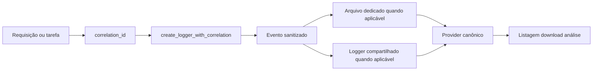

# Logging da Plataforma

Atualizado com base no runtime atual.

## Objetivo

Explicar como o log nasce durante a execução, como o correlation_id
organiza a história ponta a ponta e como a camada administrativa consulta
ou analisa logs usando o provider canônico.

## Visão geral

O desenho atual de logging tem duas metades complementares. A primeira é
a emissão operacional do evento durante a execução da API, do worker, do
scheduler e dos serviços internos. A segunda é a leitura administrativa,
que prepara logs para listagem, download, telemetria e análise.

Isso importa porque escrever log e consultar log não são a mesma coisa.
Hoje a escrita ainda nasce majoritariamente no logging_system local,
enquanto a leitura administrativa passa pelo provider canônico resolvido
por ambiente.

## Explicação conceitual

O correlation_id continua sendo a identidade lógica da execução. A API o
resolve cedo, propaga esse valor no request, devolve o mesmo ID no
header e usa esse identificador para que a trilha de request, worker e
diagnóstico conte a mesma história.

A fábrica create_logger_with_correlation é o ponto principal de escrita.
Quando o ID é válido e a feature está habilitada, o runtime reaproveita
arquivo dedicado por correlação. Quando isso não se aplica, usa logger
compartilhado. Já a consulta administrativa entra por BaseLogProvider e
pelos providers concretos de filesystem, Northflank, CloudWatch e Azure.

## Explicação for dummies

Pense no logging como um caderno de bordo. Cada execução importante ganha
um número de viagem chamado correlation_id. Esse número ajuda a seguir a
mesma história do começo ao fim, sem misturar uma execução com outra.

O sistema também tem um bibliotecário. O logger escreve as páginas do
caderno. O provider canônico é quem sabe onde encontrar esse caderno
depois, seja no disco local, na Northflank, no CloudWatch ou no Azure.

## Fluxo resumido

## O contrato do correlation_id

No runtime atual, a API resolve ou gera o correlation_id, grava esse
valor no request state e devolve X-Correlation-Id na resposta. Quando a
resposta é JSON, o body também pode receber correlationId.

Impacto prático:

- a API continua sendo a autoridade lógica da correlação;
- serviços internos não deveriam inventar outra narrativa para o mesmo
    fluxo;
- worker, API e diagnóstico precisam contar a mesma história.

## Worker e escopo operacional

Existe um escopo auxiliar chamado worker_execution_correlation_id, mas o
runtime pode reaproveitar o mesmo correlation_id lógico quando esse
campo não é informado separadamente.

Em linguagem simples: o worker pode ter metadado operacional próprio,
mas isso não autoriza criar uma segunda identidade lógica para o mesmo
job.

## Como a escrita funciona hoje

### Middleware HTTP

O app HTTP mede duração, injeta correlation_id no contexto e registra
eventos de request. Também devolve X-Correlation-Id na resposta e injeta
correlationId no body JSON quando aplicável.

### Fábrica canônica de logger

create_logger_with_correlation continua sendo o ponto principal da
escrita.

Comportamento observado:

- correlation_id inválido cai para logger compartilhado;
- correlation_id válido pode gerar arquivo dedicado quando a feature
    estiver habilitada;
- log_correlation_directory define o diretório da correlação;
- log_output_directory pode reancorar esse caminho quando ele for
    relativo.

### Worker de processo

O runner do worker cria trilha própria de processo e publica markers de
prontidão e encerramento, como WORKER_READY, INGESTION_READY, ETL_READY
e WORKER_SHUTDOWN_COMPLETE.

Na prática, esses markers ajudam a diferenciar um worker realmente pronto
de um processo apenas vivo.

## Sanitização de segredos

O pipeline de logging mascara campos sensíveis antes da gravação.

Exemplos comprovados no código incluem api_key, access_token,
refresh_token, secret, password, credentials e campos terminados em
token, secret, password e key.

## Provider canônico de logs

O provider canônico governa leitura, materialização, download, telemetria
e análise administrativa. Ele não é a mesma coisa que o logger de
escrita.

Regra atual de resolução:

- em development, o provider ativo é sempre filesystem;
- fora de development, LOG_PROVIDER_TYPE precisa estar configurado de
    forma explícita;
- fora de development não existe fallback implícito escondido.

Providers encontrados no código:

- filesystem
- northflank
- aws_cloudwatch
- azure

## O que isso significa na prática

O desenho atual é híbrido.

- escrita operacional: majoritariamente local via logging_system;
- consulta administrativa: mediada pelo provider canônico.

Isso precisa estar claro para não documentar uma centralização de ponta
a ponta que o runtime ainda não entrega integralmente.

## Regras operacionais importantes

- não varrer a pasta de logs cegamente;
- procurar primeiro pelo prefixo do correlation_id;
- abrir apenas os arquivos candidatos do run investigado;
- não confundir HTTP 200 ou 202 com prova de trilha completa de execução.

## Como validar

1. Execute uma rota com X-Correlation-Id conhecido.
     A resposta deve devolver o mesmo ID.
2. Se a feature estiver habilitada, confirme o arquivo dedicado daquela
     correlação.
3. Suba o worker e confira markers como WORKER_READY e INGESTION_READY.
4. Em development, confirme provider filesystem.
     Fora de development, confirme LOG_PROVIDER_TYPE explícito.

## Evidência no código

- src/api/service_api.py
- src/core/logging_system.py
- src/api/services/log_provider_service.py
- src/analysis/log_analysis_service.py
- src/analysis/log_pipeline/
- app/runners/worker_runner.py
- src/api/services/worker_process_runtime.py
- src/api/services/async_job_dramatiq.py

## Lacunas no código

Não encontrado no código.

Onde deveria estar:

- um mecanismo único de ponta a ponta governando escrita e leitura de
    logs pelo mesmo contrato técnico;
- um endpoint administrativo único expondo provider ativo, prontidão de
    processo e topologia observável do runtime.
