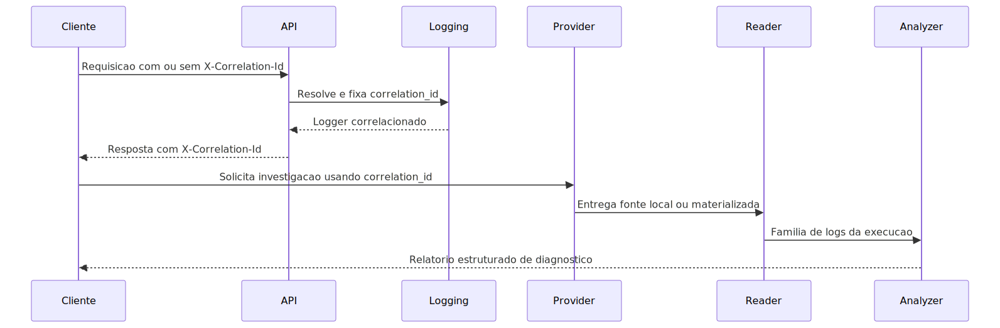

# Manual técnico, executivo, comercial e estratégico: Logging, Correlation ID e análise forense por logs

## Leitura especializada recomendada

Para a trilha completa e separada por finalidade, use estes dois manuais como leitura principal.

1. [README-CONCEITUAL-ARQUITETURA-LOGGING-CORRELATION-ID.md](./README-CONCEITUAL-ARQUITETURA-LOGGING-CORRELATION-ID.md) para entender valor, arquitetura, limites, decisões e impacto da estratégia de logging da plataforma.
2. [README-TECNICO-ARQUITETURA-LOGGING-CORRELATION-ID.md](./README-TECNICO-ARQUITETURA-LOGGING-CORRELATION-ID.md) para seguir middleware, criação de logger, saída em arquivo, CloudWatch, providers administrativos e troubleshooting operacional.

Este arquivo continua útil como manual unificado de referência, mas os dois documentos acima passam a ser a entrada principal para estudo profundo do tema.

## 1. O que é esta feature

O sistema de logging desta plataforma não é apenas um mecanismo para
imprimir mensagens. Ele é a trilha operacional que registra a execução
real da API, do worker, do scheduler e dos fluxos internos, sempre em
formato estruturado e com foco em reconstrução de causa raiz.

Na prática, esta feature combina quatro capacidades complementares:

- emissão de eventos estruturados em JSON durante a execução;
- correlação ponta a ponta por meio de um identificador lógico único;
- preparação canônica de logs para leitura local ou remota;
- análise unificada de arquivos correlacionados para diagnóstico.

Isso faz deste módulo uma capacidade transversal da plataforma. Ele não
é uma função isolada, porque influencia suporte, operação, auditoria,
análise de incidentes, correção de erros, rastreabilidade de jobs e a
qualidade do processo de evolução do produto.

## 2. Que problema ela resolve

Sem uma estratégia de logging coerente, um erro distribuído entre API,
worker e serviços internos vira uma investigação cega. A equipe passa a
ter mensagens soltas, arquivos desconectados, respostas HTTP sem rastro
operacional e dificuldade para separar falha de entrada, falha de
configuração, falha de infraestrutura e falha de regra de negócio.

Esta feature existe para reduzir exatamente esse problema.

Ela resolve:

- perda de contexto entre request HTTP e processamento assíncrono;
- mistura de eventos de execuções diferentes no mesmo diagnóstico;
- dificuldade de localizar logs quando o ambiente muda;
- dependência de inspeção manual desorganizada em diretórios grandes;
- análise superficial baseada em um arquivo isolado, em vez da família
  completa de logs da execução.

O ganho operacional é simples de entender: em vez de procurar erro por
tentativa e erro, a investigação parte de um correlation_id e usa esse
identificador para puxar a história completa daquela execução.

## 3. Visão executiva

Para liderança, esta feature reduz risco operacional e melhora
previsibilidade. Ela diminui o tempo de diagnóstico, evita análises
baseadas em opinião e fortalece governança, porque transforma incidente
em evidência rastreável.

Na prática, isso ajuda a gestão a responder perguntas que importam:

- o problema está na API, no worker ou em um provider externo;
- a execução realmente terminou ou só iniciou;
- o ambiente está produzindo logs utilizáveis para suporte e auditoria;
- a equipe consegue provar causa raiz ou só descrever sintomas.

O valor executivo não está em “ter logs”. Está em conseguir reconstruir
o que aconteceu com base em um contrato claro de correlação e leitura.

## 4. Visão comercial

Comercialmente, esta feature sustenta uma promessa importante para
clientes corporativos: a plataforma não opera como caixa-preta. Ela foi
desenhada para rastrear execuções, investigar incidentes e diferenciar
falhas de dado, configuração e integração externa.

Em uma conversa comercial, isso pode ser explicado de forma objetiva:

- cada execução relevante recebe um identificador rastreável;
- esse identificador aparece na resposta da API;
- a mesma correlação permite recuperar a trilha operacional da execução;
- ambientes distintos podem consultar logs de fontes diferentes sem
  mudar a lógica de análise.

O benefício percebido pelo cliente é redução de atrito em implantação,
suporte e pós-venda. A promessa correta não é “erro nunca acontece”. A
promessa correta é “quando algo falha, a plataforma foi preparada para
investigar com evidência e não por adivinhação”.

## 5. Visão estratégica

Estrategicamente, o módulo fortalece a plataforma em quatro frentes:

- desacopla escrita operacional de leitura administrativa;
- padroniza investigação mesmo quando o ambiente muda;
- reforça o contrato de correlação entre fronteiras síncronas e
  assíncronas;
- prepara a base para automação de diagnóstico e agentes orientados por
  log.

Isso é importante porque plataformas agentic, pipelines assíncronos,
RAG, ETL e workers distribuídos exigem observabilidade que atravesse
camadas. Sem esse desenho, cada nova feature aumenta a dificuldade de
suporte. Com esse desenho, novas capacidades continuam rastreáveis.

## 6. Conceitos necessários para entender

### 6.1 Logging estruturado

Aqui, log não é texto livre pensado só para humanos. O runtime normaliza
payloads, injeta contexto e grava JSON estruturado. Isso permite que a
mesma linha de log seja útil para leitura humana, busca por campos,
análise automatizada e extração de métricas.

Na prática, isso importa porque o pipeline de análise downstream lê
linhas JSON, não apenas mensagens soltas.

### 6.2 Correlation ID

O correlation_id é a identidade lógica da execução investigada. Ele é o
fio condutor que liga request, resposta, arquivos correlacionados e
análise posterior.

Em linguagem simples, é o número do caso. Se duas mensagens não têm o
mesmo correlation_id, elas não deveriam ser tratadas como a mesma
história operacional.

### 6.3 Provider canônico

O provider canônico é a camada que sabe preparar logs para leitura.
Ele não é o logger que escreve eventos em runtime. Ele é o mecanismo que
resolve de onde os logs serão obtidos para listagem, download,
telemetria e análise.

Essa separação existe porque escrever log e consultar log são problemas
diferentes. O runtime de emissão precisa ser estável e barato durante a
execução. Já a leitura administrativa precisa saber localizar ou
materializar logs em diferentes ambientes.

### 6.4 Materialização

Materializar significa transformar logs remotos em artefatos locais
temporários, para que a etapa de leitura e análise use um contrato
único. Isso acontece com CloudWatch, Northflank e Azure Log Analytics.

Na prática, isso evita duplicar a lógica de análise para cada provider.
Primeiro o provider busca os eventos. Depois ele os converte em arquivo
local temporário. Só então o pipeline unificado trabalha em cima desse
arquivo.

### 6.5 Família de logs

Uma execução pode gerar mais de um arquivo relacionado: API, worker,
scheduler e arquivos correlacionados adicionais. O leitor canônico não
trata esses arquivos como entidades independentes. Ele tenta organizá-los
como uma família da mesma execução.

Isso importa porque investigar apenas um arquivo pode esconder a causa
raiz que está em outro papel operacional da mesma correlação.

### 6.6 Faulthandler

Faulthandler é um mecanismo voltado a falhas mais baixas de runtime,
como travamentos e dumps de threads. Ele não substitui o log normal de
negócio. Ele complementa o diagnóstico quando o processo não falha de
forma elegante.

## 7. Como a feature funciona por dentro

O fluxo começa na fronteira HTTP. O middleware de log resolve o
correlation_id, preferindo o valor já presente no request quando ele foi
fornecido, ou gerando um novo quando necessário. Esse ID é gravado no
estado do request, no contexto do log e devolvido ao cliente no header
X-Correlation-Id. Quando a resposta é JSON, o runtime também injeta
correlationId no corpo, desde que esse campo ainda não exista.

Com o correlation_id resolvido, a API cria um logger correlacionado por
meio de create_logger_with_correlation. A partir daí, a escrita segue o
desenho configurado do runtime. O sistema pode usar logger compartilhado
ou arquivo dedicado por correlação, sempre preservando JSON estruturado.

Em paralelo, o logging_system mantém as saídas operacionais da escrita.
O arquivo principal rotacionado registra a trilha geral do processo. O
console publica a saída padrão quando habilitado. O CloudWatch pode ser
anexado como saída adicional. E o faulthandler gera dumps próprios para
falhas de baixo nível.

Depois, quando alguém precisa investigar um incidente, entra a segunda
metade do desenho: o provider canônico. Ele resolve se a leitura será
local, no CloudWatch, na Northflank ou no Azure. Se o provider for
remoto, ele materializa os eventos em arquivo local temporário. Se o
provider for local, ele trabalha diretamente sobre os arquivos já
gravados.

O CanonicalLogReader localiza a família de logs da execução usando o
correlation_id, classifica os papéis operacionais dos arquivos e evita a
abordagem errada de varrer a pasta inteira cegamente. Com os arquivos
corretos em mãos, o AnalyzeLogsCommand carrega os registros JSON e chama
o pipeline unificado de análise. Esse pipeline produz saídas úteis para
diagnóstico, incluindo erros críticos, execução de agentes, execução de
workflow, métricas de tempo, ingestão e outros indicadores derivados dos
subscribers ativos.

## 8. Divisão em etapas ou submódulos

### 8.1 Emissão HTTP e fixação da correlação

Esta etapa fixa a identidade lógica da execução.

- O que é: o middleware HTTP que resolve correlation_id, mede duração e
  registra a requisição.
- Por que existe: sem essa etapa, a API responderia sem entregar a chave
  que permite investigação posterior.
- O que recebe: método, path, headers e contexto do request.
- O que faz: lê X-Correlation-Id quando informado, normaliza o valor,
  gera novo ID quando necessário, injeta contexto e devolve o ID na
  resposta.
- O que entrega: uma execução HTTP com identidade lógica explícita.
- O que pode dar errado: usar request sem correlação reaproveitável ou
  perder a associação entre resposta e logs.
- Como diagnosticar: confirmar se a resposta devolve X-Correlation-Id e
  se o body JSON inclui correlationId quando aplicável.

### 8.2 Escrita principal de runtime

Esta etapa registra a trilha operacional contínua da aplicação.

- O que é: o conjunto de handlers geridos pelo logging_system.
- Por que existe: o sistema precisa de uma saída persistente e previsível
  para eventos operacionais.
- Técnica usada: formatter JSON estruturado, rotação de arquivo e
  configuração centralizada de handlers.
- O que recebe: eventos do logging padrão e do structlog já enriquecidos.
- O que entrega: linhas JSON em arquivo principal, console e, quando
  habilitado, CloudWatch.
- O que pode dar errado: saída esperada desabilitada, credenciais ausentes
  ou configuração remota incompleta.
- Como diagnosticar: verificar as flags de logging e confirmar qual
  handler foi efetivamente anexado.

### 8.3 Escrita dedicada por correlation_id

Esta etapa transforma uma execução específica em arquivo próprio.

- O que é: o caminho de create_logger_with_correlation quando
  enable_correlation_file_logging está habilitado e o ID é elegível para
  isolamento em arquivo.
- Por que existe: facilita investigação por caso, sem depender só do
  arquivo compartilhado.
- O que recebe: correlation_id e, opcionalmente, origem lógica.
- O que faz: calcula nome determinístico do arquivo, grava sidecar de
  origem, anexa FileHandler específico e isola linhas daquele ID.
- O que entrega: arquivo dedicado por execução, com convenção
  determinística de nome.
- O que pode dar errado: a feature estar desabilitada ou o ID não entrar
  no critério de arquivo dedicado, levando ao logger compartilhado.
- Como diagnosticar: conferir se o correlation_id gerou arquivo próprio
  em log_correlation_directory.

### 8.4 Saídas complementares de escrita

Esta etapa cobre destinos adicionais que enriquecem a operação.

- Console: útil para execução interativa, containers e leitura imediata
  de stdout. Não substitui persistência.
- CloudWatch como saída de escrita: útil quando a plataforma precisa
  publicar eventos diretamente na AWS. O código cria stream único,
  pode criar log group e pode aplicar retenção.
- Faulthandler: útil para dumps de travamento e problemas de thread.
  Não substitui o log operacional normal.

### 8.5 Preparação de leitura por provider

Esta etapa decide de onde os logs serão recuperados.

- O que é: BaseLogProvider e suas implementações concretas.
- Por que existe: a análise não pode depender de um único ambiente.
- O que recebe: AnalyzeLogsRequest e provider_context.
- O que faz: localiza arquivos locais ou consulta provedores remotos e,
  quando necessário, materializa resultado em arquivo temporário.
- O que entrega: PreparedLogSource pronto para o leitor e para o
  analisador downstream.

### 8.6 Leitura canônica por família

Esta etapa organiza a investigação.

- O que é: CanonicalLogReader.
- Por que existe: arquivos correlacionados podem ter papéis diferentes,
  e a ordem deles importa para diagnóstico.
- O que faz: resolve diretório, valida existência, localiza arquivos por
  padrões correlacionados, identifica papéis como API, worker e
  scheduler e ordena a família.
- O que entrega: conjunto coerente de arquivos para investigação.

### 8.7 Análise unificada

Esta etapa transforma arquivos em diagnóstico.

- O que é: AnalyzeLogsCommand e executor do pipeline unificado.
- Por que existe: ler arquivo bruto não basta quando se quer extrair
  erros críticos, tempo, execução de agentes e fluxo de workflow.
- O que recebe: arquivos resolvidos, correlation_hint e configuração.
- O que faz: converte linhas JSON em registros brutos e os distribui para
  subscribers especializados.
- O que entrega: relatório estruturado de análise.

### 8.8 Uso pelo processo de correção de erros orientado por log

Esta etapa conecta observabilidade e engenharia de correção.

- O que é: o processo de diagnóstico forense que parte do log e cruza
  evidência com código real.
- Por que existe: corrigir erro sem trilha confiável costuma gerar
  paliativo, não correção definitiva.
- O que usa: correlation_id, família de logs, análise unificada e campos
  extras em JSON.
- O que entrega: base factual para um agente ou engenheiro decidir se o
  problema está em dado, regra, infraestrutura, configuração ou falta de
  instrumentação.

## 9. Pipeline ou fluxo principal

### Passo 1. A API recebe a requisição e resolve o correlation_id

O middleware HTTP verifica se a chamada já chegou com X-Correlation-Id.
Se veio, esse valor é aproveitado após normalização. Se não veio, a API
gera um novo ID. O ponto importante é que a correlação nasce cedo,
antes do restante do fluxo seguir.

### Passo 2. O request passa a carregar a identidade lógica da execução

O ID é gravado no estado do request e no contexto de logging. Isso é o
que permite que mensagens emitidas depois ainda saibam a qual execução
pertencem.

### Passo 3. O logger correlacionado é criado

O runtime decide entre logger compartilhado ou arquivo dedicado por
correlação. Essa decisão depende da configuração e do tipo de ID.

### Passo 4. Os handlers de escrita publicam o evento

O evento pode ir para o arquivo principal rotacionado, para o console,
para arquivo dedicado de correlação e, quando habilitado, também para o
CloudWatch.

### Passo 5. O cliente recebe a referência para investigação

O mesmo correlation_id volta no header X-Correlation-Id e pode voltar no
body JSON como correlationId. Isso é importante porque o suporte e a
operação passam a ter a chave da investigação já na resposta da API.

### Passo 6. Quando há incidente, o provider canônico prepara a fonte

Em development, a leitura é filesystem. Fora desse ambiente, o tipo do
provider precisa estar explicitamente configurado. Se o provider for
remoto, ele consulta a origem remota e materializa um arquivo local.

### Passo 7. O leitor canônico monta a família da execução

O CanonicalLogReader busca os arquivos daquela correlação, identifica se
eles representam API, worker, scheduler ou outro arquivo correlacionado
e ordena a família.

### Passo 8. O pipeline unificado transforma log bruto em diagnóstico

O AnalyzeLogsCommand carrega os registros JSON e os distribui aos
subscribers do pipeline. O resultado deixa de ser apenas um monte de
linhas e vira uma análise estruturada da execução.

## 10. Decisões técnicas e trade-offs

### Separar escrita de leitura

Ganho: evita acoplamento entre performance do runtime e forma de
consulta posterior.

Custo: o desenho fica mais sofisticado e pode ser mal interpretado por
quem assume que “provider” também é o mecanismo de emissão.

Impacto: a documentação precisa deixar claro que o logger escreve e o
provider prepara leitura.

### Usar correlation_id como identidade lógica

Ganho: reduz mistura de execuções e permite investigação de ponta a
ponta.

Custo: exige disciplina de propagação entre camadas.

Impacto: toda análise séria começa pelo correlation_id, não pelo nome do
arquivo solto.

### Materializar logs remotos antes de analisar

Ganho: um único pipeline de análise serve para múltiplas origens.

Custo: existe passo intermediário de conversão para artefato local.

Impacto: simplifica análise e reaproveitamento de tooling.

### Manter arquivo dedicado por correlação quando habilitado

Ganho: melhora isolamento de caso e reduz ruído de investigação.

Custo: aumenta quantidade de arquivos gerados.

Impacto: o leitor canônico e o manifest de origem passam a ter papel
importante na navegação.

### Adiar ativação do CloudWatch por worker

Ganho: reduz risco de anexar handler remoto em momento inadequado do
bootstrap do worker.

Custo: exige mais atenção na leitura da topologia de handlers.

Impacto: um ambiente pode ter CloudWatch habilitado, mas ainda não
anexado naquele estágio do processo.

## 11. Configurações que mudam o comportamento

### environment

Controla a resolução do provider efetivo de leitura.

- Em development, o código força filesystem.
- Fora de development, não existe fallback implícito.

### log_provider_type

Controla qual provider canônico será usado fora de development.

- Valores confirmados: filesystem, northflank, aws_cloudwatch, azure.
- Se estiver ausente ou inválido fora de development, o código falha com
  erro explícito.

### enable_file_logging

Controla a escrita no arquivo principal rotacionado.

- Quando desligado, essa saída deixa de existir.
- Quando ligado, o runtime usa RotatingFileHandler.

### log_file_path

Controla o caminho do arquivo principal de log.

- Se log_output_directory estiver definido, o arquivo principal é
  reancorado nesse diretório.

### log_output_directory

Controla o diretório base das saídas locais.

- Afeta o arquivo principal.
- Afeta diretórios relativos de correlação.

### enable_console_logging

Controla a emissão em stdout.

- Útil para container, execução manual e leitura rápida.
- Não substitui persistência local ou remota.

### enable_correlation_file_logging

Controla a criação de arquivo dedicado por correlation_id quando o ID é
elegível para isolamento.

- Se desligado, a investigação depende mais do arquivo compartilhado e da
  leitura correlacionada.

### log_correlation_directory

Controla o diretório dos arquivos dedicados por correlação.

- Se for relativo e log_output_directory existir, o caminho é reancorado.

### enable_cloudwatch_logging

Controla a saída de escrita adicional para AWS CloudWatch.

- Não substitui automaticamente o provider de leitura.
- É uma saída de emissão, não a definição do mecanismo administrativo de
  consulta.

### cloudwatch_log_group

Obrigatório quando a escrita para CloudWatch está habilitada.

- Sem esse valor, o handler remoto não pode ser inicializado.

### cloudwatch_log_stream_prefix

Controla o prefixo do stream do CloudWatch.

- Quando vazio, o código usa o prefixo prometeu.

### cloudwatch_region_name

Controla a região AWS usada pelo handler de escrita e pela consulta
remota quando não houver override no contexto da requisição.

### cloudwatch_create_log_group

Permite ao runtime tentar criar o log group quando ele não existe.

### Configurações padrão de Northflank

Controlam o contexto padrão do provider Northflank.

- Sem project_id, a consulta falha.
- Sem workload alvo, a consulta falha.

### azure_log_analytics_workspace_id e azure_log_analytics_default_query

Controlam a consulta padrão do provider Azure.

- Sem workspace_id ou query, a consulta falha.

## 12. Contratos, entradas e saídas

### Entradas do runtime HTTP

- Header opcional X-Correlation-Id.
- Método e path da requisição, usados para origem e logging.

### Saídas do runtime HTTP

- Header X-Correlation-Id sempre devolvido pelo middleware de log.
- Campo correlationId no body JSON quando aplicável e ainda ausente.

### Saídas de escrita operacional

- Arquivo principal rotacionado.
- Console em stdout.
- Arquivo dedicado por correlação, quando habilitado.
- CloudWatch como saída adicional, quando habilitado.
- Arquivo de faulthandler para dumps de baixo nível.

### Entradas de análise administrativa

O contrato observado no código exige uma das seguintes formas de seleção
quando a fonte é local:

- correlation_id;
- log_name;
- all_logs igual a true.

No caso de providers remotos, entram também parâmetros de
provider_context, como log_group, stream_prefix, janelas temporais,
workloads Northflank, workspace Azure e query.

### Saídas da leitura administrativa

- PreparedLogSource apontando para diretório local pronto para análise.
- Artefatos temporários locais, quando a origem for remota.
- Relatório estruturado de análise após o pipeline unificado.

## 13. O que acontece em caso de sucesso

No caminho feliz, a requisição recebe um correlation_id utilizável, a
resposta devolve esse mesmo ID ao cliente e os eventos da execução são
emitidos nas saídas configuradas.

Quando alguém investiga essa execução depois, o provider correto prepara
os logs, o leitor canônico encontra a família do caso e o pipeline
unificado produz análise sem exigir varredura manual do diretório inteiro.

Do ponto de vista operacional, sucesso significa três coisas ao mesmo
tempo:

- a execução foi registrada;
- o correlation_id foi preservado como chave de investigação;
- a trilha pode ser recuperada e analisada depois.

## 14. O que acontece em caso de erro

### Falta de seletor para logs locais

O provider filesystem exige correlation_id, log_name ou all_logs. Se nada
for informado, ele falha explicitamente.

### CloudWatch sem configuração mínima

O provider de leitura CloudWatch falha quando não há log_group ou quando
não existe nenhum seletor útil, como correlation_id, filter_pattern,
prefixo de stream ou janela temporal.

Na escrita, o handler CloudWatch também falha explicitamente se o grupo
ou bibliotecas obrigatórias não estiverem disponíveis.

### Northflank sem projeto, token ou workload

Sem project_id, token de API ou workload alvo, o provider não tenta adivinhar.
Ele retorna erro explícito.

### Azure sem workspace, query ou credenciais

O provider Azure exige workspace_id, query e credenciais válidas para
obter access_token. Sem isso, a leitura falha.

### Nenhum arquivo encontrado para análise

Se o AnalyzeLogsCommand não encontrar arquivos após resolver a fonte, a
análise falha com erro explícito em vez de produzir relatório vazio
enganoso.

### Falta de evidência suficiente no log

Esse é um caso importante. Nem sempre o problema está no código de
negócio. Às vezes o erro real é falta de observabilidade. O agente de
correção com log do repositório deixa isso explícito: se o log não prova
o que aconteceu, o caminho correto é instrumentar melhor e repetir a
execução, não inventar explicação.

## 15. Observabilidade e diagnóstico

O diagnóstico correto começa pelo correlation_id, não pelo diretório.
Esse é o primeiro ponto que separa uma investigação disciplinada de uma
investigação improvisada.

Sequência prática de investigação:

1. Obter o correlation_id na resposta HTTP, no incidente reportado ou no
   job investigado.
2. Identificar qual provider de leitura está ativo no ambiente.
3. Preparar a fonte por meio do provider correto.
4. Usar o CanonicalLogReader para localizar a família do caso.
5. Rodar a análise unificada sobre os arquivos resolvidos.
6. Cruzar achados de log com o código real do caminho executado.

O que observar durante a investigação:

- se a resposta HTTP devolveu o mesmo ID que está nos arquivos;
- se a família contém só API ou também worker e scheduler;
- se houve materialização remota para arquivo local;
- se o pipeline unificado encontrou erros críticos, execução de agente,
  workflow, ingestão ou gargalos de tempo;
- se os campos extras em JSON contam a história completa ou se ainda há
  lacuna de instrumentação.

### Como isso ajuda o agente de correção de erros com log

O repositório mantém um agente especializado em correção baseada em log,
com instruções explícitas para trabalhar por evidência e ler o log
inteiro antes de corrigir código. O desenho deste módulo ajuda esse
agente de três maneiras práticas.

Primeiro, o correlation_id reduz o espaço de busca. O agente não precisa
inspecionar logs aleatórios; ele começa pela execução correta.

Segundo, o provider canônico e a materialização escondem diferenças de
ambiente. O agente pode trabalhar com uma trilha local coerente mesmo
quando os eventos nasceram em CloudWatch, Northflank ou Azure.

Terceiro, o pipeline unificado já entrega uma primeira organização do
incidente, extraindo categorias como erros críticos, execução de agentes
e workflow. Isso não substitui a leitura forense, mas acelera a triagem
e ajuda a descobrir se falta dado, falta correlação ou falta
instrumentação.

## 16. Impacto técnico

Tecnicamente, a feature reduz acoplamento entre execução e investigação,
encapsula a variação de ambiente de leitura e reforça o padrão de
observabilidade estruturada.

Ela melhora:

- rastreabilidade entre fronteiras síncronas e assíncronas;
- reutilização de uma mesma análise para múltiplas origens;
- isolamento de casos via arquivo correlacionado;
- segurança de diagnóstico por evitar varredura cega e conclusões sem
  evidência.

## 17. Impacto executivo

Executivamente, a feature reduz tempo desperdiçado em incidentes e
aumenta a qualidade das decisões operacionais. Ela ajuda a liderança a
enxergar se o problema foi erro de uso, configuração incorreta, bug real
ou indisponibilidade externa.

Isso reduz custo oculto de suporte e aumenta previsibilidade de operação.

## 18. Impacto comercial

Comercialmente, a capacidade de rastreamento por correlation_id e análise
multifonte ajuda em pré-venda e pós-venda, porque dá segurança para
apresentar a plataforma como sistema governável e auditável.

Ela é especialmente útil para clientes que exigem:

- investigação de incidentes com evidência;
- rastreabilidade de execuções sensíveis;
- operação em cloud com fontes de log diferentes;
- menor dependência de troubleshooting manual improvisado.

## 19. Impacto estratégico

Esta feature prepara a plataforma para crescer sem perder capacidade de
diagnóstico. Ela fortalece qualquer módulo que dependa de execução
assíncrona, multiagente, workflows, ingestão ou integrações remotas.

O valor estratégico está em transformar logging de obrigação técnica em
infraestrutura de aprendizado operacional.

## 20. Exemplos práticos guiados

### Exemplo 1. Incidente simples na API

Cenário: uma rota retorna erro 500.

- Entrada: resposta HTTP com X-Correlation-Id.
- Processamento: o suporte usa esse ID para localizar a família de logs.
- Decisão: se houver apenas arquivo da API, o problema provavelmente não
  atravessou para worker.
- Saída: análise focada no request e nos serviços síncronos envolvidos.
- Impacto: reduz tempo perdido procurando em arquivos não relacionados.

### Exemplo 2. Execução que depende de worker

Cenário: a API aceita a requisição, mas o resultado final não aparece.

- Entrada: correlation_id devolvido na resposta inicial.
- Processamento: o leitor canônico busca a família API e worker.
- Decisão: se o arquivo API existe, mas o worker não apresenta markers de
  prontidão ou execução, o problema pode estar na esteira assíncrona.
- Saída: o diagnóstico muda de “erro da API” para “quebra na continuidade
  operacional do worker”.

### Exemplo 3. Ambiente remoto com CloudWatch

Cenário: a equipe precisa investigar produção AWS.

- Entrada: correlation_id do incidente e log_group configurado.
- Processamento: o provider CloudWatch busca eventos, materializa um
  arquivo local temporário e entrega PreparedLogSource.
- Decisão: a análise continua com o mesmo pipeline unificado usado em
  ambiente local.
- Saída: a equipe não precisa reinventar a análise por usar uma origem
  remota.

### Exemplo 4. Correção orientada por log com agente especializado

Cenário: um erro reaparece e precisa de correção definitiva.

- Entrada: correlation_id, família de logs e código do caminho real.
- Processamento: o agente de correção lê a trilha inteira, extrai campos
  extras, identifica warnings, erros, fallbacks e gargalos.
- Decisão: se o log provar a causa, a correção vai ao ponto certo. Se o
  log não provar, a ação correta é aumentar instrumentação.
- Saída: a correção deixa de ser chute e passa a ser forense.

## 21. Explicação 101

Imagine que cada atendimento da plataforma recebesse uma pasta com um
protocolo único. Tudo o que aconteceu naquele caso vai sendo arquivado
com esse protocolo. Se o caso sair da mesa da API e passar para a mesa do
worker, o protocolo continua o mesmo. Se depois alguém precisar auditar o
caso, não começa abrindo pastas aleatórias. Começa pelo protocolo.

O correlation_id é esse protocolo. O logger é quem escreve o material.
O provider canônico é quem busca a pasta certa, esteja ela no disco, na
AWS, na Northflank ou no Azure. O analisador é quem lê a pasta inteira e
transforma o conteúdo em diagnóstico útil.

## 22. Limites e pegadinhas

- CloudWatch como saída de escrita não significa que o provider de leitura
  ativo também será CloudWatch.
- Ter um correlation_id na resposta não garante sozinho que toda a trilha
  necessária foi instrumentada com qualidade suficiente.
- Arquivo dedicado por correlação melhora investigação, mas não elimina a
  importância do arquivo compartilhado e dos markers de processo.
- Materialização remota resolve o problema de formato, não o problema de
  falta de dado. Se o evento não foi emitido, o provider não inventa.
- Um relatório do pipeline unificado ajuda muito, mas não substitui o
  cara-crachá final com o código do caminho executado.

## 23. Troubleshooting

### Sintoma: recebi erro, mas não sei onde investigar

- Causa provável: o suporte está começando pela pasta de logs, e não pelo
  correlation_id.
- Como confirmar: verificar se a resposta HTTP devolveu X-Correlation-Id.
- Ação recomendada: reiniciar a investigação pela correlação.

### Sintoma: não encontro logs no ambiente remoto

- Causa provável: provider remoto sem seletor suficiente ou sem contexto
  obrigatório.
- Como confirmar: revisar se CloudWatch tem log_group e filtro útil, se
  Northflank tem project_id e workload, ou se Azure tem workspace e
  query.
- Ação recomendada: corrigir o contexto da consulta, não trocar o
  provider por tentativa.

### Sintoma: o pipeline de análise não acha arquivos

- Causa provável: correlation_id errado, logs ainda não materializados ou
  família inexistente para aquela execução.
- Como confirmar: verificar PreparedLogSource e diretório resolvido.
- Ação recomendada: validar a origem da correlação e o provider ativo.

### Sintoma: o log existe, mas não prova a causa raiz

- Causa provável: falha de instrumentação, não necessariamente bug de
  negócio.
- Como confirmar: ausência de eventos decisivos, métricas ou transições
  relevantes na trilha.
- Ação recomendada: instrumentar melhor e repetir a execução.

## 24. Diagramas

### Diagrama 1. Fluxo macro da observabilidade

Este diagrama mostra a diferença entre emissão operacional, preparação
de leitura e análise downstream.

### Diagrama 2. Sequência da investigação por correlation_id

Este diagrama mostra por que o correlation_id é a chave da trilha e não
apenas um detalhe de cabeçalho.

## 25. Mapa de navegação conceitual

- Fronteira HTTP: define a identidade lógica da execução.
- Runtime de logging: emite eventos para as saídas operacionais.
- Arquivos correlacionados: isolam casos específicos quando habilitados.
- Provider canônico: prepara a origem correta da leitura.
- Leitor canônico: monta a família da execução.
- Pipeline unificado: converte log bruto em diagnóstico reutilizável.
- Agente de correção com log: usa essa trilha como evidência para
  corrigir causa raiz ou pedir mais instrumentação.

## 26. Como colocar para funcionar

### Em desenvolvimento local

O comportamento confirmado no código é:

- o provider efetivo de leitura será filesystem;
- a API devolverá X-Correlation-Id nas respostas;
- as saídas locais dependem das flags de logging habilitadas.

### Em ambientes não development

O comportamento confirmado no código é:

- log_provider_type precisa estar explicitamente configurado;
- o valor precisa ser canônico e suportado;
- providers remotos exigem seus próprios contextos e credenciais.

### Como validar que funcionou

- gerar uma execução HTTP e capturar o X-Correlation-Id devolvido;
- confirmar que o mesmo ID aparece na trilha de log correspondente;
- confirmar que a família de arquivos pode ser recuperada pela leitura
  canônica;
- confirmar que o pipeline de análise produz relatório em vez de falha de
  seleção ou ausência de arquivos.

## 27. Exercícios guiados

### Exercício 1. Entender a fronteira da correlação

- Objetivo: provar que a API é a origem da correlação observável.
- Passos: executar uma rota, capturar o header de resposta e verificar se
  o mesmo ID aparece no diagnóstico posterior.
- O que observar: o mesmo valor precisa viajar da resposta para a
  investigação.
- Conceito reforçado: correlação não é detalhe cosmético, é chave de
  rastreabilidade.

### Exercício 2. Entender a diferença entre escrita e leitura

- Objetivo: distinguir logger de provider.
- Passos: identificar uma saída de escrita e depois identificar qual
  provider de leitura está ativo no ambiente.
- O que observar: escrever em CloudWatch e ler via provider canônico são
  responsabilidades diferentes.
- Conceito reforçado: emissão e consulta não são a mesma camada.

### Exercício 3. Entender o papel da materialização

- Objetivo: compreender por que logs remotos viram artefato local antes
  da análise.
- Passos: acompanhar uma leitura remota até o PreparedLogSource.
- O que observar: o pipeline de análise trabalha sobre um contrato local
  uniforme.
- Conceito reforçado: materialização é técnica de padronização da análise.

## Leituras relacionadas

- [README.md](./README.md): índice por intenção para continuar a investigação.
- [README-ARQUITETURA.md](./README-ARQUITETURA.md): mostra onde logging e correlation_id entram na topologia global.
- [README-SERVICE-API.md](./README-SERVICE-API.md): detalha o ponto em que a correlação nasce no boundary HTTP.
- [README-SCHEDULER.md](./README-SCHEDULER.md): ajuda a interpretar logs e prontidão do processo temporal.
- [README-INGESTAO.md](./README-INGESTAO.md): exemplifica um fluxo assíncrono real que depende dessa observabilidade.
- [README-RAG.md](./README-RAG.md): mostra como o diagnóstico por log ajuda a separar falha de retrieval, ACL e geração.

## 28. Checklist de entendimento

- Entendi que o módulo de logging é uma capacidade transversal da plataforma.
- Entendi por que correlation_id é a identidade lógica da execução.
- Entendi a diferença entre escrita operacional e leitura administrativa.
- Entendi quais saídas de escrita existem no runtime atual.
- Entendi quais providers de leitura existem no runtime atual.
- Entendi por que logs remotos são materializados localmente antes da análise.
- Entendi como o CanonicalLogReader monta a família de arquivos.
- Entendi como o AnalyzeLogsCommand aciona o pipeline unificado.
- Entendi como esse desenho ajuda a correção de erros baseada em log.
- Entendi os limites e pegadinhas do modelo atual.

## 29. Evidências no código

- src/api/service_api.py
  - Motivo da leitura: confirmar nascimento, propagação e devolução do correlation_id.
  - Símbolo relevante: middleware log_requests e injeção de correlationId no body JSON.
  - Comportamento confirmado: a API resolve o ID, o devolve no header e o injeta na resposta JSON quando aplicável.

- src/core/logging_system.py
  - Motivo da leitura: confirmar topologia real de escrita.
  - Símbolos relevantes: construtores dos handlers de arquivo, console e CloudWatch, ativação do faulthandler canônico e criação do logger com correlação.
  - Comportamento confirmado: escrita em arquivo rotacionado, console, CloudWatch opcional, faulthandler e arquivo dedicado por correlação.

- src/core/log_origin_metadata.py
  - Motivo da leitura: confirmar sidecar e manifest de origem dos arquivos correlacionados.
  - Símbolos relevantes: create_correlation_metadata_filename, resolve_log_filename_from_manifest, contexto de request.
  - Comportamento confirmado: o runtime registra metadados de origem e mantém manifest para navegação por correlação.

- src/api/services/log_provider_service.py
  - Motivo da leitura: confirmar providers concretos de leitura.
  - Símbolos relevantes: FileSystemProvider, AWSCloudWatchProvider, NorthflankProvider, AzureLogProvider, resolve_active_log_provider_type.
  - Comportamento confirmado: development força filesystem; fora dele a escolha do provider é explícita.

- src/api/services/canonical_log_reader.py
  - Motivo da leitura: confirmar lookup por família correlacionada.
  - Símbolos relevantes: infer_log_role, sort_log_family_paths, resolve_logs_directory, CanonicalLogReader.
  - Comportamento confirmado: a família é ordenada por papel operacional e não por simples ordem alfabética.

- src/analysis/cloudwatch_log_fetcher.py
  - Motivo da leitura: confirmar busca e materialização dos eventos AWS.
  - Símbolos relevantes: _build_filter_pattern, fetch_cloudwatch_events, materialize_cloudwatch_logs.
  - Comportamento confirmado: CloudWatch remoto vira artefato local temporário antes da análise.

- src/analysis/log_analysis_service.py
  - Motivo da leitura: confirmar reaproveitamento por CLI e API.
  - Símbolo relevante: AnalyzeLogsCommand.
  - Comportamento confirmado: a análise unificada resolve arquivos, carrega registros e devolve relatório estruturado.

- src/analysis/log_pipeline/executor.py
  - Motivo da leitura: confirmar a composição da análise unificada.
  - Símbolos relevantes: build_default_subscribers, collect_raw_records_from_files, run_unified_log_analysis.
  - Comportamento confirmado: o pipeline agrega erros críticos, execução de agentes, workflow, ingestão e métricas correlatas.

- .github/agents/corrigir-erros-com-log.agent.md
  - Motivo da leitura: confirmar o contrato operacional do agente especializado em debugging baseado em log.
  - Símbolo relevante: instruções do agente de debug.
  - Comportamento confirmado: o agente exige leitura completa do log, uso de evidência real e reforça que ausência de prova no log é falha de observabilidade, não licença para adivinhar.
