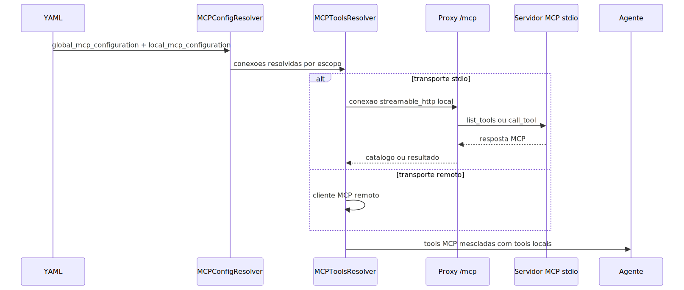

# Manual técnico, executivo, comercial e estratégico: MCP

## 1. O que é esta feature

MCP, neste projeto, é a camada que permite à plataforma consumir ou expor ferramentas compatíveis com Model Context Protocol sem desmontar o runtime principal de agentes, supervisores e workflows.

Na prática, o MCP funciona como uma ponte governada para tools externas ou adicionais. Essas tools não substituem o catálogo builtin do produto. Elas entram como complemento controlado por YAML, por escopo e por regras de merge.

O ponto central do desenho é este: MCP aqui não é um “modo alternativo” da plataforma. Ele é uma extensão da superfície de tools já existente.

## 2. Que problema ela resolve

Sem MCP, toda integração com tool externa precisaria virar uma implementação interna do catálogo builtin ou uma adaptação local ad hoc.

Isso cria problemas conhecidos.

1. Duplicação de integrações.
2. Alto custo de manutenção quando a fonte externa muda.
3. Acoplamento desnecessário entre runtime principal e ferramentas de terceiros.
4. Dificuldade para ativar uma integração apenas em certos supervisores, agentes ou workflows.

O MCP resolve isso permitindo declarar servidores, transportes, autenticação, escopo e políticas de merge diretamente no runtime configurado por YAML.

## 3. Quando ele é usado

No código atual, MCP é usado quando a plataforma precisa ampliar o repertório de tools sem reimplementar essas capacidades como tools builtin do catálogo interno.

Os casos confirmados no repositório são estes.

1. Busca e leitura de documentação AWS via servidor MCP remoto.
2. Integração com MCP local de compras e busca de produtos, exposto por stdio via proxy HTTP interno.
3. Exposição de capacidades internas do sistema de QA por um servidor MCP próprio em stdio.

Em linguagem simples, MCP entra quando a plataforma quer plugar uma caixa de ferramentas externa, mas sem perder governança.

## 4. Visão executiva

Executivamente, MCP importa porque reduz o custo e o tempo de expansão funcional da plataforma.

- Permite conectar fontes de capacidade externas sem reescrever o core.
- Mantém governança por escopo em vez de integração solta por ambiente.
- Evita que cada novo caso de uso exija uma tool interna nova.
- Aumenta a velocidade de experimentação controlada.

Para liderança, o valor não é o protocolo em si. O valor é a capacidade de ampliar rapidamente o ecossistema de ferramentas do produto com menor atrito arquitetural.

## 5. Visão comercial

Comercialmente, MCP ajuda a posicionar a plataforma como um hub extensível, capaz de conversar com fontes externas de capability sem depender exclusivamente do catálogo nativo.

Isso é útil em conversas com cliente quando existe uma destas dores.

1. Necessidade de conectar tools especializadas já existentes.
2. Necessidade de expor capacidades internas para outros consumidores no padrão MCP.
3. Necessidade de ativar integrações apenas para certas jornadas, agentes ou contextos.

O que pode ser afirmado com segurança: o produto já resolve MCP por YAML, faz merge com tools locais, suporta vários transportes e possui proxy HTTP para servidores stdio.

O que não deve ser prometido: o código lido não confirma MCP como rota oficial de ingestão de tabelas de banco para NL2SQL.

## 6. Visão estratégica

Estratégicamente, MCP fortalece a plataforma porque desacopla expansão funcional do catálogo interno e cria uma fronteira padrão para interoperabilidade.

Isso ajuda em quatro frentes.

1. Reduz dependência de implementação interna para todo novo conector.
2. Melhora governança por escopo e por tenant.
3. Permite coexistência entre tools locais e tools externas.
4. Abre caminho para expor capacidades internas da própria plataforma no padrão MCP.

## 7. Conceitos necessários para entender

### 7.1. Servidor MCP

É a origem das tools MCP. Pode ser remoto por HTTP ou SSE, ou local por stdio.

### 7.2. Escopo global e local

O MCP pode ser definido globalmente no YAML e refinado em escopos locais. No código atual, isso significa precedência entre global, supervisor, agente e workflow.

### 7.3. Merge de tools

As tools MCP são somadas às tools locais. Se houver conflito de nome, a tool local prevalece e a tool MCP é ignorada com warning.

### 7.4. Proxy stdio via HTTP

Como clientes remotos não conseguem consumir stdio diretamente, o produto expõe um proxy HTTP interno montado em /mcp. Esse proxy abre uma sessão stdio por requisição e encerra ao final.

### 7.5. Cache por tenant

O catálogo resolvido de tools MCP fica em cache por tenant e escopo, reduzindo custo de descoberta repetida.

## 8. Como a feature funciona por dentro

O fluxo real confirmado no código é este.

1. O YAML define global_mcp_configuration e, opcionalmente, local_mcp_configuration em supervisor, agente ou workflow.
2. MCPConfigResolver lê as camadas e faz merge com precedência.
3. Os servidores configurados são normalizados em conexões compatíveis com o cliente MCP.
4. MCPToolsResolver resolve o escopo alvo, calcula chave de cache por tenant e escopo e tenta reaproveitar o catálogo.
5. Quando não há cache, o resolver usa MultiServerMCPClient para listar tools disponíveis.
6. O merger combina essas tools com as tools locais do agente ou workflow.
7. Em caso de conflito de nome, a tool MCP é descartada e o log registra warning.
8. Quando o transporte original é stdio, a configuração é reescrita para apontar para o proxy HTTP interno montado em /mcp.

## 9. Divisão em etapas ou submódulos

### 9.1. Resolução de configuração

MCPConfigResolver é o componente que entende o YAML. Ele lê o bloco global, lê os blocos locais por supervisor, agente e workflow, mescla defaults e servidores e valida o transporte configurado.

Essa etapa existe para garantir que o runtime não precise conhecer detalhes do YAML em cada camada de execução.

### 9.2. Resolução e cache de tools

MCPToolsResolver transforma a configuração resolvida em uma lista de BaseTool já pronta para o runtime. Ele também faz cache por tenant usando pool compartilhado e chave derivada de escopo, conexões e flag de prefixo.

### 9.3. Merge com tools locais

MCPToolsMerger e ToolsFactory unem as tools locais com as tools MCP no momento de resolver tools de agente ou nó de workflow.

Essa etapa impede que MCP vire um catálogo paralelo solto. O runtime continua enxergando uma lista única de tools.

### 9.4. Proxy HTTP para stdio

O submódulo http_proxy existe porque stdio é ótimo para processo local, mas não é um transporte remoto natural para clientes HTTP. O produto então monta um proxy MCP em /mcp que traduz a chamada HTTP para o servidor MCP local em stdio.

### 9.5. Servidores MCP internos

Além de consumir servidores externos, o projeto também contém um exemplo de servidor MCP interno, qa_system_server, que expõe capacidades do sistema de QA via FastMCP em stdio.

## 10. Configuração por YAML e precedência

O contrato MCP observado no repositório nasce do YAML.

### 10.1. Bloco global

O bloco global_mcp_configuration define o comportamento base. Os campos confirmados no código são estes.

- enabled
- tool_name_prefix
- cache_ttl_s
- defaults
- servers

### 10.2. Blocos locais

O código confirma local_mcp_configuration em escopo de supervisor, agente e workflow.

### 10.3. Precedência

Para agentes, a precedência é esta.

1. global_mcp_configuration
2. local_mcp_configuration do supervisor
3. local_mcp_configuration do agente

Para workflows, a precedência é esta.

1. global_mcp_configuration
2. local_mcp_configuration do workflow

### 10.4. Merge de servidores

Servidores são mesclados por id. Se o mesmo id aparecer em camada superior e inferior, o overlay substitui ou complementa o base por deep merge.

## 11. Transportes suportados

O código confirma estes transportes como suportados.

1. stdio
2. sse
3. http
4. streamable_http
5. streamable-http
6. websocket

Cada transporte exige um contrato mínimo.

- stdio exige command e args.
- transportes remotos exigem url.
- auth pode ser bearer ou api_key.
- timeouts são normalizados conforme o transporte.

## 12. Como o stdio vira HTTP dentro da plataforma

Este é um dos pontos mais importantes da implementação.

Quando o transporte configurado é stdio, MCPConfigResolver não entrega a conexão local diretamente ao runtime remoto. Em vez disso, ele constrói uma conexão streamable_http apontando para o endpoint local /mcp da própria API.

Esse endpoint recebe query params com o caminho do YAML e o escopo MCP.

Os parâmetros confirmados são estes.

1. yaml_config
2. mcp_scope
3. supervisor_id e agent_id quando o escopo é agent
4. workflow_id quando o escopo é workflow

O proxy resolve o YAML, autentica a requisição, extrai apenas conexões stdio do escopo e monta um catálogo efêmero de tools por requisição, com cache de catálogo por tenant.

## 13. Permissões e segurança

O código confirma dois tipos de permissão para o proxy MCP.

1. mcp.tools.list
2. mcp.tools.invoke

Além disso, o proxy exige X-API-Key válido e reusa a autenticação com YAML resolvido para o escopo da chamada.

Isso importa porque MCP não é tratado como canal sem governança. Mesmo sendo uma camada de extensão, ele continua sob o mesmo regime de autorização da plataforma.

## 14. Como usar

Operacionalmente, usar MCP significa declarar a configuração correta e permitir que o runtime resolva e faça merge das tools no escopo certo.

O caminho comprovado no código é este.

1. Preparar um YAML com global_mcp_configuration.
2. Declarar pelo menos um servidor em servers.
3. Escolher o transporte correto.
4. Informar url para transporte remoto ou command e args para stdio.
5. Ajustar tool_name_prefix quando houver risco de conflito de nomes.
6. Refinar com local_mcp_configuration quando o uso deve ser restrito a um supervisor, agente ou workflow.
7. Resolver tools pelo runtime normal do agente ou workflow.

## 15. Casos de uso comprovados no código

### 15.1. Documentação AWS

Os YAMLs de exemplo ativam aws_knowledge_mcp como servidor HTTP remoto para um agente especialista em documentação técnica AWS.

### 15.2. Agora MCP

Os YAMLs também mostram agora_mcp como servidor stdio local, consumido via proxy HTTP interno. O foco é busca e comparação de produtos.

### 15.3. QA interno exposto via MCP

O projeto possui qa_system_server como exemplo de capacidade interna exposta por FastMCP. Isso prova que a plataforma não apenas consome MCP, mas também pode produzir MCP.

## 16. Relação com ingestão de tabelas e NL2SQL

Aqui é necessário ser preciso.

O código lido não confirma MCP como caminho oficial para ingestão de tabelas de bancos de dados para apoiar NL2SQL.

O fluxo oficial confirmado no repositório é outro.

1. ETL de schema metadata para extrair banco, schema, tabelas, colunas, PKs e FKs para o catálogo dbschemas.
2. Ingestão vetorial de schema metadata para o vector store usado por schema_rag_sql.
3. Runtime NL2SQL usando schema_metadata.vectorstore_id e sql_dialect.

Os arquivos de exemplo do PDV deixam isso explícito: existe um YAML de ETL para schema metadata, um YAML de ingestão vetorial desses metadados e um YAML dedicado de NL2SQL.

Em linguagem simples, MCP e NL2SQL podem coexistir na plataforma, mas o caminho comprovado para levar tabelas de banco até o runtime de geração de SQL não é MCP. É ETL mais ingestão vetorial de schema.

## 17. O que MCP poderia fazer nesse contexto, sem inventar contrato oficial

Com base no desenho atual, MCP pode ser útil como camada complementar em jornadas de dados, por exemplo para consultar documentação externa, metadados auxiliares ou sistemas terceiros. Mas isso é diferente de afirmar que MCP é a esteira oficial de preparação de schema para NL2SQL.

Portanto, a posição tecnicamente correta é esta.

- MCP é útil para ampliar ferramentas.
- ETL de schema metadata é a esteira oficial para estruturar tabelas.
- Ingestão vetorial de schema metadata é a esteira oficial para alimentar schema_rag_sql.

## 18. O que acontece em caso de sucesso

Quando a configuração MCP está correta, o runtime resolve os servidores ativos, carrega as tools, reaproveita cache quando aplicável e entrega ao agente ou workflow uma lista unificada de tools locais e MCP.

No caso do proxy stdio, sucesso significa que a API conseguiu resolver o YAML, validar permissão, descobrir as tools e executar a tool roteada ao servidor local.

## 19. O que acontece em caso de erro

Os principais erros confirmados no código são estes.

### 19.1. MCP habilitado sem servidores

Se enabled estiver verdadeiro e não houver servers válidos, o resolver falha.

### 19.2. Servidor sem id

Cada servidor precisa de id válido. Duplicidade de id também é rejeitada.

### 19.3. Transporte inválido

Se transport não estiver no conjunto suportado, o resolver falha.

### 19.4. stdio incompleto

Se stdio não tiver command ou args válidos, a configuração é rejeitada.

### 19.5. url ausente em transporte remoto

Servidores remotos precisam de url válida.

### 19.6. MCP não habilitado no escopo

O proxy HTTP retorna erro quando o escopo solicitado não possui MCP ativo.

### 19.7. Tool não encontrada ou servidor indisponível

Durante call_tool, se o catálogo não contiver a tool ou se o servidor resolvido não estiver disponível, o proxy falha explicitamente.

### 19.8. Conflito de nome com tool local

Esse cenário não quebra a execução inteira, mas a tool MCP em conflito é ignorada e o log registra warning.

## 20. Observabilidade e diagnóstico

Investigar MCP corretamente exige responder estas perguntas.

1. O escopo correto foi habilitado?
2. Há pelo menos um servidor ativo em servers?
3. O transporte configurado bate com os campos fornecidos?
4. O prefixo de nome está adequado para evitar colisão?
5. O cache está servindo catálogo antigo?
6. O proxy stdio recebeu yaml_config e mcp_scope corretos?
7. A permissão mcp.tools.list ou mcp.tools.invoke foi concedida?

Os sinais mais úteis confirmados no código são estes.

- logs de carregamento de tools MCP
- logs de cache reutilizado e cache atualizado
- logs de conflito de nome
- logs de proxy stdio para listagem e execução
- correlation_id composto a partir da sessão do usuário

## 21. Decisões técnicas e trade-offs

### 21.1. MCP como complemento, não substituição

Ganho: preserva o catálogo builtin como base canônica.

Custo: obriga o runtime a lidar com merge entre catálogos.

### 21.2. Resolução por escopo

Ganho: permite habilitar MCP só onde faz sentido.

Custo: aumenta complexidade de precedência e troubleshooting.

### 21.3. Proxy HTTP para stdio

Ganho: torna MCP local consumível por clientes remotos e pela própria plataforma.

Custo: adiciona uma camada intermediária e exige yaml_source físico resolvível.

### 21.4. Cache por tenant

Ganho: reduz custo de descoberta repetida de tools.

Custo: mudanças em servidores MCP podem não refletir imediatamente sem renovação do cache.

## 22. Vantagens práticas

1. Amplia o repertório de tools sem reescrever o core.
2. Permite integração por YAML com precedência clara.
3. Mantém merge governado com tools locais.
4. Suporta servidores remotos e locais.
5. Possui proxy HTTP para stdio.
6. Reaproveita cache por tenant e escopo.

## 23. Impacto técnico

Tecnicamente, MCP reforça a modularidade da plataforma. O runtime principal não precisa conhecer a lógica detalhada de cada ferramenta externa. Ele depende de um resolvedor, de um merger e de um contrato padrão de tool.

## 24. Impacto executivo

Executivamente, MCP reduz o esforço necessário para ampliar a plataforma com novas capacidades externas e melhora governança sobre onde e como essas capacidades aparecem para o usuário.

## 25. Impacto comercial

Comercialmente, MCP permite demonstrar extensibilidade real: a plataforma consegue plugar capacidades externas e internas no mesmo ecossistema de agentes, com controle por escopo, sem customização pesada do core.

## 26. Impacto estratégico

Estratégicamente, MCP posiciona a plataforma para interoperabilidade. Isso ajuda a conectar ecossistemas externos, expor capacidades internas no padrão MCP e reduzir dependência de crescimento infinito do catálogo builtin.

## 27. Exemplos práticos guiados

### 27.1. Agente de documentação AWS

Cenário: um agente precisa consultar documentação oficial da AWS.

O YAML ativa aws_knowledge_mcp no bloco global. Um agente local restringe suas tools MCP ao subconjunto de busca e leitura documental. O runtime resolve, faz merge e entrega essas tools ao agente.

### 27.2. Ferramentas de compras via stdio

Cenário: um agente precisa pesquisar produtos em servidor MCP local.

O YAML define agora_mcp com stdio, command e args. O resolver reescreve isso para o proxy /mcp. A API recebe a chamada, autentica, descobre as tools e invoca o processo MCP local por requisição.

### 27.3. Capacidade interna exposta para fora

Cenário: o sistema de QA precisa ser consumido via MCP.

qa_system_server prova que a própria plataforma consegue empacotar capacidades internas em um servidor FastMCP rodando em stdio.

### 27.4. Tabelas de banco para NL2SQL

Cenário: um cliente quer gerar SQL proposta sobre banco PDV.

O caminho oficial observado no código não liga isso ao MCP. O fluxo correto é usar o ETL de schema metadata para catalogar o banco, depois ingestão vetorial desses metadados e, por fim, o runtime dedicado de NL2SQL. MCP pode coexistir no mesmo produto, mas não é o caminho confirmado para essa preparação.

## 28. Explicação 101

Pense no MCP como uma tomada padrão para ferramentas.

A plataforma já tem suas ferramentas nativas. O MCP permite plugar ferramentas de fora ou até ferramentas internas empacotadas nesse mesmo padrão. O sistema então organiza tudo no mesmo quadro de controle e entrega ao agente apenas o que o escopo atual permite usar.

Se o assunto for tabelas de banco para NL2SQL, a tomada MCP não é a esteira principal do produto. A esteira principal continua sendo preparar o schema, indexar o schema e só depois gerar SQL.

## 29. Limites e pegadinhas

1. MCP habilitado sem servers configurados falha.
2. tool_name_prefix mal configurado pode provocar conflito de nomes.
3. Cache pode mascarar alteração recente do catálogo externo.
4. stdio exige yaml_source físico; YAML só em memória não serve para esse proxy.
5. O código lido não confirma MCP como rota oficial de ingestão de tabelas para NL2SQL.
6. O proxy stdio só expõe conexões MCP stdio; servidores remotos seguem outro caminho de resolução.

## 30. Troubleshooting

### 30.1. As tools MCP não aparecem

Sintoma: o agente ou workflow não enxerga tools MCP.

Causas prováveis: enabled desligado, servers vazio, escopo errado ou cache reaproveitando estado antigo.

Como confirmar: revisar o YAML do escopo e os logs de carregamento e cache.

### 30.2. O stdio não funciona via proxy

Sintoma: a chamada ao MCP local falha mesmo com servidor configurado.

Causas prováveis: command inválido, args inválido, yaml_source não físico ou ausência de servidor stdio no escopo.

Como confirmar: revisar a configuração do servidor e os erros do proxy /mcp.

### 30.3. A tool MCP é ignorada

Sintoma: a integração existe, mas a tool esperada não aparece.

Causa provável: conflito de nome com tool local.

Como confirmar: procurar warning de conflito e revisar tool_name_prefix.

### 30.4. O time quer usar MCP para alimentar NL2SQL

Sintoma: expectativa de que um servidor MCP substitua ETL e ingestão vetorial do schema.

Causa provável: confusão entre extensão de tools e pipeline oficial de preparação de schema.

Como confirmar: revisar os YAMLs de PDV e o runtime schema_rag_sql.

## 31. Diagramas

Esse diagrama mostra que MCP entra como extensão governada do catálogo, não como runtime paralelo isolado.

Esse diagrama mostra a diferença entre stdio local, que passa pelo proxy /mcp, e transportes remotos, que não precisam desse redirecionamento interno.

## 32. Como colocar para funcionar

O caminho confirmado no código é este.

1. Preparar um YAML físico com global_mcp_configuration.
2. Declarar servidores em servers.
3. Escolher transporte, autenticação e timeouts adequados.
4. Se o servidor for stdio, garantir command e args válidos e acesso ao binário local.
5. Se o servidor for remoto, garantir url e headers ou auth corretos.
6. Subir a API, que monta o proxy em /mcp.
7. Resolver tools pelo runtime do agente ou workflow.

## 33. Checklist de entendimento

- Entendi que MCP amplia tools sem substituir o catálogo builtin.
- Entendi que a configuração nasce no YAML.
- Entendi que existe precedência entre escopos.
- Entendi que há merge de tools locais e MCP.
- Entendi que conflito de nome favorece a tool local.
- Entendi que stdio é exposto por proxy HTTP interno.
- Entendi que o cache é por tenant e escopo.
- Entendi os casos de uso comprovados no código.
- Entendi que MCP não é o caminho oficial confirmado para ingestão de tabelas de banco em apoio a NL2SQL.

## 34. Evidências no código

- src/agentic_layer/mcp/mcp_config_resolver.py
  - Motivo da leitura: confirmar escopos, precedência, transportes, auth, timeouts e reescrita stdio para proxy HTTP.
  - Comportamento confirmado: o resolver suporta múltiplos transportes e converte stdio em streamable_http local via /mcp.

- src/agentic_layer/mcp/mcp_tools_resolver.py
  - Motivo da leitura: confirmar resolução de tools MCP e cache por tenant.
  - Comportamento confirmado: tools MCP são carregadas por MultiServerMCPClient e guardadas em cache por tenant e escopo.

- src/agentic_layer/supervisor/mcp_tools_merger.py
  - Motivo da leitura: confirmar merge com tools locais.
  - Comportamento confirmado: o merger adiciona tools MCP em agentes e workflows usando o resolver central.

- src/agentic_layer/supervisor/tools_factory.py
  - Motivo da leitura: confirmar o ponto do runtime onde as tools MCP entram.
  - Comportamento confirmado: workflows e agentes recebem tools locais com merge MCP no caminho normal da factory.

- src/api/routers/mcp_http_proxy_router.py
  - Motivo da leitura: confirmar a exposição HTTP do proxy MCP.
  - Comportamento confirmado: a API monta um app MCP em /mcp e valida chave com permissão MCP.

- src/agentic_layer/mcp/http_proxy/mcp_stdio_http_proxy.py
  - Motivo da leitura: confirmar listagem, execução, cache de catálogo e validação do proxy stdio.
  - Comportamento confirmado: o proxy resolve YAML, autentica, filtra apenas conexões stdio e executa list_tools e call_tool por requisição.

- src/api/service_api.py
  - Motivo da leitura: confirmar wiring da API.
  - Comportamento confirmado: o proxy MCP é montado sob /mcp na aplicação FastAPI principal.

- src/agentic_layer/mcp/servers/qa_system_server.py
  - Motivo da leitura: confirmar exemplo de servidor MCP interno.
  - Comportamento confirmado: o projeto também publica capacidades próprias em FastMCP via stdio.

- app/yaml/system/rag-config-modelo.yaml
  - Motivo da leitura: confirmar o contrato YAML real e exemplos de escopo global e local.
  - Comportamento confirmado: existem exemplos ativos de aws_knowledge_mcp e agora_mcp, com tool_name_prefix e cache_ttl_s.

- app/yaml/rag-config-pdv-schema-metadata-etl.yaml
  - Motivo da leitura: confirmar o caminho oficial de ETL para tabelas do banco.
  - Comportamento confirmado: o apoio a NL2SQL por tabelas começa no ETL de schema metadata para dbschemas.

- app/yaml/rag-config-pdv-schema-metadata-ingest.yaml
  - Motivo da leitura: confirmar a etapa vetorial posterior.
  - Comportamento confirmado: os metadados do schema são ingeridos no vector store para uso por NL2SQL.

- app/yaml/rag-config-pdv-nl2sql.yaml
  - Motivo da leitura: confirmar o runtime dedicado de NL2SQL.
  - Comportamento confirmado: NL2SQL usa schema_metadata.vectorstore_id e sql_dialect, sem evidência de MCP como caminho oficial de alimentação.
