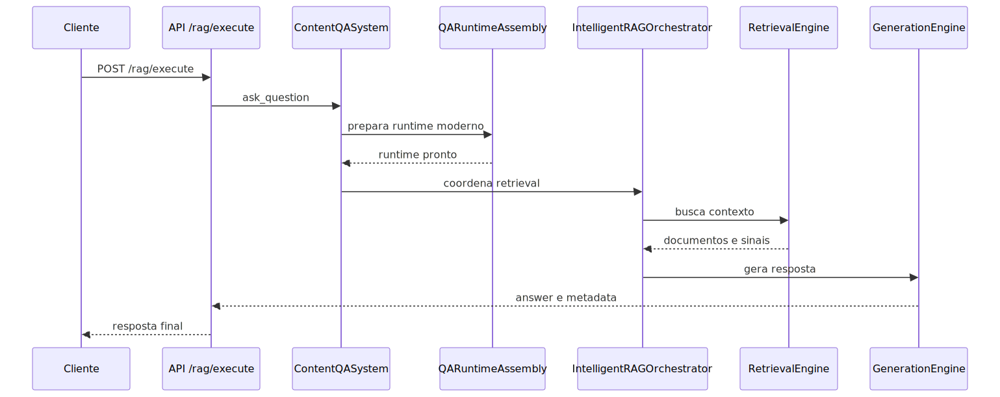

# Pipeline RAG

## 1. Visão geral

O RAG desta plataforma não foi desenhado como um chat que simplesmente busca alguns chunks e envia tudo ao modelo. O runtime atual separa preparação do contexto, análise da pergunta, escolha de estratégia de retrieval, recuperação de evidência e geração final.

Essa separação existe porque responder bem não depende apenas do modelo. Depende principalmente de entender que tipo de pergunta chegou, qual evidência é mais útil, que estratégia de recuperação faz sentido e como transformar essa evidência em uma resposta auditável.

## 2. O problema que este módulo resolve

O problema real do RAG corporativo não é “achar texto parecido”. É produzir resposta útil quando a pergunta pode exigir sinais vetoriais, texto exato, filtros de domínio, múltiplas consultas, reescrita controlada e geração final coerente com a evidência encontrada.

Se esse problema fosse tratado como uma única chamada simples, o sistema perderia capacidade de diagnóstico. Quando a resposta viesse ruim, ninguém saberia se a falha aconteceu na compreensão da pergunta, na recuperação do contexto ou na geração.

O runtime moderno tenta resolver isso separando essas responsabilidades em etapas observáveis.

## 3. Conceitos necessários para entender o módulo

### Retrieval

Retrieval é a etapa de recuperar evidência útil antes da geração. O ponto importante é que retrieval não é sinônimo de busca vetorial. Ele pode combinar sinais vetoriais, sinais lexicais e estratégias mais especializadas conforme o caso.

### Query analysis

Query analysis é a leitura da pergunta para extrair pistas sobre intenção, domínio, complexidade e tipo de dado esperado. Isso existe para impedir que todas as perguntas sejam tratadas como se fossem iguais.

### Query rewrite

Query rewrite é a reescrita controlada da pergunta antes do retrieval. O objetivo não é inventar uma nova intenção, mas limpar ruído e melhorar a chance de encontrar evidência relevante.

### Roteamento adaptativo

Roteamento adaptativo é a decisão de qual estratégia de retrieval usar. Ele existe porque JSON, texto livre, pergunta comparativa, consulta híbrida e recuperação estruturada não têm o mesmo comportamento ideal.

### Runtime moderno

Runtime moderno é a política arquitetural que exige um pipeline explícito e validado para o QA. O ganho é previsibilidade de execução. O trade-off é que o sistema prefere falhar cedo a voltar silenciosamente para um caminho antigo ou implícito.

### Geração aumentada por evidência

O LLM entra no final, quando já existe contexto recuperado. Isso muda a natureza da resposta. Em vez de um modelo “falando sozinho”, a plataforma tenta produzir texto apoiado em evidência encontrada no acervo.

## 4. Como o módulo funciona por dentro

O caminho de consulta entra pelo boundary HTTP do RAG. A API resolve autenticação, contexto e configuração. Depois disso, a pergunta entra no `ContentQASystem`, que funciona como fachada principal do domínio de QA.

Essa fachada não trata o RAG como um conjunto de utilidades soltas. Ela primeiro monta o estado de runtime e exige que o pipeline moderno esteja disponível. Para isso, delega ao `QARuntimeAssembly`, que valida pré-condições e seleciona a estratégia moderna adequada.

Com o runtime pronto, o sistema segue para a parte mais importante: entender a pergunta antes de tentar respondê-la. O runtime moderno analisa a consulta, decide se deve reescrevê-la, escolhe a estratégia de retrieval e então recupera evidência. Só depois entra a geração final.

O valor dessa arquitetura está no isolamento das decisões. Quando uma resposta sai ruim, a investigação pode perguntar: a pergunta foi mal interpretada? a evidência foi fraca? a estratégia de retrieval estava errada? a geração exagerou além da evidência?

## 5. Pipeline ou fluxo principal

### Etapa 1: entrada e contextualização

A pergunta entra pela API, que resolve identidade, permissão, correlation_id e configuração operacional do request. Essa etapa organiza contexto, não a resposta final.

### Etapa 2: montagem obrigatória do runtime moderno

O `ContentQASystem` exige que o runtime moderno seja montado de forma explícita. O `QARuntimeAssembly` valida o mínimo necessário e seleciona a estratégia de execução.

### Etapa 3: leitura da pergunta

Com o runtime pronto, o sistema tenta entender a pergunta. Essa etapa extrai sinais que influenciam todo o resto: complexidade, domínio, tipo de dado, necessidade de filtros e indícios de qual retrieval faz mais sentido.

### Etapa 4: reescrita controlada e roteamento

Quando a política do runtime permite, a pergunta pode ser reescrita para reduzir ruído e aumentar a precisão do retrieval. Em seguida, o roteamento adaptativo escolhe a família de estratégia mais adequada.

### Etapa 5: recuperação da evidência

O retrieval recupera documentos, trechos ou sinais relevantes. Dependendo do caso, a estratégia pode combinar modos diferentes de busca e fusão.

### Etapa 6: geração final

Com a evidência em mãos, o pipeline monta o contexto final e chama o LLM para produzir a resposta. A geração é o fechamento do fluxo, não o ponto de partida.

## 6. Decisões técnicas importantes

### Exigir runtime moderno

O projeto opta por não esconder um caminho antigo atrás de fallback implícito. O ganho é previsibilidade semântica. O trade-off é que o sistema bloqueia com mais clareza quando o ambiente ou o YAML não entregam o que o runtime moderno exige.

### Separar análise da pergunta de geração

Essa separação melhora a capacidade de diagnóstico. O ganho é saber em que parte a resposta se perdeu. O trade-off é um pipeline mais explícito e menos “mágico”.

### Tratar retrieval como estratégia, não como função única

O ganho é adaptar a busca ao tipo de pergunta. O trade-off é que o comportamento deixa de ser trivial para quem espera uma única busca sempre igual.

### Manter `ContentQASystem` como fachada

O ganho é centralizar a entrada do domínio e o resumo do runtime. O trade-off é que outras camadas precisam respeitar essa fachada em vez de acionar pedaços isolados do pipeline de forma dispersa.

## 7. O que acontece em caso de sucesso

No caminho feliz, a pergunta entra com contexto coerente, o runtime moderno é montado, a análise identifica a natureza da consulta, a estratégia de retrieval encontra evidência adequada e o modelo gera uma resposta compatível com esse contexto.

Para o usuário, sucesso é receber uma resposta útil. Para o operador, sucesso também significa conseguir explicar por que aquela estratégia foi escolhida e qual evidência sustentou a resposta.

## 8. O que acontece em caso de erro

### Erro antes do runtime moderno

Se o runtime moderno não pode ser montado, o problema está na configuração, no contexto mínimo ou na indisponibilidade de componentes exigidos pelo pipeline.

### Erro de entendimento da pergunta

Quando a pergunta é mal classificada, o sistema pode escolher uma estratégia inadequada de retrieval. O sintoma costuma ser resposta com evidência fraca ou deslocada, mesmo com acervo existente.

### Erro de retrieval

Quando a estratégia foi escolhida, mas a recuperação falha ou devolve material ruim, a geração final fica comprometida. Esse é o ponto em que uma resposta ruim não deve ser tratada automaticamente como problema de prompt.

### Erro de geração

Mesmo com evidência razoável, a geração ainda pode resumir mal, exagerar ou organizar mal a saída. Por isso a arquitetura mantém clara a separação entre evidência e geração.

## 9. Configurações que mudam o comportamento

As configurações relevantes do RAG, pelo código lido, pertencem a quatro grupos.

### Habilitação do runtime moderno

O runtime moderno depende do bloco de configuração do sistema RAG estar habilitado e coerente com a expectativa da montagem.

### Estratégia de execução

O assembly seleciona estratégias modernas como caminho básico, streaming ou paralelo conforme sinais do YAML e do contexto de execução.

### Política de análise e reescrita

A análise da pergunta e a reescrita controlada mudam como a plataforma decide buscar evidência. Isso altera diretamente a qualidade e o custo do retrieval.

### Estratégias de retrieval e cache

O comportamento do retrieval muda conforme políticas de busca, fusão e reaproveitamento de contexto. O importante é entender o efeito operacional dessas escolhas, não decorar uma lista de chaves.

## 10. Observabilidade e diagnóstico

A investigação do RAG fica melhor quando segue esta ordem.

1. Confirmar se o runtime moderno realmente subiu.
2. Verificar que estratégia foi selecionada.
3. Observar se a pergunta foi reescrita ou roteada de forma coerente.
4. Separar falha de retrieval de falha de geração.

Sinais úteis do código lido:

- `ContentQASystem` registra o resumo consolidado do runtime;
- `QARuntimeAssembly` registra estratégia ativa e falha cedo quando o pipeline moderno não pode operar;
- o domínio tenta manter a explicação de seleção de estratégia explícita.

## 11. Exemplo prático guiado

Imagine uma pergunta técnica enviada ao endpoint de RAG.

1. A API recebe a consulta e resolve contexto do usuário.
2. O `ContentQASystem` assume a execução do domínio.
3. O `QARuntimeAssembly` confirma que o runtime moderno está apto e escolhe a estratégia adequada.
4. A pergunta é analisada e, se fizer sentido, reescrita de forma controlada.
5. O retrieval recupera a evidência mais útil para aquele tipo de pergunta.
6. O LLM gera a resposta final usando esse contexto.

O ganho prático desse fluxo é que a plataforma consegue explicar melhor de onde veio a resposta e por que seguiu aquele caminho.

## 12. Explicação 101

Pense no RAG como um atendimento em duas etapas.

Primeiro, alguém tenta entender exatamente o que você quer saber e procura os documentos certos. Depois, outra etapa organiza esse material e escreve a resposta final.

Se essas duas coisas forem feitas ao mesmo tempo, fica muito difícil descobrir por que a resposta saiu ruim. Quando o sistema separa busca de geração, ele fica menos misterioso e mais investigável.

## 13. Limites e pegadinhas

- Busca vetorial sozinha não explica todo o comportamento do RAG.
- Resposta ruim nem sempre é problema do modelo; muitas vezes é problema de evidência ou estratégia.
- Runtime moderno habilitado não garante que toda pergunta terá boa recuperação; ele apenas torna a execução mais explícita.
- Aceitar uma consulta não significa que a plataforma já montou evidência suficiente para responder bem.
- Ler o endpoint não basta para entender a semântica do pipeline.

## 14. Evidências no código

- [src/qa_layer/content_qa_system.py](../src/qa_layer/content_qa_system.py): fachada principal do domínio de QA e resumo consolidado do runtime.
- [src/orchestrators/qa_runtime_assembly.py](../src/orchestrators/qa_runtime_assembly.py): montagem e seleção do runtime moderno.
- [src/api/routers/config_resolution.py](../src/api/routers/config_resolution.py): resolução compartilhada de configuração consumida pelos boundaries.
