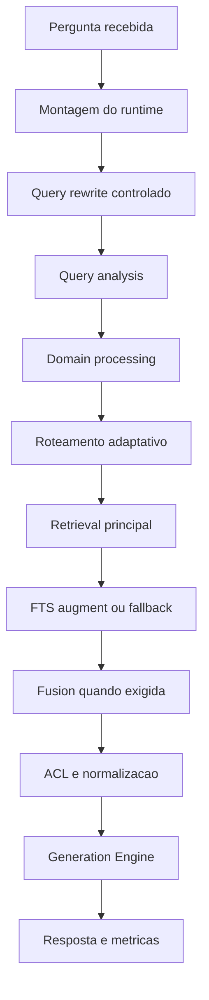
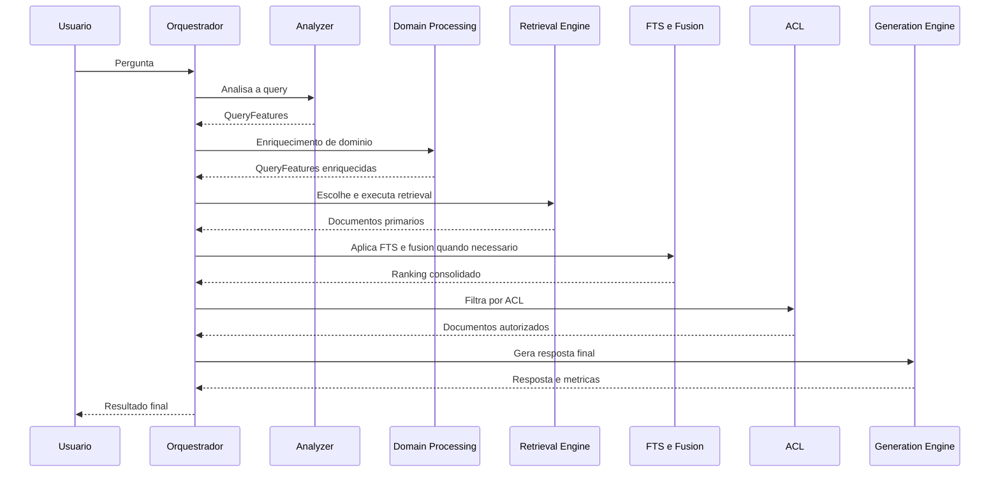

# Manual técnico, executivo, comercial e estratégico: Pipeline de RAG

## 1. O que é esta feature

O pipeline de RAG desta plataforma é a capacidade que recebe uma pergunta em linguagem natural, escolhe a melhor forma de procurar evidência no acervo e só depois pede ao modelo para redigir a resposta. O ponto central é que o sistema não trata RAG como “buscar alguns trechos e mandar para o LLM”. O runtime real separa entendimento da pergunta, expansão de domínio, roteamento, retrieval, enriquecimento lexical, fusão, controle de acesso e geração.

Na prática, isso transforma o RAG em um sistema operacional de consulta, e não em um atalho de prompt. A plataforma tenta responder com base em evidência recuperada pelo caminho mais adequado para cada tipo de pergunta: consulta ampla, pergunta comparativa, busca por termo técnico exato, pergunta com código normativo, pergunta com necessidade de filtro estruturado ou pergunta que precisa combinar mais de um tipo de sinal de busca.

## 2. Que problema ela resolve

Sem esse pipeline, a plataforma cairia em um erro comum de RAG corporativo: tratar perguntas muito diferentes com a mesma estratégia de recuperação. Isso parece simples no começo, mas degrada rapidamente quando o acervo contém documentos técnicos, códigos, siglas, nomes normativos, metadados estruturados e perguntas de naturezas distintas.

O pipeline resolve cinco dores reais.

- Evita que toda a qualidade dependa do modelo, deslocando o foco para a escolha correta da evidência.
- Separa entendimento, recuperação e geração, o que permite diagnosticar se uma resposta ruim nasceu do retrieval, da ACL, da configuração ou do LLM.
- Combina sinais semânticos e lexicais de forma controlada, em vez de confiar apenas em embeddings.
- Permite tratamento específico por domínio, sem contaminar o pipeline inteiro com regras hardcoded espalhadas.
- Mantém trilha operacional observável, com passos, motivos de decisão, modos de fallback e métricas de cada etapa.

## 3. Visão executiva

Para liderança, esta feature importa porque converte o RAG de uma capacidade “difícil de governar” em uma capacidade auditável. O ganho principal não é só melhorar respostas. O ganho é tornar o comportamento rastreável. Quando uma resposta sai ruim, o time consegue perguntar se o problema foi classificação da pergunta, baixa cobertura semântica, ausência de vocabulário BM25, FTS desativado, ACL restritiva ou contexto insuficiente na geração.

Isso reduz custo operacional e risco de decisão baseada em diagnóstico errado. Em vez de culpar o modelo genericamente, a operação passa a ter pontos claros para ajuste e investigação.

## 4. Visão comercial

Comercialmente, o valor suportado pelo código é este: a plataforma não apenas “conversa com documentos”. Ela entende a natureza da pergunta, escolhe a estratégia de recuperação adequada, combina busca semântica com busca textual quando necessário, respeita restrições de acesso e registra o caminho da resposta para suporte e auditoria.

Isso é relevante em vendas para clientes que lidam com acervo técnico, regulatório, operacional ou normativo. A dor deles não costuma ser ter um chat. A dor real costuma ser confiar que a resposta foi construída sobre evidência correta, inclusive quando a pergunta usa siglas, códigos, tabelas, nomes normativos ou filtros implícitos.

O que não deve ser prometido é infalibilidade. O pipeline melhora cobertura, precisão e rastreabilidade, mas continua dependente da qualidade do acervo, da qualidade da ingestão e da configuração do runtime.

## 5. Visão estratégica

Estrategicamente, o pipeline fortalece a plataforma em seis dimensões.

- Reforça a direção YAML-first, porque o comportamento do runtime depende de blocos canônicos de configuração.
- Mantém baixo acoplamento, separando query rewrite, query analysis, expansion step, retrieval engine, FTS, BM25, fusão, ACL e geração.
- Permite evolução incremental, porque novas estratégias entram como componentes especializados, sem exigir reescrever o orquestrador inteiro.
- Melhora governança, já que o pipeline registra o que decidiu e por quê.
- Abre caminho para domínios especializados, como o caso DNIT, sem obrigar o produto a usar o mesmo tratamento para todo acervo.
- Prepara a plataforma para cenários mais ricos de retrieval, inclusive hybrid nativo do vector store, expansão lexical por domínio e políticas mais sofisticadas de fusão.

## 6. Conceitos necessários para entender

### RAG

RAG significa recuperar evidência antes de gerar a resposta. O objetivo não é fazer o modelo “lembrar” do acervo, mas fazer o modelo responder com base em contexto obtido no runtime.

### Busca vetorial

Busca vetorial procura semelhança de significado. Ela é muito boa para consultas em que o usuário descreve um conceito sem usar exatamente os mesmos termos do documento. O limite é que ela pode perder sinais literais importantes, como códigos, siglas, números normativos ou expressões muito exatas.

### BM25

BM25 é uma estratégia lexical clássica de recuperação. Ela funciona muito bem para correspondência por termos exatos e frequência relevante, especialmente em cenários com códigos, siglas, nomes normativos e expressões técnicas compostas. No código deste projeto, BM25 não é um adereço teórico. Ele é tratado como parte explícita do retrieval híbrido.

### FTS

FTS significa Full-Text Search. Neste projeto, ele roda no PostgreSQL sobre a coluna fts_content da tabela de chunks, usando ranking textual nativo do banco. O papel dele é complementar ou socorrer a recuperação semântica, dependendo do modo configurado.

### Hybrid Search

Hybrid Search é a combinação de sinais diferentes de recuperação. Aqui isso significa, principalmente, combinar vetor, BM25 e, em certos momentos, FTS. O código também reconhece dois estilos de hybrid: manual, em que a própria aplicação combina retrievers, e nativo, em que o vector store oferece uma operação híbrida própria.

### Fusion

Fusion é a etapa que combina listas vindas de retrievers diferentes. Não é apenas “juntar tudo”. A fusão tenta equilibrar fontes com relevâncias diferentes, deduplicar resultados e aplicar pesos para evitar que uma fonte domine a outra de forma cega.

### Multi-Query

Multi-Query é a estratégia que gera múltiplas reformulações da mesma pergunta para ampliar a cobertura do retrieval. Isso ajuda quando uma única formulação do usuário não representa bem todos os caminhos pelos quais a evidência pode ser encontrada.

### Domain Processing

Domain Processing, no runtime real deste projeto, não é um bloco mágico. Ele aparece em três camadas concretas.

- Detecção de domínio e auto_detection_keywords no QueryAnalyzer.
- Expansão lexical de domínio via DomainQueryExpansionConfigService e etapas registradas no DomainQueryExpansionRuntimeRegistry.
- Self-query por domínio quando a consulta precisa usar metadados estruturados e filtros mais ricos.

Em outras palavras, processamento de domínio aqui significa ajudar o pipeline a falar a linguagem do acervo especializado antes de recuperar a evidência.

### Self-Query por domínio

Self-query é a tentativa de transformar a pergunta em filtros estruturados, especialmente úteis quando a resposta depende de atributos do documento, não apenas do texto livre. No contexto deste projeto, isso fica ligado ao módulo domain_specific_rag e ao resolvedor de self-query por domínio.

### Cache semântico

Cache semântico tenta reaproveitar resultados de perguntas semanticamente parecidas. O objetivo é reduzir latência e custo quando o sistema já viu uma consulta muito próxima.

### ACL no retrieval

ACL é o controle de acesso aplicado aos documentos recuperados. O pipeline não considera a busca concluída só porque encontrou conteúdo relevante. Antes da geração, ele ainda precisa confirmar que o contexto atual pode usar essa evidência.

## 7. Como a feature funciona por dentro

O fluxo começa quando o boundary de QA entrega a pergunta ao orquestrador inteligente. Esse orquestrador primeiro monta o runtime, aplica overrides de domínio, valida a presença do bloco mínimo do retriever moderno e inicializa os componentes necessários. Se a configuração obrigatória não existir, o pipeline falha cedo. Isso é proposital. O sistema prefere interromper com erro explícito a fingir que está operando com um RAG válido.

Depois da montagem do runtime, a consulta pode passar por query rewrite. Em seguida, o QueryAnalyzer produz um retrato estruturado da pergunta: domínio, tipo de consulta, tipo de dado, entidades, palavras-chave, termos técnicos, complexidade e sinais de contexto. Esse retrato pode ser enriquecido por uma etapa de expansão lexical de domínio. Só então o RetrievalEngine decide como recuperar.

Dependendo da decisão, o pipeline pode usar retrieval tradicional, hybrid manual, hybrid nativo, multi-query, self-query por domínio ou caminhos especializados. Após essa busca principal, o runtime ainda pode acionar FTS em modo de enriquecimento ou fallback. Se a política de fusão exigir, o sistema coleta resultados adicionais e roda o motor formal de HybridFusion. Por fim, aplica ACL, normaliza os documentos e entrega o conjunto final para a GenerationEngine.

O que isso muda na prática é simples: a plataforma não “chuta um retriever”. Ela passa por uma cadeia de decisões para escolher o tipo de evidência mais adequado à pergunta.

## 8. Divisão em etapas ou submódulos

### 8.1. Montagem do runtime e guardrails de configuração

Esta etapa existe para impedir que o pipeline rode em estado ambíguo. O orquestrador e o RetrievalEngine resolvem modo híbrido, configuração de FTS, cache semântico, blocos vetoriais obrigatórios, extração BM25 e configuração de domínio.

O que recebe: YAML, vector store, LLM e serviços opcionais.

O que faz: monta o runtime e falha cedo quando falta configuração estrutural importante.

O que entrega: pipeline pronto para inicialização lazy.

O que pode dar errado: ausência de rag_system.retriever.vector_store, vector store inconsistente ou LLM indisponível para etapas que dependem dele.

Como diagnosticar: procurar logs de montagem do runtime e falhas explícitas de configuração obrigatória.

Valor para o conjunto: reduz comportamento escondido e evita um RAG aparentemente ligado, mas tecnicamente inválido.

### 8.2. Query rewrite controlado

Esta etapa existe para melhorar a recuperabilidade da consulta antes do retrieval. O runtime usa configuração dedicada em qa_system.query_rewrite e só aplica a reescrita quando a política permite.

O que recebe: pergunta original e contexto adicional.

O que faz: corrige, parafraseia ou expande a pergunta de forma controlada.

O que entrega: query efetiva para as próximas etapas.

O que pode dar errado: LLM indisponível, erro de chamada ou reescrita considerada insegura.

Como diagnosticar: verificar os eventos do passo rag:query_rewrite e os motivos de aplicação ou rejeição.

Valor para o conjunto: melhora a busca sem liberar o pipeline para distorcer a intenção do usuário.

### 8.3. Query analysis

Esta etapa existe para produzir um retrato operacional da pergunta. O QueryAnalyzer extrai tipo de consulta, tipo de dado, domínio, entidades, keywords, technical_terms, context_hints, requisitos especiais e sinais de detecção automática por domínio.

O que recebe: query já limpa e contexto da conversa.

O que faz: transforma linguagem natural em sinais estruturados para decisão de retrieval.

O que entrega: QueryFeatures.

O que pode dar errado: exceção interna durante a análise.

Como diagnosticar: olhar telemetria do analisador, incluindo domínio detectado, confiança e quantidade de entidades extraídas.

Valor para o conjunto: impede que o roteamento trate consultas comparativas, estruturadas e técnicas como se fossem a mesma coisa.

### 8.4. Domain Processing

Esta etapa existe para adaptar a pergunta à linguagem real do domínio. No código lido, isso não é uma única classe. É uma família de mecanismos.

Primeiro, o QueryAnalyzer carrega auto_detection_keywords a partir de domain_specific_rag.domains e usa esses termos como sinal adicional para detectar domínio técnico. Depois, o RetrievalEngine integra o snapshot de vocabulário BM25 ao bloco domain_specific_rag por meio do DomainQueryExpansionConfigService. Isso mescla palavras de detecção, vocabulário de expansão e estatísticas operacionais dentro da configuração ativa. Por fim, quando existe etapa registrada e habilitada, o runtime cria um DomainQueryExpansionStep concreto, como DnitQueryExpansionStep.

O que recebe: QueryFeatures, configuração de domínio e snapshot BM25 ativo.

O que faz: enriquece technical_terms, keywords e context_hints com vocabulário do domínio.

O que entrega: uma pergunta semanticamente igual, mas lexicalmente mais útil para retrieval híbrido.

O que pode dar errado: vocabulário ausente, etapa desabilitada, confiança baixa de expansão ou domínio sem runtime registrado.

Como diagnosticar: verificar se o domínio foi detectado, se a etapa de expansão foi ativada e se expansion_metadata foi preenchido.

Valor para o conjunto: reduz a distância entre a linguagem do usuário e a linguagem do acervo especializado.

### 8.5. Roteamento adaptativo

Esta etapa existe para decidir qual processador usar. O RetrievalEngine e o roteador adaptativo observam QueryFeatures e produzem uma RoutingDecision com processador, estratégia, confiança, necessidade de fusão, necessidade de expansão e processador de fallback.

O que recebe: QueryFeatures já analisadas e, quando aplicável, enriquecidas por domínio.

O que faz: escolhe o tipo de retrieval mais adequado.

O que entrega: RoutingDecision.

O que pode dar errado: falha no motor de decisão ou falta de processador compatível.

Como diagnosticar: inspecionar rag:routing_decision, processor_type, retriever_strategy e fallback_processor.

Valor para o conjunto: substitui regra fixa por decisão contextualizada.

### 8.6. Retrieval tradicional

Este é o caminho padrão quando a pergunta não exige tratamento especial. O engine prioriza retrievers como vector_search, semantic_search ou default, conforme disponibilidade.

O que recebe: pergunta, top_k, filtros de metadados e decisão de routing.

O que faz: executa recuperação semântica principal.

O que entrega: primeira lista de documentos.

O que pode dar errado: retriever indisponível, poucos resultados ou baixa pontuação semântica.

Como diagnosticar: verificar retrieval_trace e scores retornados.

Valor para o conjunto: resolve bem perguntas amplas, conceituais e sem forte dependência de termo exato.

### 8.7. Hybrid Search

Hybrid Search existe porque muitas perguntas corporativas precisam de duas coisas ao mesmo tempo: semântica e literalidade. O código confirma dois modos.

- Modo manual: a aplicação usa um HybridRetriever e combina retrievers especializados por conta própria.
- Modo nativo: se rag_system.retriever.hybrid.search_type estiver como nativo e o vector store suportar supports_native_hybrid ou search_hybrid, o engine tenta executar hybrid diretamente no backend.

O que recebe: pergunta enriquecida, top_k, filtros e QueryFeatures.

O que faz: decide se vai usar hybrid nativo, hybrid manual ou fallback tradicional.

O que entrega: lista híbrida de documentos, já apta a passar por FTS e eventual deduplicação.

O que pode dar errado: hybrid desligado, vector store sem suporte nativo, hybrid retriever não registrado ou falha do hybrid nativo com fallback para manual.

Como diagnosticar: procurar logs que registram modo do hybrid, suporte nativo, sparse_query_used e motivo da decisão.

Valor para o conjunto: melhora recuperação em perguntas com significado amplo e termos exatos relevantes.

### 8.8. BM25

BM25 existe para lidar bem com o que a busca vetorial costuma tratar pior: códigos, siglas, identificadores e termos compostos exatos. O runtime faz duas coisas importantes com BM25.

Primeiro, ele integra um snapshot de vocabulário BM25 ligado ao alvo físico ativo do vector store. Isso depende de vectorstore_id válido, resolução do alvo físico e disponibilidade do vocabulário persistido. Segundo, ele pode instanciar um BM25Retriever para recuperação lexical direta.

O BM25Retriever tokeniza documentos, calcula scores com BM25Okapi, filtra por threshold e ainda passa os resultados por ActiveDocumentVersionGuard antes de devolvê-los.

O que recebe: documentos do corpus, metadados, query e configuração BM25.

O que faz: ranqueia por evidência lexical exata.

O que entrega: documentos com bm25_score e contexto de origem.

O que pode dar errado: BM25 desabilitado no YAML, vectorstore_id vazio, alvo físico não resolvido, vocabulário ausente ou cache Redis do vocabulário indisponível.

Como diagnosticar: usar logs com marcador BM25_PIPELINE e os metadados bm25_vocabulary_loaded e bm25_vocabulary_reason.

Valor para o conjunto: impede que consultas com forte dependência de literalidade fiquem reféns apenas da semântica.

### 8.9. Multi-Query

Multi-Query existe para ampliar a cobertura quando uma única formulação da pergunta é insuficiente. O MultiQueryRetriever pode gerar expansões semânticas, procedurais, contextuais, comparativas, técnicas ou mistas com apoio do LLM. Se já existir retriever pronto, o engine o usa. Se não existir, mas houver base_retriever vetorial e LLM, ele cria uma instância temporária. Se nada disso estiver disponível, faz fallback para retrieval tradicional.

O que recebe: pergunta, top_k e base retriever.

O que faz: gera múltiplas reformulações, consulta o retriever base com essas variações e deduplica a saída.

O que entrega: conjunto de documentos com cobertura mais ampla.

O que pode dar errado: MultiQuery indisponível, LLM ausente, falha nas expansões ou necessidade de fallback.

Como diagnosticar: observar o retriever_label multi_query ou multi_query_temp no retrieval_trace.

Valor para o conjunto: ajuda quando a evidência está espalhada por formulações diferentes do mesmo tema.

### 8.10. Self-query por domínio

Self-query existe para perguntas que pedem mais do que semântica textual. No módulo domain_specific_rag, o sistema detecta domínio, avalia complexidade e tenta usar filtros estruturados e schemas de metadados. Quando a self-query não produz resultado adequado, o caminho faz fallback sem duplicar a geração.

O que recebe: pergunta, domínio detectado, vector store, LLM e schemas de domínio.

O que faz: transforma a pergunta em busca mais estruturada.

O que entrega: documentos alinhados a filtros de metadados e restrições do domínio.

O que pode dar errado: domínio não detectado, domínio desabilitado, vector store ou LLM ausentes, ou ausência de metadados úteis para o caso.

Como diagnosticar: revisar análise de domínio e logs do resolvedor de self-query.

Valor para o conjunto: melhora precisão quando a pergunta depende de estrutura documental e não só de texto.

### 8.11. FTS no PostgreSQL

FTS existe para complementar a busca principal com um sinal lexical nativo do banco. O RetrievalEngine registra um FTSPostgresRetriever quando o bloco FTS está habilitado e pg_dsn está preenchido. O retriever consulta ingestion_document_chunks, usa plainto_tsquery, ordena por ts_rank_cd e aplica statement_timeout local por consulta.

O código confirma dois modos relevantes.

- augment: o FTS roda como enriquecimento sempre que o estágio é alcançado.
- fallback: o FTS só é acionado quando não houve documentos anteriores, quando a quantidade é menor do que fallback_min_results ou quando a pontuação semântica máxima ficou abaixo de semantic_score_threshold.

O que recebe: query final e configuração FTS.

O que faz: executa busca textual nativa no PostgreSQL e mescla os resultados com a lista atual.

O que entrega: documentos FTS normalizados e depois incorporados ao conjunto final.

O que pode dar errado: FTS desabilitado, DSN vazio, pool indisponível ou timeout do banco.

Como diagnosticar: olhar rag:fts, logs de registro do FTS Retriever e motivos trigger_not_met, disabled_by_yaml ou retriever_not_registered.

Valor para o conjunto: adiciona uma via lexical barata e governável para complementar ou salvar consultas em que a semântica veio fraca.

### 8.12. Fusion

Fusion existe porque, em alguns cenários, não basta usar só a lista principal. O RetrievalEngine pode coletar resultados adicionais de vector_search, bm25_search e hybrid_search e então passá-los ao motor formal de HybridFusion.

O HybridFusion aceita algoritmos explícitos como linear, RRF, weighted_rrf, interleaved e score_normalized. No fluxo lido, a configuração efetiva prioriza weighted_rrf, com pesos separados por retriever. A engine estrutura os resultados, deduplica, aplica o algoritmo e devolve uma lista com fusion_score.

O que recebe: múltiplas listas de retrievers e configuração de fusão.

O que faz: combina rankings, deduplica documentos e controla pesos por fonte.

O que entrega: ranking final mais equilibrado.

O que pode dar errado: falha na coleta de fontes, pesos inconsistentes ou ausência de resultados úteis para fundir.

Como diagnosticar: procurar logs HYBRID_FUSION, contagem por fonte e métricas structure_ms, dedup_ms e algorithm_ms.

Valor para o conjunto: aumenta cobertura sem abandonar ordenação controlada.

### 8.13. ACL e normalização final

Esta etapa existe para impedir que a resposta use documentos que o contexto atual não deveria ver. A lista recuperada é filtrada antes da geração.

O que recebe: documentos já recuperados e contexto de acesso.

O que faz: remove documentos proibidos e normaliza a saída.

O que entrega: conjunto final autorizado.

O que pode dar errado: ACL restritiva demais, deixando contexto insuficiente.

Como diagnosticar: comparar documentos antes e depois de rag:access_control.

Valor para o conjunto: garante governança da evidência, não apenas relevância.

### 8.14. Generation Engine

Esta etapa existe para transformar documentos autorizados em resposta. A GenerationEngine monta contexto, renderiza o prompt de sistema, chama o LLM com retry para recurso externo e contabiliza métricas de consumo.

O que recebe: pergunta, documentos finais, contexto do usuário e sinais do pipeline.

O que faz: monta o contexto final e gera a resposta.

O que entrega: texto final e metadados operacionais.

O que pode dar errado: LLM ausente, indisponibilidade externa ou falha na montagem do contexto.

Como diagnosticar: revisar generation:assemble_context, generation:render_prompt e generation:llm_call.

Valor para o conjunto: só responde depois que a evidência foi consolidada.

## 9. Pipeline principal de ponta a ponta

O diagrama mostra a lógica real do runtime. O ponto importante é que Hybrid Search, BM25, FTS, Multi-Query e Domain Processing não são features soltas. Eles entram no meio do pipeline para influenciar a qualidade da evidência antes da geração.

### Passo 1. Entrada e parâmetros operacionais

O pipeline recebe a pergunta, top_k, filtros de metadados, contexto adicional e, quando houver, contexto de ACL. Consulta vazia é rejeitada cedo.

### Passo 2. Montagem do runtime

O orquestrador confirma que o bloco vetorial obrigatório existe, resolve hybrid_search_mode, configuração FTS, cache semântico, domínio e componentes auxiliares.

### Passo 3. Query rewrite

Se habilitado, o sistema tenta melhorar a recuperabilidade da pergunta. Se a política não aprovar a reescrita, a pergunta original segue intacta.

### Passo 4. Query analysis

O QueryAnalyzer identifica tipo de pergunta, domínio, entidades, technical_terms e sinais especiais para o roteamento.

### Passo 5. Domain processing

Se houver domínio registrado e vocabulário disponível, a pergunta é enriquecida com termos do domínio. No caso DNIT, isso pode adicionar normas, aliases, frases exatas, hints de tabela e termos técnicos.

### Passo 6. Roteamento

O runtime produz uma RoutingDecision dizendo qual processador usar e se a consulta pede fusão, fallback ou expansão.

### Passo 7. Retrieval principal

O engine executa retrieval tradicional, hybrid, multi-query, self-query ou caminho especializado, conforme a decisão.

### Passo 8. FTS

Se o bloco estiver habilitado e o gatilho do modo permitir, o runtime roda FTS em augment ou fallback e mescla os resultados com a lista atual.

### Passo 9. Fusion

Se a decisão exigir ou a política do fluxo solicitar, o runtime coleta resultados adicionais e usa HybridFusion para recombinar rankings.

### Passo 10. ACL

Os documentos recuperados passam por filtragem de acesso antes de qualquer geração.

### Passo 11. Geração

Só depois de consolidar a evidência o sistema monta o contexto final e chama o LLM.

## 10. Decisões técnicas e trade-offs

### Falhar cedo quando falta configuração vetorial

Ganho: evita um RAG em estado parcialmente configurado.

Custo: obriga disciplina no YAML.

Risco mitigado: respostas ruins difíceis de explicar por pipeline mal montado.

### Separar domain processing de retrieval puro

Ganho: o pipeline consegue adaptar a linguagem da pergunta ao domínio sem misturar isso com a lógica básica de busca.

Custo: mais componentes e mais estados intermediários.

Risco mitigado: perguntas técnicas mal traduzidas para o vocabulário do acervo.

### Manter BM25 como componente explícito

Ganho: melhora muito perguntas com códigos, siglas e literalidade forte.

Custo: exige gerenciar vocabulário, alvo físico ativo e materialização do corpus.

Risco mitigado: falsos negativos da busca semântica.

### Ter FTS em modo augment e fallback

Ganho: flexibilidade operacional. No modo augment, o sistema sempre enriquece. No modo fallback, só paga esse custo quando a busca principal veio fraca.

Custo: mais tuning operacional.

Risco mitigado: consultas com baixa cobertura semântica ou retorno insuficiente.

### Suportar hybrid manual e hybrid nativo

Ganho: o produto pode aproveitar capacidade nativa do backend quando existir, sem perder a opção manual.

Custo: coexistência de dois estilos de operação.

Risco mitigado: acoplamento a uma única implementação de vector store.

### Usar fusão formal em vez de simples concatenação

Ganho: combinação mais justa entre fontes diferentes.

Custo: mais processamento e mais tuning de pesos.

Risco mitigado: uma fonte dominar o ranking sem merecer.

## 11. Configurações que mudam o comportamento

### rag_system.retriever.vector_store

Controla o bloco vetorial obrigatório do retriever moderno. Se esta seção estiver ausente ou vazia, o runtime falha explicitamente. Valor padrão não confirmado no código lido.

### rag_system.retriever.hybrid.search_type

Controla o modo de Hybrid Search. O código lido reconhece, no mínimo, os modos manual, nativo e desligado. Quando o valor é inválido, o engine cai para manual.

### rag_system.retriever.fts

Controla habilitação do FTS, modo, DSN, schema, tabela, top_k, statement_timeout, tamanho do pool e parâmetros de gatilho para fallback. O modo default inferido no RetrievalEngine é augment.

### configuração moderna de extração BM25

Controla se BM25 está habilitado, se há extração de keywords, bucketização e integração do vocabulário persistido. Se BM25 estiver desligado, o pipeline continua apenas com vector search. Alguns valores padrão específicos não foram confirmados no código lido desta rodada.

### qa_system.query_rewrite

Controla habilitação e política de reescrita. O runtime só usa reescrita quando a configuração e o LLM permitem.

### intelligent_pipeline

Controla a habilitação do pipeline inteligente, tempo máximo total, logging de decisões e políticas gerais de fallback.

### domain_specific_rag

Controla domínios ativos, auto_detection_keywords, query_expansion, bm25_detection, vocabulário específico e self-query por domínio.

### rag_system.retriever.caching

Controla o cache semântico. O efeito prático é reduzir custo e latência para consultas semanticamente próximas, quando o retriever é compatível.

## 12. Contratos, entradas e saídas

Na entrada, o pipeline trabalha principalmente com:

- pergunta do usuário;
- top_k operacional;
- filtros de metadados;
- contexto adicional;
- contexto de ACL;
- YAML já resolvido para a sessão.

Invariantes confirmadas no código lido:

- query vazia não deve seguir o fluxo normal;
- rag_system.retriever.vector_store precisa existir para o runtime moderno;
- FTS só roda se estiver habilitado e com pg_dsn preenchido;
- BM25 habilitado exige vectorstore_id válido e vocabulário resolvível;
- generation depende de LLM disponível.

Na saída, o pipeline devolve um resultado composto por:

- resposta textual;
- documentos utilizados;
- métricas do pipeline;
- retrieval_trace;
- resumo de ACL;
- metadados de geração e, quando aplicável, uso de tokens.

## 13. O que acontece em caso de sucesso

No caminho feliz, a pergunta passa por análise suficiente para escolher a estratégia correta. Se o domínio for reconhecido, a consulta é enriquecida com vocabulário útil. O retrieval principal encontra evidência, o FTS pode complementar, a fusão pode reequilibrar as listas, a ACL mantém apenas documentos autorizados e a geração recebe contexto consolidado.

Para o usuário, sucesso significa receber resposta coerente com o acervo. Para operação, sucesso significa conseguir ver qual processador rodou, quais retrievers participaram, se houve FTS, se houve fusão, quantos documentos sobreviveram à ACL e quanto tempo cada etapa consumiu.

## 14. O que acontece em caso de erro

### Falta de configuração vetorial obrigatória

O runtime falha cedo. Isso impede um fluxo silenciosamente degradado.

### BM25 habilitado sem vocabulário ou alvo físico resolvido

O RetrievalEngine registra o motivo e trata isso como falha operacional relevante. Esse ponto não deve ser mascarado, porque compromete a promessa do retrieval híbrido lexical.

### FTS habilitado sem pg_dsn

O componente é ignorado e o pipeline segue sem FTS. Isso é diferente de uma falha catastrófica, mas precisa ser visível em log.

### Hybrid nativo indisponível ou com erro

O engine tenta fallback para hybrid manual ou retrieval tradicional, conforme o caso.

### Multi-Query indisponível

O sistema usa retriever temporário quando possível; se não for possível, faz fallback para o caminho tradicional.

### Self-query por domínio indisponível

O pipeline recua para retrieval semântico tradicional, em vez de bloquear a consulta inteira.

### Timeout ou falha do FTS

FTS retorna vazio ou é ignorado, dependendo do tipo de erro, evitando derrubar toda a consulta quando o componente lexical auxiliar falha.

### Falha na geração

Se o LLM estiver ausente ou a chamada externa falhar mesmo após retry, a resposta final não é produzida e o erro é exposto explicitamente.

## 15. Observabilidade e diagnóstico

O pipeline foi instrumentado para contar a história da consulta. A ordem mais útil de investigação é esta.

1. Confirmar se o pipeline inteligente estava habilitado.
2. Confirmar se o runtime montou vector search, BM25, hybrid e FTS.
3. Verificar se houve query rewrite e se ele foi aplicado ou rejeitado.
4. Inspecionar o domínio detectado e as QueryFeatures.
5. Verificar a RoutingDecision.
6. Ler o retrieval_trace para saber quais retrievers realmente rodaram.
7. Verificar se o FTS foi acionado em augment ou fallback.
8. Confirmar se houve HYBRID_FUSION e com quais fontes.
9. Comparar documentos antes e depois da ACL.
10. Só então analisar geração.

Sinais de diagnóstico especialmente úteis no código lido:

- rag:query_rewrite
- rag:routing_decision
- rag:fts
- retrieval_trace
- BM25_PIPELINE
- HYBRID_FUSION
- generation:assemble_context
- generation:llm_call

## 16. Impacto técnico

Tecnicamente, esta feature encapsula uma complexidade que seria perigosa se estivesse espalhada por handlers, endpoints e helpers genéricos. Ela reforça separação de responsabilidades, cria pontos claros de observabilidade e reduz o risco de um RAG monolítico em que ninguém sabe onde a qualidade realmente nasce.

Também melhora evolutividade. O time consegue ajustar FTS, BM25, domain processing, multi-query ou fusão sem reescrever a geração inteira.

## 17. Impacto executivo

Para liderança, o impacto mais importante é previsibilidade operacional. O pipeline reduz o risco de decisões baseadas em respostas fracas sem explicação, reduz o tempo de diagnóstico em incidentes e melhora a governança sobre como o produto realmente responde perguntas críticas.

Em termos práticos, isso reduz retrabalho de suporte, tuning cego de prompt e discussões improdutivas sobre “a IA errou” quando o defeito real estava antes do LLM.

## 18. Impacto comercial

Para comercial e pré-venda, esta feature sustenta uma mensagem forte e concreta.

- A plataforma entende a pergunta antes de buscar.
- Ela não depende de um único tipo de busca.
- Ela combina sinais semânticos e textuais quando o caso exige.
- Ela respeita governança de acesso.
- Ela registra o caminho percorrido pela resposta.

Isso é especialmente útil para clientes com acervos normativos, técnicos, jurídicos, operacionais ou regulatórios. A promessa correta não é “responder tudo”. A promessa correta é “responder com estratégia de evidência mais governável”.

## 19. Impacto estratégico

Estratégicamente, o pipeline prepara a plataforma para crescer de forma limpa. Ele já está organizado para suportar domínios especializados, vocabulários próprios, hybrid nativo por backend, enriquecimento lexical por banco e novas estratégias de decisão. Isso fortalece a visão de plataforma YAML-first e reduz dependência de hacks locais para cada caso de uso novo.

## 20. Exemplos práticos guiados

### Exemplo 1. Pergunta com código normativo exato

Cenário: o usuário pergunta por uma norma específica usando código e sigla.

Entrada: uma pergunta contendo código, sigla e nome técnico do documento.

Processamento: QueryAnalyzer detecta sinais técnicos; BM25 e hybrid ganham relevância; FTS pode ser acionado para complementar a literalidade.

Saída: lista de documentos em que a chance de encontrar a referência literal correta é maior.

Impacto para o usuário: menos risco de perder o documento certo por depender só do embedding.

Impacto para operação: mais clareza ao investigar se o problema foi semântico ou lexical.

### Exemplo 2. Pergunta comparativa ampla

Cenário: o usuário quer comparar procedimentos, regras ou opções.

Entrada: pergunta comparativa com vários eixos.

Processamento: análise detecta maior complexidade; multi-query pode ser escolhido; a fusão ajuda a recombinar listas vindas de reformulações diferentes.

Saída: contexto mais amplo e mais equilibrado.

Impacto para o usuário: maior cobertura para perguntas que não cabem em um único trecho.

Impacto para operação: o retrieval_trace ajuda a ver se a cobertura veio de multi-query ou de um retriever específico.

### Exemplo 3. Pergunta de domínio DNIT

Cenário: a pergunta usa linguagem técnica do domínio, mas não usa todos os termos esperados pelo acervo.

Entrada: consulta técnica com sinais do domínio.

Processamento: auto_detection_keywords ajudam a detectar o domínio; DnitQueryExpansionStep adiciona technical_terms e hints; isso melhora hybrid e BM25.

Saída: recuperação mais alinhada ao vocabulário real das normas e tabelas do domínio.

Impacto para o usuário: menos risco de resposta superficial por desencontro de vocabulário.

Impacto para operação: dá para verificar se a expansão de domínio realmente ocorreu.

### Exemplo 4. Busca semântica fraca com FTS em fallback

Cenário: o retriever principal retorna poucos documentos ou scores baixos.

Entrada: pergunta com redação atípica ou altamente literal.

Processamento: o gatilho de fallback do FTS detecta baixa cobertura semântica e aciona o PostgreSQL full-text search.

Saída: novos chunks textuais entram na lista final.

Impacto para o usuário: mais chance de recuperar conteúdo útil mesmo quando a semântica falhou.

Impacto para operação: o log rag:fts mostra claramente que o FTS entrou como socorro, não como caminho primário.

### Exemplo 5. Resposta enfraquecida pela ACL

Cenário: o retrieval encontra documentos bons, mas o contexto atual não pode usar parte deles.

Entrada: pergunta válida com contexto de acesso restrito.

Processamento: retrieval funciona; ACL remove parte dos documentos.

Saída: resposta mais limitada do que a relevância técnica original sugeria.

Impacto para o usuário: a resposta pode parecer mais pobre.

Impacto para operação: a investigação correta é ACL, não prompt.

## 21. Explicação 101

Pense neste pipeline como uma equipe especializada em vez de uma pessoa só.

Uma parte entende a pergunta. Outra traduz a pergunta para a linguagem do domínio. Outra decide onde vale procurar. Outra faz a busca usando o tipo certo de ferramenta. Outra confere se os documentos encontrados podem mesmo ser usados. Só no final alguém redige a resposta.

Se tudo isso fosse feito de uma vez, o sistema até poderia responder, mas seria muito mais difícil saber por que acertou ou por que errou. O desenho atual existe para tornar o RAG menos misterioso e mais controlável.

## 22. Limites e pegadinhas

- Busca vetorial não garante recuperar um código exato.
- BM25 melhora literalidade, mas não entende sozinho o sentido completo da pergunta.
- FTS ajuda muito em texto exato, mas não substitui semântica.
- Domain processing melhora vocabulário, mas não cria evidência inexistente.
- Hybrid Search não significa usar todas as fontes sempre.
- Fusão melhora equilíbrio, mas não conserta corpus ruim.
- ACL pode enfraquecer a resposta mesmo quando a busca encontrou documentos bons.
- Configuração sintaticamente válida não significa tuning adequado.

## 23. Troubleshooting

### Sintoma: pergunta com código exato retorna documentos genéricos

Causa provável: BM25 ausente, vocabulário não integrado ou hybrid caindo para um caminho muito semântico.

Como confirmar: verificar bm25_vocabulary_loaded, BM25_PIPELINE e decisão do hybrid.

Ação recomendada: revisar a configuração BM25 e confirmar se o vectorstore_id ativo resolve um vocabulário persistido.

### Sintoma: FTS nunca aparece no fluxo

Causa provável: FTS desabilitado, pg_dsn vazio, retriever não registrado ou gatilho de fallback nunca satisfeito.

Como confirmar: olhar rag:fts e os motivos disabled_by_yaml, retriever_not_registered ou trigger_not_met.

Ação recomendada: revisar bloco FTS e modo configurado.

### Sintoma: domínio técnico parece não influenciar a busca

Causa provável: auto_detection_keywords não carregadas, query_expansion desabilitada ou domínio sem runtime registrado.

Como confirmar: verificar domínio detectado, etapa de expansão ativada e expansion_metadata.

Ação recomendada: revisar domain_specific_rag.domains e o vocabulário integrado.

### Sintoma: hybrid nativo nunca é usado

Causa provável: search_type não está em nativo ou o vector store não implementa supports_native_hybrid ou search_hybrid.

Como confirmar: verificar logs de decisao de hybrid no RAG.

Ação recomendada: alinhar configuração e capacidade real do backend vetorial.

### Sintoma: poucos documentos chegam à geração

Causa provável: top_k baixo, recuperação fraca, FTS não acionado ou ACL removendo demais.

Como confirmar: comparar retrieval_trace, rag:fts e rag:access_control.

Ação recomendada: separar claramente se o gargalo está no retrieval ou na ACL antes de ajustar prompts.

## 24. Diagramas

Este diagrama mostra a ordem lógica de responsabilidade. A parte crítica é perceber que BM25, FTS, Multi-Query e Fusion não ficam depois da geração. Eles existem para melhorar a evidência antes da resposta.

## 25. Mapa de navegação conceitual

- Camada de entendimento: query rewrite e query analysis.
- Camada de adaptação ao acervo: domain processing e self-query por domínio.
- Camada de recuperação: vector search, BM25, hybrid e multi-query.
- Camada de reforço lexical: FTS no PostgreSQL.
- Camada de consolidação: fusion e deduplicação.
- Camada de governança: ACL.
- Camada de saída: Generation Engine.

Esse mapa ajuda a entender a arquitetura por responsabilidade, sem depender de decorar arquivos.

## 26. Como colocar para funcionar

Pelo código lido, a feature depende destes pré-requisitos operacionais.

- YAML com bloco vetorial moderno preenchido.
- Vector store disponível.
- LLM disponível para geração e, se habilitado, para query rewrite e multi-query.
- Configuração de domínio coerente se houver domain processing especializado.
- pg_dsn preenchido se FTS estiver habilitado.
- Vocabulário BM25 persistido e resolvível para o alvo físico ativo se BM25 estiver habilitado.

Sinais práticos de que funcionou:

- routing_decision foi produzida;
- pelo menos um retriever foi executado;
- rag:fts mostra se houve enriquecimento ou não;
- HYBRID_FUSION aparece quando houve fusão formal;
- ACL registrou quantos documentos sobreviveram;
- geração final ocorreu com resposta e métricas.

Caminho de comando operacional ponta a ponta não foi confirmado no código e configuração lidos nesta rodada.

## 27. Exercícios guiados

### Exercício 1. Entender quando BM25 importa

Objetivo: diferenciar pergunta semântica de pergunta lexical.

Passos:

1. Pense em uma pergunta ampla e em outra com código normativo exato.
2. Identifique qual delas depende mais de literalidade.
3. Relacione isso ao papel do BM25 no pipeline.

O que observar: BM25 existe para perguntas em que o termo literal carrega parte importante da relevância.

Resposta esperada: a consulta com código exato tende a precisar mais de BM25 e hybrid.

### Exercício 2. Entender quando FTS entra como fallback

Objetivo: saber quando o PostgreSQL full-text search é acionado.

Passos:

1. Considere um cenário em que a busca semântica voltou vazia.
2. Considere outro em que voltou com poucos resultados.
3. Considere um terceiro em que os scores vieram baixos.

O que observar: no modo fallback, qualquer um desses cenários pode disparar FTS.

Resposta esperada: FTS em fallback entra quando a busca principal não atinge cobertura mínima.

### Exercício 3. Entender domain processing

Objetivo: separar domain processing de self-query.

Passos:

1. Liste mentalmente como o domínio pode influenciar a query antes do retrieval.
2. Liste como o domínio pode influenciar a busca por filtros estruturados.

O que observar: expansão lexical e self-query resolvem problemas diferentes.

Resposta esperada: domain processing lexical melhora a linguagem da pergunta; self-query tenta estruturar a busca.

## 28. Checklist de entendimento

- Entendi o que esta feature faz e por que ela não é só uma chamada ao LLM.
- Entendi por que o pipeline separa entendimento, retrieval e geração.
- Entendi o papel de BM25.
- Entendi o papel de FTS.
- Entendi a diferença entre hybrid manual e hybrid nativo.
- Entendi para que serve Multi-Query.
- Entendi o que significa Domain Processing neste projeto.
- Entendi como a fusão híbrida combina listas diferentes.
- Entendi por que a ACL fica antes da geração.
- Entendi o que acontece em sucesso.
- Entendi o que acontece em erro.
- Entendi como diagnosticar o pipeline.
- Entendi o valor técnico, executivo, comercial e estratégico desta feature.

## 29. Evidências no código

- src/qa_layer/rag_engine/intelligent_orchestrator.py
  - Motivo da leitura: confirmar a ordem macro do pipeline, inicialização dos componentes e integração entre retrieval e geração.
  - Símbolos relevantes: IntelligentRAGOrchestrator, _setup_retrievers, _build_query_expansion_step.
  - Comportamento confirmado: o orquestrador monta o runtime, chama retrieval e só depois gera a resposta.

- src/qa_layer/rag_engine/retrieval_engine.py
  - Motivo da leitura: confirmar o ponto central em que hybrid, BM25, FTS, multi-query, fusion e fallback entram na execução.
  - Símbolos relevantes: _resolve_hybrid_search_mode, merge_bm25_vocabulary_config, setup_fts_retriever, execute_hybrid_processor, execute_multi_query_processor, apply_fusion_processing, _maybe_enrich_with_fts.
  - Comportamento confirmado: o RetrievalEngine decide processador, integra vocabulário BM25, registra FTS, executa hybrid manual ou nativo, aplica FTS e chama HybridFusion quando necessário.

- src/qa_layer/rag_engine/query_analyzer.py
  - Motivo da leitura: confirmar os sinais estruturados usados para detecção de domínio e roteamento.
  - Símbolos relevantes: QueryAnalyzer, _load_auto_detection_keywords, _extract_keywords.
  - Comportamento confirmado: o analisador carrega auto_detection_keywords do bloco domain_specific_rag e os usa como sinal de domínio técnico.

- src/qa_layer/rag_engine/domain_query_expansion_config_service.py
  - Motivo da leitura: confirmar como o snapshot BM25 é incorporado à configuração de domínio.
  - Símbolos relevantes: apply_vocabulary, ensure_vocabulary_defaults, build_query_expansion_step.
  - Comportamento confirmado: o serviço mescla vocabulário e constrói a etapa registrada de expansão quando habilitada.

- src/qa_layer/rag_engine/domain_query_expansion_registry.py
  - Motivo da leitura: confirmar quais domínios têm runtime de expansão registrado.
  - Símbolo relevante: DomainQueryExpansionRuntimeRegistry.
  - Comportamento confirmado: o domínio dnit possui adapter de vocabulário BM25 e etapa de expansão própria.

- src/qa_layer/rag_engine/dnit_query_expansion.py
  - Motivo da leitura: confirmar o comportamento concreto da expansão lexical do domínio DNIT.
  - Símbolo relevante: DnitQueryExpansionStep.
  - Comportamento confirmado: a etapa adiciona technical_terms, keywords, hints e metadados de expansão quando a confiança mínima é atendida.

- src/qa_layer/rag_engine/bm25_retriever.py
  - Motivo da leitura: confirmar o papel do BM25 como retriever lexical real.
  - Símbolo relevante: BM25Retriever.retrieve.
  - Comportamento confirmado: o componente tokeniza, calcula scores BM25, filtra por threshold e devolve documentos com bm25_score.

- src/qa_layer/rag_engine/fts_postgres_retriever.py
  - Motivo da leitura: confirmar a implementação real do FTS no PostgreSQL.
  - Símbolo relevante: FTSPostgresRetriever.search.
  - Comportamento confirmado: o componente consulta ingestion_document_chunks com plainto_tsquery e ordena por ts_rank_cd.

- src/qa_layer/rag_engine/fusion_algorithms.py
  - Motivo da leitura: confirmar os algoritmos e a responsabilidade da fusão formal.
  - Símbolos relevantes: FusionAlgorithm, FusionConfig, HybridFusion.fuse_results.
  - Comportamento confirmado: a fusão estrutura resultados, deduplica, aplica algoritmo configurado e devolve ranking consolidado.

- src/qa_layer/domain_specific_rag/domain_specific_rag.py
  - Motivo da leitura: confirmar o papel da self-query por domínio.
  - Símbolos relevantes: DomainQueryAnalyzer, DomainSelfQueryResolver.
  - Comportamento confirmado: o domínio também pode influenciar retrieval por filtros estruturados, não apenas por expansão lexical.
