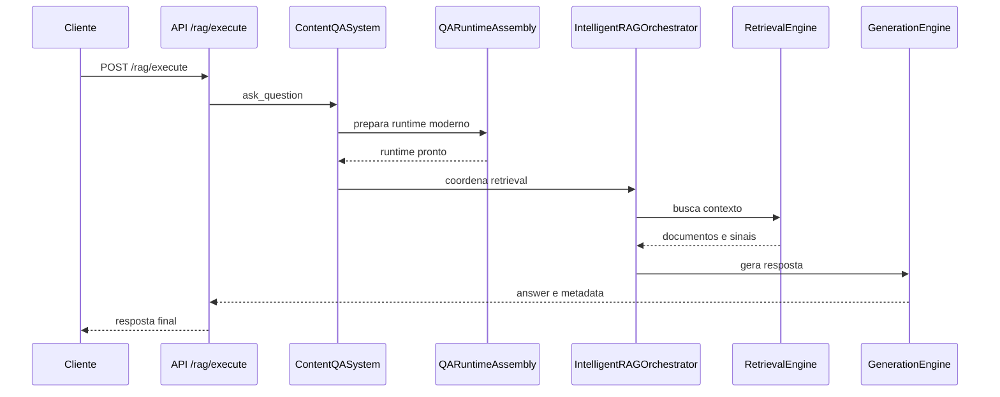
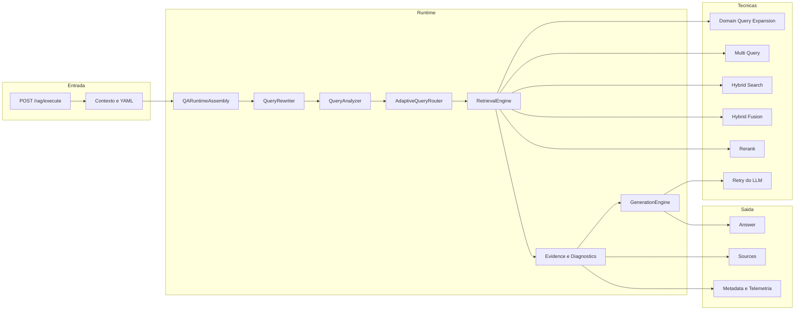

# Pipeline RAG

Este documento cobre o caminho atual de pergunta e resposta do RAG.
O foco é mostrar o boundary HTTP real, a montagem obrigatória do
runtime moderno e os pontos práticos de depuração.

## Entry point principal

O boundary público principal do RAG fica em POST /rag/execute.
Esse dispatcher unificado aceita operações diferentes e, no caso de
consulta, roteia para o fluxo de pergunta.

Em linguagem simples: a entrada pública principal não é uma rota ask
isolada. O contrato principal observado no código é /rag/execute.

## Escopo deste documento

Este documento é o dono do pipeline moderno de consulta.
Ele cobre a montagem do runtime de QA, a análise da pergunta, o
retrieval, os caches, a fusão e a geração da resposta.

Para evitar sobreposição com outros documentos:

- README-ARQUITETURA.md cobre a topologia macro da plataforma e a
    separação entre API, worker e scheduler;
- README-INGESTAO.md cobre como o acervo documental é produzido e
    indexado;
- README-ETL.md cobre o domínio ETL assíncrono.
- tutorial-101-processo-completo-de-ingestao-e-rag.md junta produção do
    acervo e consulta em uma narrativa única, do request ao efeito final.

Em linguagem simples: aqui a pergunta já chegou ao sistema e o foco é
como a resposta é construída, não como o acervo foi carregado.

## Leitura relacionada

- Visão macro da plataforma: [README-ARQUITETURA.md](./README-ARQUITETURA.md)
- Produção e indexação do acervo: [README-INGESTAO.md](./README-INGESTAO.md)
- Fluxo completo guiado de ingestão até resposta: [tutorial-101-processo-completo-de-ingestao-e-rag.md](./tutorial-101-processo-completo-de-ingestao-e-rag.md)
- Pipeline combinado de ingestão e RAG: [PIPELINE-INGESTAO-RAG.md](./PIPELINE-INGESTAO-RAG.md)
- Cache e comportamento de runtime: [README-CACHING.md](./README-CACHING.md)
- Versão didática 101 deste assunto: [tutorial-101-rag.md](./tutorial-101-rag.md)

## Componentes centrais

### rag_router

Recebe a requisição, aplica autenticação, permissão, rate limit e
entrega a operação ao slice compatível do runtime.

### ContentQASystem

É a fachada principal do QA.
Ele força a visão de pipeline moderno e registra o resumo consolidado
do runtime antes da consulta.

### QARuntimeAssembly

Monta o pipeline moderno obrigatório.
Se o runtime moderno não puder ser ativado, ele falha fechado com
ModernPipelineUnavailableError.

### IntelligentRAGOrchestrator

Coordena a recuperação inteligente e integra sinais adicionais do
runtime.

### RetrievalEngine

Executa a busca de contexto.
No código atual, ele expõe processadores dedicados para:

- JSON;
- hybrid;
- native hybrid;
- self query;
- multi query;
- tradicional;
- fallback.

### GenerationEngine

Produz a resposta final depois da recuperação de contexto.

## Fluxo ponta a ponta

1. O cliente chama POST /rag/execute.
2. O router resolve autenticação, correlation_id e configuração.
3. O fluxo de pergunta entra no ContentQASystem.
4. QARuntimeAssembly garante o runtime moderno.
5. IntelligentRAGOrchestrator coordena a estratégia.
6. RetrievalEngine recupera o contexto.
7. GenerationEngine monta a resposta final.



## Mapa rápido das etapas internas do pipeline moderno

<!-- markdownlint-disable MD013 -->
| Etapa | O que ela faz na prática | Arquivos principais |
| --- | --- | --- |
| 1. Boundary e contexto | recebe a pergunta, resolve YAML, autenticação e contexto de execução | src/api/routers/rag_operations_router.py, src/api/routers/rag_runtime_operations_compat.py |
| 2. Runtime assembly | garante que o runtime moderno obrigatório conseguiu subir | src/orchestrators/qa_runtime_assembly.py |
| 3. Query rewrite | reescreve a pergunta sem trocar a intenção quando a política permite | src/qa_layer/rag_engine/query_rewriter.py, src/qa_layer/rag_engine/intelligent_orchestrator.py |
| 4. Query analysis | classifica tipo da pergunta, domínio, entidades e complexidade | src/qa_layer/rag_engine/query_analyzer.py |
| 5. Adaptive routing | escolhe a estratégia base de retrieval | src/qa_layer/rag_engine/adaptive_router.py |
| 6. Processor selection | converte a estratégia em processador concreto | src/qa_layer/rag_engine/retrieval_engine.py |
| 7. Domain query expansion | enriquece a pergunta com vocabulário do domínio e BM25 | src/qa_layer/rag_engine/retrieval_engine.py, src/qa_layer/rag_engine/domain_query_expansion_config_service.py |
| 8. Multi-query | gera variações da mesma pergunta e busca em paralelo | src/qa_layer/rag_engine/multi_query_retriever.py, src/qa_layer/rag_engine/retrieval_engine.py |
| 9. Hybrid search | combina sinais vetoriais e textuais, incluindo modo nativo quando existir | src/qa_layer/rag_engine/retrieval_engine.py |
| 10. Fusion | junta rankings de vários retrievers com algoritmo explícito | src/qa_layer/rag_engine/fusion_algorithms.py, src/qa_layer/rag_engine/retrieval_engine.py |
| 11. Rerank | reordena os melhores documentos antes da resposta | src/qa_layer/rag_engine/reranker.py, src/qa_layer/rag_engine/retrievers.py |
| 12. Evidence e diagnostics | normaliza evidência e produz sinais de confiabilidade | src/qa_layer/qa_question_processor.py, src/services/question_service.py |
| 13. Generation | monta contexto, renderiza prompt e chama o LLM com retry | src/qa_layer/rag_engine/generation_engine.py |
<!-- markdownlint-enable MD013 -->

## Pipeline avançado em etapas reais

O pipeline moderno de RAG não é uma caixa-preta única.
Ele passa por etapas bem separadas, e cada uma resolve um problema
diferente.

## Etapa 1: boundary, contexto e contrato de execução

O ponto de entrada é o dispatcher de POST /rag/execute.
Ali o sistema resolve autenticação, permissões, correlation_id,
configuração YAML e o contexto da pergunta.

Boa prática observada:
o boundary não tenta responder a pergunta sozinho.
Ele prepara contrato e contexto, e delega o restante ao runtime de QA.

Em linguagem simples: a API organiza a entrada, mas a inteligência de
RAG começa de verdade depois disso.

## O que o runtime moderno exige

QARuntimeAssembly valida três pontos importantes.

- user_session obrigatório no YAML;
- correlation_id obrigatório dentro de user_session;
- rag_system moderno habilitado.

Sem isso, o runtime falha cedo.

## Etapa 2: montagem e seleção do runtime moderno

QARuntimeAssembly é a porta que decide qual estratégia moderna será
ativada.
Ele valida user_session, correlation_id e o bloco rag_system antes de
qualquer retrieval.

Hoje, as estratégias modernas observadas no código são:

- modern_basic;
- modern_streaming;
- modern_parallel.

Boa prática importante:
quando o pipeline moderno não pode subir, o sistema falha fechado.
Ele não esconde um retorno para pipeline legado por conveniência.

Em linguagem simples: primeiro o sistema confirma que o motor certo está
montado; só depois ele deixa a pergunta andar.

## A seleção de estratégia é explícita

O runtime moderno não escolhe o modo de execução por opinião difusa em
vários pontos do código.
QARuntimeAssembly centraliza essa decisão e só trabalha com estratégias
modernas.

Hoje, a seleção observada no código é esta:

- modern_basic para o caminho normal;
- modern_streaming quando o template ativo ou o chain_builder aponta
    streaming;
- modern_parallel quando a configuração de processamento paralelo está
    habilitada.

Se alguém pedir fallback antigo pelo YAML, o assembly não volta para um
pipeline legado por conveniência.
Ele registra o sinal e continua exigindo o runtime moderno.

Em linguagem simples: o sistema atual prefere falhar cedo a esconder um
retrocesso arquitetural atrás de um fallback implícito.

## Etapa 3: query rewrite

Antes de analisar a pergunta, o `IntelligentRAGOrchestrator` passa a
consulta por `query_rewriter.rewrite()`.

Essa etapa existe para melhorar a pergunta sem trocar a intenção.
No código atual, o rewriter pode:

- parafrasear a pergunta;
- corrigir ruído textual;
- gerar pequenas variações controladas;
- desistir e preservar a pergunta original quando a política estiver
    desligada, o LLM falhar ou a similaridade ficar baixa demais.

Boa prática importante:
query rewrite não é licença para inventar pergunta nova.
Ele só continua quando a similaridade com a intenção original permanece
alta o suficiente.

Em linguagem simples: é como reescrever a mesma dúvida com palavras mais
limpas antes de decidir como procurar.

## Etapa 4: análise semântica da pergunta

Depois da montagem do runtime, o próximo passo é entender a pergunta.
QueryAnalyzer extrai features semânticas que orientam o resto da
pipeline.

Entre os sinais observados no código estão:

- tipo da pergunta, como factual, procedural, conceptual ou comparative;
- tipo de dado esperado, como structured_json, unstructured_text,
    api_data ou mixed_data;
- domínio técnico, como technical, operational, regulatory ou
    financial;
- entidades, palavras-chave, termos técnicos e complexidade;
- necessidade de filtros, tempo ou dados em tempo real.

Essa etapa existe porque perguntas diferentes precisam de retrieval
diferente.
Uma consulta sobre código técnico, uma consulta comparativa e uma
pergunta operacional sobre status não deveriam cair cegamente na mesma
estratégia.

Em linguagem simples: antes de procurar documento, o sistema tenta
entender que tipo de resposta o usuário provavelmente quer.

## Etapa 5: roteamento adaptativo

Com a análise em mãos, AdaptiveQueryRouter decide a estratégia de
retrieval mais adequada.
As estratégias-base observadas no runtime são:

- semantic;
- bm25;
- hybrid;
- selfquery;
- hybrid_with_selfquery.

O roteador usa regras, thresholds e indicadores para estimar confiança,
complexidade e fallback strategy.
Ele também mantém estatísticas de uso e pode incluir metadados da
análise na resposta.

Boa prática importante:
o roteamento não é apenas regex de superfície.
Ele cruza características da query com configuração moderna do YAML.

## Etapa 6: seleção do processador

RetrievalEngine transforma análise e roteamento em um ProcessorType
concreto.
Essa decisão é importante porque processor e strategy não são exatamente
a mesma coisa.

O código atual escolhe processadores assim, em alto nível:

- JSON toolkit quando a pergunta pede dado estruturado em JSON;
- API retriever quando a necessidade é dado de API;
- hybrid search quando a estratégia é híbrida ou há códigos exatos e
    termos técnicos fortes;
- self query quando a estratégia ou os filtros estruturados pedem isso;
- multi query para perguntas comparativas ou procedurais;
- traditional rag como caminho padrão.

Boa prática importante:
o runtime permite force_processor no contexto para diagnóstico ou uso
controlado, sem mudar o contrato global do pipeline.

Em linguagem simples: a análise decide o perfil da pergunta, e a seleção
do processador decide qual ferramenta concreta o pipeline vai usar.

## Etapa 7: expansão de query por domínio

Antes da busca final, o pipeline ainda pode enriquecer a consulta com
termos de domínio.
Quando query_expansion_step está disponível, o runtime mede quantos
termos técnicos existiam antes e depois do enriquecimento e registra isso
na telemetria.

Essa tática é útil quando a pergunta do usuário está curta demais ou usa
vocabulário incompleto em relação ao domínio indexado.

Boa prática importante:
a expansão é observável.
O sistema registra se a técnica executou, se adicionou termos e qual foi
a confiança dessa expansão.

Em linguagem simples: se o usuário falou pouco ou usou um termo mais
fraco, o pipeline tenta completar o vocabulário de busca com o que ele
já aprendeu sobre aquele domínio.

## Etapa 8: multi-query

Quando o processador escolhido é `MULTI_QUERY`, o pipeline usa
`MultiQueryRetriever` para gerar variações da mesma pergunta via LLM,
executar essas variações em paralelo e deduplicar os resultados.

Essa etapa existe para perguntas que ganham cobertura quando são vistas
por mais de um ângulo, como comparações, procedimentos ou temas amplos.

O comportamento observado no código inclui:

- geração de queries relacionadas com estratégia configurável;
- execução paralela das variações;
- deduplicação dos resultados recuperados;
- fallback seguro para a query original se a expansão falhar.

Em linguagem simples: em vez de procurar com uma frase só, o sistema faz
outras perguntas equivalentes para ter mais chance de achar material útil.

## Retrieval avançado no runtime atual

No código de hoje, RetrievalEngine já faz bem mais do que busca vetorial
simples.
Ele mantém um mapa explícito entre o tipo de processador e a estratégia
de recuperação usada no request.

As superfícies avançadas observadas no runtime incluem:

- hybrid search;
- native hybrid quando o backend suporta isso de forma nativa;
- self query;
- multi query;
- JSON toolkit;
- API retriever;
- expansão de consulta por domínio;
- FTS e sinais de BM25 no pipeline híbrido.

Quando um processador avançado não fecha a resposta, o fallback
controlado volta para o caminho tradicional do RAG.

Em linguagem simples: o RAG atual tenta escolher o tipo certo de busca
antes de gerar a resposta, em vez de usar sempre a mesma receita para
toda pergunta.

## Etapa 9: tentativa de retrieval com telemetria e cache

Cada tentativa de retrieval é registrada como uma unidade operacional.
Antes de chamar o retriever, RetrievalEngine abre uma tentativa, mede o
tempo, registra telemetria e consulta o cache semântico quando ele é
elegível.

O cache semântico não vale para qualquer caso.
O runtime só tenta esse reaproveitamento quando:

- semantic_cache está disponível;
- o retriever é candidato válido para cache;
- existem embeddings e backend compatíveis.

Se houver hit, o pipeline retorna cedo com semantic_cache_hit.
Se não houver hit, ele executa o retriever e, no fim, tenta armazenar o
resultado para uso futuro.

Boa prática importante:
o cache é tratado como otimização observável, nunca como comportamento
escondido.
Há log explícito para disabled, retriever_not_eligible, miss e hit.

## Etapa 10: retrieval híbrido e enriquecimento textual

Quando a decisão aponta para hybrid search, `RetrievalEngine` tenta
combinar sinais vetoriais e textuais.

No código atual, isso acontece em dois formatos:

- hybrid nativo, quando o backend do vector store suporta esse modo;
- hybrid manual, quando o runtime precisa coordenar os sinais por conta
    própria.

Além disso, o runtime ainda pode:

- enriquecer a query com termos de domínio;
- aproveitar snapshot BM25 integrado no runtime;
- acionar FTS Postgres como complemento, dependendo da configuração.

Boa prática importante:
o pipeline não trata busca vetorial e textual como alternativas
inimigas. Ele usa cada uma como um tipo diferente de evidência.

Em linguagem simples: busca vetorial acha significado parecido; busca
textual acha palavras e códigos mais exatos; o híbrido tenta usar as duas.

## Etapa 11: fusão de resultados

Quando o pipeline precisa combinar múltiplas fontes, entra o motor de
fusão híbrida.
HybridFusion existe para unir rankings semânticos e lexicais com regras
explícitas, em vez de concatenar listas de forma ingênua.

Os algoritmos observados no código incluem:

- linear;
- rrf;
- weighted_rrf;
- interleaved;
- score_normalized.

Além do algoritmo, o motor também faz:

- estruturação homogênea dos resultados;
- detecção e remoção de duplicatas;
- normalização de score;
- aplicação de pesos por retriever e por modalidade.

Boa prática importante:
o pipeline híbrido não trata BM25 e vector search como concorrentes.
Ele trata cada um como um sinal diferente que pode ser combinado quando
isso aumenta cobertura e precisão.

Em linguagem simples: a fusão é a etapa que decide como misturar as duas
listas sem simplesmente colar uma atrás da outra.

## Etapa 12: rerank

Depois da recuperação principal e, quando necessário, depois da fusão,
o runtime ainda pode aplicar rerank.

No código atual, essa etapa usa `NeuralReranker` quando
`rerank_results=true` no YAML. O objetivo é reordenar os documentos que
já passaram pela busca para colocar na frente os que parecem mais úteis
para a resposta final.

Comportamentos observados no código:

- modelo principal configurável;
- fallback para modelo alternativo quando existir;
- anexação de `rerank_score` nos metadados dos documentos;
- bypass limpo quando o rerank estiver desligado.

Em linguagem simples: a busca traz candidatos; o rerank tenta colocar os
melhores candidatos no topo antes da geração.

## Dois níveis de cache diferentes

O runtime atual trabalha com dois reaproveitamentos diferentes, e é
importante não confundir os dois.

O primeiro é o cache de pipeline.
PipelineCacheManager guarda instâncias de ContentQASystem por hash do
YAML, com política LRU, TTL e invalidação global.

O segundo é o cache semântico de retrieval.
CacheEngine pode montar SemanticQueryCache para perguntas compatíveis,
reaproveitando documentos já recuperados quando houver embeddings e
backend disponível.

Hoje, esse cache semântico já suporta backends como Redisearch, Qdrant e
Azure Search.
Se não houver vector store ou embeddings válidos, ele simplesmente não é
montado para aquele runtime.

Em linguagem simples: uma camada evita reconstruir o sistema inteiro a
cada chamada parecida; a outra evita refazer a mesma busca de contexto
quando a pergunta é equivalente.

## Etapa 13: validação de evidência e diagnósticos

Depois do retrieval inteligente, QAQuestionProcessor ainda passa o
resultado por uma etapa de confiabilidade de evidência.
O runtime normaliza documentos, aplica preferência de fontes,
complementa access_control quando necessário e chama o analisador de
evidência para garantir que a resposta não siga apoiada em contexto
frágil.

Também é nessa fase que entram:

- prompt metadata;
- pipeline diagnostics;
- logs de execução do RAG;
- anexação da telemetria do pipeline ao resultado final.

Em linguagem simples: recuperar chunks não basta.
O sistema ainda verifica se a base de evidência parece suficientemente
confiável antes de fechar a resposta.

## Etapa 14: geração da resposta

GenerationEngine é a etapa que transforma contexto recuperado em resposta
final.
Ele não só chama o LLM.
Antes disso, ele:

- detecta presença multimodal nos documentos;
- monta o bloco de contexto com documentos e memória relevante;
- renderiza o system prompt efetivo;
- registra a origem do prompt;
- chama o LLM com retry externo;
- mede tempo de geração;
- contabiliza uso de tokens para billing.

Boa prática importante:
a geração usa retry explícito para o recurso externo de LLM.
Isso é coerente com a regra geral do repositório de não confiar em rede
ou provider externo sem política de resiliência.

Em linguagem simples: a etapa de geração pega o que o retrieval trouxe,
organiza isso num contexto útil e só então pede ao modelo para redigir a
resposta.

## Busca e geração não são a mesma etapa

Quando a resposta vem ruim, o erro pode estar em lugares diferentes.

- Retrieval ruim: contexto insuficiente ou irrelevante.
- Geração ruim: resposta ruim mesmo com contexto correto.

Na prática, a investigação começa em retrieval antes de culpar o
prompt final.

## Boas práticas reais do pipeline RAG

O desenho atual do runtime já comunica algumas boas práticas que valem
como guia de leitura.

- falhar cedo quando o runtime moderno não está disponível;
- separar análise da pergunta, roteamento, retrieval e geração;
- tratar processador e estratégia como decisões relacionadas, mas não
    idênticas;
- só aplicar cache semântico quando o retriever for elegível;
- usar fusão explícita quando múltiplos sinais precisam ser combinados;
- validar evidência e diagnóstico antes de declarar a resposta pronta;
- tratar LLM como recurso externo com retry e observabilidade.

## Caminho especializado de Excel

O runtime ainda tem um slice especializado para planilhas.
Esse caminho vive fora do fluxo genérico e tenta responder perguntas
tabulares com lógica própria antes de cair em um caminho mais amplo.

## Como depurar “não trouxe contexto”

1. Confirme se a base certa foi ingerida.
2. Confirme vectorstore_id e backend ativos.
3. Confirme se o runtime moderno subiu sem erro.
4. Confirme qual QueryType, DataType e Domain foram inferidos.
5. Confirme qual processador de retrieval foi usado.
6. Confirme se houve expansão de query.
7. Confirme se o caso caiu em multi-query ou não.
8. Confirme se houve reuse do pipeline ou semantic_cache_hit.
9. Se a pergunta for híbrida, confirme hybrid search, fusão e rerank.
10. Só depois investigue a etapa de geração.

## Fluxograma funcional cruzado

```mermaid
flowchart LR
    subgraph Cliente
        C1[Cliente ou UI]
    end

    subgraph API
        A1[/rag/execute]
    end

    subgraph Runtime
        R1[ContentQASystem]
        R2[QARuntimeAssembly]
        R3[IntelligentRAGOrchestrator]
        R4[RetrievalEngine]
        R5[GenerationEngine]
    end

    subgraph Infra
        I1[Qdrant ou Azure Search]
        I2[BM25 e sinais de domínio]
    end

    C1 --> A1 --> R1 --> R2 --> R3 --> R4
    R4 --> I1
    R4 --> I2
    R4 --> R5 --> A1
```

## Fluxo avançado do RAG moderno



## Como rodar e validar

1. Suba a API com YAML válido.
2. Confirme que a base já foi indexada.
3. Execute POST /rag/execute com operation igual a ask.
4. Verifique answer, sources e metadata.
5. Se a resposta vier ruim, valide retrieval antes de mexer em prompt.

## Evidência no código

- src/api/routers/rag_router.py
- src/api/routers/rag_operations_router.py
- src/qa_layer/content_qa_system.py
- src/qa_layer/qa_question_processor.py
- src/qa_layer/pipeline_cache_manager.py
- src/orchestrators/qa_runtime_assembly.py
- src/qa_layer/rag_engine/intelligent_orchestrator.py
- src/qa_layer/rag_engine/query_analyzer.py
- src/qa_layer/rag_engine/adaptive_router.py
- src/qa_layer/rag_engine/retrieval_engine.py
- src/qa_layer/rag_engine/fusion_algorithms.py
- src/qa_layer/rag_engine/cache_engine.py
- src/qa_layer/rag_engine/semantic_cache.py
- src/qa_layer/rag_engine/generation_engine.py
- src/qa_layer/json_rag/specialized_rag_excel.py

## Lacunas no código

Não encontrado no código.

Onde deveria estar:

- um endpoint de diagnóstico que devolva, no mesmo payload, estratégia,
  processador de retrieval, sinais usados e resposta final;
- uma UI de troubleshooting do RAG que consolide retrieval e geração
  sem exigir leitura dispersa de logs.
