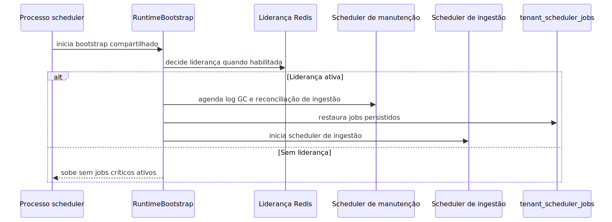

# Scheduler Multi-Tenant

Atualizado com base no runtime atual.

## Objetivo

Explicar como o processo de scheduler sobe hoje, como ele se separa da
API e do worker e quais responsabilidades temporais já estão ativas no
bootstrap operacional.

Para a leitura especializada do encadeamento completo entre scheduler,
solicitação agentic em background, pedido em linguagem natural e pausa
humana, veja também
[README-CONCEITUAL-AGENDAMENTO-AGENTIC-BACKGROUND-HIL.md](./README-CONCEITUAL-AGENDAMENTO-AGENTIC-BACKGROUND-HIL.md)
e
[README-TECNICO-AGENDAMENTO-AGENTIC-BACKGROUND-HIL.md](./README-TECNICO-AGENDAMENTO-AGENTIC-BACKGROUND-HIL.md).

## Visão geral

O scheduler atual roda em processo dedicado. Ele não nasce mais dentro do
ciclo HTTP do FastAPI. O bootstrap fica isolado em app/scheduler_main.py
e em app/runners/scheduler_runner.py, reaproveitando RuntimeBootstrap.

Na prática, esse processo cuida de três frentes principais: manutenção,
reconciliação periódica de ingestão e despacho canônico do scheduler
universal. Também respeita liderança por Redis quando essa proteção está
ativa.

## Explicação conceitual

O processo scheduler-only sobe um scheduler de manutenção. É ele que roda
limpeza de logs, reconciliação de ingestão, manutenção HIL quando
habilitada e o dispatcher universal que faz claim e publish das execuções
persistidas em scheduler.scheduled_jobs e scheduler.job_executions.

Tudo isso só entra em operação plena quando o bootstrap permite e quando
o processo possui liderança, caso a eleição de líder esteja habilitada.
Sem liderança, o processo pode subir, mas sem ativar os jobs críticos.

Importante: o bootstrap não restaura mais jobs de ingestão a partir de
tenant_scheduler_jobs e também não usa o dispatcher antigo de background.
Se o dispatcher universal estiver desligado por configuração, não existe
um caminho legado escondido para assumir o lugar dele.

## Explicação for dummies

Pense no scheduler como o despertador do sistema. Ele não faz o trabalho
pesado da execução longa. Ele decide a hora e lembra quais tarefas ainda
precisam acontecer depois de um reinício.

A API recebe o pedido. O scheduler marca o relógio. O worker executa a
parte pesada quando chega a hora. Se existir controle de liderança, só o
processo autorizado pode mexer nesse despertador para evitar duplicidade.

## Fluxo resumido

## Relação entre API, scheduler e worker

- API: recebe requests, autentica e expõe observabilidade.
- Scheduler: faz manutenção, claima execuções vencidas e publica trabalho
  canônico para o worker.
- Worker: consome RabbitMQ e Dramatiq e executa a parte assíncrona
  pesada.

Em linguagem simples: o scheduler decide quando começar. O worker decide
como executar a fila assíncrona. A API não substitui nenhum dos dois.

## Visão executiva

Executivamente, o scheduler reduz risco de esquecimento operacional. Ele
garante que manutenção, reconciliação e despacho das execuções
persistidas não dependam de alguém lembrar manualmente de disparar o
processo certo no momento certo.

## Visão comercial

Comercialmente, isso ajuda a sustentar a promessa de operação confiável.
Clientes não compram apenas endpoints; eles compram continuidade de
rotina, recorrência controlada e capacidade de recuperar a operação após
reinício ou incidente.

## Visão estratégica

Estrategicamente, separar scheduler de API e worker reforça a topologia
da plataforma. Cada papel pode evoluir, escalar e ser observado sem
misturar aceite HTTP, coordenação temporal e execução pesada na mesma
superfície.

## Persistência multi-tenant

O contrato durável de agendamento agora está no schema scheduler.

- scheduler.scheduled_jobs: guarda o que deve rodar, quando deve rodar,
  qual handler deve ser usado e em qual fila o trabalho deve ser
  publicado.
- scheduler.job_executions: guarda cada disparo real, com correlation_id,
  status de dispatch, status de execução e trilha de erro.

Na prática, isso significa que ingestão e background execution passaram a
compartilhar a mesma agenda canônica. O que continua específico de cada
domínio é o payload e o handler, não a tabela de scheduling.

## Relação com RabbitMQ

O scheduler não é consumidor de RabbitMQ. Ele só registra a execução
canônica no banco, faz o publish para a fila correta e deixa o consumo
para o worker oficial.

## Variáveis de ambiente importantes

- SCHEDULER_LEADER_ELECTION_ENABLED: liga ou desliga a liderança por
  Redis.
- SCHEDULER_LEADER_LOCK_TTL_SECONDS: define a duração do lock de
  liderança.
- SCHEDULER_LEADER_LOCK_RENEW_SECONDS: define a renovação do lock.
- SCHEDULER_POLL_INTERVAL_SECONDS: define o ritmo interno do
  JobScheduler.
- LOG_GC_ENABLED: liga ou desliga a limpeza periódica de logs.
- LOG_GC_INTERVAL_SECONDS: define o intervalo da limpeza de logs.
- INGESTION_RECONCILIATION_ENABLED: liga ou desliga a reconciliação
  periódica.
- INGESTION_RECONCILIATION_INTERVAL_SECONDS: define o intervalo da
  reconciliação.
- INGESTION_RECONCILIATION_LIMIT_PER_RUN: limita o volume por ciclo de
  reconciliação.
- UNIVERSAL_SCHEDULER_DISPATCHER_ENABLED: liga ou desliga o dispatcher
  canônico do scheduler universal. Se desligar, o runtime não recorre ao
  scheduler legado como fallback.
- UNIVERSAL_SCHEDULER_DISPATCHER_INTERVAL_SECONDS: define o intervalo da
  rodada canônica de claim e publish.
- UNIVERSAL_SCHEDULER_DISPATCHER_LIMIT_PER_RUN: limita o volume de
  schedules analisados por rodada.
- UNIVERSAL_SCHEDULER_DISPATCHER_CLAIM_TTL_SECONDS: define a janela de
  claim das execuções reservadas.

## Como validar

1. Suba o processo scheduler-only.
2. Confirme no log o marker SCHEDULER_READY.
3. Verifique se o processo ficou líder ou se subiu bloqueado pela
   liderança.
4. Confirme no log se o dispatcher universal claimou ou reconciliou
  execuções.
5. Se houver execução longa disparada pelo scheduler, confirme também o
   worker oficial pronto.

## Leituras relacionadas

- [README.md](./README.md): índice por intenção para navegação operacional.
- [README-ARQUITETURA.md](./README-ARQUITETURA.md): contextualiza o scheduler dentro da topologia geral.
- [README-SERVICE-API.md](./README-SERVICE-API.md): ajuda a separar aceite HTTP de disparo temporal.
- [README-CONCEITUAL-AGENDAMENTO-AGENTIC-BACKGROUND-HIL.md](./README-CONCEITUAL-AGENDAMENTO-AGENTIC-BACKGROUND-HIL.md): visão conceitual do uso do scheduler para execuções agentic agendadas com HIL.
- [README-TECNICO-AGENDAMENTO-AGENTIC-BACKGROUND-HIL.md](./README-TECNICO-AGENDAMENTO-AGENTIC-BACKGROUND-HIL.md): caminho técnico ponta a ponta entre scheduled_jobs, worker background e decisão HIL.
- [README-INGESTAO.md](./README-INGESTAO.md): mostra um fluxo que pode ser disparado ou reconciliado pelo scheduler.
- [README-LOGGING.md](./README-LOGGING.md): explica rastreabilidade, liderança e diagnóstico por correlation_id.

## Troubleshooting

### O processo sobe, mas nenhum job crítico roda

Causa provável: a liderança por Redis está habilitada e este processo não
virou líder.

Como confirmar: procure no log se o processo entrou pronto, mas bloqueado
pela eleição de liderança.

### O scheduler cria execuções, mas a execução não anda

Causa provável: o scheduler universal conseguiu claimar e publicar, mas o
worker responsável pela fila assíncrona não está disponível ou não está
consumindo a fila correta.

Como confirmar: separe o sucesso do claim e do publish do sucesso da
execução. O primeiro é do scheduler; o segundo depende do worker.

### O processo parece saudável, mas reconciliação e limpeza não acontecem

Causa provável: variáveis de ambiente de manutenção ou reconciliação
estão desligadas.

Como confirmar: revise `LOG_GC_ENABLED`,
`INGESTION_RECONCILIATION_ENABLED` e os respectivos intervalos.

## Checklist de entendimento

- Entendi a diferença entre scheduler, API e worker.
- Entendi o papel da liderança por Redis.
- Entendi que claimar e publicar não significa concluir a execução.
- Entendi como diagnosticar prontidão, liderança e falta de worker.

## Evidência no código

- app/scheduler_main.py
- app/runners/scheduler_runner.py
- src/api/startup/runtime_bootstrap.py
- src/api/services/scheduler_dispatch_maintenance_job.py
- src/api/startup/policy.py
- src/scheduler_layer/postgres_repository.py
- src/scheduler_layer/services.py
- src/core/scheduler_leader_election.py
- src/api/services/ingestion_reconciliation_maintenance_job.py
- src/utils/scheduler_config.py

## Lacunas no código

Não encontrado no código.

Onde deveria estar:

- um endpoint administrativo único consolidando liderança, jobs
  restaurados e último ciclo do scheduler em uma única resposta.
