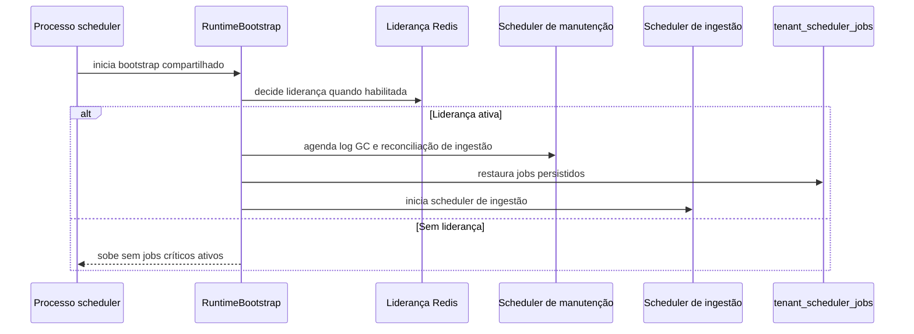

# Scheduler Multi-Tenant

Atualizado com base no runtime atual.

## Objetivo

Explicar como o processo de scheduler sobe hoje, como ele se separa da
API e do worker e quais responsabilidades temporais já estão ativas no
bootstrap operacional.

## Visão geral

O scheduler atual roda em processo dedicado. Ele não nasce mais dentro do
ciclo HTTP do FastAPI. O bootstrap fica isolado em app/scheduler_main.py
e em app/runners/scheduler_runner.py, reaproveitando RuntimeBootstrap.

Na prática, esse processo cuida de três frentes principais: manutenção,
reconciliação periódica de ingestão e restauração de jobs persistidos.
Também respeita liderança por Redis quando essa proteção está ativa.

## Explicação conceitual

O processo scheduler-only pode subir dois schedulers diferentes. O primeiro
é o de manutenção, usado para limpeza de logs e reconciliação de ingestão.
O segundo é o scheduler de ingestão, usado para restaurar e disparar jobs
persistidos em tenant_scheduler_jobs.

Tudo isso só entra em operação plena quando o bootstrap permite e quando
o processo possui liderança, caso a eleição de líder esteja habilitada.
Sem liderança, o processo pode subir, mas sem ativar os jobs críticos.

## Explicação for dummies

Pense no scheduler como o despertador do sistema. Ele não faz o trabalho
pesado da execução longa. Ele decide a hora e lembra quais tarefas ainda
precisam acontecer depois de um reinício.

A API recebe o pedido. O scheduler marca o relógio. O worker executa a
parte pesada quando chega a hora. Se existir controle de liderança, só o
processo autorizado pode mexer nesse despertador para evitar duplicidade.

## Fluxo resumido

## Relação entre API, scheduler e worker

- API: recebe requests, autentica e expõe observabilidade.
- Scheduler: dispara jobs por tempo, faz manutenção e restaura jobs
  persistidos.
- Worker: consome RabbitMQ e Dramatiq e executa a parte assíncrona
  pesada.

Em linguagem simples: o scheduler decide quando começar. O worker decide
como executar a fila assíncrona. A API não substitui nenhum dos dois.

## Persistência multi-tenant

A tabela tenant_scheduler_jobs continua sendo o contrato durável dos
agendamentos. É dela que o scheduler recupera jobs após reinício.

Campos práticos relevantes:

- job_id para identificar o job;
- tenant_id e access_key_id para isolamento multi-tenant;
- schedule_type, cron_expression e interval_seconds para o ritmo;
- yaml_path para a origem da ingestão;
- last_run_at, last_status e last_error para auditoria;
- is_active e cancelled_at para desligamento sem perder histórico.

## Relação com RabbitMQ

O scheduler não é consumidor de RabbitMQ. Ele só dispara a execução no
tempo correto e restaura jobs duráveis. O consumo da fila continua sendo
responsabilidade do worker oficial.

## Variáveis de ambiente importantes

- SCHEDULER_LEADER_ELECTION_ENABLED: liga ou desliga a liderança por
  Redis.
- SCHEDULER_LEADER_LOCK_TTL_SECONDS: define a duração do lock de
  liderança.
- SCHEDULER_LEADER_LOCK_RENEW_SECONDS: define a renovação do lock.
- SCHEDULER_POLL_INTERVAL_SECONDS: define o ritmo interno do
  JobScheduler.
- LOG_GC_ENABLED: liga ou desliga a limpeza periódica de logs.
- LOG_GC_INTERVAL_SECONDS: define o intervalo da limpeza de logs.
- INGESTION_RECONCILIATION_ENABLED: liga ou desliga a reconciliação
  periódica.
- INGESTION_RECONCILIATION_INTERVAL_SECONDS: define o intervalo da
  reconciliação.
- INGESTION_RECONCILIATION_LIMIT_PER_RUN: limita o volume por ciclo de
  reconciliação.

## Como validar

1. Suba o processo scheduler-only.
2. Confirme no log o marker SCHEDULER_READY.
3. Verifique se o processo ficou líder ou se subiu bloqueado pela
   liderança.
4. Confirme se jobs persistidos foram restaurados.
5. Se houver execução longa disparada pelo scheduler, confirme também o
   worker oficial pronto.

## Evidência no código

- app/scheduler_main.py
- app/runners/scheduler_runner.py
- src/api/startup/runtime_bootstrap.py
- src/api/startup/policy.py
- src/core/job_scheduler.py
- src/core/tenant_scheduler_repository.py
- src/core/scheduler_leader_election.py
- src/api/services/ingestion_reconciliation_maintenance_job.py
- src/utils/scheduler_config.py

## Lacunas no código

Não encontrado no código.

Onde deveria estar:

- um endpoint administrativo único consolidando liderança, jobs
  restaurados e último ciclo do scheduler em uma única resposta.
