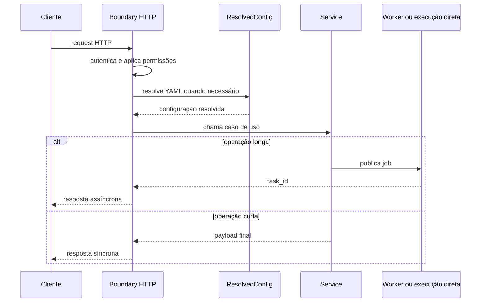

# API HTTP e Boundary do Serviço

Este documento explica o papel do processo HTTP principal.
Ele não tenta listar endpoint por endpoint.
Para inventário de rotas, payloads e respostas, use
API-ENDPOINTS-SWAGGER.md.

## Leitura relacionada

- Visão macro do runtime: [README-ARQUITETURA.md](./README-ARQUITETURA.md)
- Autenticação técnica e humana: [README-SISTEMA-AUTENTICACAO.md](./README-SISTEMA-AUTENTICACAO.md)
- MFA da sessão web: [README-AUTENTICACAO-MFA.md](./README-AUTENTICACAO-MFA.md)
- Permissões por endpoint: [README-AUTORIZACAO.md](./README-AUTORIZACAO.md)
- Inventário das rotas: [API-ENDPOINTS-SWAGGER.md](./API-ENDPOINTS-SWAGGER.md)

## O que este processo sobe de verdade

O app principal nasce em src/api/service_api.py.
Ele monta no mesmo processo:

- a API FastAPI;
- a documentação em /docs, /redoc e /openapi.json;
- os assets da UI em /ui/static;
- o proxy HTTP em /mcp;
- os routers públicos, administrativos e operacionais.

Em linguagem simples: API e UI administrativa compartilham o mesmo
boundary HTTP.

## O que esse boundary faz

O processo HTTP recebe a request, autentica, aplica permissões,
resolve YAML quando necessário, chama o service certo e devolve o
resultado ou o aceite assíncrono.

Ele não deve ser confundido com o worker nem com o scheduler.

## Famílias de superfície montadas no app

Pelo wiring atual, o app inclui grupos como:

- /agent e /workflow;
- /rag, /status e /api/v1/status;
- /config, /config/assembly, /config/nl2sql e /config/contract;
- /admin, /client-portal e /api/auth;
- /channels, /ingestion-runs e /interaction-runs;
- /schema-metadata, /api/whatsapp, /api/instagram e /api/dnit.

Na prática, isso mostra que o boundary HTTP atende produto,
observabilidade, portal, autenticação e operação administrativa.

## UI administrativa no mesmo app

O mesmo processo que serve JSON também entrega páginas e JavaScript da
UI.

Isso importa por um motivo simples: problema de tela nem sempre é um
problema só de front-end.
Muitas vezes o defeito está no contrato HTTP do mesmo app.

## Autenticação e permissão

O boundary aceita mais de uma origem de identidade.

- X-API-Key no header.
- access_key resolvida a partir do YAML.
- sessão federada web.

Além disso, o app aplica controle de permissão por endpoint e protege o
Swagger com verificação específica.

## Middlewares e handlers que mudam o comportamento

Os pontos mais relevantes do app são:

- FederatedSessionMiddleware para sessão web.
- slowapi para rate limit.
- enforce_registered_permissions para permissão declarada.
- enforce_swagger_access para /docs, /redoc e /openapi.json.
- logging de request com correlation_id e X-Correlation-Id.
- handlers globais para erro e validação.

## Como o fluxo curto e o fluxo longo se separam

Quando a operação termina no mesmo request, a resposta sai direto do
router ou do service.

Quando a operação é longa, o boundary HTTP publica o trabalho e devolve
um contrato de acompanhamento.

No código atual, isso aparece de forma clara em ingestão, ETL e status.

## Acompanhamento assíncrono

O app expõe três formas de acompanhar task:

- polling em /status e /api/v1/status;
- SSE em /status/stream e /api/v1/status/stream;
- SSE por task em /status/stream/{task_id} e
    /api/v1/status/stream/{task_id};
- WebSocket em /status/ws e /api/v1/status/ws.

Em linguagem simples: o boundary HTTP não só aceita o job como também
publica o canal oficial para seguir o progresso.

## Router AST e feature flag

O grupo /config/assembly depende de FEATURE_AGENTIC_AST_ENABLED.

Se a flag estiver desligada, o router não entra no app.
Isso significa que 404 nesse slice pode ser configuração de ambiente e
não ausência de implementação.

O router montado em `src/api/routers/config_assembly_router.py` publica
as seguintes rotas quando a feature está ativa:

- POST /config/assembly/preflight
- POST /config/assembly/draft
- POST /config/assembly/objective-to-yaml
- POST /config/assembly/validate
- POST /config/assembly/confirm
- GET /config/assembly/schema
- GET /config/assembly/catalog
- POST /config/assembly/recommend-tools

Em linguagem simples: `preflight` verifica se o ambiente consegue
trabalhar com a montagem agentic; `draft` cria ou interpreta uma AST;
`objective-to-yaml` transforma objetivo em YAML governado; `validate`
valida a AST; `confirm` confirma a proposta; `schema` e `catalog`
expõem metadados; e `recommend-tools` sugere tools para uma situação.

A UI administrativa que consome esse fluxo fica em
`app/ui/static/js/admin-assembly-ast.js`. Ela chama a mesma API HTTP do
app principal; não existe backend paralelo para montagem AST.

## Fluxo de referência do boundary

## Como validar

1. Suba a API.
2. Confirme acesso a /openapi.json com credencial autorizada.
3. Valide uma rota curta.
4. Valide uma rota longa.
5. Em fluxo longo, acompanhe task_id pelo status.
6. Se falhar antes do aceite, investigue boundary, autenticação e YAML.
7. Se falhar depois do aceite, investigue worker, fila e dependências.

## Leitura complementar sem duplicar assunto

- Use API-ENDPOINTS-SWAGGER.md para inventário de endpoints.
- Use README-CONFIGURACAO-YAML.md para entender a resolução do YAML.
- Use README-INGESTAO.md, README-ETL.md e README-RAG.md para o runtime
  de domínio.

## Evidência no código

- src/api/service_api.py
- src/api/routers/agent_router.py
- src/api/routers/workflow_router.py
- src/api/routers/rag_router.py
- src/api/routers/streaming_router.py
- src/api/routers/config_assembly_router.py
- src/api/routers/config_nl2sql_router.py
- src/api/routers/client_portal_router.py
- src/api/routers/ui_router.py
- src/api/security/permissions.py
- src/api/security/user_auth.py
- app/runners/api_runner.py

## Lacunas no código

Não encontrado no código.

Onde deveria estar:

- um manifesto administrativo único do processo HTTP com middlewares,
  routers, permissões e mounts já consolidados;
- uma exportação automática do boundary HTTP pronta para auditoria.
