# Sistema de Autenticação

Atualizado com base no runtime atual.

## Objetivo

Explicar como a plataforma autentica chamadas técnicas e usuários humanos
na área web, quais entradas de autenticação existem hoje e onde a sessão
ou a credencial são resolvidas no código.

## Visão geral

Hoje a plataforma não possui um único tipo de login. Ela combina acesso
técnico por chave, sessão web humana, login local para conta pessoal e
etapas complementares de MFA TOTP quando o fluxo federado exige segundo
fator.

O núcleo dessa autenticação fica no diretório central e no router de
autenticação web. Em termos práticos, isso significa que a API técnica e
a UI administrativa não vivem em mundos separados: ambas acabam
produzindo contexto autenticado reutilizável pelo restante da aplicação.

## Explicação conceitual

A autenticação técnica valida uma access key e transforma esse segredo em
um objeto de contexto com tenant, permissões e metadados operacionais.
A autenticação humana cria uma sessão web assinada em cookie httpOnly,
carrega a conta pessoal, resolve o membership organizacional quando ele
existe e expõe esse snapshot para as chamadas seguintes.

Quando o login humano usa o fluxo federado, o backend ainda pode exigir
MFA TOTP antes de liberar o cookie final. O resultado é um desenho com
duas portas de entrada diferentes, mas com o mesmo objetivo: chegar a um
contexto autenticado que o backend consiga auditar e autorizar.

## Explicação for dummies

Pense no sistema como um prédio com duas entradas. A primeira é a porta
de serviço, usada por integrações e automações com uma chave técnica. A
segunda é a portaria de pessoas, usada por quem entra na interface web.

Na porta de serviço, o segurança olha a chave, consulta o cadastro e diz
o que aquela integração pode fazer. Na portaria humana, o segurança olha
o login, cria um crachá temporário e, em alguns casos, pede uma segunda
prova de identidade antes de entregar o crachá definitivo.

O importante é que, depois dessa checagem, o prédio passa a saber quem é
você, de qual empresa ou tenant você faz parte e quais áreas estão
liberadas para aquela sessão ou credencial.

## Leitura relacionada

- Segundo fator TOTP na web: [README-AUTENTICACAO-MFA.md](./README-AUTENTICACAO-MFA.md)
- Catálogo de permissões e grants: [README-AUTORIZACAO.md](./README-AUTORIZACAO.md)
- Boundary HTTP onde a identidade é aplicada: [README-SERVICE-API.md](./README-SERVICE-API.md)
- Índice central da documentação: [README.md](./README.md)

## Entradas de autenticação encontradas no runtime

### Credencial técnica

É usada por integrações, jobs e chamadas de API baseadas em access key.

O backend aceita a chave por duas trilhas comprovadas no código:

- header X-API-Key;
- authentication.access_key dentro do payload YAML ou JSON resolvido.

### Sessão web federada

É a trilha principal da UI administrativa.

O fluxo valida um id_token do provedor configurado, resolve o contexto do
usuário no diretório e grava uma sessão assinada que depois é lida pelo
middleware web.

### Sessão web local

Também existe um login local baseado em conta pessoal já cadastrada.

Essa trilha emite a mesma família de sessão web, mas sem depender do
provedor federado. Ela serve como alternativa controlada para contas
locais existentes no diretório.

### MFA TOTP no login web

O segundo fator não substitui o login federado. Ele entra depois do
login quando o usuário já possui TOTP ativo ou quando a política global
manda exigir MFA.

Os detalhes desse fluxo ficam em README-AUTENTICACAO-MFA.md.

## Componentes que realmente decidem a autenticação

- src/api/security/user_auth.py resolve access key, normaliza user_data e
  valida permissão para chamadas técnicas.
- src/security/client_directory.py consulta o diretório central de
  tenants, contas, memberships e segredos.
- src/api/routers/auth_router.py implementa login federado, login local,
  sessão web, TOTP, perfil pessoal, cartões e governança de memberships.
- src/api/middleware/federated_session.py carrega a sessão do cookie e
  só força redirect para páginas HTML protegidas.
- src/api/security/federated_local_bypass.py habilita um bypass local de
  loopback quando a configuração web permite.

## Fluxo resumido do runtime

## Como o usuário recebe essa feature

### Integração técnica

1. Recebe uma access key vinculada ao tenant.
2. Chama a API com header ou YAML autenticado.
3. O backend devolve 401 quando a chave falta e 403 quando a permissão
   não cobre a operação.

### Usuário da área web

1. Faz login federado ou local.
2. O backend cria a sessão web.
3. Se MFA estiver ativo ou exigido, o cookie final só sai depois da
   confirmação TOTP.
4. A UI passa a consultar a sessão autenticada para avatar, tenant e
   contexto de uso.

### Operador administrativo humano

Além do login, o runtime atual já expõe governança humana autenticada em
rotas do mesmo router, como:

- catálogo de permissões da UI administrativa;
- listagem de memberships;
- convite administrativo de membership;
- revogação de membership;
- leitura e atualização da governança de grants humanos.

## Impacto prático

- integrações e UI usam contratos diferentes de entrada, mas convergem
  para um contexto autenticado observável;
- a plataforma consegue separar conta pessoal, membership organizacional
  e credencial técnica;
- a sessão web já nasce preparada para refletir tenant, grants e perfil
  sem inventar um catálogo paralelo de permissões.

## Limites e pegadinhas

- autenticação não é a mesma coisa que autorização; as regras de grant e
  precedência ficam em README-AUTORIZACAO.md;
- o bypass local não é fluxo normal de produção;
- o MFA TOTP existe só para o caminho web e não para access key técnica;
- login local e login federado geram sessão web, mas não são o mesmo
  processo de identidade.

## Evidência no código

- src/api/routers/auth_router.py
- src/api/middleware/federated_session.py
- src/api/security/user_auth.py
- src/api/security/federated_auth.py
- src/api/security/federated_local_bypass.py
- src/api/security/federated_mfa_policy.py
- src/api/security/federated_session_store.py
- src/api/security/totp_service.py
- src/security/client_directory.py

## Lacunas no código

Não encontrado no código.

Onde deveria estar:

- um documento gerado automaticamente que inventarie toda a superfície
  do router de autenticação web;
- uma camada equivalente de autenticação pronta para principal de canal,
  no mesmo nível de maturidade da access key técnica e da sessão web.

## Onde aprofundar

- README-AUTENTICACAO-MFA.md para o fluxo TOTP e a política global de
  segundo fator.
- README-AUTORIZACAO.md para grants, precedência e catálogo central de
  permissões.
- API-ENDPOINTS-SWAGGER.md para o inventário HTTP.
