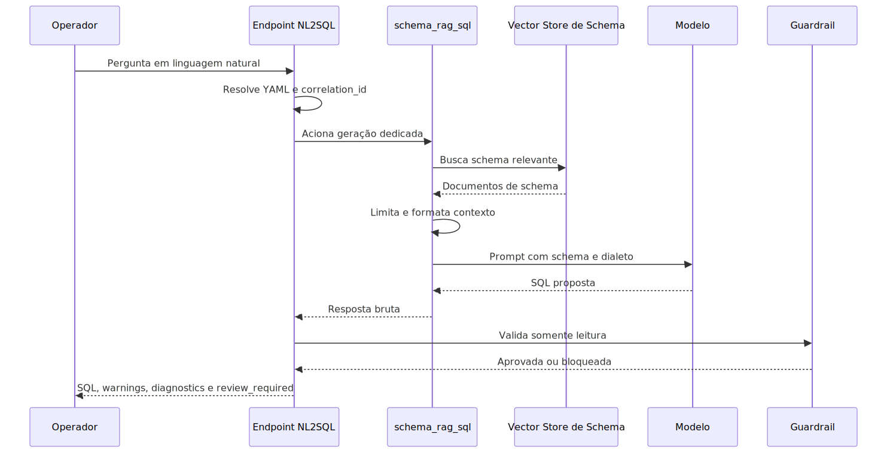

# SQL por Schema Metadata

Este documento cobre a capacidade schema_rag_sql e o endpoint dedicado
de NL2SQL.

Ele explica o que essa família faz, por que ela existe, como ela funciona
por dentro, como ativar o fluxo com segurança e como usar o caminho
controlado do schema PDV sem inventar SQL, sem executar automaticamente a
consulta gerada e sem vazar linhas reais do banco por padrão.

## Visão geral

NL2SQL significa converter uma pergunta em linguagem natural em uma
proposta de SQL.

Neste projeto, isso não significa dar liberdade total para o modelo
"chutar" uma consulta. O fluxo foi desenhado para trabalhar com um mapa
técnico do banco, recuperar só o contexto de schema relevante, fixar o
dialeto correto e devolver uma proposta revisável por humano.

Em termos práticos, o sistema não tenta adivinhar o banco inteiro na
memória do modelo. Ele primeiro busca metadados do schema, monta um
contexto limitado e só depois pede a SQL. Isso reduz alucinação,
reduz ambiguidade e deixa a auditoria mais clara.

## Por que essa capacidade existe

Essa capacidade existe para resolver um problema muito comum: o usuário
ou operador sabe a pergunta de negócio que quer responder, mas não sabe
qual tabela consultar, como fazer o join correto ou qual filtro SQL usar.

Sem esse tipo de apoio, duas coisas tendem a acontecer. Ou a equipe cria
consultas manualmente de forma lenta e inconsistente, ou o sistema tenta
gerar SQL "no escuro" e corre o risco de inventar tabela, coluna ou
relacionamento que não existem.

Aqui a estratégia é diferente. O schema metadata vira uma fonte técnica
intermediária. Ele funciona como uma planta do banco: mostra tabelas,
colunas e relações, mas não precisa carregar os dados reais para o motor
entender a estrutura.

## Explicação conceitual

O fluxo é dividido em três camadas com responsabilidades diferentes.

Primeiro existe a camada de catálogo técnico. Ela lê o banco de origem,
descobre schema, tabelas, colunas, chaves primárias e chaves estrangeiras
e grava isso no catálogo dbschemas.

Depois existe a camada vetorial. Ela pega esse catálogo técnico e o
transforma em documentos semânticos de schema, que são indexados em um
vector store dedicado. Essa etapa é a que permite buscar rapidamente as
partes mais relevantes do schema para cada pergunta.

Por fim existe a camada de geração assistida. Ela recebe a pergunta do
usuário, consulta o vector store de schema, limita o contexto, aplica o
dialeto correto e pede ao LLM uma proposta de SQL. Antes de devolver a
resposta, o sistema passa a proposta por um guardrail de somente leitura.

Em resumo: o banco real abastece um catálogo, o catálogo abastece um
índice semântico e o índice semântico abastece a geração de SQL.

## Explicação for dummies

Imagine que alguém te peça: "me diga onde está o estoque por loja" em um
banco grande que você nunca viu. Se você tentar responder sem mapa, vai
se perder. Pode escolher a tabela errada, esquecer um relacionamento ou
inventar um nome que não existe.

O schema_rag_sql evita isso criando um "guia de ruas" do banco antes.
Esse guia não precisa carregar os dados reais das pessoas ou das vendas.
Ele precisa mostrar como as ruas se chamam, onde elas se cruzam e como
chegar de um ponto ao outro.

Quando a pergunta chega, o sistema olha esse guia, separa só as ruas que
parecem relevantes e então pede ao modelo uma rota. A rota, aqui, é a
SQL proposta. Depois disso, ainda existe um fiscal dizendo: "essa rota é
somente consulta ou você tentou mexer no banco?". Se a resposta for
insegura, o sistema bloqueia.

## O que essa família faz e o que ela não faz

Ela faz:

- recuperar metadados de schema relevantes por similaridade semântica;
- limitar o contexto enviado ao LLM;
- gerar uma proposta de SQL no dialeto configurado;
- validar se a proposta é somente leitura;
- devolver diagnósticos estruturados para revisão humana.

Ela não faz:

- executar automaticamente a SQL gerada;
- salvar automaticamente a consulta como ferramenta de produção;
- inferir dialeto fora dos valores suportados;
- depender de sample_rows por padrão no fluxo PDV;
- tratar SQL gerada como resposta final sem revisão.

## Técnicas usadas no NL2SQL deste projeto

### 1. RAG de schema em vez de geração no escuro

RAG significa Retrieval-Augmented Generation, ou geração assistida por
recuperação.

Na prática, isso quer dizer que o modelo não recebe só a pergunta. Ele
recebe também um contexto buscado em uma base de conhecimento. Neste
caso, a base de conhecimento é formada por documentos de schema.

O benefício real é simples: a resposta deixa de depender só da memória do
modelo e passa a depender de uma fonte técnica indexada pelo sistema.

### 2. Dialeto SQL explícito

O fluxo aceita apenas três dialetos para esse caminho dedicado:

- postgresql;
- mysql;
- mssql.

Isso é importante porque uma mesma ideia de consulta muda de um banco
para outro. Fixar o dialeto reduz erro de sintaxe e reduz respostas que
parecem corretas, mas não rodam no banco alvo.

### 3. Recuperação semântica com top_k

O parâmetro top_k define quantos documentos de schema entram no contexto.

O contrato HTTP atual aceita valores entre 1 e 20. O valor padrão usado
na factory é 5.

Efeito prático:

- top_k menor reduz ruído, mas pode deixar uma tabela útil de fora;
- top_k maior amplia cobertura, mas aumenta contexto irrelevante;
- top_k não substitui qualidade dos metadados. Ele só controla a largura
  da busca.

### 4. Truncamento operacional do contexto

O contexto de schema não cresce sem limite. A factory aplica um limite
operacional antes de chamar o modelo.

Isso existe para evitar prompts descontrolados, custo exagerado e queda
de qualidade quando muita informação irrelevante entra de uma vez.

### 4.1. O que isso significa para bancos muito grandes

Essa arquitetura foi pensada justamente para lidar melhor com bancos
grandes do que uma geração ingênua de SQL.

Em vez de tentar jogar o schema inteiro no prompt, o fluxo primeiro
recupera só a parte mais relevante do schema por busca semântica com
`top_k` e, se ainda assim o contexto crescer demais, aplica truncamento
operacional antes da geração.

Na prática, isso torna o mecanismo mais adequado para escalar em bases
com muitas tabelas e colunas, porque ele reduz ruído e controla o tamanho
do contexto entregue ao modelo.

Mas esse desenho não autoriza afirmar desempenho universal em qualquer
base grande. Se o schema metadata estiver pobre, ambíguo ou pouco
informativo, o resultado também perde qualidade. `top_k` melhora a
seleção do contexto, mas não substitui metadados bons.

### 5. Guardrail de somente leitura

Depois que a SQL é proposta, o fluxo passa pela validação central
SqlReadOnlyGuardrail.

Esse guardrail aceita apenas sentenças comprovadamente de leitura, como
consultas e alguns comandos descritivos. Ele bloqueia, por exemplo,
operações de escrita, alteração estrutural, comandos administrativos,
múltiplas sentenças e SQL que não parseia corretamente no dialeto
informado.

Isso é uma camada de proteção real. Ela evita que a resposta do modelo
seja tratada como segura só porque ficou "parecendo SQL".

### 6. Revisão humana obrigatória

Mesmo quando a SQL passa no guardrail, a resposta continua com
review_required verdadeiro.

Isso significa que o sistema está deliberadamente desenhado para revisão
assistida. A proposta pode estar tecnicamente bem formada e ainda assim
precisar de ajuste de regra de negócio, filtro, agrupamento ou naming.

### 7. Migração de consulta aprovada para dyn_sql

Quando uma pergunta deixa de ser exploratória e vira rotina, o fluxo
certo não é continuar gerando SQL do zero toda vez.

O caminho governado passa a ser dyn_sql. A ideia é: usar schema_rag_sql
para descoberta e desenho inicial; depois usar dyn_sql para operação
aprovada, parametrizada e recorrente.

## Nome de catálogo e nome de runtime

O catálogo builtin usa schema_rag_sql.
O nome interno da tool construída usa o prefixo schema_rag_sql_.

Isso importa porque YAML, logs, diagnósticos e runtime podem mostrar a
mesma capacidade com formas ligeiramente diferentes de nome.

## Arquitetura do fluxo

## Endpoint dedicado e contrato HTTP

O boundary estável do uso assistido é:

- POST /config/nl2sql/generate

Esse endpoint existe para revisão humana e retorno auditável. Ele não é
um endpoint de execução automática.

### O que o request precisa trazer

O contrato atual trabalha com estes campos principais:

- prompt: a pergunta em linguagem natural;
- user_email: email do operador para auditoria e contexto;
- dialect: postgresql, mysql ou mssql;
- top_k: quantidade máxima de documentos de schema usados na busca;
- correlation_id: opcional, para rastreamento;
- uma forma de resolver o YAML de contexto.

O YAML pode chegar por uma destas rotas:

- yaml_config já desserializado em memória;
- yaml_config_path apontando para arquivo;
- yaml_inline_content com o texto YAML;
- encrypted_data compatível com o resolvedor compartilhado.

### O que a resposta devolve

O contrato de resposta atual devolve:

- success;
- correlation_id;
- sql, quando a geração foi utilizável;
- raw_response do motor;
- warnings;
- diagnostics estruturados;
- review_required;
- execution_context seguro para auditoria.

Na prática, isso permite distinguir quatro situações:

- geração bem-sucedida e liberada para revisão;
- geração bem-sucedida, mas com warnings importantes;
- geração bloqueada pelo guardrail;
- geração que nem conseguiu produzir SQL utilizável.

## Diferença prática entre endpoint e tool interna

Essa é uma dúvida importante porque os dois caminhos usam a mesma ideia
de NL2SQL, mas não têm o mesmo papel.

Em termos simples:

- a tool schema_rag_sql é o motor interno de geração;
- o endpoint /config/nl2sql/generate é a porta HTTP estável para uso
    administrativo e revisável.

### Quando você usa o endpoint dedicado

O endpoint é o caminho certo quando alguém de fora do runtime agentic quer
enviar uma pergunta em linguagem natural e receber uma proposta de SQL com
contrato HTTP claro.

Na prática, o endpoint faz trabalho de boundary:

- recebe o request HTTP;
- resolve o YAML por caminho, conteúdo inline, payload em memória ou dado
    criptografado;
- injeta ou resolve correlation_id;
- injeta o dialeto escolhido no contexto correto;
- chama o motor schema_rag_sql internamente;
- valida a proposta no guardrail de somente leitura;
- devolve resposta estruturada com success, sql, warnings, diagnostics,
    review_required e execution_context.

Esse caminho é melhor quando o objetivo é integração administrativa,
auditoria, retorno estruturado e revisão humana explícita.

### Quando você usa a tool diretamente

A tool direta é o caminho certo quando quem decide chamar o NL2SQL é um
runtime agentic já em execução, como Supervisor, DeepAgent ou Workflow.

Nesse cenário, schema_rag_sql não funciona como endpoint. Ela funciona
como uma tool interna do catálogo, resolvida pelo runtime do agente.

Na prática, isso muda o papel da capacidade:

- o agente ou node decide quando chamar a tool;
- a pergunta vira argumento interno da tool, não request HTTP externo;
- a resposta volta como retorno textual da tool para o próprio runtime;
- o fluxo seguinte continua dentro do Supervisor, do DeepAgent ou do
    Workflow.

Em linguagem simples: o endpoint conversa com um cliente HTTP. A tool
conversa com outro agente ou com um node do grafo.

### O que muda no Supervisor

No Supervisor clássico, a tool entra como capacidade do agente
especialista, resolvida pelo catálogo de tools do YAML.

O efeito prático é este: o supervisor pode decidir, durante uma
conversa, chamar schema_rag_sql para gerar uma proposta de SQL como parte
do raciocínio do agente. Depois disso, ele ainda pode explicar a
consulta, pedir confirmação, comparar alternativas ou chamar outra tool.

Ou seja, no Supervisor a SQL vira uma etapa da conversa orquestrada, não
um produto HTTP final por si só.

### O que muda no DeepAgent

No DeepAgent a lógica é parecida, mas com mais governança operacional.

Como o DeepAgent trabalha com middlewares, memória, especialistas e até
revisão humana em outros pontos do runtime, a tool schema_rag_sql pode
ser usada como um passo interno de um fluxo maior.

Na prática, isso permite coisas como:

- usar a SQL proposta como insumo de uma decisão mais ampla;
- comparar a resposta do NL2SQL com outros sinais do contexto;
- registrar essa decisão dentro de uma execução agentic mais rica.

O ponto importante é: mesmo nesse caso, a tool continua sendo uma tool.
Ela não vira automaticamente um endpoint nem herda sozinha a resposta
estruturada do boundary HTTP dedicado.

### O que muda no Workflow

No Workflow, schema_rag_sql entra como uma capacidade disponível dentro
do grafo de execução.

Isso significa que um node pode usar a tool como parte de um processo
determinístico maior. Por exemplo: um node prepara contexto, outro decide
se precisa de SQL, outro chama schema_rag_sql, e o fluxo seguinte decide
o que fazer com essa proposta.

Em linguagem simples: no Workflow, a SQL proposta é uma peça do grafo.
No endpoint, ela é a resposta principal do boundary HTTP.

### Diferença de entrada

No endpoint, a entrada é um contrato HTTP formal com campos como prompt,
user_email, dialect, top_k e mecanismos de resolução de YAML.

Na tool direta, a entrada prática do motor é a pergunta que o runtime
agentic decide enviar. O restante do contexto já precisa estar montado no
YAML e no runtime do agente.

Isso muda muito a operação.

- no endpoint, o cliente externo ainda está montando a chamada;
- na tool, o runtime já está montado e só aciona uma capacidade interna.

### Diferença de saída

No endpoint, a saída é estruturada e pensada para integração:

- success;
- sql;
- warnings;
- diagnostics;
- review_required;
- execution_context.

Na tool direta, a saída útil para o runtime agentic é o retorno textual
da própria tool. Em outras palavras: ela devolve o resultado para o
agente seguir trabalhando, e não um envelope HTTP completo para um
cliente externo.

### Diferença de governança

O endpoint já embute uma governança mais pronta para boundary:

- resolução de contexto YAML;
- normalização do dialeto;
- aplicação do guardrail;
- envelope de resposta padronizado.

Na tool direta, a governança depende mais do runtime que a chamou. O
agente, supervisor ou workflow continua responsável por decidir quando
usar a tool e o que fazer depois com o resultado.

### Regra prática de escolha

Use o endpoint quando:

- um cliente HTTP precisa mandar NL e receber SQL proposta;
- você quer retorno estruturado e auditável;
- o foco é revisão humana explícita de uma proposta isolada.

Use a tool direta quando:

- Supervisor, DeepAgent ou Workflow já estão executando;
- a geração de SQL é apenas uma etapa de um fluxo maior;
- a resposta da tool precisa ser consumida pelo próprio runtime agentic.

### Resumo direto

O endpoint é a fachada pública e estruturada.
A tool é o motor interno e reutilizável.

Os dois usam a mesma base de geração, mas servem momentos diferentes do
sistema.

## Dependências obrigatórias

Pelo código atual, a família falha cedo quando faltam estes elementos:

- user_session.correlation_id;
- user_session.user_email;
- schema_metadata.vectorstore_id;
- schema_metadata.sql_dialect.

Também é obrigatório que o vector store configurado exista e consiga
servir os documentos de schema esperados.

## Estratégia de ativação controlada

A ativação segura do NL2SQL neste projeto segue a estratégia de separar
construção de contexto, indexação semântica e geração final.

Essa separação é importante porque cada etapa responde a uma pergunta
diferente:

- o ETL responde se o sistema entendeu a estrutura do banco;
- a ingestão vetorial responde se essa estrutura ficou buscável;
- o runtime responde se a pergunta consegue virar uma proposta de SQL.

Quando algo falha, essa estratégia evita o problema clássico do "não sei
onde quebrou".

## Ativação controlada para o schema PDV

O fluxo PDV usa três YAMLs com funções diferentes.

### 1. ETL de schema metadata

Arquivo operacional:

- app/yaml/rag-config-pdv-schema-metadata-etl.yaml

Esse YAML lê o schema relacional de origem e grava o catálogo técnico em
dbschemas.

Pontos importantes observados no contrato atual:

- database_dsn vem de DATABASE_VAREJO_DSN;
- schema vem de DATABASE_VAREJO_SCHEMA;
- target_database.database_dsn vem de DBSCHEMAS_DSN;
- database_code usado nesse fluxo é pdv_demo;
- include_sample_rows fica explicitamente false.

### 2. Ingestão vetorial de schema metadata

Arquivo operacional:

- app/yaml/rag-config-pdv-schema-metadata-ingest.yaml

Esse YAML usa SchemaMetadataJsonExporter para ler o catálogo dbschemas e
gerar documentos de schema em memória, gravando tudo no vector store
dedicado schema_metadata_pdv.

Pontos importantes observados no contrato atual:

- output_mode é memory;
- database_code continua pdv_demo;
- schema_name vem de DATABASE_VAREJO_SCHEMA;
- include_sample_rows continua false;
- vector_store.id é schema_metadata_pdv.

### 3. Runtime dedicado de NL2SQL

Arquivo operacional:

- app/yaml/rag-config-pdv-nl2sql.yaml

Esse YAML é usado para a geração revisável da SQL.

Pontos importantes observados no contrato atual:

- tools_library chega vazia;
- schema_metadata.vectorstore_id é schema_metadata_pdv;
- schema_metadata.sql_dialect é postgresql;
- vector_store.id é schema_metadata_pdv;
- o bloco llm está definido para a geração;
- review humana continua obrigatória no endpoint.

## Privacidade e proteção de dados

No fluxo PDV, sample_rows permanece desabilitado no ETL e também na
ingestão vetorial.

Isso é uma decisão importante de privacidade. O objetivo dessa família é
entender a estrutura do banco, não carregar amostras reais de CPF,
telefone, email, endereço, pagamento ou qualquer outra informação
sensível para o contexto semântico por padrão.

Em linguagem simples: o motor precisa do mapa das tabelas. Ele não precisa
dos dados reais dos clientes para entender como montar a consulta.

## Como configurar

### Variáveis mínimas do fluxo PDV

Antes de validar o caminho real, estas variáveis precisam existir no
ambiente:

- DATABASE_VAREJO_DSN;
- DATABASE_VAREJO_SCHEMA;
- DBSCHEMAS_DSN;
- variáveis do provider do vector store configurado;
- variáveis do provider do LLM configurado.

Se DBSCHEMAS_DSN estiver ausente, a ativação real deve parar. Sem esse
destino, o sistema não prova o catálogo técnico de ponta a ponta.

### Blocos de configuração que precisam estar corretos

Para o runtime dedicado, a revisão mínima deve confirmar:

- schema_metadata.enabled verdadeiro;
- schema_metadata.vectorstore_id preenchido;
- schema_metadata.sql_dialect preenchido com dialeto suportado;
- vector_store configurado com backend e credenciais coerentes;
- llm configurado com provider e credenciais válidas;
- user_session disponível no contexto da chamada;
- tools_library vazia no YAML recebido.

## Como ativar na prática

### Checklist de ativação

1. Confirmar variáveis de ambiente obrigatórias, sem expor segredo.
2. Executar o ETL de schema metadata.
3. Confirmar que o catálogo dbschemas recebeu tabelas, colunas e
   relacionamentos do database_code pdv_demo.
4. Executar a ingestão vetorial de schema metadata.
5. Confirmar que o vector store schema_metadata_pdv recebeu documentos de
   schema.
6. Chamar o endpoint dedicado de NL2SQL com dialect postgresql.
7. Revisar a SQL proposta e os diagnostics retornados.
8. Só depois decidir se a consulta deve seguir para uso governado como
   dyn_sql.

### Sinais de que a ativação está pronta

O ambiente pode ser tratado como pronto quando estas condições forem
verdadeiras ao mesmo tempo:

- o ETL gravou o catálogo técnico no dbschemas;
- a ingestão vetorial populou o schema_metadata_pdv;
- o endpoint dedicado retorna diagnostics coerentes;
- o guardrail aceita consultas de leitura simples;
- review_required continua verdadeiro;
- nenhuma etapa precisou habilitar sample_rows por conveniência.

## Como usar no dia a dia

O uso correto desse fluxo é assistido, não automático.

O operador deve formular a pergunta em linguagem clara, informar o
contexto correto de YAML e pedir a geração. A resposta deve ser lida como
uma proposta técnica inicial.

Depois disso, a rotina correta é:

- revisar tabelas e joins sugeridos;
- revisar filtros e agregações;
- validar se a pergunta realmente foi atendida;
- decidir se a consulta é exploratória ou recorrente.

Se for exploratória, a resposta pode continuar no ciclo de revisão.
Se for recorrente, a recomendação é promover a consulta revisada para
dyn_sql, onde o contrato governado é mais adequado.

## Exemplo de uso em linguagem simples

### Exemplo feliz

Um operador quer descobrir o total de vendas por loja e por mês no PDV.
Ele não sabe exatamente quais tabelas concentram o faturamento nem qual a
relação correta com a dimensão de loja.

O fluxo dedicado consulta o schema_metadata_pdv, encontra os documentos
mais relevantes do schema, monta o contexto, gera a SQL em postgresql,
valida que a proposta é somente leitura e devolve a resposta com
review_required verdadeiro.

O operador então revisa a proposta, confirma se os joins fazem sentido e
decide se aquela consulta fica só como apoio exploratório ou se merece
virar dyn_sql.

### Exemplo de erro

Um operador envia a mesma pergunta, mas o catálogo técnico não foi criado
porque DBSCHEMAS_DSN não estava configurado no ambiente.

Nesse caso o fluxo real não está pronto. O problema não é "o modelo não
sabe SQL". O problema é que a base de contexto do schema não foi montada.
O ajuste correto é restaurar a cadeia ETL -> dbschemas -> ingestão
vetorial antes de cobrar resultado do runtime.

### Exemplo de bloqueio por proteção

O modelo retorna uma proposta com mais de uma sentença ou com operação de
escrita.

Nesse caso o guardrail bloqueia a resposta. O resultado correto é erro com
diagnóstico explícito, não sucesso silencioso.

## Como interpretar os diagnósticos

Os diagnostics estruturados ajudam a entender em que ponto o fluxo está.

Em termos práticos, eles costumam responder perguntas como estas:

- qual vector store foi usado;
- qual dialeto foi aplicado;
- se o contexto precisou ser truncado;
- se a geração falhou antes de produzir SQL utilizável;
- se o guardrail aprovou ou bloqueou a proposta;
- se a resposta está pronta para revisão humana.

Isso é importante porque a resposta final não é apenas uma string SQL.
Ela carrega metadados que ajudam a auditar o comportamento do runtime.

## Quando usar schema_rag_sql e quando usar dyn_sql

Use schema_rag_sql quando:

- a pergunta ainda está em linguagem natural;
- a consulta ainda está sendo descoberta;
- existe necessidade de explorar o schema;
- a equipe ainda não aprovou uma consulta fixa.

Use dyn_sql quando:

- a consulta já foi revisada e aprovada;
- o formato já é conhecido;
- a necessidade é recorrente;
- o operador só precisa informar parâmetros de uma consulta governada.

As duas famílias não competem entre si. Elas se complementam.

## Impacto para o usuário

Do ponto de vista do operador, o ganho principal é reduzir dependência de
memória manual do schema e reduzir tempo de descoberta da consulta.

Do ponto de vista da governança, o ganho é manter um caminho revisável,
auditável e compatível com proteção de leitura.

Do ponto de vista de privacidade, o ganho é separar metadado estrutural
de dado real, evitando carregar sample_rows por padrão no fluxo PDV.

## Limites e pegadinhas

- Se o catálogo técnico estiver incompleto, a geração também ficará
  incompleta.
- A arquitetura escala melhor do que NL2SQL ingênuo em schemas grandes,
    mas isso não é garantia universal para qualquer base ou qualquer nível
    de qualidade de metadata.
- top_k maior não corrige metadata ruim.
- dialeto errado produz proposta errada mesmo com schema correto.
- query aprovada pelo guardrail ainda pode estar semanticamente errada.
- review_required verdadeiro significa exatamente isso: revisão continua
  obrigatória.
- tools_library não deve ser preenchida manualmente no YAML recebido.
- sem vectorstore_id válido, o fluxo falha cedo.
- sem user_email e correlation_id válidos, o fluxo falha cedo.

## Troubleshooting

### Sintoma: o endpoint não gera SQL utilizável

Verifique primeiro:

- se o prompt chegou com texto válido;
- se user_email foi informado;
- se o YAML foi resolvido corretamente;
- se schema_metadata.vectorstore_id existe;
- se o vector store realmente contém documentos de schema.

### Sintoma: a SQL vem bloqueada pelo guardrail

Verifique:

- se a resposta contém mais de uma sentença;
- se o modelo sugeriu INSERT, UPDATE, DELETE ou outra operação mutável;
- se o dialeto informado está correto;
- se houve erro de parse da SQL.

### Sintoma: a resposta parece vaga ou irrelevante

Verifique:

- se o schema metadata foi indexado recentemente;
- se top_k está baixo demais para a pergunta;
- se o catálogo técnico do schema está completo;
- se a pergunta mistura domínios demais de uma vez.

### Sintoma: o fluxo PDV não fecha ponta a ponta

Verifique em ordem:

- DATABASE_VAREJO_DSN;
- DATABASE_VAREJO_SCHEMA;
- DBSCHEMAS_DSN;
- population do catálogo dbschemas;
- population do vector store schema_metadata_pdv;
- credenciais do vector store;
- credenciais do LLM.

## Evidência no código

- src/agentic_layer/tools/domain_tools/schema_rag_tools/sql_schema_rag_factory.py
- src/api/routers/config_nl2sql_router.py
- src/api/services/nl2sql_service.py
- src/api/schemas/nl2sql_models.py
- src/integrations/sql_read_only_guardrail.py
- app/yaml/rag-config-pdv-schema-metadata-etl.yaml
- app/yaml/rag-config-pdv-schema-metadata-ingest.yaml
- app/yaml/rag-config-pdv-nl2sql.yaml
- tests/unit/test_nl2sql_pdv_yaml_contract.py

## Lacunas observadas no código atual

Não foi encontrada, no recorte lido para este documento, uma visão
administrativa pronta que resuma a prontidão do schema metadata para uso
em NL2SQL.

Também não foi encontrado, nesse mesmo recorte, um relatório consolidado
único para o operador entender em uma tela só por que a proposta foi
truncada, bloqueada ou aprovada pelo guardrail.

Essas lacunas não impedem o uso do fluxo atual, mas aumentam o trabalho
manual de diagnóstico operacional.
