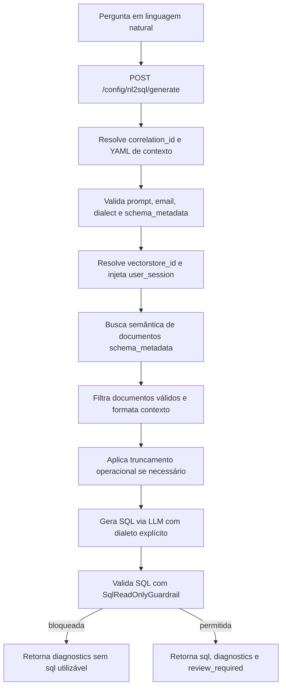

# Manual técnico, executivo, comercial e estratégico: NL2SQL

## 1. O que é esta feature

NL2SQL, nesta plataforma, é a capacidade de receber uma pergunta em linguagem natural, recuperar metadados relevantes do schema do banco, pedir ao motor de geração uma proposta de SQL no dialeto correto e devolver essa SQL como rascunho revisável, nunca como execução automática cega.

Na implementação atual, essa capacidade aparece principalmente por um endpoint dedicado de administração e por uma tool de runtime baseada em schema metadata vetorial. O nome mais técnico da família é `schema_rag_sql`, mas o valor de produto entregue é NL2SQL governado.

Em linguagem simples, o produto não tenta adivinhar uma query “de cabeça”. Ele primeiro procura um mapa técnico do banco, seleciona só o pedaço relevante desse mapa e só depois pede a SQL ao modelo.

## 2. Que problema ela resolve

O problema real do NL2SQL não é apenas “traduzir português para SQL”. O problema real é transformar intenção de negócio em consulta revisável em bancos que, na prática, costumam ser difíceis de ler.

Esses bancos costumam ter:

- milhares de tabelas;
- milhares de colunas;
- nomenclaturas legadas;
- siglas internas pouco intuitivas;
- joins complexos;
- comentários inconsistentes ou ausentes em parte do schema.

Sem uma abordagem estruturada, a geração de SQL tende a falhar por três motivos.

O primeiro é excesso de contexto. Jogar o schema inteiro no prompt destrói foco, aumenta custo e degrada qualidade.

O segundo é ambiguidade semântica. Nomes técnicos como `tb_mov_cab`, `id_cli`, `cd_emp` ou `vl_tot` raramente explicam por si mesmos o significado de negócio.

O terceiro é risco operacional. Mesmo quando a SQL “parece certa”, ela pode estar destrutiva, incompleta ou ligada à tabela errada.

NL2SQL resolve isso com recuperação semântica de schema, contexto truncado, dialeto explícito, guardrail somente leitura e revisão humana obrigatória.

## 3. Visão conceitual

Conceitualmente, o NL2SQL desta base é um pipeline de quatro camadas.

### 3.1. Catálogo técnico do schema

O banco de origem é lido e seus metadados são gravados no catálogo `dbschemas`. Esse catálogo não guarda só nomes técnicos. Ele também suporta `business_name`, descrição de tabela, descrição de coluna, PK, FK e amostras quando houver opt-in explícito.

### 3.2. Exportação semântica do catálogo

O catálogo `dbschemas` é exportado em documentos `schema_metadata`, com conteúdo estruturado por tabela, colunas, relações e descrições. Esses documentos são preparados para indexação vetorial.

### 3.3. Recuperação semântica do contexto

Quando a pergunta chega, o runtime não consulta o banco inteiro. Ele busca apenas os documentos semanticamente mais relevantes no vector store configurado para aquele tenant e para aquele schema metadata.

### 3.4. Geração de SQL com guardrails

O contexto recuperado é inserido em um prompt com dialeto explícito, e o motor gera uma proposta de SQL. Depois disso, o resultado passa pelo `SqlReadOnlyGuardrail`, que bloqueia o que não for seguro como consulta de leitura.

## 4. Visão tática

Taticamente, NL2SQL é mais valioso quando a equipe tem perguntas abertas de negócio, mas não quer depender de alguém navegando manualmente por um schema enorme.

Ele é especialmente adequado para:

- exploração analítica inicial;
- descoberta de joins e tabelas candidatas;
- apoio a suporte técnico e operações;
- aceleração de desenho de consultas em domínios legados;
- ambientes em que os nomes físicos do banco não representam bem o vocabulário do negócio.

Ele é menos adequado quando a consulta já é conhecida, recorrente e aprovada, porque nesse caso o caminho mais estável tende a ser o SQL governado persistido no catálogo, não a regeneração semântica a cada uso.

## 5. Visão técnica

Tecnicamente, o fluxo dedicado de NL2SQL está centrado em quatro peças.

### 5.1. Endpoint HTTP dedicado

O boundary público é `POST /config/nl2sql/generate`. O endpoint resolve `correlation_id`, contexto YAML e autorização, e então delega ao serviço dedicado.

### 5.2. Serviço `Nl2SqlService`

Esse serviço valida entrada, injeta `user_session`, fixa o dialeto em `schema_metadata.sql_dialect`, resolve o `vectorstore_id`, chama a factory de schema RAG, aplica o guardrail somente leitura e monta a resposta padronizada com diagnósticos.

### 5.3. `SqlSchemaRagToolFactory`

Essa factory executa a busca no vector store, filtra apenas documentos `schema_metadata`, formata contexto, aplica truncamento operacional e chama o LLM com baixa temperatura para reduzir variação desnecessária na SQL.

### 5.4. Guardrail de somente leitura

Mesmo quando a geração produz SQL, o resultado só é exposto como SQL utilizável se o `SqlReadOnlyGuardrail` autorizar. Caso contrário, o endpoint responde sem expor a query final como SQL pronta.

## 6. Visão executiva

Para liderança, o valor do NL2SQL é reduzir dependência de especialistas em banco nas etapas iniciais de investigação e desenho de consulta, sem abrir mão de governança.

Em vez de escolher entre lentidão manual e automação cega, a plataforma oferece um meio-termo: uma proposta acelerada, com rastreabilidade, diagnósticos e revisão humana obrigatória.

Isso melhora produtividade sem transformar o runtime em um executor perigoso de SQL livre.

## 7. Visão comercial

Comercialmente, NL2SQL responde a uma dor muito concreta de clientes com legado de dados: “eu sei o que quero perguntar, mas meu banco é grande demais e os nomes técnicos não ajudam”.

O diferencial real não é “IA que escreve consulta”. O diferencial real é: a plataforma entende melhor schemas grandes porque trabalha com recuperação vetorial de metadados, comentários e nomes de negócio quando existirem, e devolve uma proposta revisável com barreira de segurança.

Isso é especialmente forte em contas com ERP, PDV, CRM ou bases integradas que cresceram organicamente ao longo dos anos.

## 8. Visão estratégica

Estratégicamente, NL2SQL fortalece a plataforma em três frentes.

A primeira é reutilização de ativos de dados. O schema metadata deixa de ser só catálogo interno e vira base operacional para IA aplicada.

A segunda é governança. A plataforma transforma um caso de alto risco, que seria geração livre de SQL, em fluxo assistido com validação e revisão.

A terceira é escalabilidade semântica. Em vez de depender da legibilidade do nome físico da coluna, a plataforma passa a depender mais da qualidade do documento semântico de schema, o que é uma base muito melhor para evoluir em bancos grandes.

## 9. Por que isso é ideal para bancos enormes e nomes pouco significativos

Este ponto não é marketing vazio. Ele está sustentado pelo desenho real do código.

### 9.1. O sistema não injeta o schema inteiro no prompt

Em bases com milhares de tabelas e milhares de colunas, mandar o schema completo para o modelo seria ineficiente e ruim para a qualidade. O código evita isso fazendo busca semântica por `top_k` e truncamento operacional do contexto antes de chamar o LLM.

### 9.2. O catálogo suporta mais do que nome técnico

O pipeline de schema metadata persiste `business_name`, descrição de tabela e descrição de coluna, além dos nomes físicos. O exportador usa isso para construir os documentos `schema_metadata` pesquisáveis.

Na prática, isso é o que ajuda quando o banco usa nomes pouco significativos. O modelo não fica preso apenas a `id_x`, `cd_y` ou `tb_z`. Ele pode receber também a camada de significado disponível no catálogo.

### 9.3. O pipeline lê comentários do banco quando eles existem

Os readers de schema carregam comentários de coluna em PostgreSQL, MSSQL e Oracle. Isso amplia a chance de o índice vetorial capturar semântica útil além do nome bruto da coluna.

### 9.4. O problema passa a ser “qual contexto relevante recuperar”, não “como decorar o banco inteiro”

Essa mudança de foco é exatamente o que torna a abordagem mais adequada para bancos grandes. Em vez de depender da memória total do modelo ou da navegação manual do analista por centenas de tabelas, o sistema tenta recuperar primeiro o subconjunto tecnicamente mais promissor.

### 9.5. O desempenho e a qualidade continuam dependentes da qualidade do metadata

Isso não significa que qualquer schema legado vira excelente automaticamente. Se o catálogo estiver pobre, sem descrições e sem nomes de negócio úteis, a qualidade do NL2SQL também cai. O sistema é ideal para esse cenário porque a arquitetura foi desenhada para enfrentá-lo melhor do que uma geração ingênua, não porque exista garantia mágica de acerto.

## 10. Conceitos necessários para entender

### 10.1. `schema_metadata`

É o conjunto de documentos que representam o schema de forma pesquisável: banco, schema, tabela, coluna, PK, FK e descrições associadas.

### 10.2. `vectorstore_id`

É o identificador do índice vetorial onde esses documentos foram ingeridos. Sem ele, o runtime dedicado de NL2SQL não tem de onde recuperar contexto.

### 10.3. `sql_dialect`

É o dialeto SQL aplicado tanto no prompt quanto no guardrail. O fluxo dedicado aceita apenas `postgresql`, `mysql` e `mssql`.

### 10.4. `top_k`

É a largura máxima da recuperação semântica. Quanto maior, mais documentos entram no contexto. Quanto menor, menor o ruído, mas também menor a cobertura.

### 10.5. `review_required`

É o sinal explícito de que a SQL proposta precisa de revisão humana antes de salvar, publicar ou executar.

### 10.6. `SqlReadOnlyGuardrail`

É a barreira que valida se a SQL é somente leitura. Se não for, o endpoint bloqueia a resposta como SQL pronta.

### 10.7. `source_hint`

É o indício operacional da origem do contexto YAML usado para a geração. Isso ajuda auditoria e suporte.

## 11. Como a feature funciona por dentro

O fluxo dedicado começa no router `config_nl2sql_router`. O endpoint recebe prompt, e-mail do operador, dialeto, `top_k` e uma forma de resolver o YAML de contexto.

O YAML pode chegar inline, como dicionário em memória, por caminho de arquivo, por texto YAML inline ou por payload criptografado compatível com o resolvedor compartilhado.

Depois de resolver o contexto e o `correlation_id`, o router chama `Nl2SqlService.generate_sql`.

O serviço faz a validação inicial.

- `yaml_config` precisa ser mapeamento válido.
- `prompt` não pode ser vazio.
- `user_email` não pode ser vazio.
- `dialect` precisa estar entre os suportados.

Na sequência, o serviço prepara o YAML de trabalho.

- garante `schema_metadata` válido;
- exige `schema_metadata.vectorstore_id`;
- fixa `schema_metadata.sql_dialect` com o dialeto da requisição;
- injeta `user_session.user_email` e `user_session.correlation_id`.

Com isso pronto, a `SqlSchemaRagToolFactory` entra em ação.

Ela resolve o vector store, executa a busca semântica por schema metadata, filtra apenas documentos válidos desse tipo, formata o contexto e aplica truncamento se o volume ficar acima do limite operacional.

Depois, monta o prompt com o contexto recuperado e pede a SQL ao LLM configurado no YAML. Se a geração falhar ou vier vazia, o fluxo retorna `success=false` com diagnóstico estruturado.

Se a SQL vier, o serviço ainda passa o resultado pelo guardrail somente leitura. Se o guardrail bloquear, a resposta volta sem SQL utilizável. Só se o guardrail autorizar é que a resposta retorna `success=true` com SQL pronta para revisão.

## 12. Divisão em etapas ou submódulos

### 12.1. ETL do catálogo de schema

Esse submódulo extrai metadados do banco de origem e grava em `dbschemas`. Ele registra nome técnico, nome de negócio quando houver, descrições, chaves e, opcionalmente, `sample_rows` por opt-in explícito.

Valor entregue: uma base canônica e persistida de entendimento estrutural do banco.

### 12.2. Exportação para documentos `schema_metadata`

Esse submódulo lê `dbschemas` e gera documentos por tabela, prontos para ingestão vetorial. O exportador marca explicitamente o `document_type=schema_metadata`.

Valor entregue: transformar catálogo relacional em conteúdo semanticamente pesquisável.

### 12.3. Ingestão vetorial

Esse submódulo leva os documentos exportados para o vector store configurado. No exemplo PDV, o alvo é Qdrant com ID `schema_metadata_pdv`.

Valor entregue: recuperação semântica rápida do pedaço relevante do schema.

### 12.4. Geração dedicada de SQL

Esse submódulo recebe a pergunta e usa o vector store para recuperar o contexto do schema antes de chamar o LLM.

Valor entregue: reduzir alucinação de tabela, coluna e join.

### 12.5. Guardrail de leitura

Esse submódulo protege contra SQL destrutiva, multi-statement ou fora do contrato de consulta segura.

Valor entregue: impedir que a geração seja confundida com autorização de execução.

### 12.6. Workbench administrativo

Esse submódulo expõe a experiência de operação humana: prompt, dialeto, `top_k`, saída da SQL, integração com query governada e testes seguros.

Valor entregue: uma ponte controlada entre descoberta assistida e catálogo governado.

## 13. Fluxo principal ponta a ponta

Esse fluxo deixa claro por que a feature é adequada para schemas grandes: o volume do banco é reduzido a um subconjunto relevante antes da geração da query.

## 14. Contratos, entradas e saídas

As entradas do endpoint dedicado são:

- `prompt`
- `user_email`
- `dialect`
- `yaml_config`
- `yaml_config_path`
- `yaml_inline_content`
- `encrypted_data`
- `top_k`
- `correlation_id`

As saídas principais são:

- `success`
- `correlation_id`
- `sql`
- `raw_response`
- `warnings`
- `diagnostics`
- `review_required`
- `execution_context`

O `execution_context` devolve metadados seguros, como `vectorstore_id`, `top_k`, `dialect`, `tool_catalog_id` e resumo do contexto de schema usado na geração.

## 15. O que acontece em caso de sucesso

Quando o caminho feliz fecha, estes sinais aparecem.

- `success=true`
- `sql` preenchida
- `review_required=true`
- diagnóstico `NL2SQL_VECTORSTORE_SELECTED`
- diagnóstico `NL2SQL_SQL_GUARDRAIL_ALLOWED`
- diagnóstico `NL2SQL_SQL_READY_FOR_REVIEW`

Na prática, sucesso aqui significa “proposta revisável aprovada pelo guardrail”, não “consulta já autorizada para produção”.

## 16. O que acontece em caso de erro

Os cenários principais confirmados no código são estes.

### 16.1. Contexto YAML inválido

Se o `yaml_config` não for um mapeamento válido ou se o resolvedor não conseguir montar o contexto, o fluxo falha cedo.

### 16.2. Prompt ou e-mail ausentes

Sem `prompt` ou `user_email`, o serviço rejeita a requisição.

### 16.3. Dialeto inválido

Se o dialeto não estiver entre `postgresql`, `mysql` e `mssql`, a geração não começa.

### 16.4. Ausência de `schema_metadata`

O fluxo dedicado exige o bloco `schema_metadata` no YAML.

### 16.5. Ausência de `vectorstore_id`

Sem `schema_metadata.vectorstore_id`, não existe recuperação semântica do schema.

### 16.6. Contexto truncado

Quando o conjunto recuperado fica grande demais, o contexto é truncado antes da chamada ao LLM. O sistema não trata isso como falha fatal, mas registra diagnóstico `NL2SQL_SCHEMA_CONTEXT_TRUNCATED`.

### 16.7. Falha de geração

Se o motor não consegue produzir SQL utilizável com o contexto disponível, o endpoint devolve `success=false` com diagnóstico `NL2SQL_GENERATION_FAILED`.

### 16.8. Bloqueio pelo guardrail

Se a SQL for destrutiva, insegura ou fora do contrato somente leitura, o endpoint responde sem expor essa SQL como proposta válida, com diagnóstico `NL2SQL_SQL_GUARDRAIL_BLOCKED`.

## 17. Observabilidade e diagnóstico

NL2SQL foi desenhado para ser auditável.

Os principais elementos de observabilidade são:

- `correlation_id` na entrada e na saída;
- logs do router e do serviço;
- `source_hint` da origem do YAML;
- `vectorstore_id` e `top_k` no `execution_context`;
- contagem de documentos de schema usados;
- indicação de truncamento do contexto;
- diagnósticos estruturados por código.

Na UI administrativa, há instrução explícita para baixar o log correlacionado quando a geração parecer incoerente com o schema. Isso mostra que a operação esperada inclui investigação, não só uso feliz.

## 18. Relação com SQL governado do catálogo

É importante não confundir NL2SQL com o catálogo governado de queries e procedures.

O NL2SQL serve melhor para descoberta, desenho inicial e aceleração de rascunho. Depois que uma consulta fica aprovada, estável e recorrente, o caminho mais forte passa a ser registrá-la no catálogo governado e operar com query persistida.

Em termos simples:

- NL2SQL é bom para descobrir e prototipar com segurança assistida.
- SQL governado é melhor para operar com repetição, previsibilidade e menor risco.

## 19. Como a UI administrativa trabalha

A tela administrativa de integrações SQL já usa o endpoint dedicado de NL2SQL e não reenfileira a geração por `/agent/execute`.

Ela expõe:

- prompt em linguagem natural;
- seleção obrigatória de dialeto;
- ajuste de `top_k`;
- saída principal da query proposta;
- cópia da SQL;
- ação para usar a SQL na query governada;
- testes seguros da query e da procedure;
- checklist de prontidão e menção explícita ao guardrail SQL.

Isso importa porque o produto deixa claro para o operador que NL2SQL é um workbench assistido, não um executor automático escondido atrás de uma interface simpática.

## 20. Vantagens práticas

As vantagens reais confirmadas pelo desenho do código são estas.

- melhora a navegação de schemas enormes sem depender de inspeção manual tabela por tabela;
- lida melhor com nomes físicos ruins quando existem `business_name`, comentários e descrições no catálogo;
- reduz a necessidade de mandar o schema inteiro ao modelo;
- fixa dialeto SQL e reduz erro de sintaxe por banco;
- bloqueia SQL destrutiva no guardrail central;
- separa geração, revisão e execução;
- permite capturar diagnóstico útil quando a geração falha;
- se conecta bem ao fluxo posterior de SQL governado.

## 21. Exemplos práticos guiados

### 21.1. Banco grande com nomes ruins

Cenário: um banco legado tem milhares de colunas e nomes como `cd_cli`, `fl_sit`, `vl_tot`, `tb_mov_cab`.

O que ajuda o NL2SQL: o runtime não depende apenas desses nomes brutos. Ele pode recuperar documentos de schema com `business_name`, descrição de tabela e descrição de coluna, quando o catálogo já estiver enriquecido.

Valor prático: a chance de o modelo montar uma consulta coerente cresce porque o contexto passa a carregar significado adicional.

### 21.2. Pergunta exploratória de negócio

Cenário: “qual foi o faturamento por loja?”

O que acontece: o endpoint recupera as tabelas e relações mais prováveis, gera uma proposta de `SELECT`, valida no guardrail e devolve uma query para revisão humana.

Valor prático: o operador ganha um rascunho útil sem precisar abrir o banco inteiro e explorar tudo manualmente.

### 21.3. SQL destrutiva bloqueada

Cenário: um operador pede algo que levaria a `DROP TABLE`.

O que acontece: a geração pode até devolver algo textual, mas o guardrail bloqueia e a resposta final não expõe essa SQL como saída válida.

Valor prático: o produto protege a operação de transformar uma pergunta perigosa em consulta acionável.

### 21.4. Contexto grande demais

Cenário: a recuperação trouxe muitos documentos relevantes.

O que acontece: o contexto é truncado para respeitar o limite operacional, e o diagnóstico informa esse fato.

Valor prático: o sistema não degrada silenciosamente. Ele sinaliza a limitação observada.

## 22. Explicação 101

Imagine um depósito gigantesco de arquivos, todos com nomes ruins e pouca padronização. Pedir para alguém encontrar “as informações de faturamento por loja” sem ajuda seria lento e incerto.

O NL2SQL desta plataforma cria primeiro um catálogo pesquisável desses arquivos. Quando chega a pergunta, ele não abre o depósito inteiro. Ele procura só as pastas mais parecidas com o pedido, separa esse material e então pede para o modelo montar a consulta.

Depois, um fiscal confere se a consulta é apenas leitura. Se não for, ela é barrada. Esse é o coração da feature.

## 23. Limites e pegadinhas

Também existem limites importantes.

- Se o catálogo de schema estiver pobre, o NL2SQL perde qualidade.
- `top_k` não resolve sozinho um metadata ruim.
- Guardrail somente leitura não garante que a lógica de negócio esteja perfeita; ele garante apenas que a query não é destrutiva dentro do contrato analisado.
- `review_required=true` não é opcional cosmético; é parte do desenho da feature.
- O caminho é excelente para schemas grandes, mas continua dependente de disciplina na ingestão e enriquecimento do metadata.

## 24. Troubleshooting

### 24.1. O endpoint responde sem SQL

Sintoma: `success=false` e `sql=null`.

Causas prováveis: falha de geração, contexto de schema insuficiente, YAML inválido ou bloqueio do guardrail.

### 24.2. A SQL parece genérica demais

Sintoma: a consulta não usa tabelas ou colunas tão específicas quanto esperado.

Causas prováveis: `top_k` baixo demais, catálogo de schema pouco enriquecido ou descrições insuficientes para desambiguar nomes técnicos ruins.

### 24.3. O banco é enorme e o contexto foi truncado

Sintoma: diagnóstico `NL2SQL_SCHEMA_CONTEXT_TRUNCATED`.

Causa provável: a recuperação trouxe mais conteúdo do que o limite operacional permite enviar ao LLM.

### 24.4. A query foi bloqueada

Sintoma: diagnóstico `NL2SQL_SQL_GUARDRAIL_BLOCKED`.

Causa provável: a SQL proposta não foi reconhecida como somente leitura, ou veio com padrão destrutivo, múltiplas sentenças ou parse inadequado.

### 24.5. A geração falha logo no início

Sintoma: erro HTTP 400 antes de qualquer proposta.

Causa provável: ausência de `schema_metadata`, `vectorstore_id`, `prompt`, `user_email` ou dialeto válido.

## 25. Impacto técnico

Tecnicamente, NL2SQL reduz acoplamento entre entendimento humano do problema e conhecimento manual do schema físico. Ele também reaproveita o investimento em catálogo de dados, comentários e nomes de negócio para melhorar o contexto entregue à IA.

## 26. Impacto executivo

Executivamente, ele reduz o tempo para sair de uma pergunta de negócio até uma proposta de consulta revisável, sem colocar a organização no extremo de liberar SQL livre sem proteção.

## 27. Impacto comercial

Comercialmente, é uma capacidade forte para contas com legado pesado de dados, especialmente onde a dificuldade não é só escrever SQL, mas entender um schema grande, técnico e mal nomeado.

## 28. Impacto estratégico

Estratégicamente, a feature transforma metadados de banco em ativo de IA operacional. Isso posiciona a plataforma não apenas como executor de agentes, mas como camada de inteligência aplicada sobre patrimônios de dados complexos.

## 29. Como colocar para funcionar

O caminho confirmado no código exige:

- YAML com `schema_metadata.enabled=true` quando aplicável;
- `schema_metadata.vectorstore_id` válido;
- dialeto coerente;
- vector store de schema metadata disponível;
- runtime LLM configurado no YAML;
- usuário com permissão `config.generate` para usar o endpoint administrativo.

No exemplo PDV do repositório, o arquivo de runtime dedicado é [app/yaml/rag-config-pdv-nl2sql.yaml](app/yaml/rag-config-pdv-nl2sql.yaml), apoiado por ingestão e ETL específicos de schema metadata em [app/yaml/rag-config-pdv-schema-metadata-ingest.yaml](app/yaml/rag-config-pdv-schema-metadata-ingest.yaml) e [app/yaml/rag-config-pdv-schema-metadata-etl.yaml](app/yaml/rag-config-pdv-schema-metadata-etl.yaml).

## 30. Checklist de entendimento

- Entendi que NL2SQL aqui é geração assistida e revisável, não execução automática.
- Entendi o papel do `vectorstore_id` de schema metadata.
- Entendi por que a arquitetura é adequada para bancos enormes.
- Entendi por que `business_name` e descrições ajudam quando o schema é mal nomeado.
- Entendi o papel do `top_k` e do truncamento operacional.
- Entendi o guardrail somente leitura.
- Entendi a diferença entre NL2SQL e SQL governado persistido.
- Entendi como investigar falhas pelo `correlation_id` e pelos diagnósticos.

## 31. Evidências no código

- `src/api/routers/config_nl2sql_router.py`
  - Motivo da leitura: endpoint dedicado de NL2SQL.
  - Comportamento confirmado: `POST /config/nl2sql/generate`, permissão `config.generate`, resolução de YAML e `correlation_id`.

- `src/api/schemas/nl2sql_models.py`
  - Motivo da leitura: contrato HTTP estável.
  - Comportamento confirmado: request com `dialect`, `top_k` e múltiplas formas de resolver YAML; response com `review_required`, `diagnostics` e `execution_context`.

- `src/api/services/nl2sql_service.py`
  - Motivo da leitura: caso de uso principal.
  - Comportamento confirmado: validação de entrada, preparação do YAML, chamada da factory, guardrail somente leitura e montagem dos diagnósticos `NL2SQL_*`.

- `src/agentic_layer/tools/domain_tools/schema_rag_tools/sql_schema_rag_factory.py`
  - Motivo da leitura: núcleo do motor semântico.
  - Comportamento confirmado: busca vetorial por schema metadata, filtro de `document_type`, truncamento operacional, geração de SQL via LLM e resultado estruturado.

- `src/etl_layer/providers/data/table_schema_metadata_processor.py`
  - Motivo da leitura: extração do schema para o catálogo.
  - Comportamento confirmado: captura de comentários de coluna, PK, FK e `sample_rows` apenas com opt-in explícito.

- `src/ingestion_layer/schema_metadata/schema_metadata_exporter.py`
  - Motivo da leitura: transformação do catálogo em documento pesquisável.
  - Comportamento confirmado: exportação com `document_type=schema_metadata`, `business_name`, descrições e estrutura por tabela/coluna.

- `src/schema_metadata/readers.py`
  - Motivo da leitura: origem das descrições e comentários.
  - Comportamento confirmado: leitura de comentários/descrições de coluna em PostgreSQL, MSSQL e Oracle.

- `src/schema_metadata/writer.py`
  - Motivo da leitura: persistência do catálogo semântico.
  - Comportamento confirmado: gravação de `business_name` e `description` para tabelas e colunas em `dbschemas`.

- `app/yaml/rag-config-pdv-nl2sql.yaml`
  - Motivo da leitura: runtime real de exemplo.
  - Comportamento confirmado: `schema_metadata.vectorstore_id=schema_metadata_pdv`, dialeto PostgreSQL e runtime dedicado NL2SQL.

- `app/yaml/rag-config-pdv-schema-metadata-ingest.yaml`
  - Motivo da leitura: ingestão vetorial do schema.
  - Comportamento confirmado: ingestão de documentos de schema metadata para uso por NL2SQL, com `include_sample_rows=false`.

- `app/yaml/rag-config-pdv-schema-metadata-etl.yaml`
  - Motivo da leitura: extração para o catálogo técnico.
  - Comportamento confirmado: ETL do schema PDV para `dbschemas`, com `include_sample_rows=false` por padrão.

- `app/ui/static/ui-admin-plataforma-sql-natural.html`
  - Motivo da leitura: experiência administrativa do produto.
  - Comportamento confirmado: workbench de NL2SQL, checklist de prontidão, escolha de dialeto, ajuste de `top_k`, menção ao guardrail e integração com SQL governado.

- `tests/integration/test_admin_nl2sql_api.py`
  - Motivo da leitura: prova ponta a ponta do endpoint.
  - Comportamento confirmado: geração revisável, bloqueio de SQL destrutiva, preservação de `correlation_id` e uso de YAML PDV real.

- `tests/frontend/admin_integracoes_contract.test.js`
  - Motivo da leitura: contrato da UI de integrações SQL.
  - Comportamento confirmado: a tela usa o endpoint dedicado de NL2SQL e não redireciona a geração para `/agent/execute`.
