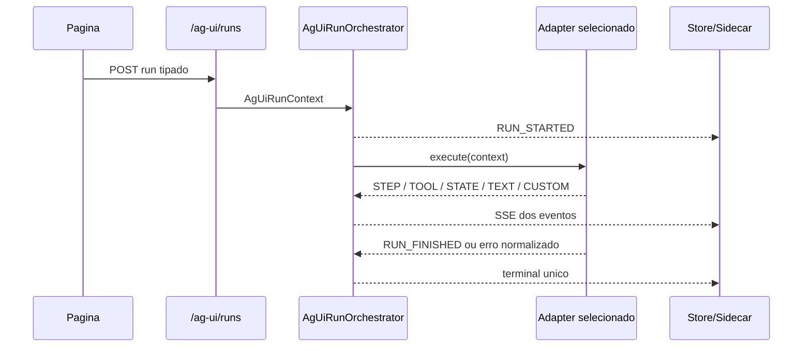

# Manual tecnico, operacional e de uso: implementacao de AG-UI no repositorio

## 1. Superficie implementada

O slice AG-UI deste repositorio e composto por um boundary HTTP FastAPI, um conjunto de modelos Pydantic estritos, um orchestrator de lifecycle, um registry explicito de adapters, um event store com provider canonico e sanitizacao, um runtime compartilhado em JavaScript puro e um conjunto de paginas demo de varejo que exercitam o contrato.

O recorte executavel confirmado no codigo inclui estas superficies publicas.

1. GET /ag-ui/capabilities.
2. POST /ag-ui/runs.
3. GET /ag-ui/runs/{run_id}/events.
4. GET /ag-ui/threads/{thread_id}/events.

O recorte executavel confirmado do lado web inclui estas superficies de reuso.

1. packages/ag-ui-runtime/index.js.
2. app/ui/static/js/shared/ag-ui-client.js.
3. app/ui/static/js/shared/ag-ui-state-store.js.
4. app/ui/static/js/shared/ag-ui-sidecar-chat.js.
5. app/ui/static/js/shared/ag-ui-dashboard-renderer.js.
6. app/ui/static/js/shared/ag-ui-dashboard-validator.js.
7. app/ui/static/js/shared/ag-ui-retail-demo-page.js.

Detalhamento técnico por etapa:

1. [Fronteira de protocolo](README-TECNICO-AG-UI-FRONTEIRA-DE-PROTOCOLO.md)
2. [Borda HTTP dedicada](README-TECNICO-AG-UI-BORDA-HTTP-DEDICADA.md)
3. [Orquestração do lifecycle](README-TECNICO-AG-UI-ORQUESTRACAO-DO-LIFECYCLE.md)
4. [Registry e adapters](README-TECNICO-AG-UI-REGISTRY-E-ADAPTERS.md)
5. [Domínio varejo demo](README-TECNICO-AG-UI-DOMINIO-VAREJO-DEMO.md)
6. [Runtime compartilhado do frontend](README-TECNICO-AG-UI-RUNTIME-COMPARTILHADO-DO-FRONTEND.md)
7. [Replay e auditoria](README-TECNICO-AG-UI-REPLAY-E-AUDITORIA.md)

## 2. Endpoints publicos

### 2.1. GET /ag-ui/capabilities

Objetivo: discovery das capabilities expostas por executionKind.

Caracteristicas confirmadas.

1. Usa a mesma permissao de execucao do run AG-UI.
2. Pode filtrar por executionKind.
3. Falha com 404 para executionKind desconhecido.
4. Nao expõe SQL cru, DSN ou segredo.

No estado atual, o discovery inclui executionKind agent, deepagent, workflow, retail_demo e erp_backoffice_demo. O payload agora e versionado e explicita `contractVersion`, `eventContractVersion`, `supportsInterrupt`, `supportsHil`, `supportsResume`, `resumeSchema`, `domain`, `requiredPermissions`, `examples`, `uiSpecs` estruturado e `uiSpecNames` como ponte de compatibilidade. Os dominios governados agora saem de um registry comum de capability packs, o que evita hardcode duplicado no discovery e no runtime.

### 2.2. POST /ag-ui/runs

Objetivo: iniciar ou continuar um run AG-UI por streaming SSE.

Caracteristicas confirmadas.

1. Responde com text/event-stream.
2. Devolve X-Correlation-Id no header.
3. Exige autenticacao por X-API-Key ou sessao.
4. Exige uma fonte explicita de configuracao.
5. Aceita resume no mesmo endpoint, sem endpoint paralelo AG-UI de continue.

### 2.3. GET /ag-ui/runs/{run_id}/events

Objetivo: replay ordenado e sanitizado dos eventos de um run.

Caracteristicas confirmadas.

1. Escopo run.
2. Ordenacao por sequence.
3. Payload sanitizado antes da devolucao.

### 2.4. GET /ag-ui/threads/{thread_id}/events

Objetivo: replay ordenado da thread inteira, nao apenas de um run.

Caracteristicas confirmadas.

1. Escopo thread.
2. Ordenacao monotona por run e sequence.
3. Mesmo controle de autenticacao e sanitizacao.

## 3. Contrato do request

O contrato principal e AgUiRunRequest. Ele foi modelado com extra="forbid", ou seja, o boundary tipado rejeita campos que saiam do contrato oficial.

Campos relevantes confirmados.

1. threadId.
2. runId.
3. executionKind.
4. user_email.
5. parentRunId.
6. input.
7. metadata.
8. yaml_config.
9. yaml_inline_content.
10. encrypted_data.
11. resume.

Existe um helper has_config_source() no modelo. O router usa esse conceito para falhar fechado quando nenhuma fonte explicita de configuracao e enviada.

### 3.1. Exemplo minimo de execucao retail_demo

```json
{
  "threadId": "cockpit-vendas",
  "runId": "cockpit-vendas-1714720000000",
  "executionKind": "retail_demo",
  "user_email": "gestor@empresa.com",
  "input": {
    "message": "Analise o periodo atual",
    "capability": "sales_summary",
    "parameters": {
      "p1": "2026-04-01T00:00:00",
      "p2": "2026-05-01T00:00:00"
    },
    "context": {
      "screenId": "cockpit-vendas",
      "screenTitle": "Cockpit de vendas"
    }
  },
  "metadata": {
    "screenId": "cockpit-vendas",
    "screenTitle": "Cockpit de vendas",
    "yamlPath": "app/yaml/ag-ui-pdv-vendas-demo.yaml"
  },
  "yaml_inline_content": "schema_version: \"1.0.0\"\n..."
}
```

### 3.2. Exemplo de resume agentic pelo mesmo endpoint

```json
{
  "threadId": "orcamentos",
  "runId": "orcamentos-resume-1",
  "executionKind": "agent",
  "user_email": "aprovador@empresa.com",
  "parentRunId": "orcamentos-1",
  "input": {
    "message": "Continuar"
  },
  "yaml_config": {
    "multi_agents": []
  },
  "resume": [
    {
      "interruptId": "interrupt-1",
      "status": "resolved",
      "payload": {
        "decisions": [
          {
            "type": "approve"
          }
        ]
      }
    }
  ]
}
```

### 3.3. Exemplo de dashboard dinamico

```json
{
  "threadId": "dashboard-dinamico",
  "runId": "dashboard-dinamico-1",
  "executionKind": "retail_demo",
  "user_email": "diretoria@empresa.com",
  "input": {
    "message": "Monte um painel executivo",
    "capability": "dashboard_dynamic",
    "dashboardSpec": {
      "version": "1.0",
      "title": "Painel executivo",
      "layout": {
        "kind": "grid",
        "columns": 12,
        "rowHeight": 120,
        "gap": 12
      },
      "widgets": [],
      "dataSources": [],
      "narrative": {
        "summary": "Exemplo",
        "insights": ["Exemplo"]
      },
      "refreshPolicy": {
        "mode": "manual",
        "maxAgeSeconds": 300
      },
      "safety": {
        "htmlAllowed": false,
        "scriptAllowed": false,
        "freeSqlAllowed": false,
        "secretsAllowed": false,
        "correlationIdAllowed": false
      }
    }
  },
  "yaml_inline_content": "schema_version: \"1.0.0\"\n..."
}
```

## 4. Contrato dos eventos

Os eventos oficiais ficam em src/api/schemas/ag_ui_models.py. O conjunto confirmado por leitura de codigo e testes inclui lifecycle, mensagens, steps, tools, snapshots, deltas, custom events e outcome interrupt.

### 4.1. Eventos mais relevantes para a UI

1. RUN_STARTED.
2. RUN_FINISHED.
3. RUN_ERROR.
4. STEP_STARTED.
5. STEP_FINISHED.
6. TEXT_MESSAGE_START.
7. TEXT_MESSAGE_CONTENT.
8. TEXT_MESSAGE_END.
9. TOOL_CALL_START.
10. TOOL_CALL_ARGS.
11. TOOL_CALL_END.
12. TOOL_CALL_RESULT.
13. STATE_SNAPSHOT.
14. STATE_DELTA.
15. CUSTOM.

### 4.2. Outcome interrupt

O contrato nao cria um evento inventado so para HIL. Ele usa RUN_FINISHED com outcome.type = interrupt e interrupts[]. Isso e importante porque o terminal do run continua unico e tipado.

### 4.3. JSON Patch suportado

O backend aceita delta com add, remove, replace, move, copy e test. O store do frontend foi alinhado para suportar o mesmo conjunto.

## 5. Sequencia real de execucao



Esse fluxo mostra a separacao central da implementacao. O router monta contexto. O orchestrator governa lifecycle. O adapter produz dominio. O frontend so consome eventos.

## 6. Registry e orchestrator

O registry fica em src/api/services/ag_ui_adapter_registry.py. Ele existe para evitar fallback implicito ou wiring hardcoded espalhado. O default registra quatro executionKinds.

1. agent.
2. deepagent.
3. workflow.
4. retail_demo.

Se um executionKind nao estiver registrado, o orchestrator termina com erro estruturado. O core nao inventa adapter.

O orchestrator fica em src/api/services/ag_ui_run_orchestrator.py e tem responsabilidades bem delimitadas.

1. Emitir RUN_STARTED.
2. Repassar eventos do adapter.
3. Persistir eventos se houver event store.
4. Bloquear adapters que tentem emitir RUN_STARTED de novo.
5. Encerrar automaticamente com success quando o adapter nao emite terminal.
6. Traduzir excecoes controladas e inesperadas para RUN_ERROR.

## 7. Adapters agentic suportados

### 7.1. agent

O adapter agent usa AgentOrchestrator por meio do helper comum de runtime. Ele suporta dois modos.

1. Execucao normal.
2. Resume AG-UI com payload de decisions.

Se o payload de resume vier sem decisions validas, o fluxo falha fechado com AG_UI_RESUME_INVALID_PAYLOAD.

### 7.2. deepagent

O adapter deepagent usa DeepAgentSupervisor e publica stream AG-UI equivalente ao agent no caminho feliz. O resume reutiliza o mesmo mecanismo de continuidade agentic suportado pelo helper comum.

### 7.3. workflow

O adapter workflow usa WorkflowOrchestrator e publica stream AG-UI minimo no caminho feliz. Falhas normalizadas viram RUN_ERROR. O resume AG-UI ja e suportado neste adapter por um executor de continuidade dedicado, que valida `interruptId`, traduz `decisions` para o contrato oficial de workflow e chama o service canônico de continuação antes de reemitir eventos AG-UI normalizados.

### 7.4. retail_demo

Esse adapter continua sendo o mais rico em termos de dominio visual pronto. Agora ele e entregue como capability pack governado, consumido pelo registry AG-UI comum, e continua suportando query governada e dashboard dinamico.

### 7.5. erp_backoffice_demo

Esse dominio foi adicionado como segundo capability pack governado. Ele publica a capability `fechar_caixa`, baseada no contrato de procedimento `prc_fechar_caixa` ja documentado no repositório, mas executada como fixture segura de preview para nao depender de DSN nem inventar schema de banco fora do contrato lido.

## 8. Capability packs governados

### 8.1. retail_demo

O catalogo de capabilities fechadas do retail_demo inclui estas entradas.

1. sales_summary.
2. checkout_funnel.
3. catalog_opportunities.
4. customer_segments.
5. dashboard_dynamic.

As protecoes tecnicas confirmadas nesse adapter sao essenciais.

1. Chaves como sql, raw_sql, sql_query e statement sao bloqueadas recursivamente.
2. Cada capability aponta para uma query aprovada.
3. Cada query e validada como read-only, com exatamente uma instrucao SELECT.
4. Parametros sao validados contra o catalogo da capability.
5. DATABASE_VAREJO_DSN e DATABASE_VAREJO_SCHEMA sao obrigatorios.

Isso significa que o browser nunca escolhe conexao, nunca injeta DSN e nunca manda SQL livre para execucao.

### 8.2. erp_backoffice_demo

O catalogo inicial do pack ERP/backoffice inclui uma capability governada.

1. fechar_caixa.

As protecoes tecnicas confirmadas nesse pack sao estas.

1. Chaves como sql, raw_sql, sql_query e statement sao bloqueadas recursivamente.
2. O discovery publica apenas o contrato do procedimento, sem expor `CALL`, segredo ou DSN.
3. O resultado atual e uma fixture governada de preview baseada no contrato `prc_fechar_caixa` lido no repositório.
4. Os parametros `p1` e `p2` continuam obrigatorios e escalares.

### 8.3. Como uma software house cria um pack seguro

O caminho seguro agora e este.

1. Definir um `execution_kind` exclusivo para o dominio.
2. Publicar capabilities com `inputSchema`, `examples`, `requiredPermissions` e `uiSpecs` sem vazar SQL, DSN ou segredos.
3. Bloquear SQL livre logo na entrada do payload AG-UI, antes de qualquer executor.
4. Executar apenas query, procedure ou fixture previamente aprovada no codigo ou em contrato real do repositório.
5. Registrar o pack no registry comum. Discovery e runtime passam a enxergar o novo dominio pelo mesmo ponto de registro.

## 9. Dashboard dinamico

### 9.1. Rota especial do retail_demo

Quando capability = dashboard_dynamic, o adapter nao segue o fluxo padrao de dyn_sql unico. Em vez disso, ele desvia para DashboardMaterializationService.

### 9.2. Eventos customizados emitidos

Os eventos customizados agora seguem o `eventPrefix` do `uiNamespace`. Quando o dashboard usa o namespace default de compatibilidade, os eventos continuam exatamente estes.

1. retail.dashboard.spec.started.
2. retail.dashboard.spec.validated.
3. retail.dashboard.data.bound.
4. retail.dashboard.widget.added.
5. retail.dashboard.render.ready.
6. retail.dashboard.validation.failed.

### 9.3. Estado inicial e estado final

O service sempre comeca com um `STATE_SNAPSHOT` na chave definida por `uiNamespace.stateKey`. No default compatível, essa chave continua sendo `retailDashboard`. Em caso de sucesso, o estado termina com `status=ready`. Em caso de falha de validacao, termina com `validation_failed` e `errors` estruturados.

### 9.4. Contrato da DashboardSpec

Os blocos estruturais confirmados sao estes.

1. version = 1.0.
2. layout grid.
3. widgets tipados.
4. dataSources com sourceType dyn_sql.
5. narrative.
6. refreshPolicy.
7. safety com cinco flags obrigatoriamente false.
8. uiNamespace com `specType`, `stateKey`, `eventPrefix` e `version`.

### 9.5. Tipos de widget confirmados

1. kpi.
2. line_chart.
3. bar_chart.
4. donut_chart.
5. table.
6. insight_card.
7. alert.
8. timeline.
9. ranking.

### 9.6. Regras de validacao mais importantes

1. Rejeicao de HTML e script.
2. Rejeicao de SQL ou query livre em strings ou chaves.
3. Rejeicao de segredos e correlation_id no payload.
4. Rejeicao de widget apontando para data source inexistente.
5. Rejeicao de parametro nao declarado em allowedParameters.
6. Rejeicao de layout impossivel ou sobreposicao de widgets.

## 10. Runtime compartilhado do frontend

### 10.1. Cliente SSE via POST

createAgUiSseClient faz fetch POST, nao EventSource tradicional. Esse ponto e importante porque o contrato exige corpo JSON no request. O cliente monta headers, injeta X-API-Key quando presente, le X-Correlation-Id de volta e parseia incrementalmente os blocos SSE.

O comportamento confirmado em teste mostra tambem que o cliente nao tenta reconectar por padrao. Isso evita replay implicito de POST, o que seria perigoso em execucao agentic.

### 10.2. Store de estado

createAgUiStateStore reconstrui o estado local da UI. Ele guarda run, messages, tools, state, activities, steps, interrupts, rawEvents, customEvents e lastEvent. Ele tambem aplica JSON Patch completo, inclusive move, copy e test.

### 10.3. Sidecar reutilizavel

createAgUiSidecarChat monta um aside com status, correlation_id, contexto, mensagens, tools, interrupcoes e formulario de envio. Ele integra o painel HIL compartilhado e pode postar resume AG-UI no mesmo endpoint, com protecao contra decisao duplicada pelo mesmo interruptId.

### 10.4. Fachada interna de pacote

packages/ag-ui-runtime/index.js reexporta o runtime compartilhado e fornece getHilContract(). Isso facilita reuso interno sem obrigar as paginas a importar sempre a arvore inteira de arquivos em app/ui/static/js/shared.

## 11. Paginas reais do repositorio

Os testes de contrato e Playwright confirmam que a implementacao nao vive apenas em componentes isolados. Ela aparece em paginas estaticas reais.

### 11.1. Hub de varejo demo

O hub AG-UI de varejo lista quatro telas.

1. Cockpit de vendas.
2. Checkout radar.
3. Catalogo central.
4. Dashboard dinamico.

Os testes tambem confirmam que essas paginas usam o endpoint /ag-ui/runs, o layout mestre da plataforma e o shell administrativo, sem acoplamento ao webchat legado.

### 11.2. Controller compartilhado das paginas

AgUiRetailDemoPageController concentra padroes comuns das paginas fixas.

1. Resolve API key do contexto padrao.
2. Exige user_email no contexto.
3. Exige YAML inline ou payload criptografado no contexto.
4. Monta threadId, runId, metadata e input padronizados.
5. Usa executionKind = retail_demo.
6. Atualiza a area principal a partir de STATE_SNAPSHOT.

Isso mostra que o frontend das demos ja foi desenhado como padrao de integracao, nao como paginas totalmente independentes.

## 12. Replay e event store

O event store AG-UI agora funciona por provider canônico.

1. Em development e teste, sem configuracao explicita, o replay usa InMemoryAgUiEventStore.
2. Fora de development/test, o provider precisa ser declarado explicitamente por AG_UI_EVENT_STORE_PROVIDER.
3. O provider duravel suportado hoje e postgres, persistindo em ag_ui.run_events.
4. Sem provider explicito fora de development/test, o backend falha fechado e nao cai silenciosamente para memoria.

O store tem caracteristicas importantes.

1. Thread-safe.
2. Append-only.
3. Ordenacao por sequence.
4. Idempotencia por run_id + sequence quando o payload e identico.
5. Erro explicito quando a mesma sequence chega com payload divergente.
6. Sanitizacao recursiva de campos sensiveis antes do replay.
7. Indexacao preparada para tenant_id quando o boundary autenticado trouxer esse contexto.

Campos como api_key, authorization, password, secret, token, dsn e encrypted_data sao redigidos para [REDACTED].

### 12.1. Variaveis do provider AG-UI

As variaveis operacionais confirmadas no codigo agora sao estas.

1. ENVIRONMENT.
2. AG_UI_EVENT_STORE_PROVIDER.
3. AG_UI_EVENT_STORE_DSN.
4. AG_UI_EVENT_STORE_SCHEMA.
5. AG_UI_EVENT_STORE_TABLE.
6. AG_UI_EVENT_STORE_POOL_MIN_SIZE.
7. AG_UI_EVENT_STORE_POOL_MAX_SIZE.
8. AG_UI_EVENT_STORE_POOL_MAX_IDLE.
9. AG_UI_EVENT_STORE_POOL_TIMEOUT_SECONDS.
10. AG_UI_EVENT_STORE_RETRY_ATTEMPTS.
11. AG_UI_EVENT_STORE_RETRY_MIN_SECONDS.
12. AG_UI_EVENT_STORE_RETRY_MAX_SECONDS.

Em linguagem simples, development/test pode continuar usando memoria para velocidade local. Produção e ambientes equivalentes nao podem depender disso. Nesses casos, AG_UI_EVENT_STORE_PROVIDER precisa estar configurado e o DSN do PostgreSQL precisa existir, senao o router AG-UI falha de forma explicita.

### 12.2. Tabela duravel e retencao

O provider PostgreSQL persiste o replay em ag_ui.run_events, criado pelo DDL scripts/sql/20260503_create_ag_ui_schema.sql.

Essa tabela guarda tenant_id opcional, correlation_id, thread_id, run_id, sequence, event_type, payload sanitizado e created_at. O indice unico run_id + sequence protege idempotencia de escrita. Indices por thread, correlation_id, tenant_id e event_type protegem replay e suporte operacional.

No estado atual, a retencao nao tem TTL automatico no proprio adapter. Em termos práticos, o replay fica duravel ate que a operacao aplique politica de limpeza do banco. Isso e intencional nesta etapa: primeiro o slice deixa de perder historico em restart e replica; depois a politica de expurgo pode ser acoplada sem reabrir o contrato do event store.

### 12.3. Falhas esperadas

Os erros esperados do provider canônico agora sao estes.

1. Fora de development/test, AG_UI_EVENT_STORE_PROVIDER ausente ou invalido falha fechado.
2. Com provider postgres, AG_UI_EVENT_STORE_DSN ausente falha fechado.
3. Duplicidade de run_id + sequence com payload divergente falha explicitamente.
4. Payload persistido invalido ou nao JSON object falha explicitamente.
5. Falha de escrita no provider vira RUN_ERROR com code AG_UI_EVENT_STORE_WRITE_FAILED no orquestrador.

## 13. HIL e resume

O helper central fica em src/api/services/ag_ui_runtime_adapter_support.py. Ele faz tres trabalhos importantes.

1. Resolve a configuracao agentic a partir de yaml_config, yaml_inline_content ou encrypted_data.
2. Converte resultado runtime em eventos AG-UI.
3. Faz a ponte entre interrupcao HIL do runtime agentic e o contrato AG-UI de outcome interrupt.

No fluxo de resume, agent e deepagent reaproveitam AgentHilContinuationService pelo helper execute_agentic_resume(). O sidecar monta payload de resume usando HilContract.buildResumePayload() e envia tudo ao mesmo POST /ag-ui/runs.

Workflow segue a mesma ideia de continuidade, mas com executor proprio. O adapter valida o `interruptId` no event store, traduz a decisao AG-UI para `human_response` no formato esperado pelo runtime de workflow e chama `WorkflowExecutionService.continue_sync(...)` antes de publicar o stream de continuidade.

## 14. Contratos de discovery e uso por terceiros

Do ponto de vista de integracao, o discovery e a principal porta de entrada para explicar o que a UI pode pedir. Em retail_demo, o discovery devolve cinco capabilities e seus parametros sem vazar SQL ou DSN. Em erp_backoffice_demo, ele devolve o contrato governado de `fechar_caixa` sem expor `CALL` nem segredo. Em agent, deepagent e workflow, o discovery continua expondo a capability `execute`, so que agora com metadata suficiente para terceiros entenderem o contrato sem adivinhar comportamento interno.

Os campos novos mais importantes para integracao sao estes.

1. `contractVersion`: versao do contrato publico da capability.
2. `eventContractVersion`: versao do contrato de eventos esperados no stream.
3. `supportsInterrupt` e `supportsResume`: diferenciam pausa HIL de retomada suportada.
4. `resumeSchema`: mostra o shape esperado do payload de resume quando ele existe.
5. `domain`: identifica o dominio funcional da capability.
6. `requiredPermissions`: deixa explicita a permissao exigida no boundary.
7. `examples`: traz exemplos minimos de input para acelerar integracao.
8. `uiSpecs` e `uiSpecNames`: informam o contrato visual estruturado e a ponte de compatibilidade para clientes legados.

### 14.1. Pacote @prometeu/ag-ui-runtime

O pacote interno `packages/ag-ui-runtime` agora funciona como a fachada publica do runtime para consumidores HTML e JavaScript puro.

1. A entrada publica fica em `packages/ag-ui-runtime/index.js`.
2. A API minima documentada cobre cliente SSE, store, sidecar, renderer de dashboard, validador e contrato HIL.
3. O exemplo oficial minimo fica em `examples/ag-ui-runtime-minimal.html`.
4. O pacote ainda permanece `private: true`, o que significa que a API esta organizada e protegida, mas ainda nao foi aberta como pacote externo publicado.

### 14.2. Suite de conformidade AG-UI

O repositório agora possui um fixture canônico do protocolo em `tests/fixtures/ag_ui_conformance_events.json`.

Na prática, isso significa o seguinte:

1. Backend e frontend validam o mesmo conjunto de eventos públicos, replay sanitizado, interrupção HIL e payload de resume.
2. O fixture serve como contrato executável para integradores, sem depender de infraestrutura externa.
3. O exemplo de falha esperada para `resume` inválido também fica centralizado nesse mesmo arquivo.

Comandos mínimos para rodar a conformidade:

```bash
source .venv/bin/activate && ./scripts/suite_de_testes_padrao.sh --focus-paths tests/unit/test_ag_ui_protocol_contract.py,tests/unit/test_ag_ui_router.py --unit-granular
npm test -- tests/js/ag_ui_runtime.test.js tests/js/ag_ui_sidecar_chat.test.js
```

Esses comandos validam quatro pontos que importam para terceiros:

1. Os eventos públicos continuam em camelCase oficial.
2. O replay segue sanitizado sem expor segredo persistido.
3. O runtime JS continua aplicando o mesmo fixture no store e no renderer.
4. O sidecar continua montando `resume` a partir da interrupção oficial.

### 14.3. Demos backoffice nao-PDV

O slice AG-UI agora possui um hub dedicado para cenarios administrativos fora do PDV.

1. `app/ui/static/ui-admin-plataforma-ag-ui-backoffice-demo.html`.
2. `app/ui/static/ui-admin-plataforma-ag-ui-erp-fechamento-financeiro.html`.
3. `app/ui/static/ui-admin-plataforma-ag-ui-erp-turno-caixa.html`.

Essas telas reutilizam o mesmo core do varejo.

1. Mesmo endpoint `/ag-ui/runs`.
2. Mesmo sidecar compartilhado.
3. Mesmo controller governado de página.
4. Mesma capability segura `erp_backoffice_demo/fechar_caixa`.

O ponto importante aqui e de arquitetura, nao de marketing: o runtime nao foi duplicado para parecer que existem novos dominios. O que mudou foi a configuracao da superficie HTML e do payload governado, preservando o mesmo trilho AG-UI.

Limite atual explicito.

1. O slice de backoffice ainda reutiliza uma unica capability governada, `fechar_caixa`, em duas superfícies diferentes.
2. Isso prova reaproveitamento do core e navegabilidade nao-PDV, mas ainda nao substitui a expansao futura do catalogo backoffice para financeiro, estoque, compras e atendimento.

Isso significa que um terceiro pode seguir esta estrategia.

1. Consultar capabilities.
2. Escolher executionKind e capability de forma governada.
3. Montar o run.
4. Consumir eventos AG-UI.
5. Reconstruir estado pela semantica oficial do protocolo.

## 15. Caminho feliz confirmado

### 15.1. retail_demo query governada

1. RUN_STARTED.
2. STEP_STARTED.
3. TOOL_CALL_START.
4. TOOL_CALL_ARGS.
5. TOOL_CALL_END.
6. TOOL_CALL_RESULT.
7. STATE_SNAPSHOT com retailDemo.result.
8. TEXT_MESSAGE_START.
9. TEXT_MESSAGE_CONTENT.
10. TEXT_MESSAGE_END.
11. STEP_FINISHED.
12. RUN_FINISHED.

### 15.2. dashboard dinamico

1. RUN_STARTED.
2. CUSTOM `<eventPrefix>.spec.started`.
3. STATE_SNAPSHOT inicial.
4. CUSTOM de validacao.
5. STATE_DELTA da spec.
6. CUSTOM e STATE_DELTA de data source.
7. CUSTOM e STATE_DELTA de widgets.
8. CUSTOM `<eventPrefix>.render.ready`.
9. STATE_DELTA final com status ready.
10. RUN_FINISHED.

### 15.3. agent, deepagent ou workflow com HIL

1. RUN_STARTED.
2. Eventos de step, state e texto.
3. RUN_FINISHED com outcome interrupt.
4. Novo POST /ag-ui/runs com resume.
5. Novo RUN_STARTED do run-resume.
6. Eventos de continuidade.
7. RUN_FINISHED success.

## 16. Erros reais e como diagnosticar

### 16.1. 401 sem autenticacao

Sintoma: chamada para /ag-ui/runs ou /ag-ui/capabilities retorna 401.

Causa provavel: ausencia de X-API-Key ou sessao autenticada.

Confirmacao: resposta com detalhe de cabecalho obrigatorio.

### 16.2. 400 sem fonte de configuracao

Sintoma: POST /ag-ui/runs retorna 400.

Causa provavel: payload nao incluiu yaml_config, yaml_inline_content ou encrypted_data.

Confirmacao: detalhe explicito no response body.

### 16.3. 404 em executionKind inexistente no discovery

Sintoma: GET /ag-ui/capabilities?executionKind=inexistente retorna 404.

Causa provavel: executionKind nao registrado no registry.

Confirmacao: detalhe explicito informando capability nao registrada.

### 16.4. RUN_ERROR por adapter ausente

Sintoma: stream inicia e termina com erro estruturado.

Causa provavel: executionKind nao registrado no orchestrator.

Confirmacao: code AG_UI_ADAPTER_NOT_FOUND no evento terminal.

### 16.5. RUN_ERROR por payload de resume invalido

Sintoma: resume de agent ou deepagent termina imediatamente em erro.

Causa provavel: payload sem decisions validas.

Confirmacao: code AG_UI_RESUME_INVALID_PAYLOAD.

### 16.6. Falha PDV por configuracao ausente

Sintoma: retail_demo termina em erro antes de tool call.

Causa provavel: DATABASE_VAREJO_DSN ou DATABASE_VAREJO_SCHEMA ausentes.

Confirmacao: code AG_UI_RETAIL_CONFIG_MISSING.

### 16.7. Dashboard recusado antes da renderizacao

Sintoma: a UI recebe validation_failed e nao recebe render.ready.

Causa provavel: DashboardSpec insegura ou semanticamente invalida.

Confirmacao: custom event `<eventPrefix>.validation.failed` com errors estruturados. No namespace default de compatibilidade, ele continua aparecendo como `retail.dashboard.validation.failed`.

## 17. Observabilidade

O slice se preocupa com observabilidade em quatro niveis.

1. Correlation_id retornado no header de runs.
2. Logging estruturado no orchestrator e na materializacao de dashboard.
3. Replay por run e por thread.
4. Event store sanitizado para nao reexpor segredos.

Em termos praticos, a investigacao costuma seguir esta ordem.

1. Confirmar o response HTTP inicial e o X-Correlation-Id.
2. Ver se o stream tem RUN_STARTED.
3. Verificar o ultimo evento terminal recebido.
4. Se necessario, consultar replay por run ou por thread.
5. Usar o correlation_id para cruzar com logs do backend.

## 18. Como terceiros devem integrar

O caminho recomendado para um integrador e este.

1. Descobrir as capabilities disponiveis em /ag-ui/capabilities.
2. Escolher executionKind e capability coerentes com o caso de uso.
3. Mandar um run com fonte explicita de configuracao.
4. Consumir SSE por POST.
5. Aplicar eventos em um store local.
6. Renderizar mensagens, tools, estado e interrupcoes usando o runtime compartilhado ou implementacao propria compativel.

O erro mais comum a evitar e tratar o AG-UI como se fosse apenas streaming de texto. Quem faz isso perde o principal valor do protocolo, que e estado observavel e reconstituivel.

## 19. Limites e lacunas reais

Esta secao resume o que ainda nao deve ser exagerado em documentacao ou venda.

1. Event store nao e mais apenas memoria: em development/test ele pode usar `InMemoryAgUiEventStore`, mas fora disso depende de provider canônico configurado e hoje o provider duravel suportado e postgres.
2. O discovery ja foi generalizado para capability packs governados e hoje cobre pelo menos `retail_demo` e `erp_backoffice_demo`, mas o dominio visual mais maduro continua sendo o demo de varejo porque so ele traz dashboard dinamico pronto.
3. O dominio mais bem servido visualmente e o varejo demo.
4. O pacote de runtime e interno e privado.
5. O controller compartilhado das demos depende do contexto mestre da plataforma para API key, YAML e user_email.

## 20. Testes que protegem o slice

O slice AG-UI nao esta documentado no vazio. Ele tem protecao automatizada relevante.

### 20.1. Backend unitario

1. tests/unit/test_ag_ui_protocol_contract.py.
2. tests/unit/test_ag_ui_router.py.
3. tests/unit/test_ag_ui_capabilities_service.py.
4. tests/unit/test_ag_ui_event_store.py.
5. tests/unit/test_ag_ui_agent_adapter.py.
6. tests/unit/test_ag_ui_deepagent_adapter.py.
7. tests/unit/test_ag_ui_workflow_adapter.py.
8. tests/unit/test_ag_ui_dashboard_materialization.py.

### 20.2. Frontend e pacote runtime

1. tests/js/ag_ui_runtime.test.js.
2. tests/js/ag_ui_sidecar_chat.test.js.
3. tests/frontend/ag_ui_varejo_demo_hub_contract.test.js.
4. tests/frontend/ag_ui_dashboard_dinamico_contract.test.js.

### 20.3. Playwright

1. tests/playwright/test_ag_ui_varejo_demo_pages.py.
2. tests/playwright/test_ag_ui_dashboard_dinamico.py.

Esses testes protegem contrato, fluxo visual, HIL, replay, dashboard dinamico e ausencia de acoplamento ao webchat legado.

## 21. Explicacao 101

Se alguem novo no projeto perguntar "o que exatamente esse AG-UI faz?", a resposta simples e esta.

Ele e um jeito padronizado de a tela conversar com o runtime de IA sem ficar cega. A tela pede uma execucao. O backend responde com uma sequencia de eventos que contam o que esta acontecendo. O frontend usa esses eventos para mostrar mensagem, progresso, ferramenta usada, estado e eventual aprovacao humana. Quando o processo termina, a tela sabe como terminou e consegue reconstruir o contexto.

## 22. Evidencias no codigo

- src/api/schemas/ag_ui_models.py
  - Motivo da leitura: confirmar request, eventos e outcomes oficiais.
  - Simbolo relevante: AgUiRunRequest, AgUiEvent, AgUiRunFinishedEvent.
  - Comportamento confirmado: contrato estrito com aliases AG-UI e suporte a resume.

- src/api/services/ag_ui_run_orchestrator.py
  - Motivo da leitura: confirmar lifecycle central.
  - Simbolo relevante: AgUiRunOrchestrator.run.
  - Comportamento confirmado: RUN_STARTED obrigatorio, terminal unico e traducao de erro.

- src/api/services/ag_ui_runtime_adapter_support.py
  - Motivo da leitura: entender resume e ponte com runtimes agentic.
  - Simbolo relevante: execute_agentic_resume, emit_runtime_result_events.
  - Comportamento confirmado: reutilizacao do fluxo agentic canônico para agent e deepagent.

- src/api/services/ag_ui_retail_demo_adapter.py
  - Motivo da leitura: confirmar capabilities e guardrails do pack PDV.
  - Simbolo relevante: RetailDemoCapabilityPack, RetailDemoQueryCatalog, RetailDemoAgUiAdapter.
  - Comportamento confirmado: pack governado, SQL read-only e dashboard_dynamic.

- src/api/services/ag_ui_capability_pack.py
  - Motivo da leitura: confirmar o contrato comum dos dominios governados.
  - Simbolo relevante: AgUiCapabilityPack, AgUiCapabilityPackRegistry.
  - Comportamento confirmado: discovery e runtime consomem o mesmo registry de packs sem fallback implícito.

- src/api/services/ag_ui_erp_backoffice_demo_pack.py
  - Motivo da leitura: confirmar o segundo dominio governado alem do varejo.
  - Simbolo relevante: ErpBackofficeDemoCapabilityPack.
  - Comportamento confirmado: capability `fechar_caixa` publicada sem SQL/DSN e executada como fixture segura baseada em contrato real do repositório.

- src/api/schemas/ag_ui_dashboard_models.py
  - Motivo da leitura: confirmar o contrato seguro do canvas dinamico.
  - Simbolo relevante: DashboardSpec, DashboardSpecValidator.
  - Comportamento confirmado: contrato versionado, widget types e safety obrigatoria.

- app/ui/static/js/shared/ag-ui-client.js
  - Motivo da leitura: entender o transporte no browser.
  - Simbolo relevante: createAgUiSseClient.
  - Comportamento confirmado: POST SSE, propagacao do X-Correlation-Id e retry explicito.

- app/ui/static/js/shared/ag-ui-state-store.js
  - Motivo da leitura: entender reconstruicao de estado.
  - Simbolo relevante: createAgUiStateStore.
  - Comportamento confirmado: store oficial com JSON Patch completo.

- app/ui/static/js/shared/ag-ui-sidecar-chat.js
  - Motivo da leitura: entender reuso visual e HIL.
  - Simbolo relevante: createAgUiSidecarChat.
  - Comportamento confirmado: sidecar reutilizavel, painel HIL compartilhado e resume no mesmo endpoint.

- packages/ag-ui-runtime/index.js
  - Motivo da leitura: confirmar a fachada publica do SDK interno.
  - Simbolo relevante: createAgUiSseClient, createAgUiStateStore, createAgUiSidecarChat, getHilContract.
  - Comportamento confirmado: API publica minima documentada sem exigir import direto de caminhos internos do app.

- tests/fixtures/ag_ui_conformance_events.json
  - Motivo da leitura: centralizar o contrato executavel de conformance AG-UI.
  - Simbolo relevante: successfulRunEvents, interruptRunEvents, sanitizedReplayResponse, resumePayload.
  - Comportamento confirmado: backend e frontend validam o mesmo fixture canônico sem infraestrutura externa.

- app/ui/static/ui-admin-plataforma-ag-ui-backoffice-demo.html
  - Motivo da leitura: confirmar hub nao-PDV navegavel reutilizando o mesmo endpoint AG-UI.
  - Simbolo relevante: links para fechamento financeiro e conferencia de turno.
  - Comportamento confirmado: duas superficies administrativas nao-PDV convivem com o hub de varejo sem duplicar runtime.
