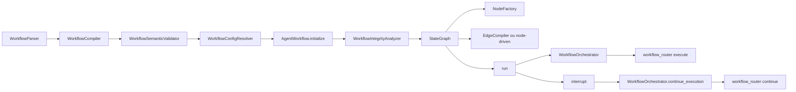

# Manual técnico, operacional e de sintaxe: agente workflow completo

## 1. O que é esta feature

No plano técnico, agente workflow é o subsistema que pega a seção workflows do YAML, transforma esse documento em AST tipada, valida coerência semântica, resolve o workflow ativo, monta um StateGraph LangGraph e expõe execução e retomada pela borda HTTP e pelos orquestradores internos. O valor técnico está em fechar o ciclo YAML -> AST -> validação -> runtime -> pause/continue sem depender de convenções implícitas.

## 2. Que problema ela resolve

O problema técnico resolvido aqui é evitar duas classes de falha. A primeira é executar um fluxo inválido porque o YAML parecia bem formado, mas continha ids conflitantes, labels sem destino, tool inexistente ou sub_workflow quebrado. A segunda é perder continuidade operacional em fluxos com pausa humana, retry ou execução longa. O workflow resolve isso impondo um pipeline técnico de validação e um runtime com thread_id, checkpointer e normalização de resposta.

## 3. Conceitos necessários para entender

### 3.1. Estrutura canônica do estado

O estado do workflow é um TypedDict com messages, input_text, last_output, current_step, metadata, context, variables, status, error_log e max_iterations. Em linguagem prática, messages guarda histórico conversacional, variables guarda dados estruturados compartilhados, metadata guarda trilha operacional e context/last_output fazem a cola entre nodes.

### 3.2. Catálogo oficial de modos

O catálogo de modos suportados pelo runtime nasce do NodeFactory.registry. Essa lista é a referência real do executor e também alimenta o schema/catalog do assembly. Se um modo não estiver ali, não existe no runtime oficial.

### 3.3. Retry policy

retry_policy é a política canônica de repetição por node. Ela aceita max_attempts, backoff_seconds e breaker_threshold. O runtime rejeita chaves não suportadas e unifica a execução via ExecutionPolicyRunner.

### 3.4. Human approval

human_approval.enabled ativa um gate baseado em interrupt. O node pausa a thread, devolve payload serializável e espera a continuação com Command resume. O runtime do projeto preserva esse padrão do LangGraph e o amarra à borda /workflow/continue.

### 3.5. Edge-first

Quando edges existe e não está vazia, o workflow muda para edge-first. Nesse modo, a ordem visual do array de nodes deixa de ser a regra principal de transição. Quem manda são as arestas declaradas e suas condições.

## 4. Como a feature funciona por dentro

O caminho real começa em AgenticAssemblyService. Ao resolver o alvo workflow, o serviço parseia a seção workflows com WorkflowParser, monta AgenticDocumentAST, chama DocumentSemanticValidator e, para esse alvo, delega a WorkflowSemanticValidator. O validador compila a AST para um fragmento YAML canônico e anexa diagnósticos. Esse fragmento é o material governado que o runtime deveria consumir.

Quando a execução começa, WorkflowConfigResolver revisa o payload governado, extrai workflows_defaults, tools_library, local_tools_configuration e memória, resolve o workflow ativo e entrega ActiveWorkflowContext. AgentWorkflow carrega esse contexto, roda WorkflowIntegrityAnalyzer, inicializa ToolsFactory, MemoryFactory e checkpointer, tenta reaproveitar um artefato compilado por hash e, se não houver cache compatível, constrói um StateGraph novo.

Na execução, AgentWorkflow monta o estado inicial, resolve thread_id, aplica recursion_limit quando há loops fora do executor, invoca o grafo de forma assíncrona e normaliza o envelope final. WorkflowOrchestrator transforma isso em OrchestratorResult. WorkflowRouter então expõe o resultado ou agenda execução assíncrona, conforme o modo selecionado.

## 5. Divisão em etapas ou submódulos

### 5.1. AST e schema

Responsabilidade: definir o contrato formal de workflow.

Recebe: YAML agentic.

Entrega: WorkflowAST, WorkflowNodeAST, WorkflowEdgeAST, WorkflowCollectionAST e JSON Schema para UI e tooling.

Valor: impedir que o runtime aceite estrutura sem gramática.

### 5.2. Parse leniente

Responsabilidade: ler o documento e coletar diagnóstico sem interromper cedo demais.

Recebe: workflows bruto do YAML.

Entrega: lista de WorkflowAST, nodes unsupported quando necessário e diagnósticos por path.

Valor: permitir análise rica sem promover texto inválido a fluxo executável.

### 5.3. Compilação canônica

Responsabilidade: normalizar ids de workflow e node e eliminar unsupported da compilação real.

Recebe: lista de WorkflowAST.

Entrega: fragmento YAML canônico com ids estáveis.

Valor: impedir runtime frágil por identificadores ruins.

### 5.4. Validação semântica

Responsabilidade: checar coerência de seleção, catálogo de tools, referências, edges e expressões.

Recebe: workflows compilados, selected_workflow, defaults e tool_catalog efetivo.

Entrega: ValidationReport com compiled_fragment.

Valor: falhar fechado antes do runtime.

### 5.5. Resolução de contexto

Responsabilidade: escolher o workflow ativo e materializar defaults, tools e memória do ponto de vista do runtime.

Recebe: fragmento governado.

Entrega: ActiveWorkflowContext.

Valor: evitar adivinhação de fluxo e centralizar precedência de merge.

### 5.6. Runtime executor

Responsabilidade: montar ou reutilizar StateGraph, executar nodes e consolidar saída.

Recebe: ActiveWorkflowContext e input.

Entrega: final_response, execution_steps, workflow_metadata, outgoing_message e thread_id.

Valor: transformar contrato em execução observável.

### 5.7. Borda HTTP e canais

Responsabilidade: expor execute e continue para API e canais externos.

Recebe: payload HTTP ou mensagem de canal.

Entrega: resposta síncrona, task assíncrona ou retomada HIL.

Valor: conectar o runtime ao produto real.

## 6. Pipeline ou fluxo principal

### 6.1. Parse da seção workflows

WorkflowParser lê workflows. Se workflows não for lista, devolve WORKFLOWS_TIPO_INVALIDO. Se um node vier com modo desconhecido, ele registra NODE_MODE_NAO_SUPORTADO e cria UnsupportedNodeAST. Esse detalhe é importante porque o parser é tolerante, mas o compilador não deixa unsupported seguir adiante.

### 6.2. Compilação canônica

WorkflowCompiler normaliza ids, emite warning quando precisa ajustar identificador e rejeita unsupported da compilação com WORKFLOW_NODE_UNSUPPORTED. Também corrige duplicação de id de node acrescentando sufixo quando necessário.

### 6.3. Validação forte

WorkflowSemanticValidator valida coleção, tools, local_tools_configuration, referências cruzadas, edges e expressões. Se selected_workflow estiver ausente com vários workflows habilitados, produz WORKFLOW_SELECAO_OBRIGATORIA. Se houver sub_workflow autorreferente, produz SUB_WORKFLOW_AUTOREFERENCIA. Se uma edge referenciar origem ou destino inexistente, a validação falha.

### 6.4. Resolução do workflow ativo

WorkflowConfigResolver aplica drift detector, extrai defaults, normaliza workflows, escolhe o workflow ativo e monta ActiveWorkflowContext. Se selected_workflow apontar para fluxo inexistente ou desabilitado, falha cedo. Se houver vários habilitados sem seleção, também falha cedo.

### 6.5. Inicialização do runtime

AgentWorkflow.initialize carrega a config, roda WorkflowIntegrityAnalyzer, inicializa factories e compila o grafo. Se o relatório de integridade vier inválido, lança WorkflowIntegrityError e nem chega a criar o StateGraph.

### 6.6. Construção do grafo

_add_nodes_to_graph registra cada node pelo id. _add_edges_to_graph decide o modo de transição. Se is_edge_mode for verdadeiro, EdgeCompiler compila edges declarativas. Caso contrário, _add_node_driven_edges_to_graph usa a ordem dos nodes e as condições específicas de router, if e executor.

### 6.7. Execução e continuidade

run monta o estado inicial com input_text, messages iniciais, variables vazias, metadata vazia, status running e max_iterations local do executor. Depois invoca o grafo com config contendo thread_id, session_id, correlation_id, user_email e workflow_id. continue_execution repete a inicialização do runtime e chama ainvoke com Command resume na mesma thread.

## 7. Sintaxe completa do workflow

## 7.1. Bloco de seleção

selected_workflow escolhe o workflow ativo. Se existir mais de um workflow habilitado, esse campo deixa de ser opcional na prática.

## 7.2. Bloco de defaults

workflows_defaults agrega defaults compartilhados entre fluxos. O slice lido confirmou consumo de memory, local_tools_configuration e tools_library. O objetivo é reduzir duplicação entre múltiplos workflows do mesmo documento.

## 7.3. Bloco workflows

Cada item de workflows aceita id, name, description, enabled, settings, tools_library, local_tools_configuration, local_mcp_configuration, nodes e edges.

## 7.4. settings

O campo consumido de forma confirmada no runtime é max_iterations. O schema também expõe background_execution_subagent, mas o consumo operacional específico desse subbloco não foi confirmado no slice lido do executor.

## 7.5. nodes

Todos os nodes compartilham os campos comuns id, mode, prompt, reads, writes, tools, params, settings, router, retry_policy e human_approval. Alguns modos ignoram parte desses campos, mas a gramática comum reduz divergência entre implementações.

## 7.6. edges

Cada edge declarativa aceita from, to, when e default. from pode ser START ou um node_id. to pode ser END ou um node_id. when é expressão booleana segura. default só pode aparecer uma vez por origem e não pode coexistir com when na mesma edge.

## 7.7. Comandos e marcadores operacionais importantes

START e END são marcadores de entrada e saída do grafo em edges declarativas.

Command resume é o mecanismo de retomada HIL usado pelo orquestrador e pela borda /workflow/continue.

thread_id é a identidade estável da thread persistida.

execution_mode no endpoint define se a API tenta executar de forma direta ou assíncrona.

workflow.execute é a permissão exigida pela borda HTTP.

## 8. Catálogo de nodes suportados

### 8.1. agent

O que é: node que delega a um LLM possivelmente com tools.

Por que existe: encapsular raciocínio e geração em um passo controlado.

Campos relevantes: prompt.system, tools, retry_policy, human_approval.

Lê: messages, variables, context, input_text.

Escreve: messages, last_output, context, variables.

Pode falhar: por tool inválida, timeout, erro do modelo ou uso legado de retries fora de retry_policy.

### 8.2. set

O que é: node de atribuição declarativa.

Por que existe: inicializar ou consolidar variáveis sem chamar modelo.

Campos relevantes: params.assign.

Lê: input_text, metadata e valores de variables usados em templates.

Escreve: variables.

Pode falhar: assign vazio ou rendering inválido.

### 8.3. if

O que é: bifurcação determinística por expressão.

Por que existe: desviar o fluxo sem chamar LLM.

Campos relevantes: condition, true_go_to, false_go_to.

Lê: variables, messages, input_text.

Escreve: last_output com TRUE ou FALSE e metadata de decisão.

Pode falhar: condição vazia ou expressão inválida.

### 8.4. function

O que é: execução de expressão ou script seguro.

Por que existe: pequenos cálculos, parsing e transformação sem tool externa.

Campos relevantes: params.expression ou params.script, timeout_seconds, result_var, aliases, allowed_functions.

Lê: variables, messages, input_text e context.

Escreve: variables no result_var ou writes.

Pode falhar: timeout, função não permitida, script inválido.

### 8.5. tool

O que é: invocação explícita de uma tool do catálogo.

Por que existe: separar “chamar a tool X” de um agent genérico.

Campos relevantes: params.tool_id, params.arguments, params.extract, timeout_seconds.

Lê: variables, input_text, context.

Escreve: variables extraídas e last_output.

Pode falhar: tool inexistente, argumentos inválidos, timeout ou erro interno da tool.

### 8.6. merge

O que é: consolidador de múltiplas leituras.

Por que existe: juntar payload base e payload dinâmico, ou unir resultados parciais.

Campos relevantes: params.strategy, initial, aliases.

Lê: todos os paths em reads.

Escreve: variables via writes.

Pode falhar: reads vazia ou valor incompatível com a estratégia.

### 8.7. router

O que é: decisão por labels usando LLM e router config.

Por que existe: roteamento sem hardcode de regra única.

Campos relevantes: router.allowed_labels, router.go_to_node, router.fallback_node, prompt.system, retry_policy.

Lê: messages e contexto do prompt.

Escreve: metadata.router_decision, last_output e possivelmente fallback.

Pode falhar: label inválida, destino inexistente ou exaustão do retry.

### 8.8. rule_router

O que é: roteamento por regras determinísticas.

Por que existe: substituir LLM quando a decisão cabe em expressão segura.

Campos relevantes: params.rules, params.default_label e router.go_to_node.

Lê: variables e input_text.

Escreve: label escolhida no metadata.

Pode falhar: regras mal formadas ou expressão inválida.

### 8.9. transform

O que é: node de transformação pré-configurada.

Por que existe: limpeza e adaptação de mensagens ou payloads sem usar modelo.

Campos relevantes: settings.kind e parâmetros específicos da transformação.

Lê: messages, variables, last_output.

Escreve: mensagens ou payload transformado.

Pode falhar: kind inválido ou regex/operação inválida.

### 8.10. planner

O que é: gerador de plano estruturado.

Por que existe: decompor uma tarefa em steps antes da execução iterativa.

Campos relevantes: prompt.system, settings.output_key, cursor_key, enforce_list, coerce_json, auto_ids.

Lê: messages, context, metadata.

Escreve: metadata com plano e cursor.

Pode falhar: JSON ruim, schema de plano inválido ou tool não resolvida.

### 8.11. executor

O que é: executa um passo do plano por vez.

Por que existe: materializar o padrão planner/executor com controle de loop.

Campos relevantes: settings.output_key, cursor_key, emit_step_summary, retry_policy, human_approval, failure_policy.

Lê: metadata do plano e cursor.

Escreve: avanço do cursor, last_output, messages e indicadores de plan_done.

Pode falhar: passo inválido, erro de execução, exaustão do retry ou pedido de revisão humana.

### 8.12. schema_validator

O que é: valida payload contra JSON Schema.

Por que existe: impedir que o fluxo siga com estrutura inválida.

Campos relevantes: params.schema, source, parse_json, on_error.

Lê: last_output ou source configurado.

Escreve: payload validado em writes quando cabível.

Pode falhar: schema ruim, payload inválido ou acionar request_human conforme on_error.

### 8.13. sub_workflow

O que é: chama outro workflow como subfluxo.

Por que existe: modularizar processos maiores.

Campos relevantes: params.workflow_id, inherit_variables, inherit_metadata, inherit_messages, input_value, input_path, result_path.

Lê: input_text, variables, messages.

Escreve: resultado do filho no result_path ou writes.

Pode falhar: workflow inexistente, autorreferência ou recursão detectada.

### 8.14. whatsapp_media_resolver

O que é: resolve mídia para payload WhatsApp.

Por que existe: transformar URL em media_id pronto para canal.

Campos relevantes: payload_path, write_path, product_list_key, caption_field, url_field, media_type, cache_ttl_seconds, allow_url_fallback.

Lê: payload estruturado com produtos.

Escreve: variables com payload enriquecido por media_id.

Pode falhar: payload ausente, cache indisponível ou upload sem fallback possível.

### 8.15. whatsapp_send

O que é: monta a mensagem final estruturada do canal.

Por que existe: separar preparação de envio do resto da lógica de negócios.

Campos relevantes: payload_path, write_path, product_list_key e text_key.

Lê: payload resolvido.

Escreve: outgoing_message estruturado.

Pode falhar: payload inválido ou ausência de conteúdo esperado.

## 9. Configurações que mudam o comportamento

selected_workflow muda o alvo ativo.

enabled muda a elegibilidade do fluxo.

settings.max_iterations muda recursion_limit e limite do executor quando aplicável.

tools_library muda o catálogo local do workflow.

local_tools_configuration muda overrides de tools.

retry_policy muda resiliência por node.

human_approval muda se um node pausa ou não.

failure_policy do executor muda se a falha encerra, só loga ou pede humano.

edges muda toda a estratégia de transição.

## 10. Contratos de API, execução e retomada

Em /workflow/execute, WorkflowRequest exige message e user_email e aceita thread_id, format, correlation_id, encrypted_data, execution_mode e estimated_duration_seconds. O router autentica com workflow.execute, resolve o YAML, escolhe modo híbrido e delega para WorkflowExecutionService e WorkflowOrchestrator.

Em /workflow/continue, WorkflowContinueRequest exige thread_id, correlation_id e human_response. O router normaliza o thread_id com _require_continue_thread_id e não cria fallback silencioso. Depois hidrata config, instancia WorkflowOrchestrator e chama continue_execution.

Em canais, ChannelExecutionEngine reutiliza WorkflowOrchestrator em _execute_workflow e transforma outgoing_message em OutgoingMessage tipado para responders.

## 11. O que acontece em caso de sucesso

No sucesso síncrono, run devolve success verdadeiro, final_response, execution_steps, thread_id, workflow_metadata, channel_response e outgoing_message quando houver. WorkflowOrchestrator embala isso em OrchestratorResult e o router serializa a resposta final.

No sucesso com pausa humana, o estado intermediário expõe metadata com requires_human ou status paused e um thread_id reutilizável. A conclusão real vem na chamada /workflow/continue.

## 12. O que acontece em caso de erro

### 12.1. Falha de parse

Sintoma: diagnósticos como WORKFLOWS_TIPO_INVALIDO, NODE_TIPO_INVALIDO ou EDGE_TIPO_INVALIDO.

Reação: o parser devolve diagnóstico e fragmento parcial; o runtime não deveria consumir payload não confirmado.

### 12.2. Falha de validação semântica

Sintoma: WORKFLOW_SELECIONADO_INEXISTENTE, WORKFLOW_SELECAO_OBRIGATORIA, WORKFLOW_TOOL_INEXISTENTE, SUB_WORKFLOW_INEXISTENTE.

Reação: ValidationReport inválido e bloqueio de confirm.

### 12.3. Falha de integridade runtime

Sintoma: WorkflowIntegrityError antes da compilação do grafo.

Reação: AgentWorkflow.initialize aborta sem inicializar factories ou StateGraph.

### 12.4. Falha de execução do node

Sintoma: erro registrado pelo ExecutionPolicyRunner, error_log ou exception no orquestrador.

Reação: retry até o limite, breaker quando aplicável e propagação do erro quando esgotado.

### 12.5. Falha de retomada

Sintoma: 400 por thread_id ausente ou 404 por thread/checkpoint não encontrado.

Reação: router falha cedo e não inventa thread nova.

## 13. Observabilidade e diagnóstico

O runtime registra execution_trace em metadata, data_flow com reads/writes por node, read_snapshots e write_snapshots, além de logs estruturados com marcadores como WORKFLOW_EXECUTION_START, WORKFLOW_EDGE_TRANSITION, WORKFLOW_INTEGRITY_ERROR e ORCHESTRATOR_END. O diagnóstico real costuma seguir esta ordem.

1. Confirmar workflow_id e thread_id.
2. Confirmar se o problema veio da validação ou do runtime.
3. Ver execution_trace, workflow_metadata e error_log.
4. Revisar router_decision, if_results, plan cursor ou writes relevantes.

## 14. Estado da arte e comparação

O LangGraph oficial posiciona workflows como fluxos com trilhas predeterminadas, distintos de agentes mais dinâmicos. Também recomenda StateGraph como base, interrupt para human-in-the-loop e Command resume com o mesmo thread_id para continuidade.

O projeto segue esse núcleo, mas adiciona uma camada de governança que não é padrão em exemplos básicos do framework. Em vez de construir o grafo manualmente em código, ele passa por AST, schema, parser, compiler, validator e drift detector. Isso é mais pesado do que os exemplos oficiais de prompt chaining, routing, orchestrator-worker ou evaluator-optimizer, mas responde a uma necessidade empresarial diferente: controlar o contrato antes da execução.

Na prática, o runtime atual está mais próximo do estado da arte de workflows governados do que de um tutorial LangGraph puro. Ao mesmo tempo, ele ainda mantém algumas lacunas típicas de produto em evolução, como campos expostos no contrato cujo consumo operacional específico não ficou provado no slice lido.

## 15. Exemplos práticos guiados

### 15.1. Exemplo real de edge-first

workflow_edge_first_demo mostra from START para classificar_pedido, condições when olhando metadata.router_decision e uma edge default por origem. Esse exemplo ensina a sintaxe de edges e a diferença entre rota condicionada e rota default.

### 15.2. Exemplo real de planner/executor

O fluxo Planejamento Estratégico Food Service usa planner, executor e finalize. Ele prova que planner grava plano estruturado e executor itera com retry_policy e failure_policy request_human.

### 15.3. Exemplo real de social commerce Instagram

workflow_instagram_comment_followup usa set, agent, function e merge para produzir um payload final de reply público e DM. Ele mostra como reads, writes e last_output formam uma esteira de dados entre nodes.

### 15.4. Exemplo real de WhatsApp multimídia

workflow_food_whatsapp_atendimento usa whatsapp_media_resolver e whatsapp_send para sair de um payload de produtos com URLs para um outgoing_message pronto para o canal.

## 16. Explicação 101

Tecnicamente, workflow é como uma linha de produção com peças padrão. O YAML descreve a linha. A AST confere se a planta está legível. O validator verifica se a linha faz sentido. O runtime liga a esteira. O thread_id marca qual carrinho está passando por ela. Se alguém interromper a linha para aprovação humana, o sistema usa esse identificador para retomar do mesmo processo, e não de outro inventado depois.

## 17. Limites e pegadinhas

Não trate a presença de um campo no schema como prova de consumo operacional específico. Alguns campos estão confirmados no contrato, mas não no slice executor lido.

Não trate continue_execution como novo execute. Ele depende da mesma thread.

Não trate interrupt como simples mensagem. Antes dele é preciso ter checkpointer e identidade estável.

Não trate edge-first e node-driven como equivalentes de manutenção. Edge-first é mais explícito para auditoria; node-driven é mais compacto para fluxos lineares.

## 18. Troubleshooting

### 18.1. Sintoma: selected_workflow rejeitado

Causa provável: selected_workflow inexistente, desabilitado ou ambiguidade de múltiplos workflows habilitados.

Como confirmar: revisar WorkflowSemanticValidator e WorkflowConfigResolver.

### 18.2. Sintoma: falha antes de compilar o grafo

Causa provável: WorkflowIntegrityAnalyzer encontrou node sem prompt obrigatório, destino inexistente ou contrato edge quebrado.

Como confirmar: inspecionar _workflow_integrity_report e logs de WORKFLOW_INTEGRITY_ERROR.

### 18.3. Sintoma: router sem destino

Causa provável: allowed_labels não bate com go_to_node, label devolvida inválida ou fallback mal definido.

Como confirmar: revisar router.allowed_labels, go_to_node, fallback_node e metadata.router_decision.

### 18.4. Sintoma: continue retorna 400

Causa provável: thread_id vazio, só com espaços ou human_response ausente.

Como confirmar: revisar _require_continue_thread_id e payload enviado.

### 18.5. Sintoma: continue retorna 404

Causa provável: thread/checkpoint inexistente para a combinação informada.

Como confirmar: verificar storage do checkpointer e logs da retomada.

## 19. Diagramas

## 20. Mapa de navegação conceitual

Quando a dúvida é gramática, o ponto certo é ast/workflow.py e schema_service.py. Quando a dúvida é parse e diagnóstico, o ponto certo é workflow_parser.py. Quando a dúvida é coerência, o ponto certo é workflow_semantic_validator.py e integrity_analyzer.py. Quando a dúvida é execução real, o ponto certo é agent_workflow.py, orchestrator e workflow_router.py. Quando a dúvida é comportamento de um modo específico, o ponto certo é nodes/base.py mais o handler daquele modo.

## 21. Como colocar para funcionar

O caminho confirmado pelo código é:

1. Resolver um YAML agentic com seção workflows válida.
2. Garantir selected_workflow coerente quando necessário.
3. Passar pela borda /workflow/execute com autenticação compatível com workflow.execute.
4. Observar thread_id, correlation_id e workflow_metadata devolvidos.
5. Se houver pausa humana, chamar /workflow/continue com o mesmo thread_id e human_response.

O slice lido confirma esse caminho por leitura de código e testes, mas esta tarefa não executou um fluxo manual real nem a suíte oficial completa.

## 22. Exercícios guiados

Exercício 1. Compare workflow_edge_first_demo com um fluxo linear node-driven e explique qual deles torna a transição mais explícita para auditoria.

Exercício 2. Pegue o workflow de Instagram e identifique, node por node, onde o estado muda de input_text para payload estruturado.

Exercício 3. Pegue o workflow de WhatsApp e explique por que resolver mídia e montar outgoing_message são nodes diferentes.

## 23. Checklist de entendimento

- Entendi o pipeline YAML -> AST -> validação -> runtime.
- Entendi quando selected_workflow é obrigatório.
- Entendi os dois modos de transição.
- Entendi o papel de retry_policy e human_approval.
- Entendi o catálogo de nodes suportados.
- Entendi o contrato dos endpoints execute e continue.
- Entendi como diagnosticar falha de validação, integridade e runtime.

## 24. Evidências no código

- src/config/agentic_assembly/assembly_service.py
  - Motivo da leitura: confirmar ciclo parse, validate e fragmento governado.
  - Símbolo relevante: _parse_document_from_yaml, _validate_document, _select_fragment.
  - Comportamento confirmado: workflow entra no assembly AST oficial.

- src/config/agentic_assembly/schema_service.py
  - Motivo da leitura: confirmar schemas e catálogo expostos para workflow.
  - Símbolo relevante: AgenticAssemblySchemaService.
  - Comportamento confirmado: workflow_modes nascem de NodeFactory e safe_functions são publicados.

- src/agentic_layer/workflow/config_resolver.py
  - Motivo da leitura: confirmar seleção do workflow ativo e merge de defaults.
  - Símbolo relevante: WorkflowConfigResolver, ActiveWorkflowContext.
  - Comportamento confirmado: múltiplos workflows habilitados exigem seleção explícita.

- src/agentic_layer/workflow/workflow_state.py
  - Motivo da leitura: confirmar contrato de estado.
  - Símbolo relevante: WorkflowState.
  - Comportamento confirmado: chaves canônicas do state compartilhado.

- src/agentic_layer/workflow/nodes/base.py
  - Motivo da leitura: confirmar comportamento comum dos handlers.
  - Símbolo relevante: BaseNodeHandler.
  - Comportamento confirmado: reads, writes, retry_policy, human_approval e execution_trace.

- src/agentic_layer/workflow/execution_policy.py
  - Motivo da leitura: confirmar retry e breaker.
  - Símbolo relevante: ExecutionPolicyRunner.
  - Comportamento confirmado: max_attempts, backoff_seconds e breaker_threshold.

- src/orchestrators/workflow_orchestrator.py
  - Motivo da leitura: confirmar execute e continue_execution.
  - Símbolo relevante: WorkflowOrchestrator.
  - Comportamento confirmado: retomada usa Command resume e reaproveita thread_id.

- src/api/routers/workflow_router.py
  - Motivo da leitura: confirmar contrato HTTP e falha sem fallback na retomada.
  - Símbolo relevante: WorkflowRequest, WorkflowContinueRequest, execute_workflow, continue_workflow.
  - Comportamento confirmado: /workflow/continue exige thread_id válido.
