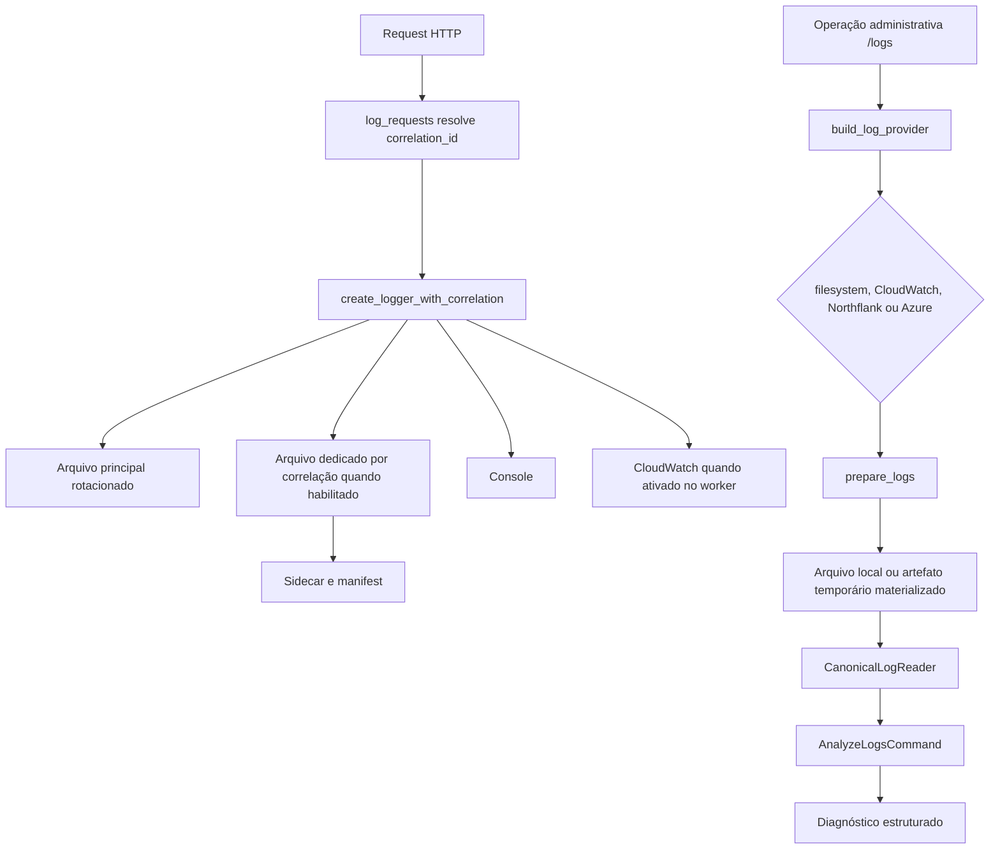

# Manual técnico e operacional: arquitetura de logs com correlation ID, saída em arquivo, CloudWatch e providers administrativos

## 1. Objetivo deste manual

Este manual descreve o caminho técnico real do logging no código: onde o correlation_id nasce, como ele entra no contexto, quando o runtime escreve em arquivo local ou arquivo dedicado por correlação, como o CloudWatch é anexado, como a leitura administrativa resolve providers e como investigar problemas quando a arquitetura não se comporta como esperado.

O objetivo não é repetir o conceito geral de logging. O objetivo é explicar o mecanismo real desta plataforma.

## 2. Entry points reais

Os entry points mais importantes confirmados no código são estes.

1. O middleware HTTP de request em src/api/service_api.py.
2. O factory create_logger_with_correlation em src/core/logging_system.py.
3. O bootstrap de startup da API que ativa CloudWatch no ciclo do worker em src/api/service_api.py.
4. Os endpoints administrativos em src/api/routers/logs_router.py.
5. O serviço de provider canônico em src/api/services/log_provider_service.py.
6. O leitor canônico em src/api/services/canonical_log_reader.py.

## 3. Ciclo de vida do correlation_id

O ciclo técnico do correlation_id segue esta ordem.

1. A API olha primeiro request.state.correlation_id.
2. Se não houver valor no state, ela tenta o header X-Correlation-Id.
3. Se também não houver header, ela gera novo ID por CorrelationIdFactory.
4. O valor efetivo passa por normalize_correlation_id.
5. O ID é gravado em request.state.correlation_id.
6. O middleware registra set_request_origin e set_request_correlation_id no contexto local.
7. A resposta devolve X-Correlation-Id.
8. Quando a resposta é JSON e ainda não possui correlationId ou correlation_id, o middleware injeta correlationId no body.

Esse ponto é importante porque o correlation_id não serve apenas para logging. Ele também entra no contrato HTTP de resposta.

## 4. Escrita de logs em runtime

### 4.1. Enriquecimento do evento

O runtime usa um formatter estruturado e um pipeline de processors do structlog. Esse pipeline faz quatro coisas relevantes.

1. Mistura contextvars com o evento corrente.
2. Achata campos vindos de extra.
3. Resolve correlation_id, run_id, parent_run_id e child_run_id quando disponíveis.
4. Sanitiza campos sensíveis antes de serializar.

O resultado é um payload JSON estruturado em vez de texto solto.

### 4.2. Arquivo principal rotacionado

Quando enable_file_logging está ativo, o runtime cria um RotatingFileHandler apontando para log_file_path ou para o nome equivalente dentro de log_output_directory. Esse é o backbone de escrita contínua do processo.

As configurações mais relevantes confirmadas para esse arquivo são estas.

1. log_file_path.
2. log_output_directory.
3. log_file_rotation_max_bytes.
4. log_file_rotation_backup_count.

### 4.3. Console

Quando enable_console_logging está ativo, o runtime adiciona StreamHandler para stdout usando o mesmo formatter estruturado. Essa saída é útil em container, debug local e plataformas que coletam stdout como trilha operacional.

### 4.4. Arquivo dedicado por correlação

Quando enable_correlation_file_logging está ativo e o correlation_id é elegível para isolamento, create_logger_with_correlation cria um FileHandler específico para aquele caso.

O desenho observado no código tem estas características.

1. O nome do arquivo é determinístico e derivado de create_correlation_log_filename.
2. O arquivo fica em log_correlation_directory, relativo a log_output_directory quando aplicável.
3. O handler aplica um filtro de isolamento para impedir que eventos de outra correlação vazem para o arquivo dedicado.
4. O logger específico não propaga para o root em ambiente normal, reduzindo duplicidade.

### 4.5. Sidecar e manifest

Ao criar o logger por correlação, o runtime também grava metadados auxiliares.

1. Um sidecar com origem e nome do arquivo efetivo.
2. Uma entrada append-only em correlation_manifest.jsonl.

Esses artefatos existem para tornar lookup e reconstrução de família mais previsíveis.

## 5. CloudWatch na escrita de runtime

### 5.1. Regra de adiamento

O código não anexa o CloudWatch imediatamente no bootstrap genérico. O runner da API chama defer_cloudwatch_until_worker e, depois, no ciclo de startup do processo HTTP, a aplicação chama activate_cloudwatch_for_worker.

Na prática, isso significa que o CloudWatch é tratado como capacidade de saída que pode ser ativada por worker, e não como handler sempre anexado logo no começo do bootstrap.

### 5.2. Quando o handler é criado

O handler compartilhado de CloudWatch só é obtido quando estas condições são verdadeiras.

1. enable_cloudwatch_logging está ativo.
2. O adiamento já foi liberado.
3. A configuração efetiva do runtime precisa anexar o handler naquele processo.

Se o processo mudou de PID, o cache do handler é invalidado e o código reconstrói a instância adequada.

### 5.3. Configurações relevantes

As configurações confirmadas no código para CloudWatch de escrita incluem.

1. enable_cloudwatch_logging.
2. cloudwatch_log_group.
3. cloudwatch_log_stream_prefix.
4. cloudwatch_region_name.
5. cloudwatch_create_log_group.
6. cloudwatch_retention_days.
7. cloudwatch_use_queues.
8. cloudwatch_retention_retry_attempts.
9. cloudwatch_retention_retry_wait_seconds.
10. cloudwatch_retention_retry_wait_max_seconds.

## 6. Faulthandler e logs de baixo nível

O runtime também tem suporte a faulthandler com diretório canônico de logs. Esse mecanismo não substitui o log de negócio. Ele é complementar para falhas de baixo nível, como travamentos e dumps de threads.

O arquivo segue o padrão faulthandler_pid.log dentro do diretório canônico de logs.

## 7. Providers canônicos de leitura

### 7.1. Regra de resolução do provider ativo

O código usa resolve_active_log_provider_type para decidir o provider administrativo.

O comportamento confirmado é este.

1. Se environment for development, o provider ativo é sempre filesystem.
2. Fora de development, log_provider_type precisa ser explicitamente configurado.
3. Os valores aceitos no slice lido são filesystem, aws_cloudwatch, northflank e azure.
4. Valor ausente ou inválido fora de development gera erro explícito.

### 7.2. Filesystem provider

O provider filesystem trabalha diretamente sobre diretório de logs materializado localmente.

Ele exige pelo menos um seletor entre.

1. correlation_id.
2. log_name.
3. all_logs igual a true.

Sem isso, a análise local falha com erro explícito.

### 7.3. AWS CloudWatch provider

O provider AWS CloudWatch resolve log_group pelo request ou pela configuração do ambiente. Além disso, ele exige pelo menos um seletor útil entre correlation_id, filter_pattern, stream_prefix ou janela temporal.

Quando os filtros estão corretos, o provider chama materialize_cloudwatch_logs, consulta os eventos remotos e grava um arquivo temporário local para análise downstream.

### 7.4. Northflank provider

O provider Northflank exige project_id e token. Também precisa de ao menos um workload alvo resolvido, seja por request ou por ambiente. O retorno da API é convertido em linhas textuais com prefixo do workload antes da materialização local.

### 7.5. Azure provider

O provider Azure usa Azure Log Analytics. Ele exige workspace_id, query e credenciais de tenant, client_id e client_secret para obter access_token. O retorno tabular é transformado em linhas JSON materializadas localmente.

## 8. Leitor canônico e família de logs

O CanonicalLogReader é a camada que organiza arquivos locais já existentes ou materializados. Ele não trata cada arquivo como entidade isolada. Ele tenta descobrir a família operacional da mesma correlação.

As responsabilidades confirmadas incluem.

1. Resolver diretório de logs real.
2. Identificar rotação.
3. Inferir papel do arquivo como api, worker, scheduler ou correlacionado.
4. Ordenar a família de forma estável.
5. Usar manifest e sidecar quando necessário para reencontrar o arquivo certo.

## 9. Endpoints administrativos de logs

O boundary HTTP administrativo em src/api/routers/logs_router.py expõe estas operações principais.

1. analyze.
2. list.
3. telemetry.
4. delete.
5. analyze-ui.

O ponto importante é que esses endpoints não acessam diretório ou provider de forma ad hoc. Eles passam pelo serviço administrativo e pelo provider canônico.

## 10. Serviço administrativo de análise

analyze_logs_via_admin_provider faz a orquestração principal da análise administrativa.

O fluxo real é este.

1. Resolve o user_email efetivo.
2. Instancia o provider canônico com correlation_id administrativo próprio.
3. Chama prepare_logs no provider concreto.
4. Coleta cleanup_paths para artefatos temporários.
5. Monta yaml mínimo para o comando de análise.
6. Executa AnalyzeLogsCommand com logs_dir, correlation_target, log_name_target e include_rotated conforme o provider preparado.
7. Limpa artefatos temporários no finally.

Isso mostra por que a materialização remota existe: o comando de análise recebe um contrato local unificado, independentemente da origem real.

## 11. Pipeline técnico de ponta a ponta

## 12. Configurações que mais mudam comportamento

Estas são as configurações mais relevantes confirmadas no código.

1. log_level.
2. log_format.
3. enable_console_logging.
4. enable_file_logging.
5. log_output_directory.
6. log_file_path.
7. log_file_rotation_max_bytes.
8. log_file_rotation_backup_count.
9. log_correlation_directory.
10. enable_correlation_file_logging.
11. enable_cloudwatch_logging.
12. cloudwatch_log_group.
13. cloudwatch_log_stream_prefix.
14. cloudwatch_region_name.
15. environment.
16. log_provider_type.
17. log_provider_http_timeout_seconds.
18. log_provider_retry_attempts.
19. log_provider_retry_wait_seconds.

## 13. O que acontece em caso de sucesso

No caminho feliz, a API responde com X-Correlation-Id, o runtime registra eventos estruturados nos destinos habilitados, o sidecar e o manifest refletem a correlação quando houver arquivo dedicado, e a operação administrativa consegue preparar o material correto para análise.

No provider remoto, sucesso significa duas coisas.

1. Os eventos foram encontrados na origem remota.
2. O resultado foi materializado localmente e entregue ao pipeline downstream.

## 14. O que acontece em caso de erro

Os erros mais relevantes confirmados no código são estes.

1. Correlation_id ausente no request não é problema fatal, porque o middleware gera um novo ID.
2. Filesystem sem correlation_id, sem log_name e sem all_logs falha com erro 400.
3. CloudWatch sem log_group falha com erro 400.
4. CloudWatch sem seletor de busca útil falha com erro 400.
5. CloudWatch com erro de credencial ou API falha com erro 502.
6. Northflank sem token ou sem target resolvido falha explicitamente.
7. Azure sem workspace_id, query ou credenciais falha explicitamente.
8. Provider inválido fora de development gera RuntimeError em vez de fallback silencioso.

## 15. Observabilidade e diagnóstico

A sequência de investigação mais confiável é esta.

1. Confirmar o X-Correlation-Id da execução.
2. Confirmar o environment efetivo.
3. Confirmar se o provider ativo esperado é filesystem ou provider remoto.
4. Confirmar se a escrita em arquivo dedicado por correlação estava habilitada.
5. Confirmar se a execução usou apenas arquivo compartilhado ou também sidecar e manifest.
6. Confirmar, no caso de CloudWatch, se o stream foi ativado naquele worker.
7. Confirmar, no caso administrativo, se prepare_logs materializou um artefato local válido.

## 16. Como colocar para funcionar

### 16.1. Caminho mínimo em development

O código confirma este comportamento.

1. environment em development.
2. Provider administrativo forçado para filesystem.
3. enable_file_logging e ou enable_correlation_file_logging ativos.
4. API devolvendo X-Correlation-Id.

Nesse cenário, a investigação básica acontece toda sobre arquivos locais.

### 16.2. Caminho com CloudWatch

Para CloudWatch entrar como saída de escrita, o mínimo confirmado no código é.

1. enable_cloudwatch_logging verdadeiro.
2. cloudwatch_log_group configurado.
3. cloudwatch_region_name coerente quando necessário.
4. Credenciais AWS válidas para o processo.
5. Ativação no ciclo do worker.

### 16.3. Caminho com provider remoto de leitura

Fora de development, o mínimo confirmado é.

1. log_provider_type explícito.
2. Configurações específicas do provider ativo.
3. Permissão administrativa para os endpoints de logs.

## 17. Exemplos práticos guiados

### 17.1. Ler família local por correlation_id

Cenário: um operador tem o X-Correlation-Id da resposta da API e quer entender a execução inteira.

O provider filesystem prepara o diretório local, o leitor canônico identifica arquivos de API, worker e scheduler, e o comando de análise trabalha sobre a família organizada.

### 17.2. Consultar CloudWatch por correlação

Cenário: a execução ocorreu em ambiente AWS e o operador não quer varrer stream manualmente.

O provider CloudWatch usa correlation_id ou janela temporal como seletor, consulta a API, materializa o resultado em arquivo local temporário e entrega esse arquivo ao analisador.

### 17.3. Ambiente multi-plataforma de observabilidade

Cenário: um cliente usa filesystem em desenvolvimento, CloudWatch em uma instalação e Northflank ou Azure em outra.

O fluxo administrativo continua o mesmo porque o boundary resolve provider e materializa a origem antes da análise.

## 18. Explicação 101

O runtime de logging aqui funciona como duas linhas de trabalho complementares. A primeira escreve a história enquanto o processo está vivo. A segunda reencontra essa história depois, mesmo que ela tenha sido gravada em lugar diferente. O correlation_id é a etiqueta que liga as duas linhas.

## 19. Limites e pegadinhas

1. O arquivo dedicado por correlação não é garantido para todo e qualquer ID; ele depende de elegibilidade e configuração.
2. CloudWatch de escrita não elimina a necessidade do provider CloudWatch de leitura administrativa.
3. Development sempre força filesystem na leitura administrativa; isso muda o comportamento percebido entre ambientes.
4. O provider remoto não devolve relatório vazio quando a configuração mínima está errada; ele falha explicitamente.
5. Sidecar e manifest ajudam no lookup, mas não substituem o arquivo de log em si.

## 20. Troubleshooting

### 20.1. Sintoma: a resposta da API devolve correlação, mas não há arquivo dedicado correspondente

Causa provável: o fluxo usou logger compartilhado ou o ID não foi tratado como elegível para arquivo dedicado.

### 20.2. Sintoma: a análise local retorna erro 400 sem sequer começar

Causa provável: faltou correlation_id, log_name ou all_logs no provider filesystem.

### 20.3. Sintoma: CloudWatch está habilitado, mas nenhum stream aparece no processo

Causa provável: a ativação no ciclo do worker não ocorreu naquele processo ou o handler não foi anexado.

### 20.4. Sintoma: produção quebra ao tentar analisar logs, mas development funciona

Causa provável: environment fora de development sem log_provider_type válido.

### 20.5. Sintoma: provider remoto responde, mas a análise não acha eventos

Causa provável: filtro, stream_prefix, query ou janela temporal incompatíveis com a execução analisada.

## 21. Checklist de entendimento

- Entendi onde o correlation_id nasce.
- Entendi como ele volta no contrato HTTP.
- Entendi a diferença entre log compartilhado e log dedicado por correlação.
- Entendi o papel do sidecar e do manifest.
- Entendi quando o CloudWatch é anexado.
- Entendi como filesystem, CloudWatch, Northflank e Azure entram na leitura administrativa.
- Entendi por que a análise usa materialização local temporária.
- Entendi como investigar erro de provider e erro de lookup.

## 22. Evidências no código

- src/api/service_api.py
  - Motivo da leitura: middleware HTTP, injeção de correlationId na resposta e ativação do CloudWatch no ciclo do worker.
  - Comportamento confirmado: correlation_id é resolvido na borda, volta no header e o startup ativa CloudWatch por worker.

- src/core/logging_system.py
  - Motivo da leitura: normalize_correlation_id, setup do runtime, arquivo rotacionado, arquivo dedicado e integração com CloudWatch.
  - Comportamento confirmado: a topologia de handlers depende das flags de runtime e do adiamento do CloudWatch.

- src/core/log_origin_metadata.py
  - Motivo da leitura: contexto de request, sidecar e manifest.
  - Comportamento confirmado: o runtime persiste metadados de origem e mantém índice append-only por correlação.

- src/api/services/log_provider_service.py
  - Motivo da leitura: filesystem, CloudWatch, Northflank, Azure e resolução do provider ativo.
  - Comportamento confirmado: development força filesystem e produção exige provider explícito.

- src/api/services/canonical_log_reader.py
  - Motivo da leitura: reconstrução de família e classificação de papel operacional dos arquivos.
  - Comportamento confirmado: a leitura canônica ordena e classifica logs como api, worker, scheduler ou correlacionado.

- src/analysis/cloudwatch_log_fetcher.py
  - Motivo da leitura: consulta e materialização de eventos do CloudWatch.
  - Comportamento confirmado: o provider busca, filtra e grava artefato temporário local para análise downstream.

- src/api/routers/logs_router.py
  - Motivo da leitura: confirmar endpoints administrativos de análise, listagem, telemetria e exclusão.
  - Comportamento confirmado: o boundary de logs passa pelo provider canônico, sem leitura ad hoc.

- src/api/services/logs_admin_service.py
  - Motivo da leitura: confirmar orquestração da análise administrativa e limpeza dos artefatos temporários.
  - Comportamento confirmado: o serviço prepara a fonte, executa AnalyzeLogsCommand e remove o material temporário no final.
